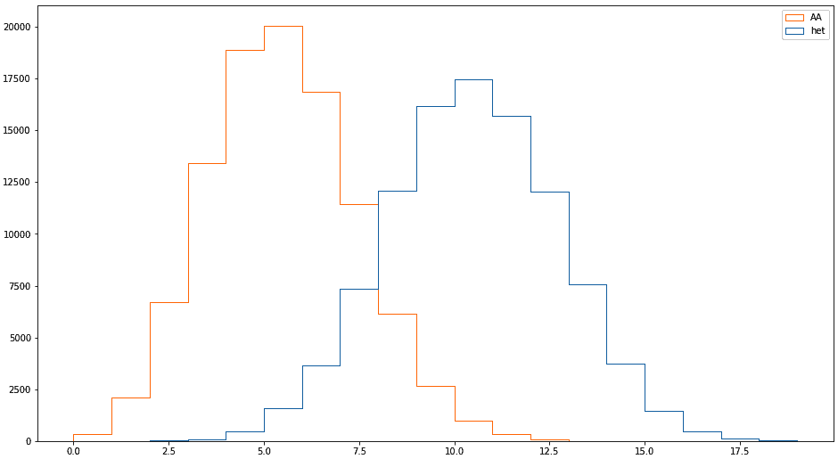
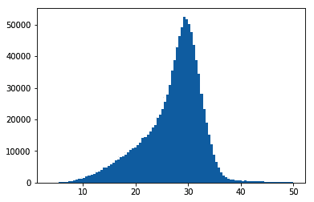
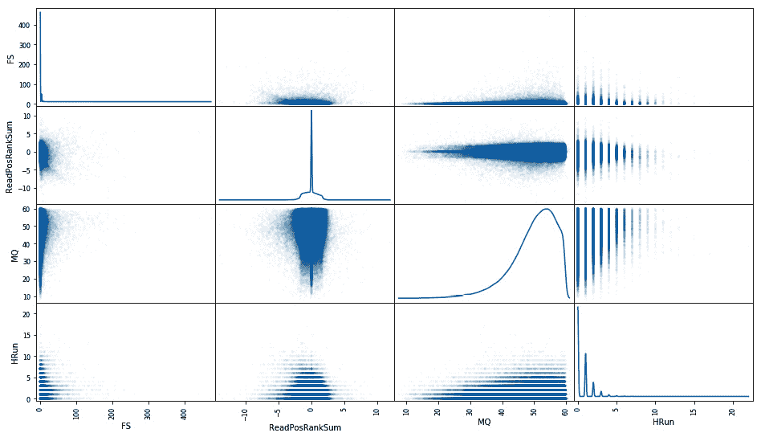

# 四、高级 NGS 数据处理

如果你处理**下一代测序** ( **NGS** )数据，你就会知道质量分析和处理是获得结果的两大耗时环节。在本章的第一部分，我们将通过使用包含亲属信息的数据集来更深入地研究 NGS 分析——在我们的例子中，是母亲、父亲和大约 20 个后代。这是执行质量分析的常用技术，因为谱系信息将允许我们对我们的过滤规则可能产生的错误数量进行推断。我们还将利用这个机会，使用相同的数据集，根据现有的注释来寻找基因组特征。

本章的最后一个方法将利用 NGS 数据深入研究另一个高级主题:宏基因组学。我们将使用宏基因组学的 Python 包 QIIME2 来分析数据。

如果您使用 Docker，请使用 tiagoantao/bioinformatics_base 图像。QIIME2 内容有一个特殊的设置过程，将在相关配方中讨论。

在本章中，有以下配方:

*   准备用于分析的数据集
*   利用孟德尔误差信息进行质量控制
*   使用标准统计数据探索数据
*   从测序注释中寻找基因组特征
*   用 QIIME2 做宏基因组学

# 准备用于分析的数据集

我们的起点将是一个 VCF 文件(或等效文件),其中包含由基因分型器(**基因组分析工具包**(在我们的例子中为 **GATK** )发出的调用，包括注释。由于我们将过滤 NGS 数据，我们需要可靠的决策标准来调用一个站点。那么，我们如何获得这些信息呢？一般情况下，我们不能，但如果我们需要这样做，有三种基本方法:

*   使用更强大的测序技术进行比较——例如，使用桑格测序来验证 NGS 数据集。这在成本上是不允许的，并且只能对少数位点进行。
*   对密切相关的个体进行测序，例如，双亲及其后代。在这种情况下，我们使用孟德尔遗传规则来决定某个呼叫是否可以接受。这是人类基因组计划和冈比亚按蚊 1000 基因组计划使用的策略。
*   最后，我们可以使用模拟。这种设置不仅相当复杂，而且可靠性也不可靠。这更像是一种理论上的选择。

在这一章中，我们将使用第二种选择，基于冈比亚按蚊 1000 基因组计划。这个项目提供了基于蚊子杂交的信息。一个杂交将包括父母(父母)和多达 20 个后代。

在本食谱中，我们将准备我们的数据，以便在后面的食谱中使用。

## 准备就绪

为了加快处理速度，我们将下载 HDF5 格式的文件。请注意，这些文件相当大；您需要良好的网络连接和足够的磁盘空间:

```py
wget -c ftp://ngs.sanger.ac.uk/production/ag1000g/phase1/AR3/variation/main/hdf5/ag1000g.phase1.ar3.pass.3L.h5
wget -c ftp://ngs.sanger.ac.uk/production/ag1000g/phase1/AR3/variation/main/hdf5/ag1000g.phase1.ar3.pass.2L.h5
```

这些档案有四个杂交，每个杂交大约有 20 个后代。我们将使用 3L 和 2L 的染色体臂。在这一阶段，我们还计算孟德尔误差(这是下一个配方的主题，因此我们将推迟到那时再详细讨论)。

相关笔记本是`Chapter04/Preparation.py`。在名为`samples.tsv`的目录中还有一个本地样本元数据文件。

## 怎么做……

下载完数据后，遵循以下步骤:

1.  首先从几个导入开始:

    ```py
    import pickle
    import gzip
    import random
    import numpy as np
    import h5py
    import pandas as pd
    ```

2.  让我们获取样本元数据:

    ```py
    samples = pd.read_csv('samples.tsv', sep='\t')
    print(len(samples))
    print(samples['cross'].unique())
    print(samples[samples['cross'] == 'cross-29-2'][['id', 'function']])
    print(len(samples[samples['cross'] == 'cross-29-2']))
    print(samples[samples['function'] == 'parent'])
    ```

我们也打印一些关于我们将要使用的杂交和所有亲本的基本信息。

1.  我们准备根据其 HDF5 文件处理染色体臂 3L:

    ```py
    h5_3L = h5py.File('ag1000g.crosses.phase1.ar3sites.3L.h5', 'r')
    samples_hdf5 = list(map(lambda sample: sample.decode('utf-8'), h5_3L['/3L/samples']))
    calldata_genotype = h5_3L['/3L/calldata/genotype']
    MQ0 = h5_3L['/3L/variants/MQ0']
    MQ = h5_3L['/3L/variants/MQ']
    QD = h5_3L['/3L/variants/QD']
    Coverage = h5_3L['/3L/variants/Coverage']
    CoverageMQ0 = h5_3L['/3L/variants/CoverageMQ0']
    HaplotypeScore = h5_3L['/3L/variants/HaplotypeScore']
    QUAL = h5_3L['/3L/variants/QUAL']
    FS = h5_3L['/3L/variants/FS']
    DP = h5_3L['/3L/variants/DP']
    HRun = h5_3L['/3L/variants/HRun']
    ReadPosRankSum = h5_3L['/3L/variants/ReadPosRankSum']
    my_features = {
        'MQ': MQ,
        'QD': QD,
        'Coverage': Coverage,
        'HaplotypeScore': HaplotypeScore,
        'QUAL': QUAL,
        'FS': FS,
        'DP': DP,
        'HRun': HRun,
        'ReadPosRankSum': ReadPosRankSum
    }
    num_features = len(my_features)
    num_alleles = h5_3L['/3L/variants/num_alleles']
    is_snp = h5_3L['/3L/variants/is_snp']
    POS = h5_3L['/3L/variants/POS']
    ```

2.  计算孟德尔误差的代码如下:

    ```py
    #compute mendelian errors (biallelic)
    def compute_mendelian_errors(mother, father, offspring):
        num_errors = 0
        num_ofs_problems = 0
        if len(mother.union(father)) == 1:
            # Mother and father are homogenous and the            same for ofs in offspring:
                if len(ofs) == 2:
                    # Offspring is het
                    num_errors += 1
                    num_ofs_problems += 1
                elif len(ofs.intersection(mother)) == 0:
                    # Offspring is homo, but opposite from parents
                    num_errors += 2
                    num_ofs_problems += 1
        elif len(mother) == 1 and len(father) == 1:
            # Mother and father are homo and different
            for ofs in offspring:
                if len(ofs) == 1:
                    # Homo, should be het
                    num_errors += 1
                    num_ofs_problems += 1
        elif len(mother) == 2 and len(father) == 2:
            # Both are het, individual offspring can be anything
            pass
        else:
            # One is het, the other is homo
            homo = mother if len(mother) == 1 else father
            for ofs in offspring:
                if len(ofs) == 1 and ofs.intersection(homo):
                    # homo, but not including the allele from parent that is homo
                    num_errors += 1
                    num_ofs_problems += 1
        return num_errors, num_ofs_problems
    ```

我们将在下一个食谱中讨论这个问题，*使用孟德尔误差信息进行质量控制*。

1.  我们现在定义一个支持生成器和函数来选择可接受的位置并积累基本数据:

    ```py
    def acceptable_position_to_genotype():
        for i, genotype in enumerate(calldata_genotype):
            if is_snp[i] and num_alleles[i] == 2:
                if len(np.where(genotype == -1)[0]) > 1:
                    # Missing data
                    continue
                yield i
    def acumulate(fun):
        acumulator = {}
        for res in fun():
            if res is not None:
                acumulator[res[0]] = res[1]
        return acumulator
    ```

2.  我们现在需要在 HDF5 文件中找到我们杂交后代(母亲、父亲和 20 个后代)的索引:

    ```py
    def get_family_indexes(samples_hdf5, cross_pd):
        offspring = []
        for i, individual in cross_pd.T.iteritems():
            index = samples_hdf5.index(individual.id)
            if individual.function == 'parent':
                if individual.sex == 'M':
                    father = index
                else:
                    mother = index
            else:
                offspring.append(index)
        return {'mother': mother, 'father': father, 'offspring': offspring}
    cross_pd = samples[samples['cross'] == 'cross-29-2']
    family_indexes = get_family_indexes(samples_hdf5, cross_pd)
    ```

3.  最后，我们将实际计算孟德尔误差并保存到磁盘:

    ```py
    mother_index = family_indexes['mother']
    father_index = family_indexes['father']
    offspring_indexes = family_indexes['offspring']
    all_errors = {}
    def get_mendelian_errors():
        for i in acceptable_position_to_genotype():
            genotype = calldata_genotype[i]
            mother = set(genotype[mother_index])
            father = set(genotype[father_index])
            offspring = [set(genotype[ofs_index]) for ofs_index in offspring_indexes]
            my_mendelian_errors = compute_mendelian_errors(mother, father, offspring)
            yield POS[i], my_mendelian_errors
    mendelian_errors = acumulate(get_mendelian_errors)
    pickle.dump(mendelian_errors, gzip.open('mendelian_errors.pickle.gz', 'wb'))
    ```

4.  我们现在将用注释和孟德尔错误信息生成一个有效的 NumPy 数组:

    ```py
    ordered_positions = sorted(mendelian_errors.keys())
    ordered_features = sorted(my_features.keys())
    num_features = len(ordered_features)
    feature_fit = np.empty((len(ordered_positions), len(my_features) + 2), dtype=float)
    for column, feature in enumerate(ordered_features):  # 'Strange' order
        print(feature)
        current_hdf_row = 0
        for row, genomic_position in enumerate(ordered_positions):
            while POS[current_hdf_row] < genomic_position:
                current_hdf_row +=1
            feature_fit[row, column] = my_features[feature][current_hdf_row]
    for row, genomic_position in enumerate(ordered_positions):
        feature_fit[row, num_features] = genomic_position
        feature_fit[row, num_features + 1] = 1 if mendelian_errors[genomic_position][0] > 0 else 0
    np.save(gzip.open('feature_fit.npy.gz', 'wb'), feature_fit, allow_pickle=False, fix_imports=False)
    pickle.dump(ordered_features, open('ordered_features', 'wb'))
    ```

埋藏在这个密码中的是整章最重要的决定之一:我们如何衡量孟德尔式的错误？在我们的例子中，如果有任何错误，我们只存储 1，如果没有错误，我们存储 0。另一种方法是计算错误的数量——因为我们有多达 20 个后代，这将需要一些复杂的统计分析，我们不会在这里做。

1.  改变档位，现在让我们从染色体臂 2L 提取一些信息:

    ```py
    h5_2L = h5py.File('ag1000g.crosses.phase1.ar3sites.2L.h5', 'r')
    samples_hdf5 = list(map(lambda sample: sample.decode('utf-8'), h5_2L['/2L/samples']))
    calldata_DP = h5_2L['/2L/calldata/DP']
    POS = h5_2L['/2L/variants/POS']
    ```

2.  在这里，我们只对父母感兴趣:

    ```py
    def get_parent_indexes(samples_hdf5, parents_pd):
        parents = []
        for i, individual in parents_pd.T.iteritems():
            index = samples_hdf5.index(individual.id)
            parents.append(index)
        return parents
    parents_pd = samples[samples['function'] == 'parent']
    parent_indexes = get_parent_indexes(samples_hdf5, parents_pd)
    ```

3.  我们为每个父母提取样本 DP:

    ```py
    all_dps = []
    for i, pos in enumerate(POS):
        if random.random() > 0.01:
            continue
        pos_dp = calldata_DP[i]
        parent_pos_dp = [pos_dp[parent_index] for parent_index in parent_indexes]
        all_dps.append(parent_pos_dp + [pos])
    all_dps = np.array(all_dps)
    np.save(gzip.open('DP_2L.npy.gz', 'wb'), all_dps, allow_pickle=False, fix_imports=False)
    ```

现在，我们已经为本章的分析准备了数据集。

# 利用孟德尔误差信息进行质量控制

那么，我们如何利用孟德尔遗传法则来推断叫声的质量呢？让我们看看对父母不同基因型配置的期望:

*   对于某个潜在的双等位基因 SNP，如果母亲是 AA，父亲也是 AA，那么所有后代都是 AA。
*   如果母亲是 AA，父亲是 TT，那么所有的后代都必须是杂合的(AT)。他们总是从母亲那里得到 A，从父亲那里得到 T。
*   如果母亲是 AA，父亲是 AT，那么后代要么是 AA，要么是 AT。他们总是从母亲那里得到 A，但他们也可以从父亲那里得到 A 或 T。
*   如果母亲和父亲都是杂合的(AT)，那么后代可以是任何东西。理论上，我们在这里做不了什么。

在实践中，我们可以忽略突变，这对大多数真核生物来说是安全的。突变的数量(从我们的角度来看是噪音)比我们要寻找的信号低几个数量级。

在这个食谱中，我们将对分布和孟德尔误差进行一个小的理论研究，并进一步处理数据，以便根据误差进行下游分析。相关笔记本文件为`Chapter04/Mendel.py`。

## 怎么做……

1.  我们将需要一些进口:

    ```py
    import random
    import matplotlib.pyplot as plt
    ```

2.  在做任何实证分析之前，我们先试着了解一下，在母亲是 AA，父亲是 at 的情况下，我们能提取出什么信息。我们来回答这个问题，*如果我们有 20 个后代，他们全部是杂合子的概率是多少？* :

    ```py
    num_sims = 100000
    num_ofs = 20
    num_hets_AA_AT = []
    for sim in range(num_sims):
        sim_hets = 0
        for ofs in range(20):
            sim_hets += 1 if random.choice([0, 1]) == 1 else 0
        num_hets_AA_AT.append(sim_hets)

    fig, ax = plt.subplots(1,1, figsize=(16,9))
    ax.hist(num_hets_AA_AT, bins=range(20))
    print(len([num_hets for num_hets in num_hets_AA_AT if num_hets==20]))
    ```

我们得到以下输出:


图 4.1 -来自 100，000 个模拟的结果:对于母亲是 AA 而父亲是杂合的某些基因座，杂合的后代数量

在这里，我们做了 10 万次模拟。在我的例子中(这是随机的，所以你的结果可能会有所不同)，我得到了所有后代都是杂合的零个模拟。事实上，这些都是重复的排列，所以所有都是杂合的概率是或 9.5367431640625 e-07——不太可能。所以，即使对于单个后代，我们可以有 AT 或 AA；对于 20 来说，都是同一类型的可能性很小。这是我们可以用来对孟德尔错误进行不那么幼稚的解释的信息。

1.  让我们重复母亲和父亲都在的分析:

    ```py
    num_AAs_AT_AT = []
    num_hets_AT_AT = []
    for sim in range(num_sims):
        sim_AAs = 0
        sim_hets = 0
        for ofs in range(20):
            derived_cnt = sum(random.choices([0, 1], k=2))
            sim_AAs += 1 if derived_cnt == 0 else 0
            sim_hets += 1 if derived_cnt == 1 else 0
        num_AAs_AT_AT.append(sim_AAs)
        num_hets_AT_AT.append(sim_hets)
    fig, ax = plt.subplots(1,1, figsize=(16,9))
    ax.hist([num_hets_AT_AT, num_AAs_AT_AT], histtype='step', fill=False, bins=range(20), label=['het', 'AA'])
    plt.legend()
    ```

输出如下所示:



图 4.2-100，000 次模拟的结果:父母双方都是杂合的特定位点上 AA 或杂合的后代数量

在这种情况下，我们也有重复排列，但我们有四个可能的值，而不是两个:AA，AT，TA 和 TT。我们最终得到所有个体的相同概率为:9.53631640625 e-07。更糟糕的是(事实上是两倍)，他们都是同类型的纯合子(都是 TT 或者都是 AA)。

1.  好了，在这个概率前奏之后，让我们开始更多的数据移动的东西。我们要做的第一件事是检查我们有多少错误。让我们从前面的配方中载入数据:

    ```py
    import gzip
    import pickle
    import random
    import numpy as np
    mendelian_errors = pickle.load(gzip.open('mendelian_errors.pickle.gz', 'rb'))
    feature_fit = np.load(gzip.open('feature_fit.npy.gz', 'rb'))
    ordered_features = np.load(open('ordered_features', 'rb'))
    num_features = len(ordered_features)
    ```

2.  让我们看看我们有多少错误:

    ```py
    print(len(mendelian_errors), len(list(filter(lambda x: x[0] > 0,mendelian_errors.values()))))
    ```

输出如下所示:

```py
(10905732, 541688)
```

没有多少呼叫有孟德尔式的错误——只有 5%左右，很好。

1.  让我们创建一个平衡的集合，其中大约一半的集合有错误。为此，我们将随机放弃许多好的电话。首先，我们计算误差的分数:

    ```py
    total_observations = len(mendelian_errors)
    error_observations = len(list(filter(lambda x: x[0] > 0,mendelian_errors.values())))
    ok_observations = total_observations - error_observations
    fraction_errors = error_observations/total_observations
    print (total_observations, ok_observations, error_observations, 100*fraction_errors)
    del mendelian_errors
    ```

2.  我们使用这些信息来获得一组被接受的条目:所有的错误加上大约相等数量的 OK 调用。我们在最后打印条目的数量(由于 OK 列表是随机的，所以数量会有所不同):

    ```py
    prob_ok_choice = error_observations / ok_observations
    def accept_entry(row):
        if row[-1] == 1:
            return True
        return random.random() <= prob_ok_choice
    accept_entry_v = np.vectorize(accept_entry, signature='(i)->()')
    accepted_entries = accept_entry_v(feature_fit)
    balanced_fit = feature_fit[accepted_entries]
    del feature_fit
    balanced_fit.shape
    len([x for x in balanced_fit if x[-1] == 1]), len([x for x in balanced_fit if x[-1] == 0])
    ```

3.  最后，我们保存它:

    ```py
    np.save(gzip.open('balanced_fit.npy.gz', 'wb'), balanced_fit, allow_pickle=False, fix_imports=False)
    ```

## 还有更多……

关于孟德尔误差及其对代价函数的影响，我们来考虑以下情况:母亲是 AA，父亲是 AT，所有后代都是 AA。这是否意味着父亲被错误地称呼，或者我们未能检测到一些杂合子后代？从这个推理来看，很可能是父亲被叫错了。这对一些更精确的孟德尔误差估计函数产生了影响:几个后代出错可能比一个样本(父亲)出错代价更高。在这种情况下，你可能会觉得微不足道(没有杂合子后代的概率低到很可能是父亲)，但如果你有 18 个后代 AA，2 个 at，那还算“微不足道”吗？这不仅仅是一个理论问题，因为它严重影响了适当的成本函数的设计。

我们在上一个配方中的功能，*准备用于分析的数据集*，很简单，但是对于细化的级别来说已经足够了，这将允许我们在今后获得一些有趣的结果。

# 用标准统计探索数据

既然我们已经对孟德尔误差分析有了深入的了解，让我们探索数据，以便获得更多的了解，帮助我们更好地过滤数据。你可以在`Chapter04/Exploration.py`里找到这个内容。

## 怎么做……

1.  像往常一样，我们从必要的导入开始:

    ```py
    import gzip
    import pickle
    import random
    import numpy as np
    import matplotlib.pyplot as plt
    import pandas as pd
    from pandas.plotting import scatter_matrix
    ```

2.  然后我们加载数据。我们将用熊猫来导航:

    ```py
    fit = np.load(gzip.open('balanced_fit.npy.gz', 'rb'))
    ordered_features = np.load(open('ordered_features', 'rb'))
    num_features = len(ordered_features)
    fit_df = pd.DataFrame(fit, columns=ordered_features + ['pos', 'error'])
    num_samples = 80
    del fit
    ```

3.  让我们请熊猫展示所有注释的直方图:

    ```py
    fig,ax = plt.subplots(figsize=(16,9))
    fit_df.hist(column=ordered_features, ax=ax)
    ```

生成以下直方图:


图 4.3 -约有 50%错误的数据集的所有注释的直方图

1.  对于一些注释，我们没有得到有趣的信息。我们可以尝试放大，比如用 DP:

    ```py
    fit_df['MeanDP'] = fit_df['DP'] / 80
    fig, ax = plt.subplots()
    _ = ax.hist(fit_df[fit_df['MeanDP']<50]['MeanDP'], bins=100)
    ```



图 4.4 -放大 DP 感兴趣区域的直方图

我们实际上是将 DP 除以样本数，以便得到一个更有意义的数字。

1.  我们将将数据集一分为二，一个用于错误，另一个用于没有孟德尔错误的位置:

    ```py
    errors_df = fit_df[fit_df['error'] == 1]
    ok_df = fit_df[fit_df['error'] == 0]
    ```

2.  让我们看一下`QUAL`并在 0.005 上分割它，并检查我们如何得到错误和正确的调用分割:

    ```py
    ok_qual_above_df = ok_df[ok_df['QUAL']>0.005]
    errors_qual_above_df = errors_df[errors_df['QUAL']>0.005]
    print(ok_df.size, errors_df.size, ok_qual_above_df.size, errors_qual_above_df.size)
    print(ok_qual_above_df.size / ok_df.size, errors_qual_above_df.size / errors_df.size)
    ```

结果如下:

```py
6507972 6500256 484932 6114096
0.07451353509203788 0.9405931089483245
```

显然，`['QUAL']>0.005`得到了许多错误，而没有得到许多好的位置。这是积极的，因为我们有希望过滤它。

1.  让我们对 QD 做同样的事情:

    ```py
    ok_qd_above_df = ok_df[ok_df['QD']>0.05]
    errors_qd_above_df = errors_df[errors_df['QD']>0.05]
    print(ok_df.size, errors_df.size, ok_qd_above_df.size, errors_qd_above_df.size)
    print(ok_qd_above_df.size / ok_df.size, errors_qd_above_df.size / errors_df.size)
    ```

同样，我们得到了一些有趣的结果:

```py
6507972 6500256 460296 5760288
0.07072802402960554 0.8861632526472804
```

1.  让我们选取一个错误较少的区域，研究错误上的注释之间的关系。我们将成对绘制注释:

    ```py
    not_bad_area_errors_df = errors_df[(errors_df['QUAL']<0.005)&(errors_df['QD']<0.05)]
    _ = scatter_matrix(not_bad_area_errors_df[['FS', 'ReadPosRankSum', 'MQ', 'HRun']], diagonal='kde', figsize=(16, 9), alpha=0.02)
    ```

上述代码生成以下输出:


图 4.5 -搜索空间某一区域的错误注释散布矩阵

1.  现在对好的调用做同样的操作:

    ```py
    not_bad_area_ok_df = ok_df[(ok_df['QUAL']<0.005)&(ok_df['QD']<0.05)]
    _ = scatter_matrix(not_bad_area_ok_df[['FS', 'ReadPosRankSum', 'MQ', 'HRun']], diagonal='kde', figsize=(16, 9), alpha=0.02)
    ```

输出如下所示:



图 4.6 -搜索空间的一个区域的良好调用的注释的散布矩阵

1.  最后，让我们看看我们的规则如何在完整的数据集上执行(请记住，我们使用的数据集大约由 50%的错误和 50%的正常调用组成):

    ```py
    all_fit_df = pd.DataFrame(np.load(gzip.open('feature_fit.npy.gz', 'rb')), columns=ordered_features + ['pos', 'error'])
    potentially_good_corner_df = all_fit_df[(all_fit_df['QUAL']<0.005)&(all_fit_df['QD']<0.05)]
    all_errors_df=all_fit_df[all_fit_df['error'] == 1]
    print(len(all_fit_df), len(all_errors_df), len(all_errors_df) / len(all_fit_df))
    ```

我们得到以下结果:

```py
10905732 541688 0.04967002673456491
```

让我们记住，在我们的完整数据集中大约有 1090 万个标记，误差约为 5%。

1.  让我们给一些关于`good_corner` :

    ```py
    potentially_good_corner_errors_df = potentially_good_corner_df[potentially_good_corner_df['error'] == 1]
    print(len(potentially_good_corner_df), len(potentially_good_corner_errors_df), len(potentially_good_corner_errors_df) / len(potentially_good_corner_df))
    print(len(potentially_good_corner_df)/len(all_fit_df))
    ```

    的统计数据

输出如下所示:

```py
9625754 32180 0.0033431147315836243
0.8826325458942141
```

因此，我们将错误率从 5%降低到了 0.33%，同时只减少了 960 万个标记。

## 还有更多……

当丢失 12%的标记时，误差从 5%减少到 0.3%是好还是坏？嗯，那要看你接下来想做什么分析了。也许你的方法对丢失标记有弹性，但不会有太多错误，在这种情况下，这可能会有帮助。但是如果反过来，也许你更喜欢完整的数据集，即使它有更多的错误。如果你应用不同的方法，也许你会在不同的方法中使用不同的数据集。在这个按蚊数据集的具体例子中，数据太多了，减少数据量可能对任何事情都没问题。但是如果你有更少的标记，你将不得不根据标记和质量来评估你的需求。

# 从测序注释中寻找基因组特征

我们将用一个简单的方法来结束本章和本书，这个方法表明，有时你可以从简单的意外结果中学到重要的东西，表面的质量问题可能掩盖重要的生物学问题。

我们将为我们杂交的所有亲本绘制穿过 2L 染色体臂的读数深度。配方可在`Chapter04/2L.py`中找到。

## 怎么做……

我们将从以下步骤开始:

1.  先说通常的导入:

    ```py
    from collections import defaultdict
    import gzip
    import numpy as np
    import matplotlib.pylab as plt
    ```

2.  让我们加载我们在第一个配方中保存的数据:

    ```py
    num_parents = 8
    dp_2L = np.load(gzip.open('DP_2L.npy.gz', 'rb'))
    print(dp_2L.shape)
    ```

3.  让我们打印整个染色体臂的中间 DP，以及所有亲本中间的一部分:

    ```py
    for i in range(num_parents):
        print(np.median(dp_2L[:,i]), np.median(dp_2L[50000:150000,i]))
    ```

输出如下所示:

```py
17.0 14.0
23.0 22.0
31.0 29.0
28.0 24.0
32.0 27.0
31.0 31.0
25.0 24.0
24.0 20.0
```

有趣的是，整个染色体的中位数有时并不适用于中间的那个大区域，所以让我们进一步挖掘。

1.  我们将打印整个染色体臂上 200，000 kbp 窗口的中值 DP。先说窗口代码:

    ```py
    window_size = 200000
    parent_DP_windows = [defaultdict(list) for i in range(num_parents)]
    def insert_in_window(row):
        for parent in range(num_parents):
            parent_DP_windows[parent][row[-1] // window_size].append(row[parent])
    insert_in_window_v = np.vectorize(insert_in_window, signature='(n)->()')
    _ = insert_in_window_v(dp_2L)
    ```

2.  我们来画一下:

    ```py
    fig, axs = plt.subplots(2, num_parents // 2, figsize=(16, 9), sharex=True, sharey=True, squeeze=True)
    for parent in range(num_parents):
        ax = axs[parent // 4][parent % 4]
        parent_data = parent_DP_windows[parent]
        ax.set_ylim(10, 40)
        ax.plot(*zip(*[(win*window_size, np.mean(lst)) for win, lst in parent_data.items()]), '.')
    ```

3.  图后面的显示了输出:


图 4.7 -染色体臂 2L 数据集所有亲本的每个窗口的中位数 DP

你会注意到，对于一些蚊子来说，例如，在第一列和最后一列的蚊子，在染色体臂的中间有一个明显的DP 下降。其中一些，比如第三列，有一点下降——不那么明显。而对于第二列的底层父代，根本没有下降。

## 还有更多……

前面的模式有一个生物学原因，最终对测序产生影响:按蚊可能在 2L 臂中部有一个大的染色体倒位。由于进化上的差异，与用于判断的参考基因组不同的核型更难判断。这使得该区域的序列器读取次数减少。这是这个物种特有的，但你可能会认为其他种类的特征也会出现在其他生物身上。

一个更广为人知的案例是**拷贝数变异** ( **CNV** ):如果一个参考基因组只有一个特征的拷贝，但你正在测序的个体有`n`，那么你可以预期看到一个`n`倍于整个基因组中值的 DP。

但是，在一般情况下，在整个分析过程中留意奇怪的结果是一个好主意。有时，这是一个有趣的生物特征的标志，就像这里的。或者，这是一个指向错误的指针:例如，**主成分分析** ( **PCA** )可以用来找到错误标记的样本(因为它们可能会聚集在错误的组中)。

# 使用 QIIME 2 Python API 进行宏基因组学研究

维基百科称宏基因组学是对直接从环境样本中回收的遗传物质的研究。请注意，这里的“环境”应该广义地解释:在我们的例子中，我们将在患有胃肠道问题的儿童的粪便微生物群移植研究中处理胃肠道微生物群。这项研究是 QIIME 2 的教程之一，QIIME 2 是宏基因组学中最广泛使用的数据分析应用程序之一。QIIME 2 有几个接口:一个 GUI、一个命令行和一个称为工件 API 的 Python API。

Tomasz kocióek 有一个使用工件 API 的优秀教程，它基于 QIIME 2 上最完善的(基于客户端的，而不是基于工件的)教程，*“移动图片”教程*([http://nb viewer . jupyter . org/gist/tkosciol/29de 5198 a4be 81559 a 075756 c 2490 FDE](http://nbviewer.jupyter.org/gist/tkosciol/29de5198a4be81559a075756c2490fde))。在这里，我们将创建一个 Python 版本的粪便微生物群移植研究，可以在 https://docs.qiime2.org/2022.2/tutorials/fmt/[的](https://docs.qiime2.org/2022.2/tutorials/fmt/)使用客户端界面。你应该熟悉它，因为我们不会在这里深入生物学的细节。我确实遵循比 Tomasz 更复杂的路线:这将允许您对 QIIME 2 Python 内部有更多的了解。在你获得这种体验之后，你很可能会想走托马斯的路线，而不是我的。但是，您在这里获得的经验会让您对 QIIME 的内部更加舒适和自信。

## 准备就绪

这个配方设置起来稍微复杂一点。我们必须创建一个`conda`环境，在这个环境中，来自 QIIME 2 的包与来自所有其他应用程序的包是隔离的。您需要遵循的步骤很简单。

在 OS X 上，使用下面的代码创建一个新的`conda`环境:

```py
wget wget https://data.qiime2.org/distro/core/qiime2-2022.2-py38-osx-conda.yml
conda env create -n qiime2-2022.2 --file qiime2-2022.2-py38-osx-conda.yml
```

在 Linux 上，使用以下代码创建环境:

```py
wget wget https://data.qiime2.org/distro/core/qiime2-2022.2-py38-linux-conda.yml
conda env create -n qiime2-2022.2 --file qiime2-2022.2-py38-linux-conda.yml
```

如果这些说明不起作用，请检查 QIIME 2 网站的更新版本([https://docs.qiime2.org/2022.2/install/native](https://docs.qiime2.org/2022.2/install/native))。QIIME 2 定期更新。

在这个阶段，你需要使用`source activate qiime2-2022.2`进入 QIIME 2 `conda`环境。如果您想进入标准的`conda`环境，请使用`source deactivate`来代替。我们将安装`jupyter lab`和`jupytext`:

```py
conda install jupyterlab jupytext
```

您可能希望使用`conda install`在 QIIME 2 的环境中安装其他软件包。

要为 Jupyter 执行准备,您应该安装 QIIME 2 扩展，如下所示:

```py
jupyter serverextension enable --py qiime2 --sys-prefix
```

小费

该扩展具有高度的交互性，允许您从不同的角度查看本书中无法捕捉到的数据。缺点是它在`nbviewer`中不起作用(一些单元格输出在静态查看器中不可见)。记住与扩展的输出交互，因为许多输出是动态的。

你现在可以开始 Jupyter 了。笔记本可以在`Chapter4/QIIME2_Metagenomics.py`文件中找到。

警告

由于 QIIME 软件包安装的流动性，我们没有为它提供一个 Docker 环境。这意味着如果你从我们的 Docker 安装开始工作，你将不得不下载配方并手动安装软件包。

您可以找到获取笔记本文件和 QIIME 2 教程数据的说明。

## 怎么做...

让我们来看看以下步骤:

1.  让我们从检查哪些插件可用开始:

    ```py
    import pandas as pd
    from qiime2.metadata.metadata import Metadata
    from qiime2.metadata.metadata import CategoricalMetadataColumn
    from qiime2.sdk import Artifact
    from qiime2.sdk import PluginManager
    from qiime2.sdk import Result
    pm = PluginManager()
    demux_plugin = pm.plugins['demux']
    #demux_emp_single = demux_plugin.actions['emp_single']
    demux_summarize = demux_plugin.actions['summarize']
    print(pm.plugins)
    ```

我们也正在访问解复用插件和它的总结动作。

1.  让我们来看看总结动作，即`inputs`、`outputs`和`parameters` :

    ```py
    print(demux_summarize.description)
    demux_summarize_signature = demux_summarize.signature
    print(demux_summarize_signature.inputs)
    print(demux_summarize_signature.parameters)
    print(demux_summarize_signature.outputs)
    ```

输出如下所示:

```py
Summarize counts per sample for all samples, and generate interactive positional quality plots based on `n` randomly selected sequences.
 OrderedDict([('data', ParameterSpec(qiime_type=SampleData[JoinedSequencesWithQuality | PairedEndSequencesWithQuality | SequencesWithQuality], view_type=<class 'q2_demux._summarize._visualizer._PlotQualView'>, default=NOVALUE, description='The demultiplexed sequences to be summarized.'))])
 OrderedDict([('n', ParameterSpec(qiime_type=Int, view_type=<class 'int'>, default=10000, description='The number of sequences that should be selected at random for quality score plots. The quality plots will present the average positional qualities across all of the sequences selected. If input sequences are paired end, plots will be generated for both forward and reverse reads for the same `n` sequences.'))])
 OrderedDict([('visualization', ParameterSpec(qiime_type=Visualization, view_type=None, default=NOVALUE, description=NOVALUE))])
```

1.  我们现在将加载第一个数据集，解复用它，并可视化一些解复用统计:

    ```py
    seqs1 = Result.load('fmt-tutorial-demux-1-10p.qza')
    sum_data1 = demux_summarize(seqs1)
    sum_data1.visualization
    ```

下面是 Juypter 的 QIIME 扩展的一部分输出:


图 4.8-Jupyter 的 QIIME2 扩展的部分输出

记住扩展是迭代的，提供的信息远不止这张图表。

小费

该配方的原始数据以 QIIME 2 格式提供。显然，你会有自己的其他格式的原始数据(可能是 FASTQ)——见*还有更多...*段为一种加载标准格式的方式。

QIIME 2 的`.qza`和`.qzv`格式只是简单的压缩文件。你可以用`unzip`看看内容。

该图表将类似于 QIIME CLI 教程中的图表，但是一定要检查我们输出的交互质量图。

1.  让我们对第二个数据集做同样的事情:

    ```py
    seqs2 = Result.load('fmt-tutorial-demux-2-10p.qza')
    sum_data2 = demux_summarize(seqs2)
    sum_data2.visualization
    ```

2.  让我们使用 dada 2(【https://github.com/benjjneb/dada2】)插件进行质量控制:

    ```py
    dada2_plugin = pm.plugins['dada2']
    dada2_denoise_single = dada2_plugin.actions['denoise_single']
    qual_control1 = dada2_denoise_single(demultiplexed_seqs=seqs1,
                                        trunc_len=150, trim_left=13)
    qual_control2 = dada2_denoise_single(demultiplexed_seqs=seqs2,
                                        trunc_len=150, trim_left=13)
    ```

3.  让我们从去噪中提取一些统计数据(第一组):

    ```py
    metadata_plugin = pm.plugins['metadata']
    metadata_tabulate = metadata_plugin.actions['tabulate']
    stats_meta1 = metadata_tabulate(input=qual_control1.denoising_stats.view(Metadata))
    stats_meta1.visualization
    ```

同样，可以在本教程的 QIIME 2 CLI 版本中在线找到结果。

1.  现在，让我们对第二组做同样的事情:

    ```py
    stats_meta2 = metadata_tabulate(input=qual_control2.denoising_stats.view(Metadata))
    stats_meta2.visualization
    ```

2.  现在，合并去噪后的数据:

    ```py
    ft_plugin = pm.plugins['feature-table']
    ft_merge = ft_plugin.actions['merge']
    ft_merge_seqs = ft_plugin.actions['merge_seqs']
    ft_summarize = ft_plugin.actions['summarize']
    ft_tab_seqs = ft_plugin.actions['tabulate_seqs']
    table_merge = ft_merge(tables=[qual_control1.table, qual_control2.table])
    seqs_merge = ft_merge_seqs(data=[qual_control1.representative_sequences, qual_control2.representative_sequences])
    ```

3.  然后，从合并中收集一些质量统计数据:

    ```py
    ft_sum = ft_summarize(table=table_merge.merged_table)
    ft_sum.visualization
    ```

4.  最后，让我们得到一些关于合并序列的信息:

    ```py
    tab_seqs = ft_tab_seqs(data=seqs_merge.merged_data)
    tab_seqs.visualization
    ```

## 还有更多...

前面的代码没有显示如何导入数据。实际代码因情况而异(单端数据、成对端数据或已解复用数据)，但对于主要的 QIIME 2 教程，*运动图像*，假设您已经将单端、未解复用数据和条形码下载到名为`data`的目录中，您可以执行以下操作:

```py
data_type = 'EMPSingleEndSequences'
conv = Artifact.import_data(data_type, 'data')
conv.save('out.qza')
```

正如前面的代码所述，如果你在 GitHub 上查找这个笔记本，静态的`nbviewer`系统将无法正确渲染笔记本(你必须自己运行)。这远非完美；它不是交互式的，因为质量不是很好，但至少它让您在不运行代码的情况下了解输出。