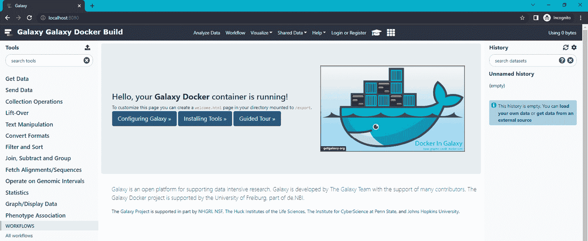
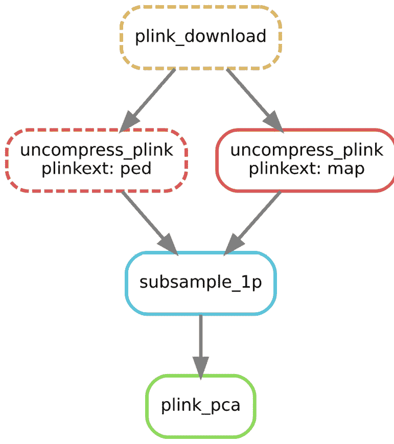
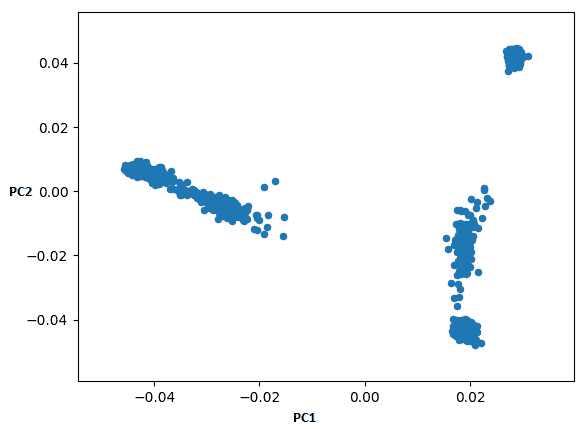

# 九、生物信息管道

管道是任何数据科学环境中的基础。数据处理从来都不是一项单一的任务。许多管道是通过专用脚本实现的。这可以用一种有用的方式来实现，但是在许多情况下，它们不符合几个基本的观点，主要是可再现性、可维护性和可扩展性。

在生物信息学中，你可以找到三种主要类型的管道系统:

*   像Galaxy([https://usegalaxy.org](https://usegalaxy.org))这样的框架是面向用户的，也就是说，它们公开了易于使用的用户界面，隐藏了大部分底层机制。
*   程序化的工作流程——面向代码接口，虽然是通用的，但源自生物信息学空间。两个例子是snake make(【https://snakemake.readthedocs.io/】)和 next flow([【https://www.nextflow.io/】](https://www.nextflow.io/))。
*   完全通用的工作流系统，如Apache air flow([https://airflow.incubator.apache.org/](https://airflow.incubator.apache.org/))，它们采用了一种不那么以数据为中心的工作流管理方法。

在这一章中，我们将讨论 Galaxy，它对于支持不太倾向于自己编写解决方案的用户的生物信息学家来说尤其重要。虽然您可能不是这些管道系统的典型用户，但您可能仍然需要支持它们。幸运的是，Galaxy 提供了 API，这将是我们的主要关注点。

我们还将讨论 Snakemake 和 Nextflow，它们是起源于生物信息学领域的具有编程接口的通用工作流工具。我们将涵盖这两种工具，因为它们是该领域中最常见的。我们将使用 Snakemake 和 Nextflow 解决一个类似的生物信息学问题。我们将尝试两种框架，并希望能够决定最喜欢的一种。

这些食谱的代码并不是以笔记本的形式出现，而是以 Python 脚本的形式出现在该书知识库的`Chapter09`目录中。

在本章中，您将找到以下配方:

*   银河服务器简介
*   使用 API 访问 Galaxy
*   用 Snakemake 开发变体分析管道
*   用 netflow 开发变体分析管道

# 银河服务器简介

银河([https://galaxyproject.org/tutorials/g101/](https://galaxyproject.org/tutorials/g101/))是一个开源系统，让非计算用户能够做计算生物学。这是最广泛使用的，用户友好的管道系统。任何用户都可以将 Galaxy 安装在一台服务器上，但是网上也有很多其他的服务器可以公开访问，旗舰服务器是 http://usegalaxy.org 的。

在下面的食谱中，我们的重点将是 Galaxy 的编程方面:使用 Galaxy API 进行接口，并开发一个 Galaxy 工具来扩展其功能。在您开始之前，强烈建议您以用户身份联系 Galaxy。你可以在[http://usegalaxy.org](http://usegalaxy.org)创建一个免费账户，然后玩一会儿。建议达到包括工作流知识在内的理解水平。

## 准备就绪

在这个菜谱中，我们将使用 Docker 在本地安装一个 Galaxy 服务器。因此，需要安装本地 Docker。复杂程度因操作系统而异:Linux 上的简单，macOS 上的中等，Windows 上的中等到困难。

建议在接下来的两个菜谱中安装，但是您也可以使用现有的公共服务器。请注意，公共服务器的接口会随着时间的推移而变化，因此今天有效的接口明天可能就无效了。关于如何在接下来的两个食谱中使用公共服务器的说明可以在*中找到...*一节。

## 怎么做……

看看下面的步骤。这些假设您有一个支持 Docker 的命令行:

1.  首先，我们用下面的命令拉取 Galaxy Docker 图像:

    ```py
    docker pull bgruening/galaxy-stable:20.09
    ```

这就拉了 bjrn grüning 的惊人的 Docker 星系图像。使用`20.09`标签，如前面的命令所示；任何更新的东西都可能破坏这个配方和下一个配方。

1.  在您的系统上创建一个目录。这个目录将保存 Docker 容器跨运行的持久输出。

注意

Docker 容器在磁盘空间方面是短暂的。这意味着当您停止容器时，所有磁盘更改都将丢失。这可以通过在 Docker 上从主机装载卷来解决，如下一步所示。已装入卷中的所有内容都将保留。

1.  我们现在可以用下面的命令运行映像:

    ```py
    docker run -d -v YOUR_DIRECTORY:/export -p 8080:80 -p 8021:21 bgruening/galaxy-stable:20.09
    ```

将`YOUR_DIRECTORY`替换为您在*步骤 2* 中创建的目录的完整路径。如果前面的命令失败，请确保您有运行 Docker 的权限。这将因操作系统而异。

1.  检查`YOUR_DIRECTORY`的内容。镜像第一次运行时，它将创建所有需要在 Docker 运行中持久执行的文件。这意味着维护用户数据库、数据集和工作流。

将浏览器指向`http://localhost:8080`。如果出现任何错误，请等待几秒钟。您应该会看到以下屏幕:



图 9.1 -银河 Docker 主页

1.  现在用默认的用户名和密码组合:`admin`和`password`登录(见顶栏)。
2.  从顶部菜单中选择**用户**，在里面选择**偏好**。
3.  现在，选择**管理 API 密钥**。

不要更改 API 密钥。前面练习的目的是让您知道 API 键在哪里。在实际情况下，您必须到此屏幕获取您的密钥。只需注意 API 键:`fakekey`。顺便说一下，在正常情况下，这将是一个 MD5 散列。

因此，在这个阶段，我们用以下(默认)凭证安装了服务器:用户名为`admin`，密码为`password`，API 密匙为`fakekey`。接入点是`localhost:8080`。

## 还有更多

bjrn grüning 的形象在本章中的使用方式非常简单；毕竟这不是一本关于系统管理或者 DevOps 的书，而是一本编程的书。如果你访问 https://github.com/bgruening/docker-galaxy-stable，你会发现有无数种方法来配置镜像，并且都有很好的文档记录。我们这里的简单方法适用于我们的开发目的。

如果你不想在你的本地电脑上安装 Galaxy ，你可以使用一个公共服务器如[https://usegalaxy.org](https://usegalaxy.org)来做下一个菜谱。这不是 100%万无一失的，因为服务会随着时间的推移而变化，但可能会非常接近。采取以下步骤:

1.  在公共服务器上创建一个帐户([https://usegalaxy.org](https://usegalaxy.org)或其他)。
2.  按照前面的说明访问您的 API 密钥。
3.  在下一个方法中，您必须替换主机、用户、密码和 API 密钥。

# 使用 API 访问 Galaxy

虽然 Galaxy 的主要用例是通过一个易于使用的 web 界面，但它也提供了一个用于编程访问的 REST API。有几个语言提供的接口，比如 bio blend([https://bio blend . readthedocs . io](https://bioblend.readthedocs.io)提供 Python 支持。

在这里，我们将开发一个脚本，将一个 BED 文件加载到 Galaxy 中，并调用一个工具将其转换为 GFF 格式。我们将使用 Galaxy 的 FTP 服务器加载文件。

## 准备就绪

如果你没有浏览前面的食谱，请阅读相应的*还有更多...*一节。代码是在本地服务器上测试的，正如前面的方法中所准备的，所以如果您在公共服务器上运行它，可能需要一些修改。

为了执行必要的操作，我们的代码需要向 Galaxy 服务器进行自我认证。因为安全性是一个重要的问题，所以这个食谱在这方面不会太天真。我们的脚本将通过 YAML 文件进行配置，例如:

```py
rest_protocol: http
server: localhost
rest_port: 8080
sftp_port: 8022
user: admin
password: password
api_key: fakekey
```

我们的脚本不接受这个文件为纯文本，但是它要求被加密。也就是说，我们的安全计划中有一个很大的漏洞:我们将使用 HTTP(而不是 HTTPS)，这意味着密码将通过网络明文传递。显然，这是一个糟糕的解决方案，但是空间的考虑限制了我们所能做的(特别是在前面的食谱中)。真正安全的解决方案需要 HTTPS。

我们将需要一个脚本，以 YAML 文件，并生成一个加密版本:

```py
import base64
import getpass
from io import StringIO
import os
from ruamel.yaml import YAML
from cryptography.fernet import Fernet
from cryptography.hazmat.backends import default_backend
from cryptography.hazmat.primitives import hashes
from cryptography.hazmat.primitives.kdf.pbkdf2 import PBKDF2HMAC
password = getpass.getpass('Please enter the password:').encode()
salt = os.urandom(16)
kdf = PBKDF2HMAC(algorithm=hashes.SHA256(), length=32, salt=salt,
                 iterations=100000, backend=default_backend())
key = base64.urlsafe_b64encode(kdf.derive(password))
fernet = Fernet(key)
with open('salt', 'wb') as w:
    w.write(salt)
yaml = YAML()
content = yaml.load(open('galaxy.yaml', 'rt', encoding='utf-8'))
print(type(content), content)
output = StringIO()
yaml.dump(content, output)
print ('Encrypting:\n%s' % output.getvalue())
enc_output = fernet.encrypt(output.getvalue().encode())
with open('galaxy.yaml.enc', 'wb') as w:
    w.write(enc_output) 
```

前面的文件可以在 GitHub 存储库中的`Chapter09/pipelines/galaxy/encrypt.py`处找到。

您需要输入加密密码。

前面的代码与 Galaxy 无关:它读取一个`YAML`文件，并用用户提供的密码对其加密。它使用`cryptography`模块加密和`ruaml.yaml`进行`YAML`处理。输出两个文件:加密的`YAML`文件和用于加密的`salt`文件。出于安全原因，`salt`文件不应该公开。

这种保护凭证的方法并不复杂；最能说明问题的是，在处理身份验证令牌时，您必须小心使用代码。网上有更多硬编码安全凭证的例子。

## 怎么做……

看一看下面的步骤，这些步骤可以在`Chapter09/pipelines/galaxy/api.py`中找到:

1.  我们从解密配置文件开始。我们需要提供一个密码:

    ```py
    import base64
    from collections import defaultdict
    import getpass
    import pprint
    import warnings
    from ruamel.yaml import YAML
    from cryptography.fernet import Fernet
    from cryptography.hazmat.backends import default_backend
    from cryptography.hazmat.primitives import hashes
    from cryptography.hazmat.primitives.kdf.pbkdf2 import PBKDF2HMAC
    import pandas as pd
    Import paramiko
    from bioblend.galaxy import GalaxyInstance
    pp = pprint.PrettyPrinter()
    warnings.filterwarnings('ignore')
    # explain above, and warn
    with open('galaxy.yaml.enc', 'rb') as f:
        enc_conf = f.read()
    password = getpass.getpass('Please enter the password:').encode()
    with open('salt', 'rb') as f:
        salt = f.read()
    kdf = PBKDF2HMAC(algorithm=hashes.SHA256(), length=32, salt=salt,
                     iterations=100000, backend=default_backend())
    key = base64.urlsafe_b64encode(kdf.derive(password))
    fernet = Fernet(key)
    yaml = YAML()
    conf = yaml.load(fernet.decrypt(enc_conf).decode())
    ```

最后一行总结了这一切:`YAML`模块将从一个解密的文件中加载配置。注意，为了能够解密文件，我们还读取了`salt`。

1.  我们将现在得到所有的配置变量，准备服务器 URL，并指定我们将创建的星系历史的名称(`bioinf_example` ):

    ```py
    server = conf['server']
    rest_protocol = conf['rest_protocol']
    rest_port = conf['rest_port']
    user = conf['user']
    password = conf['password']
    ftp_port = int(conf['ftp_port'])
    api_key = conf['api_key']
    rest_url = '%s://%s:%d' % (rest_protocol, server, rest_port)
    history_name = 'bioinf_example'
    ```

2.  最后，我们能够连接到银河服务器:

    ```py
    gi = GalaxyInstance(url=rest_url, key=api_key)
    gi.verify = False
    ```

3.  我们现在将列出所有可用的`histories`:

    ```py
    histories = gi.histories
    print('Existing histories:')
    for history in histories.get_histories():
        if history['name'] == history_name:
            histories.delete_history(history['id'])
        print('  - ' + history['name'])
    print()
    ```

在第一次执行时，您将获得一个未命名的历史，但是在其他执行时，您也将获得`bioinf_example`，我们将在此阶段删除它，以便我们从一个干净的石板开始。

1.  之后，我们创建`bioinf_example`历史:

    ```py
    ds_history = histories.create_history(history_name)
    ```

如果你愿意，你可以在网络界面上查看，你会在那里找到新的历史记录。

1.  我们现在要上传文件；这需要 SFTP 连接。该文件配有代码:

    ```py
    print('Uploading file')
    transport = paramiko.Transport((server, sftp_port))
    transport.connect(None, user, password)
    sftp = paramiko.SFTPClient.from_transport(transport)
    sftp.put('LCT.bed', 'LCT.bed')
    sftp.close()
    transport.close()
    ```

2.  我们现在将告诉 Galaxy 将 FTP 服务器上的文件加载到其内部数据库:

    ```py
    gi.tools.upload_from_ftp('LCT.bed', ds_history['id'])
    ```

3.  让我们总结一下我们历史的内容:

    ```py
    def summarize_contents(contents):
     summary = defaultdict(list)
     for item in contents:
     summary['íd'].append(item['id'])
     summary['híd'].append(item['hid'])
     summary['name'].append(item['name'])
     summary['type'].append(item['type'])
     summary['extension'].append(item['extension'])
     return pd.DataFrame.from_dict(summary)
    print('History contents:')
    pd_contents = summarize_contents(contents)
    print(pd_contents)
    print()
    ```

我们只有一个入口:

```py
                 íd  híd     name  type extension
0  f2db41e1fa331b3e    1  LCT.bed  file      auto
```

1.  让我们检查一下文件

    ```py
    print('Metadata for LCT.bed')
    bed_ds = contents[0]
    pp.pprint(bed_ds)
    print()
    ```

    的元数据

结果由以下内容组成:

```py
{'create_time': '2018-11-28T21:27:28.952118',
 'dataset_id': 'f2db41e1fa331b3e',
 'deleted': False,
 'extension': 'auto',
 'hid': 1,
 'history_content_type': 'dataset',
 'history_id': 'f2db41e1fa331b3e',
 'id': 'f2db41e1fa331b3e',
 'name': 'LCT.bed',
 'purged': False,
 'state': 'queued',
 'tags': [],
 'type': 'file',
 'type_id': 'dataset-f2db41e1fa331b3e',
 'update_time': '2018-11-28T21:27:29.149933',
 'url': '/api/histories/f2db41e1fa331b3e/contents/f2db41e1fa331b3e',
 'visible': True}
```

1.  让我们将注意力转向服务器上现有的工具，获得关于它们的元数据:

    ```py
    print('Metadata about all tools')
    all_tools = gi.tools.get_tools()
    pp.pprint(all_tools)
    print()
    ```

这将打印出一长串工具。

1.  现在让我们来了解一下我们的工具:

    ```py
    bed2gff = gi.tools.get_tools(name='Convert BED to GFF')[0]
    print("Converter metadata:")
    pp.pprint(gi.tools.show_tool(bed2gff['id'], io_details=True, link_details=True))
    print()
    ```

刀具的名称在前面的步骤中是可用的。注意我们得到了列表的第一个元素，因为理论上可能安装了不止一个版本的工具。简短的输出如下:

```py
{'config_file': '/galaxy-central/lib/galaxy/datatypes/converters/bed_to_gff_converter.xml',
 'id': 'CONVERTER_bed_to_gff_0',
 'inputs': [{'argument': None,
             'edam': {'edam_data': ['data_3002'],
                      'edam_formats': ['format_3003']},
             'extensions': ['bed'],
             'label': 'Choose BED file',
             'multiple': False,
             'name': 'input1',
             'optional': False,
             'type': 'data',
             'value': None}],
 'labels': [],
 'link': '/tool_runner?tool_id=CONVERTER_bed_to_gff_0',
 'min_width': -1,
 'model_class': 'Tool',
 'name': 'Convert BED to GFF',
 'outputs': [{'edam_data': 'data_1255',
              'edam_format': 'format_2305',
              'format': 'gff',
              'hidden': False,
              'model_class': 'ToolOutput',
              'name': 'output1'}],
 'panel_section_id': None,
 'panel_section_name': None,
 'target': 'galaxy_main',
 'version': '2.0.0'}
```

1.  最后，让我们运行一个工具，将我们的`BED`文件转换成`GFF` :

    ```py
    def dataset_to_param(dataset):
        return dict(src='hda', id=dataset['id'])
    tool_inputs = {
        'input1': dataset_to_param(bed_ds)
        }
    gi.tools.run_tool(ds_history['id'], bed2gff['id'], tool_inputs=tool_inputs)
    ```

可以在前面的步骤中检查工具的参数。如果您转到 web 界面，您将看到类似于以下内容的内容:


图 9.2 -通过 Galaxy 的 web 界面检查我们脚本的结果

因此，我们已经使用 REST API 访问了银河。

# 使用 Snakemake 部署变体分析管道

Galaxy 主要面向不太喜欢编程的用户。知道如何处理它是很重要的，因为它无处不在，即使你更喜欢对程序员友好的环境。令人欣慰的是，有一个 API 可以与 Galaxy 交互。但是如果你想要一个对程序员更友好的管道，有很多选择。在这一章中，我们探索两个广泛使用的程序员友好的管道:`snakemake`和 Nextflow。在这个食谱中，我们考虑`snakemake`。

Snakemake 是用 Python 实现的，与它有许多共同的特点。也就是说，它的基本灵感是 Makefile，古老的`make`构建系统使用的框架。

这里，我们将使用`snakemake`开发一个迷你变体分析管道。这里的目标不是让科学部分正确——我们将在其他章节讨论——而是看看如何用 T1 创建管道。我们的迷你管道将下载 HapMap 数据，以 1%的比例对其进行二次采样，进行简单的 PCA，并绘制它。

## 准备就绪

您需要将 Plink 2 安装在`snakemake`旁边。为了显示执行策略，您还需要 Graphviz 来绘制执行。我们将定义以下任务:

1.  下载数据
2.  解压缩它
3.  以 1%的比例进行子采样
4.  计算 1%子样本的主成分分析
5.  绘制 PCA 图

我们的管道配方将有两个部分:管道在`snakemake`中的实际编码和 Python 中的支持脚本。

这方面的`snakemake`代码可以在`Chapter09/snakemake/Snakefile`中找到，而 Python 支持脚本在`Chapter09/snakemake/plot_pca.py`中。

## 怎么做……

1.  第一个任务是下载数据:

    ```py
    from snakemake.remote.HTTP import RemoteProvider as HTTPRemoteProvider 
    HTTP = HTTPRemoteProvider()
    download_root = "https://ftp.ncbi.nlm.nih.gov/hapmap/genotypes/hapmap3_r3"
    remote_hapmap_map = f"{download_root}/plink_format/hapmap3_r3_b36_fwd.consensus.qc.poly.map.gz"
    remote_hapmap_ped = f"{download_root}/plink_format/hapmap3_r3_b36_fwd.consensus.qc.poly.ped.gz"
    remote_hapmap_rel = f"{download_root}/relationships_w_pops_041510.txt"

    rule plink_download:
        input:
            map=HTTP.remote(remote_hapmap_map, keep_local=True),
            ped=HTTP.remote(remote_hapmap_ped, keep_local=True),
            rel=HTTP.remote(remote_hapmap_rel, keep_local=True)

        output:
            map="scratch/hapmap.map.gz",
            ped="scratch/hapmap.ped.gz",
            rel="data/relationships.txt"

        shell:
            "mv {input.map} {output.map};"
            "mv {input.ped} {output.ped};"
            "mv {input.rel} {output.rel}"
    ```

Snakemake 的语言是依赖于 Python 的，从第一行就可以看出，从 Python 的角度来看，这应该很容易理解。最基本的部分是规则。它有一组输入流，在我们的例子中是通过`HTTP.remote`呈现的，因为我们处理的是远程文件，然后是输出。我们将两个文件放在一个`scratch`目录中(这些文件仍然是未压缩的),一个放在`data`目录中。最后，我们的管道代码是一个简单的 shell 脚本，它将下载的 HTTP 文件移动到它们的最终位置。注意 shell 脚本是如何引用输入和输出的。

1.  有了这个脚本，下载文件就很容易了。在命令行上运行以下命令:

    ```py
    snakemake -c1 data/relationships.txt
    ```

这告诉`snakemake`你想物化`data/relationships.txt`。我们将使用一个核心，`-c1`。由于这是`plink_download`规则的输出，因此将运行该规则(除非文件已经可用——在这种情况下，`snakemake`将不做任何事情)。以下是输出的节略版本:

```py
Building DAG of jobs...
Using shell: /usr/bin/bash
Provided cores: 1 (use --cores to define parallelism)
Rules claiming more threads will be scaled down.
Job stats:
job               count    min threads    max threads
--------------  -------  -------------  -------------
plink_download        1              1              1
total                 1              1              1

Select jobs to execute...

[Mon Jun 13 18:54:26 2022]
rule plink_download:
 input: ftp.ncbi.nlm.nih.gov/hapmap/ge [...]
 output: [..], data/relationships.txt
 jobid: 0
 reason: Missing output files: data/relationships.txt
 resources: tmpdir=/tmp

Downloading from remote: [...]relationships_w_pops_041510.txt
Finished download.
[...]
Finished job 0.
1 of 1 steps (100%) done
```

Snakemake 为您提供了一些关于哪些作业将被执行的信息，并开始运行这些作业。

1.  现在我们有了数据，让我们看看解压缩它的规则:

    ```py
    PLINKEXTS = ['ped', 'map']
    rule uncompress_plink:
        input:
            "scratch/hapmap.{plinkext}.gz"
        output:
            "data/hapmap.{plinkext}"
        shell:
            "gzip -dc {input} > {output}"
    ```

这里最有趣的特性是我们可以指定下载多个文件。注意`PLINKEXTS`列表是如何在代码中被转换成离散的`plinkext`元素的。您可以通过请求规则的输出来执行。

1.  现在，让我们对我们的数据进行 1%的二次抽样:

    ```py
    rule subsample_1p:
        input:
            "data/hapmap.ped",
            "data/hapmap.map"

        output:
            "data/hapmap1.ped",
            "data/hapmap1.map"

        run:
            shell(f"plink2 --pedmap {input[0][:-4]} --out {output[0][:-4]} --thin 0.01 --geno 0.1 --export ped")
    ```

新内容在最后两行:我们没有使用`script`，而是使用了`run`。这告诉`snakemake`执行是基于 Python 的，有一些额外的函数可用。这里我们看到了 shell 函数，它执行一个 shell 脚本。该字符串是一个 Python`f`-string-注意该字符串中对`snakemake` `input`和`output`变量的引用。您可以在这里放置更复杂的 Python 代码——例如，您可以迭代输入。

小费

这里，我们假设 Plink 是可用的，因为我们预先安装了它，但是`snakemake`确实提供了一些处理依赖关系的功能。更具体地说，`snakemake`规则可以用一个指向`conda`依赖项的`YAML`文件来注释。

1.  现在我们已经对数据进行了子采样，让我们来计算 PCA。在这种情况下，我们将使用 Plink 的内部 PCA 框架来进行计算:

    ```py
    rule plink_pca:
        input:
            "data/hapmap1.ped",
            "data/hapmap1.map"
        output:
            "data/hapmap1.eigenvec",
            "data/hapmap1.eigenval"
        shell:
            "plink2 --pca --file data/hapmap1 -out data/hapmap1"
    ```

2.  和大多数流水线系统一样，`snakemake`构造了一个操作的**有向无环图** ( **DAG** )来执行。在任何时候，您都可以要求`snakemake`向您展示一个 DAG，您将执行它来生成您的请求。例如，要生成 PCA，请使用以下代码:

    ```py
    snakemake --dag data/hapmap1.eigenvec | dot -Tsvg > bio.svg
    ```

这将生成下面的图:



图 9.3 -计算 PCA 的 DAG

1.  最后，让我们生成PCA 的`plot`规则:

    ```py
    rule plot_pca:
        input:
            "data/hapmap1.eigenvec",
            "data/hapmap1.eigenval"

        output:
            "pca.png"

        script:
            "./plot_pca.py"
    ```

`plot`规则引入了一种新的执行类型，`script`。在这种情况下，调用外部 Python 脚本来处理规则。

1.  我们用来生成图表的 Python 脚本如下:

    ```py
    import pandas as pd

    eigen_fname = snakemake.input[0] if snakemake.input[0].endswith('eigenvec') else snakemake.input[1]
    pca_df = pd.read_csv(eigen_fname, sep='\t') 
    ax = pca_df.plot.scatter(x=2, y=3, figsize=(16, 9))
    ax.figure.savefig(snakemake.output[0])
    ```

Python 脚本可以访问`snakemake`对象。这个对象公开了规则的内容:注意我们是如何利用`input`获取 PCA 数据和`output`生成图像的。

1.  最后，代码产生一个粗略图表如下:



图 9.4-snake make 管道产生的非常粗糙的 PCA

## 还有更多

前面的配方在一个简单的配置`snakemake`上运行。在`snakemake`中有更多的方法来构造规则。

我们没有讨论的最重要的问题是，`snakemake`可以在许多不同的环境中执行代码，从本地计算机(如我们的例子)、本地集群到云。要求使用本地计算机来尝试`snakemake`是不合理的，但是不要忘记`snakemake`可以管理复杂的计算环境。

请记住，`snakemake`虽然是用 Python 实现的，但在概念上是基于`make`的。这是一个主观分析，以决定你是否喜欢(蛇)作出的设计。对于另一种设计方法，检查下一个配方，它使用 Nextflow。

# 使用 Nextflow 部署变体分析管道

生物信息学中的流水线框架空间有两个主要玩家:`snakemake`和 Nextflow。它们提供流水线功能，同时具有不同的设计方法。Snakemake 基于 Python，但它的语言和哲学来自于用于编译具有依赖关系的复杂程序的`make`工具。Nextflow 是基于 Java 的(更准确地说，它是用 Groovy 实现的——一种在 Java 虚拟机上工作的语言),并且有自己的**领域特定语言** ( **DSL** )用于实现管道。这个配方(和之前的配方)的主要目的是给你一个 Nextflow 的味道，这样你就可以和`snakemake`比较，选择一个更适合你需求的。

小费

关于如何评估管道系统，有许多观点。在这里，我们基于用于指定管道的语言呈现一个透视图。然而，在选择管道系统时，你还应该考虑其他因素。例如，它在多大程度上支持您的执行环境(比如本地集群或云)，它是否支持您的工具(或者允许轻松开发扩展来处理新工具)，它是否提供良好的恢复和监控功能？

在这里，我们将使用 Nextflow 开发一个管道，提供与我们使用`snakemake`实现的相同的功能，从而允许从管道设计的角度进行公平的比较。这里的目标不是让科学部分正确——我们在其他章节中讨论——而是看看如何用`snakemake`创建管道。我们的迷你管道将下载 HapMap 数据，以 1%对其进行子采样，进行简单的 PCA，并绘制它。

## 准备就绪

您需要将 Plink 2 与 Nextflow 一起安装。Nextflow 本身需要一些来自 Java 领域的软件:特别是 Java 运行时环境和 Groovy。

我们将定义以下任务:

1.  下载数据
2.  解压缩它
3.  以 1%的比例进行子采样
4.  计算 1%子样本的主成分分析
5.  绘制 PCA 图

可以在`Chapter09/nextflow/pipeline.nf`中找到下一个流代码。

## 怎么做……

1.  的第一个任务是下载的数据:

    ```py
    nextflow.enable.dsl=2
    download_root = "https://ftp.ncbi.nlm.nih.gov/hapmap/genotypes/hapmap3_r3"
     process plink_download {
      output:
      path 'hapmap.map.gz'
      path 'hapmap.ped.gz'
      script:
      """
      wget $download_root/plink_format/hapmap3_r3_b36_fwd.consensus.qc.poly.map.gz -O hapmap.map.gz
      wget $download_root/plink_format/hapmap3_r3_b36_fwd.consensus.qc.poly.ped.gz -O hapmap.ped.gz
       """
    }
    ```

请记住，管道的底层语言不是 Python 而是 Groovy，所以语法会有一点不同，比如对块使用大括号或者忽略缩进。

我们创建一个名为`plink_download`的进程(Nextflow 中的管道构建块),它下载 Plink 文件。它只指定输出。第一个输出将是`hapmap.map.gz`文件，第二个输出将是`hapmap.ped.gz`。这个流程将有两个输出通道(另一个 Nextflow 概念，类似于流)，可以被另一个流程使用。

默认情况下，该流程的代码是一个 bash 脚本。重要的是要注意脚本如何输出文件名与输出部分同步的文件。另外，看看我们如何引用管道中定义的变量(在我们的例子中是`download_root`)。

1.  现在让我们定义一个过程来使用带有 HapMap 文件的通道并解压缩它们:

    ```py
    process uncompress_plink {
      publishDir 'data', glob: '*', mode: 'copy'

      input:
      path mapgz
      path pedgz

      output:
      path 'hapmap.map'
      path 'hapmap.ped'

      script:
      """
      gzip -dc $mapgz > hapmap.map
      gzip -dc $pedgz > hapmap.ped
      """
    }
    ```

在这个过程中有三个问题需要注意:我们现在有几个输入(记住，我们有几个来自前面过程的输出)。我们的脚本现在也引用输入变量(`$mapgz`和`$pedgz`)。最后，我们使用`publishDir`发布输出。因此，任何未发布的文件都只会被临时存储。

1.  让我们指定下载和解压缩文件的工作流的第一个版本:

    ```py
    workflow {
        plink_download | uncompress_plink
    }
    ```

2.  我们可以通过在 shell 上运行以下命令来执行工作流:

    ```py
    nextflow run pipeline.nf -resume
    ```

最后的`resume`标志将确保流水线将从已经完成的任何步骤继续。在本地执行时，这些步骤存储在`work`目录中。

1.  如果我们删除了`work`目录，我们就不想下载已经发布的 HapMap 文件。由于这在`work`目录之外，因此不能被直接跟踪，我们需要更改工作流来跟踪发布目录中的数据:

    ```py
    workflow {
        ped_file = file('data/hapmap.ped')
        map_file = file('data/hapmap.map')
        if (!ped_file.exists() | !map_file.exists()) {
            plink_download | uncompress_plink
        }
    }
    ```

有种替代方法可以做到这一点，但是我想介绍一点 Groovy 代码，因为有时你可能不得不用 Groovy 编写代码。您很快就会看到，使用 Python 代码有很多方法。

1.  现在，我们需要对数据进行二次抽样:

    ```py
    process subsample_1p {
      input:
      path 'hapmap.map'
      path 'hapmap.ped'

      output:
      path 'hapmap1.map'
      path 'hapmap1.ped'

      script:
      """
      plink2 --pedmap hapmap --out hapmap1 --thin 0.01 --geno 0.1 --export ped
      """
    }
    ```

2.  现在让我们使用 Plink:

    ```py
    process plink_pca {
      input:
      path 'hapmap.map'
      path 'hapmap.ped'
      output:
      path 'hapmap.eigenvec'
      path 'hapmap.eigenval'
       script:
      """
      plink2 --pca --pedmap hapmap -out hapmap
      """
    }
    ```

    计算 PCA
3.  最后，让我们绘制PCA:

    ```py
    process plot_pca {
      publishDir '.', glob: '*', mode: 'copy'

      input:
      path 'hapmap.eigenvec'
      path 'hapmap.eigenval'

      output:
      path 'pca.png'

      script:
      """
      #!/usr/bin/env python
      import pandas as pd

      pca_df = pd.read_csv('hapmap.eigenvec', sep='\t') 
      ax = pca_df.plot.scatter(x=2, y=3, figsize=(16, 9))
      ax.figure.savefig('pca.png')
      """
    }
    ```

这段代码的新特性是我们使用 shebang ( `#!`)操作符指定 bash 脚本，这允许我们调用外部脚本语言来处理数据。

这是我们最终的工作流程:

```py
workflow {
    ped_file = file('data/hapmap.ped')
    map_file = file('data/hapmap.map')
    if (!ped_file.exists() | !map_file.exists()) {
        plink_download | uncompress_plink | subsample_1p | plink_pca | plot_pca
    }
    else {
        subsample_1p(
            Channel.fromPath('data/hapmap.map'),
            Channel.fromPath('data/hapmap.ped')) | plink_pca | plot_pca
    }
}
```

我们要么下载数据，要么使用已经下载的数据。

虽然设计完整的工作流有其他的方言，但是我希望您注意当文件可用时我们是如何使用`subsample_1p`的；我们可以显式地将两个通道传递给一个进程。

1.  我们可以运行管道并请求一个关于执行的 HTML 报告:

    ```py
    nextflow run pipeline.nf -with-report report/report.xhtml
    ```

该报告非常详尽，将允许您从不同的角度找出管道中昂贵的部分，无论是与时间、内存、CPU 消耗还是 I/O 相关。

## 还有更多

这是 Nextflow 的一个简单的介绍性例子，希望它能让你对这个框架有所了解，特别是这样你就可以把它和`snakemake`进行比较。Nextflow 有更多的功能，鼓励你去看看它的网站。

与`snakemake`一样，我们没有讨论的最重要的问题是，Nextflow 可以在许多不同的环境中执行代码，从本地计算机、本地集群到云。查看 Nextflow 的文档，了解目前支持哪些计算环境。

和底层语言一样重要的是，Groovy 用 Nextflow 和 Python 用`snakemake`，一定要比较其他因素。这不仅包括两个管道可以在哪里执行(本地、集群或云中)，还包括框架的设计，因为它们使用完全不同的范例。