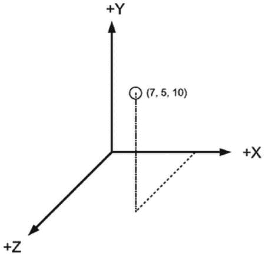
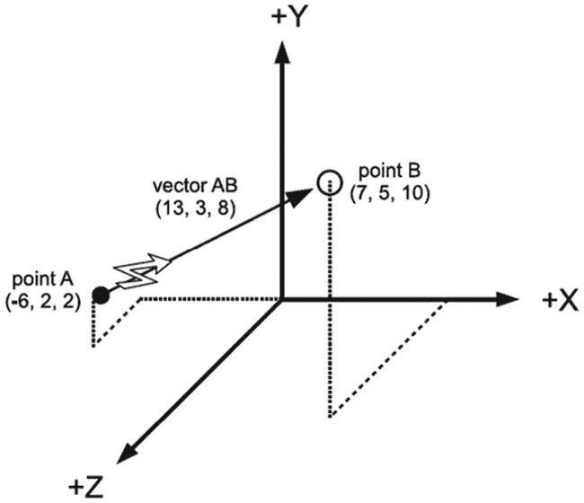
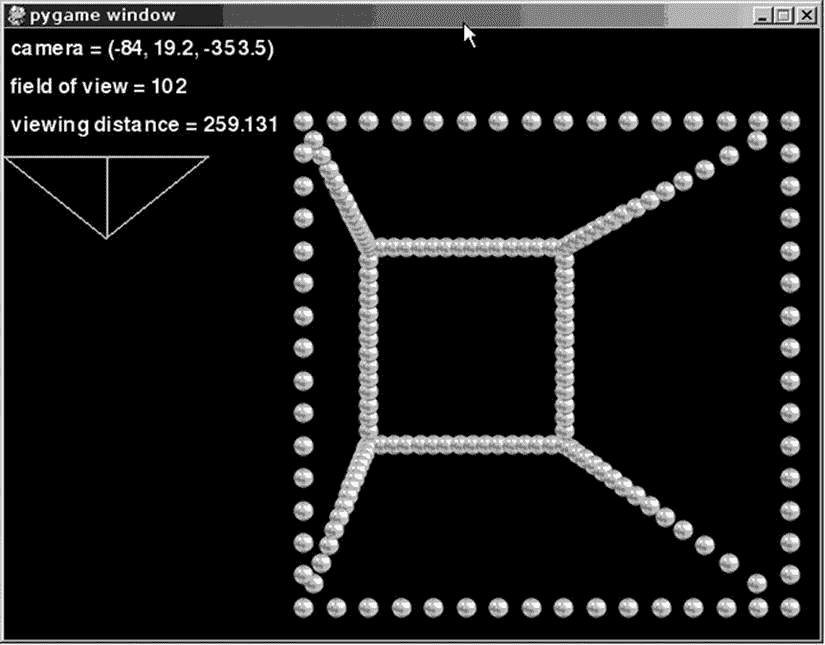

# 八、进入第三维度

游戏通常试图模仿真实世界，或者创造一个离现实不远的世界，玩家仍然能够以某种方式认同它。在过去，这需要玩家真正的信心飞跃，因为技术还不能创造看起来更像现实的视觉效果。但随着技术的进步，游戏设计者开始推动硬件来创建更有说服力的图形。

最初一切都是二维的，因为绘制 2D 精灵是一个相当简单的操作，控制台和计算机可以做得相当好。即使只有 2D 功能，游戏设计者也试图用阴影和移动来创建三维外观。最终，游戏硬件变得能够创建更令人信服的 3D 图形，开发者可以自由地试验额外的维度。早期的 3D 游戏有粗糙的图形，由线条和平坦的无阴影三角形生成，但很快这些图形就演变成了具有数千个多层多边形和逼真照明的丰富场景。

如今，大多数游戏都是 3D 的，家用电脑配有显卡，硬件专用于创建 3D 视觉效果。你桌面上的电脑可以在几分之一秒内生成 3D 图像——几十年前这需要几个小时——你可以在你的 Pygame 应用中访问这些功能。本章讲述了存储 3D 信息和创建图像的基础知识。

创造深度的幻觉

就像电脑游戏中的其他东西一样，3D 是一种幻觉。电视和监视器仍然只能显示二维图像。如果你在玩游戏时把头从一边移到另一边，你将看不到更多的场景，因为它本质上是平的，没有真正的深度。如果你使用的是虚拟现实设备，你可能会得到一些运动。不管它让你感觉如何，这也是一种幻觉。

这种错觉可能相当有说服力，因为我们的大脑高度发达，能够识别三维世界的特征。我们的大脑判断我们正在观看的深度的主要方式是通过结合来自每只眼睛的两个图像。但是即使你闭上一只眼睛，你会发现你能够判断距离，并且在不撞到东西的情况下绕过去(即使比以前难了一点)。这是因为视觉线索，如透视和阴影，也用于理解每只眼睛的图像，我们的大脑下意识地使用这些信息来帮助我们理解深度。因此，即使屏幕上的图像是平面的，如果它包含透视和阴影，它仍然看起来有深度。

3D 图形游戏中的物体必须按照你在现实世界中的预期方式运动。有时，物体以一种看似合理的方式移动就足以产生深度的幻觉。清单 8-1 是一个例子，说明了运动本身是如何创造出具有明显的三维视觉效果的。

***清单 8-1*** 。深度错觉(parallaxstars.py)

```py
import pygame
from pygame.locals import *
from random import randint

class Star(object):

    def init (self, x, y, speed):

        self.x = x
        self.y = y
        self.speed = speed

def run():

    pygame.init()
    screen = pygame.display.set_mode((640, 480), FULLSCREEN)

    stars = []

    # Add a few stars for the first frame
    for n in xrange(200):

        x = float(randint(0, 639))
        y = float(randint(0, 479))
        speed = float(randint(10, 300))
        stars.append( Star(x, y, speed) )

    clock = pygame.time.Clock()

    white = (255, 255, 255)

    while True:

        for event in pygame.event.get():
            if event.type == QUIT:
                return
            if event.type == KEYDOWN:
                return

    # Add a new star
    y = float(randint(0, 479))
    speed = float(randint(10, 300))
    star = Star(640., y, speed)
    stars.append(star)
    time_passed = clock.tick()
    time_passed_seconds = time_passed / 1000.

    screen.fill((0, 0, 0))

    # Draw the stars
    for star in stars:

        new_x = star.x - time_passed_seconds * star.speed
        pygame.draw.aaline(screen, white, (new_x, star.y), (star.x+1., star.y))
        star.x = new_x

    def on_screen(star):
        return star.x > 0

    # Remove stars that are no longer visible
    stars = filter(on_screen, stars)

    pygame.display.update()

if name == " main__":
    run()
```

当你运行清单 8-1 时，你会看到一个相当令人信服的星域，不同距离的恒星在屏幕上移动。虽然星域看起来是 3D 的，但是在代码里你不会发现特别陌生的东西；它所做的只是在屏幕上以不同的速度移动一些点。深度印象是你的大脑假设快速物体离你很近，慢速物体离你很远的结果。

理解 3D 空间

为了在 2D 游戏中存储一个实体的位置，你使用一个有两个分量的*坐标系*，x 和 y，对应于屏幕上的物理像素。对于一个 3D 游戏，你需要使用一个坐标系统和一个叫做 z 的附加组件(见图 8-1 )。该额外组件用于测量屏幕*进入*或*离开*的距离。当然，Pygame 实际上无法使用 3D 坐标绘制任何东西，因为屏幕是平面的。因此，3D 坐标最终必须转换成 2D 坐标，才能用于在屏幕上渲染任何东西。我们将在本章后面介绍如何做到这一点，但首先我们需要知道如何用 Python 存储 3D 坐标。


图 8-1 。三维坐标系统

在三维坐标系中，x 指向右侧，y 指向上方。这不同于我们用来创建 2D 图形的坐标系，在这里 y 指向屏幕的下方。在 3D 中，如果增加 y 分量，坐标会将*在屏幕上上移*，而不是下移。

根据所使用的图形技术，3D 坐标系中的 z 轴可以指向两种方向之一；它要么将*指向*屏幕(远离观众)，要么将*指向*屏幕外(朝向观众)。在本书中，我们将使用一个指向屏幕外的正 z 坐标系统。图 8-2 显示了一个间谍机器人的三维坐标系——用一个圆表示——坐标为(7，5，10)。因为这不是一本弹出式图书，所以额外的轴表示为一条对角线。

3D 坐标的单位可以代表任何东西，这取决于游戏的规模。如果你正在写一个第一人称射击游戏，单位可能是米甚至厘米，但是对于一个太空游戏，单位可能代表一个更大的尺度(可能是光年)！假设机器人的坐标以米为单位，士兵阿尔法(玩家角色)站在坐标(0，0，0)处，面朝 z 轴的负方向，机器人将在玩家的右后方 10 米的空中悬停。



图 8-2 。3D 坐标系中的机器人

使用 3D 矢量

到目前为止，您已经熟悉了我们在 2D 样本中用来表示位置和方向的二维向量。3D 中的向量与 2D 中的向量相似，但是有三个分量，而不是两个。这些 3D 矢量拥有许多与 2D 相同的功能；它们可以被相加、相减、缩放等等。三维向量可以存储在元组或列表中，但使用专用的类将使计算更容易。清单 8-2 展示了我们如何开始定义一个 3D `Vector`类。

***清单 8-2*** 。开始 3D 矢量课程

```py
from math import sqrt

class Vector3(object):

    def init (self, x, y, z):

        self.x = x
        self.y = y
        self.z = z

    def add (self, x, y, z):

        return Vector3(self.x + x, self.y + y, self.z + z)

    def get_magnitude(self):

        return sqrt(self.x ** 2 + self.y ** 2 + self.z ** 2)
```

可以在 3D 中完成的大多数操作都可以扩展到 z 分量。例如，`_add_`函数非常类似于 2D 版本，但是它也增加了两个向量的 z 分量。

我们将使用游戏对象库中为 3D 代码定义的`Vector3`类。清单 8-3 展示了我们如何导入和使用这个类。

***清单 8-3*** 。使用游戏对象 Vector3 类

```py
from gameobjects.vector3 import *

A = Vector3(6, 8, 12)
B = Vector3(10, 16, 12)

print("A is", A)
print("B is", B)
print("Magnitude of A is", A.get_magnitude())
print("A+B is", A+B)
print("A-B is", A-B)

print("A normalized is", A.get_normalized())
print("A*2 is", A * 2)
```

运行此代码会生成以下输出:

```py
A is (6, 8, 12)
B is (10, 16, 12)
Magnitude of A is 15.620499351813308
A+B is (16, 24, 24)
A-B is (-4, -8, 0)
A normalized is (0.384111, 0.512148, 0.768221)
A*2 is (12, 16, 24)
```

3D 中基于时间的运动

我们可以使用`Vector3`类在 3D 中进行基于时间的移动,就像在二维中一样。作为一个例子，让我们用一点 3D 矢量数学来计算一个目标矢量，并算出投射武器的中间坐标(见图 8-3 )。



图 8-3 。计算目标向量

士兵阿尔法已经从他在图 8-2 中原来的位置走了几米，现在站在点(–6，2，0)。间谍机器人仍在(7，5，10)处盘旋，监视阿尔法的行动。幸运的是，阿尔法敏锐的听觉(或玩家的扬声器)捕捉到了反重力引擎微弱的呼呼声，他决定干掉这个机器人。为了向机器人开火，阿尔法需要计算从他的肩扛式等离子步枪到机器人位置的矢量。

阿尔法可能站在点(–6，2，0)上方，但他的肩膀在点(–6，2，2)离地 2 米，所以这是矢量计算的起点。从起点 A(–6，2，2)减去机器人的位置(点 B 在(7，5，10)，得到目标向量(13，3，8)。标准化该向量会产生可用于基于时间的移动的方向向量。清单 8-4 展示了如何用代码做这些计算。

***清单 8-4*** 。创建目标向量

```py
from gameobjects.vector3 import *

A = (-6, 2, 2)
B = (7, 5, 10)
plasma_speed = 100 # meters per second

AB = Vector3.from_points(A, B)
print("Vector to droid is", AB)

distance:to_target = AB.get_magnitude()
print("Distance to droid is", distance:to_target, "meters")

plasma_heading = AB.get_normalized()
print("Heading is", plasma_heading)
```

运行清单 8-4 中的会产生以下输出:

```py
Vector to droid is (13, 3, 8)
Distance to droid is 15.556349186104045 meters
Heading is (0.835672, 0.192847, 0.514259)
```

如果我们在游戏中使用这些值来渲染等离子闪电，我们可以通过将方向向量乘以自上一帧以来经过的时间和等离子闪电的速度来计算等离子闪电自上一帧以来移动了多远。将结果与螺栓的当前位置相加，就得到它的新位置。代码看起来会像这样:

```py
bolt_location += plasma_heading * time_passed_seconds * plasma_speed
```

在您可以在 Pygame 应用中创建 3D 投射物之前，您首先必须学习如何将 3D 坐标转换为 2D 坐标，以便将其渲染到屏幕上——这是下一节的主题。

投影 3D 点

在 3D 空间中存储点就像创建一个三个值的元组，或一个`Vector3`对象一样简单，但我们不能在 Pygame 的绘图函数中使用这两个函数，因为它们都将坐标作为 2D 点。要在三维坐标上画任何东西，我们首先要把 T2 投影到 2D 屏幕上。

平行投影

将 3D 坐标转换为 2D 坐标的一种方法是简单地丢弃 z 分量，这就是所谓的*平行投影*。清单 8-5 显示了一个非常简单的函数，我们可以用它将一个三维坐标转换成平行投影的 2D。

***清单 8-5*** 。执行平行投影的函数

```py
def parallel_project(vector3):

    return (vector3.x, vector3.y)
```

虽然平行投影很快也很容易做到，但它们并不经常在游戏中使用，因为忽略 z 分量就没有深度感。使用平行投影渲染的 3D 场景有点像通过放大倍数很高的变焦镜头观看；世界看起来是平的，不同距离的物体看起来就像是紧挨着的。图 8-4 显示了一个用平行投影渲染的立方体。


图 8-4 。用平行投影渲染的立方体

透视投影

一般来说，游戏和 3D 计算机图形中更常见的投影是*透视投影*，因为它考虑了物体与观众的距离。透视投影复制了远离观察者的物体看起来比近处的物体小的方式。用透视投影渲染的物体也会看起来向地平线变窄，这种效果被称为*透视缩小*(见图 8-5 )。清单 8-6 是一个用透视投影投影 3D 坐标并返回结果的函数。


图 8-5 。用透视投影渲染的立方体

***清单 8-6*** 。执行透视投影的函数

```py
def perspective_project(vector3, d):

    x, y, z = vector3
    return (x * d/z, –y * d/z)
```

透视投影涉及的数学比简单的平行投影多一点。`perspective_project`函数将 x 和 y 坐标乘以`d`值(我们将在后面讨论)，然后除以 z 分量。它也否定了 y 分量(`–y`)，因为 y 轴在 2D 是反方向的。

`perspective_project`中的`d`值是*观看距离*，它是从摄像机到 3D 世界单位中的单位与屏幕上的像素直接对应的位置的距离。例如，如果我们有一个坐标为(10，5，100)的物体，投影的观看距离为 100，我们将它在(11，5，100)处向右移动一个单位，那么它在屏幕上看起来正好移动了一个像素。如果它的 z 值不是 100，它将相对于屏幕移动不同的距离。

图 8-6 显示了观看距离与屏幕宽度和高度的关系。假设玩家(由笑脸表示)正坐在屏幕前面，那么观看距离大约是从屏幕到玩家头部的距离(以像素为单位)。


图 8-6 。透视投影中的观看距离

视野

那么我们如何为视距(`d`)选择一个好的值呢？我们可以通过实验来找到一个使 3D 场景看起来令人信服的值，但是我们可以通过从*视场(fov)* 、计算`d`来消除猜测，这是在某一时刻可见的场景的角度范围。对于人类来说，fov 就是左眼到右眼的范围，大概是 180 度。图 8-7 显示了视场和视距之间的关系。当视场角增加(变宽)时，随着更多的场景变得可见，观看距离*减少*。fov 减小(变窄)则相反；观看距离增加，并且较少的场景可见。


图 8-7 。视野

视野是定义 3D 场景中有多少透视的更好方法，但是我们仍然需要透视投影中的`d`值。为了从 fov 中计算出`d`，我们需要使用一点三角学。清单 8-7 是一个取 fov 加上屏幕宽度的函数，使用`math`模块中的`tan`函数计算视距。

 **提示**通过在互联网上查找公式，你可以在 3D 图形中完成很多工作，但偶尔你可能需要自己算一算。如果数学不是你的强项，不要让这吓到你——你只需要基础知识，尤其是三角学。

***清单 8-7*** 。计算观看距离

```py
from math import tan

def calculate_viewing_distance(fov, screen_width):

    d = (screen_width/2.0) / tan(fov/2.0)
    return d
```

我通常使用 45 到 60 度之间的值作为我的视野，这给了我一个自然的视角。更高的值可能对赛车游戏有好处，因为增加的视角夸大了速度的效果。较低的值可能对策略游戏更好，因为它们显示了更多的场景。

你也可以根据游戏中发生的事情来调整视野。一个伟大的狙击步枪效果可以通过快速缩小视野，使摄像机放大，然后在玩家开火时将其移回。

3D 世界

让我们编写一个应用来测试我们到目前为止所涉及的概念。因为我们还没有探索如何绘制 3D 对象，我们将通过在 2D 屏幕上投影的 3D 点上绘制图像来构建一个场景。这就产生了一个可识别的 3D 场景，即使图像在接近摄像机时尺寸没有变化(见图 8-8 )。

如果你运行清单 8-8 中的 ，你会看到一个由许多球体图像沿其边缘形成的立方体。通过按光标键，您可以水平和垂直平移“摄像机”;按 Q 和 A 在场景中前后移动。W 和 S 键调整透视投影的观看距离。您可以从立方体的外观和查看图表(绿色)中看到这种效果。尝试观察距离和视野-请注意，宽视野使立方体看起来细长，窄视野使立方体看起来扁平。

 **注意**3D 场景中的一个摄像机只是当前视点；它可以是玩家角色眼中的视角，或者游戏中的任何其他视角。



图 8-8 。Pygame 中的一个简单的 3D 引擎

***清单 8-8*** 。简单 3D 引擎(simple3d.py)

```py
import pygame
from pygame.locals import *
from gameobjects.vector3 import Vector3
from math import *
from random import randint

SCREEN_SIZE =  (640, 480)
CUBE_SIZE = 300

def calculate_viewing_distance(fov, screen_width):

    d = (screen_width/2.0) / tan(fov/2.0)
    return d

def run():

    pygame.init()
    screen = pygame.display.set_mode(SCREEN_SIZE, 0)

    default_font = pygame.font.get_default_font()
    font = pygame.font.SysFont(default_font, 24)

    ball = pygame.image.load("ball.png").convert_alpha()

    # The 3D points
    points = []

    fov = 90\. # Field of view
    viewing_distance = calculate_viewing_distance(radians(fov), SCREEN_SIZE[0])

    # Create a list of points along the edge of a cube
    for x in range(0, CUBE_SIZE+1, 20):
        edge_x = x == 0 or x == CUBE_SIZE

        for y in range(0, CUBE_SIZE+1, 20):
            edge_y = y == 0 or y == CUBE_SIZE

            for z in range(0, CUBE_SIZE+1, 20):
                edge_z = z == 0 or z == CUBE_SIZE

                if sum((edge_x, edge_y, edge_z)) >= 2:

                    point_x = float(x) - CUBE_SIZE/2
                    point_y = float(y) - CUBE_SIZE/2
                    point_z = float(z) - CUBE_SIZE/2

                    points.append(Vector3(point_x, point_y, point_z))

    # Sort points in z order
    def point_z(point):
        return point.z
    points.sort(key=point_z, reverse=True)

    center_x, center_y = SCREEN_SIZE
    center_x /= 2
    center_y /= 2

    ball_w, ball_h = ball.get_size()
    ball_center_x = ball_w / 2
    ball_center_y = ball_h / 2

    camera_position = Vector3(0.0, 0.0, -700.)
    camera_speed = Vector3(300.0, 300.0, 300.0)

    clock = pygame.time.Clock()

    while True:

        for event in pygame.event.get():
            if event.type == QUIT:
                pygame.quit()
                quit()

        screen.fill((0, 0, 0))

        pressed_keys = pygame.key.get_pressed()

        time_passed = clock.tick()
        time_passed_seconds = time_passed / 1000.

        direction = Vector3()
        if pressed_keys[K_LEFT]:
            direction.x = -1.0
        elif pressed_keys[K_RIGHT]:
            direction.x = +1.0

        if pressed_keys[K_UP]:
            direction.y = +1.0
        elif pressed_keys[K_DOWN]:
            direction.y = -1.0

        if pressed_keys[K_q]:
            direction.z = +1.0
        elif pressed_keys[K_a]:
            direction.z = -1.0

        if pressed_keys[K_w]:
            fov = min(179., fov+1.)
            w = SCREEN_SIZE[0]
            viewing_distance = calculate_viewing_distance(radians(fov), w)
        elif pressed_keys[K_s]:
            fov = max(1., fov-1.)
            w = SCREEN_SIZE[0]
            viewing_distance = calculate_viewing_distance(radians(fov), w)

        camera_position += direction * camera_speed * time_passed_seconds

        # Draw the 3D points
        for point in points:

            x, y, z = point - camera_position

            if z > 0:
                x =  x * viewing_distance / z
                y = -y * viewing_distance / z
                x += center_x
                y += center_y
                screen.blit(ball, (x-ball_center_x, y-ball_center_y))

        # Draw the field of view diagram
        diagram_width = SCREEN_SIZE[0] / 4
        col = (50, 255, 50)
        diagram_points = []
        diagram_points.append( (diagram_width/2, 100+viewing_distance/4) )
        diagram_points.append( (0, 100) )
        diagram_points.append( (diagram_width, 100) )
        diagram_points.append( (diagram_width/2, 100+viewing_distance/4) )
        diagram_points.append( (diagram_width/2, 100) )
        pygame.draw.lines(screen, col, False, diagram_points, 2)

        # Draw the text
        white = (255, 255, 255)
        cam_text = font.render("camera = "+str(camera_position), True, white)
        screen.blit(cam_text, (5, 5))
        fov_text = font.render("field of view = %i"%int(fov), True, white)
        screen.blit(fov_text, (5, 35))
        txt = "viewing distance = %.3f"%viewing_distance
        d_text = font.render(txt, True, white)
        screen.blit(d_text, (5, 65))

        pygame.display.update()

if __name__ == "__main__":
    run()

```

清单 8-8 从创建一个带有立方体边缘坐标的`Vector3`对象列表开始。然后，这些点按它们的 z 分量排序，以便在渲染时，首先绘制离观察者较近的点。否则，距离点可能会与靠近观看者的距离点重叠，这将打破 3D 的幻觉。

在主循环中，摄像机的位置根据当前按下的键而改变。您可以看到，移动 3D 点的代码与移动 2D 精灵非常相似，只是增加了一个在 3D 场景中前后移动的 z 组件。用基于时间的运动来更新位置的代码实际上与 2D 计算相同；它只是使用了`Vector3`对象而不是`Vector2`对象。

代码中的下一步是绘制场景中所有点的循环。首先，通过减去`camera_position`变量调整该点，使其相对于摄像机。如果产生的 z 分量大于 0，则意味着该点在相机前面，并且可能是可见的-否则，绘制它就没有意义。当点在相机前面时，它通过将 x 和 y 分量乘以观看距离并除以 z 分量来投影。对于 2D 绘图功能，y 轴也翻转指向正确的方向。最后，通过给 x 分量增加一半的宽度(`center_x`)和给 y 分量增加一半的高度(`center_y`)来调整 2D 坐标以将“世界”放置在屏幕的中心。

剩下的代码绘制了一个小图，显示了观看距离与屏幕宽度和 fov 的关系。它还在屏幕上显示一些信息，以便您可以看到按键的效果。

如果您想尝试此演示，请尝试添加创建其他对象(如金字塔和球体)的其他点列表。你可能还想让这些“物体”在 3D 中移动，就像我们在前面章节中对 2D 精灵所做的那样。

摘要

具有 3D 视觉效果的游戏最有可能吸引玩家并让他们开心。这是真的，不是因为图形更真实——早期的 3D 游戏实际上看起来比 2D 的同类游戏粗糙——而是因为它们感觉更自然。3D 游戏中的物体可以旋转，可以从不同的角度观看，就像在现实世界中一样。

存储关于 3D 点和方向的信息是对 2D 的简单扩展；我们只是需要一个额外的组件来支持额外的维度。如果你使用游戏对象库中的`Vector3`类，你会发现大部分的数学运算实际上与 2D 相同，因为 vector 类处理额外的部分。到目前为止，我们在向 3D 转移的过程中所做的所有不同就是*将点投影到*屏幕上，以使用 Pygame 的绘图功能。实际上有许多类型的投影，但透视投影是最常见的，因为它可以创建看起来很自然的场景。

在下一章，我们将探索如何用 OpenGL 创建丰富的 3D 场景，OpenGL 是许多商业游戏背后的技术，包括雷神之锤系列。你会发现我们在这一章中讨论的一些内容实际上是由 OpenGL 自动完成的，但是我没有浪费你的时间——当你创建 OpenGL 支持的视觉效果时，理解投影和视野将会帮助你。