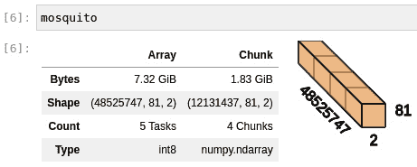
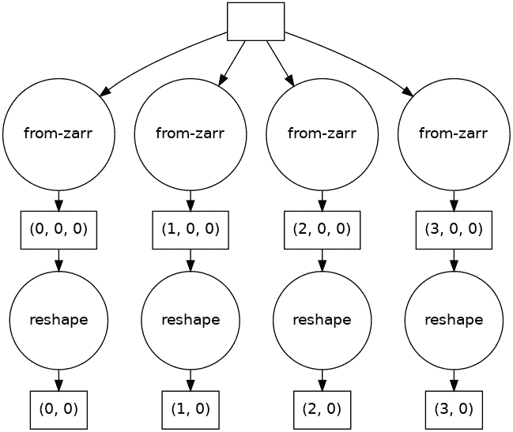
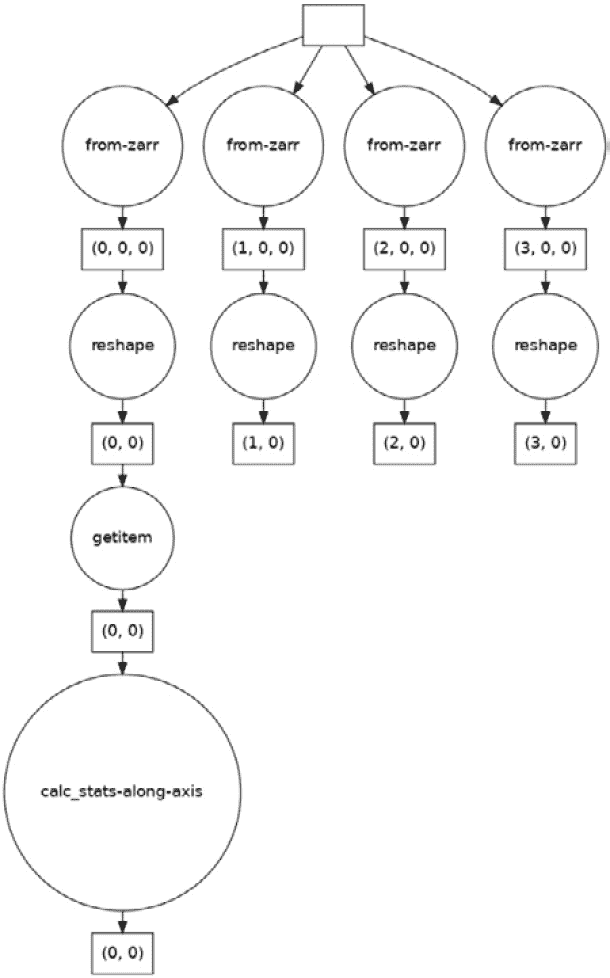
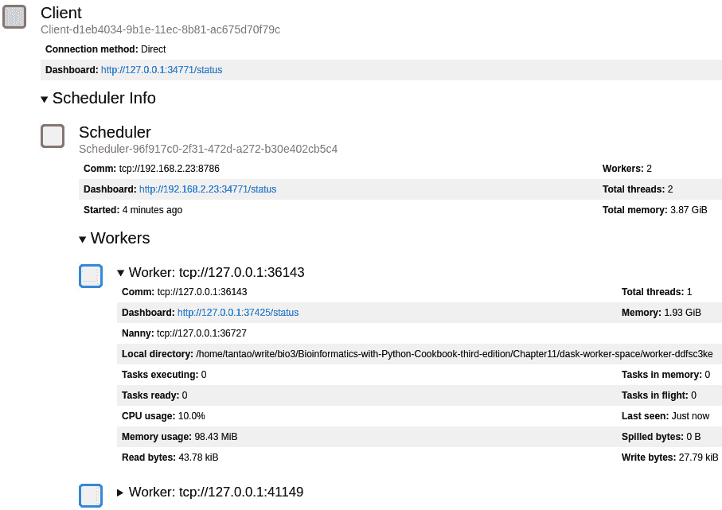
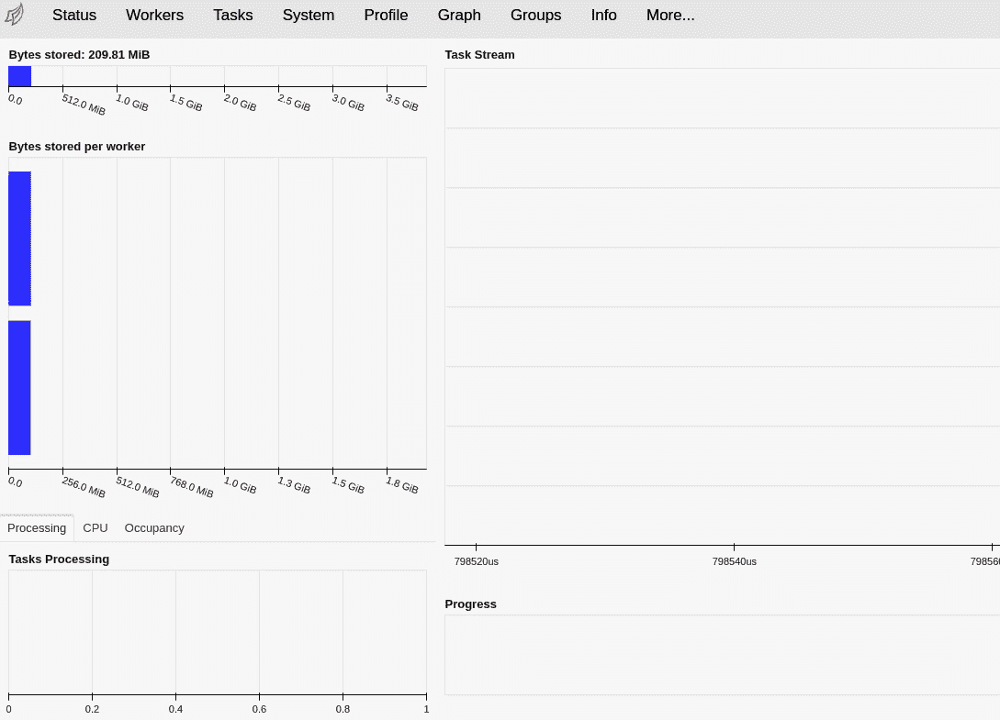
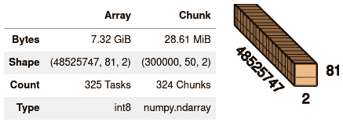
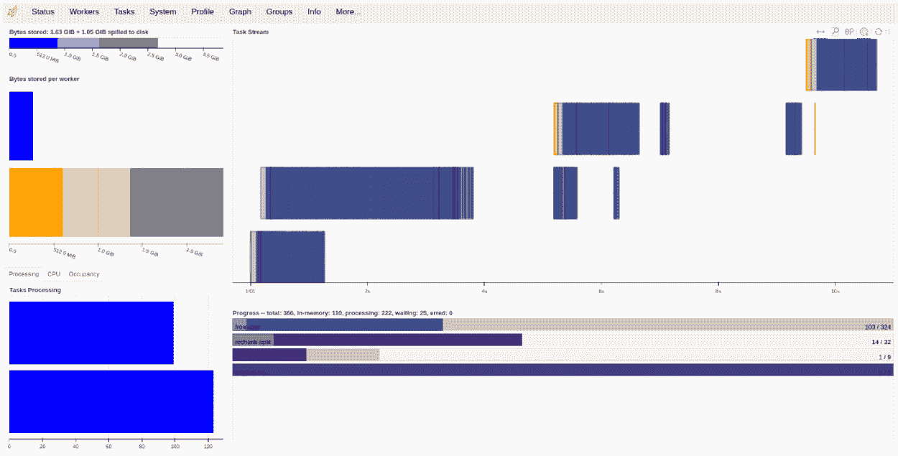

# 十一、使用 Dask 和 Zarr 实现并行处理

生物信息学数据集正以指数速度增长。基于标准工具(如 Pandas)的数据分析策略假设数据集能够容纳在内存中(尽管为核外分析做了一些准备)或者单台机器能够有效地处理所有数据。不幸的是，这对于许多现代数据集来说是不现实的。

在本章中，我们将介绍两个能够处理非常大的数据集和昂贵计算的库:

*   Dask 是一个允许并行计算的库，可以从单台计算机扩展到非常大的云和集群环境。Dask 提供了类似于 Pandas 和 NumPy 的接口，同时允许您处理分布在许多计算机上的大型数据集。
*   Zarr 是一个存储压缩和分块多维数组的库。正如我们将看到的，这些阵列是为处理在大型计算机集群中处理的非常大的数据集而定制的，同时如果需要，仍然能够在单台计算机上处理数据。

我们的食谱将利用蚊子基因组学的数据介绍这些先进的文库。您应该将这段代码作为起点，引导您走上处理大型数据集的道路。大型数据集的并行处理是一个复杂的主题，这是您旅程的开始，而不是结束。

因为所有这些库都是数据分析的基础，如果您正在使用 Docker，它们都可以在`tiagoantao/bioinformatics_dask` Docker 映像中找到。

在本章中，我们将介绍以下配方:

*   使用 Zarr 读取基因组数据
*   使用 Python 多重处理并行处理数据
*   使用 Dask 处理基于 NumPy 阵列的基因组数据
*   用`dask.distributed`调度任务

# 使用 Zarr 读取基因组数据

zarr([https://zarr.readthedocs.io/en/stable/](https://zarr.readthedocs.io/en/stable/))将基于阵列的数据——如NumPy——存储在磁盘和云存储的层次结构中。Zarr 用来表示数组的数据结构不仅非常紧凑，而且允许并行读写，这一点我们将在下一篇菜谱中看到。在这个食谱中，我们将从冈比亚按蚊 1000 基因组项目([https://malariagen.github.io/vector-data/ag3/download.xhtml](https://malariagen.github.io/vector-data/ag3/download.xhtml))中读取并处理基因组学数据。这里，我们将简单地进行顺序处理，以简化对 Zarr 的介绍；在下面的食谱中，我们将进行并行处理。我们的项目将计算单个染色体上所有基因组位置的缺失率。

## 准备就绪

疟蚊 1000 个基因组数据可从**谷歌云平台** ( **GCP** )获得。要从 GCP 下载数据，你需要`gsutil`，可从[https://cloud.google.com/storage/docs/gsutil_install](https://cloud.google.com/storage/docs/gsutil_install)获得。安装完`gsutil`后，下载数据(~ 2**GB**(**GB**))，代码如下:

```py
mkdir -p data/AG1000G-AO/
gsutil -m rsync -r \
         -x '.*/calldata/(AD|GQ|MQ)/.*' \
         gs://vo_agam_release/v3/snp_genotypes/all/AG1000G-AO/ \
         data/AG1000G-AO/ > /dev/null
```

我们从项目中下载样本的子集。下载数据后，处理数据的代码可以在`Chapter11/Zarr_Intro.py`中找到。

## 怎么做...

看一看以下步骤中的即可开始:

1.  让我们从检查 Zarr 文件中可用的结构开始:

    ```py
    import numpy as np
    import zarr 
    mosquito = zarr.open('data/AG1000G-AO')
    print(mosquito.tree())
    ```

我们首先打开 Zarr 文件(我们很快就会看到，这可能实际上不是一个文件)。之后，我们打印其中可用的数据树:

```py
/
├── 2L
│   └── calldata
│       └── GT (48525747, 81, 2) int8
├── 2R
│   └── calldata
│       └── GT (60132453, 81, 2) int8
├── 3L
│   └── calldata
│       └── GT (40758473, 81, 2) int8
├── 3R
│   └── calldata
│       └── GT (52226568, 81, 2) int8
├── X
│   └── calldata
│       └── GT (23385349, 81, 2) int8
└── samples (81,) |S24
```

Zarr 文件有五个数组:四个对应于蚊子的染色体——`2L`、`2R`、`3L`、`3R`和`X` ( `Y`不包括在内)——其中一个有一个包含 81 个样本的列表。最后一个数组包含了样本名称—这个文件中有 81 个样本。染色体数据由 8 位整数(`int8`)组成，样本名称为字符串。

1.  现在，让我们探索染色体`2L`的数据。先说一些基本信息:

    ```py
    gt_2l = mosquito['/2L/calldata/GT']
    gt_2l
    ```

以下是输出:

```py
<zarr.core.Array '/2L/calldata/GT' (48525747, 81, 2) int8>
```

对于`81`样本，我们有一系列`4852547` **单核苷酸多态性** ( **SNPs** )。对于每个 SNP 和样本，我们有`2`等位基因。

1.  现在让我们来看看数据是如何存储的:

    ```py
    gt_2l.info
    ```

输出如下所示:

```py
Name               : /2L/calldata/GT
Type               : zarr.core.Array
Data type          : int8
Shape              : (48525747, 81, 2)
Chunk shape        : (300000, 50, 2)
Order              : C
Read-only          : False
Compressor         : Blosc(cname='lz4', clevel=5, shuffle=SHUFFLE, blocksize=0)
Store type         : zarr.storage.DirectoryStore
No. bytes          : 7861171014 (7.3G)
No. bytes stored   : 446881559 (426.2M)
Storage ratio      : 17.6
Chunks initialized : 324/324
```

这里有很多东西要解开，但是现在，我们将把集中在存储类型、存储的字节和存储比率上。`Store type`值是`zarr.storage.DirectoryStore`，所以数据不在单个文件中，而是在一个目录中。数据的原始大小是`7.3` GB！但是 Zarr 使用的是压缩格式，将大小缩小到`426.2` **兆字节** ( **MB** )。这意味着压缩比为`17.6`。

1.  让我们看看数据是如何存储在目录中的。如果你列出`AG1000G-AO`目录的内容，你会发现如下结构:

    ```py
    .
    ├── 2L
    │   └── calldata
    │       └── GT
    ├── 2R
    │   └── calldata
    │       └── GT
    ├── 3L
    │   └── calldata
    │       └── GT
    ├── 3R
    │   └── calldata
    │       └── GT
    ├── samples
    └── X
     └── calldata
     └── GT
    ```

2.  如果你列出`2L/calldata/GT`的内容，你会发现大量的文件编码数组:

    ```py
    0.0.0
    0.1.0
    1.0.0
    ...
    160.0.0
    160.1.0
    ```

在`2L/calldata/GT`目录中有 324 个文件。记住，在上一步中，我们有一个名为`Chunk shape`的参数，其值为`(300000, 50, 2)`。

Zarr 将数组分割成块，这些块比加载整个数组更容易在内存中处理。每个区块有 30000x50x2 个元素。假设我们有 48525747 个 SNP，我们需要 162 个组块来表示 SNP 的数量(48525747/300000 = 161.75)，然后乘以 2 得到样本数(每个组块 81 个样本/50 = 1.62)。因此，我们最终得到 162*2 个块/文件。

小费

分块是一种广泛用于处理无法一次完全加载到内存中的数据的技术。这包括许多其他库，如 Pandas 或 Zarr。稍后我们将看到一个关于 Zarr 的例子。更重要的一点是，你应该知道分块的概念，因为它适用于许多需要大数据的情况。

1.  在我们加载 Zarr 数据进行处理之前，让我们创建一个函数来计算一个块的一些基本基因组统计数据。我们将计算缺失、祖先纯合子的数量和杂合子的数量:

    ```py
    def calc_stats(my_chunk):
        num_miss = np.sum(np.equal(my_chunk[:,:,0], -1), axis=1)
        num_anc_hom = np.sum(
            np.all([
                np.equal(my_chunk[:,:,0], 0),
                np.equal(my_chunk[:,:,0], my_chunk[:,:,1])], axis=0), axis=1)
        num_het = np.sum(
            np.not_equal(
                my_chunk[:,:,0],
                my_chunk[:,:,1]), axis=1)
        return num_miss, num_anc_hom, num_het
    ```

如果您查看前面的函数，您会注意到没有任何与 Zarr 相关的内容:它只是 NumPy 代码。Zarr 有一个非常轻量级的**应用编程接口** ( **API** )，它公开了 NumPy 内部的大部分数据，如果你懂 NumPy 的话，使用起来相当容易。

1.  最后，让我们遍历我们的数据——也就是说，遍历我们的块来计算我们的统计:

    ```py
    complete_data = 0
    more_anc_hom = 0
    total_pos = 0
    for chunk_pos in range(ceil(max_pos / chunk_pos_size)):
        start_pos = chunk_pos * chunk_pos_size
        end_pos = min(max_pos + 1, (chunk_pos + 1) * chunk_pos_size)
        my_chunk = gt_2l[start_pos:end_pos, :, :]
        num_samples = my_chunk.shape[1]
        num_miss, num_anc_hom, num_het = calc_stats(my_chunk)
        chunk_complete_data = np.sum(np.equal(num_miss, 0))
        chunk_more_anc_hom = np.sum(num_anc_hom > num_het)
        complete_data += chunk_complete_data
        more_anc_hom += chunk_more_anc_hom
        total_pos += (end_pos - start_pos)
    print(complete_data, more_anc_hom, total_pos)
    ```

大部分代码负责块的管理，并涉及 T2 算法来决定访问数组的哪一部分。就准备好的 Zarr 数据而言，重要的部分是`my_chunk = gt_2l[start_pos:end_pos, :, :]`行。当你切片一个 Zarr 数组时，它会自动返回一个 NumPy 数组。

小费

非常小心你带入内存的数据量。请记住，大多数 Zarr 数组将远远大于您可用的内存，因此，如果您试图加载它，您的应用程序甚至您的计算机都将崩溃。例如，如果您执行`all_data = gt_2l[:, :, :]`，您将需要大约 8 GB 的空闲内存来加载它——正如我们前面看到的，数据大小为 7.3 GB。

## 还有更多...

Zarr 的特性比这里介绍的要多得多，虽然我们会在接下来的食谱中探索更多，但还是有一些你应该知道的可能性。例如，Zarr 是唯一允许并发数据写入的库之一。您还可以更改 Zarr 表示的内部格式。

正如我们在这里看到的，Zarr 能够以非常高效的方式压缩数据——这是通过使用 Blosc 库([https://www.blosc.org/](https://www.blosc.org/))实现的。由于 Blosc 的灵活性，您可以更改 Zarr 数据的内部压缩算法。

## 参见

Zarr 还有的替代格式——比如**分层数据格式 5**(**HD F5**)([https://en.wikipedia.org/wiki/Hierarchical_Data_Format](https://en.wikipedia.org/wiki/Hierarchical_Data_Format))和**网络通用数据格式**(**NetCDF**)([https://en.wikipedia.org/wiki/NetCDF](https://en.wikipedia.org/wiki/NetCDF))。虽然这些在生物信息学领域之外更常见，但它们的功能较少——例如，缺乏并发写入。

# 使用 Python 多重处理并行处理数据

当处理大量数据时，一种策略是并行处理，这样就可以利用所有可用的**中央处理器** ( **CPU** )的能力，因为现代机器有许多内核。在理论上最好的情况下，如果您的机器有八个内核，如果您进行并行处理，您可以获得八倍的性能提升。

不幸的是，典型的 Python 代码只使用了一个内核。也就是说，Python 有内置功能来使用所有可用的 CPU 能力；事实上，Python 为此提供了几个途径。在这个菜谱中，我们将使用内置的`multiprocessing`模块。这里介绍的解决方案在单台计算机上运行良好，如果数据集适合内存，但是如果您想在集群或云中扩展它，您应该考虑 Dask，我们将在接下来的两个食谱中介绍它。

我们的目标将再次是计算一些关于缺失和杂合性的统计数据。

## 准备就绪

我们将使用与之前配方中相同的数据。该配方的代码可在`Chapter11/MP_Intro.py`中找到。

## 怎么做...

按照以下步骤开始:

1.  我们将使用与上一个配方完全相同的函数来计算统计数据——这主要是基于数字的:

    ```py
    import numpy as np
    import zarr
    def calc_stats(my_chunk):
        num_miss = np.sum(np.equal(my_chunk[:,:,0], -1), axis=1)
        num_anc_hom = np.sum(
            np.all([
                np.equal(my_chunk[:,:,0], 0),
                np.equal(my_chunk[:,:,0], my_chunk[:,:,1])], axis=0), axis=1)
        num_het = np.sum(
            np.not_equal(
                my_chunk[:,:,0],
                my_chunk[:,:,1]), axis=1)
        return num_miss, num_anc_hom, num_het
    ```

2.  让我们访问我们的蚊子数据:

    ```py
    mosquito = zarr.open('data/AG1000G-AO')
    gt_2l = mosquito['/2L/calldata/GT']
    ```

3.  虽然我们使用相同的函数来计算统计数据，但是我们的方法对于整个数据集来说是不同的。首先，我们计算我们称之为`calc_stats`的所有区间。间隔将被设计成与变体的组块划分完全匹配:

    ```py
    chunk_pos_size = gt_2l.chunks[0]
    max_pos = gt_2l.shape[0]
    intervals = []
    for chunk_pos in range(ceil(max_pos / chunk_pos_size)):
        start_pos = chunk_pos * chunk_pos_size
        end_pos = min(max_pos + 1, (chunk_pos + 1) * chunk_pos_size)
        intervals.append((start_pos, end_pos))
    ```

重要的是，我们的区间列表与磁盘上的分块相关。只要这个映射尽可能接近，计算将是高效的。

1.  我们现在要分离代码来计算函数中的每个区间。这很重要，因为`multiprocessing`模块将在它创建的每个进程

    ```py
    def compute_interval(interval):
        start_pos, end_pos = interval
        my_chunk = gt_2l[start_pos:end_pos, :, :]
        num_samples = my_chunk.shape[1]
        num_miss, num_anc_hom, num_het = calc_stats(my_chunk)
        chunk_complete_data = np.sum(np.equal(num_miss, 0))
        chunk_more_anc_hom = np.sum(num_anc_hom > num_het)
        return chunk_complete_data, chunk_more_anc_hom
    ```

    上多次执行这个函数
2.  我们现在终于要在几个内核上执行我们的代码了:

    ```py
    with Pool() as p:
        print(p)
        chunk_returns = p.map(compute_interval, intervals)
        complete_data = sum(map(lambda x: x[0], chunk_returns))
        more_anc_hom = sum(map(lambda x: x[1], chunk_returns))
        print(complete_data, more_anc_hom)
    ```

第一行使用`multiprocessing.Pool`对象创建一个上下文管理器。默认情况下，`Pool`对象创建几个编号为`os.cpu_count()`的进程。这个池提供了一个`map`函数，它将在所有创建的进程中调用我们的`compute_interval`函数。每个呼叫将占用一个时间间隔。

## 还有更多...

这个菜谱简单介绍了如何使用 Python 进行并行处理，而不需要使用外部库。也就是说，它为 Python 的并发并行处理提供了最重要的构件。

由于 Python 中线程管理的实现方式，线程化并不是真正并行处理的可行替代方案。纯 Python 代码不能使用多线程并行运行。

您可能使用的一些库 NumPy 通常就是这种情况——能够利用所有底层处理器，即使是在执行一段连续的代码时。确保在使用外部库时，不要过度使用处理器资源:当您有多个进程时会出现这种情况，并且底层库也会使用许多内核。

## 参见

*   关于`multiprocessing`模块还有更多要讨论。你可以从 https://docs.python.org/3/library/multiprocessing.xhtml 的[的标准文档开始。](https://docs.python.org/3/library/multiprocessing.xhtml)
*   要理解为什么基于 Python 的多线程不能利用所有的 CPU 资源，请阅读在[https://realpython.com/python-gil/.](https://realpython.com/python-gil/.%0D)的**全局解释器锁** ( **GIL**

# 使用 Dask 处理基于 NumPy 阵列的基因组数据

Dask 是一个提供高级并行的库，可以从单台计算机扩展到非常大的集群或云操作。它还提供了处理大于内存的数据集的能力。它能够提供类似于常见 Python 库(如 NumPy、Pandas 或 scikit-learn)的接口。

我们将重复之前食谱中的例子的子集，即计算数据集中 SNPs 的缺失。我们将使用与 Dask 提供的 NumPy 类似的接口。

在我们开始之前，请注意 Dask 的语义与 NumPy 或 Pandas 等库有很大不同:它是一个懒惰的库。例如，当您指定一个调用相当于—比方说— `np.sum`时，您实际上并不是在计算一个总和，而是添加一个任务，这个任务在将来最终会计算它。让我们进入食谱，让事情更清楚。

## 准备就绪

我们将以完全不同的方式对 Zarr 数据进行重新分块。我们这样做的原因是，我们可以在准备我们的算法时可视化任务图。具有五个操作的任务图比具有数百个节点的任务图更容易可视化。实际上，你不应该像我们在这里做的那样分成这么小的块。事实上，如果您完全不重新分块这个数据集，您将会非常好。我们这样做只是为了可视化的目的:

```py
import zarr
mosquito = zarr.open('data/AG1000G-AO/2L/calldata/GT')
zarr.array(
    mosquito,
    chunks=(1 + 48525747 // 4, 81, 2),
    store='data/rechunk')
```

我们最终会得到非常大的块，虽然这有利于我们的可视化目的，但它们可能太大而不适合内存。

该配方的代码可在`Chapter11/Dask_Intro.py`中找到。

## 怎么做...

1.  让我们首先加载数据并检查数据帧的大小:

    ```py
    import numpy as np
    import dask.array as da

    mosquito = da.from_zarr('data/rechunk')
    mosquito
    ```

如果您在 Jupyter 中执行，下面是输出:



图 11.1-Dask 数组的 Jupyter 输出，总结了我们的数据

整个数组占用了`7.32` GB。最重要的数字是块大小:`1.83` GB。每个工作者将需要有足够的内存来处理一个块。请记住，我们仅使用如此少量的块来绘制这里的任务。

由于块的大小很大，我们最终只有四个块。

我们还没有在内存中加载任何东西:我们只是指定了我们最终想要做的事情。我们正在创建一个要执行的任务图，而不是执行——至少现在是这样。

1.  让我们看看加载数据需要执行哪些任务:

    ```py
    mosquito.visualize()
    ```

以下是输出:


图 11.2 -加载我们的 Zarr 数组需要执行的任务

因此，我们有四个任务要执行，每个块一个。

1.  现在，让我们看一下计算每个块的缺失的函数:

    ```py
    def calc_stats(variant):
        variant = variant.reshape(variant.shape[0] // 2, 2)
        misses = np.equal(variant, -1)
        return misses
    ```

每个块的函数将在 NumPy 数组上操作。请注意不同之处:我们用来处理主循环的代码使用 Dask 数组，但是在块级别，数据被表示为 NumPy 数组。因此，根据 NumPy 的要求，块必须适合内存。

1.  后来我们实际使用函数的时候，需要有一个**二维** ( **2D** )数组。假设数组是三维的 ( **3D** )，我们将需要对数组

    ```py
    mosquito_2d = mosquito.reshape(
        mosquito.shape[0],
        mosquito.shape[1] * mosquito.shape[2])
    mosquito_2d.visualize()
    ```

    进行整形

以下是目前的任务图表:



图 11.3 -加载基因组数据并重塑它的任务图

`reshape`操作发生在`dask.array`级别，而不是在 NumPy 级别，所以它只是向任务图添加了节点。仍然没有执行。

1.  现在，让我们准备在所有数据集上执行该函数——意味着将任务添加到我们的任务图中。有很多种执行方式；这里，我们将使用`dask.array`提供的`apply_along_axis`函数，它基于 NumPy 的同名函数:

    ```py
    max_pos = 10000000
    stats = da.apply_along_axis(
        calc_stats, 1, mosquito_2d[:max_pos,:],
        shape=(max_pos,), dtype=np.int64)
    stats.visualize()
    ```

目前，我们只打算研究前一百万个位置。正如您在任务图中看到的，Dask 非常聪明，只向计算中涉及的块添加了一个操作:



图 11.4 -包括统计计算的完整任务图

1.  请记住，到目前为止，我们还没有计算任何东西。现在是实际执行任务图的时候了:

    ```py
    stats = stats.compute() 
    ```

这将开始计算。精确的计算是如何完成的，我们将在下一个食谱中讨论。

警告

由于块的大小，这段代码可能会使你的计算机崩溃。至少有 16 GB 的内存，你会很安全。记住，你可以使用更小的块大小——你*应该使用*更小的块大小。我们只是使用这样的块大小，以便能够生成前面显示的任务图(如果不是这样，它们可能有数百个节点，并且不可打印)。

## 还有更多...

我们在这里没有花任何时间讨论优化 Dask 代码的策略——那将是一本独立的书。对于非常复杂的算法，您需要进一步研究最佳实践。

Dask 提供了类似于其他已知 Python 库(如 Pandas 或 scikit-learn)的接口，可用于并行处理。您也可以将它用于不基于现有库的一般算法。

## 参见

*   对于 Dask 的最佳实践，你最好的起点是 Dask 文档本身，尤其是 https://docs.dask.org/en/latest/best-practices.xhtml T2。

# 使用 dask.distributed 调度任务

Dask 在执行方面非常灵活:我们可以在本地执行，在科学的集群上执行，或者在云上执行。这种灵活性是有代价的:它需要参数化。配置 Dask 调度和执行有几种选择，但最通用的是`dask.distributed`，因为它能够管理不同种类的基础设施。因为我不能假设你可以访问集群或者云，比如**亚马逊网络服务** ( **AWS** )或者 GCP，我们将在你的本地机器上设置计算，但是记住你可以在非常不同的平台上设置`dask.distributed`。

在这里，我们将再次对按蚊 1000 基因组项目的变体进行简单的统计。

## 准备就绪

在我们从`dask.distributed`开始之前，我们应该注意到【Dask 有一个默认的调度器，它实际上可以根据你的目标库而改变。例如，下面是我们的 NumPy 示例的调度程序:

```py
import dask
from dask.base import get_scheduler
import dask.array as da
mosquito = da.from_zarr('data/AG1000G-AO/2L/calldata/GT')
print(get_scheduler(collections=[mosquito]).__module__)
```

输出如下所示:

```py
dask.threaded
```

Dask 在这里使用一个线程调度器。这对 NumPy 数组有意义:NumPy 实现本身是多线程的(真正的并行多线程)。当底层库自身并行运行时，我们不希望有很多进程运行。如果你有一个 Pandas 数据框架，Dask 可能会选择一个多处理器调度器。由于 Pandas 不是并行的，Dask 本身并行运行是有意义的。

好了——现在我们已经了解了重要的细节，让我们回到准备我们的环境。

有一个集中的调度器和一组工人，我们需要启动它们。在命令行中运行以下代码启动调度程序:

```py
dask-scheduler --port 8786 --dashboard-address 8787
```

我们可以在与调度程序相同的机器上启动 workers，如下所示:

```py
dask-worker --nprocs 2 –nthreads 1 127.0.0.1:8786
```

我指定了两个进程，每个进程有一个线程。这对于 NumPy 代码来说是合理的，但是实际的配置将取决于您的工作负载(如果您在集群或云上，这将完全不同)。

小费

您实际上不需要像我在这里做的那样手动启动整个过程。如果您自己没有准备好系统，将会为您启动一些东西，但并不真正针对您的工作负载进行优化(有关详细信息，请参见下一节)。但是我想让您感受一下这种努力，因为在许多情况下，您必须自己建立基础设施。

同样，我们将使用来自第一个配方的数据。确保你下载了并做好准备，正如它的*准备*部分所解释的。我们将不使用重新分块的部分——我们将在下一节的 Dask 代码中使用它。我们的代码可以在`Chapter11/Dask_distributed.py`中找到。

## 怎么做...

按照以下步骤开始:

1.  让我们首先连接到我们之前创建的调度器:

    ```py
    import numpy as np
    import zarr
    import dask.array as da
    from dask.distributed import Client

    client = Client('127.0.0.1:8786')
    client
    ```

如果你在 Jupyter 上，你会得到一个很好的输出，总结了你在这个菜谱的*准备好*部分创建的配置:



图 11.5-dask . distributed 的执行环境概要

您会注意到这里对仪表板的引用。`dask.distributed`为提供了一个网络上的实时仪表盘，允许你跟踪计算的状态。将您的浏览器指向 http://127.0.0.1:8787/以找到它，或者只需跟随*图 11.5* 中提供的链接。

因为我们还没有进行任何计算，所以仪表板基本上是空的。请务必浏览顶部的许多选项卡:



图 11.6-dask . distributed 仪表板的启动状态

1.  让我们加载数据。更严谨一点，让我们准备加载数据的任务图:

    ```py
    mosquito = da.from_zarr('data/AG1000G-AO/2L/calldata/GT')
    mosquito
    ```

下面是 Jupyter 上的输出:



图 11.7 -染色体 2L 的原始 Zarr 阵列总结

1.  为了便于形象化，让我们再来一次。我们还将为第二个维度准备一个单独的块，也就是样本。这是因为我们对缺失的计算需要所有的样本，在我们的具体例子中，每个样本有两个块是没有意义的:

    ```py
    mosquito = mosquito.rechunk((mosquito.shape[0]//8, 81, 2))
    ```

提醒一下，我们有非常大的块，你可能会有内存问题。如果是这种情况，那么您可以使用原始块运行它。只是可视化会不可读。

1.  在我们继续之前，让我们要求 Dask 不仅要执行重新分块，还要在工人中准备好结果:

    ```py
    mosquito = mosquito.persist()
    ```

`persist`调用确保数据在工人中可用。在下面的截图中，您可以在计算过程中的某个地方找到仪表板。您可以找到每个节点上正在执行的任务、已完成和待完成任务的摘要，以及每个工作者存储的字节数。值得注意的是**溢出到磁盘**的概念(见屏幕左上角)。如果没有足够的内存存储所有区块，它们将被临时写入磁盘:



图 11.8 -执行持久化功能重新分块数组时的仪表板状态

1.  现在让我们来计算统计数据。我们将对最后一个配方使用不同的方法——我们将要求 Dask 对每个块应用一个函数:

    ```py
    def calc_stats(my_chunk):
        num_miss = np.sum(
            np.equal(my_chunk[0][0][:,:,0], -1),
            axis=1)
        return num_miss
    stats = da.blockwise(
        calc_stats, 'i', mosquito, 'ijk',
        dtype=np.uint8)
    stats.visualize()
    ```

记住，每个块不是一个`dask.array`实例，而是一个 NumPy 数组，所以代码在 NumPy 数组上工作。这是当前的任务图表。没有加载数据的操作，因为前面执行的函数执行了所有这些操作:


图 11.9 -从持久数据开始对块调用 calc_stats 函数

1.  最后，我们可以得到我们的结果:

    ```py
    stat_results = stats.compute()
    ```

## 还有更多...

关于`dask.distributed`接口还有很多可以说的。在这里，我们介绍了其架构和仪表板的基本概念。

`dask.distributed`提供基于 Python 的标准`async`模块的异步接口。由于这一章的介绍性质，我们不会涉及它，但建议你看一看。

## 参见

*   你可以在 https://distributed.dask.org/en/stable/的[从`dask.distributed`的](https://distributed.dask.org/en/stable/)文档开始。
*   在许多情况下，你将需要在集群或云中部署你的代码。查看不同平台上的资源部署文档:[https://docs.dask.org/en/latest/deploying.xhtml](https://docs.dask.org/en/latest/deploying.xhtml)。
*   在您掌握了这里的内容之后，下一步将是学习 Python 中的异步计算。看看 https://docs.python.org/3/library/asyncio-task.xhtml 的。