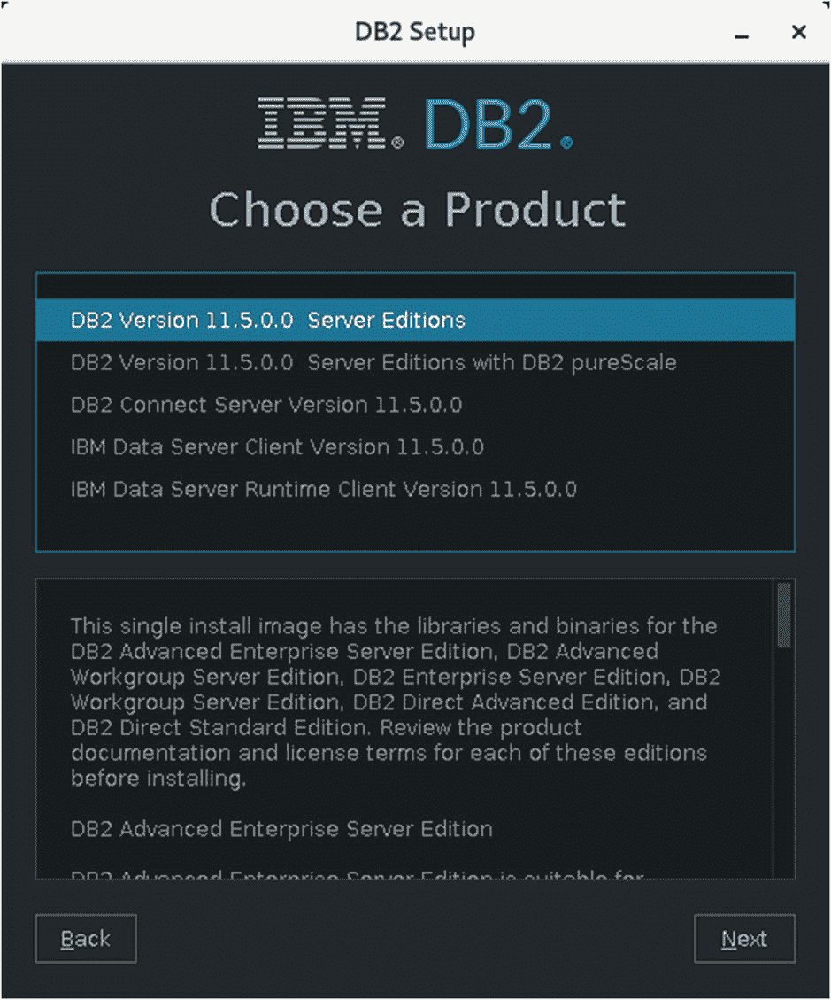
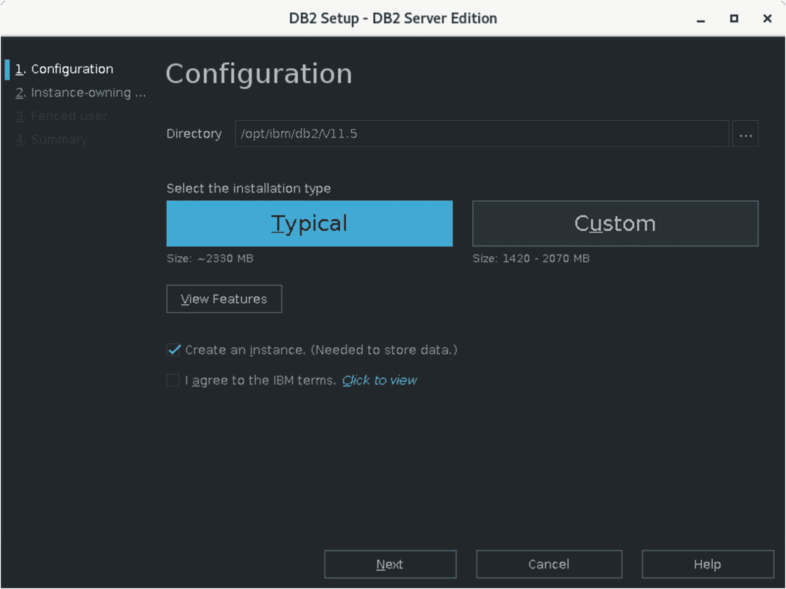
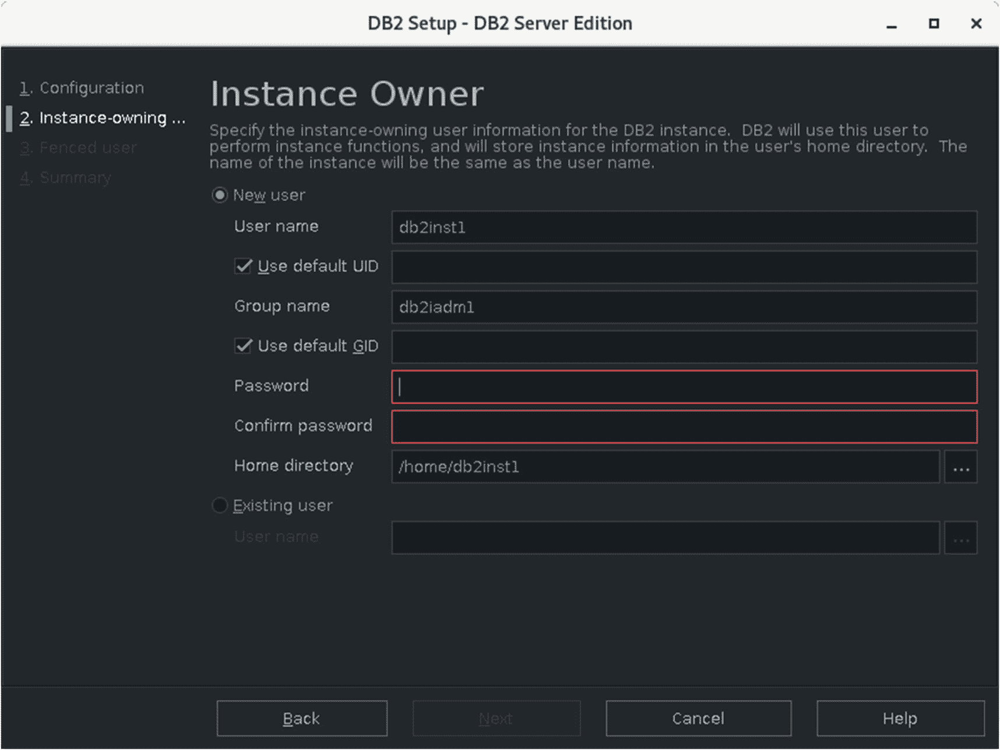
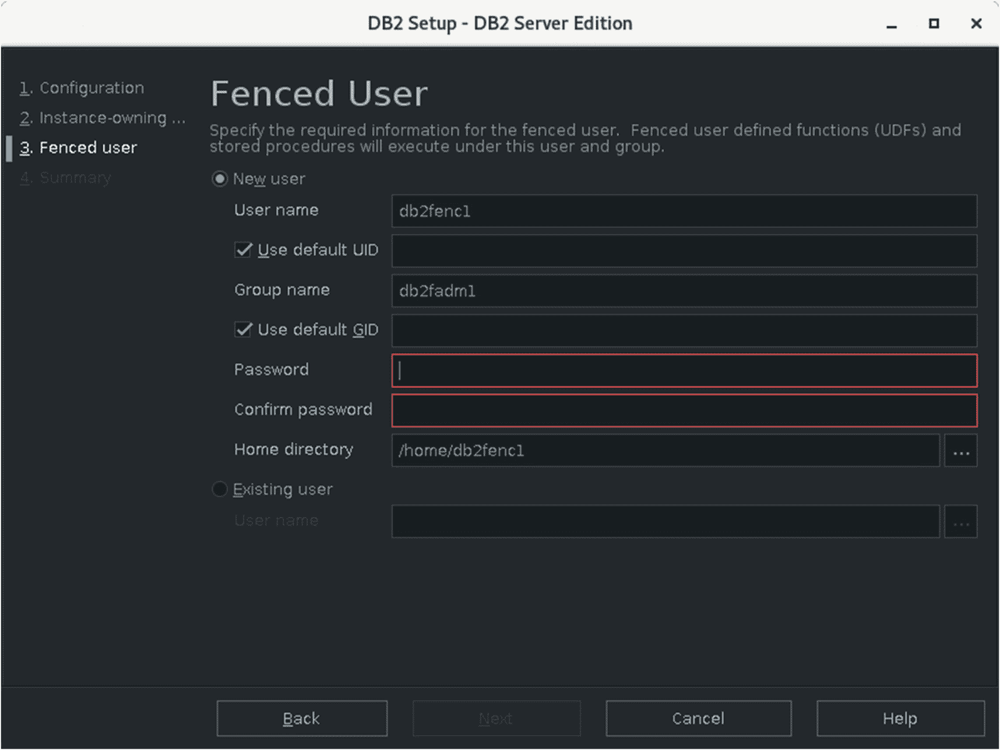
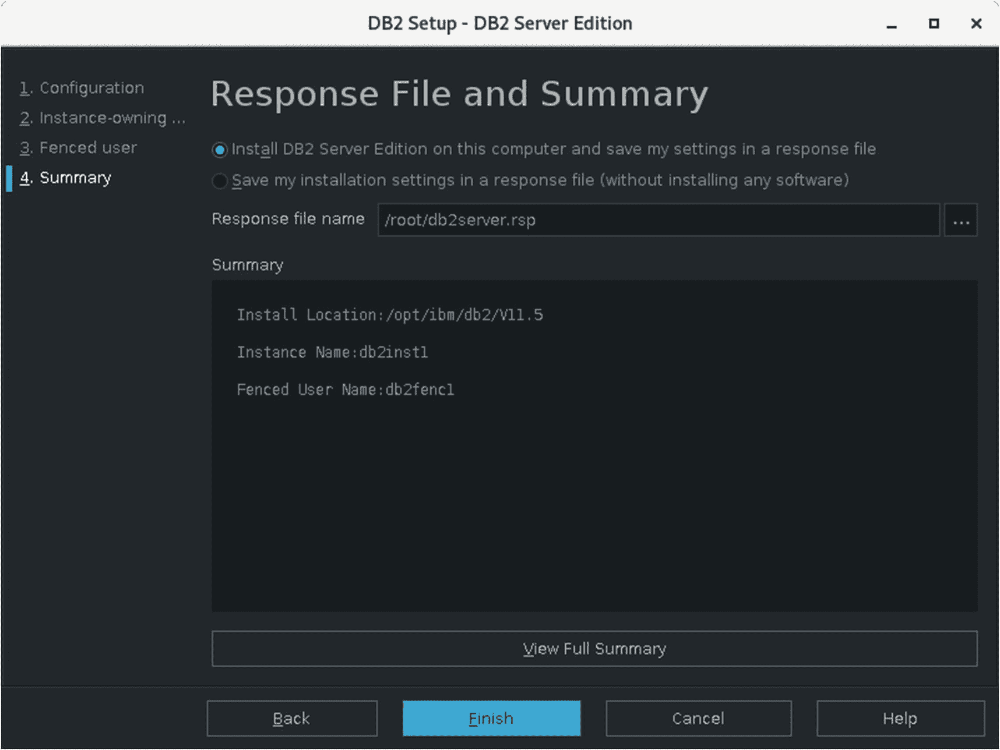
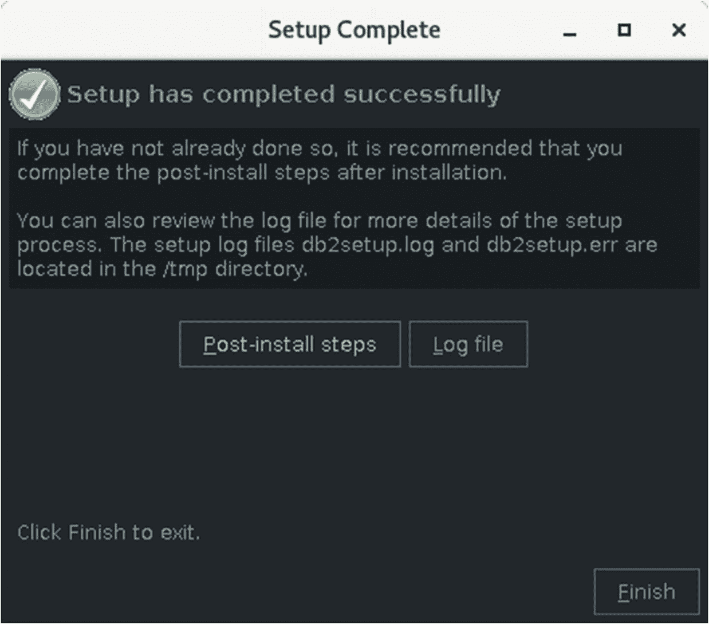

# 二、安装 Db2

本章介绍在 Linux 和 Windows 上安装 Db2。两种环境都使用相同的安装程序来执行用户 id 和权限的安装和创建。安装过程非常简单明了，但是在开始安装之前，您可能会遇到一些问题，安装程序无法回答这些问题。当我们遇到这些问题时，我们将尽力回答它们。

## 我的开发环境

我的开发环境不是你典型的 Windows home 系统。它由两台 Linux 服务器、一台 Windows 客户机和两台 Linux 客户机工作站组成。Linux 服务器不是典型的工作站，而是通常在小型企业环境中使用的专用服务器。我将尝试描述每个系统，以便您对我的环境有所了解。

第一个系统是安装了四个 2 TB 驱动器的 Lenovo ThinkSystem ST250 服务器。它有 32 GB 的内存和一个六核至强 CPU。这是我的主服务器，存放着我所有的文件。它可以通过我的防火墙经由 Apache Web 服务器在互联网上看到。操作系统是 Fedora 32。它还通过 Samba 托管我的 Windows 文件，并通过 libvirt 托管许多虚拟机。这是托管我的主要 Db2 数据库的系统。

第二个系统是联想 ThinkStation P320，256 GB 固态硬盘和 1 TB 硬盘，32 GB 内存，六核/六线程至强 CPU。这是我的开发服务器，实际上一年要改变两次配置。它目前运行的是 CentOS Linux 8.2。这台机器还托管了我的测试 Db2 环境。

第三台是我的 Windows 10 工作站。它通过服务器上的共享驱动器(Samba)连接到第一个 Linux 系统。这是我写作以及 Windows 开发和测试的地方。

第四个系统是联想 ThinkCentre M920，256 GB 固态硬盘，1 TB 硬盘，16 GB 内存。它有一个 i7 CPU。这是我的开发工作站，我在这里测试我所有的 Linux 开发和对服务器的远程访问。操作系统是 Fedora 32。

第五个系统是联想 ThinkPad T580，256 GB 固态硬盘，16 GB 内存，i7 CPU。它运行 Fedora 32，通常作为我的旅行机器，但也作为一个辅助测试设备。

## 安装先决条件

在启动 Db2 安装程序之前，需要满足一些先决条件，然后才能成功安装所有的东西。这本书的安装环境是 CentOS 8.2。该操作系统的先决条件对于 RHEL 8.2 应该是相同的，但是对于其他 Linux 环境可能有所不同。Windows 环境有自己的先决条件，但它们类似于 Linux 的先决条件。

我们首先需要的是 Db2 安装程序和支持文件。要获得 Db2 的免费版本，只需访问

[T2`www.ibm.com/account/reg/us-en/signup?formid=urx-33669`](https://www.ibm.com/account/reg/us-en/signup%253Fformid%253Durx-33669)

这将使您进入帐户注册页面。您可以使用现有的用户 id 登录，也可以创建一个新的用户 id。登录后，网站会向您显示一个首选项页面。选择您的首选项，然后选择继续按钮。在下一个网页上，选择您需要的下载。除非你需要它们，否则忽略 pureScale 支持下载。下载完成后，将下载的文件移动到一个安全的位置，然后解压缩。这将在当前目录下创建一个新的子目录，安装文件在其中展开。

Caution!

不要将下载的文件移动到要放置数据库的目录中。当您创建第一个数据库时，您手上会有一大堆文件。

在撰写本书时，可用的 Db2 版本是 11.5.4。当 IBM 推出新版本时，旧的免费 Db2 版本就不可用了。

现在您已经有了 Db2 的评估版本，您可能想知道它的局限性是什么。评估版永远不会过期。它对数据库的数量没有限制。唯一的限制是所有数据库的总大小，目前限制为 100 GB。这对于您自己执行软件评估来说已经足够了，除非您试图测试一个非常大的系统。如果这是您的计划，IBM 将非常乐意为 Db2 的生产版本甚至一些工程师提供帮助。

在这一点上，我们现在准备找出我们的先决条件是什么。为此，只需运行安装程序。这个程序位于我们之前创建的 untarred 子目录中。展开的目录被命名为`server_dec`。要运行安装程序，只需运行以下命令:

```py
$ cd server_dec
$ ./db2setup

```

如果 Db2 需要先决条件，安装程序会列出它们，然后退出。确保阅读安装程序输出的所有内容。在我们的 CentOS 8.2 系统上，它列出了两个先决条件:

*   libpam.so* (32 位)

*   libstdc++.so.6 (32 位)

“等等。为什么 Db2 需要 32 位库？”你问。Db2 是一系列产品的集合，其中一些产品已经十年甚至更久没有改变过。IBM 没有在系统中引入新的错误，而是选择保留其中一些产品的旧版本。因此，需要这些必备库来支持这些产品。

使用系统的软件安装程序安装必备软件包。对于 Linux，这将是基于 RPM 的包的`dnf`或`yum`程序。一旦安装了先决条件，就可以开始真正安装 Db2 了。但在此之前，我们需要做一点规划。

## 规划 Db2 安装

在开始安装之前，我们需要了解安装的结果是什么，这样我们就可以提前计划，避免以后出现意外。在这方面有两个要点需要讨论。

安装的第一个结果是您将在目标机器上创建两个新的 userids。这些 id 的默认名称是`db2inst1`和`db2fenc1`。这个`db2inst1` ID 将有一些文件存储在它的主目录中，你需要确保有足够的空间来容纳它们。文件的数量有限，但是您应该确保为它们做好准备。`db2fenc1` ID 只有非常有限数量的文件存储在其主目录中。

第二个结果并不是真正的安装结果。它更像是作为安装结果而设置的默认值。此项是将安装数据库的位置。数据库的默认位置是在`db2inst1`主目录中！这不是您想要存储数据库的地方！您可能会将它们存储在不同的驱动器/位置。在我们介绍完安装过程之后，在创建`sample`数据库之前，我们将再次讨论这一点。

安装过程中还会出现一些小问题，但是我们会在以后讨论这些问题。

## 安装 Db2

我们现在准备安装 Db2。这个过程必须由`root`(在 Linux 上)或`admin`(在 Windows 上)用户完成，所以从成为`root/admin`用户开始。在 Windows 上，您需要注销，然后以管理员用户身份重新登录。在 Linux 上，只需执行以下命令:

```py
$ su - root

```

在这之后，您需要切换到放置 Db2 下载包的扩展文件的目录。然后运行`db2setup`安装包:

```py
$ cd server_dec
$ ./db2setup

```

如果您已经安装了所有的先决条件，这将向您显示欢迎页面(图 [2-1](#Fig1) )。


图 2-1

Db2 安装欢迎页面

点击*新安装*按钮后，下一个窗口出现，允许您选择要安装的产品(图 [2-2](#Fig2) )。



图 2-2

Db2 安装选择产品页面

该页面有许多产品可供您选择。第一个产品是 *Db2 服务器，*，这是我们将要安装的产品。第二个产品是*带 pureScale 的 Db2，*，我们没有下载。第三个产品是用于分布式数据库的 *Db2 Connect 服务器*。第四个产品是 *Db2 Connect Client，*，用于构建包含 SQL 语句的编译代码。最后一个产品是 *Db2 运行时客户端*，它用于运行来自 *Db2 Connect 客户端*版本的编译代码。

此时，您应该选择列表中的第一项， *Db2 服务器版本*。如果您下载了较新版本的 Db2，版本号可能会有所不同。此时，其他选择并不重要。点击*下一个*按钮后，将出现下一页。



图 2-3

Db2 安装配置页面

配置页面允许您选择*典型*或*定制*安装。此时，选择一个*典型的*安装。在继续之前，您还必须选中复选框以同意 IBM 条款。完成后，点击*下一页*按钮，将出现如图 [2-4](#Fig4) 所示的下一页。



图 2-4

Db2 安装实例所有者页面

您可以查看*自定义*安装选项，了解您可能想要更改的一些项目。大多数用户只是执行一个典型的*安装。*

Instance Owner 页面允许您创建将拥有第一个 Db2 实例的帐户和新用户的组名。只需保留出现的`db2inst1`信息，然后输入新账户的密码和确认信息。这是将在主目录中安装新文件的帐户。当您输入新密码并确认后，点击*下一步*，将显示如图 [2-5](#Fig5) 所示的页面。



图 2-5

Db2 安装防护用户页面

`db2fenc1`用户将在 Db2 数据库的地址空间之外运行用户定义的函数和存储过程。输入`db2fenc1`密码并确认。完成后，点击*下一步*，将显示图 [2-6](#Fig6) 中的页面。



图 2-6

Db2 安装响应文件和摘要页面

下一页是响应文件和摘要页。响应文件是安装文件集的一部分，因此不必创建它。点击*完成*按钮，开始安装 Db2，如图 [2-7](#Fig7) 所示。


图 2-7

Db2 安装进度页面

两个状态栏跟踪所有组件的安装进度。完成后，您将自动进入下一页(图 [2-8](#Fig8) )。



图 2-8

Db2 安装完成页面

当安装完成时，这是将显示的页面。您可以选择查看安装后的步骤，查看日志文件，或者单击*完成*按钮退出安装。

至此，Db2 安装步骤已经完成，我们已经准备好查看需要考虑的安装后任务。

Note

在 Ubuntu Linux 中，默认情况下，Db2 安装创建的 Db2 实例所有者和 fenced 用户被分配 Dash shell。这可能会导致脚本以行 *#开头！/bin/bash* 停止工作。如果您想在登录到这些用户中的任何一个时使用 Bash 作为默认 shell，那么在执行任何其他操作之前，请执行命令 **csh -s /bin/bash username** (其中 **username** 是 Db2 实例所有者或受保护用户的名称)。

## Db2 安装后任务

Db2 安装完成后，需要执行一些任务:

1.  尝试使用您在`db2setup`命令中设置的密码登录到`db2fenc1`用户 id。纠正你可能发现的任何问题。

2.  尝试使用您在`db2setup`命令中设置的密码登录到`db2inst1`用户 id。纠正你可能发现的任何问题。您应该记下 sqllib 目录的位置及其内容，因为您可能需要熟悉它们。这可能是也可能不是另一个位置的链接。

3.  如果您不希望数据库存储在`db2inst1`目录树中，那么现在是时候改变这个位置了。以用户 id`db2inst1`的身份登录并运行以下命令:

```py
$ db2 update dbm cfg using dftdbpath /your/db/path

```

这将更新 Db2 配置中的路径，这样所有属于`db2inst1`的数据库都将存储在新位置。

此时，我们已经完成了安装后的任务，并准备好继续安装`sample`数据库。

## 安装 Db2 示例数据库

Db2 附带了一个名为`sample`的默认数据库。这个数据库虽然很小，但足够全面地展示了数据库应该如何构造，并有助于演示一系列可能的 SQL 命令。这本书广泛使用了`sample`数据库来演示 Db2 概念、SQL 用法和 Python 编程示例。

要安装`sample`数据库，请遵循以下步骤。

登录到`db2inst1`用户 id:

```py
$ su - db2inst1

```

需要启动 Db2 数据库实例，因此这是我们的下一步:

```py
$ db2start

```

现在我们可以实际安装示例数据库了。该命令需要几分钟时间，所以请耐心等待:

```py
$ db2sampl -force -sql

```

`-force`选项确保如果已经安装了数据库，它将被默认内容覆盖。`-sql`选项告诉 Db2 不要将 XML 数据安装到数据库中。

现在我们可以连接到数据库并测试它:

```py
$ db2 connect to sample

```

如果成功，您应该会看到如下所示的输出:

```py
  Database Connection Information

Database server        = DB2/LINUXX8664 11.5.0.0
SQL authorization ID   = DB2INST1
Local database alias   = SAMPLE

```

现在我们可以运行一个测试 SQL 命令来查询数据库:

```py
$ db2 "select * from department"

```

Important

一定要在 **db2** 后面的文本周围加上引号。如果省略引号，操作系统将试图错误地处理该命令，从而导致错误。

如果一切正常，您应该会看到总共显示了 14 条记录。我们现在可以使用以下命令终止与数据库的连接:

```py
$ db2 connect reset

```

如果成功，我们与数据库的连接将被终止。

## 摘要

本章介绍了安装和验证 Db2 安装的步骤。请务必阅读本章中的“注意”、“注意”和“重要”部分，因为它们对某些操作系统有重要的信息。