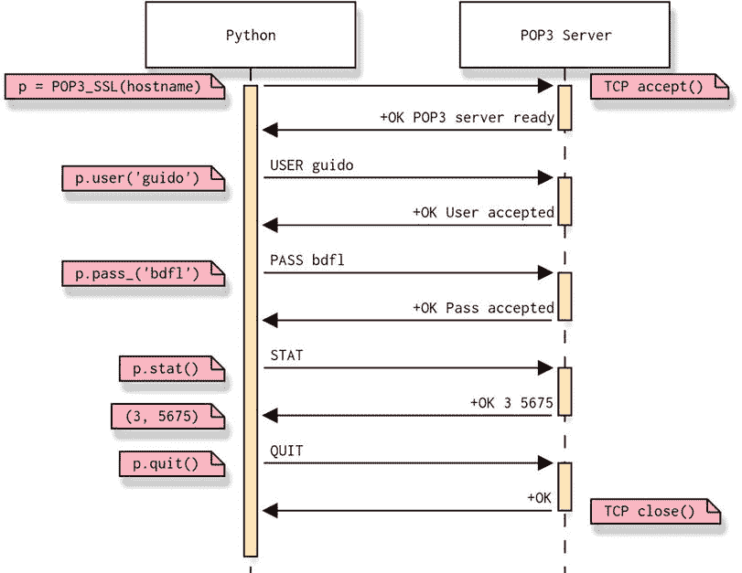

# 十四、POP

邮局协议 POP ，是一个从服务器下载电子邮件的简单协议。它通常通过电子邮件客户端使用，如 Thunderbird 或 Outlook。如果你想了解电子邮件客户端和像 POP 这样的协议在互联网电子邮件历史中的位置，你可以重读第 13 章的前几节。

如果你很想用 POP，那么你应该考虑用 IMAP 来代替；第 15 章将解释 IMAP 提供的特性，这些特性使它成为比 POP 支持的原始操作更坚实的远程电子邮件访问基础。

POP 最常见的实现是版本 3，通常称为 POP3。因为版本 3 是如此占主导地位，POP 和 POP3 这两个术语在今天实际上是可以互换的。

POP 的主要优点——也是它最大的缺点——是它的简单。如果您只是需要访问远程邮箱，下载任何新出现的电子邮件，并在下载后选择删除电子邮件，那么 POP 将是您的完美选择。您将能够快速完成这项任务，无需复杂的代码。

但是下载和删除几乎是 POP 的全部功能。它不支持远程端的多个邮箱，也不提供任何可靠、持久的消息标识。这意味着您不能使用 POP 作为电子邮件同步的协议，即您将每封电子邮件的原始副本留在服务器上，同时制作一份副本供本地读取，因为当您稍后返回到服务器时，您无法轻易辨别您已经下载了哪些邮件。如果你需要这个功能，你应该看看 IMAP，这将在[第 15 章](15.html)中介绍。

Python 标准库提供了`poplib`模块，为使用 POP 提供了便捷的接口。本章将解释如何使用`poplib`连接到 POP 服务器，收集关于邮箱的摘要信息，下载邮件，以及从服务器上删除邮件原件。一旦您知道如何完成这四项任务，您将涵盖所有标准的 POP 功能！

请注意，Python 标准库不提供充当 POP 服务器的功能，而只提供客户端功能。如果您需要实现一个服务器，您将需要找到一个提供 POP 服务器功能的第三方 Python 包。

POP 服务器兼容性

众所周知，POP 服务器不遵守标准。对于一些 POP 行为来说，标准也根本不存在，把细节留给了服务器软件的作者。因此，虽然基本的操作通常可以正常工作，但某些行为确实会因服务器而异。

例如，一些服务器会在您连接到服务器时将您的所有邮件标记为已读——无论您是否下载了任何邮件！其他服务器会在下载邮件时将其标记为只读。有些服务器根本不会将任何邮件标记为已读。标准本身似乎假设了后一种行为，但两者都不清楚。阅读本章时，请记住这些不同之处。

图 14-1 展示了一个由 Python 驱动的非常简单的 POP 对话。



[图 14-1](#_Fig1) 。使用 POP 的简单对话

连接和认证

POP 支持多种身份验证方法。最常见的两种是基本用户名-密码验证和 APOP，后者是 POP 的可选扩展，如果您使用的是不支持 SSL 的老式 POP 服务器，它有助于防止密码以纯文本形式发送。

Python 中连接和验证远程服务器的过程如下所示:

1.  创建一个`POP3_SSL`或者只是一个普通的`POP3`对象，并将远程主机名和端口传递给它。
2.  调用`user()`和`pass_()`发送用户名和密码。注意`pass_()`中的下划线！它之所以存在，是因为`pass`是 Python 中的一个关键字，不能用于方法名。
3.  如果引发异常`poplib.error_proto`，则意味着登录失败，异常的字符串值包含服务器发送的错误解释。

在`POP3`和`POP3_SSL`之间的选择取决于你的电子邮件提供商是否提供——或者，在这个时代，甚至要求——你通过加密连接进行连接。查阅[第 6 章](06.html)以获得更多关于 SSL 的信息，但是一般规则应该是只要可行就使用 SSL。

[清单 14-1](#list1) 使用上述步骤登录到远程 POP 服务器。一旦连接上，它就调用`stat()`，返回一个简单的元组，给出邮箱中的消息数量和消息的总大小。最后，程序调用`quit()`，关闭 POP 连接。

**POP-3 协议**

目的:允许从收件箱下载电子邮件

标准:RFC 1939(1996 年 5 月)

运行于:TCP/IP 之上

默认端口:110(明文)，995 (SSL)

 `库:弹出式菜单

[***清单 14-1***](#_list1) 。非常简单的流行音乐会

```py
#!/usr/bin/env python3
# Foundations of Python Network Programming, Third Edition
# https://github.com/brandon-rhodes/fopnp/blob/m/py3/chapter14/popconn.py

import getpass, poplib, sys

def main():
    if len(sys.argv) != 3:
        print('usage: %s hostname username' % sys.argv[0])
        exit(2)

    hostname, username = sys.argv[1:]
    passwd = getpass.getpass()

    p = poplib.POP3_SSL(hostname)  # or "POP3" if SSL is not supported
    try:
        p.user(username)
        p.pass_(passwd)
    except poplib.error_proto as e:
        print("Login failed:", e)
    else:
        status = p.stat()
        print("You have %d messages totaling %d bytes" % status)
    finally:
        p.quit()

if __name__ == '__main__':
    main()
```

 **注意**虽然这个程序不会改变任何消息，但是一些 POP 服务器会仅仅因为你连接就改变邮箱标志。对实时邮箱运行本章中的示例可能会导致您丢失有关已读、未读、新邮件或旧邮件的信息。不幸的是，这种行为依赖于服务器，并且不受 POP 客户端的控制。我强烈建议对测试邮箱运行这些示例，而不是对您的真实邮箱！

这个程序有两个命令行参数:POP 服务器的主机名和用户名。如果您不知道此信息，请联系您的互联网提供商或网络管理员。请注意，在某些服务中，您的用户名将是一个普通字符串(如`guido`)，而在其他服务中，它将是您的完整电子邮件地址(`guido@example.com`)。

然后，程序会提示您输入密码。最后，它将显示邮箱的状态，而不接触或改变你的任何邮件。

下面是你如何在 Mininet playground 中运行程序，你可以从本书的源代码库中下载(见第一章第一节):

```py
$ python3 popconn.py mail.example.com brandon
Password: abc123
You have 3 messages totaling 5675 bytes
```

如果您看到这样的输出，那么您的第一次 POP 对话就成功了！

当 POP 服务器不支持 SSL 来保护您的连接免受窥探时，它们有时至少支持一种称为 APOP 的替代认证协议，该协议使用挑战-响应方案来确保您的密码不会以明文形式发送。(但是，您的所有电子邮件仍然会被任何看到数据包经过的第三方看到！)Python 标准库使这种尝试变得非常容易:只需调用`apop()`方法，然后如果您与之对话的 POP 服务器不理解，就退回到基本认证。

要使用 APOP，但回到简单的认证，您可以在您的 POP 程序中使用类似于清单 14-2 中所示的一段代码(如清单 14-1 中的[)。](#list1)

[***清单 14-2***](#_list2) 。尝试 APOP 和后退

```py
print("Attempting APOP authentication...")
try:
p.apop(user, passwd)
except poplib.error_proto:
print("Attempting standard authentication...")
try:
p.user(user)
p.pass_(passwd)
except poplib.error_proto as e:
print("Login failed:", e)
sys.exit(1)
```

 **注意**无论何种方式只要登录成功，一些较老的 POP 服务器就会锁定邮箱。锁定可能意味着不能对邮箱进行任何更改，甚至意味着在锁定解除之前不能再发送任何电子邮件。问题是一些 POP 服务器不能正确地检测错误，如果你没有调用`quit()`就挂断了连接，它们会无限期地锁定一个盒子。曾经世界上最流行的 POP 服务器就属于这一类！因此，在结束 POP 会话时，在 Python 程序中始终调用`quit()`是至关重要的。您会注意到，这里显示的所有程序清单总是小心翼翼地`quit()`到 Python 保证最后执行的`finally`块中。

获取邮箱信息

前面的例子向您展示了`stat()`，它返回邮箱中的邮件数量及其总大小。另一个有用的 POP 命令是`list()`，它返回每条消息的更多详细信息。

最有趣的部分是消息编号，稍后检索消息时需要用到它。请注意，在消息编号中可能会有间隙:例如，在给定时刻，一个邮箱可能只包含消息编号 1、2、5、6 和 9。此外，在您与 POP 服务器的每次连接中，分配给特定邮件的号码可能会有所不同。

清单 14-3 展示了如何使用`list()`命令来显示每条消息的信息。

[***清单 14-3***](#_list3) 。使用`POP list()`命令

```py
#!/usr/bin/env python3
# Foundations of Python Network Programming, Third Edition
# https://github.com/brandon-rhodes/fopnp/blob/m/py3/chapter14/mailbox.py

import getpass, poplib, sys

def main():
    if len(sys.argv) != 3:
        print('usage: %s hostname username' % sys.argv[0])
        exit(2)

    hostname, username = sys.argv[1:]
    passwd = getpass.getpass()

    p = poplib.POP3_SSL(hostname)
    try:
        p.user(username)
        p.pass_(passwd)
    except poplib.error_proto as e:
        print("Login failed:", e)
    else:
        response, listings, octet_count = p.list()
        if not listings:
            print("No messages")
        for listing in listings:
            number, size = listing.decode('ascii').split()
            print("Message %s has %s bytes" % (number, size))
    finally:
        p.quit()

if __name__ == '__main__':
    main()
```

`list()`函数返回一个包含三项的元组。你一般应该注意第二项。这是目前我的一个 POP 邮箱的原始输出，其中有三条消息:

```py
('+OK 3 messages (5675 bytes)', ['1 2395', '2 1626', '3 1654'], 24)
```

第二个项目中的三个字符串给出了收件箱中三封邮件的邮件号和大小。清单 14-3 中[执行的简单解析让它以更漂亮的格式呈现输出。下面是你如何在部署在书的网络游乐场内部的 POP 服务器上运行它(见](#list3)[第一章](01.html)):

```py
$ python3 mailbox.py mail.example.com brandon
Password: abc123
Message 1 has 354 bytes
Message 2 has 442 bytes
Message 3 has 1173 bytes
```

下载和删除邮件

您现在应该已经掌握了 POP 的诀窍:当使用`poplib`时，您发出一些小的原子命令，这些命令总是返回一个元组，元组内部是各种字符串和字符串列表，向您显示结果。您现在实际上已经准备好处理消息了！三种相关方法都使用由`list()`返回的相同整数标识符来标识消息，如下所示:

*   `retr(num)` :该方法下载一条消息，并返回一个包含结果代码和消息本身的元组，以行列表的形式传递。这将导致大多数 POP 服务器将该邮件的“已读”标志设置为“真”，禁止您再次从 POP 中看到该邮件(除非您有其他方法进入您的邮箱，让您将邮件设置回“未读”)。
*   `top(num, body_lines)` :该方法以与`retr()`相同的格式返回结果，而不将消息标记为“已看到”但是它并没有返回整个消息，而是只返回标题以及您在`body_lines`中请求的正文的行数。如果您想让用户决定下载哪些邮件，这对于预览邮件很有用。
*   `dele(num)` :该方法将消息标记为从 POP 服务器中删除，在您退出 POP 会话时发生。通常，只有当用户直接请求不可撤销地销毁消息时，或者如果您已经将消息存储到冗余存储中(并且可能已经备份了它),并且已经使用类似于`fsync()`的东西来确保数据确实已经被写入，您才会这样做，因为您将再也无法从服务器中检索消息。

为了把所有的东西放在一起，看一下清单 14-4 ，这是一个功能相当强大的电子邮件客户端，说 POP！它检查你的收件箱，以确定有多少信息，并学习他们的号码；然后它使用`top()`来提供每一个的预览；而且，根据用户的选择，它可以检索整个邮件并将其从邮箱中删除。

[***清单 14-4***](#_list4) 。一个简单的 POP 电子邮件阅读器

```py
#!/usr/bin/env python3
# Foundations of Python Network Programming, Third Edition
# https://github.com/brandon-rhodes/fopnp/blob/m/py3/chapter14/download-and-delete.py

import email, getpass, poplib, sys

def main():
    if len(sys.argv) != 3:
        print('usage: %s hostname username' % sys.argv[0])
        exit(2)

    hostname, username = sys.argv[1:]
    passwd = getpass.getpass()

    p = poplib.POP3_SSL(hostname)
    try:
        p.user(username)
        p.pass_(passwd)
    except poplib.error_proto as e:
        print("Login failed:", e)
    else:
        visit_all_listings(p)
    finally:
        p.quit()

def visit_all_listings(p):
    response, listings, octets = p.list()
    for listing in listings:
        visit_listing(p, listing)

def visit_listing(p, listing):
    number, size = listing.decode('ascii').split()
    print('Message', number, '(size is', size, 'bytes):')
    print()
    response, lines, octets = p.top(number, 0)
    document = '\n'.join(line.decode('ascii') for line in lines)
    message = email.message_from_string(document)
    for header in 'From', 'To', 'Subject', 'Date':
        if header in message:
            print(header + ':', message[header])
    print()
    print('Read this message [ny]?')
    answer = input()
    if answer.lower().startswith('y'):
        response, lines, octets = p.retr(number)
        document = '\n'.join(line.decode('ascii') for line in lines)
        message = email.message_from_string(document)
        print('-' * 72)
        for part in message.walk():
            if part.get_content_type() == 'text/plain':
                print(part.get_payload())
                print('-' * 72)
    print()
    print('Delete this message [ny]?')
    answer = input()
    if answer.lower().startswith('y'):
        p.dele(number)
        print('Deleted.')

if __name__ == '__main__':
    main()
```

你会注意到清单使用了在第 12 章的[中引入的`email`模块，这是一个很大的优势，因为即使是带有 HTML 和图像的花哨的现代 MIME 电子邮件通常也有一个`text/plain`部分，`email`模块可以代表这样一个简单的程序提取该部分以打印到屏幕上。](12.html)

如果你在书中的网络游戏中运行这个程序(参见[第 1 章](01.html)，你会看到类似下面的输出:

```py
$ python3 download-and-delete.py mail.example.com brandon
password: abc123
Message 1 (size is 354 bytes):

From: Administrator <admin@mail.example.com>
To: Brandon <brandon@mail.example.com>
Subject: Welcome to example.com!

Read this message [ny]? y
------------------------------------------------------------------------
We are happy that you have chosen to use example.com's industry-leading
Internet e-mail service and we hope that you experience is a pleasant
one.  If you ever need your password reset, simply contact our staff!

- example.com
------------------------------------------------------------------------

Delete this message [ny]? y
Deleted.
```

摘要

POP 提供了一种下载存储在远程服务器上的电子邮件的简单方法。使用 Python 的`poplib`接口，您可以获得关于邮箱中邮件数量和每封邮件大小的信息。您也可以按号码检索或删除单个留言。

连接到 POP 服务器可能会锁定邮箱。因此，尽量缩短 POP 会议，并在会议结束后打电话给`quit()`是很重要的。

只要有可能，POP 应该与 SSL 一起使用，以保护您的密码和电子邮件的内容。在没有 SSL 的情况下，尝试至少使用 APOP；只有在你迫切需要使用 POP 并且没有更好的选项可用的可怕情况下，才发送你的密码。

尽管 POP 是一种简单且广泛使用的协议，但它有许多缺点，不适合某些应用。例如，它只能访问一个文件夹，并且不提供对单个邮件的持久跟踪。

下一章将讨论 IMAP，这是一个提供 POP 特性和许多新特性的协议。`