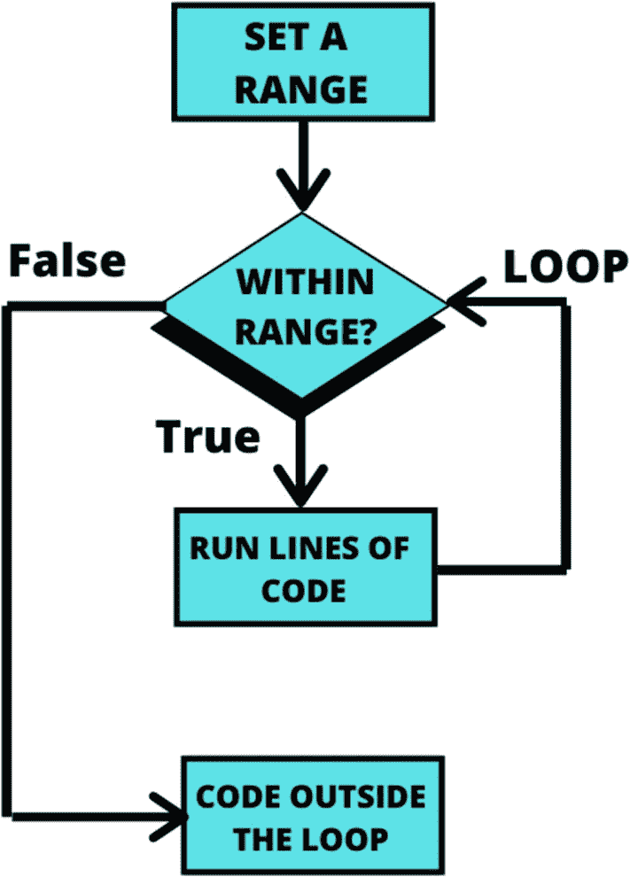
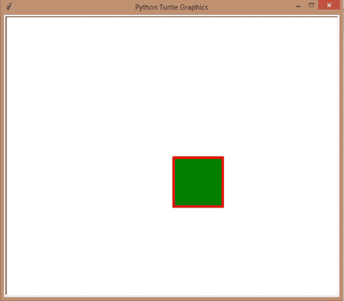
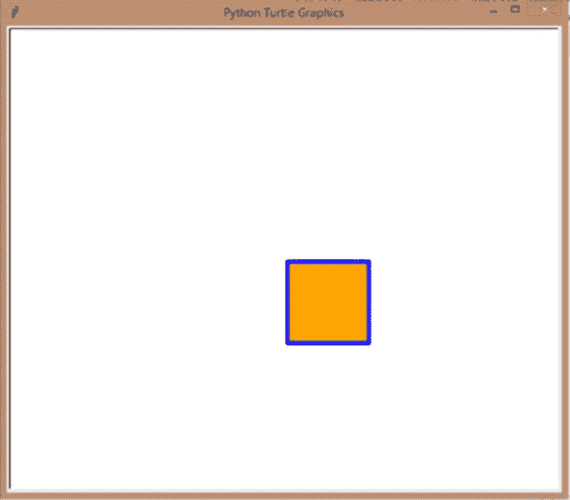
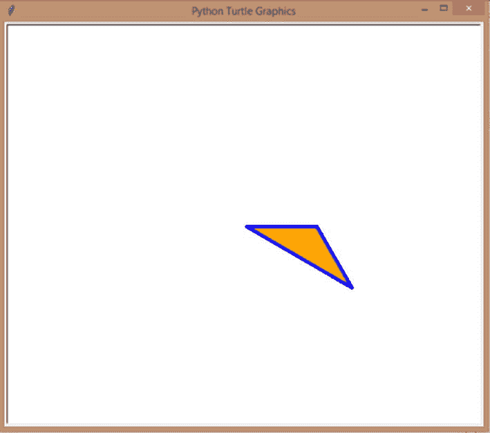
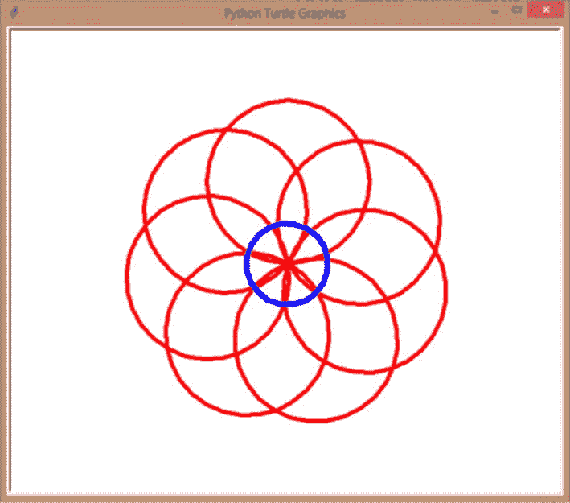
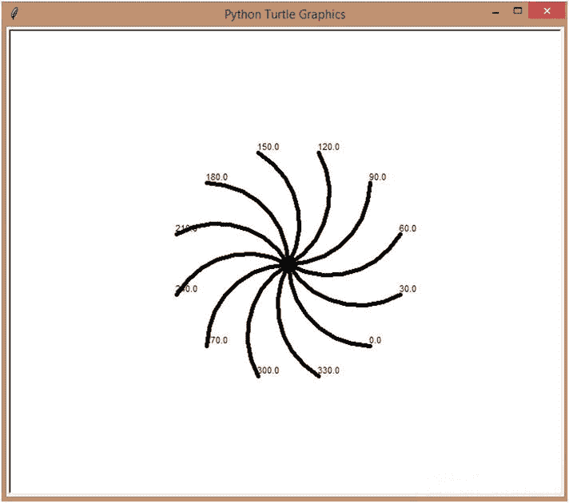
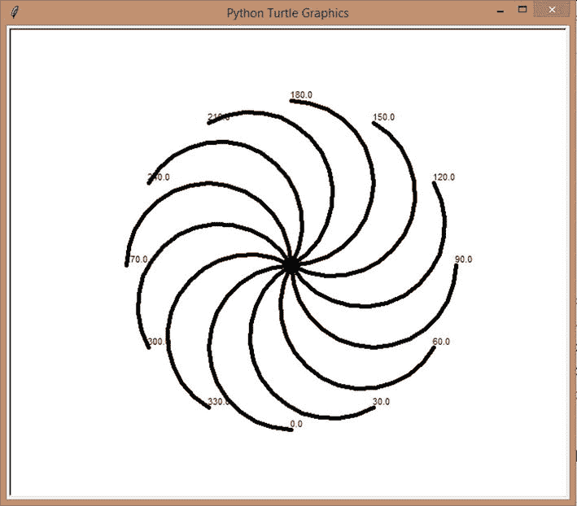

# 10.自动化一点

在前一章中，我们学习了所有关于条件、if、else 和 elif 语句的知识，以及如何组合多个条件来创建复杂的命令。

在这一章中，让我们看看循环的自动化，如何使用 for 和 while 循环来自动化图形的创建，如何用 break 语句提前结束循环，等等。在这一章中，我们将会看到许多丰富多彩和有趣的迷你项目。

## 魔法圈！


Python 的神奇和奇妙是永无止境的，循环是其中的佼佼者！还记得我们为了在 turtle 中绘制一个简单的小图形而编写的大量代码吗？你想要更简单的方法来做同样的事情吗？如果您可以用四到五行代码一个接一个地画出数百个方块，那会怎么样？那只是一个例子。如果你想在海龟身上打印出 1 到 100 的数字，又是 4 到 5 行代码，该怎么办呢？这是 100 条打印语句，但我们只用了四行代码就完成了。怎么会？这就是循环的力量。

使用循环，你可以让你的程序重复相同的动作任意次。您想打印 1 到 100 之间的内容吗？可以创建一个自动化代码，从 1 开始，打印 1，然后 1 加 1，就是 2；打印出来，并再次递增；等等。

看图 [10-1](#Fig1) 。我们有一堆代码行。存在一个范围，只要该范围为真，我们就运行相同的代码行。该范围从一个数字开始，每次循环重复时递增 1。一旦达到设定的数量，我们就停止运行“循环”。每次运行这些相同的代码行，就称为一次迭代。在我们的例子中，我们将有 100 次这样的迭代来打印 1 到 100。



图 10-1

循环——插图

Python 中有两种类型的循环，我们将同时研究这两种循环。我还将通过许多迷你项目来展示这些循环的威力。你对开始感到兴奋吗？我知道我是！循环是真正的交易。你已经成功一半了！

## 对于循环

For 循环是最常用的循环。他们不只是迭代给定的次数。是的，他们确实是这样做的，但是你可以使用“for 循环”来迭代字符串、列表和许多类似的复杂数据。

在这一章中，我们将只研究在给定的数字范围内使用 for 循环，或者用一个字符串作为范围。一旦我们将来看到复杂的数据类型，比如列表和字典，让我们重温一下 for 循环，以及如何在这些数据类型中使用它们，好吗？

好吧，那我们开始吧！

让我们继续前面的例子。我想打印从 1 到 100 的数字。你已经看过插图了。你知道需要什么。让我们先看看如何在一个范围内写一个 for 循环，然后让我们试着解决我们的问题，好吗？

语法非常简单。您必须以“for”关键字开始语法，并在整个语法中使用小写字母。然后，您需要创建一个临时变量。它可以是一个“x”(随机的，未知的数字)或一个“I”(表示迭代)，或者它可以是你想要的任何变量名。该变量将在每次迭代的范围内存储您的当前数字。

所以，如果你的范围是从 1 到 5，假设我们把临时变量命名为“x”。

```py
Iteration 1 : x is 1
Iteration 2 : x is 2
Iteration 3 : x is 3
Iteration 4 : x is 4
Iteration 5 : x is 5

```

当 x 达到 5 时，我们的循环停止执行。你知道这是怎么回事吗？

此外，你的数值范围可以是任何东西，真的，只要它有连续性。如果您给定的范围是 range(1，6)，那么这意味着您希望每次迭代的 x 值从 1 到 5。忽略范围内的最后一个数字。

别忘了你的结肠！就像在你的“if”语句中一样，你的“for”语句以一个冒号结尾，并且它里面的代码行应该放在一个缩进后面。

所以，语法应该是这样的:

```py
for x in range(1,6):
    lines of code

```

我知道，我知道。都有点混乱，太理论化了。我们来看一堆例子，好吗？

我的问题陈述是什么来着？我想打印从 1 到 100 的数字，对吗？范围应该是 range(1，101 ),因为我希望包含 100，并且我只需要在循环中包含一个 print 语句。

代码应该是这样的:

```py
for x in range(1,101):
    print(x)

```

运行前面的代码，您会得到这样的结果:

```py
= RESTART: C:\Users\aarthi\AppData\Local\Programs\Python\Python38-32\numbers.py
1
2
3
.
.
.
97
98
99
100

```

我的代码打印了全部内容，但是我不认为我们在这一章中有足够的空间来打印所有内容，所以这里是它的“剪切”版本。你有没有运行代码看看？很神奇，对吧？你只用了两行代码就完成了所有这些。仅此而已。 ***即*** 是循环往复的力量。

只有当我想打印范围内的所有内容时，这才有效。如果我只想打印偶数，该怎么办？我可以给出一个我力所能及的条件来实现它。

假设我的范围是这样的:`range(2,101,2)`

我基本上要求我的代码从 2 到 100 打印，但是对于每一次迭代，我希望“x”的当前值增加 2 而不是 1。

因此，x 在第一次迭代中是 2，在第二次迭代中是 4，依此类推。我们要测试这个吗？

```py
for x in range(2,101,2):
    print(x)

```

当我运行前面的代码时，我会得到这样的结果:

```py
= RESTART: C:\Users\aarthi\AppData\Local\Programs\Python\Python38-32\numbers.py
2
4
6
8
10
.
.
.
94
96
98
100

```

如果你希望每次的增量都是 3，那么把 3 作为第三个参数，以此类推。

## for 循环中的 If 语句

或者，我可以使用我们在第 [5](05.html) 章学到的模数运算符来过滤掉我不想要的数字。所以，如果我只想打印 off 数，那么我可以做一个 x % 2 运算，每当我得到 1 的结果时，我就可以确认当前数是奇数并打印出来。

`1 % 2`是`1`

`2 % 2`是`0`

3 `%` 2 又是 1

你看到模式了吗？让我们试试这个！

```py
for x in range(1,101):
    if (x % 2) == 1:
        print(x)

```

现在你知道如何在 for 循环中使用 if 语句了。同样，也可以在 if 循环中使用 for 语句。

```py
= RESTART: C:\Users\aarthi\AppData\Local\Programs\Python\Python38-32\numbers.py
1
3
5
7
.
.
.
93
95
97
99

```

## 嵌套 for 循环

您也可以在 for 循环中创建 for 循环。这些被称为嵌套 for 循环。为了演示嵌套循环是如何工作的，我将在本节末尾创建一个为每次迭代打印星号的模式，作为一个迷你项目。

但在我们开始之前，我想介绍一个印刷概念。你有没有注意到每个新的打印语句是如何写在新的一行中的？这是默认的。但是如果我们不想那样呢？如果我们希望下一条 print 语句与前一条语句在同一行，该怎么办？您可以使用" end = "语法来实现这一点。

```py
print('Hello', end = " ")
print('there!')

```

如果您运行前面的代码行，您将得到以下结果:

```py
= RESTART: C:\Users\aarthi\AppData\Local\Programs\Python\Python38-32\numbers.py
Hello there!

```

end = " "告诉您的 print 语句用一个空格结束 print 语句，并指示 IDLE 在空格后立即打印下一个 print 语句，而不是在新的一行中。

现在你知道了如何操作 print 语句，让我们回到嵌套循环。

实际上，语法非常简单。假设我想连续打印 123 个数字，一个接一个，重复十次。因此，外部循环的范围为(1，11)，内部 for 循环的范围为(1，4)，print 语句只出现在内部 for 循环中，因为我们只需要打印出 1、2 和 3。我们来测试一下，好吗？

```py
for x in range(1,11):
    for i in range(1,4):
        print(i, end = "")

```

在前面的代码行中，我没有在 end =后面加空格，因为我希望 1、2 和 3 一个接一个地打印出来。另一方面，如果我给出这样的结果:end = "，那么我会在每一行得到 1，2，3 这样的结果。你可以随心所欲地设计这个。尝试使用其他特殊字符来操纵结果。

当我运行前面的代码时，我得到这样的结果:

```py
= RESTART: C:\Users\aarthi\AppData\Local\Programs\Python\Python38-32\numbers.py
123123123123123123123123123123

```

哎呀，出问题了！那是什么？好吧，我们从来没有打破界限，不是吗？我们需要在每一行都写完之后这样做，这样我们就可以在下一行重复同样的事情，我说的对吗？让我来。

Python 中有一段代码可以让您创建一个新行。它叫做\n，它类似于我们在想把单引号和双引号排除在代码之外时使用的反斜杠，还记得吗？所以我只需要在内部 for 循环结束后添加另一行代码。

```py
for x in range(1,6):
    for i in range(1,4):
        print(i, end = "")
    print("\n")

```

你看到凹痕了吗？第一个打印语句在内部 for 循环中，第二个打印语句在外部 for 循环中。缩进会影响 Python 代码的成败，所以要非常小心，好吗？如果我在第一行的同一行写第二个 print 语句，那么 Python 会认为我想要在每个数字都被打印出来之后，而不是在每一行都被打印出来之后再写一行。那就完全不同了，不是吗？

当我运行前面的代码时，我得到了这样的结果:

```py
= RESTART: C:\Users\aarthi\AppData\Local\Programs\Python\Python38-32\numbers.py
123

123

123

123

123

```

或者，您可以用一个空的 print()结束外部的 for 循环，您将得到一个新行，因为默认情况下 print 语句会生成新行。

## 迭代字符串

与“while”循环相比，for 循环的优点在于它们迭代的是事物，而不仅仅是数字范围。例如，您可以迭代字符串中的每个字母。你想尝尝吗？

让我创建一个变量“a ”,并在其中放置一个字符串“Hello there”。然后，我将使用相同的语法，但这一次，我将只提到“a”，它包含字符串，而不是范围。

```py
a = 'Hello there!'
for x in a:
    print(x)

```

让我们看看我们得到了什么:

```py
= RESTART: C:\Users\aarthi\AppData\Local\Programs\Python\Python38-32\numbers.py
H
e
l
l
o

t
h
e
r
e
!

```

看那个！每一行都印上了每个字符。很整洁，是吧？想想像这样强大的东西的所有可能性！

## While 循环

既然您已经彻底探索了“for”循环，而“循环是小菜一碟，相信我。与 for 循环不同，while 循环会一直执行循环中的语句，只要条件为真。还记得你的“如果”声明吗？与此类似，但这里有一个额外的迭代元素。

语法非常简单:

```py
initialize
while condition:
    lines of code
    increment

```

语法有点混乱，不是吗？我举个例子解释一下。实际上，它类似于 for 循环，只是稍微长一点。在 for 循环中，我们给出一个范围。假设我们的范围从 1 开始，那么在我们的“while”循环中，我们需要用范围的开始来初始化我们的临时变量，如下所示:

```py
x = 1

```

然后，我们需要条件。假设我们希望范围在 11 处结束，这意味着它需要从 1 迭代到 10，因此我们可以给出这样的条件:

```py
while x < 11:

```

或者，你也可以让你的条件 x <= 10。你可以自由地用你的“while”循环来做这件事。

最后，你需要你的代码行。它可以是任何东西，真的，它可以是任何数量的语句行。但是就像你的“for”循环一样，内部代码行需要在缩进之后。

这是我们目前掌握的情况:

```py
x = 1
while x < 11:
    print(x)

```

但是如果我们在这里结束循环，我们会创建一个永无止境的循环。“x”将始终为 1，并且将始终小于 11，因此条件将始终为真，循环将永远不会停止执行。那很危险。所以我们需要循环在某一点停止，对吗？这就是增量的来源。用你想要的任何数字增加 x，所以在某一点，循环结束。

这是我们最后的代码:

```py
x = 1
while x < 11:
    print(x)
    x += 1

```

让我们运行前面的代码:

```py
= RESTART: C:\Users\aarthi\AppData\Local\Programs\Python\Python38-32\numbers.py
1
2
3
4
5
6
7
8
9
10

```

完美！

## 中止任务！中断并继续

打破，然后继续。不难猜到这些是做什么的，是吗？“break”语句中断循环，不管您的范围或条件是否为真。

```py
for x in range(1,11):
    if(x == 5):
        break
    print(x)
print('Loop broke :(')

```

在前面的代码行中，我在中间劫持了我的 for 循环。当 x 为 5 时，我要求循环中断，执行行将立即跳转到循环后的行，这是打印“循环中断了☹".”的打印语句让我们测试一下这是否可行。

```py
= RESTART: C:\Users\aarthi\AppData\Local\Programs\Python\Python38-32\numbers.py
1
2
3
4
Loop broke :(

```

看那个。我甚至没有得到 5 分，因为我的 break 语句在我的 print 语句之上。☹:这就是“休息”的方式。

但是，另一方面,“continue”语句只是跳过特定的迭代，仍然执行其余的迭代。这次我们为什么不用 while 循环来测试呢？让我们用同样的例子，但是这一次，当 x 为 5 时，我想要一个 continue。

```py
x = 1
while x < 11:
    if x == 5:
        x += 1
        continue
    print(x)
    x += 1
print('5 was skipped!')

```

仔细阅读前面的代码行。你注意到什么了吗？我在 continue 语句之前包含了另一个 increment 语句。为什么？还记得我告诉过你我们需要小心 while 循环中的无限循环吗？如果我继续循环，那么 x 会一直停留在 5，因为在每次迭代中，我的程序会检查 x 是否为 5，它会一直为真，因为增量不会发生。所以虽然循环可能很棘手。小心点。

让我们运行我们的代码:

```py
= RESTART: C:\Users\aarthi\AppData\Local\Programs\Python\Python38-32\numbers.py
1
2
3
4
6
7
8
9
10
5 was skipped!

```

是的，的确如此。5 被跳过！

你现在是循环专家了。恭喜你自己！

## 迷你项目-猜数字游戏版本 2

我们将再次尝试上一章的“猜数字”游戏，但这一次，我们将引入自动化的魔力。

像往常一样，用户可以试三次，但每次失败时，他们都会得到一个提示，告诉他们自己的猜测是高于还是低于要猜测的数字:

1.  让我们先导入 random 模块，因为我们将从中生成要猜测的数字。

1.  让我们打印出一条消息，然后在 1 到 10 的范围内生成一个随机整数(整数)。范围中的最后一个数字是 11，因为 randrange()不考虑这一点。

    ```py
    print('Welcome to Guess a Number Game!')
    number = random.randrange(1,11)

    ```

2.  接下来，让我们创建一个运行三次迭代的 for 循环(范围为 1，4，从 1 到 3)。对于每次迭代，要求用户输入一个 1 到 10 之间的数字。获取输入，并将其转换为整数。

    ```py
    for i in range(1,4):
        guess = input('Enter a number between 1 and 10: ')
        guess = int(guess)

    ```

3.  一旦进入，我们将开始我们的比较。首先，我需要检查最后一次迭代，因为如果我们已经到了最后一次尝试，他们仍然没有猜对，我们需要停止游戏。那么，让我们检查一下“I”的值是否为 3，猜测是否仍然不对。打印一条“对不起”的信息，告诉他们号码是多少。

    ```py
    if(i == 3 and number != guess):
        print('Sorry! You used up all your tries! :(')
        print('The number was {}'.format(number))

    ```

4.  但是，如果他们在最后一次尝试中猜对了，那么打印成功消息。

    ```py
    elif(i == 3 and number == guess):
        print('You guessed it right! :)')

    ```

5.  现在我们已经完成了检查，让我们创建一个“else”语句来包含前两次尝试的代码。

```py
import random

```

对于前两次尝试，检查当前猜测是否是错误的。如果是，那么在检查“猜测”是小于还是大于要猜测的数字之后，打印一条消息。如果他们在任何一次尝试中都猜对了，那么打印一条成功消息并中断 for 循环，因为我们不需要更多的迭代。

如果在第三次迭代中，你不需要“break”语句，因为这将是循环的最后一次迭代。

```py
else:
    if(number != guess):
        if(guess < number):
            print('You guessed a lesser number. Try higher.')
        else:
            print('You guessed a higher number. Try lower.')
    else:
        print('You guessed it right! :)')
        break

```

就这样！很简单，不是吗？让我们看看它现在是否工作。

运行前面的代码，您将得到这样的结果:

```py
= RESTART: C:\Users\aarthi\AppData\Local\Programs\Python\Python38-32\condition.py
Welcome to Guess a Number Game!
Enter a number between 1 and 10: 10
You guessed a higher number. Try lower.
Enter a number between 1 and 10: 5
You guessed a higher number. Try lower.
Enter a number between 1 and 10: 3
You guessed it right! :)

```

我最后一次猜对了。咻！

有趣的小游戏，你不觉得吗？和朋友一起试试吧！根据需要增加或减少尝试次数或范围。为此疯狂吧！？IndexRangeEnd ID="ITerm14 "？>

## 迷你项目-自动化您的广场

这将是一个简单的项目。我们将在 *Turtle* 中自动化我们的 square。

我要创建一个 for 循环。我将范围设为 1:5，这样它会迭代四次来绘制正方形的四条边。我将在整个循环中重复向前 100 点和向右 90 度。

```py
import turtle
s = turtle.getscreen()
t = turtle.Turtle()
t.pensize(5)
t.color('Red','Green')
t.begin_fill()
for x in range(1,5):
    t.forward(100)
    t.right(90)
t.end_fill()
t.hideturtle()
turtle.hideturtle()

```

让我们运行前面的代码。看那个！我们有我们的正方形(图 [10-2](#Fig2) )，我们只写了之前写的几行的一小部分。



图 10-2

自动化广场

## 迷你项目-自动化任何基本形状

在这个项目中，我们将自动化我们给程序的任何形状。所以，你只要输入边数和边的角度，你的程序就会为你画出相关的形状。很酷，对吧？我们开始吧！



图 10-3

四边和 90 度角-正方形

1.  我们先设置一下 turtle。

    ```py
    import turtle
    s = turtle.getscreen()
    t = turtle.Turtle()

    ```

2.  我打算把笔的尺寸设为 5，这样我们的形状看起来会更好。我们的钢笔的颜色将是蓝色，形状的填充颜色将是橙色。

    ```py
    t.pensize(5)
    t.color('Blue','Orange')

    ```

3.  接下来，让我获取边数和角度作为输入，并将其转换为整数。

    ```py
    sides = input("How many sides does your shape have?")
    sides = int(sides)
    angle = input("What's the angle between the sides?")
    angle = int(angle)

    ```

4.  现在，让我们开始画画。从 begin_fill 开始，然后打开一个从 0 到 sides–1 的 for 循环(给 0，sides 作为范围)。这意味着，如果 sides 的值为 5，循环将运行五次，并将为循环的每次迭代绘制一条边。

    ```py
    t.begin_fill()
    for x in range(0,sides):

    ```

5.  在 for 循环中，让我们创建一个“if”语句来检查我们是否到达了最后一面。如果有，那么我们将把笔带回家(0，0)并打破循环。

    ```py
    if(x == sides-1):
        t.home()
        break

    ```

6.  在余下的迭代中，我们将把笔向前推 100 点，并以给定的角度将笔的方向改为正确的方向。

    ```py
    t.forward(100)
    t.right(angle)

    ```

7.  “for”循环到此结束。让我们通过结束填充和隐藏海龟来结束这个程序。

    ```py
    t.end_fill()
    t.hideturtle()
    turtle.hideturtle()

    ```

8.  Let’s give our inputs as 4 and 90:

    ```py
    = RESTART: C:\Users\aarthi\AppData\Local\Programs\Python\Python38-32\drawTurtle.py
    How many sides does your shape have? 4
    What's the angle between the sides? 90

    ```

    输入输出后，单击 Enter。查看*龟*屏幕，您将看到如图 [10-3](#Fig3) 所示的图像。

那是一个正方形！

1.  现在，3 和 60(图 [10-4](#Fig4) ):

    ```py
    = RESTART: C:\Users\aarthi\AppData\Local\Programs\Python\Python38-32\drawTurtle.py

    ```

你的形状有几条边？3

两边之间的角度是多少？60



图 10-4

边 3 和角 60——三角形

一个等边三角形！

1.  现在，6 和 60(图 [10-5](#Fig5) ):

```py
= RESTART: C:\Users\aarthi\AppData\Local\Programs\Python\Python38-32\drawTurtle.py

```

你的形状有几条边？6

两边之间的角度是多少？60


图 10-5

六边形和 60 度角-六边形

六边形，不错！

尝试用 5 和 60 得到五边形，用 8 和 45 得到八边形，用不同的值做实验，看看你得到了什么。玩得开心！

## 迷你项目-自动绘制曼荼罗设计

在这个项目中，我们将自动绘制一个合适的曼荼罗设计。很简单，你会明白的！

1.  我们先设置一下 turtle。

    ```py
    import turtle
    s = turtle.getscreen()
    t = turtle.Turtle()

    ```

2.  我要把笔的速度设为 0，这样它就能画得很快。笔的大小是 5，笔的颜色是红色。

    ```py
    t.speed(0)
    t.pensize(5)
    t.pencolor('Red')

    ```

3.  接下来，让我们打开一个 for 循环，我准备让它循环 7 次(范围 0，7)。现在，我已经通过反复试验得出了这个 for 循环中的所有值。你可以随心所欲地改变它们，看看你会得到什么，好吗？

1.  在 for 循环的每次迭代中，我都要画一个 100 点的圆，然后左转 50 度。

    ```py
    t.circle(100)
    t.left(50)

    ```

2.  就这样！如果你现在运行这个程序，你会看到你的曼荼罗设计。但是我们为什么不更进一步，在设计里面画一个圆呢？将钢笔大小更改为 7，转到位置–10，–50(通过试错找到)，将钢笔颜色更改为蓝色，绘制半径为 50 的圆。最后，把乌龟藏起来。

    ```py
    t.pensize(7)
    t.penup()
    t.goto(-10,-50)
    t.pendown()
    t.pencolor('Blue')
    t.circle(50)
    t.hideturtle()
    turtle.hideturtle()

    ```

```py
for i in range(0,7):

```

运行前面的代码，你会得到这个(图 [10-6](#Fig6) )。



图 10-6

简单的循环曼荼罗设计

那看起来很漂亮！尝试改变值和颜色，看看你会得到什么。

## 迷你项目-弧形螺旋

在这个项目中，我们将演示 Python 中的 setheading()方法。我们要画圆弧螺线！你会明白的。

1.  让我们先设置一下*龟*。

    ```py
    import turtle
    s = turtle.getscreen()
    t = turtle.Turtle()

    ```

2.  首先，我将把当前的标题(方向)打印到 Shell。当我们开始的时候你会看到它是 0。让我们也改变笔的大小为 5 和速度为 5，所以它画得有点快。

    ```py
    print(t.heading())
    t.pensize(5)
    t.speed(5)

    ```

3.  我要把起始角度设为 0。

1.  然后，我将打开一个运行 12 次的 for 循环，因为我想展示圆弧中一个圆的 12 个角。

```py
angle = 0

```



图 10-8

四分之一圆螺旋

1.  每次循环运行，我都会画一个半径为 100 的半圆。在半圆的末端，我会写下当前的方向。然后我会把我的笔移回到起点，这样它就为下一个弧做好了准备。

    ```py
    t.circle(100,180)
    t.write(t.heading())
    t.penup()
    t.home()
    t.pendown()

    ```

2.  最后，我将在循环的每次迭代中增加 30°的角度，并将航向设置为那个特定的角度。

    ```py
    angle += 30
    t.setheading(angle)

    ```

3.  Run the preceding code, and you’ll get this (Figure [10-7](#Fig7)).

    

    图 10-7

    半圆螺旋

4.  将圆的角度改为 90 度画四分之一圆(圆弧)，就得到这个(图 [10-8](#Fig8) )。

```py
for i in range(12):

```

如果你愿意，你可以删除文字，在所有的东西上画一个圈，并且使它也成为一个新的曼荼罗设计！

## 摘要

在这一章中，我们学习了如何通过使用循环在你的程序中实现入门级的自动化。我们学习了 for 循环、while 循环和 ranges，以及如何用 break 和 continue 语句操作循环。我们也用本章学到的概念创建了许多迷你项目。

在下一章，让我们看看如何用 Python 的内置数据结构在一个变量中存储多个值和不同种类的值。