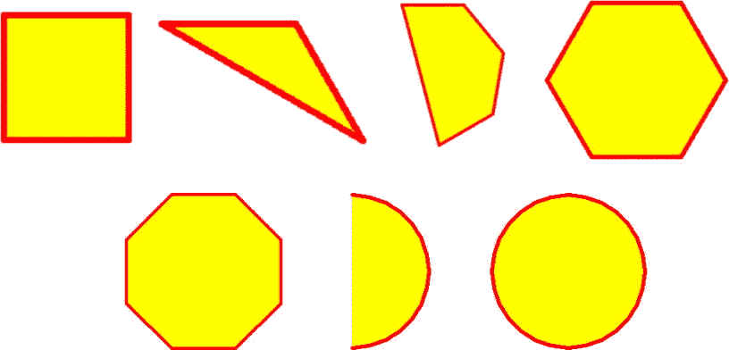

# 13.功能自动化

在前一章中，我们暂停了所有的学习并创建了更多有趣的迷你项目。现在我们精力充沛了，让我们继续学习几个章节，好吗？

在这一章中，我们将会看到一个非常有趣的概念。我们已经介绍了 Python 中使用循环的自动化，但是在这一章，让我们看看真正的函数自动化。它像魔法一样有效。你会明白的。

## 真正的自动化


为什么我这么叫它？我们已经看到了循环，它们自己完成了大量的自动化工作。我们只用了几行代码就创建了完整的形状，对吗？那么，我们为什么需要函数呢？

如果你需要重复密码呢？例如，让我们带回我们在循环章节中写的代码。还记得我们如何创建一个程序，它根据我们给它的输入创建一个形状吗？我们不得不多次运行这个程序来绘制不同的形状。如果我想从程序的同一次运行中绘制不同的形状呢？如果我想给出多个输入，那么我的程序一个接一个地绘制每个形状，同时擦除前一个形状，该怎么办？你会怎么做？

你可能需要多次编写相同的代码，用不同的角度和边输入，对吗？所以，如果你想画五个形状，你需要五个循环，一个接一个，每个循环之间有一个 clear()方法。那太长了！如果我们也能缩短它呢？

有了函数，你当然可以！你可以用一个叫做“函数”的东西来创建你的“for 循环”。到目前为止，我们已经使用了很多函数。只是，我们称它们为预定义方法，因为它们已经用 Python 创建了。但是现在，您可以创建自己的函数。多令人兴奋啊。你已经成为一个如此有经验的程序员，你现在可以创建你自己的函数，调用它们，发送参数，自动化，等等。

既然你的“for 循环”在你的函数中，你可以做一些叫做“调用函数”的事情，每次给不同的值，以确保你的 for 循环每次都画出不同的形状。一会儿我会教你怎么做。

但是现在，让我们学习如何编写一个基本函数。

## 我们的第一个功能

每个函数都有两个部分。有一个函数定义，它有你想要多次执行的代码。然后是函数调用，这是字面上“调用”函数定义的代码行。它可能会发送参数/值作为函数的输入。

但是首先，让我们创建一个没有参数的函数，这样你就能理解它们是如何工作的。

所以，函数是有定义的，不是吗？到目前为止，我们已经注意到 Python 非常直观。它的语法很有意义。“if”是指英文单词 If；而“while”的意思是某事将持续一段时间，因此是一个循环；等等。类似地，“def”意味着你正在创建一个函数定义。

像往常一样，只需提到“def”，即您正在创建的函数的名称，后跟括号和冒号。然后，在下一行中，在缩进后添加代码行。就这么简单！

让我们创建一个打印“Hello there！”的函数当我们称之为。我们命名我们的函数，这样我们可以在以后调用它们。我们已经调用了许多预定义的函数，比如 len()和 join()，对吗？对于您创建的函数，这个概念是相同的:用户定义的函数。我将把我的函数命名为 greet()，因为这就是它要做的，问候调用它的人。

```py
def greet():
    print('Hello there!')

```

太好了。我们有我们的功能。让我们运行它。

蟋蟀…什么也没发生。☹为什么？！

啊对了，我们还没叫呢！我们如何做到这一点？那么，我们如何调用我们的预定义函数呢？格式是一样的。函数名，后跟括号。就这样！

让我们现在正确地做事情。一个函数定义，然后是一个函数调用，就像它应该的那样。

```py
def greet():
    print('Hello there!')
greet()

```

现在运行这个程序，你会得到这个:

```py
= RESTART: C:/Users/aarthi/AppData/Local/Programs/Python/Python38-32/functions.py
Hello there!

```

啊哈！我们拿到了。

## 为什么我们需要函数？

但是函数有什么用呢？我很困惑。是吗？它做我们一直在做的事情，而不需要添加额外的代码来创建和调用函数。

嗯…如果我想问候我的用户五次而不是一次呢？也许小组有五个人？在此之前，我会添加五个打印声明。但是现在，我可以添加五个函数调用，就像这样，函数会被调用，然后“你好！”每次都会被打印出来。酷！

```py
greet()
greet()
greet()
greet()
greet()

```

运行前面的代码，您将得到这样的结果:

```py
= RESTART: C:/Users/aarthi/AppData/Local/Programs/Python/Python38-32/functions.py
Hello there!
Hello there!
Hello there!
Hello there!
Hello there!

```

我们拿到了。或者我们有吗？这也有什么用？我们仍然创建了五行代码。无论如何我们都会这么做的。我们既没有节省时间，也没有节省空间。倒霉！

## 每次做不同的事情！

当你每次调用函数时都给它发送不同的值，你就会明白函数的真正用途了。让我们修改一下 greet()程序，让它在每次调用时都问候一个人。

现在我想让函数每次都用他们的名字问候这个人，我需要让我的函数知道他们的名字是什么，对吗？我该怎么做？也许我的函数可以在被调用的时候接收到它？没错。创建函数时，可以在括号内包含发送的一个或多个参数的名称(可以发送任意数量的参数)。

好了，暂停！参数？争论？哪个是哪个？别担心。其实都是一样的，但是如果你想具体一点，你从函数调用中发出的值叫做参数，你在函数定义中收到的值就是实参。简单吧？一旦我们看了我们的例子，你会更好地理解。

### 创建(定义)您的功能

让我们看看它是如何工作的:

```py
def greet(name):
    print('Hello {}!'.format(name))

```

看那个！我在括号中收到了参数“name ”,然后在我的 print 语句中使用了它。本质上，这不是一个变量，但它的行为很像变量。您可以随意命名您的参数。一旦我们完成了这个例子，你为什么不把你的参数的名字从" name "改成" n ",看看它是否还能工作？

现在我们已经创建了我们的定义，让我们创建程序的其余部分。让我们创建一个变量名并获得输入。然后，让我们调用 greet()函数，但是这一次使用括号内的参数名称“name”。

```py
name = input("What's your name?")
greet(name)

```

很好！不要被同一个“名字”迷惑了。我只是让变量的名字和函数接收的参数的名字相同，这样你就不会混淆了。但是参数名称可以是您想要的任何名称，并且您的程序仍然可以正常工作。

运行前面的代码，您将得到以下结果:

```py
= RESTART: C:\Users\aarthi\AppData\Local\Programs\Python\Python38-32\functions.py
What's your name? Susan
Hello Susan!

```

看那个！有效！

### 你可以重用你的代码！

现在，我将向你展示函数的真正用途。函数的真正用途在于，你不需要一遍又一遍地重复同样的代码行。

因此，让我们创建一个名为“calculation”的函数来计算它接收到的任意两个数的加、减、除和乘。好吗？

因此，它将接收两个数字，n1 和 n2，作为参数。我将进行计算，并将结果打印成四行:

```py
def calculate(n1,n2):
    n1 = int(n1)
    n2 = int(n2)
    add = n1 + n2
    sub = n1 - n2
    div = n1 / n2
    mul = n1 * n2
    print('''Addition: {}
Subtraction: {}
Multiplication: {}
Division: {}
          '''. format(add,sub,mul,div))

```

在前面的代码行中，我接收了两个数字作为参数 n1 和 n2。然后我将它们转换成整数，因为我将使用“input()”方法接收数字，默认情况下这些值是字符串。然后，我完成了计算，最后使用多行字符串引号将所有内容打印出来。

现在到了我正在谈论的部分。既然我们已经创建了 calculate 函数，我们可以随时调用它。如果我们想要计算三次呢？在我们发现函数之前，我们会多次编写相同的代码行，因为没有其他方法来接收不同的输入并用不同的值进行相同的计算。

但是现在，我们有办法了！

```py
calculate(input("Enter the first number"),input("Enter the second number"))
calculate(input("Enter the first number"),input("Enter the second number"))
calculate(input("Enter the first number"),input("Enter the second number"))

```

我已经创建了三个函数调用，其中每个函数调用都有两个参数，它们只不过是输入语句。

让我们运行这些:

```py
= RESTART: C:\Users\aarthi\AppData\Local\Programs\Python\Python38-32\functions.py
Enter the first number 10
Enter the second number 5
Addition: 15
Subtraction: 5
Multiplication: 50
Division: 2.0

Enter the first number 5
Enter the second number 10
Addition: 15
Subtraction: -5
Multiplication: 50
Division: 0.5

Enter the first number 100
Enter the second number 20
Addition: 120
Subtraction: 80
Multiplication: 2000
Division: 5.0

```

看那个！用同样的几行代码，我能够做三组不同的计算，而不用像我们通常做的那样运行程序三次。

这是函数的真正用法。 ***真正的自动化！***

### 没有争论？

但是在函数调用中发送参数时要小心。如果您没有发送函数定义所期望的参数数量，那么在运行函数时您将会遇到一个错误。如果您发送的参数数量较少或较多，情况也是如此。

```py
def greet(name):
    print('Hello {}!'.format(name))

```

对于上述功能:

```py
greet()

```

不带参数的调用将产生以下错误:

```py
= RESTART: C:\Users\aarthi\AppData\Local\Programs\Python\Python38-32\functions.py
Traceback (most recent call last):
  File "C:\Users\aarthi\AppData\Local\Programs\Python\Python38-32\functions.py", line 3, in <module>
    greet()
TypeError: greet() missing 1 required positional argument: 'name'

```

函数调用缺少一个必需的参数。

另一方面一个叫两个论点:

```py
greet(name1,name2)

```

您将收到以下错误:

```py
= RESTART: C:\Users\aarthi\AppData\Local\Programs\Python\Python38-32\functions.py
Traceback (most recent call last):
  File "C:\Users\aarthi\AppData\Local\Programs\Python\Python38-32\functions.py", line 3, in <module>
    greet(name1,name2)
NameError: name 'name1' is not defined

```

参数未定义！因此，一定要确保实参的数量与函数定义中的形参数量相匹配。

## 给个答案

到目前为止，我们只是把东西打印出来。但是如果我们需要一个答案呢？假设我有一个表达式，我使用 add()和 mul()函数来获得数字的加法和乘法结果。但是然后，我想，比如说，把他们都分了。在不知道手术结果的情况下，我怎么能这么做呢？打印结果并不总是足够的，不是吗？

Python 对此也有一个简单的解决方案！只需返回结果。就这么简单。使用“return”语句，返回您的结果，它将在您的函数调用中被接收。然后，您可以将函数调用赋给一个变量并使用其结果，或者将函数调用本身作为一个值使用。

迷茫？别这样，亲爱的。另一个有趣的活动正在进行中，它会让你理解这个概念。

让我首先创建两个函数，加法()和乘法()。它们分别接收参数 n1 和 n2，并执行这两个数的加法和乘法。

```py
def addition(n1,n2):
    add = n1 + n2
def multiply(n1,n2):
    mul = n1 * n2

```

但是我不能用这些值，对吗？所以，让我把它们还回去。

```py
def addition(n1,n2):
    add = n1 + n2
    return add
def multiply(n1,n2):
    mul = n1 * n2
    return mul

```

现在，我已经返回了数字相加和相乘的结果。或者，您可以只在 return 语句中执行操作，如下所示:

```py
def addition(n1,n2):
    return n1 + n2
def multiply(n1,n2):
    return n1 * n2

```

如果你这样做的话，你可以节省几行代码。只有当你的整个函数只有一行代码时，这才会起作用。

好了，现在我们已经准备好了函数，让我们使用它们吧！

```py
num1 = input("Enter your first number: ")
num1 = int(num1)
num2 = input("Enter your second number: ")
num2 = int(num2)
mul = multiply(num1,num2)
add = addition(num1,num2)
calc = mul /add
print("{} / {} = {}".format(mul,add,calc))

```

在前面的代码行中，我接收了两个数字作为输入，并将字符串转换为整数。然后，我创建了一个名为“calc”的变量，它将这些数字相乘的结果除以这些数字相加的结果。

我没有在那里执行操作，而是接收了变量 mul 和 add 中的值。从技术上讲，这就是我们所需要的，因为这些函数中的 return 语句会将操作的结果返回给函数调用，然后它们就可以在“calc”操作中使用了。

我们要不要检查一下这个是否能用？

```py
= RESTART: C:\Users\aarthi\AppData\Local\Programs\Python\Python38-32\functions.py
Enter your first number: 10
Enter your second number: 5
50 / 15 = 3.3333333333333335

```

没错。有效！为什么不同的操作不尝试相同的呢？想怎么复杂就怎么复杂，享受数学乐趣！

## 没有争论？怎么办！

有时，您可能不知道要发送什么参数。也许你只是想测试一下功能？但是当函数需要参数时不发送参数会给我们一个错误！我们能做什么？

救援的默认参数！

在定义函数时，您可以为参数指定“默认值”,这样，即使您在调用函数时忘记发送任何参数，它们也能正常工作。你想测试一下吗？

在下面的例子中，我创建了一个 printName 函数，它只打印给定的名字。我调用了这个函数两次，一次有参数，一次没有。让我们看看会发生什么。

```py
def printName(name='Susan'):
    print('My name is {}'.format(name))

printName('John')
printName()
Run, and:
= RESTART: C:\Users\aarthi\AppData\Local\Programs\Python\Python38-32\condition.py
My name is John
My name is Susan

```

它完全按照我们的预期工作。当我们实际从函数调用中发送参数时，默认参数被忽略。如果我们忘记了，它就被使用了。完美！

## 争论太多了！

函数还没有停止让您的编程生活变得简单。如果你不知道要发送多少个参数呢？但是你想收到所有的，没有任何错误。

武断的论点会帮助你做到这一点。用*listName 而不是参数名来接收它们，这样就可以像访问列表项一样访问每个参数。让我告诉你怎么做。

假设我想打印我的函数调用发送的数字的总和，但是我不知道我需要增加多少，所以我只是把它们作为一个任意的参数接收。

因为*listName 本质上是一个列表，所以我们可以像在列表中一样循环遍历它。

```py
def addNums(*nums):
    sum = 0
    for num in nums:
        sum += num
    return sum

```

现在让我用我的任意参数调用我的函数。

```py
print(addNums(1,5,3,7,5,8,3))
print(addNums(1,3,5,7,9))
print(addNums(1,2,3,4,5,6,7,8,9))

```

当我运行这个程序时，我得到了这个:

```py
= RESTART: C:\Users\aarthi\AppData\Local\Programs\Python\Python38-32\condition.py
32
25
45

```

哇，这个特性给了我在程序中做任何我想做的事情如此多的自由！

另一方面，你可以发送一个列表作为参数。那也可以。为什么不试着修改前面的程序来发送和接收一列数字呢？

你试过吗？它看起来像这样吗？

```py
def addNums(nums):
    sum = 0
    for num in nums:
        sum += num
    return sum
print(addNums([1,5,3,7,5,8,3]))
print(addNums([1,3,5,7,9]))
print(addNums([1,2,3,4,5,6,7,8,9]))

```

太好了。

## 全球与本地

到目前为止，我们已经看到，一旦你创建了一个变量，你不能重新定义它。你可以重新给它赋值，是的，例如:

```py
for i in range(1,10):
    print(i,end='')
print()
print(i)

```

看看前面的程序。我创建了一个变量“I ”,它在同一行中打印从 1 到 9 的数字。在 for 循环完成后，我们打印一个新行和“I”的当前值。

让我们运行这个程序，我们会得到这个:

```py
= RESTART: C:\Users\aarthi\AppData\Local\Programs\Python\Python38-32\condition.py
123456789
9

```

看那个！它是 9，这不是一个错误，因为一旦创建了" I ",即使它是在 for 循环中创建的，它也可以被整个程序访问。

### 函数中的变量

但是函数就不是这样了。现在让我们在函数中创建相同的内容:

```py
def printNum():
    for i in range(1,10):
        print(i,end='')

printNum()
print()
print(i)
Run the above, and:
>>>
= RESTART: C:\Users\aarthi\AppData\Local\Programs\Python\Python38-32\condition.py
123456789
Traceback (most recent call last):
  File "C:\Users\aarthi\AppData\Local\Programs\Python\Python38-32\condition.py", line 7, in <module>
    print(i)
NameError: name 'i' is not defined

```

看看前面的输出。当函数仍在执行时，一切都很好。它按照我们想要的顺序打印出我们的号码。但是，当我们试图在函数外部打印“I”的当前值时，我们得到一个“未定义”的错误。这怎么可能呢？变量“I”是在函数的 for 循环中定义的，不是吗？

是的，它是，但是它是本地**的那个功能，不能在外面使用。因此，在函数内部创建的任何变量都称为局部变量。**

 **### 返回局部变量

如果你想在函数之外使用它，你需要返回它，就像这样:

```py
def printNum():
    for i in range(1,10):
        print(i,end='')
    return i

i = printNum()
print()
print(i)

```

现在，运行这个程序，你会得到这个:

```py
= RESTART: C:\Users\aarthi\AppData\Local\Programs\Python\Python38-32\condition.py
123456789
9

```

有效！

### 全局变量

同样，任何在函数外部创建的变量都被称为 ***全局*** 变量，如果你想在函数内部使用它，你需要使用全局关键字，就像这样:

假设我想创建一个全局变量“sum”。每次我发送一个数字列表时，它们都会被添加到 sum 的“当前”值中，所以我们实际上得到的是多个列表的总和。我们如何做到这一点？

我已经创建了一个变量“sum ”,并在程序开始时将其赋值为 0。接下来，让我定义函数。如果我想在函数外部使用相同的“sum”，那么我需要在函数开始时将其称为“全局 sum”(不带引号)。在函数定义的顶部提到全局变量总是一个好习惯。

就这样。程序的其余部分和我们之前写的类似。

```py
sum = 0

def addNums(nums):
    global sum
    for num in nums:
        sum += num
    return sum

print(addNums([1,5,3,7,5,8,3]))
print(addNums([1,3,5,7,9]))
print(addNums([1,2,3,4,5,6,7,8,9]))

```

运行这段代码，您将得到以下结果:

```py
= RESTART: C:\Users\aarthi\AppData\Local\Programs\Python\Python38-32\condition.py
32
57
102

```

sum 的旧值被保留下来，并被添加到后续函数调用中发送的新值中。太好了。

Note

***创建顺序和用法*** 在 Python 中非常重要。在你调用一个函数之前，先定义它。所以， ***函数定义*** 应该总是在函数调用之上，否则会出错。同样，在使用变量之前，先创建它。因此，您的 ***全局变量*** 应该在您希望使用它们的函数定义之前创建。

## 希腊字母的第 11 个

λ是一个匿名函数。它没有名字，可以接受任意数量的参数，但只能有一行代码。听起来很简单，不是吗？当我们有自己的荣耀功能时，为什么我们还需要它呢？


在接下来的章节中，我们将讨论事件。这些事件将让您在单击应用程序上的按钮、按下鼠标按钮、单击键盘按钮等时调用函数。在这些情况下，Lambdas 是非常需要的，所以让我们现在看看它们(即使现在它们对我们没有太大的用处)。

lambda 的语法非常简单:

```py
variable = lambda arguments: line of code

```

为什么我们要把 lambda 赋给一个变量？所以我们当然可以称之为！

现在让我们看一个例子:

```py
sum = lambda num1,num2: num1 + num2

```

现在，我们可以通过调用 sum()来调用 lambda，如下所示:

```py
print(sum(3,5))
print(sum(100,240))

```

运行前面的代码行，您将得到这样的结果:

```py
= RESTART: C:\Users\aarthi\AppData\Local\Programs\Python\Python38-32\condition.py
8
340

```

## 迷你项目——用 Python 做数学作业

我们会让这个项目变得简单。如果我们使用一个像 *Tkinter* 这样的包，我们可以使它成为一个合适的应用。但是我们还没有覆盖 *Tkinter* ，所以我们就在 Shell 中做吧。

我们的计算器将被设计成这样:

1.  每种运算都有不同的功能——加、乘、除、减和取模。

2.  我们将从用户那里获得信息。我们将从两个数字开始，以及他们选择要进行的手术。

3.  然后，我们将打印结果，并询问他们是否想继续使用计算器。

4.  如果答案是“Y”或“Y”，那么我们将询问他们是否希望之前的结果作为计算中的一个数字。如果“Y”或“Y”也是，那么我们只需要再输入一个输入，并再次请求他们想要的操作。

5.  计算器可以永远这样下去。当用户回答“n”继续时，我们将跳出循环并结束程序。

有趣吗？兴奋地开始了吗？我也是！

1.  让我们再次创建执行这些操作的函数。因为函数定义需要在调用之前创建，所以让我们先完成它。

    ```py
    #Addition
    def add(n1,n2):
        return n1 + n2
    #Subtraction
    def sub(n1,n2):
        return n1 - n2
    #Multiplication
    def mul(n1,n2):
        return n1 * n2
    #Division
    def div(n1,n2):
        return n1 / n2
    #Modulus
    def mod(n1,n2):
        return n1 % n2

    ```

2.  现在，让我们创建一个永不结束的 while 循环，这意味着条件始终为真，直到我们用“break”语句中断循环。

3.  在 while 循环中，我们将要求用户输入两个数字作为输入，并像往常一样将字符串转换为整数。

4.  然后，我们会要求手术。我们将使用 if…elif…else 语句来调用相关函数并获得结果。

    ```py
    #create a result globally
    result = 0 #default value
    repeat = 0 #if the user decided to reuse the result of previous operation, this becomes 1

    while(True):
        #if this is the first/new operation
        if(repeat == 0):
            #number1
            num1 = input('Your first number: ')
            num1 = int(num1)
            #number2
            num2 = input('Your second number: ')
            num2 = int(num2)
        #If the user asked to use the result of the last operation in this one
        else:
            #number2
            num2 = input('Your second number: ')
            num2 = int(num2)
        #get the operator
        op = input('''Enter any of the following numbers, that correspond to the given operation:
    Just the number, not the period.
    1\. Addition
    2\. Subtraction
    3\. Multiplication
    4\. Division
    5\. Modulus
    ''')
        op = int(op)
        #Call the relevant function
        if(op == 1):
            result = add(num1,num2)
        elif(op == 2):
            result = sub(num1,num2)
        elif(op == 3):
            result = mul(num1,num2)
        elif(op == 4):
            result = div(num1,num2)
        elif(op == 5):
            result = mod(num1,num2)
        else:
            print('You entered an invalid operation. Please run the program again')
            break
        #print the result
        print('Answer: {}'.format(result))
        again = input('Do you want to do another operation? Enter Y or N: ')
        if((again == 'y') or (again == 'Y')):
            reuse = input('Do you want the result of the current operation to be the first number of the next? Y or N: ')
            if((reuse == 'y') or (reuse == 'Y')):
                num1 = result
                repeat = 1
            else:
                repeat = 0
        else:
            print('Ok bye!')
            break

    ```

## 迷你项目-自动化形状-下一级

循环是自动化，但是函数应该是真正的自动化，不是吗？为什么我们不看看他们能对我们的自动化形状迷你项目做些什么？

我将创建一个名为 draw_shape()的函数，并将我的代码放入其中。我将在函数中接受两个参数:边数和角度。

如果边数等于 1，我就画一个圆。否则，我要画一个多边形。就这么简单。

对于这个项目，我将使用另一个叫做时间包的包。这样，在绘制下一个形状之前，我可以给出大约 300 毫秒的小延迟，这样用户就可以看到正在发生什么:

1.  我们先导入海龟和时间包。

    ```py
    import turtle
    import time

    ```

2.  那么让我们建立海龟。我将钢笔颜色设置为红色，填充颜色设置为黄色。

    ```py
    s = turtle.getscreen()
    t = turtle.Turtle()
    t.pensize(5)
    t.color('Red','Yellow')

    ```

3.  然后，我要定义 draw_shape()函数。在函数开始的时候，我要用时间包的 sleep()方法，基本上让程序停止 0.3 秒(300 毫秒)。然后，我将清除乌龟，这样在我画下一个之前，任何先前的形状都会被删除。

    ```py
    def draw_shape(sides,angle):
        time.sleep(0.3)
        t.clear()
        t.begin_fill()
        #If sides are greater than 1, then it’s a polygon
        if sides > 1:
            for x in range(0,sides):
                if(x == sides-1):
                    t.home()
                    break
                t.forward(100)
                t.right(angle)
        elif sides == 1:
            #circle
            t.circle(100,angle)
        t.end_fill()
        t.hideturtle()
        turtle.hideturtle()

    ```

4.  我将在不同的函数调用中给出多个值。当您运行这个程序时，您将看到这些形状被连续绘制，中间有 0.3 秒的延迟。

    ```py
    draw_shape(4,90)
    draw_shape(3,60)
    draw_shape(5,50)
    draw_shape(6,60)
    draw_shape(8,45)
    draw_shape(1,180)
    draw_shape(1,360)

    ```

您将获得的图像如图 [13-1](#Fig1) 所示。



图 13-1

自动化形状

整洁！

## 摘要

在这一章中，我们研究了真正的自动化功能。我们学习了定义函数、调用函数、发送参数使函数动态化、返回值给函数调用、接受任意参数等等。我们也自动化了我们在前面章节中做的一些项目。

在下一章，让我们像专业人士那样进行真实世界的编程！我们将在编程中观察对象并模仿真实世界的场景。**