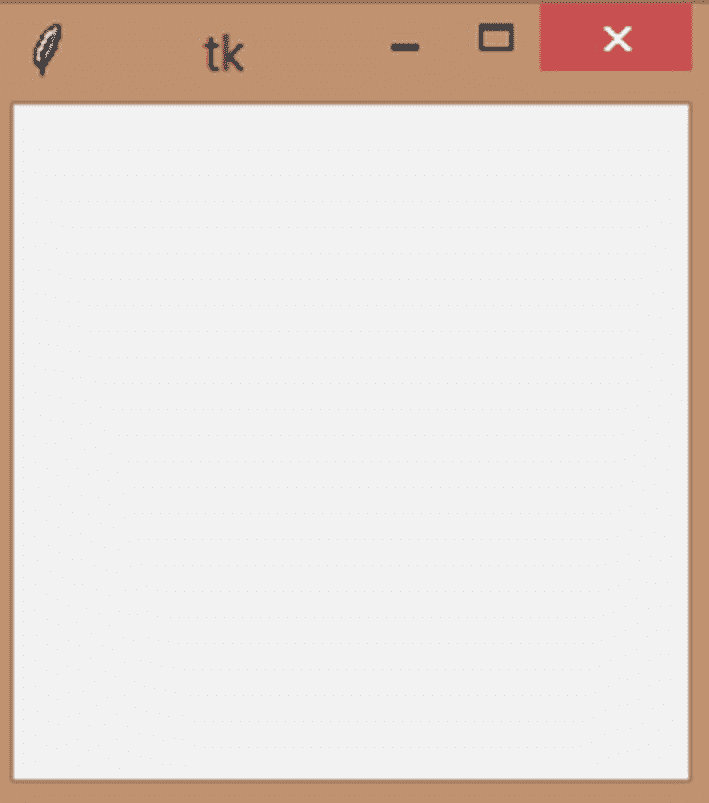
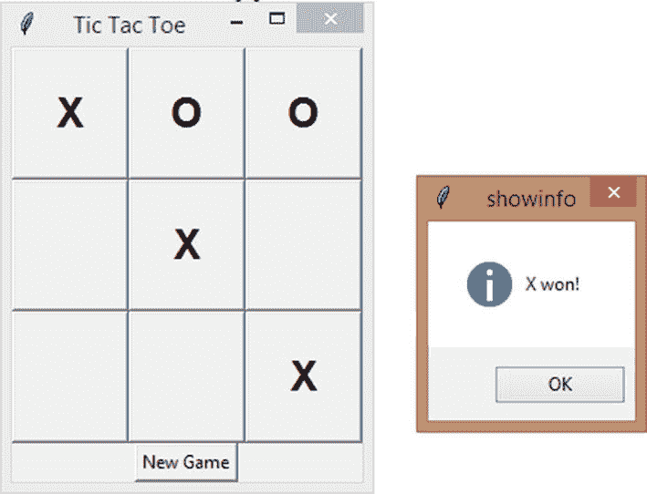
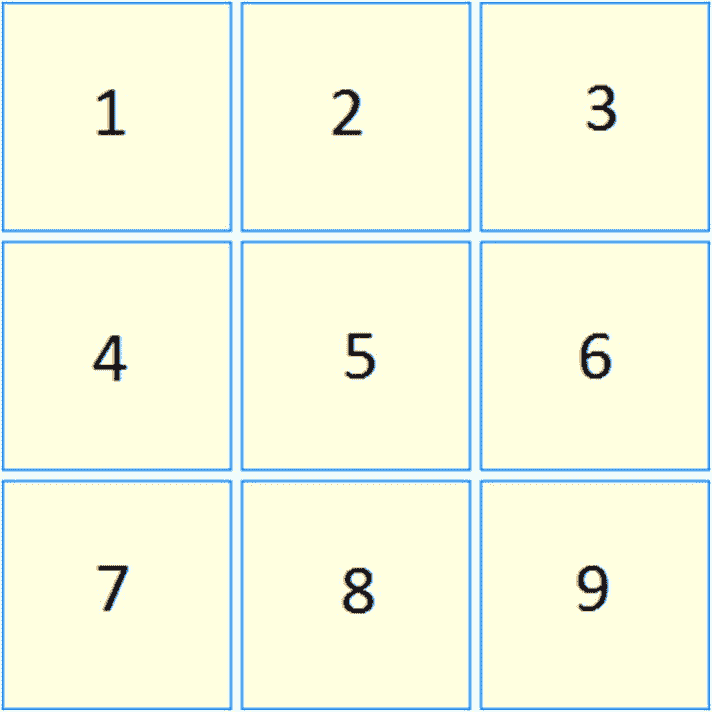
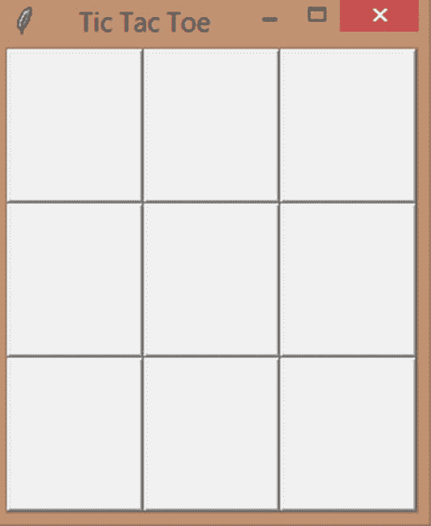
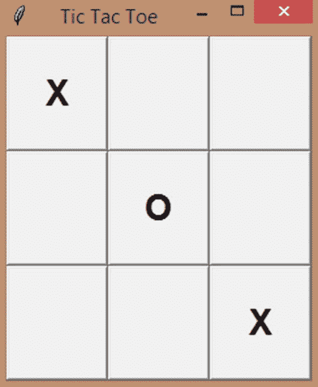
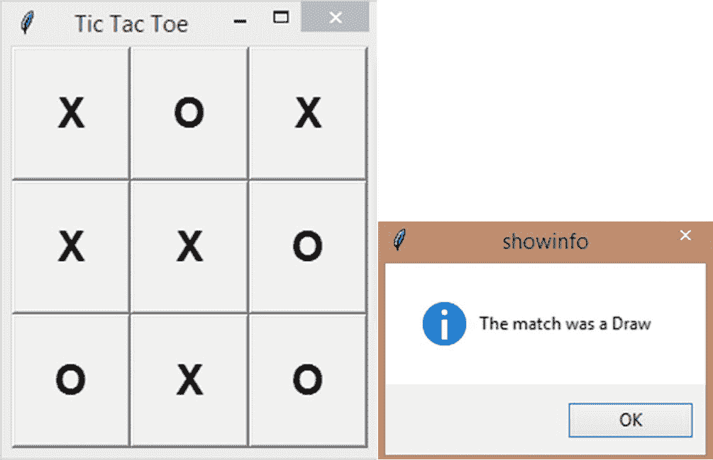
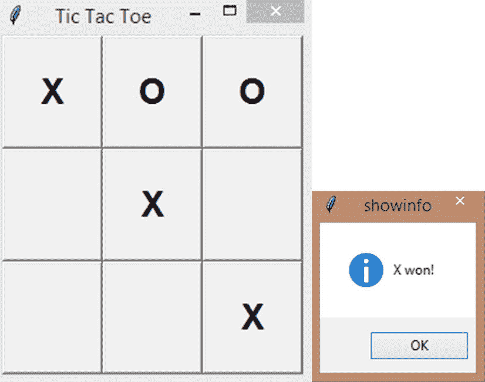
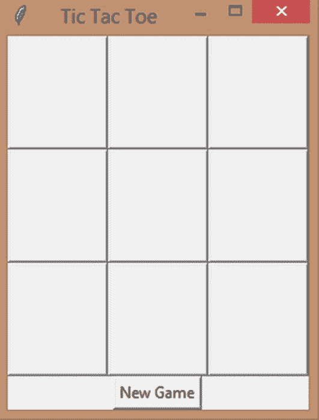

# 十七、项目：Tkinter 井字棋

在前一章，我们学习了 *Tkinter* 的基础知识。我们学习了如何用 *Tkinter* 创建按钮、标签、框架、菜单、复选框、单选按钮等等。我们还学习了如何设计我们的窗口小部件，并让我们的窗口小部件根据事件(点击、鼠标移动、键盘按压等)来做事情。).最后，我们学习了如何用画布画画。

在这一章中，让我们应用我们在上一章中学到的知识，创建我们的第一个大项目:井字棋！我们还将了解事件，并将它们绑定到我们的小部件。

## 绑定事件–让您的应用充满活力！

在上一章中，我们学习了很多关于 *Tkinter* 的知识。我敢肯定，你已经厌倦了学习所有的概念，你宁愿现在就创建一个项目。耐心听我说几分钟，好吗？让我们快速了解如何将事件绑定到我们的小部件，并开始玩井字棋。

那么，什么是绑定呢？好吧，让我们说你点击你的按钮(用你的鼠标左键)，你想在这种情况下执行一个功能。你会怎么做？你可以使用“命令”，是的，但是如果你想区分鼠标左键和右键点击呢？根据点击了哪个鼠标键或者按了哪个键盘键打开不同的功能？

事件可以帮助您完成所有这些任务，甚至更多。

让我们先来看看按钮点击事件。让我们创建一些绑定，当鼠标左键和右键点击一个按钮部件时，这些绑定执行不同的功能。

```py
from tkinter import *
w = Tk()

def left_clicked(event):
    print('Left mouse button clicked')
    return

def right_clicked(event):
    print('Right mouse button clicked')
    return

button = Button(w,text='Click here!')
button.pack()
button.bind('<Button-1>',left_clicked)
button.bind('<Button-3>',right_clicked)

w.mainloop()

```

请看前面的代码片段。我们创建了按钮，打包它，然后使用 bind()方法创建两个绑定。第一个参数表示我们希望绑定到按钮的事件，第二个参数是事件发生时需要调用的函数。

事件需要在引号中指定，<button-1>表示鼠标左键单击，<button-3>是鼠标右键单击，因为<button-2>是鼠标中键单击。</button-2></button-3></button-1>

现在，在函数定义中，我们接受了一个参数 event，尽管我们没有从函数调用中发送任何参数。这怎么可能？好吧，每当一个事件被绑定到一个小部件时，你的程序自动发送一个事件对象到这个函数。这个“事件”会有很多关于刚刚发生的事件的信息。

例如，我们可以使用 event.x 和 event.y 找到鼠标左键单击的 x 和 y 坐标位置。

```py
from tkinter import *
w = Tk()

def click(event):
    print("X:{},Y:{}".format(event.x,event.y))

frame = Frame(w,width=200,height=200)
frame.pack()
frame.bind('<Button-1>',click)

w.mainloop()

```

现在，让我点击框架上的任意位置(图 [17-1](#Fig1) )。



图 17-1

鼠标左键单击事件

我点击了中间的某个地方，结果是这样的:

```py
= RESTART: C:\Users\aarthi\AppData\Local\Programs\Python\Python38-32\tkPrograms.py
X:93,Y:91

```

那是 93 的 x 和 91 的 y。太好了。

同样，你也可以寻找键盘按键。为此，您需要使用<key>绑定，并且可以使用 event.char 属性打印出被按下的确切键。这只适用于可打印的键，不适用于空格、F1 等键。对此有单独的事件绑定。</key>

当您将鼠标光标移动到小部件上时，您可以使用<motion>事件来运行函数。当用户按下回车键时，触发<return>事件，依此类推。</return></motion>

好了，现在你已经知道了事件是如何发生的，让我们开始玩井字棋吧！

## 井字棋–解释

到目前为止，我们只是在创建迷你项目。但是在现实世界中，你需要做的不仅仅是画几个形状或者运行一堆循环。在现实世界中，你将创建人们日常生活中使用的游戏和应用。

所以在这一章，我们将创建我们的第一个这样的游戏。让我们创建经典的井字棋。我们的应用看起来会像这样(图 [17-2](#Fig2) )。



图 17-2

Tkinter 的井字棋

我们的游戏板有九个盒子，你可以在上面画画。有两个玩家:X 和 O，他们轮流在黑板上画画。如果一个玩家连续抽三张牌(垂直、水平或对角)，那么这个玩家赢。如果没有人做到这一点，并且所有九个棋盘都被填满，那么游戏就是平局。

这是一个简单的游戏。我将介绍“messagebox ”,它将帮助您创建您在笔记本电脑程序中看到的消息弹出窗口。

## 设置***Tkinter**T3】*

像往常一样，让我们从导入 *Tkinter* 的所有内容开始。但是我们还需要导入 messagebox，因为当您使用*时，您只是导入外部的类和函数，而不是“一切”。

```py
from tkinter import *
from tkinter import messagebox

```

让我们接下来设置我们的窗口。我将把我的窗口的标题改为“井字棋”。

```py
w = Tk()
w.title('Tic Tac Toe')

```

## 创建全局变量

我们在函数一章中看到了全局变量，还记得吗？全局变量可用于跟踪多个函数中发生的变化。在这种情况下，我们需要多个全局变量。

例如，我们需要跟踪“turn”变量发生的总体变化，该变量计算玩家使用的回合数(井字棋总共提供九个回合)。

```py
turn = 0

```

接下来，我们需要一个列表来记录谁在哪个盒子上玩过。这个列表将有九个预定义的条目，它们当前包含空字符串。我们将根据谁在哪个盒子上玩，用“X”或“O”来代替它们。

```py
state = ['','','','','','','','','']

```

接下来，我们需要一个二维列表(一个更大的列表中的列表)来保存所有的获胜状态(图 [17-3](#Fig3) )。我们将在每个玩家玩游戏后比较这些获胜状态，以检查是否有人赢得了游戏。



图 17-3

井字棋盒(编号)

请看前面的图像。在井字棋中，如果玩家在三个连续的盒子上画出他们的符号，无论是垂直的、水平的还是对角的，他就赢了。1，4，7 是第一个垂直获胜状态。1，2，3 是第一个水平获胜状态。1，5，9 是第一个对角线赢的状态，以此类推。

有三种垂直获胜状态、三种水平获胜状态和两种对角获胜状态。一共赢了八个州。

让我们将它们存储在我们的列表中。但是因为我们在这里使用列表，并且它们的索引从 0 开始，所以让我们将 1，2，3 转换为 0，1，2。对其余的获胜州进行同样的操作，您将得到如下结果:

```py
winner = [[0,1,2], [3,4,5], [6,7,8], [0,3,6], [1,4,7], [2,5,8], [0,4,8], [2,4,6]]

```

最后，让我们创建一个变量“game”来存储游戏的状态。当我们开始游戏时，这将是真的，如果有人赢了，或者如果游戏以平局结束(所有九个盒子都用完了，但没有人赢)，我们将把“游戏”的值改为假，这样就没有人可以在盒子上画画了。

```py
game = True

```

## 创建按钮

我们需要九个盒子，玩家可以在上面“画画”，对吗？为什么不把事情简单化，创建按钮呢？我们可以让他们的文本从一个单倍行距的字符串开始，每次玩家玩的时候，我们可以把文本改成“X”或者“O”。那会有用的！

在我们创建按钮之前，让我们定义一个变量“font ”,它将存储按钮文本所需的字体(我们的玩家在按钮上“画”的内容)。“Helvetica”，20 为文本大小，“粗体”字体。

```py
font = ('Helvetica',20,'bold')

```

接下来，让我们创建九个按钮，每个框一个。我们将文本设为单个空格，高度为 2，宽度为 4。让我们将创建的“font”变量分配给字体。

最后，我们将看到我们在函数一章中学到的“lambda”函数的一些实际应用。到目前为止，每当我们在按钮上使用 command 属性时，我们都不必向被调用的函数发送参数。

但是现在，我们需要发送两个参数:一个是被点击的实际按钮，另一个是被点击的按钮的编号(从 1 开始)。

如果你想在这样的事件中发送参数，你需要用 lambda 封装函数调用，如下所示。lambda 本身不需要任何参数，因为它现在是一个匿名函数。您的一行代码将是对 buttonClick()函数的函数调用，其中发送了参数 b1 和 1。

让我们对其余的按钮重复这个过程。让我们也将按钮平行地放置在网格中。这是正常的网格排列。

```py
#9 buttons
b1 = Button(w, text=' ', width=4, height=2, font = font, command = lambda: buttonClick(b1,1))
b1.grid(row=0,column=0)
b2 = Button(w, text=' ', width=4, height=2, font = font, command = lambda: buttonClick(b2,2))
b2.grid(row=0,column=1)
b3 = Button(w, text=' ', width=4, height=2, font = font, command = lambda: buttonClick(b3,3))
b3.grid(row=0,column=2)

b4 = Button(w, text=' ', width=4, height=2, font = font, command = lambda: buttonClick(b4,4))
b4.grid(row=1,column=0)
b5 = Button(w, text=' ', width=4, height=2, font = font, command = lambda: buttonClick(b5,5))
b5.grid(row=1,column=1)
b6 = Button(w, text=' ', width=4, height=2, font = font, command = lambda: buttonClick(b6,6))
b6.grid(row=1,column=2)

b7 = Button(w, text=' ', width=4, height=2, font = font, command = lambda: buttonClick(b7,7))
b7.grid(row=2,column=0)
b8 = Button(w, text=' ', width=4, height=2, font = font, command = lambda: buttonClick(b8,8))
b8.grid(row=2,column=1)
b9 = Button(w, text=' ', width=4, height=2, font = font, command = lambda: buttonClick(b9,9))
b9.grid(row=2,column=2)

```

在按钮的顶部创建一个 buttonClick()函数定义，并在它上面放置一个 pass(这样就不会出现函数为空的错误)。我们将在下一部分用相关代码填充函数定义。

让我们运行程序，我们得到这个(图 [17-4](#Fig4) )。



图 17-4

九个盒子–已创建

这是我们目前掌握的情况。很好！

## 当按钮被点击时，在它上面绘图

现在让我们定义 buttonClick()函数。这应该在我们创建按钮的文本块之上(函数调用规则之前的函数定义)。

我们将在这个函数中访问全局变量 turn、state 和 game，所以让我们先加载它们。

```py
#When a button is clicked
def buttonClick(b,n):
    global turn,state,game

```

接下来，在绘制特定的盒子之前，让我们检查一下这个盒子当前是否是空的。如果它被占用了(一个玩家已经在上面画过了)，我们就不应该再在上面画了，相反，你的游戏会弹出一个错误信息。

还有，检查一下游戏是否还是真的(没人赢，九试还没用完)。

```py
if b['text'] == ' ' and game == True:

```

如果条件成立，那么检查谁正在玩。玩家“X”开始游戏，由于我们从 0 开始“回合”，每当轮到 X 时，“回合”的值将是一个偶数。你知道怎么检查偶数，对吧？去吧。

```py
#hasn't been clicked on yet
if turn % 2 == 0:

```

所以，如果轮到 X，那么将按钮的文本改为“X”，将 turn 的值增加 1，并将 state[n–1]的值改为“X”。为什么是 n–1？列表的索引从 0 开始，按钮的编号从 1 开始，所以在“状态”中使用它之前，我们需要将值减 1。

```py
#player X's turn
b['text'] = 'X'
turn += 1
state[n-1] = 'X'

```

当你在一个盒子上画图的时候，调用 winner_check()函数并发送“X”作为参数。我们将很快定义 winner_check()函数。如果你和我一起编码，现在，只需要在函数中输入 pass，这样你就不会因为没有定义它，而是调用它而得到错误。另外，在 buttonClick()函数之上创建 winner_check()函数，因为我们是从 buttonClick 调用的。

```py
#winner check
winner_check('X')

```

好了，现在做完了，我们来检查一下 turn 是不是偶数，也就是说，是不是轮到 O 了。如果是，按照前面的方法做，但是只对“O”做。

```py
elif turn % 2 == 1:
    #player O's turn
    b['text'] = 'O'
    turn += 1
    state[n-1] = 'O'
    winner_check('O')

```

让我们运行一下我们目前所拥有的，看看我们是否能在我们的盒子上“画”出来(图 [17-5](#Fig5) )。



图 17-5

盒子上的“画”

是的，我们可以！

最后，检查“else”条件。要么游戏已经结束，要么有人已经在盒子上画了，你不想重复。

在 messagebox 中，有一个 showinfo 方法，可以用来打印消息。让我们利用这一点。

如果“游戏”变量为假(游戏结束)，打印“游戏结束！开始新游戏。如果盒子已经被画出，打印“这个盒子被占用了！”。

```py
else:
    if game == False:
        messagebox.showinfo('showinfo','Game over! Start a new game.')
    #because even when the game is over, the buttons will be occupied, so check for that first
    elif b['text'] != ' ':
        messagebox.showinfo('showinfo','This box is occupied!')

```

让我们检查错误框现在是否工作(图 [17-6](#Fig6) )。


图 17-6

箱子被占了

我试着在一个被占用的盒子上画画，弹出了这条消息。太好了。另一个条件现在不相关，因为我们还没有检查赢家，所以游戏还不会“结束”。

看起来这个项目快结束了，对吗？我们已经提取了。我们甚至创建了 winner_check()函数来进行下一步工作。但是我们真的完成了 buttonClick()吗？没有。

我们还需要检查抽签情况！如果 turn 的值大于 8(玩家玩过九次)，而“game”的值仍然为真怎么办？如果“game”仍然为真，这意味着还没有人赢，因为当我们调用 winner_check()函数时，如果我们发现有人赢了，我们会立即将“game”更改为 False。

所以，我们没有回合，游戏仍然正确的唯一原因是因为我们打成了平局。让我们打印该消息并结束游戏(将“game”改为 False)。

```py
#game ended on draw
if turn > 8 and game == True:
    messagebox.showinfo('showinfo','The match was a Draw')
    game = False

```

buttonClick()到此为止！咻。那很大。

让我们运行程序，并检查“绘制”条件是否有效(图 [17-7](#Fig7) )。



图 17-7

这场比赛是平局

是的，它工作了！但是我们需要 winner_check()来使一切正常工作。

接下来我们来看看 winner_check()。

## 检查每个回合中是否有玩家获胜

每当玩家玩游戏时，我们需要检查该玩家是否在该回合赢得了游戏。这个函数接受玩家(“X”或“O”)作为它的参数。

```py
#Every time a button is clicked, check for win state
def winner_check(p):

```

我们还要导入全局变量 state、winner 和 game，因为我们需要它们。

```py
global state,winner,game

```

现在，我们需要循环访问获胜者。因此，对于循环的每次迭代，“I”都有一个“赢”状态列表。

对于每次迭代，让我们检查 state[i[0]]、state[i[0]]、state[i[0]]是否持有相同的 player 值(“X”或“O”)。

例如，第一个内部列表是[0，1，2]，所以我们检查 state[0]，state[1]和 state[2]，如果它们都包含字符串“X”，则 plaly er“X”获胜。如果他们都持有“O”，“O”获胜。就这样！

```py
for i in winner:
    if((state[i[0]] == p) and (state[i[1]] == p) and (state[i[2]] == p)):

```

如果条件成立，那么创建一个字符串，基本上就是“X 赢了！”或者“O won！”并用它创建一条消息。最后，将“game”的值改为 False。

```py
string = '{} won!'.format(p)
messagebox.showinfo('showinfo',string)
game = False

```

让我们现在运行我们的程序，我们得到这个(图 [17-8](#Fig8) )。



图 17-8

x 赢了！

哇哦！有效！

“游戏结束”条件有效吗？让我关闭当前消息框，并尝试通过单击在其中一个空框上绘图(图 [17-9](#Fig9) )。


图 17-9

游戏结束！

看那个！我们的“游戏结束！”刚刚弹出的消息。我们的游戏运行完美！

## 新游戏按钮

我们为什么不在游戏中加入一个“新游戏”按钮呢？现在，我们的游戏结束后就暂停了。我们必须再次运行程序来开始新的游戏。如果我们有一个可以重置一切的按钮，那就太好了，不是吗？

就这么办吧。让我们先创建一个按钮。

```py
new = Button(w,text='New Game',command=new_game)
new.grid(row=3,column=1)

```

点击此按钮将执行 new_game()函数。

现在，让我们在“新建”按钮上方创建 new_game()函数。

在我们定义函数之前，让我们创建一个所有按钮的列表。我们将需要它来遍历按钮并清除它们(这样我们就可以再次在它们上面绘图)。

```py
#create a list of the buttons so  we can change their text
boxes = [b1,b2,b3,b4,b5,b6,b7,b8,b9]

```

我们的 new_game()函数需要全局变量 state、game、turn 和 box。我们需要导入状态、游戏和回合，这样我们就可以将它们重置回初始值。

```py
#New game
def new_game():
    global state,game,turn,boxes

```

让我们重新设置回合、状态和游戏。

```py
turn = 0
state = ['','','','','','','','','']
game = True

```

最后，让我们遍历“框”，将每个框的文本值改为一个空格。

```py
for b in boxes:
    b['text'] = ' '

```

我们的节目到此结束！我相信你已经这样做了，但是如果你忘记了，在程序的末尾添加一个 mainloop()。

```py
w.mainloop()

```

让我们现在运行程序，我们得到这个(图 [17-10](#Fig10) )。



图 17-10

新游戏按钮

我们现在有了“新游戏”按钮。试着测试一下。效果非常好！

你觉得创建这个游戏有趣吗？我知道我很乐意创造它，也很乐意教你如何创造它。摆弄游戏。更改字体、颜色等。祝你一切顺利！

## 整个程序

现在你已经学会了如何在 *Tkinter* 中创建一个井字棋，下面是整个程序的编写顺序。供你参考。

```py
from tkinter import *
from tkinter import messagebox

w = Tk()
w.title('Tic Tac Toe')

turn = 0
state = ['','','','','','','','','']
winner = [[0,1,2], [3,4,5], [6,7,8], [0,3,6], [1,4,7], [2,5,8], [0,4,8], [2,4,6]];
game = True

#Every time a button is clicked, check for win state
def winner_check(p):
    global state,winner,game
    for i in winner:
        if((state[i[0]] == p) and (state[i[1]] == p) and (state[i[2]] == p)):
            string = '{} won!'.format(p)
            messagebox.showinfo('showinfo',string)
            game = False

#When a button is clicked
def buttonClick(b,n):
    global turn,state,game

    if b['text'] == ' ' and game == True:
        #hasn't been clicked on yet
        if turn % 2 == 0:
            #player X's turn
            b['text'] = 'X'
            turn += 1
            state[n-1] = 'X'
            #winner check
            winner_check('X')
        elif turn % 2 == 1:
            #player O's turn
            b['text'] = 'O'
            turn += 1
            state[n-1] = 'O'
            player = 'X'
            winner_check('O')
    else:
        if game == False:
            messagebox.showinfo('showinfo','Game over! Start a new game.')
        #because even when the game is over, the buttons will be occupied, so check for that first
        elif b['text'] != ' ':
            messagebox.showinfo('showinfo','This box is occupied!')

    #game ended on draw
    if turn > 8 and game == True:
        messagebox.showinfo('showinfo','The match was a Draw')
        game = False

font = ('Helvetica',20,'bold')

#9 buttons
b1 = Button(w, text=' ', width=4, height=2, font = font, command = lambda: buttonClick(b1,1))
b1.grid(row=0,column=0)
b2 = Button(w, text=' ', width=4, height=2, font = font, command = lambda: buttonClick(b2,2))
b2.grid(row=0,column=1)
b3 = Button(w, text=' ', width=4, height=2, font = font, command = lambda: buttonClick(b3,3))
b3.grid(row=0,column=2)

b4 = Button(w, text=' ', width=4, height=2, font = font, command = lambda: buttonClick(b4,4))
b4.grid(row=1,column=0)
b5 = Button(w, text=' ', width=4, height=2, font = font, command = lambda: buttonClick(b5,5))
b5.grid(row=1,column=1)
b6 = Button(w, text=' ', width=4, height=2, font = font, command = lambda: buttonClick(b6,6))
b6.grid(row=1,column=2)

b7 = Button(w, text=' ', width=4, height=2, font = font, command = lambda: buttonClick(b7,7))
b7.grid(row=2,column=0)
b8 = Button(w, text=' ', width=4, height=2, font = font, command = lambda: buttonClick(b8,8))
b8.grid(row=2,column=1)
b9 = Button(w, text=' ', width=4, height=2, font = font, command = lambda: buttonClick(b9,9))
b9.grid(row=2,column=2)

#create a list of the buttons so  we can change their text
boxes = [b1,b2,b3,b4,b5,b6,b7,b8,b9]

#New game
def new_game():
    global state,game,turn,boxes
    turn = 0
    state = ['','','','','','','','','']
    game = True
    for b in boxes:
        b['text'] = ' '

new = Button(w,text='New Game',command=new_game)
new.grid(row=3,column=1)

w.mainloop()

```

## 摘要

在本章中，我们从 Python 中的注释以及如何创建单行和多行注释开始。然后我们继续讨论变量，如何创建它们，它们的命名约定，以及可以在其中存储什么。然后我们看了 Python 编程语言中大量可用的数据类型以及如何使用它们。然后我们看了 Python 中的类型检查，最后我们看了如何在 Python 中获取输入并在输出中显示它们。

在下一章，让我们深入研究字符串，如何创建和使用它们，以及 Python 为您提供的各种预定义的字符串方法。