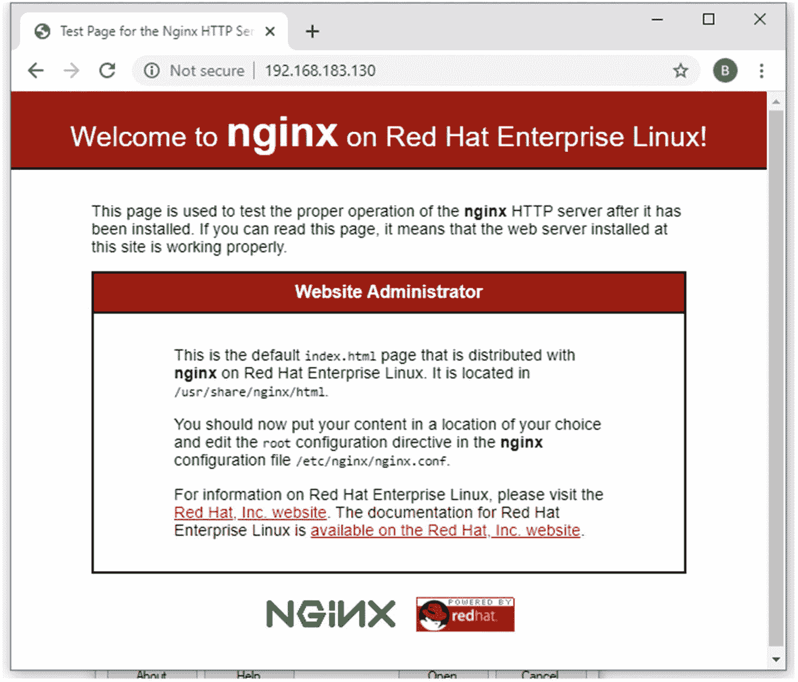
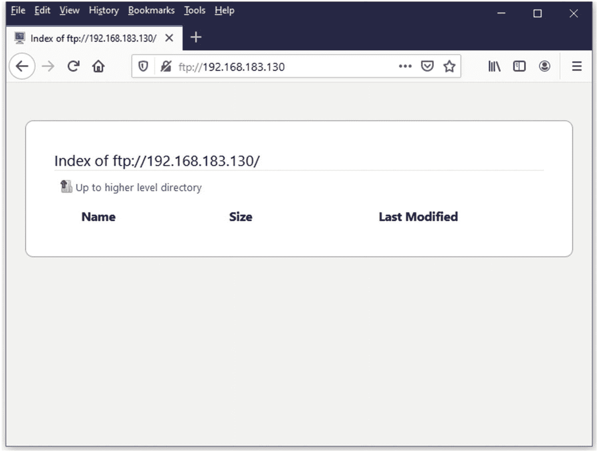
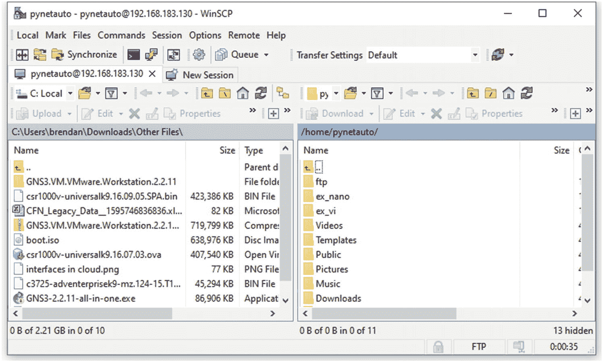
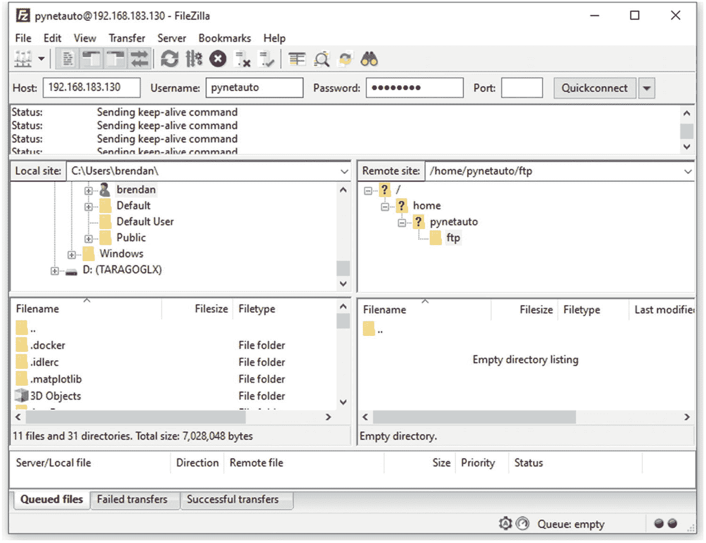
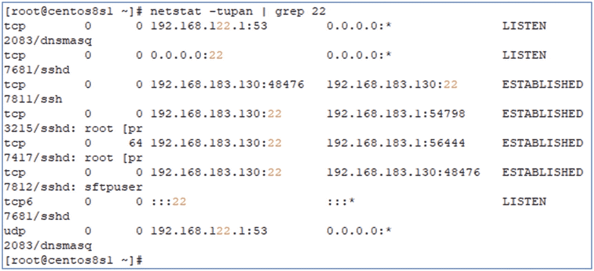
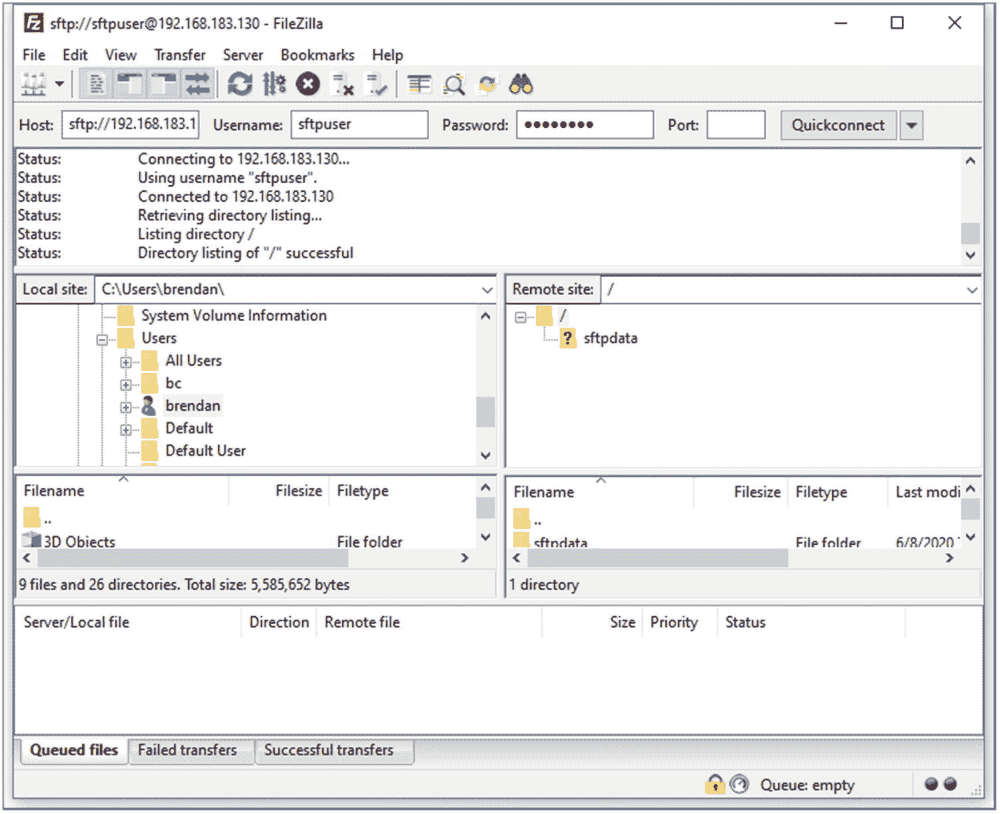
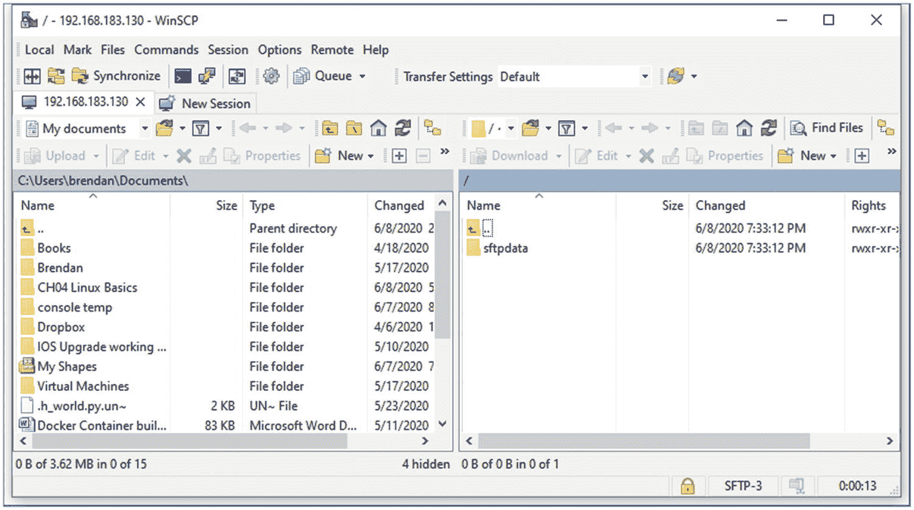
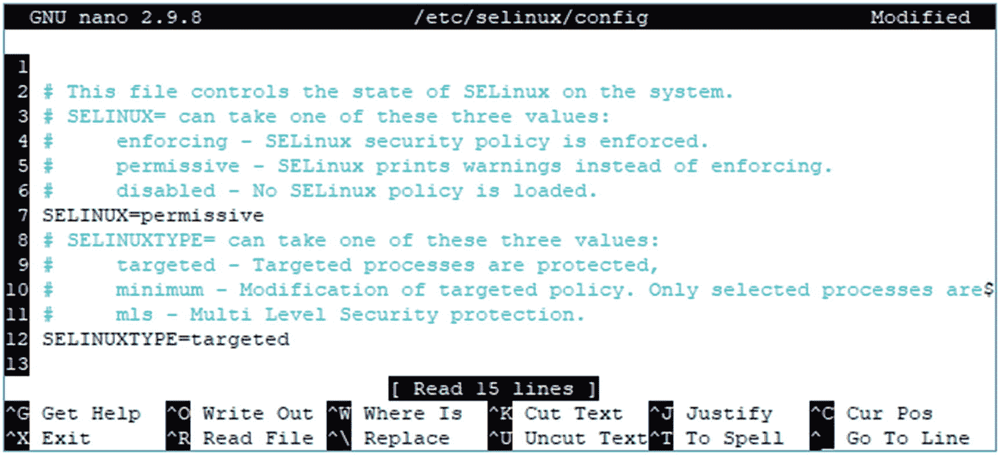
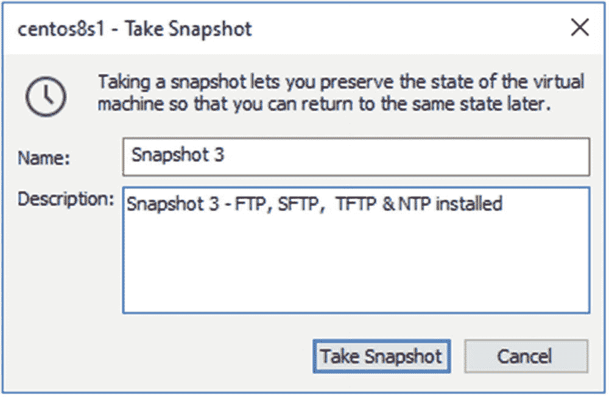

# 八、Linux 基本管理

有很多关于 Linux 主题的书，其中一些书虽然长达数百页，但只关注一个 Linux 发行版。从上一章继续，我们将在这一章讨论最基本的 Linux 主题，这样你就可以看完这本书。如果你是 Linux 的新手，想了解更多关于 Linux 操作系统(OS)的知识，那么使用一本专门的 Linux 书籍是个不错的主意。您将学习查找 Linux 系统信息，使用 Linux 网络命令，然后在 CentOS 8.1 服务器上安装 TFTP、FTP、SFTP 和 NTP 服务。

## Linux 信息:内核和发行版本

大多数新的 Linux 用户都会提出第一个问题，“我如何检查确切的 Linux 发行版本和内核？”Linux 内核是 Linux 操作系统的主要组成部分，是计算机硬件和进程之间的核心接口。你如何在你的操作系统上检查 Linux 内核和发行版本？本章中的练习基于 CentOS(一种基于 Red Hat 的操作系统)，由于不同 Linux 发行版的命令语法，使用的一些命令可能无法在基于 Debian 的操作系统(Ubuntu)上工作。如果是这样的话，那么你就会被提醒这样的区别。然而，跨不同 Linux 发行版的大多数 Linux 命令都是相似的。

<colgroup><col class="tcol1 align-left"> <col class="tcol2 align-left"></colgroup> 
| ① | 如何检查 Linux 内核版本？使用带有不同选项的`uname`命令；CentOS 和 Ubuntu 上使用的命令与`uname`命令相同。`For CentOS 8.1``[root@centos8s1 ~]# uname``Linux``[root@centos8s1 ~]# uname -o``GNU/Linux``[root@centos8s1 ~]# uname -r``4.18.0-193.14.2.el8_2.x86_64`[root@centos8s1 ~]# `uname -or``4.18.0-193.14.2.el8_2.x86_64 GNU/Linux``For Ubuntu 20.04 LTS``root@ubuntu20s1:~# uname``Linux``root@ubuntu20s1:~# uname -o``GNU/Linux``root@ubuntu20s1:~# uname -r``5.4.0-47-generic``root@ubuntu20s1:~# uname -or``5.4.0-47-generic GNU/Linux` |
| ② | 下面的练习是一个额外的`uname`命令练习，它通过名称将空终止的操作系统信息字符串存储到结构化引用中。使用不同的选项运行`uname`命令。注意，同样的命令可以在 Ubuntu 20.04 LTS 服务器上使用。`[root@centos8s1 ~]# uname –a` `# -a option for all``Linux centos8s1 4.18.0-193.14.2.el8_2.x86_64 #1 SMP Sun Jul 26 03:54:29 UTC 2020 x86_64 x86_64 x86_64 GNU/Linux``[root@centos8s1 ~]# uname -n` `# -n for name or hostname``centos8s1``[root@centos8s1 ~]# uname -r` `# -r for Linux kernel version``4.18.0-193.14.2.el8_2.x86_64``[root@centos8s1 ~]# uname -m` `# -m for system architecture``x86_64``[root@centos8s1 ~]# uname -v` `# -v for system time and timezone``#1 SMP Sun Jul 26 03:54:29 UTC 2020``[root@centos8s1 ~]# uname -rnmv` `# combined options``centos8s1 4.18.0-193.14.2.el8_2.x86_64 #1 SMP Sun Jul 26 03:54:29 UTC 2020 x86_64` |
| ③ | 在基于 CentOS 和 Red Hat 的 Linux 操作系统上，您还可以使用`grep`命令来检查 Grub 环境块。使用`grep saved_entry /boot/grub2/grubenv`命令。这个命令在基于 Debian 的 Linux 发行版上不起作用。`For CentOS 8.1``[root@centos8s1 ~]# grep saved_entry /boot/grub2/grubenv``saved_entry=e53c131bb54c4fb1a835f3aa435024e2-4.18.0-193.14.2.el8_2.x86_64` |
| ④ | 使用`hostnamectl`来检查主机名、操作系统、内核版本、架构等等。`For CentOS 8.1``[root@centos8s1 ~]# hostnamectl``Static hostname: centos8s1``Icon name: computer-vm``Chassis: vm``Machine ID: e53c131bb54c4fb1a835f3aa435024e2``Boot ID: 648950d070634d3e856b015f4a7cf7cd``Virtualization: vmware``Operating System: CentOS Linux 8 (Core)``CPE OS Name: cpe:/o:centos:centos:8``Kernel: Linux 4.18.0-193.14.2.el8_2.x86_64``Architecture: x86-64``For Ubuntu 20.04 LTS``root@ubuntu20s1:~# hostnamectl``Static hostname: ubuntu20s1``Icon name: computer-vm``Chassis: vm``Machine ID: ea202235f9834d979436db10d89b1347``Boot ID: 9bcbe4f6d00e407a81634dd61d74ff39``Virtualization: vmware``Operating System: Ubuntu 20.04.1 LTS``Kernel: Linux 5.4.0-47-generic``Architecture: x86-64` |
| ⑤号 | 您也可以使用`lsb_release –d`命令来检查您的操作系统。与 Ubuntu OS 不同，CentOS 没有预装`lsb`。你可以通过使用`yum install –y redhat-lsb`命令或者运行`lsb_release –d`来安装它，当出现提示时，说 Y 来安装。`For CentOS 8.1``[root@centos8s1 ~]# lsb_release -d``[root@centos8s1 ~]# yum install -y redhat-lsb``[root@centos8s1 ~]# lsb_release -d``Description:    CentOS Linux release 8.2.2004 (Core)`您还可以使用`–sc`和`–a`选项来查看关于您的 Linux 操作系统的更多信息。`For Ubuntu 20.04 LTS``root@ubuntu20s1:~# lsb_release -d``Description:    Ubuntu 20.04.1 LTS``root@ubuntu20s1:~# lsb_release -sc``focal``root@ubuntu20s1:~# lsb_release -a``No LSB modules are available.``Distributor ID: Ubuntu``Description:    Ubuntu 20.04.1 LTS``Release:        20.04``Codename:       focal` |
| ⑥ | 也可以使用`cat`命令输出`/etc/`目录下的信息。注意，这在 CentOS 上有效，但在 Ubuntu 上*无效，所以查看系统信息的更好方法是使用带有通配符`*`的`cat`。见下一个练习。*`For CentOS 8.1``[root@centos8s1 ~]# cat /etc/centos-release``CentOS Linux release 8.2.2004 (Core)``[root@centos8s1 ~]# cat /etc/system-release``CentOS Linux release 8.2.2004 (Core)` |
| ① | 要检查您的 Linux 发行版的版本信息，请使用`cat /etc/*release`命令。这个`cat`命令是一个值得记住的 Linux 命令，因为它提供了关于您的 Linux 操作系统的大量信息。这个命令在 CentOS 和 Ubuntu Linux 操作系统上都有效。`[root@centos8s1 ~]# cat /etc/*release``CentOS Linux release 8.2.2004 (Core)``NAME="CentOS Linux"``VERSION="8 (Core)"``ID="centos"``ID_LIKE="rhel fedora"``VERSION_ID="8"``PLATFORM_ID="platform:el8"``PRETTY_NAME="CentOS Linux 8 (Core)"``ANSI_COLOR="0;31"``CPE_NAME="cpe:/o:centos:centos:8"``HOME_URL="``https://www.centos.org/`T2】`BUG_REPORT_URL="``https://bugs.centos.org/`T2】`CENTOS_MANTISBT_PROJECT="CentOS-8"``CENTOS_MANTISBT_PROJECT_VERSION="8"``REDHAT_SUPPORT_PRODUCT="centos"``REDHAT_SUPPORT_PRODUCT_VERSION="8"``CentOS Linux release 8.2.2004 (Core)``CentOS Linux release 8.2.2004 (Core)`此外，尝试运行`cat /etc/os-release`命令并检查差异。 |

## 关于 Linux 的信息:使用 netstat 命令验证 TCP/UDP 端口

为了让您为 IP 服务安装做好准备，让您的 Linux 服务器对我们的实验室有用，并在生产中应用您所学的知识，您首先必须知道如何使用一些 Linux 网络工具。所有设备都运行在某个网段上，并连接在网络上；因此，我们必须知道哪些端口是打开的，哪些是关闭的。换句话说，哪些 IP 服务正在运行并可供您的用户使用是服务器网络安全的一部分，它可以是网络访问控制的一部分。让我们看看如何在 Linux 系统上检查网络配置。

<colgroup><col class="tcol1 align-left"> <col class="tcol2 align-left"></colgroup> 
| ① | 首先，要获得 Linux 服务器上所有网络接口的列表，使用`netstat –i`。`[root@centos8s1 ~]# netstat -i``Kernel Interface table`

<colgroup><col class="tcol1 align-left"> <col class="tcol2 align-left"> <col class="tcol3 align-left"> <col class="tcol4 align-left"> <col class="tcol5 align-left"> <col class="tcol6 align-left"> <col class="tcol7 align-left"> <col class="tcol8 align-left"> <col class="tcol9 align-left"> <col class="tcol10 align-left"> <col class="tcol11 align-left"></colgroup> 
&#124; 国际会计师联合会 &#124; 移动式测试装置(Mobile Test Unit) &#124; RX-正常 &#124; 接收错误 &#124; RX-DRP &#124; rx-UFO &#124; tx-好的 &#124; TX-ERR &#124; TX-DRP &#124; TX-OVR(消歧义) &#124; Flg &#124;
&#124; ens160 &#124; One thousand five hundred &#124; Five thousand six hundred and one &#124; Zero &#124; Zero &#124; Zero &#124; Two thousand five hundred and eighty-seven &#124; Zero &#124; Zero &#124; Zero &#124; BMRU &#124;
&#124; 我会的 &#124; Sixty-five thousand five hundred and thirty-six &#124; Zero &#124; Zero &#124; Zero &#124; Zero &#124; Zero &#124; Zero &#124; Zero &#124; Zero &#124; 最近最少使用算法 &#124;
&#124; virbr0 &#124; One thousand five hundred &#124; Zero &#124; Zero &#124; Zero &#124; Zero &#124; Zero &#124; Zero &#124; Zero &#124; Zero &#124; 电池管理单元 &#124;

 |
| ② | 为了练习我们的`netstat`命令，让我们在您的 CentOS 服务器上安装 nginx web 服务服务器并启动 web 服务。启动 Nginx web 服务后，运行`netstat –tulpn : grep :80`命令确认您的 CentOS 服务器正在本地接口的端口 80 上进行监听。对于 CentOS 8.1，安装并启动 nginx web 服务器。`[root@centos8s1 ~]# yum install -y nginx``[root@centos8s1 ~]# whatis nginx``nginx (3pm)          - Perl interface to the nginx HTTP server API``nginx (8)            - "HTTP and reverse proxy server, mail proxy server"``[root@centos8s1 ~]# whereis nginx``nginx: /usr/sbin/nginx /usr/lib64/nginx /etc/nginx /usr/share/nginx /usr/share/man/man3/nginx.3pm.gz /usr/share/man/man8/nginx.8.gz``[root@centos8s1 ~]# systemctl start nginx``[root@centos8s1 ~]# netstat -tulpn &#124; grep :80``tcp     0      0 0.0.0.0:80       0.0.0.0:*        LISTEN      6046/nginx: master``tcp6    0      0 :::80                 :::*        LISTEN      6046/nginx: master`At this point, if you log into your CentOS desktop through VMware’s main console, you will be able to open the Nginx home page in the Firefox web browser using `http://localhost` or `http://192.168.183.130`. See Figure [8-1](#Fig1).图 8-1。CenOS 桌面，打开 http://192.168.183.130 |
| ③ | 要永久启用端口 80 上的 HTTP 连接并允许其他机器通过 HTTP 连接，请将 HTTP 服务添加到 CentOS 防火墙的服务列表中。然后验证 HTTP 防火墙服务是否正常运行。要应用更改，您必须使用`firewall-cmd --reload`命令重新加载防火墙服务。下面列出了完整的命令:`[root@centos8s1 ~]# firewall-cmd --permanent --add-service=http``success``[root@centos8s1 ~]# firewall-cmd --permanent --list-all``public``target: default``icmp-block-inversion: no``interfaces:``sources:``services: cockpit dhcpv6-client ftp http ntp ssh tftp``ports: 40000-41000/tcp``protocols:``masquerade: no``forward-ports:``source-ports:``icmp-blocks:``rich rules:``[root@centos8s1 ~]# firewall-cmd --reload``success`我们的网络中没有 DNS 服务器，所以我们必须使用 CentOS 服务器的 IP 地址。我们已经知道我们的服务器 IP 是 192.168.183.130，但是为了验证这个信息，让我们运行下面的命令。或者，您可以使用`ip add`命令浏览信息。`[root@centos8s1 ~]# ip addr show ens160 &#124; grep inet &#124; awk '{ print $2; }' &#124; sed 's/\/.*$//'``192.168.183.130``fe80::f49c:7ff4:fb3f:bf32``[root@centos8s1 ~]# ip add``[...omitted for brevity]``2: ens160: <BROADCAST,MULTICAST,UP,LOWER_UP> mtu 1500 qdisc fq_codel state UP group default qlen 1000``link/ether 00:0c:29:85:a6:36 brd ff:ff:ff:ff:ff:ff``inet 192.168.183.130/24 brd 192.168.183.255 scope global noprefixroute ens160``valid_lft forever preferred_lft forever``inet6 fe80::f49c:7ff4:fb3f:bf32/64 scope link noprefixroute``valid_lft forever preferred_lft forever``[...omitted for brevity]`At this point, you can open a web browser from your Windows 10 host PC/laptop and open the Nginx home page using `http://192.168.183.130`. Now you have successfully installed Nginx and opened port 80 on your server. See Figure [8-2](#Fig2).图 8-2。Windows 主机，打开 http://192.168.183.130 |
| ④ | 要列出您的 Linux 服务器上的所有 TCP 或 UDP 端口，您可以使用`netstat –a`命令；`-a`选项代表`all`。您可以仅为 TCP 端口指定`-t`选项，或者为正在使用的 UDP 端口指定`-u`选项。对于 TCP:`[root@centos8s1 ~]# netstat -at`Active Internet connections (servers and established)

<colgroup><col class="tcol1 align-left"> <col class="tcol2 align-left"> <col class="tcol3 align-left"> <col class="tcol4 align-left"> <col class="tcol5 align-left"> <col class="tcol6 align-left"></colgroup> 
&#124; 普罗托呼吸装置 &#124; 接收-Q &#124; 发送队列 &#124; 本地地址 &#124; 国外地址 &#124; 状态 &#124;
&#124; 传输控制协议 &#124; Zero &#124; Zero &#124; centos8s1:smux &#124; 0.0.0.0:* &#124; 听 &#124;
&#124; 传输控制协议 &#124; Zero &#124; Zero &#124; 0.0.0.0：主机 &#124; 0.0.0.0:* &#124; 听 &#124;
&#124; 传输控制协议 &#124; Zero &#124; Zero &#124; 0.0.0.0:sunrpc &#124; 0.0.0.0:* &#124; 听 &#124;
&#124; 传输控制协议 &#124; Zero &#124; Zero &#124; 0.0.0.0:http &#124; 0.0.0.0:* &#124; 听 &#124;
&#124; 传输控制协议 &#124; Zero &#124; Zero &#124; centos8s1:域 &#124; 0.0.0.0:* &#124; 听 &#124;
&#124; 传输控制协议 &#124; Zero &#124; Zero &#124; 0.0.0.0:ssh &#124; 0.0.0.0:* &#124; 听 &#124;
&#124; 传输控制协议 &#124; Zero &#124; Zero &#124; centos8s1:ipp &#124; 0.0.0.0:* &#124; 听 &#124;
&#124; 传输控制协议 &#124; Zero &#124; Sixty-four &#124; Centi8s1：Ssh &#124; 192.168.183.1:54572 &#124; 确定的 &#124;
&#124; tcp6 &#124; Zero &#124; Zero &#124; [：：]：主持人 &#124; [::]:* &#124; 听 &#124;
&#124; tcp6 &#124; Zero &#124; Zero &#124; [::sun RPC &#124; [::]:* &#124; 听 &#124;
&#124; tcp6 &#124; Zero &#124; Zero &#124; [::]:http &#124; [::]:* &#124; 听 &#124;
&#124; tcp6 &#124; Zero &#124; Zero &#124; [::]:ftp &#124; [::]:* &#124; 听 &#124;
&#124; tcp6 &#124; Zero &#124; Zero &#124; [::]:ssh &#124; [::]:* &#124; 听 &#124;
&#124; tcp6 &#124; Zero &#124; Zero &#124; centos8s1:ipp &#124; [::]:* &#124; 听 &#124;

`For UDP``[root@centos8s1 ~]# netstat -au`Active Internet connections (servers and established)

<colgroup><col class="tcol1 align-left"> <col class="tcol2 align-left"> <col class="tcol3 align-left"> <col class="tcol4 align-left"> <col class="tcol5 align-left"> <col class="tcol6 align-left"></colgroup> 
&#124; 普罗托呼吸装置 &#124; 接收-Q &#124; 发送队列 &#124; 本地地址 &#124; 国外地址 &#124; 状态 &#124;
&#124; 用户数据报协议 &#124; Zero &#124; Zero &#124; 0.0.0.0:48026 &#124; 0.0.0.0:* &#124;   &#124;
&#124; 用户数据报协议 &#124; Zero &#124; Zero &#124; centos8s1:58365 &#124; _ 网关:域 &#124; 确定的 &#124;
&#124; 用户数据报协议 &#124; Zero &#124; Zero &#124; centos8s1:域 &#124; 0.0.0.0:* &#124;   &#124;
&#124; 用户数据报协议 &#124; Zero &#124; Zero &#124; 127.0.0.53:域 &#124; 0.0.0.0:* &#124;   &#124;
&#124; 用户数据报协议 &#124; Zero &#124; Zero &#124; 0.0.0.0:引导盘 &#124; 0.0.0.0:* &#124;   &#124;
&#124; 用户数据报协议 &#124; Zero &#124; Zero &#124; centos8s1:bootpc &#124; 192.168.183.254:引导区 &#124; 确定的 &#124;
&#124; 用户数据报协议 &#124; Zero &#124; Zero &#124; 0.0.0.0:tftp &#124; 0.0.0.0:* &#124;   &#124;
&#124; 用户数据报协议 &#124; Zero &#124; Zero &#124; 0.0.0.0:sunrpc &#124; 0.0.0.0:* &#124;   &#124;
&#124; 用户数据报协议 &#124; Zero &#124; Zero &#124; 0.0.0.0:ntp &#124; 0.0.0.0:* &#124;   &#124;
&#124; 用户数据报协议 &#124; Zero &#124; Zero &#124; 0.0.0:snmp &#124; 0.0.0.0:* &#124;   &#124;
&#124; 用户数据报协议 &#124; Zero &#124; Zero &#124; 0.0.0.0：mdns &#124; 0.0.0.0:* &#124;   &#124;
&#124; 用户数据报协议 &#124; Zero &#124; Zero &#124; 0.0.0.0：主机 &#124; 0.0.0.0:* &#124;   &#124;
&#124; 用户数据报协议 &#124; Zero &#124; Zero &#124; centos8s1:323 &#124; 0.0.0.0:* &#124;   &#124;
&#124; udp6 &#124; Zero &#124; Zero &#124; [::]:tftp &#124; [::]:* &#124;   &#124;
&#124; udp6 &#124; Zero &#124; Zero &#124; [::sun RPC &#124; [::]:* &#124;   &#124;
&#124; udp6 &#124; Zero &#124; Zero &#124; [：：]：mdns &#124; [::]:* &#124;   &#124;
&#124; udp6 &#124; Zero &#124; Zero &#124; [：：]：主持人 &#124; [::]:* &#124;   &#124;
&#124; udp6 &#124; Zero &#124; Zero &#124; centos8s1:323 &#124; [::]:* &#124;   &#124;
&#124; udp6 &#124; Zero &#124; Zero &#124; [::]:53619 &#124; [::]:* &#124;   &#124;

 |
| ⑤号 | 如果你想只列出监听端口，那么可以使用`netstat –l`。列表太长，所以下面的输出只显示了监听端口信息的顶部，但是也许您可以在 CentOS VM 上运行这个命令并研究返回的结果。`[root@centos8s1 ~]# netstat -l`Active Internet connections (only servers)

<colgroup><col class="tcol1 align-left"> <col class="tcol2 align-left"> <col class="tcol3 align-left"> <col class="tcol4 align-left"> <col class="tcol5 align-left"> <col class="tcol6 align-left"></colgroup> 
&#124; 普罗托呼吸装置 &#124; 接收-Q &#124; 发送队列 &#124; 本地地址 &#124; 国外地址 &#124; 状态 &#124;
&#124; 传输控制协议 &#124; Zero &#124; Zero &#124; centos8s1:smux &#124; 0.0.0.0:* &#124; 听 &#124;
&#124; 传输控制协议 &#124; Zero &#124; Zero &#124; 0.0.0.0：主机 &#124; 0.0.0.0:* &#124; 听 &#124;
&#124; 传输控制协议 &#124; Zero &#124; Zero &#124; 0.0.0.0:sunrpc &#124; 0.0.0.0:* &#124; 听 &#124;
&#124; 传输控制协议 &#124; Zero &#124; Zero &#124; 0.0.0.0:http &#124; 0.0.0.0:* &#124; 听 &#124;
&#124; 传输控制协议 &#124; Zero &#124; Zero &#124; centos8s1:域 &#124; 0.0.0.0:* &#124; 听 &#124;

`[...omitted for brevity]` |
| ⑥ | 像`netstat –a`命令一样，`netstat –l`也可以与`–t`或`–u`选项一起使用，用于仅 TCP 和 UDP 信息。`netstat –lt`只会列出 TCP 监听端口，而`netstat –lu`只会列出 UDP 监听端口。`netstat -lt``netstat -lu`在 Linux concole 上运行前面的命令，看看 CentOS 服务器会输出什么。 |
| ① | 如果你想检查哪个进程使用了一个特定的端口，你可以通过键入`netstat –an`结合一个管道(`&#124;`)和`grep ':port_number'`来检查。因此，如果您想检查谁在使用 SSH(端口 22)，您可以发出`netstat –an &#124; grep ':22'`命令。`netstat –an &#124; grep ':22' <<< for SSH service``[root@centos8s1 ~]# netstat -an &#124; grep ':22'``tcp        0     0 0.0.0.0:22                0.0.0.0:*                LISTEN``tcp        0     64 192.168.183.130:22       192.168.183.1:54572      ESTABLISHED``tcp6       0     0 :::22``netstat –an &#124; grep ':80'  <<< for http service``[root@centos8s1 ~]# netstat -an &#124; grep ':80'``tcp        0     0 0.0.0.0:80                0.0.0.0:*          LISTEN``tcp6       0     0 :::80                     :::*               LISTEN` |
| ⑧ | 要检查哪些 IP 网络服务正在您的服务器上运行，您可以发出`netstat –ap`命令。下面是一个`netstat –ap &#124; grep ssh`命令的例子:`[root@centos8s1 ~]# netstat -ap &#124; grep ssh``tcp   0      0 0.0.0.0:ssh     0.0.0.0:*            LISTEN       1257/sshd``tcp   0     64 centos8s1:ssh   192.168.183.1:54572  ESTABLISHED  1609/sshd: root [pr``tcp6  0     0 [::]:ssh         [::]:*               LISTEN       1257/sshd``unix  2      [ ]         STREAM     CONNECTED     42663    1609/sshd: root [pr``unix  2      [ ]         STREAM     CONNECTED     35797    1609/sshd: root [pr``unix  2      [ ]         STREAM     CONNECTED     43450    2204/sshd: root@pts``unix  2      [ ]         DGRAM                    43437    1609/sshd: root [pr``unix  3      [ ]         STREAM     CONNECTED     43441    1609/sshd: root [pr``unix  3      [ ]         STREAM     CONNECTED     43440    2204/sshd: root@pts``unix  3      [ ]         STREAM     CONNECTED     32383    1257/sshd``unix  2      [ ]         STREAM     CONNECTED     32584    1257/sshd` |
| ⑵ | 在输出中显示进程 ID (PID)和程序名称；您可以使用`netstat –pt`命令。它将显示协议、IP 服务和 IP 地址信息供您参考。以下命令显示活动 SSH 连接的`netstat –pt`输出:`[root@centos8s1 ~]# netstat -pt``Active Internet connections (w/o servers)``Proto Recv-Q Send-Q Local Address  Foreign Address    State      PID/Program name``tcp   0   64 centos8s1:ssh   192.168.183.1:54572     ESTABLISHED 1609/sshd: root [pr` |
| ⑩ | 最后一组命令由统计命令组成；由于输出很长，您可以从 CentOS VM 控制台运行以下命令。你对`–s`句柄的提示是单词*统计*。请从 CentOS Linux 服务器运行以下命令，按照您自己的速度研究输出:`[root@centos8s1 ~]# netstat –s``[root@centos8s1 ~]# netstat –st``[root@centos8s1 ~]# netstat -su` |

## 安装 TFTP、FTP、SFTP 和 NTP 服务器

这里有一堂针对非 CCNA 读者的快速词汇课:

**FTP:** 文件传输协议

SFTP: 安全文件传输协议

**TFTP:** 琐碎文件传输协议

**NTP:** 网络时间协议

在商业领域，PC 最终用户和 IT 工程师都使用其网络中支持的各种网络服务。在众多 IP 服务中，目前网络和系统工程师使用和支持的最流行的网络服务包括 FTP、SFTP、TFTP 和 NTP 服务。每个服务都可以安装在多个分布式服务器上，如果安装和配置受支持，甚至可以安装在网络平台上。但是在实验室中，没有理由将网络服务分布在四个独立的虚拟服务器上来支持四种不同的网络服务。因为我们已经安装了 Nginx 服务，所以在一台服务器上有五个 IP 服务。出于测试目的，您可以将所有服务安装在一台 Linux 服务器上，但是在实际的生产环境中，这些服务可以分布在多台服务器上。

在生产环境中，FTP、SFTP 和 TFTP 是需要大量存储空间的文件服务。大容量存储要求意味着这些服务通常几乎总是安装在企业 Linux 或 Windows 服务器上，而不是路由器和交换机等网络设备上。NTP 是一种时间服务，因此该服务可以在 Cisco 路由器上运行。在 NTP 的情况下，提供时间同步服务，以便服务器和网络设备都可以在标准时间运行。为了方便起见，所有这四种 IP 服务都可以捆绑到一台服务器中，并在我们的实验室中用作 IP 服务服务器。如果您来自一个纯粹的网络背景，您可能没有很多构建和支持 Linux 服务器的企业 IP 服务的经验。更好地理解网络和系统管理技能集不是很好吗？知道的多就是自由。出于实验目的，让我们在 CentOS 8 服务器上安装 FTP、SFTP、TFTP 和 NTP 服务器。请记住，我们将 Ubuntu 服务器保留为 Python + Docker 服务器，供以后的实验使用。

### FTP 服务器安装

文件传输协议(FTP)是一种安全稳定的网络服务，旨在服务器和客户端之间发送和接收许多文件。换句话说，简单的优点是，与较慢的 TFTP 相比，你可以快速地同时发送和接收文件。默认情况下，FTP 使用 TCP 端口 21，其安全性低于其安全版本 SFTP。有几种开源 FTP 服务器可用于 Linux，例如 PureFTPd、ProFTPD 和 vsftpd。在我们的例子中，我们将安装和使用非常安全的 FTP 守护程序(`vsftpd`)，因为它安全、稳定、快速。首先，让我们检查 FTP 服务是否在我们的 CentOS 8 服务器上运行。

CentOS 8 中 FTP 服务器的安装和验证如下:

<colgroup><col class="tcol1 align-left"> <col class="tcol2 align-left"></colgroup> 
| ① | 在安装 CentOS 8 虚拟机时，我们选择了安装 FTP 服务器，但我们不知道具体安装了哪个软件版本。默认情况下，当您选择从安装介质安装 FTP 服务器时，CentOS 将安装`vsftpd`。运行`vsftpd –version`命令检查 CentOS 服务器上`vsftpd`的当前版本。`As expected, vsftpd version 3.0.3 is available.``[root@centos8s1 ~]# vsftpd -version``vsftpd: version 3.0.3`如果 CentOS 服务器上没有安装 FTP 软件，请使用以下两个命令完成安装:`[root@centos8s1 ~]# sudo yum makecache``[root@centos8s1 ~]# yum install -y vsftpd` |
| ② | 通过键入`systemctl status vsftpd`检查`vsftpd`是否正在您的服务器上运行。`[root@centos8s1 ~]# systemctl status vsftpd`●t0]`Loaded: loaded (/usr/lib/systemd/system/vsftpd.service; enabled; vendor preset: disabled)``Active: active (running) since Mon 2021-01-04 19:15:34 AEDT; 1h 43min ago``Process: 1238 ExecStart=/usr/sbin/vsftpd /etc/vsftpd/vsftpd.conf (code=exited, status=0/SUCCESS)``Main PID: 1248 (vsftpd)``Tasks: 1 (limit: 11166)``Memory: 932.0K``CGroup: /system.slice/vsftpd.service``ice248 /usr/sbin/vsftpd /etc/vsftpd/vsftpd.conf``Jan 04 19:15:33 centos8s1 systemd[1]: Starting Vsftpd ftp daemon...``Jan 04 19:15:34 centos8s1 systemd[1]: Started Vsftpd ftp daemon.`使用`Ctrl+C`退出`vsftpd`状态文件。 |
| ③ | 您希望`vsftpd`守护进程在操作系统启动时自动启动，因此您必须使用`systemctl enable`命令启用该服务。启用`vsftpd`服务后，使用之前使用的相同状态命令检查运行状态。当活动状态为`active (running)`时，则`vsftpd`服务处于活动状态并正常工作。`[root@centos8s1 ~]# systemctl enable vsftpd --now``[root@centos8s1 ~]# systemctl status vsftpd` |
| ④ | 要在实验室中使用 FTP，需要更新几行`vsftpd.conf`文件。在 nano 中打开`vsftpd.conf`文件，检查现有配置，添加几行配置。`[root@centos8s1 ~]# nano /etc/vsftpd/vsftpd.conf`以下配置应该是现成的，但是如果它们不同，请按如下方式配置设置:`anonymous_enable=NO``local_enable=YES``write_enable=YES`要使用`user_list`控制对 FTP 服务器的访问，请在`userlist_enable=YES`后添加以下行:`userlist_file=/etc/vsftpd/user_list``userlist_deny=NO`要授予您的用户对其主目录的可写访问权限，请使用以下命令:`allow_writeable_chroot=YES`另外，`vsftpd`可以使用任何端口范围进行被动 FTP 连接。最佳做法是为此用途指定端口范围。将以下配置附加到`vsftpd.conf`文件的末尾，并保存文件:`pasv_enable=YES``pasv_min_port=40000``pasv_max_port=41000`要更改文件上传和下载的位置，请更新`local_root`配置。在这个例子中，`$USER`将从`/home/pynetauto/ftp`目录获取你的用户 ID 并打开 FTP 会话。`user_sub_token=$USER``local_root=/home/$USER/ftp`检查并更新之前的设置后，在`/etc/vsftpd/vsftpd.conf`文件的末尾添加以下几行:`### ADDED by Admin ###``# Use user_list``userlist_file=/etc/vsftpd/user_list``userlist_deny=NO``# Allow writeable_chroot to the user``allow_writeable_chroot=YES``# Control passive port range to use between 40000-41000``pasv_enable=YES``pasv_min_port=40000``pasv_max_port=41000``# Use ftp directory under /home/user/``user_sub_token=$USER``local_root=/home/$USER/ftp`记住最后一行:`local_root = /home/$USER/ftp`。确保为 FTP 访问创建一个名为`ftp`的本地文件夹。我们将使用标准用户登录 FTP 服务器，在我的例子中，是`/home/pynetauto/ftp`目录。`[pynetauto@centos8s1 ~]$ mkdir ftp` |
| ⑤号 | 使用 vi 编辑器更改 FTP 服务器配置文件，以便所有用户都可以访问它。现在将您的用户 ID 添加到`/etc/vsftpd`下的`user_list`文件中。`[root@centos8s1 ~]# vi /etc/vsftpd/user_list``# vsftpd userlist``# If userlist_deny=NO, only allow users in this file``# If userlist_deny=YES (default), never allow users in this file, and``# do not even prompt for a password.``# Note that the default vsftpd pam config also checks /etc/vsftpd/ftpusers``# for users that are denied.``root``bin``[...omitted for brivety]``nobody``pynetauto``~``"/etc/vsftpd/user_list" 21L, 371C` |
| ⑥ | 一旦更改保存到文件中，使用`firewall-cmd`命令打开 FTP 和被动端口。要允许防火墙访问 FTP 端口 20 和 21，请运行以下命令:`firewall-cmd --add-service=ftp --permanent``(OR firewall-cmd --permanent --add-port=20-21/tcp)``firewall-cmd --permanent --add-port=40000-41000/tcp``setsebool -P ftpd_full_access on``firewall-cmd --reload` |
| ① | 确保发出`systemctl enable vsftpd`使`vsftpd`在系统启动时自动启动。此外，这里有 FTP 故障排除命令供您使用。根据需要使用这些命令来保持服务正常运行。`systemctl enable vsftpd.service``systemctl start vsftpd.service``systemctl restart vsftpd.service``systemctl stop vsftpd.service``systemctl status vsftpd.service`我们在上一节已经学习了`netstat`命令，您可以使用`netstat`命令来检查 FTP 服务是否运行顺畅。`netstat -ap &#124; grep ftp``netstat -tupan &#124; grep 21``netstat -na &#124; grep tcp6` |
| ⑧ | 如果 FTP 服务工作正常，您应该打开您最喜欢的 web 浏览器，并使用服务器的`ftp://SERVER_IP_ADDRESS`打开 FTP 页面。如果提示您输入用户 ID 和密码，请输入您的详细信息。见图 [8-3](#Fig3) 。`ftp://192.168.183.130/`图 8-3。CentOS FTP 服务器，FTP 在 Firefox web 浏览器中打开 |
| ⑵ | 您还可以从您的 Windows 主机 PC 或 Linux 桌面下载 FileZilla 客户端，并使用端口 21 连接到您的新 FTP 服务器。URL: [`https://filezilla-project.org/download.php?platform=win64`](https://filezilla-project.org/download.php%253Fplatform%253Dwin64) |

Tip

在主机字段输入`ftp://192.168.183.130`。见图 [8-4](#Fig4) 。

图 8-6。

WinSCP，连接到 CentOS FTP 服务器

图 8-5。

WinSCP，连接到 CentOS FTP 服务器

<colgroup><col class="tcol1 align-left"> <col class="tcol2 align-left"></colgroup> 
| ⑩ | WinSCP 也是另一个在连接到 FTP 服务器进行文件管理时很方便的 Windows 应用。在主机的 Windows 操作系统和 CentOS 8 Linux 服务器之间上传或下载。参见图 [8-5](#Fig5) 和图 [8-6](#Fig6) 。您可以从以下 URL 免费下载 WinSCP:URL: [`https://winscp.net/eng/download.php`](https://winscp.net/eng/download.php) |

图 8-4。

FileZilla 客户端连接到 FTP 服务器

您已经完成了设置和 FTP 服务器登录测试。现在，您可以使用 FTP 服务器在服务器和其他网络设备之间共享各种文件，如 IOS 和配置文件。当然，您也可以使用 FTP 来备份路由器和交换机配置。

使用`find`命令确定包含文件或目录名的目录或文件位置。在下面的例子中，我们寻找的是`pub`目录，它通常是`./var/ftp/`目录下的`ftp`默认目录。

`[root @ localhost ~] #` `cd /`

`[root @ localhost /] #` `find . -name "pub"`

### 安装 SFTP 服务器

安全文件传输协议(SFTP)是指通过网络安全共享文件的安全 FTP 方法。SFTP 和 FTP 的区别在于通过网络发送的数据是加密的还是未加密的。SFTP 使用 TCP/UDP 端口 22 作为默认端口。在大多数通过 SFTP 协议的文件传输场景中，将使用 TCP 22 端口。应开发人员的要求，UDP 22 包含在 TCP/IP 开发过程中，但没有完全实现。所以，可以肯定地说，SFTP 主要使用 TCP 端口 22。

`vsftpd`被配置为 FTP，但它也是一个 s FTP 服务器。因为我们已经安装了 3.0.3 版本的`vsftpd`,我们也将把它配置为一个 SFTP 服务器，与 FTP 服务器一起运行。

<colgroup><col class="tcol1 align-left"> <col class="tcol2 align-left"></colgroup> 
| ① | 首先，通过 SSH 客户端 PuTTY 以 root 用户身份登录 CentOS 8 VM。您不需要为 SFTP 安装新的软件，但是首先，您需要创建一个特定于 SFTP 的用户帐户。使用`adduser`和`passwd`为 SFTP 文件传输创建一个新用户；这里创建的用户名是`sftpuser`。`[root@centos8s1 ~]# adduser sftpuser``[root@centos8s1 ~]# passwd sftpuser``Changing password for user sftpuser.``New password: **********``Retype new password: **********``passwd: all authentication tokens updated successfully.`快速提示:如果您想删除并重新创建一个用户，您可以使用`userdel`命令。要删除用户的主目录和邮件池，添加`–r`。`[root@centos8s1 ~]# userdel -r sftpuser` |
| ② | 在`/var/`目录下创建一个目录`sftp`，然后在`/var/sftp/`目录下创建另一个子目录`sftpdata`，你将在那里存储和共享你的文件。这里给出的目录名是`sftpdata`。`[root@centos8s1 ~]# mkdir -p /var/sftp/``[root@centos8s1 ~]# mkdir -p /var/sftp/sftpdata` |
| ③ | 更改`sftp`目录的所有权，以便`sftpuser`可以更改`/var/sftp`的内容。让 root 用户成为`/var/sftp/`目录的所有者。将权限更改为 755，以便`sftpuser`可以修改目录和文件。让`sftpuser`用户成为`/var/sftp/sftpdata`目录的所有者。`[root@centos8s1 ~]# chown root:root /var/sftp``[root@centos8s1 ~]# chmod 755 /var/sftp``[root@centos8s1 ~]# chown sftpuser:sftpuser /var/sftp/sftpdata` |
| ④ | 为了限制 SSH 对`/var/sftp/sftpdata`目录的访问，您必须修改`/etc/ssh/`目录中的`sshd_config`文件。打开`sshd_config`文件，添加/修改以下配置。将此处指定的内容复制到配置文件的底部并保存。`[root@centos8s1 ~]# vi /etc/ssh/sshd_config``# Add the following to the end of the file.``### ADDED by Admin ###``Match User sftpuser``ForceCommand internal-sftp``PasswordAuthentication yes``ChrootDirectory /var/sftp``PermitTunnel no``AllowAgentForwarding no``AllowTcpForwarding no``X11Forwarding no` |
| ⑤号 | 重新启动`sshd`服务以使之前的更改生效。`[root@centos8s1 ~]# systemctl restart sshd` |
| ⑥ | 如果您尝试使用`sftpuser`帐户 SSH 进入 CentOS 服务器，连接将被拒绝并断开。尽管 SSH 和 SFTP 使用相同的连接端口，但是`sftpuser`帐户只能用于 SFTP 连接，而不能用于 SSH 连接。试试看。`[root@centos8s1 ~]# ssh sftpuser@192.168.183.130``The authenticity of host '192.168.183.130 (192.168.183.130)' can't be established.``ECDSA key fingerprint is SHA256:b17PV5polHEKIcl+cFUCGA1KHGcl7xJkw/jhTf0kfZY.``Are you sure you want to continue connecting (yes/no/[fingerprint])? yes``Warning: Permanently added '192.168.183.130' (ECDSA) to the list of known hosts.``sftpuser@192.168.183.130's password: ********``This service allows sftp connections only.``Connection to 192.168.183.130 closed.` |
| ① | 这一次，尝试使用 sftp 命令连接到 SFTP 服务器。输入登录密码，然后使用 Ctrl+Z 断开与 SFTP 服务器的连接。`[root@centos8s1 ~]# sftp sftpuser@192.168.183.130``sftpuser@192.168.183.130's password: ********``Connected to sftpuser@192.168.183.130.``sftp>`按 Ctrl+Z 断开与 sftp 服务器的连接。`[1]+  Stopped                 sftp sftpuser@192.168.183.130` |
| ⑧ | 使用以下命令检查端口 22 和`sshd`是否正常工作(参见图 [8-7](#Fig7) ):`[root@centos8s1 ~]# netstat -ap &#124; grep sshd``[root@centos8s1 ~]# netstat -tupan &#124; grep 22``[root@centos8s1 ~]# netstat -na &#124; grep tcp6`图 8-7。CentOS，netstat -tupan &#124; grep 22 示例 |
| ⑵ | Finally, verify that your SFTP server is working correctly. You can use Windows applications such as FileZilla or WinSCP with user ID `sftpuser`, your password, and connecting port 22\. See Figure [8-8](#Fig8) and Figure [8-9](#Fig9).图 8-8。FileZilla 客户端连接示例图 8-9。WinSCP，SFTP 连接示例 |

 **如何打印出 Linux 服务器上配置的所有用户名？**

只需运行以下命令:

`[root@centos8s1 ~]# awk -F ':' '{print $ 1}' /etc/passwd`

`root`

`bin`

`daemon`

`adm`

`[... omitted for brevity]`

`tcpdump`

`pynetauto`

`nginx`

`sftpuser`

`tftpuser`

现在，您的 CentOS 服务器正在运行 SFTP 服务，通过网络实现安全文件共享。只要有可能，SFTP 必须通过 FTP 或 TFTP 用于两个节点(设备)之间的安全文件传输。接下来是 TFTP 的安装及其配置。

### 安装 TFTP 服务器

普通文件传输协议(TFTP)使用 UDP 69 作为其默认通信端口。因为 TFTP 使用 UDP，所以它的文件传输操作比 FTP 或 SFTP 简单得多。TFTP 是最常用的文件共享方法之一，用于通过内部网络发送和接收 Cisco IOS 或 NX-OS 映像或配置文件。它仍然在许多网络中使用，但是它仍然使用纯文本进行通信，并且通过 UDP 的文件传输并不总是保证完整的文件传输或安全性。

如前所述，在真实的生产环境中，您不会同时在同一台服务器上运行所有的 FTP、SFTP 和 TFTP 服务，但是我们在实验室环境中将所有三台服务器合二为一。在 CentOS 8 上安装 TFTP 类似于安装`vsftpd`。让我们继续安装实验室使用的 TFTP 服务器。重要的是要记住，当你自己建造实验室时，你总是学到更多，带走更多。

<colgroup><col class="tcol1 align-left"> <col class="tcol2 align-left"></colgroup> 
| ① | 首先，使用 root 用户帐户登录 CentOS 8.1，并使用 PuTTY 通过 SSH 登录服务器。登录后，运行`systemctl status firewalld`命令检查防火墙状态。`[root@centos8s1 ~]# systemctl status firewalld``●ifirewalld.service - firewalld - dynamic firewall daemon``Loaded: loaded (/usr/lib/systemd/system/firewalld.service; enabled; vendor preset: enabled)``Active: active (running) since Mon 2021-01-04 19:15:30 AEDT; 3h 18min ago``Docs: man:firewalld(1)``Main PID: 1111 (firewalld)``Tasks: 3 (limit: 11166)``Memory: 33.8M``CGroup: /system.slice/firewalld.service``ervicewausr/libexec/platform-python -s /usr/sbin/firewalld --nofork --nopid` |
| ② | 使用以下命令更改服务器防火墙设置，使 TFTP 流量能够与您的服务器通信:`[root@centos8s1 ~]# firewall-cmd --permanent --zone=public --add-service=tftp``[root@centos8s1 ~]# firewall-cmd --reload` |
| ③ | 使用 yum install 命令安装 tftp-server、xinetd 服务守护程序和 tftp 客户端软件包。运行以下命令集，在 CentOS 服务器上完成安装:`[root@centos8s1 ~]# yum install xinetd tftp-server tftp``[root@centos8s1 ~]# systemctl enable xinetd tftp``[root@centos8s1 ~]# systemctl start xinetd tftp``[root@centos8s1 ~]# systemctl status xinetd``●ixinetd.service - Xinetd A Powerful Replacement For Inetd``Loaded: loaded (/usr/lib/systemd/system/xinetd.service; enabled; vendor preset: enabled)``Active: active (running) since Mon 2021-01-04 19:15:34 AEDT; 3h 20min ago``Docs: man:xinetd``man:xinetd.conf``man:xinetd.log``Process: 1245 ExecStart=/usr/sbin/xinetd -stayalive -pidfile /var/run/xinetd.pid (code=exited, status=0/SUCCESS)``Main PID: 1281 (xinetd)``Tasks: 1 (limit: 11166)``Memory: 1.3M``CGroup: /system.slice/xinetd.service``ice281 /usr/sbin/xinetd -stayalive -pidfile /var/run/xinetd.pid` |
| ④ | 现在我们知道 TFTP 服务器服务运行正常，我们想创建一个名为`tftpuser`的用户帐户，分配足够的权限来完成它的工作，即通过 UDP 端口 69 传输文件。此处创建的`tftp`帐户仅供系统使用，因此您不能将其用作用户帐户。`[root@centos8s1 ~]# useradd -s /bin/false -r tftpuser` |
| ⑤号 | 在`/var`目录下创建一个名为`tftpdir`的目录。所有未来的 TFTP 文件共享将通过这个目录。`[root@centos8s1 ~]# mkdir /var/tftpdir` |
| ⑥ | 更改`tftpdir`目录的权限，以便`tftp`系统帐户拥有该目录的权限。为了允许一些自由，我们将使用`chmod 777`修改目录。`[root@centos8s1 ~]# chown tftpuser:tftpuser /var/tftpdir``[root@centos8s1 ~]# chmod 777 /var/tftpdir` |
| ① | 接下来，在`/etc/xinetd.d/`中创建一个名为`tftp`的服务文件，复制以下内容，并保存文件:`[root@centos8s1 ~]# nano /etc/xinetd.d/tftp``service tftp``{``socket_type = dgram``protocol = udp``wait = yes``user = root``server = /usr/sbin/in.tftpd``server_args = -c -s /var/tftpdir -v -v -v -u tftpuser -p``disable = no``per_source = 11``cps = 100 2``flags = IPv4``}` |
| ⑧ | 为了让 TFTP 在 SELinux 中很好地工作，我们必须更新我们的`tftp`目录文件`tftpdir`的变更上下文(`chcon`)。`[root@centos8s1 ~]# chcon -t tftpdir_rw_t /var/tftpdir`让我们再次重启`tftp`和`xinetd`服务。`[root@centos8s1 ~]# systemctl restart xinetd tftp` |
| ⑵ | 在对 TFTP 服务器执行验证任务之前，让我们检查两个配置，它们对于 CentOS 服务器上的 TFTP 操作非常重要。首先，确保调整了`/etc/selinux/config`配置，其次，检查`setsebool`设置以允许`tftp`写和目录访问。首先，将`SELINUX = enforcing`改为`SELINUX = permissive`后保存文件。见图 [8-10](#Fig10) 。`[root@centos8s1 ~]# nano /etc/selinux/config`图 8-10。CentOS、/etc/selinux/config 更新其次，我们必须检查 SELinux 的布尔值`tftp_anon_write`和`tftp_home_dir`，这样 SELinux 就允许 TFTP 文件传输。如果`tftp_anon_write`和`tftp_home_dir`都显示为`off`，使用下面的`getsebool`命令检查`tftp`权限。您必须使用后续命令来启用它们。[root@centos8s1 ~]# `getsebool -a &#124; grep tftp``tftp_anon_write --> off``tftp_home_dir --> off`更新`tftp_anon_write`和`tftp_home_dir`的 SELinux 布尔值。`[root@centos8s1 ~]# setsebool -P tftp_anon_write 1``[root@centos8s1 ~]# setsebool -P tftp_home_dir 1``[root@centos8s1 ~]# getsebool -a &#124; grep tftp``tftp_anon_write --> on``tftp_home_dir --> on`最后，在 CentOS 服务器上最后一次重启`xinetd`和`tftp`服务。`[root@centos8s1 ~]# systemctl restart xinetd tftp` |
| ⑩ | 在另一台 Linux 机器上，`ubuntu20s1` (192.168.183.129)服务器，使用`apt install –y tftp`命令安装`tftp`客户端，并执行以下验证任务。首先，在`ubuntu20s1`服务器上安装`tftp`客户端。`root@ubuntu20s1:~# apt install tftp`其次，创建`transfer_file01`并添加一些文本，如下所示:`root@ubuntu20s1:~# nano transfer_file01``This is a file transfer test file only.``Please contact the administrator if you have any issues.``root@ubuntu20s1:~# cat transfer_file01``This is a file transfer test file only.``Please contact the administrator if you have any issues.`第三，为了测试 CentOS `tftp`服务器的`tftp`登录，运行`tftp 192.168.183.130`。连接后，使用`put`命令将`transfer_file01`上传到 TFTP 服务器(192.168.183.130)。`root@ubuntu20s1:~# tftp 192.168.183.130``tftp> put transfer_file01``Sent 99 bytes in 0.0 seconds``tftp>`现在回到`centos8s1`服务器，使用`ls /var/tftpdir`命令检查文件是否已经正确上传。`[root@centos8s1 ~]# ls -lh /var/tftpdir``total 4.0K``-rw-rw-r--. 1 tftpuser  tftpuser    97 Jan  4 22:54 transfer_file01`第四，现在反过来，让我们从 TFTP 服务器(`cenos8s1: 192.168.183.130`)下载一个文件名为`transfer_file77`的文件到文件客户端(`ubuntu20s1: 192.168.183.132`)。在 CentOS 服务器上，我们将`transfer_file01`文件复制为`transfer_file77`。`[root@centos8s1 ~]# cp /var/tftpdir/transfer_file01 /var/tftpdir/transfer_file77``[root@centos8s1 ~]# ls /var/tftpdir``transfer_file01  transfer_file77`在 Ubuntu 服务器上，发出`get file_name`命令从 CentOS TFTP 服务器下载`transfer_file05`文件。`root@ubuntu20s1:~# tftp 192.168.183.130``tftp> get transfer_file77``Received 99 bytes in 0.0 seconds``tftp> ^Z` `# Use Ctrl+Z to exit tftp mode``[1]+  Stopped                 tftp 192.168.183.130``root@ubuntu20s1:~# ls transfer*``transfer_file01  transfer_file77` |

您已经在 CentOS 8 服务器上成功安装了 TFTP 软件，并验证了服务器和客户端之间的 TFTP 操作。到目前为止，FTP、SFTP 和 TFTP 都已在 CentOS 服务器上启动并运行，接下来，您将在 CentOS 上快速安装时间服务(NTP 服务器)软件。当我们在实验室或学习或工作中测试各种场景时，这些服务器会派上用场。

您可以使用`net-tool`来检查 TFTP 是否正常工作。如果您的 CentOS VM 不识别`netstat`命令，您可以使用`yum install -y net-tool`来安装它，并运行以下一组命令来检查与 TFTP 相关的端口操作:

`netstat -na | grep udp6`

`netstat –lu`

`netstat –ap | grep tftp`

`netstat -tupan`

`netstat –tupan | grep 69`

### 安装 NTP 服务器

网络时间协议(NTP)用于同步服务器、防火墙、路由器和交换机等企业设备的时间。NTP 服务使用 UDP 端口 123 和 IP 网络服务，该服务必须存在于公司网络中以保持时间正确。运行在同一网段或时区的设备需要有一致的时间，NTP 服务器可以为其他设备提供这项服务。如果网络上成百上千的联网设备都按照它们的硬件时钟时间运行，那么日志和系统文件就不会有一致的时间戳。NTP 服务器充当时间助手，帮助网络设备商定一个单一的参考时间。让我们继续在 CentOS 8 服务器上安装 NTP 服务器，并执行一次快速测试以进行确认。在 CentOS 的上一版本 CentOS 7.5 中，可以安装 NTP，但在 CentOS 8 中，`chrony`守护程序同时提供 NTP 服务器和 NTP 客户端服务。

<colgroup><col class="tcol1 align-left"> <col class="tcol2 align-left"></colgroup> 
| ① | 首先，使用 SSH 客户端通过 root 用户凭据登录 CentOS 8 虚拟机。登录后，检查服务器时间和时区是否正确。如果这些信息有任何错误，请按照以下说明正确设置您的时钟和时区:1a .检查服务器上的时间。`[root@centos8s1 ~]# clock``2021-01-05 09:09:56.710758+11:00`1b .检查时区、NTP 状态和其他时间详细信息。[root@centos8s1 ~]# `timedatectl1c`。如果您的时区不正确，请搜索时区列表并找到您的国家/城市。按 Ctrl+Z 退出列表。`[root@centos8s1 ~]# timedatectl list-timezones`1d。现在设置正确的时区。如果你在另一个城市和国家，你的时区会和我的不同，所以根据你的地理位置调整时间。`[root@centos8s1 ~]# timedatectl set-timezone Australia/Sydney`1e。确认您的服务器在正确的当地时间运行。`[root@centos8s1 ~]# clock``2021-01-05 09:16:05.039324+11:00``[root@centos8s1 ~]# date``Tue Jan  5 09:16:13 AEDT 2021` |
| ② | 接下来，如果还没有安装`chrony`，使用`dnf`命令`dnf install chrony`安装 NTP 服务器和客户端。`[root@centos8s1 ~]# dnf install chrony` |
| ③ | 要使`chronyd`在启动时运行，通过键入`systemctl enable chronyd`启用`chrony`服务。`[root@centos8s1 ~]# systemctl enable chronyd` |
| ④ | 打开`/etc/chrony.conf`下的`chrony.conf`文件，允许您的服务器和实验室联网。配置文件允许子网后，`chrony`将作为本地网络的 NTP 服务器。确保更新子网以反映您的虚拟机 NAT 子网。此外，为了使这个时间服务器更可信，我们将改变当地的地层为 3。大多数网络设备和服务器将乐于与等于或小于 stratum 5 的 NTP 服务器同步时间。`[root@centos8s1 ~]# vi /etc/chrony.conf`在 vi 的`--INSERT--`模式下更新以下粗体行，然后用`:wq`命令保存更改:`[...omitted for brevity]``# Allow NTP client access from local network.``#allow 192.168.0.0/16``# ADDED by pynetauto``allow 192.168.183.0/24` `# Add this line to allow local communication``# Serve time even if not synchronized to a time source.``# local stratum 10``# ADDED by pynetauto``local stratum 5` `# Add this line to make this as a stratum 3 server``[...omitted for brevity]``:wq`重启`chronyd`服务以使更改生效。`[root@centos8s1 ~]# systemctl stop chronyd``[root@centos8s1 ~]# systemctl start chronyd``[root@centos8s1 ~]# systemctl status chronyd` |
| ⑤号 | 打开防火墙端口以允许网络上的传入 NTP 请求，并重新加载防火墙。`[root@centos8s1 ~]# firewall-cmd --permanent --add-service=ntp``success``[root@centos8s1 ~]# firewall-cmd --reload``Success` |
| ⑥ | 最后，为了应用更改，重启`chronyd`守护进程。`[root@centos8s1 ~]# systemctl restart chronyd` |
| ① | 转到您的`Ubuntu 20 LTS`服务器，设置时区，安装`ntpdate`，并使用`ntpdate 192.168.183.130`与该服务器同步时间。如果您的 NTP 服务器 IP 不同，请不要忘记更新 IP 地址以反映您的 NTP 服务器 IP。7a .使用`timedatectl`命令更新时区。检查 Ubuntu 服务器上的当前时间和日期。`root@ubuntu20s1:~# timedatectl``Local time: Mon 2021-01-04 22:32:42 UTC``Universal time: Mon 2021-01-04 22:32:42 UTC``RTC time: Mon 2021-01-04 22:32:42``Time zone: Etc/UTC (UTC, +0000)``System clock synchronized: yes``NTP service: active``RTC in local TZ: no`更新时区并再次检查时间和日期。`root@ubuntu20s1:~# timedatectl set-timezone Australia/Sydney``root@ubuntu20s1:~# timedatectl``Local time: Tue 2021-01-05 09:33:29 AEDT``Universal time: Mon 2021-01-04 22:33:29 UTC``RTC time: Mon 2021-01-04 22:33:29``Time zone: Australia/Sydney (AEDT, +1100)``System clock synchronized: yes``NTP service: active``RTC in local TZ: no`7b .检查日期、硬件时钟和时区。`root@ubuntu20s1:~# date``Tue 05 Jan 2021 09:35:23 AM AEDT``root@ubuntu20s1:~# hwclock --show``2021-01-05 09:35:33.118208+11:00``root@ubuntu20s1:~# cat /etc/timezone``Australia/Sydney`7c .在你的 Ubuntu 服务器上安装`ntpdate`。`root@ubuntu20s1:~# apt-get install ntpdate`注意这里`apt-get`的用法。apt (Advanced Package Tool)合并了`apt-get`和`apt-cache`的功能，但是对于某些包，你仍然需要运行`apt-get`来安装某些包。`apt`命令应该在大多数情况下都能工作，但并不总是如此。谷歌上有大量关于这种差异的文章；你可以在谷歌上快速查找这个区别。URL: [`https://askubuntu.com/questions/445384/what-is-the-difference-between-apt-and-apt-get`](https://askubuntu.com/questions/445384/what-is-the-difference-between-apt-and-apt-get)URL: [`https://phoenixnap.com/kb/apt-vs-apt-get`](https://phoenixnap.com/kb/apt-vs-apt-get)7d。将 Ubuntu 服务器时间与 CentOS 8 NTP 服务器时间同步。如果 NTP 服务运行正常，Ubuntu 服务器将同步其时钟，并开始参考 NTP 服务器的时间请求。`root@ubuntu20s1:~# ntpdate –d 192.168.183.130``5 Jan 10:26:42 ntpdate[5667]: ntpdate 4.2.8p12@1.3728-o (1)``Looking for host 192.168.183.130 and service ntp``host found : 192.168.183.130``transmit(192.168.183.130)``receive(192.168.183.130)``[...omitted for brevity]``server 192.168.183.130, port 123``stratum 5, precision -26, leap 00, trust 000``[...omitted for brevity]``0.000000 0.000000 0.000000 0.000000``delay 0.02592, dispersion 0.00006``offset 5.987462``5 Jan 10:26:58 ntpdate[5667]: step time server 192.168.183.130 offset 5.987462 sec``root@ubuntu20s1:~# date``Tue 05 Jan 2021 10:27:04 AM AEDT`检查 NTP 服务器上的时间(`centos8s1`)。如果时间同步如前所示正确进行，您的 NTP 客户端的时间将与 NTP 服务器的时间同步。`[root@centos8s1 ~]# date``Tue Jan  5 10:27:10 AEDT 2021`或者，您可以使用`ntpdate 192.168.183.130`或`ntpdate –u 192.168.183.130`命令来更新和重新同步时间。 |
| ⑧ | If you break this IP services server, now is the perfect time to take a snapshot of your CentOS server to preserve the server’s working state. See Figure [8-11](#Fig11).图 8-11。CentOS，拍摄快照 |

您已经成功安装了 NTP 服务器，这就完成了 NTP、FTP、SFTP 和 TFTP 的安装和验证。这些服务器将使您的实验室场景变得更加有趣，而且，您将能够研究、破坏和重建您的实验室，就像您小时候最喜欢的玩具一样。

## Linux TCP/IP 故障排除练习

这是本章的最后一个练习。您将学习一些 Linux 网络基本故障排除技巧，以测试 TCP 和 IP 相关的问题。当您遇到服务器网络问题时，您可以自己解决，而不是交给 Linux 管理员。

<colgroup><col class="tcol1 align-left"> <col class="tcol2 align-center"></colgroup> 
| ① | 第一个练习是检查您的服务器是否允许 ping (ICMP)。使用`cat /proc/sys/net/ipv4/icmp_echo_ignore_all`，您可以检查您的服务器是否会响应 ICMP 请求。输出为 0 或 1。0 表示 ICMP 已启用并且可以响应；1 表示 ICMP 被禁用，这意味着 ICMP 请求将被忽略。对于 CentOS 服务器:`[root@centos8s1 ~]# cat /proc/sys/net/ipv4/icmp_echo_ignore_all``0`对于 Ubuntu 服务器:`root@ubuntu20s1:~# cat /proc/sys/net/ipv4/icmp_echo_ignore_all``0`出于测试目的，让我们将 Ubuntu 服务器的值更新为 1(从 0 开始),这样 ICMP 响应在 Ubuntu 服务器上被禁用。然后在两台服务器之间 ping。测试之后，确保将这个值更新回 0。`root@ubuntu20s1:~# nano /proc/sys/net/ipv4/icmp_echo_ignore_all``root@ubuntu20s1:~# cat /proc/sys/net/ipv4/icmp_echo_ignore_all``1``[root@centos8s1 ~]# ping 192.168.183.130``root@ubuntu20s1:~# ping 192.168.183.130 -c 4``PING 192.168.183.130 (192.168.183.130) 56(84) bytes of data.``64 bytes from 192.168.183.130: icmp_seq=1 ttl=64 time=0.386 ms``64 bytes from 192.168.183.130: icmp_seq=2 ttl=64 time=0.602 ms``64 bytes from 192.168.183.130: icmp_seq=3 ttl=64 time=0.576 ms``64 bytes from 192.168.183.130: icmp_seq=4 ttl=64 time=0.607 ms``--- 192.168.183.130 ping statistics ---``4 packets transmitted, 4 received, 0% packet loss, time 3053ms``rtt min/avg/max/mdev = 0.386/0.542/0.607/0.091 ms`不出所料，Ubuntu 服务器没有响应，因为来自 CentOS 服务器的 ICMP 请求被忽略。如果从 CentOS 服务器 ping Ubuntu 服务器，会导致 100%的数据包丢失，如下所示:`[root@centos8s1 ~]# ping 192.168.183.132 -c 4``PING 192.168.183.132 (192.168.183.132) 56(84) bytes of data.``--- 192.168.183.132 ping statistics ---``4 packets transmitted, 0 received, 100% packet loss, time 79ms` |
| ② | 要从远程机器测试服务器的开放端口，可以使用`telnet` +远程服务器的 IP 地址 TCP 端口号。Telnet 可用于测试简单的网络套接字连接，但仅适用于 TCP 端口(不适用于 UDP 端口)。例如，如果您想要测试从 Ubuntu 服务器到 CentOS FTP/SFTP 服务器的 FTP (21)和 SFTP (22) TCP 连接，您可以执行以下`telnet`测试并确认端到端连接。连接后，要退出，键入`QUIT`并按回车键。2a .下面是 FTP 连接测试:`root@ubuntu20s1:~# telnet 192.168.183.130 21``Trying 192.168.183.130...``Connected to 192.168.183.130.``Escape character is '^]'.``220 (vsFTPd 3.0.3)``QUIT``221 Goodbye.``Connection closed by foreign host.`2b。下面是 SSH/SFTP 连接测试:`root@ubuntu20s1:~# telnet 192.168.183.130 22``Trying 192.168.183.130...``Connected to 192.168.183.130.``Escape character is '^]'.``SSH-2.0-OpenSSH_8.0``QUIT``Invalid SSH identification string.``Connection closed by foreign host.` |
| ③ | 要查看一个程序或进程是否正在监听一个端口，准备接受一个包，使用`netstat`命令。`netstat`这里列出了参数(选项),所以混合搭配并尝试在你的 Ubuntu 服务器上运行它们:`t`—显示 TCP 端口`u`—显示 UDP 端口`a`—显示全部`l`—仅显示监听过程`n`—不解析网络 IP 地址名称或端口号`p`—显示监听不同端口的进程名 3a .从你的 Ubuntu 服务器运行`netstat –tulnp`命令。`root@ubuntu20s1:~# netstat -tulnp`Here are the active Internet connections (only servers):

<colgroup><col class="tcol1 align-left"> <col class="tcol2 align-left"> <col class="tcol3 align-left"> <col class="tcol4 align-left"> <col class="tcol5 align-left"> <col class="tcol6 align-left"> <col class="tcol7 align-left"></colgroup> 
&#124; 普罗托呼吸装置 &#124; 接收-Q &#124; 发送队列 &#124; 本地地址 &#124; 国外地址 &#124; 状态 &#124; PID/程序名称 &#124;
&#124; 传输控制协议 &#124; Zero &#124; Zero &#124; 127.0.0.1:45715 &#124; 0.0.0.0:* &#124; 听 &#124; 939/容器 d &#124;
&#124; 传输控制协议 &#124; Zero &#124; Zero &#124; 127.0.0.53:53 &#124; 0.0.0.0:* &#124; 听 &#124; 843/systemd-解决 &#124;
&#124; 传输控制协议 &#124; Zero &#124; Zero &#124; 0.0.0.0:22 &#124; 0.0.0.0:* &#124; 听 &#124; 1015/sshd: /usr/sbi &#124;
&#124; 传输控制协议 &#124; Zero &#124; Zero &#124; 127.0.0.1:631 &#124; 0.0.0.0:* &#124; 听 &#124; 3221/cupsd &#124;
&#124; tcp6 &#124; Zero &#124; Zero &#124; :::22 &#124; :::* &#124; 听 &#124; 1015/sshd: /usr/sbi &#124;
&#124; tcp6 &#124; Zero &#124; Zero &#124; ::1:631 &#124; :::* &#124; 听 &#124; 3221/cupsd &#124;
&#124; 用户数据报协议 &#124; Zero &#124; Zero &#124; 127.0.0.53:53 &#124; 0.0.0.0:* &#124;   &#124; 843/systemd-解决 &#124;
&#124; 用户数据报协议 &#124; Zero &#124; Zero &#124; 0.0.0.0:5353 &#124; 0.0.0.0:* &#124;   &#124; 859/avahi 守护程式 &#124;
&#124; 用户数据报协议 &#124; Zero &#124; Zero &#124; 0.0.0.0:43413 &#124; 0.0.0.0:* &#124;   &#124; 859/avahi 守护程式 &#124;
&#124; 用户数据报协议 &#124; Zero &#124; Zero &#124; 0.0.0.0:631 &#124; 0.0.0.0:* &#124;   &#124; 3252/cups-已浏览 &#124;
&#124; udp6 &#124; Zero &#124; Zero &#124; :::51143 &#124; :::* &#124;   &#124; 859/avahi 守护程式 &#124;
&#124; udp6 &#124; Zero &#124; Zero &#124; :::5353 &#124; :::* &#124;   &#124; 859/avahi 守护程式 &#124;

3b。从你的 Ubuntu 服务器运行`netstat –tuna`命令。`root@ubuntu20s1:~# netstat -tuna`Here are the active Internet connections (servers and established):

<colgroup><col class="tcol1 align-left"> <col class="tcol2 align-left"> <col class="tcol3 align-left"> <col class="tcol4 align-left"> <col class="tcol5 align-left"> <col class="tcol6 align-left"></colgroup> 
&#124; 普罗托呼吸装置 &#124; 接收-Q &#124; 发送队列 &#124; 本地地址 &#124; 国外地址 &#124; 状态 &#124;
&#124; 传输控制协议 &#124; Zero &#124; Zero &#124; 127.0.0.1:45715 &#124; 0.0.0.0:* &#124; 听 &#124;
&#124; 传输控制协议 &#124; Zero &#124; Zero &#124; 127.0.0.53:53 &#124; 0.0.0.0:* &#124; 听 &#124;
&#124; 传输控制协议 &#124; Zero &#124; Zero &#124; 0.0.0.0:22 &#124; 0.0.0.0:* &#124; 听 &#124;
&#124; 传输控制协议 &#124; Zero &#124; Zero &#124; 127.0.0.1:631 &#124; 0.0.0.0:* &#124; 听 &#124;
&#124; 传输控制协议 &#124; Zero &#124; Zero &#124; 192.168.183.132:22 &#124; 192.168.183.1:56036 &#124; 确定的 &#124;
&#124; tcp6 &#124; Zero &#124; Zero &#124; :::22 &#124; :::* &#124; 听 &#124;
&#124; tcp6 &#124; Zero &#124; Zero &#124; ::1:631 &#124; :::* &#124; 听 &#124;
&#124; 用户数据报协议 &#124; Zero &#124; Zero &#124; 127.0.0.53:53 &#124; 0.0.0.0:* &#124;   &#124;
&#124; 用户数据报协议 &#124; Zero &#124; Zero &#124; 0.0.0.0:5353 &#124; 0.0.0.0:* &#124;   &#124;
&#124; 用户数据报协议 &#124; Zero &#124; Zero &#124; 0.0.0.0:43413 &#124; 0.0.0.0:* &#124;   &#124;
&#124; 用户数据报协议 &#124; Zero &#124; Zero &#124; 0.0.0.0:631 &#124; 0.0.0.0:* &#124;   &#124;
&#124; udp6 &#124; Zero &#124; Zero &#124; :::51143 &#124; :::* &#124;   &#124;
&#124; udp6 &#124; Zero &#124; Zero &#124; :::5353 &#124; :::* &#124;   &#124;

 |
| ④ | 您还可以使用带有参数的`ss`命令来查看监听端口或端口准备情况。要查看一个程序或进程是否正在监听一个端口，准备接受一个包，使用`ss`。`ss`命令可以在 Ubuntu 和 CentOS 服务器上运行。参见图 [8-12](#Fig12) 。`t`—显示 TCP 套接字`u`—显示 UDP 套接字`l`—显示监听插座`n`—不解析名称`p`—使用套接字显示过程`[root@centos8s1 ~]# ss –nutlp`运筹学`root@ubuntu20s1:~# ss -nutlp`图 8-12。Ubuntu–ss–nutlp 示例 |
| ⑤号 | 使用`lsof`列出 Linux 操作系统上开放的端口。要列出进程名和 PID 号以及打开的端口，请键入`lsof –i`。您可以在大多数 Linux 操作系统上使用这个命令。见图 [8-13](#Fig13) 。`[root@centos8s1 ~]# lsof –i`运筹学`root@ubuntu20s1:~# lsof -i`图 8-13。Ubuntu–lsof–I 示例 |
| ⑥ | 使用`iptables`命令列出更多的 TCP/IP 通信信息。运行`iptables -xvn –L`显示数据包、接口、源和目的 IP 地址以及正在使用的端口。见图 [8-14](#Fig14) 。`root@ubuntu20s1:~# iptables -xvn –L`运筹学`[root@centos8s1 ~]# iptables -xvn -L`图 8-14。CentOS，iptables-xvn–L 示例 |
| ① | 也许您正在从 Windows 客户端连接到您的 FTP 服务器。那么，你如何从你的 Windows 电脑与你的 FTP 服务器建立 FTP 连接呢？您可以使用 Windows 命令行提示符或 Windows PowerShell。`Test-NetConnection`是一个本地 PowerShell 命令，可用于测试简单的连接，如 FTP 端口 21。让我们从您的 Windows 10 主机 PC/笔记本电脑启动 PowerShell，快速测试与 CentOS FTP 服务器的 FTP 连接是否正常工作。参见图 [8-15](#Fig15) 。PS C:\Users\brendan> `test-NetConnection -ComputerName 192.168.183.130 -Port 21`图 8-15。Windows 10 主机 PC，PowerShell 测试-网络连接示例 |

## 摘要

在本章中，您学习了更多的 Linux 管理，从如何检查系统信息和如何检查 Linux 系统上的 TCP 和 UDP 端口开始。然后，指导您在 CentOS 服务器上安装 IP 服务，以制作适用于 TFTP、FTP、SFTP 和 NTP 服务的一体化实验室服务器。在本书的后半部分，这个服务器将用于 Python 网络自动化实验室。最后，您学习了一些基本的 TCP/IP 和 Linux 上的连接故障排除，因此您可以在移动中排除连接问题。我希望这是每个人都感兴趣的一章。在下一章，Chapter [9](09.html) 中，你将处理另一个具有挑战性的主题，正则表达式(又名 regex)。理解 regex 的内部工作方式可以提高您的 Python 编码能力。你必须坚持下去，完成下一章。

## Storytime 4:成为一名精明的 Linux 管理员，或许是每个 IT 工程师的梦想？

IT 行业的每个人都会同意，在 IT 行业工作时，投入时间和资源学习 enterprise Linux 是一项值得的未来投资。成为一名精明的 Linux 管理员是许多 IT 工程师的梦想，如果不是每个工程师的话。至少这是我一段时间以来的梦想。你还记得你的第一次 Linux 体验吗？以下是 Linux 用户在尝试学习 Linux 时可能会经历的一些常见经历，尤其是如果你一直是 Windows 用户的话。

*   大家都说 Ubuntu Desktop 是最适合初学者的 Linux，于是你下载了最新的 Linux `.iso`文件，安装在了自己的 PC 上。没过几天，你就用 Windows 10 把它抹掉了，你又回到了 Windows 操作系统上，就像什么都没有发生过一样。

*   双引导听起来是一件很酷的事情，所以你在同一台主机上安装了 Windows 和 Linux，并在你的笔记本电脑上尝试了多引导选项。几周后，您注意到 Windows 分区管理器上有一个相当大的未使用的分区，心想，真是浪费存储空间。然后你想起来了:这是你的 Linux 操作系统的分区。

*   随着时间的推移，你登录 Windows 的次数越来越多，尽管你的电脑有多引导选项。

*   Ubuntu 或 Gnome 桌面体验看起来是一个连接到互联网的不错的用户界面，但是你仍然渴望 Windows 图形用户界面。您已经被 Windows GUI 所吸引。

*   大家都说你要学习 Linux 命令，但是没人告诉你怎么学习 Linux 命令。所有的网站和视频都说你必须背下来，所以你尽最大努力尽可能多地记忆，把每个命令都塞进你小小的大脑，第二天，你甚至记不起前一天学习的一个命令。

*   在你的工作中总会有一些 Linux 专家，他会给你施加压力，确保你再次使用 Linux，即使你已经离开它几年了。永不放弃！

也许你从一开始就喜欢 Linux，并享受学习 Linux 的经历。对于一些人来说，Linux 章节可能是 Python 网络自动化之旅的第一个障碍，但是我们必须继续。根据一些快速的互联网研究，在 IT 行业中仍然只有一小部分真正的 Linux 管理员。在我上一个工作场所，80 名 IT 工程师中有 3 名 Linux 工程师，而在我目前的团队中，只有两名成员(20 名中)精通 Linux。几乎每个会写编程代码的工程师都会同意，只在 Windows 服务器上开发代码并作为服务运行是不可能的。如果你是微软的专家，一年中可能会出现几次蓝屏死机，你对 Windows Server 最好的解决办法就是按下重启键。换句话说，作为一个网络自动化工程师新手，我们必须熟悉 Linux 系统，并开始在 Linux 上使用 Python。毕竟 Python 和 Linux 是齐头并进的。如果你想精通 Python 或任何编码，你必须很好地覆盖 Linux 基础知识。我同意，学习和掌握 Linux 管理是有挑战性的，但是我们总是可以一步一个脚印，随着时间的推移，我们会慢慢地但肯定地到达那里。尽管如此，我还是希望本章和上一章的内容足以让你看完这本书，并保持你对 Linux 的兴趣。自从学习 Python 之后，我用 Linux 改进了我的游戏，Linux 让我重新思考我的职业生涯，走上了一条不同的 IT 职业道路。我强烈建议每个人都尝试一下 Linux。让我们继续努力！