# 11.思科 IOS 实验室

这将是本书中最短的章节之一。您将测试您的 Linux 虚拟机(VMs ),通过 Telnet 与 IOS 路由器 R1 交互。您将学习创建一个新的 GNS3 项目，使用简单的 Cisco 配置运行一个快速文件传输测试实验室，最后克隆一个 GNS3 项目。您正在逐步走向 Python 网络自动化。

## 思科 IOS 和 Linux 虚拟机实验室

在本实验中，您将把 Linux 虚拟机连接到 GNS3 设备。在大多数生产环境中，在 Linux 平台上运行 Python 是获得在企业环境中使用 Linux 的众多优势的标准。因此，仅仅理解如何编写 Python 代码不足以创建一个有用的应用来自动化和简化网络工程师的任务。你需要对整个 IT 生态系统有更深入的了解，知道不同的系统和技术如何在一个 IT 生态系统中和谐共存。你必须愿意走出你的舒适区，投入个人努力去理解 IT 生态系统中的其他技术。

在这个 Cisco IOS 和 Linux VM 示例中，我们将配置一个新拓扑，为下一章做准备。图 [11-1](#Fig1) 显示了您将要配置的拓扑。请注意，CentOS 8.1 和 Ubuntu 20 LTS Linux 服务器已经连接到 VMware 工作站上的 VMnet8，如图所示。在 GNS3 中，我们将使用代表性图标来标记它们位于 192.168.130.0/24 子网中。如果您对 VMnet8 使用不同的 IP 子网，您的 IP 地址将会不同。

该拓扑使用运行在主机 PC 上的 NAT-1，连接到 VMware 工作站的 VMnet8 它还充当 DHCP 服务器和连接到互联网的网关。IP 地址为 7.7.7.1 的主机 PC 是带有 Microsoft 环回接口的云，该接口连接到 7.7.7.0/24 网络上 R1 的 F0/1。

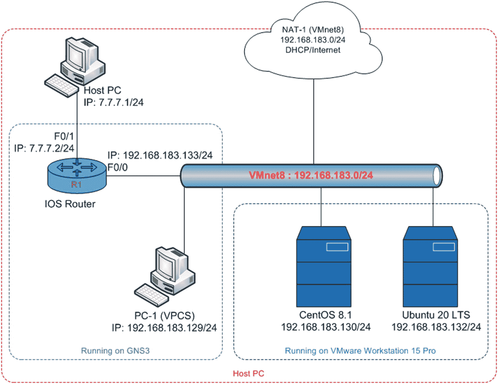

图 11-1。

linuxvm2ios 实验室拓扑

## 为 Linux 虚拟机实验室创建新的 GNS3 项目

让我们创建一个新项目，将 Linux VM 服务器连接到一个新的 IOS 路由器。创建新项目的过程类似于第 [10](10.html) 章中之前的项目。让我们创建一个新项目，将我们的 Linux 虚拟机连接到一个 IOS 路由器。

<colgroup><col class="tcol1 align-left"> <col class="tcol2 align-left"></colgroup> 
| 

**#**

 | 

**任务**

 |
| --- | --- |
| **1** | 从 GNS3 主菜单中，选择文件➤新建空白项目以打开新项目窗口。 |
| **2** | Give your new project a new name. The new project name is `linuxvm2ios` for this lab. You do not have to follow the same naming convention. Feel free to give your project a unique and meaningful name. See Figure [11-2](#Fig2).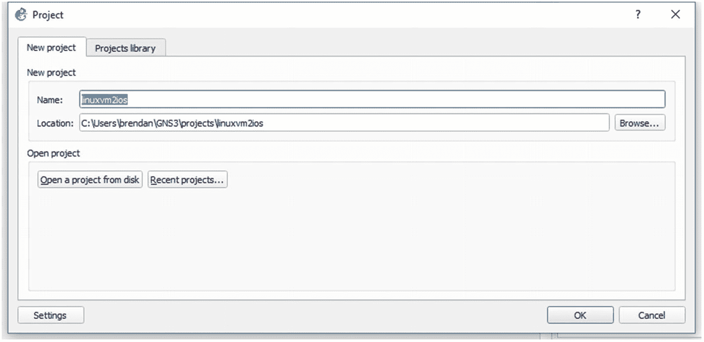图 11-2。linuxvm2ios 项目，创建一个新的 GNS3 项目 |
| **3** | 如图 [11-3](#Fig3) 所示配置 GNS3 拓扑。构建新拓扑时，请参考 GNS3 的拓扑和服务器摘要窗口了解更多信息。您将能够看到每个设备是如何连接的。连接所有设备后，启动 R1 和 PC-1。以下几点是在 GNS3 画布上连接和配置拓扑时的连接参考:在主机服务器上运行 NAT-1。(使用工作站的 VMnet8 中的 NAT。)Ethernetswitch-1 安装在 GNS3 VM 服务器上，仅用作连接多个设备的虚拟交换机。PC-1 是安装在 GNS3 上的 VPCS。VPCS 使得测试设备之间的通信变得容易。这类似于在路由器上配置虚拟环回接口。标有 Microsoft loopback 的主机 PC 是 cloud-1，只是为了美观而改变了图标。     •   Lastly, the CentOS 8.1 and Ubuntu 20.4 LTS servers are directly connected to VMnet8 on VMware Workstation and will not show up on the GNS3 topology. These server icons are also for aesthetic representation.图 11-3。linuxvm2ios 项目，GNS3 拓扑连接 |
|   | Note that in the topology in Figure [11-3](#Fig3), when you drag and drop NAT-1 and Host-PC (cloud-1), the network of VMnet8 should be used, so the host PC (pynetauto) should be selected. Your PC name will be different. See Figure [11-4](#Fig4).图 11-4。linuxvm2ios 项目，为 NAT-1 和 cloud-1 选择主机服务器 |
|   | Use the Servers Summary window shown in Figure [11-5](#Fig5) as a reference point while configuring and running the GNS3 topology.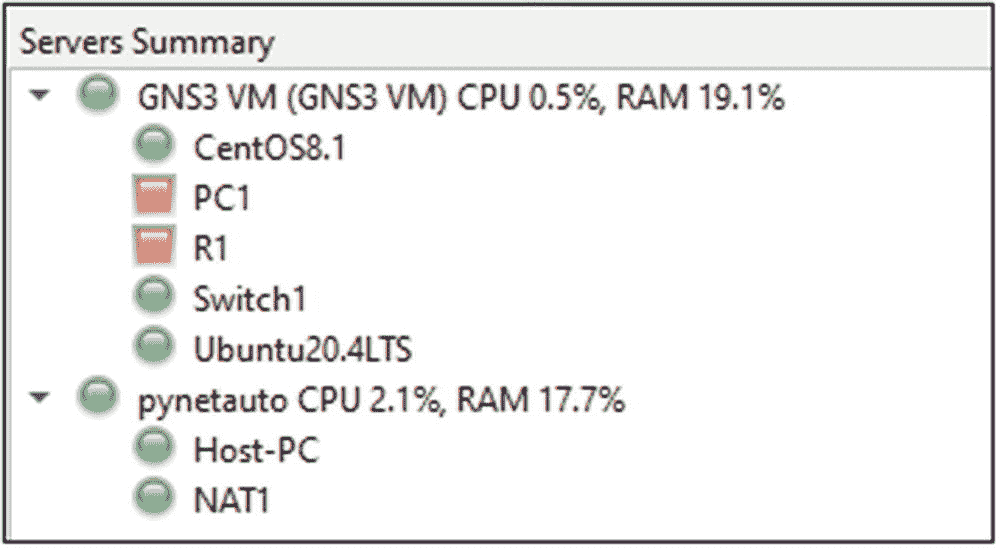图 11-5。linuxvm2ios 项目，服务器摘要窗口 |
|   | When you connect Ethernetswitch-1, a VPCS (PC-1), and an IOS router (R1), select GNS3 VM as the server, as shown in Figure [11-6](#Fig6).图 11-6。linuxvm2ios 项目，为所有其他设备选择 GNS3 VM 服务器 |
|   | Refer to the Topology Summary window shown in Figure [11-7](#Fig7) to connect each device.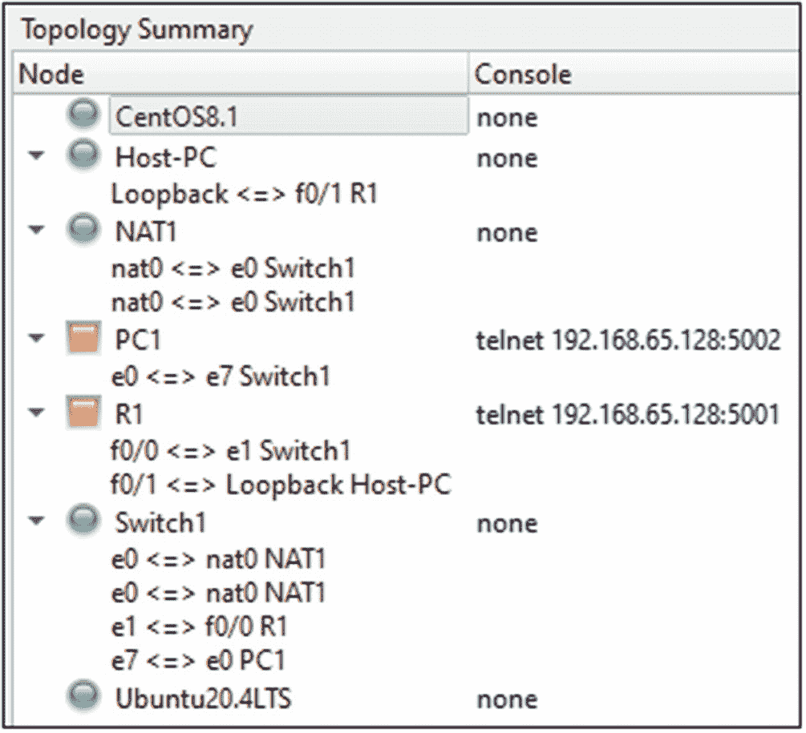图 11-7。linuxvm2ios 项目，拓扑总结 |
| **4** | Next, go to VMware Workstation’s main user window and start the CentOS 8.1 VM. When the server boots up, log in as the `pynetauto` user or your username. See Figure [11-8](#Fig8).图 11-8。CentOS 8.1，登录屏幕 |
| **5** | 在 CentOS 8.1 上打开一个终端，首先检查这个服务器的 IP 地址。在终端上使用`ifconfig ens160`命令获取或确认您的服务器的 IP 地址。您也可以通过 SSH 连接到 CentOS 8.1 服务器。在本例中，应该为 192.168.183.0/24 子网分配一个 IP 地址，但是如果您为 VMnet8 使用不同的子网，应该会收到不同的 IP 地址。在本例中，IP 地址 192.168.183.130 已分配给以太网 160 接口。根据您的虚拟机子网，您的 IP 地址分配可能会有所不同。`[pynetauto@centos8s1 ~]$` `ifconfig ens160``ens160: flags=4163<UP,BROADCAST,RUNNING,MULTICAST>  mtu 1500``inet 192.168.183.130  netmask 255.255.255.0  broadcast 192.168.183.255``inet6 fe80::f49c:7ff4:fb3f:bf32  prefixlen 64  scopeid 0x20<link>``ether 00:0c:29:85:a6:36  txqueuelen 1000  (Ethernet)``RX packets 87  bytes 10302 (10.0 KiB)``RX errors 0  dropped 0  overruns 0  frame 0``TX packets 118  bytes 15005 (14.6 KiB)``TX errors 0  dropped 0 overruns 0  carrier 0  collisions 0` |
| **6** | 还是在 VMware 工作站上，启动 Ubuntu 20 LTS 服务器，用同样的方式找出这个服务器的 IP 地址。发出`ifconfig ens33`或`ifconfig`或`ip address`命令。IP 地址 192.168.183.132 已经分配给`ens33`接口。根据您的虚拟机子网，您的 IP 地址分配可能会有所不同。pynetato @ Ubuntu 20s 1:~ $`ifconfig ens33``ens33: flags=4163<UP,BROADCAST,RUNNING,MULTICAST>  mtu 1500``inet 192.168.183.132  netmask 255.255.255.0  broadcast 192.168.183.255``inet6 fe80::20c:29ff:fef3:877c  prefixlen 64  scopeid 0x20<link>``ether 00:0c:29:f3:87:7c  txqueuelen 1000  (Ethernet)``RX packets 222  bytes 18369 (18.3 KB)``RX errors 0  dropped 0  overruns 0  frame 0``TX packets 442  bytes 41326 (41.3 KB)``TX errors 0  dropped 0 overruns 0  carrier 0  collisions 0` |
| **7** | 现在在 GNS3 上，启动 R1 并等待 1 分钟。打开 R1 控制台，配置 IP 域查找和 FastEthernet 0/0 接口，从 VMnet8 的 DHCP 服务器获取 IP 地址。另外，将接口 FastEthernet 0/1 的 IP 地址配置为 7.7.7.2 255 . 255 . 255 . 0；此接口连接到主机 PC 的 Microsoft 环回接口。`R1(config)#` `ip domain lookup``R1(config)#` `interface FastEthernet0/0``R1(config-if)#` `ip address dhcp``R1(config-if)#` `no shut``R1(config-if)#``*Mar  1 00:01:15.543: %LINK-3-UPDOWN: Interface FastEthernet0/0, changed state to up``*Mar  1 00:01:16.543: %LINEPROTO-5-UPDOWN: Line protocol on Interface FastEthernet0/0, changed state to up``*Mar  1 00:01:26.003: %DHCP-6-ADDRESS_ASSIGN: Interface FastEthernet0/0` `assigned DHCP address 192.168.183.133, mask 255.255.255.0, hostname R1``# Confirm the interface status by running "show ip interface brief"``R1#` `show ip interface brief``Interface                  IP-Address      OK? Method Status                Protocol``FastEthernet0/0            192.168.183.133 YES DHCP   up                    up``FastEthernet0/1            unassigned      YES unset  administratively down down``FastEthernet1/0            unassigned      YES unset  administratively down down` |
|   | 现在将接口`f0/1`配置为连接到微软环回接口并 ping 7.7.7.1。R1# `configure terminal``Enter configuration commands, one per line.  End with CNTL/Z.``R1(config)#` `interface FastEthernet 0/1``R1(config-if)#` `ip address 7.7.7.2 255.255.255.0``R1(config-if)#` `no shut``R1(config-if)#` `exit``R1#``*Mar  1 00:47:12.911: %SYS-5-CONFIG_I: Configured from console by console``R1#` `ping 7.7.7.1``Type escape sequence to abort.``Sending 5, 100-byte ICMP Echos to 7.7.7.1, timeout is 2 seconds:``.!!!!``Success rate is 80 percent (4/5), round-trip min/avg/max = 8/12/20 ms` |
| **8** | 从 R1 的控制台 ping NAT-1 网关(192.168.183.2)、Centos 8.1 服务器(192.168.183.130)和 Ubuntu 20 LTS 服务器(192.168.183.132)。如果收到了所有的 ICMP 响应，那么您就在正确的轨道上。如前所述，如果您看到第一个数据包被丢弃，这是预期的正常 ARP 行为。`R1#` `ping 192.168.183.2``Type escape sequence to abort.``Sending 5, 100-byte ICMP Echos to 192.168.183.1, timeout is 2 seconds:``.!!!!``Success rate is 80 percent (4/5), round-trip min/avg/max = 8/13/24 ms``R1#` `ping 192.168.183.130``Type escape sequence to abort.``Sending 5, 100-byte ICMP Echos to 192.168.183.130, timeout is 2 seconds:``.!!!!``Success rate is 80 percent (4/5), round-trip min/avg/max = 8/13/20 ms``R1#` `ping 192.168.183.132``Type escape sequence to abort.``Sending 5, 100-byte ICMP Echos to 192.168.183.132, timeout is 2 seconds:``.!!!!` |
| **9** | 类似地，在 GNS3 上启动 PC-1 (VPCS ),运行`ip dhcp`命令从 VMnet8 DHCP 服务器接收 IP 地址。使用`show ip`检查 IP 配置。`PC1>` `ip dhcp``DDORA IP 192.168.183.129/24 GW 192.168.183.2``PC1>` `show ip``NAME        : PC1[1]``IP/MASK     : 192.168.183.129/24``GATEWAY     : 192.168.183.2``DNS         : 192.168.183.2``DHCP SERVER : 192.168.183.254``DHCP LEASE  : 1719, 1800/900/1575``DOMAIN NAME : localdomain``MAC         : 00:50:79:66:68:00``LPORT       : 20010``RHOST:PORT  : 127.0.0.1:20011``MTU:        : 1500`PC1 的接口收到了 IP 地址 192.168.183.129。DDORA 不是一个儿童卡通人物的名字(*爱探险的朵拉*)。在这里，DORA 代表发现、提供、请求、确认，这是在服务器和客户端之间通过 DHCP 服务分配 IP 地址时使用的通信消息。 |
| **10** | Finally, from your host PC’s Windows desktop, SSH into both Linux servers using PuTTY and perform similar ICMP tests. Enter the IP address of each server and save the sessions for easier access, as shown in Figure [11-9](#Fig9).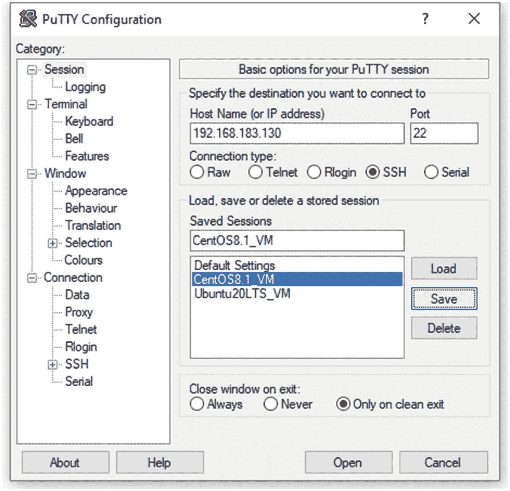图 11-9。PuTTY，为了方便起见保存 Linux 会话 |
|   | 如果没有通信问题，您现在可以在 Linux 服务器上编写一些 Python 脚本，并与 Cisco IOS 路由器通信。从你的 Linux 服务器，发送 ICMP 消息到 R1 的`f0/0`界面进行快速验证。`[pynetauto@centos8s1 ~]$` `ping 192.168.183.133 -c 3``PING 192.168.183.133 (192.168.183.133) 56(84) bytes of data.``64 bytes from 192.168.183.133: icmp_seq=1 ttl=64 time=0.547 ms``64 bytes from 192.168.183.133: icmp_seq=2 ttl=64 time=0.318 ms``64 bytes from 192.168.183.133: icmp_seq=3 ttl=64 time=0.372 ms``--- 192.168.183.133 ping statistics ---``3 packets transmitted, 3 received, 0% packet loss, time 44ms``rtt min/avg/max/mdev = 0.318/0.412/0.547/0.099 ms``pynetauto@ubuntu20s1:~$` `ping 192.168.183.133 -c 3``PING 192.168.183.133 (192.168.183.133) 56(84) bytes of data.``64 bytes from 192.168.183.133: icmp_seq=1 ttl=255 time=5.92 ms``64 bytes from 192.168.183.133: icmp_seq=2 ttl=255 time=6.85 ms``64 bytes from 192.168.183.133: icmp_seq=3 ttl=255 time=5.70 ms``--- 192.168.183.133 ping statistics ---``3 packets transmitted, 3 received, 0% packet loss, time 2004ms``rtt min/avg/max/mdev = 5.699/6.158/6.851/0.498 ms` |
| **11** | 在 R1 上，配置具有 15 级权限的用户名`enable password`，并启用 Telnet。`R1#` `configure terminal``R1(config)#` `enable password cisco123``R1(config)#` `username pynetauto privilege 15 password cisco123``R1(config)#` `line vty 0 15``R1(config-line)#` `login local``R1(config-line)#` `transport input telnet``R1(config-line)#` `no exec-timeout``R1(config-line)#` `end``R1#` `write memory`您可以从路由器本身测试 Telnet 设置，因此在 R1 上，运行`telnet 192.168.183.133`命令。同样，使用`show user`命令来检查登录的用户。`R1#` `telnet 192.168.183.133``Trying 192.168.183.133 ... Open``User Access Verification``Username:` `pynetauto``Password:``R1#` `show user``Line       User       Host(s)              Idle       Location``0 con 0                192.168.183.133      00:00:00``* 98 vty 0     pynetauto  idle                 00:00:00 192.168.183.133``Interface    User               Mode         Idle     Peer Address` |
| **12** | 从您的`ubuntu20s1` Linux 服务器，使用 PuTTY 远程登录到 R1 的`f0/0`接口(192.168.183.133)。您分配的 IP 地址可能不同，因此请用您的 IP 地址替换 IP 地址。运行`show user`命令来检查哪些用户已经登录以及用于 Telnet 会话的线路。星号(`*`)表示来自活动连接的访问信息。`pynetauto@ubuntu20s1:~$` `telnet 192.168.183.133``Trying 192.168.183.133...``Connected to 192.168.183.133.``Escape character is '^]'.``User Access Verification``Username: pynetauto``Password:``R1#` `show user``Line       User       Host(s)              Idle       Location``0 con 0                192.168.183.133      00:05:07``98 vty 0     pynetauto  idle                 00:05:07 192.168.183.133``* 99 vty 1     pynetauto  idle                 00:00:00 192.168.183.132``Interface    User               Mode         Idle     Peer Address`请注意，如果您使用 CentOS 远程登录到 R1，那么您可能需要在连接到互联网后首先安装 Telnet 客户端。`[pynetauto@centos8s1 ~]$` `sudo yum -y install telnet`或者`[pynetauto@centos8s1 ~]$` `sudo dnf -y install telnet` |
| **13** | 现在，从您的 Windows 主机上，打开另一个 PuTTY 会话，这次通过`f0/1` (7.7.7.2)登录到 R1。`*`表示来自当前连接的访问信息。让我们运行`write memory`来保存 R1 的当前配置。`R1#` `show user``Line       User       Host(s)              Idle       Location``0 con 0                idle                 00:05:43``98 vty 0     pynetauto  idle                 00:00:40 192.168.183.133``99 vty 1     pynetauto  idle                 00:01:10 192.168.183.132``*100 vty 2     pynetauto  idle                 00:00:00 7.7.7.1``Interface    User               Mode         Idle     Peer Address``R1#` `write memory` |

现在，您已经完成了所有设备的通信和 Telnet 测试。现在，您已经准备好处理另一个有趣的 IOS 实验室了。

## 从 Linux 虚拟机向 GNS3 IOS 路由器上传和下载文件(文件传输测试实验室)

在本实验中，您将向 GNS3 的 IOS 路由器 R1 添加闪存，并从 TFTP 服务器(CentOS8.1)上传和下载文件。您将从 Ubuntu 20 LTS 服务器编写并运行该脚本。

编写一个 Python 脚本来完成以下任务:

<colgroup><col class="tcol1 align-left"> <col class="tcol2 align-left"></colgroup> 
| 

**#**

 | 

**任务**

 |
| --- | --- |
| **1** | 在 GNS3 上，创建 Cisco 3725 IOS 路由器模板时，您已经向 Cisco 3725 的 PCMCIA disk0 添加了 64MB。If your router was not configured with a flash drive, first save the work and shut down the router. Then right-click, choose Configure, and move to the “Memories and disks” tab of R1\. Add 64MB, click Apply, and then click the OK button. Once the flash memory has been configured, start R1 again. See Figure [11-10](#Fig10).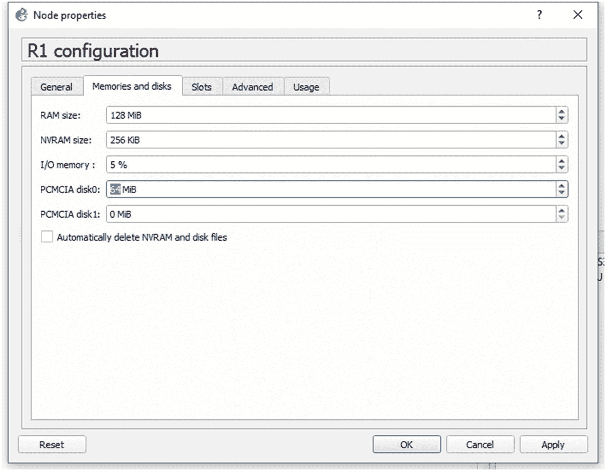图 11-10。R1，检查闪存分配 |
| **2** | 还记得在 8.3.3 中，我们在 CentOS8.1 上配置了一个 TFTP 服务器吗？转到 CentOS8.1 的 PuTTY 会话，现在确认 TFTP 服务的状态。TFTP 是在 CentOS8.1 Linux 上安装 IP 服务时配置的。Use the following commands to check for TFTP services running on CentOS8.1.

<colgroup><col class="tcol1 align-left"> <col class="tcol2 align-left"></colgroup> 
&#124; `sudo systemctl status tftp``sudo systemctl enable tftp``sudo systemctl start tftp` &#124; 检查 TFTP 服务状态在系统启动时启用 TFTP 服务启动 TFTP 服务 &#124;

如果 CentOS 8.1 上的 TFTP 服务运行正常，它应该以绿色显示活动(正在运行)。如果 TFTP 有问题，请使用前面显示的`enable`和`start`命令来启动该服务器上的服务。如果 CentOS 询问`sudo`用户密码，请输入您的密码。在 4.5.3 中，我们为 TFTP 服务配置了一个名为`/var/tftpdir`的默认文件夹，以便在该文件夹中共享文件。`[pynetauto@localhost ~]$` `sudo systemctl enable tftp``[sudo] password for pynetauto: **********``[pynetauto@localhost ~]$` `sudo systemctl start tftp``[pynetauto@localhost ~]$` `sudo systemctl status tftp``● tftp.service - Tftp Server` |
|   | `Loaded: loaded (/usr/lib/systemd/system/tftp.service; indirect; vendor prese>``Active: active (running) since Fri 2021-01-08 23:43:05 AEDT; 4s ago``Docs: man:in.tftpd``Main PID: 4237 (in.tftpd)``Tasks: 1 (limit: 11166)``Memory: 328.0K``CGroup: /system.slice/tftp.service``└─4237 /usr/sbin/in.tftpd -s /var/lib/tftpboot``Jan 08 23:43:05 localhost systemd[1]: Started Tftp Server.``lines 1-11/11 (END)` |
| **3** | 在你的 Ubuntu 服务器(主要 Python 服务器)上，重用第 [10 章](10.html)中`telnet_script1`的 Telnet 示例代码，让我们重写 Telnet 脚本来备份 R1 的运行配置。我将把脚本重命名为`backup_config.py`并修改代码。被修改的代码部分被突出显示。转到 Ubuntu 20 LTS Python 服务器，使用 nano 文本编辑器创建以下代码:`pynetauto@ubuntu20s1:~$` `pwd``/home/pynetauto``pynetauto@ubuntu20s1:~$` `mkdir ch11``pynetauto@ubuntu20s1:~$` `cd ch11``pynetauto@ubuntu20s1:~/ch11$` `nano backup_config.py``pynetauto@ubuntu20s1:~/ch11$` `ls``backup_config.py``backup_config.py``import getpass``import telnetlib``HOST = "192.168.183.133"``user = input(``"Enter your telnet username: "`T2】`password = getpass.getpass()``tn = telnetlib.Telnet(HOST)``tn.read_until(b"Username: ")``tn.write(user.encode('ascii') + b"\n")``if password` `:``tn.read_until(b"Password: ")``tn.write(password.encode('ascii') + b"\n")``tn.write(b"copy running-config tftp://192.168.183.130/running-config\n")` `#<<< Copy command``tn.write(b"\n")` `#<<< Enter key action``tn.write(b"\n")` `#<<< Enter key action``tn.write(b"exit\n")` `#<<< end session``print(tn.read_all().decode('ascii'))` |
| **4** | 在运行前面的脚本之前，转到 CentOS8s1 并确认`/var/tftpdir`目录中的文件。你可以看到 8.3.3 中只有两个传输测试文件。`[pynetauto@centos8s1 ~]$` `pwd``/home/pynetauto``[pynetauto@centos8s1 ~]$` `cd /var/tftpdir``[pynetauto@centos8s1 tftpdir]$` `ls``transfer_file01                           transfer_file77` |
| **5** | 现在从 Ubuntu 20 LTS Python 服务器，运行`python3 backup_config.py`命令。按照提示操作并检查返回的输出。输入您的网络管理员 ID 和密码来运行脚本。当运行配置被复制到 TFTP 服务器时，您应该会看到类似以下内容的消息:`pynetauto@ubuntu20s1:~/ch11$` `python3 backup_config.py``Enter your telnet username:` `pynetauto``Password: *********``R1#copy running-config tftp://192.168.183.130/running-config``Address or name of remote host [192.168.183.130]?``Destination filename [running-config]?``!!``1155 bytes copied in 2.168 secs (533 bytes/sec)``R1#exit` |
| **6** | 现在回到 CentOS8s1 服务器，重新检查目录(`/var/tftpdir`)。您现在应该看到`running-config`文件保存在 TFTP 服务器上。`[pynetauto@centos8s1 tftpdir]$` `ls``running-config             transfer_file01                           transfer_file77` |
| **7** | 现在，要将 IOS 映像上传到 GNS3 的 IOS 路由器的闪存，首先必须格式化闪存。打开 R1 的控制台，按照以下说明操作:`R1#` `show flash``No files on device``134211584 bytes available (2198889009152 bytes used)``R1#``*Mar  1 02:53:58.163: %PCMCIAFS-5-DIBERR: PCMCIA disk 0 is formatted from a different router or PC. A format in this router is required before an image can be booted from this device``R1#` `show file system` |
|   | `File Systems:``Size(b)             Free(b)      Type       Flags  Prefixes``-                   -            opaque     rw     archive:``-                   -            opaque     rw     system:``-                   -            opaque     rw     tmpsys:``57336               54057        nvram      rw     nvram:``-                   -            opaque     rw     null:``-                   -            network    rw     tftp:``* 2199023220736     134211584    disk       rw     flash:``-                   -            flash      rw     slot0:``-                   -            opaque     wo     syslog:``-                   -            opaque     rw     xmodem:``-                   -            opaque     rw     ymodem:``-                   -            network    rw     rcp:``-                   -            network    rw     pram:``-                   -            network    rw     ftp:``-                   -            network    rw     http:``-                   -            network    rw     scp:``-                   -            opaque     ro     tar:``-                   -            network    rw     https:``-                   -            opaque     ro     cns:``R1#``format flash`T2】`Format operation may take a while. Continue? [``confirm`T2】`Format operation will destroy all data in "flash:".  Continue? [``confirm`T2】`Writing Monlib sectors....``Monlib write complete``Format: All system sectors written. OK...``Format: Total sectors in formatted partition: 131040``Format: Total bytes in formatted partition: 67092480``Format: Operation completed successfully.``Format of flash: complete``R1#``show flash`T2】`No files on device``66936832 bytes available (0 bytes used)` |
| **8** | 您可以使用 Windows 或 WinSCP 的 FileZilla 客户端上传任何 IOS 文件或任何使用 Python `telnetlib`模块进行文件传输的文件。如果您的 Windows 主机 PC 上没有 WinSCP，请转到以下下载站点并安装一个:URL:[`https://winscp.net/eng/download.php`](https://winscp.net/eng/download.php)(wincp 下载)网址:[`https://filezilla-project.org/download.php?platform=win64`](https://filezilla-project.org/download.php%253Fplatform%253Dwin64)(Windows 版 FileZilla 客户端)安装 WinSCP 并启动应用后，使用以下设置通过端口 22 (SSH)连接到 CentOS8.1 服务器。参见图 [11-11](#Fig11) 。文件协议: **SCP**主机名: **192.168.183.130(您的 CentOS 8.1 IP 地址)**用户名: **pynetauto(您的 CentOS 8.1 用户名)**密码: ************(你的 CentOS 8.1 密码)** |
|   | 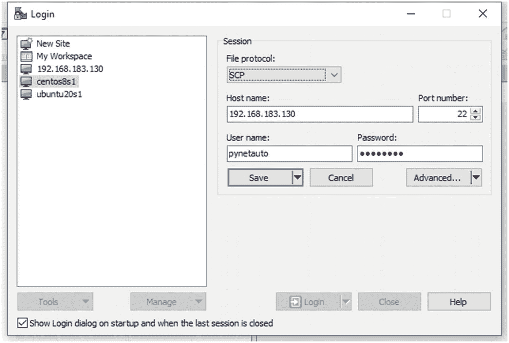图 11-11。WinSCP，连接到 TFTP 服务器(CentOS8.1) |
| **9** | When you accept the SSH key and log in, drill down to the `/var/tftpdir/` directory of your TFTP (CentOS8.1) server and drag and drop an IOS file for file sharing. You can also use another file in place of the IOS file to save time as you will be testing the file transfer concept only using Python’s `telnetlib` module. In this example, I am using the old IOS file named `c3725-adventerprisek9-mz.124-15.T14.bin`, but you can choose to use any file here for this test. See Figure [11-12](#Fig12).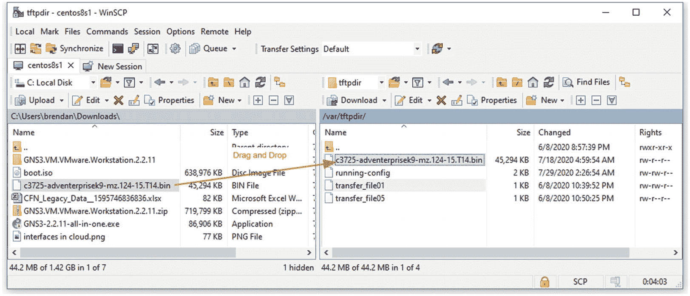图 11-12。WinSCP，复制 IOS 或任何文件传输测试文件 |
| **10** | 在 R1 上，闪存驱动器已经在前面的步骤中格式化，没有必要检查闪存上是否存在任何文件。 |
| **11** | 现在在 Ubuntu 20 LTS 服务器上，复制`backup_config.py`并保存为`upload_ios.py`。`pynetauto@ubuntu20s1:~/ch11$` `ls``backup_config.py``pynetauto@ubuntu20s1:~/ch11$` `cp backup_config.py upload_ios.py``pynetauto@ubuntu20s1:~/ch11$` `nano upload_ios.py`然后修改 Python 代码，使其看起来像下面的代码。更新后的零件会突出显示。您可以从头开始输入脚本，但是重用之前的脚本并进行必要的修改会更容易。此外，可以从官方下载站点下载该脚本。 |
|   | `upload_ios.py``import getpass``import telnetlib``HOST = "192.168.183.133"``user = input(``"Enter your telnet username: "`T2】`password = getpass.getpass()``tn = telnetlib.Telnet(HOST)``tn.read_until(b``"Username: "`T2】`tn.write(user.encode('ascii') + b"\n")``if password` `:``tn.read_until(b"Password: ")``tn.write(password.encode('ascii') + b"\n")``tn.write``(``b"`T3】`tn.write(b”\n”)` `#<<< Enter key action``tn.write(b”exit\n”)` `#<<< end session``print(tn.read_all().decode('ascii'))` |
| **12** | 运行 Python 代码。看起来应用挂起了，但实际上，它正在将文件从 TFTP 服务器传输到 R1 的闪存中。TFTP 是一种慢速协议，传输这个 45MB 的文件需要很长时间。在您的实践中，您可以创建任何较小的虚拟`.txt`文件以节省时间。`pynetauto@ubuntu20s1:~/ch11$` `python3 upload_ios.py``Enter your telnet username:` `pynetauto``Password: ********`&#124; |
| **13** | 运行前面的脚本后，返回 R1 的控制台，使用`show users`命令进行远程登录的 vty 会话，并使用`dir`或`show flash:`命令检查文件传输是否正在进行。`R1#``show flash`T2】`-#- --length-- -----date/time------ path``1      1470464 Mar 01 2002 01:02:28 c3725-adventerprisek9-mz.124-15.T14.bin``65466368 bytes available (1470464 bytes used)``R1#``show flash`T2】`-#- --length-- -----date/time------ path``1      2936832 Mar 01 2002 01:02:58 c3725-adventerprisek9-mz.124-15.T14.bin``64000000 bytes available (2936832 bytes used)` |
| **14** | 如果您正在上传一个 IOS 文件，如本例所示，通过 TFTP 完成文件传输需要一段时间。TFTP 协议使用 UDP 端口进行文件传输，但在实验室和生产环境中都是一种慢速文件传输协议。您只需上传一个文件来学习使用 Python 3 脚本进行 TFTP 文件传输的概念。您无法更新启动系统配置，也无法使用新的 IOS 映像重新启动 GNS3 IOS 路由器；这是在 GNS3 上使用 IOS 的缺点之一。但是，在 VMware Workstation 上使用 Cisco CSR1000v 或 Nexus 9000v，可以模拟实际的 IOS XE 升级过程，包括引导到新升级的 IOS。在下一章中，我们将在 VMware Workstation 上使用 Cisco CSR1000v 并模拟完整的 IOS 升级过程。一旦文件大小达到预期的文件大小，您就知道脚本和文件传输已经成功完成。`R1#` `dir``Directory of flash:/``1  -rw-    46380064   Mar 1 2002 01:22:04 +00:00  c3725-adventerprisek9-mz.124-15.T14.bin``66936832 bytes total (20553728 bytes free)``R1#``show flash`T2】`-#- --length-- -----date/time------ path``1     46380064 Mar 01 2002 01:22:04 c3725-adventerprisek9-mz.124-15.T14.bin``20553728 bytes available (46383104 bytes used)` |
| **15** | 由于缓慢的上传时间和 Python 的`telnetlib`库的问题，你的 Ubuntu Python 服务器控制台可能仍然看起来像是在上传 IOS。按 Ctrl+Z 退出此状态以完成本实验。`pynetauto@ubuntu20s1:~/ch11$` `python3 upload_ios.py``Enter your telnet username: pynetauto``Password:``^Z``[1]+  Stopped                 python3 upload_ios.py``pynetauto@ubuntu20s1:~/ch11$` |

*   检查 CentOS8.1 上的 TFTP 服务是否正常运行

*   将 R1 的运行配置备份到 TFTP 服务器。

*   上传一个 IOS 到 R1 的闪存进行快速测试。

你已经使用远程登录和 TFTP 服务上传文件到 R1 的闪存。网络工程师的大部分工作涉及 IOS 补丁管理，包括将 IOS 上传到许多路由器和交换机。想象一下，你正在编写一段代码，这段代码可以在晚上你安然入睡时将多个 IOS 文件上传到数百台思科路由器和交换机。实际上，这是我为定期修补客户网络设备而创建的首批工具之一。

## 复制(克隆)GNS3 项目

为了准备下一章，让我们复制和克隆当前项目。大约有三种不同的方法可以制作 GNS3 项目的副本。第一种方法是使用 GNS3 菜单的“将项目另存为…”功能，第二种方法是将其导出为可移植项目并在另一台主机上重新导入，最后一种方法是使用“导出配置”方法导出您设备的配置并手动克隆您的 GNS3 项目。这些方法是按照难度增加的顺序提到的。另外，请注意，如果您使用第一种方法，您现有的实验室配置将被移动到新保存的`Project`文件夹中。您将丢失设备运行配置的现有配置。克隆 GNS3 项目的最佳方式是使用第三种方法，它保留您现有的实验室状态，并将相同的设置带到新项目中。最后，但也是最重要的，如果你想在任何时候对你的 GNS3 项目做一个完整的备份，你可以在`C:\Users\[your_name]\GNS3\project`下复制整个项目文件夹。

因为在本书的这一点之外我们不会使用`linuxvm2ios`项目，所以让我们看看如何使用复制方法克隆 GNS3 项目。在后面的章节中，将演示另一种方法，为您提供另一个克隆选项。

<colgroup><col class="tcol1 align-left"> <col class="tcol2 align-center"></colgroup> 
| 

**#**

 | 

**任务**

 |
| --- | --- |
| **1** | Make sure all devices in the GNS3 project are powered off. To save the existing `linuxvm2ios` project to a new project name, first open GNS3’s main user window, go to File, and select “Save project as.” See Figure [11-13](#Fig13).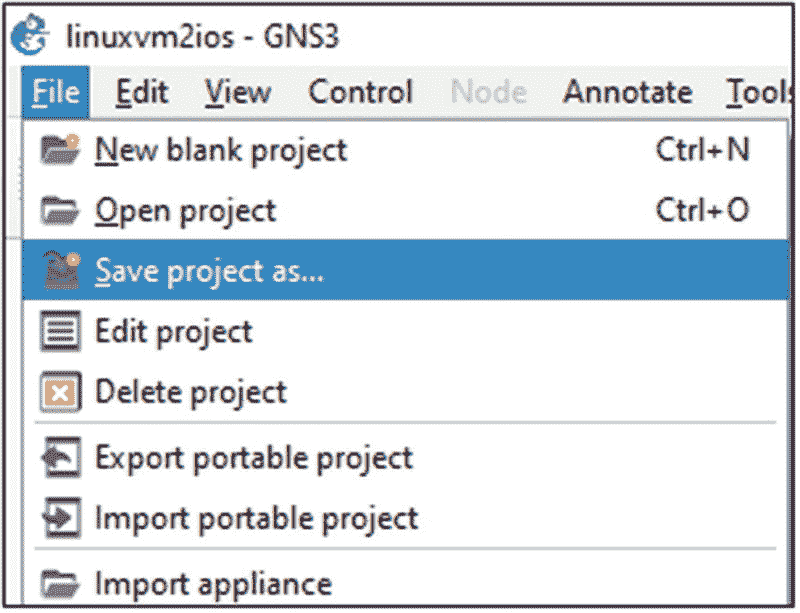图 11-13。GNS3，“项目为…”菜单 |
| **2** | GNS3 项目保存在`C:\Users\[your_name]\GNS3\project`文件夹下。现在，给你的第 12 章的新项目起一个新名字。本实验将在后续实验中使用。参见图 [11-14](#Fig14) 。GNS3 project folder location: `C:\Users\brendan\GNS3\projects`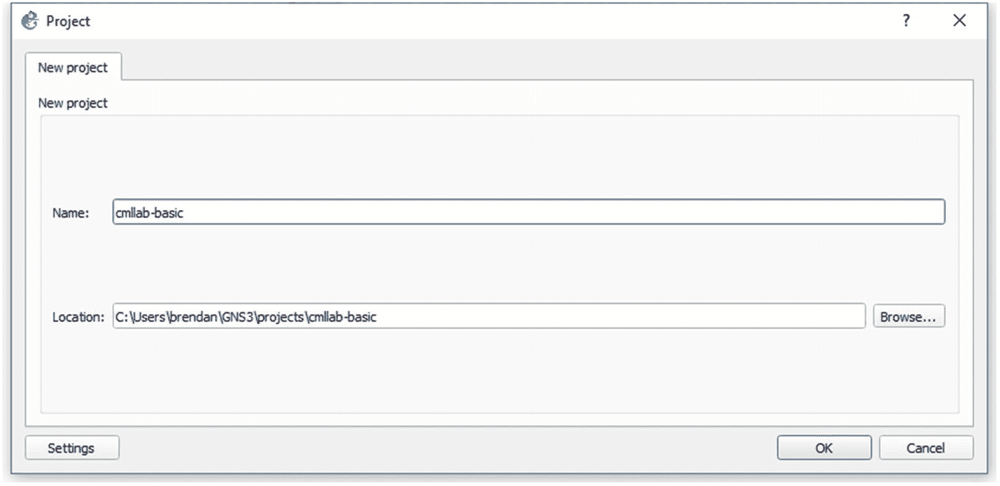图 11-14。GNS3，将现有的 linuxvm2ios 项目克隆到 cmllab-basic |
| **3** | After you saved the new project, go to the `Project` folder (`C:\Users\[your_name]\GNS3\projects`) and check the original and new project folders’ file sizes. The original project folder size will be around 24KB in size, whereas the new project folder size will be over 2.1MB. Open the folder and check the folder and file contents. See Figure [11-15](#Fig15).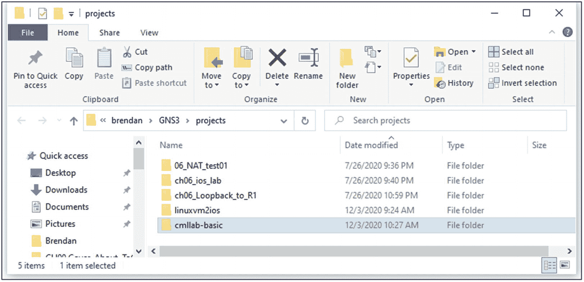图 11-15。主机，确认新的项目文件夹 |
| **4** | Now open the new project and run it. If you have saved the project correctly, it should run smoothly with no errors. Now you are ready for some CML-PE labs in Chapter [12](12.html). See Figure [11-16](#Fig16).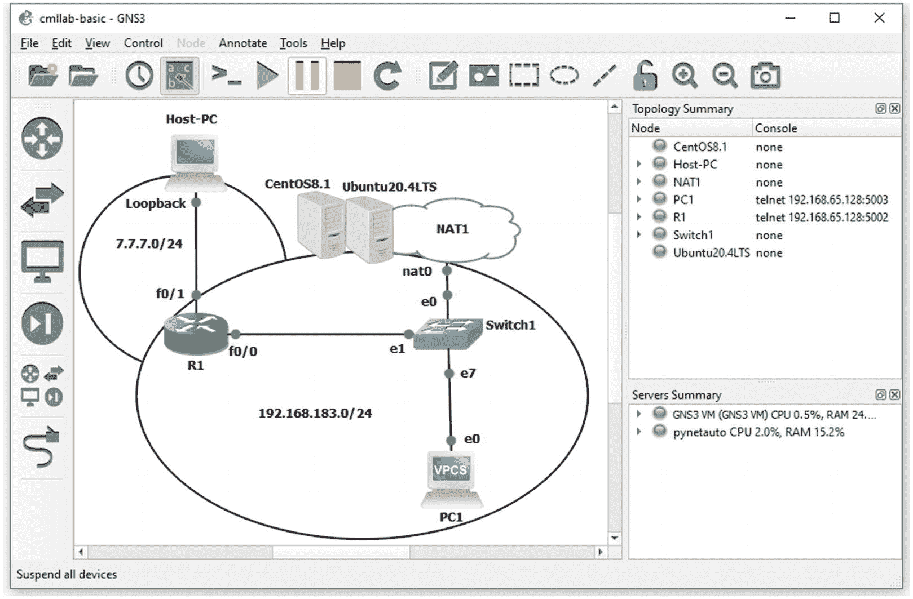图 11-16。GNS3，运行 cmllab-basic 项目 |

## 摘要

在本章中，您通过 Telnet 测试了 Linux 虚拟机与 IOS 路由器 R1 的交互。您学习了如何创建 GNS3 项目，使用简单的 Cisco 配置运行了一个快速文件传输测试实验室，最后学习了如何克隆 GNS3 项目。你现在已经做好准备，可以处理第 [12](12.html) 到 [18](18.html) 章中的其他实验。在第 [12](12.html) 章中，我们将使用从前面章节中获得的许多技能，使用集成到 GNS3 中的 Cisco CML (VIRL)镜像来构建 L3 路由和 L2 交换实验室。我们将在第 [13](13.html) 章中使用`telnetlib`模块，向 Python 网络自动化迈出一小步，然后在第 [14](14.html) 章中学习使用 SSH 协议控制思科 VIRL 设备。Python 脚本将在 Linux 虚拟机上运行，使用`telnetlib`、`paramiko`和`netmiko`库通过 Telnet 和 SSH 协议控制思科 VIRL 设备。