# 十二、构建 Python 自动化实验室环境

到目前为止，我们一直在 Telnet 实验室中测试运行过时 IOS 版本(12.x)的旧 Cisco 设备。为了在较新的 IOS 版本上测试新功能，并为我们的实验室配备交换(L2)功能，我们需要将 Cisco CML-PE 的 L2 和 L3 映像集成到 GNS3 实验室环境中。本章将指导您在 GNS3 上完成思科 CML-PE L2 和 L3 映像集成。将指导您完成在 GNS3 环境中下载和集成 L2 和 L3 映像的每个步骤，以便您可以在下一章的网络实验室中使用更新的 IOS 功能集进行测试。您将了解 CML-PE 产品，下载实验室所需的图像，在 GNS3 上集成下载的图像，然后构建 CML-PE 基本实验室拓扑，以测试以下章节中的各种 Python 网络实验室。

在本书中，你已经在你的第一次网络自动化之旅中走了很长的路。到目前为止，我希望您没有失去学习 Python 网络自动化的热情。为了从本书的后半部分获得最大收益，本书假设你已经彻底阅读了前 11 章。在 Python 网络自动化旅程的前半部分，您已经掌握了使用大量开源和专有软件安装、运行和配置集成虚拟实验室所需的各种基本实践技能。您还开始使用目前所学的知识编写基本的 Python 脚本。当然，我们还可以讨论更多令人兴奋的话题，比如 DevOps 概念、Ansible、ACI、REST API、HTML、Postman、YANG、NETCONF 等等。然而，这本书的目的是明确的:我们一直关注让你开始 Python 编程的本质任务，这是所有 Python 应用开发工程师的基本技能。你可能听过这样一句话“给一个人一条鱼，你喂他一天；教一个人钓鱼，你喂他一辈子。”借用 Python 网络应用开发的这个伟大成语，“教一个网络工程师如何使用 Ansible，你让他成为一个驱动；教他怎么用 Python 写代码，你就把他变成一辈子机械师。”因此，扩展你从阅读本书中获得的技能是你的责任；只有你能决定你下一步要去哪里，以及如何将新技能应用到你的工作或学习中。

到目前为止，您已经学习了各种 IT 技能，为接下来主要关注 Python 网络自动化实验室的章节做好了准备。如果您到目前为止没有遇到任何技术问题，那么您应该能够轻松地阅读剩余的章节。如果您还没有完全设置好您的实验环境，或者如果您只完成了每章中的部分练习，我建议您回去完成，因为您将需要所有这些基础知识。

在本章中，我们将从第十一章结束时停止的地方开始，完成构建的基本 CML lab-基本实验室拓扑，以开始编写 Python 代码并测试用于网络自动化应用开发的代码。假设您是一名经验丰富的网络工程师，拥有多年使用 Cisco、Juniper、Arista 和 HP 网络设备的经验。在这种情况下，您在学习本实验的内容时不会有任何问题。然而，即使您是一名刚刚开始职业生涯的网络工程师，您仍然能够按照所有实验步骤进行操作，因为这些实验只包含最基本的网络概念，并附有足够的培训说明。如果你集中注意力，你将能够毫不费力地完成所有的实验。

## 思科 CML-个人软件许可信息和软件下载

思科出售思科建模实验室-个人(CML-个人)与年度订阅。如果您是一名网络工程师或网络专业的学生，想要探索 Cisco CML-PERSONAL 所提供的一切，购买订阅是一个不错的选择。在订阅的第一年，您需要支付 199 美元，并且您将继续支付思科学习团队指定的相同的年度订阅费。对于一个以思科技术为生的专业工程师来说，与传统网络工程师为了进入这个行业而不得不花费在他们的旧的 3700 和 2600 系列路由器和 2950 系列交换机上的费用相比，订阅费是便宜的。无论如何，如果你能得到 CML 图像，有更具成本效益的方法来建立你的实验室，比如将它们集成到 GNS3 中，这是本章的主题。

正如在第一章中提到的，CML-PERSONAL(改名为 VIRL-PE，虚拟互联网路由实验室个人版)是一个虚拟设备仿真器程序，用于研究思科的技术，所以你可以说它是特定于供应商的。然而，您将从思科工具中学到的网络概念将是通用的，并可复制到其他供应商的技术中。一旦您订阅了 Cisco CML-PERSONAL，您就可以下载并安装 Cisco 的 CML-PERSONAL 软件，并使用路由器、交换机和防火墙 CML-PERSONAL 映像来模拟各种 Cisco 实验室。不出所料，本书没有使用 CML-PERSONAL PE，而是使用混合实验室设置，在 GNS3 上使用 Cisco CML-PERSONAL 的路由器(L3)和交换机(L2)映像。GNS3 上的 CML-个人映像安装和集成程序与 GNS3 上的 Cisco 路由器 IOS 映像集成几乎相同。同样，您的 Windows 主机需要连接到互联网。CML-PERSONAL 是思科的专有软件，法律禁止免费分发 CML-PERSONAL 软件和 CML-PERSONAL 图像。如果您有能力订阅，我们推荐您在 [`https://learningnetworkstore.cisco.com/cisco-modeling-labs-personal/cisco-cml-personal`](https://learningnetworkstore.cisco.com/cisco-modeling-labs-personal/cisco-cml-personal) 订阅 CML-PERSONAL。

本书声明任何 Cisco IOS、CML-PERSONAL 或任何其他专有软件的购买和使用都是您的责任。本书不包含任何软件。有几种方法可以找到本书中提到的软件。更多信息请参考 [`https://developer.cisco.com/modeling-labs/`](https://developer.cisco.com/modeling-labs/) 。

## 下载 Cisco CML-个人 IOSvL2(交换机)镜像

在我们将 Cisco CML-PERSONAL L2 交换机映像集成到 GNS3 之前，您需要找到、下载并保存到您的主机 PC 的`Downloads`文件夹中。您可以从 GNS3 官方网站获得有关 CML-PERSONAL L2 交换机的信息，该网站将带您到思科的 CML-PERSONAL L2 网站( [`https://learningnetwork.cisco.com/s/article/iosvl2-more-info-updated-10-2-15-x`](https://learningnetwork.cisco.com/s/article/iosvl2-more-info-updated-10-2-15-x) )。

本书使用的 CML-PERSONAL switch 镜像名称为`vios_l2-adventerprisek9-m.03.2017.qcow2`。您可以使用同一个或您可以找到并下载的任何更新的图像。下载交换机镜像文件后，保存到`Downloads`文件夹。将其保存到`Downloads`文件夹对于节省时间很重要，因为 GNS3 将首先在`Downloads`文件夹中查找图像(参见图 12-1 )。

图 12-1。

CML-个人 L2 交换机图像，保存到下载文件夹

## 下载 Cisco CML-PERSONAL IOSv(路由器)镜像和启动配置文件

要集成 CML-PERSONAL L3 或路由器映像，您必须下载工作 IOSv L3 Qemu ( `qcow2`)和`IOSv_startup_config.img`映像文件。与 L2 交换机不同，CML-PERSONAL 路由器镜像与 GNS3 的集成也需要用于设备启动的`IOSv_startup_config.img`文件，该文件可以从 CML-PERSONAL 的官方网站下载，或者关于 GNS3 CML-PERSONAL L3 路由器和`IOSv_startup_config.img`的`sourceforge.net.`信息可以从思科的 CML-PERSONAL 网站获得。请访问以下推荐网站，了解有关 Cisco CML-PERSONAL L3 软件的更多信息:

*   *GNS 3 CML-个人 IOSv* : [`https://learningnetwork.cisco.com/s/article/iosv-more-info-updated-4-20-15-x`](https://learningnetwork.cisco.com/s/article/iosv-more-info-updated-4-20-15-x)

*   *CML-个人 IOSv_startup_config 文件下载* : [`https://sourceforge.net/projects/gns-3/files/Qemu%20Appliances/`](https://sourceforge.net/projects/gns-3/files/Qemu%2520Appliances/)

本书使用的 CML-PERSONAL IOSv 或 L3 路由器镜像名为`IOSv-L3-15.6(2)T.qcow2`；这是一个旧的图像，但它仍然符合我们的需要。由于我们没有探索所有的网络功能，思科设备仅满足我们学习网络自动化概念和 Python 应用开发的需要。我们可以使用任何版本的 CML L2 和 L3 映像，只要它能够承载流量，并节省我们运行成熟的基于硬件的实验室所需的时间和资源。尽管我们关注的是网络自动化，但路由和交换概念并不是本书的核心。因此，Cisco CML-PERSONAL images 为我们提供了基本的 L2 和 L3 连接来承载流量，并使用 Telnet、SSH、RESTCONF 和其他 Python 库来学习 Python 脚本编写技能。下载两个需要的文件，如图 12-2 所示，保存在`Downloads`文件夹中。

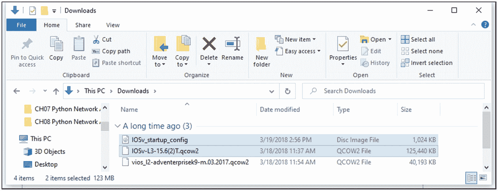

图 12-2。

CML-个人 L3 路由器映像，保存在下载文件夹中

一旦有了 vIOS L2 映像、vIOS L3 映像和 vIOS 启动配置文件，就可以将它们安装并集成到 GNS3 中了。

## 在 GNS3 上安装思科 CML-个人 L2 交换机和 CML-个人 L3

在第十一章的结尾，我们复制并创建了一个名为`cmllab-basic`的新项目。让我们重新打开那个项目，因为这是我们本章任务的起点。如果您从第十一章继续工作，请从 GNS3 继续工作，但是如果您刚刚打开 PC，那么首先使用桌面上的 GNS3 快捷图标启动 GNG3。如果实验环境设置正确，GNS3 将运行，安装在 VMware Workstation 上的 GNS3 虚拟机将在几秒钟后自动启动。

Installation tip

如果由于软件故障导致 CML-PERSONAL 安装无法正常工作，您必须通过右键单击 GNS3 删除已安装的交换机或路由器模板，并尝试再次安装映像。CML-个人图像不是为 GNS3 制作的，所以有时它们在第一次尝试时不会集成到 GNS3。如果 CML-PERSONAL 映像在第一次尝试后没有正确安装，不要放弃；继续尝试，直到它被正确安装。

## 在 GNS3 上安装思科 CML-个人 L2 交换机

您将首先在 GNS3 上安装思科 CML-个人 L2 交换机镜像。为了正确安装，主机必须连接到互联网。安装完成后，您将使用安装的映像运行交换实验，这在早期的 IOS 映像集成中是不可能的。

<colgroup><col class="tcol1 align-left"> <col class="tcol2 align-center"></colgroup> 
| 

#

 | 

工作

 |
| --- | --- |
| **1** | In the GNS3 main window, go to File and click + New template . See Figure 12-3.图 12-3。CML L2 交换机安装，添加新模板 |
| **2** | When the “New template” wizard opens , leave the default selection of “Install an appliance from the GNS3 server (recommended)” and click Next. See Figure 12-4.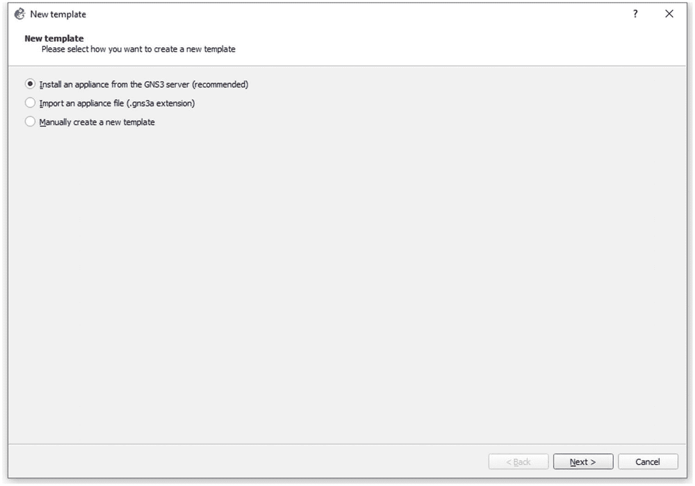图 12-4。CML L2 交换机安装，新模板选择 |
| **3** | In the “Appliances from server**”** window , in the search field, type in **IOSvL2** to locate Cisco IOSvL2 Qemu under Switches. Select the searched device and click Install; this is the template for the Cisco CML-PERSONAL L2 switch on GNS3\. See Figure 12-5.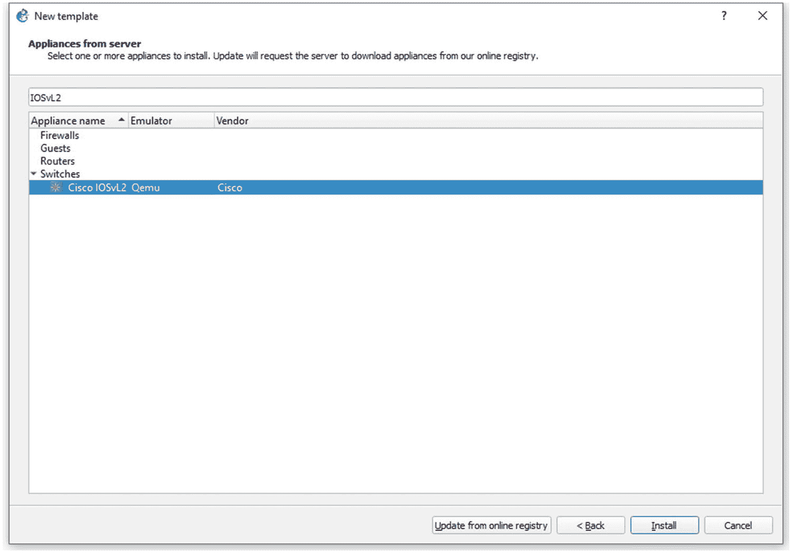图 12-5。CML L2 交换机安装，来自服务器的设备 |
| **4** | In the Server window , click Next. See Figure 12-6.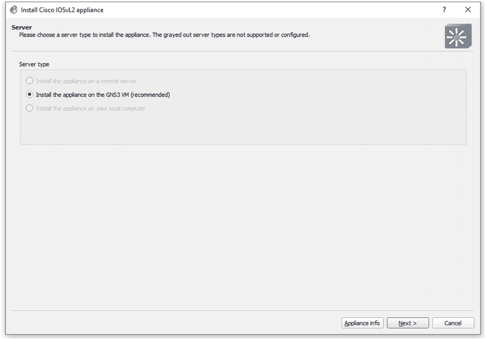图 12-6。CML L2 交换机安装，服务器 |
| **5** | In the “Qemu settings” window , click Next. See Figure 12-7.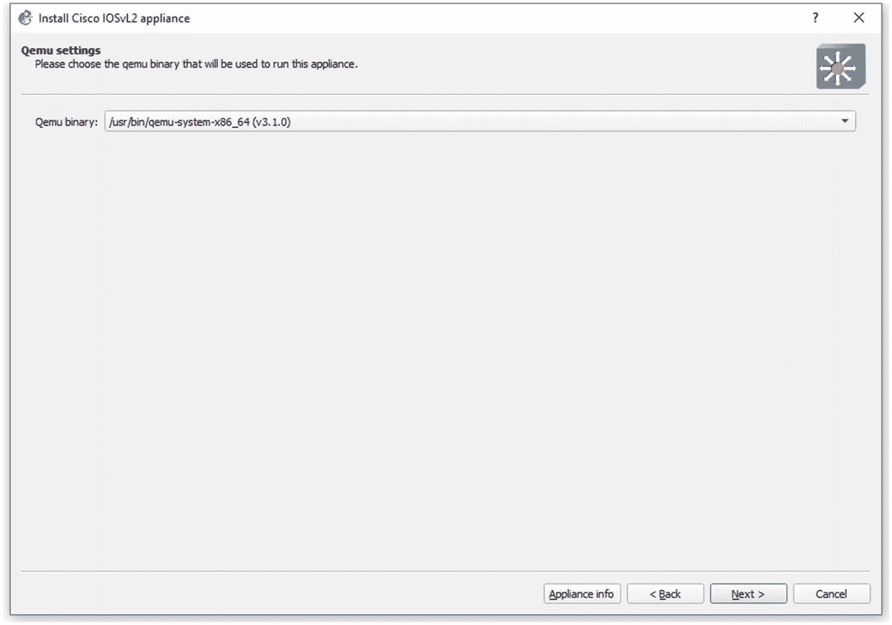图 12-7。CML L2 交换机安装，Qemu 设置 |
| **6** | Under “Required files,” if you have placed the CML-PERSONAL L2 `.qcow2` file in the `Downloads` folder, the installation wizard will automatically detect the L2 image automatically and display it in green. You can also see the missing files in red. Highlight your image and click Next. See Figure 12-8.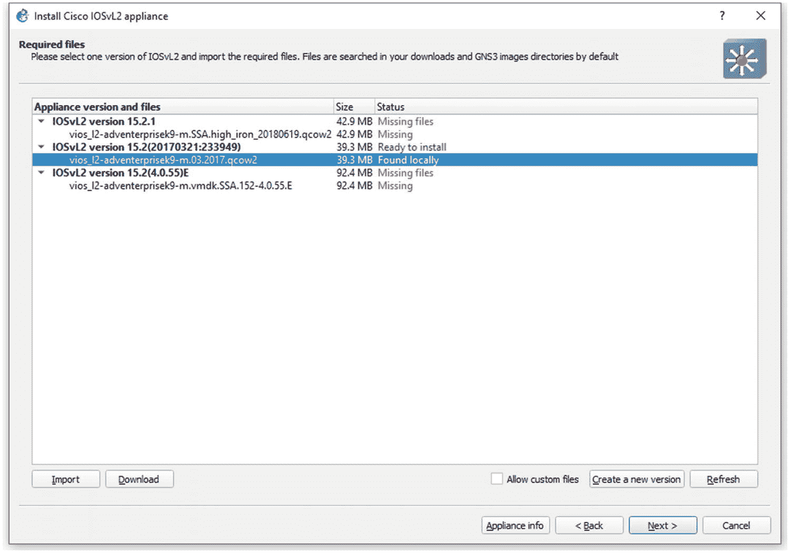图 12-8。CML L2 交换机安装，所需文件 |
| **7** | When the Appliance window pops up , click Yes. See Figure 12-9.图 12-9。CML L2 安装，设备安装弹出窗口 |
| **8** | To complete the installation , click Finish. See Figure 12-10.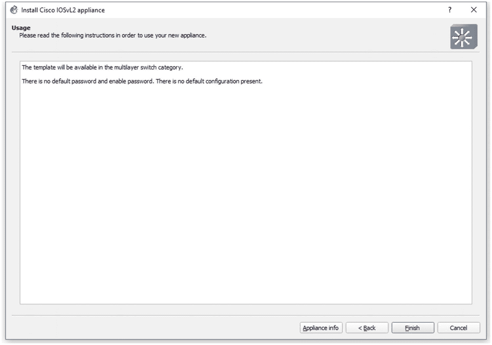图 12-10。CM L2 开关的安装、使用 |
| **9** | The “Add template” window pops up ; click OK to finish the installation. See Figure 12-11.图 12-11。CML L2 交换机安装，弹出“添加模板” |
| **10** | On GNS3, click the Switch button on the left, which looks like two opposite arrows, to open the switches. See Figure 12-12.图 12-12。CML L2 交换机安装，选择 GNS3 上的交换机图标 |
| **11** | If Cisco CML-PERSONAL IOSvL2 was installed correctly, you would see your new switch devices installed under Switches. See Figure 12-13.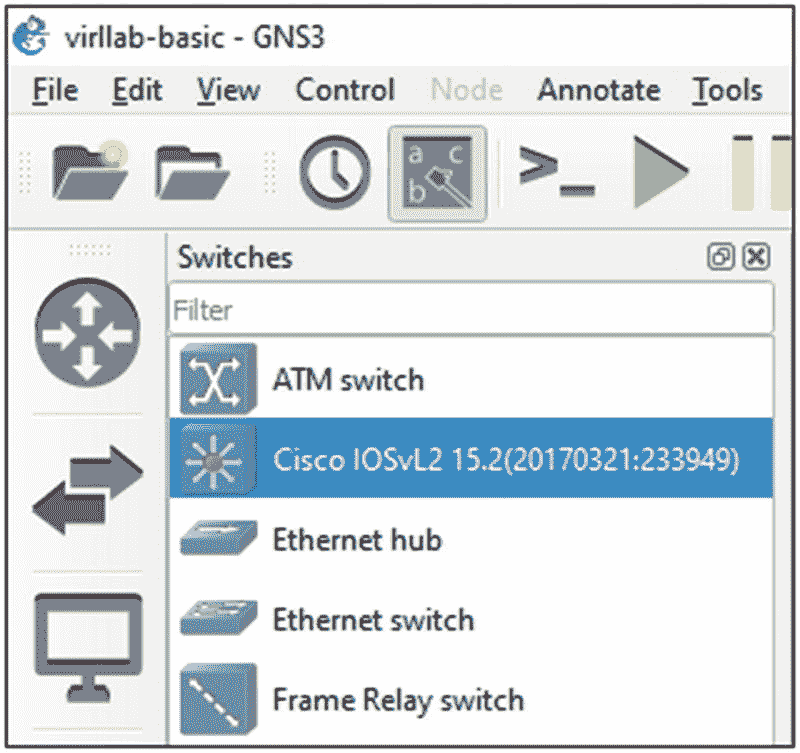图 12-13。CML L2 交换机安装，选择 Cisco IOSvL2 交换机 |
| **12** | Now, drag and drop the IOSvL2 switch to the cmllab-basic lab, as shown in Figure 12-14.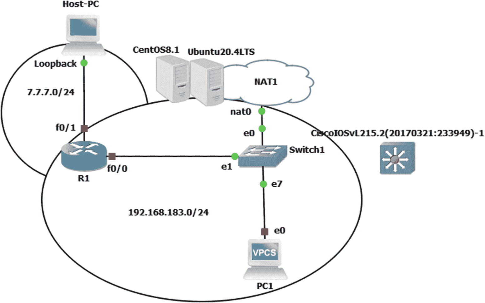图 12-14。CML L2 交换机安装，拖放 CML 交换机 |
| **13** | Using the Add Link tool, connect Gi0/0 of the new switch to Switch1’s e2 interface, as shown in Figure 12-15. Then power on all devices on the topology and also the CentOS8.1 and Ubuntu 20.04 LTS servers on VMware Workstation 15 Pro. Rename the switch to LAB-SW1 by right-clicking and clicking the Change Hostname menu.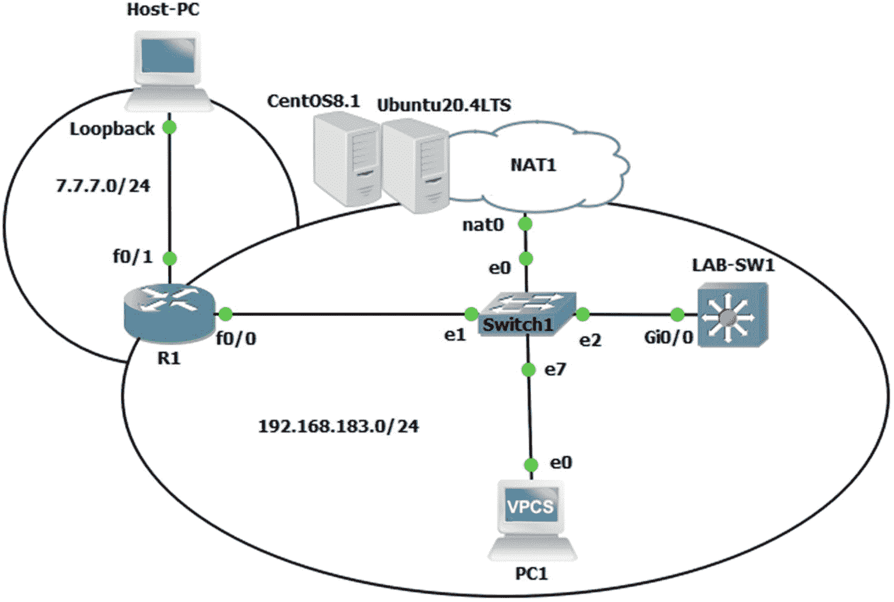图 12-15。CML L2 交换机安装，将 CML 交换机连接到网络 |
| **14** | After powering on LAB-SW1, open its console, and you will see a similar power-on screen as shown in Figure 12-16.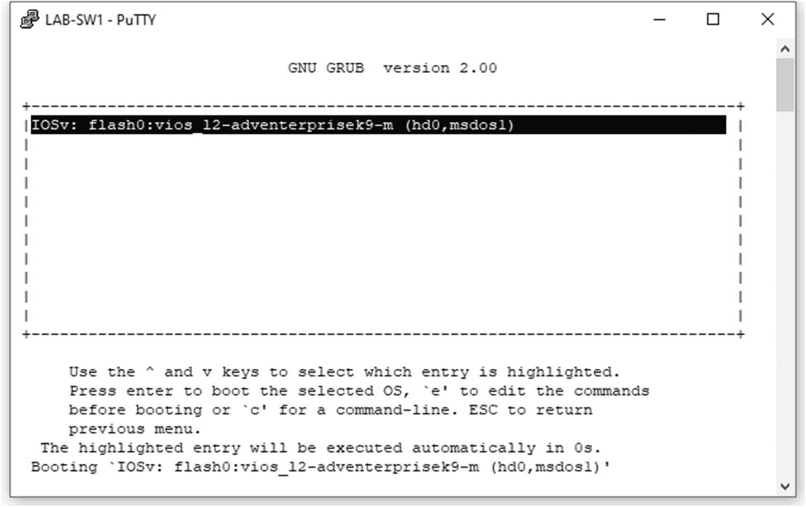图 12-16。CML L2 交换机安装，通电 CML 交换机屏幕 |
| **15** | 如果新交换机成功启动，它的控制台屏幕应该如下所示。现在，您已经在 GNS3 上完成了 CML 个人 L2 交换机的安装。为一些交换实验室做好准备。 |
|   | `Cisco IOS Software, vios_l2 Software (vios_l2-ADVENTERPRISEK9-M), Experimental Version 15.2(20170321:233949) [mmen 101]` |
|   | `Copyright (c) 1986-2017 by Cisco Systems, Inc.` |
|   | `Compiled Wed 22-Mar-17 08:38 by mmen` |
|   | `**************************************************************************` |
|   | `* IOSv is strictly limited to use for evaluation, demonstration and IOS  *` |
|   | `* education. IOSv is provided as-is and is not supported by Cisco's      *` |
|   | `* Technical Advisory Center. Any use or disclosure, in whole or in part, *` |
|   | `* of the IOSv Software or Documentation to any third party for any       *` |
|   | `*` |
|   | `*Jan  9 10:36:48.512: %PLATFORM-5-SIGNATURE_VERIFIED: Image 'flash0:/vios_l2-adventerprisek9-m' passed code signing verification purposes is expressly prohibited except as otherwise authorized by     *` |
|   | `* Cisco in writing.                                                      *` |
|   | `**************************************************************************` |
|   | `Switch>` |

### GNS3 上 CML L2 交换机集成的快速通信测试

在 CML-PERSONAL L2 交换机安装结束时，快速执行从交换机到网络上其它设备的通信检验。推荐的 ICMP 测试描述如下:

<colgroup><col class="tcol1 align-left"> <col class="tcol2 align-left"></colgroup> 
| 

#

 | 

工作

 |
| --- | --- |
| **1** | 快速登录并使用有效的 IP 地址在新交换机上配置正确的交换机名称和 VLAN 1 接口。 |
|   | `Switch>``enable`T2】 |
|   | `Switch#``configure terminal`T2】 |
|   | `LAB-SW1(config)#``hostname LAB-SW1`T2】 |
|   | `LAB-SW1(config)#``spanning-tree vlan 1 root primary`T2】 |
|   | `LAB-SW1(config)#``interface vlan 1`T2】 |
|   | `LAB-SW1(config-if)#``ip add 192.168.183.101 255.255.255.0`T2】 |
|   | `LAB-SW1(config-if)#``no shut`T2】 |
|   | `LAB-SW1(config-if)#``end`T2】 |
| **2** | 在 LAB-SW1 上，当您打开 Gi0/0 时，R1 的 f0/0 接口可能会提示您双工不匹配错误。要在 LAB-SW1 上停止这条恼人的 CDP 错误消息，您需要将 R1 的 f0/0 接口速度硬编码为 100，并将双工编码为全双工。如果没有出现此错误，您可以继续下一步。 |
|   | `LAB-SW1(config-if)#` |
|   | `*Aug 2 11:16:38.977: %CDP-4-DUPLEX_MISMATCH: duplex mismatch discovered on GigabitEthernet0/0 (not half duplex), with R1 FastEthernet0/0 (half duplex).` |
|   | 打开 R1 控制台，按如下方式更改接口速度和双工: |
|   | `R1#``configure terminal`T2】 |
|   | `R1(config)#``interface f0/0`T2】 |
|   | `R1(config-if)#``duplex full`T2】 |
|   | `R1(config-if)#``speed 100`T2】 |
|   | `R1(config-if)#``do write memory`T2】 |
| **3** | 转到 PC1，运行`ip dhcp`命令获取 IP 地址，或者如果您继续上一章的实验，运行`show ip`命令检查 PC1 的 IP 地址。 |
|   | `PC1>``ip dhcp`T2】 |
|   | `DDORA IP 192.168.183.129/24 GW 192.168.183.2` |
|   | `PC1>``show ip`T2】 |
|   | `NAME        : PC1[1]` |
|   | `IP/MASK     : 192.168.183.129/24` |
|   | `GATEWAY     : 192.168.183.2` |
|   | `DNS         : 192.168.183.2` |
|   | `DHCP SERVER : 192.168.183.254` |
|   | `DHCP LEASE  : 1713, 1800/900/1575` |
|   | `DOMAIN NAME : localdomain` |
|   | `MAC         : 00:50:79:66:68:00` |
|   | `LPORT       : 20012` |
|   | `RHOST:PORT  : 127.0.0.1:20013` |
|   | `MTU:        : 1500` |
| **4** | 从实验室-SW1 (192.168.183.101)向 PC1 (192.168.183.129)和 R1 的 f0/0 (192.168.183.133)发送 ICMP 消息。 |
|   | `LAB-SW1#` `ping 192.168.183.129` |
|   | `Type escape sequence to abort.` |
|   | `Sending 5, 100-byte ICMP Echos to 192.168.183.129, timeout is 2 seconds:` |
|   | `.!!!!` |
|   | `Success rate is 100 percent (5/5), round-trip min/avg/max = 2/3/5 ms` |
|   | `LAB-SW1#` `ping 192.168.183.133` |
|   | `Type escape sequence to abort` `.` |
|   | `Sending 5, 100-byte ICMP Echos to 192.168.183.133, timeout is 2 seconds:` |
|   | `.!!!!` |
|   | `Success rate is 80 percent (4/5), round-trip min/avg/max = 2/4/6 ms` |
| **5** | 确保两台 Linux 服务器都已启动并在 VMware Workstation 上运行。从上一章我们知道`centos8s1`服务器的 IP 地址是 192.168.183.130，`ubuntu20s1`服务器的 IP 地址是 192.168.183.132。 |
|   | 从 LAB-SW1 向`centos8s1`和`ubuntu20s1`发送 ICMP 数据包(ping)。您的服务器 IP 地址可能与此处显示的示例不同: |
|   | `LAB-SW1#` `ping 192.168.183.130` |
|   | `Type escape sequence to abort.` |
|   | `Sending 5, 100-byte ICMP Echos to 192.168.183.130, timeout is 2 seconds:` |
|   | `!!!!!` |
|   | `Success rate is 100 percent (5/5), round-trip min/avg/max = 3/6/13 ms` |
|   | `LAB-SW1#` `ping 192.168.183.132` |
|   | `Type escape sequence to abort` `.` |
|   | `Sending 5, 100-byte ICMP Echos to 192.168.183.132, timeout is 2 seconds:` |
|   | `!!!!!` |
|   | `Success rate is 100 percent (5/5), round-trip min/avg/max = 2/3/6 ms` |
| **6** | 通信测试成功后，将运行配置复制到启动配置。 |
|   | `LAB-SW1#``copy running-config startup-config`T2】 |
|   | `Destination filename [startup-config]?` |
|   | `Building configuration...` |
|   | `Compressed configuration from 3559 bytes to 1604 bytes[OK]` |

现在，您已经在 GNS2 上完成了 CML L2 交换机映像的集成和验证。有了这个图像，我们可以用许多交换机来测试多设备 Python 网络自动化实验室。接下来，继续集成 L3 路由器映像。

## 在 GNS3 上安装 Cisco CML-PERSONAL L3 路由器

现在，您将按照本节所示的步骤在 GNS3 上安装 CML-PERSONAL L3 路由器；这将使您能够在 GNS3 上运行 CML 个人路由器。和往常一样，您需要连接到互联网才能完成此过程。最好是连接到家庭网络，而不是在安装过程中工作。请注意，如果您的主机通过公司代理连接到互联网，您可能会遇到一些问题。参见图 12-17 。

图 12-17。

GNS3，CML-个人 L3 图像错误

CML 图像的集成看起来很正常，直到您将图标拖放到 GNS3 拓扑画布上。如果 GNS3 产生一个`qcow2`或其他错误并且不工作，您可能需要使用如图 12-18 所示的“删除模板”选项，并从头开始整合过程。

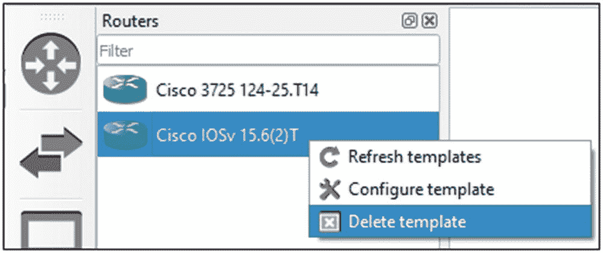

图 12-18。

GNS3，删除 CML-个人 L3 模板

现在，为 CML L3 路由器映像添加一个新模板，并完成集成。

<colgroup><col class="tcol1 align-left"> <col class="tcol2 align-center"></colgroup> 
| 

#

 | 

工作

 |
| --- | --- |
| **1** | In the GNS3 main window , go to File and click “+ New template.” See Figure 12-19.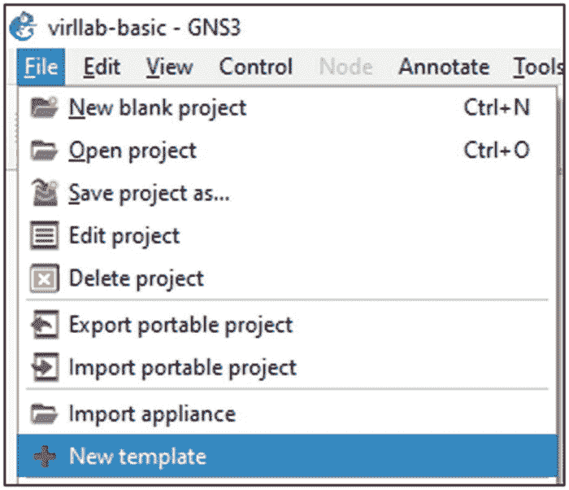图 12-19。CML L3 路由器安装，添加新模板 |
| **2** | When the “New template ” wizard opens, leave the default selection of “Install an appliance from the GNS3 server (recommended)” and click Next. See Figure 12-20.图 12-20。CML L3 路由器安装，新模板 |
| **3** | In the “Appliances from server ” window, type **IOSv** in the search field to locate Cisco IOSv Qemu under Switches. Select the searched device and click Install. This is the template for the Cisco CML-PERSONAL L3 router on GNS3\. See Figure 12-21.图 12-21。CML L3 路由器安装，来自服务器的设备 |
| **4** | In the next window , click Next. See Figure 12-22.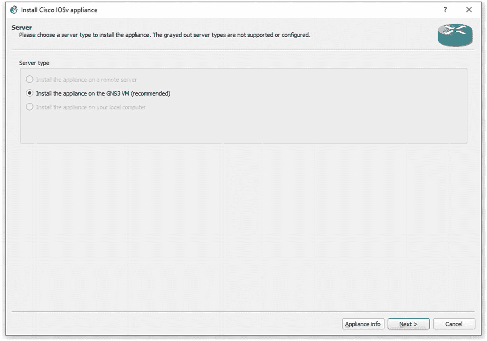图 12-22。CML L3 路由器安装，服务器选择 |
| **5** | On the “Qemu settings” screen , click Next again. See Figure 12-23.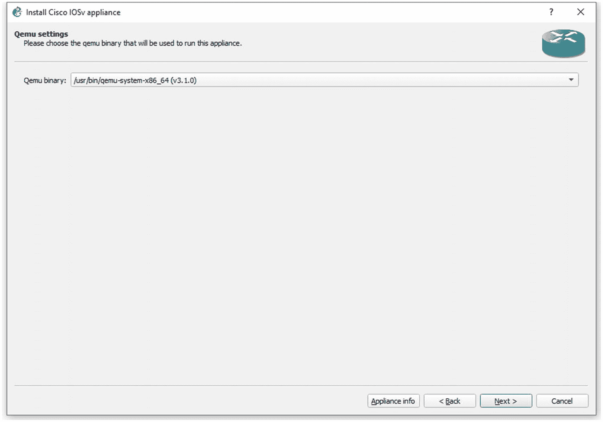图 12-23。CML L3 路由器安装，Qemu 设置 |
| **6** | It is recommended that you click the actual vIOS name under “Required files” and highlight it before clicking Next. Notice that the actual image name `vios-adventerprisek9-m.vmdk.SPA.156-2.T` is selected before clicking the Next button . See Figure 12-24.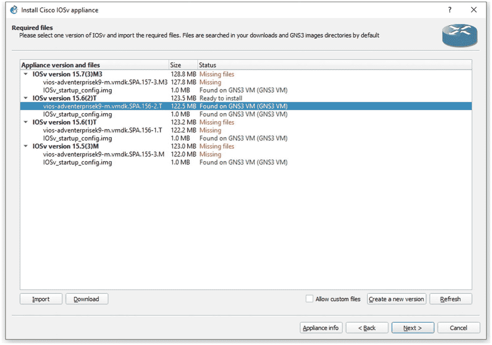图 12-24。CML L3 路由器安装，所需文件 |
| **7** | When the Appliance window pops up , click Yes. See Figure 12-25.图 12-25。CML L3 路由器安装，设备安装弹出窗口 |
| **8** | In the Usage window , click Finish. See Figure 12-26.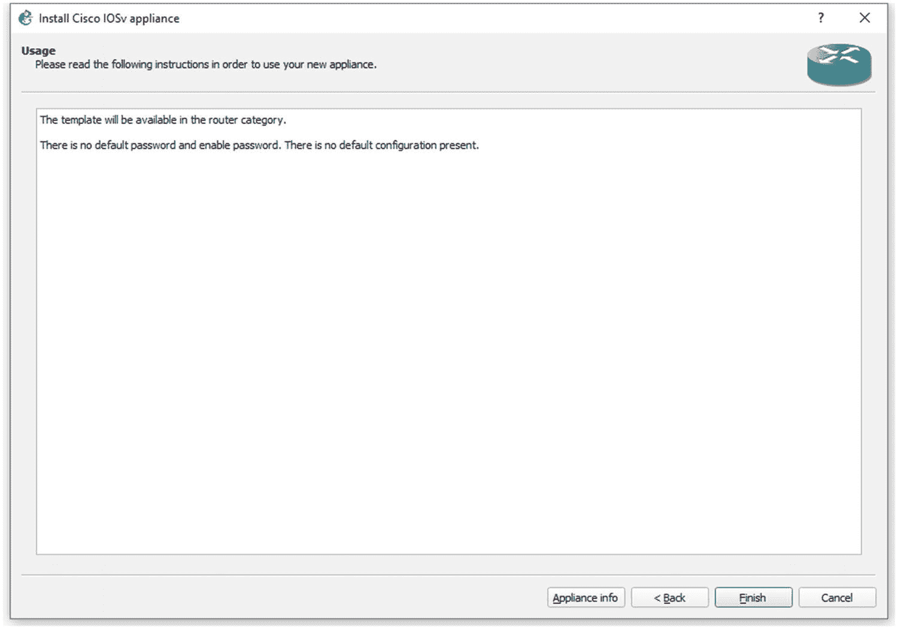图 12-26。CML L3 路由器的安装、使用 |
| **9** | When the “Add template ” message appears, click OK to complete the CML-PERSONAL L3 router image installation. See Figure 12-27.图 12-27。CML L3 路由器安装，弹出“添加模板” |
| **10** | Go back to the main user window , and this time click the Router icon that looks like a circle with four arrows. See Figure 12-28.图 12-28。CML L3 路由器安装，单击 GNS3 上的路由器图标 |
| **11** | The Routers list appears as shown in Figure 12-29, and you will immediately notice that a new IOSv router has been added.图 12-29。CML L3 路由器安装，选择 CML 路由器 |
| **12** | Now drag and drop the new router onto the Topology canvas of the `cmllab-basic` project. Rename the router as LAB-R1\. See Figure 12-30.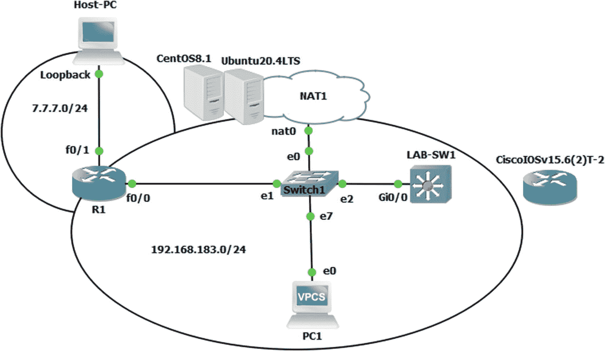图 12-30。CML L3 路由器安装，拖放 CML 路由器 |
| **13** | 重命名新路由器后，使用添加链路(连接器)工具，将 R1 实验室的 Gi0/0 接口连接到实验室 SW1 的 Gi0/1 接口。您可以在另一台设备打开时建立连接。现在打开 R1 实验室的电源，打开控制台窗口。见图 12-31 。 |
|   | The Topology Summary window shows the virtual connection between devices (see Figure 12-32).The Servers Summary window shows where each device is hosted (see Figure 12-33).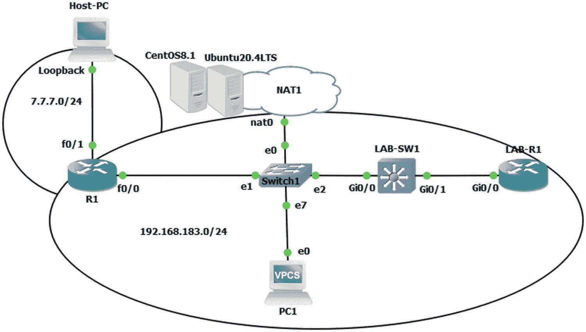图 12-31。CML L3 路由器安装、连接和启动 CML 路由器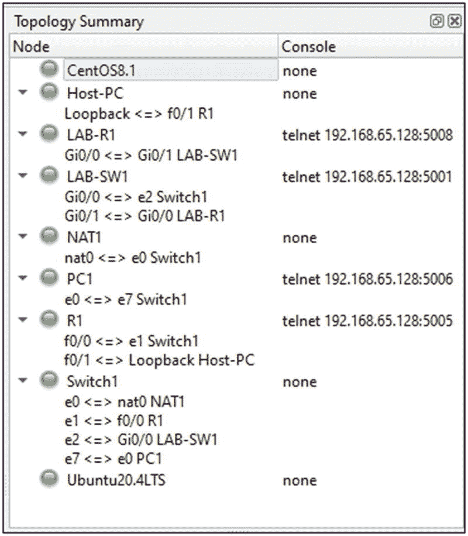图 12-32。拓扑摘要窗口图 12-33。服务器摘要窗口 |
| **14** | When the router boots up, it will display the vIOS version during the bootup. See Figure 12-34.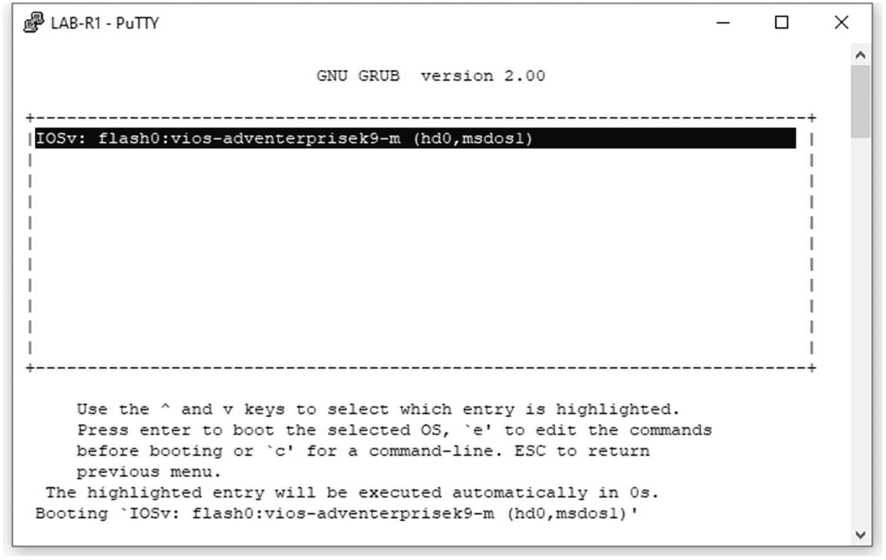图 12-34。CML L3 路由器安装，开机 CML 路由器屏幕 |
| **15** | 如果您看到类似图 12-35 的控制台屏幕，这意味着您已经在 GNS3 上完成了 CML-PERSONAL L3 路由器。CML-PERSONAL 与 Cisco IOS 15.x 几乎完全相同。现在，您可以使用较新的 IOS 映像进行一些路由实验了。 |
|   | `Cisco IOS Software, IOSv Software (VIOS-ADVENTERPRISEK9-M), Version 15.6(2)T, RELEASE SOFTWARE (fc2)` |
|   | `Technical Support: http://www.cisco.com/techsupport` |
|   | `Copyright (c) 1986-2016 by Cisco Systems, Inc.` |
|   | `Compiled Tue 22-Mar-16 16:19 by prod_rel_team` |
|   | `*Jan  9 11:12:35.500: %CRYPTO-6-ISAKMP_ON_OFF: ISAKMP is OFF` |
|   | `*Jan  9 11:12:35.501: %CRYPTO-6-GDOI_ON_OFF: GDOI is OFF` |
|   | `*Jan  9 11:12:37.708: %SYS-3-CPUHOG: Task is running for (1999)msecs, more than (2000)msecs (0/0),process = Crypto CA.` |
|   | `**************************************************************************` |
|   | `* IOSv is strictly limited to use for evaluation, demonstration and IOS  *` |
|   | `* education. IOSv is provided as-is and is not supported by Cisco's      *` |
|   | `* Technical Advisory Center. Any use or disclosure, in whole or in part, *` |
|   | `* of the IOSv Software or Documentation to any third party for any       *` |
|   | `* purposes is expressly prohibited except as otherwise authorized by     *` |
|   | `* Cisco in writing` `.                                                      *` |
|   | `**************************************************************************` |
|   | `Router#` |

### GNS3 上集成 CML L3 路由器的快速通信测试

完成以下任务，让新安装的路由器能够与拓扑中的其余设备通信:

<colgroup><col class="tcol1 align-left"> <col class="tcol2 align-left"></colgroup> 
| 

#

 | 

工作

 |
| --- | --- |
| **1** | 快速登录新路由器并配置正确的路由器名称。此外，从与 VMnet8 (192.168.183.0/24)相同的子网配置一个有效的 IP 地址，以便与 gibbit Ethernet 0/0 接口。请注意，您的子网可能不同。确保发出`no shut`命令调出界面。 |
|   | `Router#``configure termina`T2】 |
|   | `Router(config)#``hostname`T2】 |
|   | `LAB-R1(config)#``interface GigabitEthernet 0/0`T2】 |
|   | `LAB-R1(config-if)#``ip add 192.168.183.10 255.255.255.0`T2】 |
|   | `LAB-R1(config-if)#``no shut`T2】 |
|   | `LAB-R1(config-if)#``end`T2】 |
| **2** | 在 R1 实验室路由器上，一旦 Gi0/0 接口出现，就开始向以下 IP 地址发送 ICMP 数据包，以确保 R1 实验室能够与拓扑中的所有其它设备通信。VMnet8 的默认网关 IP (192.168.183.2)、PC1 的 IP 地址(192.168.183.129)、R1 的 f0/0 (192.168.183.133)、`centos8s1`服务器(192.168.183.130)和`ubuntu20s1`服务器(192.168.183.132)。 |
|   | `LAB-R1#``ping 192.168.183.2`T2】 |
|   | `Type escape sequence to abort.` |
|   | `Sending 5, 100-byte ICMP Echos to 192.168.183.2, timeout is 2 seconds:` |
|   | `.!!!!` |
|   | `Success rate is 80 percent (4/5), round-trip min/avg/max = 8/10/11 ms` |
|   | `LAB-R1#``ping 192.168.183.129`T2】 |
|   | `Type escape sequence to abort.` |
|   | `Sending 5, 100-byte ICMP Echos to 192.168.183.129, timeout is 2 seconds:` |
|   | `.!!!!` |
|   | `Success rate is 80 percent (4/5), round-trip min/avg/max = 7/9/12 ms` |
|   | `LAB-R1#``ping 192.168.183.133`T2】 |
|   | `Type escape sequence to abort.` |
|   | `Sending 5, 100-byte ICMP Echos to 192.168.183.133, timeout is 2 seconds:` |
|   | `.!!!!` |
|   | `Success rate is 80 percent (4/5), round-trip min/avg/max = 12/15/18 ms` |
|   | `LAB-R1#``ping 192.168.183.130`T2】 |
|   | `Type escape sequence to abort.` |
|   | `Sending 5, 100-byte ICMP Echos to 192.168.183.130, timeout is 2 seconds:` |
|   | `.!!!!` |
|   | `Success rate is 80 percent (4/5), round-trip min/avg/max = 8/8/11 ms` |
|   | `LAB-R1#``ping 192.168.183.132`T2】 |
|   | `Type escape sequence to abort.` |
|   | `Sending 5, 100-byte ICMP Echos to 192.168.183.132, timeout is 2 seconds:` |
|   | `.!!!!` |
|   | `Success rate is 80 percent (4/5), round-trip min/avg/max = 8/9/10 ms` |
| **3** | 仅出于验证目的，我们还可以使用`ssh –l username server_IP`命令快速测试从 R1 实验室登录 CentOS8.1 服务器的 SSH 登录。 |
|   | `LAB-R1#``ssh -l pynetauto 192.168.183.130`T2】 |
|   | `Password:` |
|   | `Activate the web console with: systemctl enable --now cockpit.socket` |
|   | `Last login: Sat Jan  9 00:00:39 2021 from 192.168.183.1` |
|   | `[pynetauto@centos8s1 ~]$` `exit` |
|   | `logout` |
|   | `[Connection to 192.168.183.130 closed by foreign host]` |
|   | `LAB-R1#` |
|   | 请注意，由于安全算法不匹配，SSH 无法登录到`ubuntu20s1`服务器。SSH 登录会话将从服务器端启动到网络设备，在这个阶段您不必担心这个问题。 |
| **4** | 完成通信测试后，将 R1 实验室的运行配置保存到启动配置中。 |
|   | `LAB-R1#` `copy running-config startup-config` |
|   | `Destination filename [startup-config]?` |
|   | `Building configuration...` |
|   | `[OK]` |

## 构建 CML 个人实验室拓扑

在进入下一章的实际实验任务之前，让我们向`cmllab-basic` GNS3 项目添加一些设备，并完成我们的拓扑。此步骤假设您从上一步开始继续构建拓扑。

<colgroup><col class="tcol1 align-left"> <col class="tcol2 align-left"></colgroup> 
| 

#

 | 

工作

 |
| --- | --- |
| **1** | Continuing from the previous section, add one more IOSvL2 switch and one more IOSv router to the topology as shown in Figure 12-35. Rename the switch to `lab-sw2` in lowercase and the router to `lab-r2` also in lowercase. The device names are not capitalized and standardized on purpose here, although it is a best practice to follow a strict naming convention for your network devices. In production, this convention is not followed by every engineer and becomes an annoyance. Hence, to emulate the imperfect production environment, we will not follow a strict device naming convention. Connect Gi0/0 of `lab-sw2` to Gi0/2 of LAB-SW1 and Gi0/1 of `lab-sw2` to Gi0/1 of lab-r2\. Also, connect Gi0/0 of lab-r2 to Gi0/1 of LAB-R1.图 12-35。配置 CML 实验室拓扑，三种方法之一 |
| **2** | Now power on lab-sw2 and lab-r2 as shown in Figure 12-36.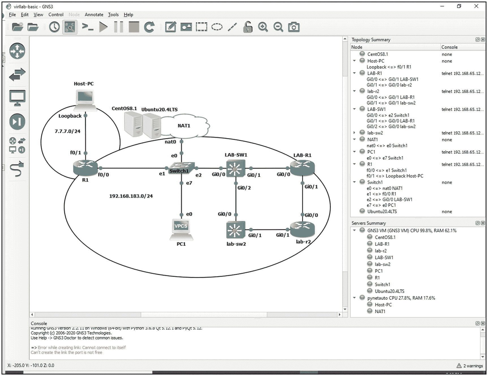图 12-36。配置 CML 实验室拓扑，三个中的两个 |
| **3** | 在这一阶段，包括`centos8s1` IP 服务服务器和`ubuntu20s1` Python 服务器在内的所有设备都应该通电并平稳运行。在 GNS3 网络和 Linux 服务器之间执行 ping 测试，以确保所有设备都可以连接到 VMnet8 网络上的其他设备。 |
| **4** | 以下是 R1 IOS 路由器的配置: |
|   | 首先，在 R1 (IOS 路由器)上，让我们打开控制台手动分配 IP 地址，这样它的 IP 地址就不会在每次 DHCP 租用时间过去时发生变化。 |
|   | `R1#``show ip interface brief`T2】 |
|   | `Interface                  IP-Address      OK? Method Status                Protocol` |
|   | `FastEthernet0/0            192.168.183.133 YES DHCP   up                    up` |
|   | `FastEthernet0/1            7.7.7.2         YES NVRAM  up                    up` |
|   | `FastEthernet1/0            unassigned      YES NVRAM  administratively down down` |
|   | `R1#configure terminal` |
|   | `Enter configuration commands, one per line.  End with CNTL/Z.` |
|   | `R1(config)#``interface FastEthernet0/0`T2】 |
|   | `R1(config-if)#``no ip address dhcp`T2】 |
|   | `R1(config-if)#``ip address 192.168.183.133 255.255.255.0`T2】 |
|   | `R1(config-if)#``speed 100`T2】 |
|   | `R1(config-if)#``duplex full`T2】 |
|   | `R1(config-if)#``exit`T2】 |
|   | `R1(config)#``ip domain-lookup`T2】 |
|   | `R1(config)#``ip name-server 192.168.183.2`T2】 |
|   | `R1(config)#``ip route`T2】 |
|   | `R1(config)#``router ospf 1`T2】 |
|   | `R1(config-router)#``network 0.0.0.0 255.255.255.255 area 0`T2】 |
|   | `R1(config-router)#``end`T2】 |
|   | `R1#``write memory`T2】 |
|   | 保存配置后，对默认网关(192.168.183.2)和网络上的任何其它设备执行快速 ping 测试。他们应该都可以从 R1 联系到。 |
| **5** | 以下是 LAB-SW1 的配置: |
|   | 现在打开 LAB-SW1 控制台，重新配置第一台 CML-PERSONAL 交换机。该交换机已经手动配置了 VLAN 1 接口，因此无需重新配置 IP 地址。由于交换机将用作 L2 设备，因此无需配置 DNS 或静态路由。 |
|   | `LAB-SW1#` `show ip interface brief &#124; be Vlan1` |
|   | `Vlan1                  192.168.183.101 YES NVRAM  up                    up` |
|   | `Use the following configuration to complete the LAB-SW1 configuration.` |
|   | `LAB-SW1#``configure terminal`T2】 |
|   | `LAB-SW1(config)#``enable password cisco123`T2】 |
|   | `LAB-SW1(config)#``username pynetauto privilege 15 password cisco123`T2】 |
|   | `LAB-SW1(config)#``line vty 0 15`T2】 |
|   | `LAB-SW1(config-line)#``login local`T2】 |
|   | `LAB-SW1(config-line)#``transport input all`T2】 |
|   | `LAB-SW1(config-line)#``logging synchronous`T2】 |
|   | `LAB-SW1(config-line)#``no exec-timeout`T2】 |
|   | `LAB-SW1(config-line)#``line console 0`T2】 |
|   | `LAB-SW1(config-line)#``logging synchronous`T2】 |
|   | `LAB-SW1(config-line)#``no exec-timeout`T2】 |
|   | `LAB-SW1(config-line)#``end`T2】 |
|   | `LAB-SW1#copy running-config startup-config  # Save running-config to startup-config` |
|   | `Destination filename [startup-config]?` |
|   | `Building configuration...` |
|   | `[OK]` |
| **6** | 以下是 lab-sw2 的配置: |
|   | 让我们对新添加的交换机应用类似的配置，`lab-sw2.`该交换机也将被配置为第 2 层交换机，因此不需要启用 IP 路由或配置 DNS。由于该配置与之前的 LAB-SW2 配置几乎相同，因此不再对其进行解释。 |
|   | `Switch>en` |
|   | `Switch#` `conf t` |
|   | `Switch(config)#` `hostname lab-sw2` |
|   | `lab-sw2(config)#` `interface vlan 1` |
|   | `lab-sw2(config-if)#` `ip add 196.168.183.102 255.255.255.0` |
|   | `lab-sw2(config-if)#` `no shut` |
|   | `lab-sw2(config-if)#` `enable password cisco123` |
|   | `lab-sw2(config)#` `username pynetauto pri 15 pass cisco123` |
|   | `lab-sw2(config)#` `line vty 0 15` |
|   | `lab-sw2(config-line)#` `login local` |
|   | `lab-sw2(config-line)#` `transport input all` |
|   | `lab-sw2(config-line)#` `logging synchronous` |
|   | `lab-sw2(config-line)#` `no exec-timeout` |
|   | `lab-sw2(config-line)#` `line console 0` |
|   | `lab-sw2(config-line)#` `logging synchronous` |
|   | `lab-sw2(config-line)#` `no exec-timeout` |
|   | `lab-sw2(config-line)#` `end` |
|   | `lab-sw2#copy running-config startup-config` |
|   | `Destination filename [startup-config]?` |
|   | `Building configuration...` |
|   | `[OK]` |
| **7** | 这是 R1 实验室的配置: |
|   | 接下来，打开 R1 实验室的控制台，分配一个 DNS 服务器，然后添加一个静态路由，以便在我们的实验室拓扑上实现顺畅的通信。R1 实验室的 Gi0/0 已经被手动配置了 IP 地址 192.168.183.10/24，所以没有必要配置它。配置第一台 CML 个人路由器，如下所示: |
|   | `To configure LAB-R1, use the following configuration:` |
|   | `LAB-R1#``configure terminal`T2】 |
|   | `LAB-R1(config)#``interface GigabitEthernet 0/1`T2】 |
|   | `LAB-R1(config-if)#``ip address 172.168.1.1 255.255.255.0`T2】 |
|   | `LAB-R1(config-if)#``no shut`T2】 |
|   | `LAB-R1(config-if)#``exit`T2】 |
|   | `LAB-R1(config)#``ip domain-lookup`T2】 |
|   | `LAB-R1(config)#``ip name-server 192.168.183.2`T2】 |
|   | `LAB-R1(config)#``ip route 0.0.0.0 0.0.0.0 192.168.183.2`T2】 |
|   | `LAB-R1(config)#``enable password cisco123`T2】 |
|   | `LAB-R1(config)#``username pynetauto privilege 15 password cisco123`T2】 |
|   | `LAB-R1(config)#``line vty 0 15`T2】 |
|   | `LAB-R1(config-line)#``login local`T2】 |
|   | `LAB-R1(config-line)#``transport input all`T2】 |
|   | `LAB-R1(config-line)#``logging synchronous`T2】 |
|   | `LAB-R1(config-line)#``no exec-timeout`T2】 |
|   | `LAB-R1(config-line)#``line console 0`T2】 |
|   | `LAB-R1(config-line)#``logging synchronous`T2】 |
|   | `LAB-R1(config-line)#``no exec-timeout`T2】 |
|   | `LAB-R1(config-line)#``end`T2】 |
|   | `LAB-R1#``copy running-config startup-config`T2】 |
|   | `Destination filename [startup-config]?` |
|   | `Building configuration...` |
|   | `[OK]` |
| **8** | 以下是 lab-r2 的配置: |
|   | 使用以下配置建议配置第二台 CML-PERSONAL L3 路由器。基本配置与 R1 实验室的配置几乎相同，因此不再逐行解释。 |
|   | `Router#` `conf t` |
|   | `Router(config)#` `hostname lab-r2` |
|   | `lab-r2(config-if)#` `interface GigabitEthernet 0/0` |
|   | `lab-r2(config-if)#` `ip address 172.168.1.2 255.255.255.0` |
|   | `lab-r2(config)#` `interface GigabitEthernet 0/1` |
|   | `lab-r2(config-if)#` `ip add 192.168.183.20 255.255.255.0` |
|   | `lab-r2(config-if)#` `no shut` |
|   | `lab-r2(config-if)#` `exit` |
|   | `lab-r2(config)#` `ip domain-lookup` |
|   | `lab-r2(config)#` `ip name-server 192.168.183.2` |
|   | `lab-r2(config)#` `ip route 0.0.0.0 0.0.0.0 192.168.183.2` |
|   | `lab-r2(config)#` `enable password cisco123` |
|   | `lab-r2(config)#` `username pynetauto pri  15 password cisco123` |
|   | `lab-r2(config)#` `line vty 0 15` |
|   | `lab-r2(config-line)#` `login local` |
|   | `lab-r2(config-line)#` `transport input all` |
|   | `lab-r2(config-line)#` `logging synchronous` |
|   | `lab-r2(config-line)#` `no exec-timeout` |
|   | `lab-r2(config-line)#` `line console 0` |
|   | `lab-r2(config-line)#` `logging synchronous` |
|   | `lab-r2(config-line)#` `no exec-timeout` |
|   | `lab-r2(config-line)#` `end` |
|   | `lab-r2#` `copy running-config startup-config` |
|   | `Destination filename [startup-config]?` |
|   | `Building configuration...` |
|   | `[OK]` |
| **9** | One of the background shapes has been changed from an oval to a rectangle to make the lab look better, and the topology has been decorated with IP addresses to make the lab steps clear. Take time to decorate your topology to help you with the IP addressing for the coming labs. See Figure 12-37, Figure 12-38, and Figure 12-39.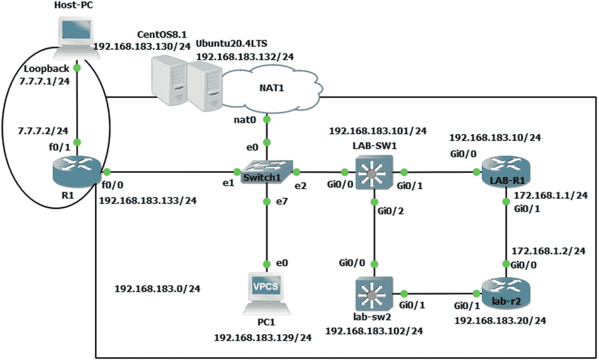图 12-37。配置 CML 实验室拓扑，三选三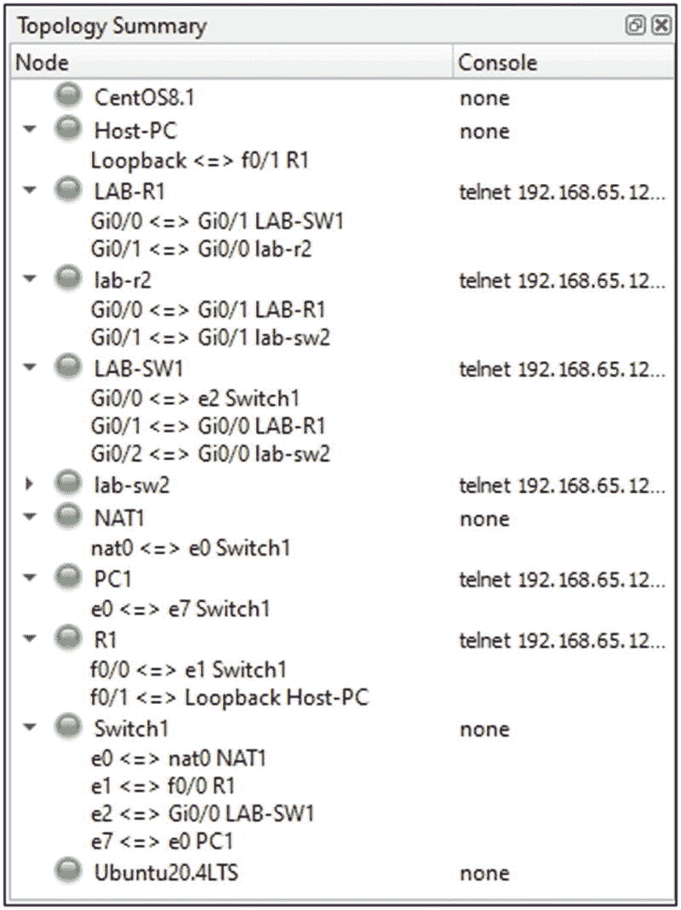图 12-38。拓扑摘要窗口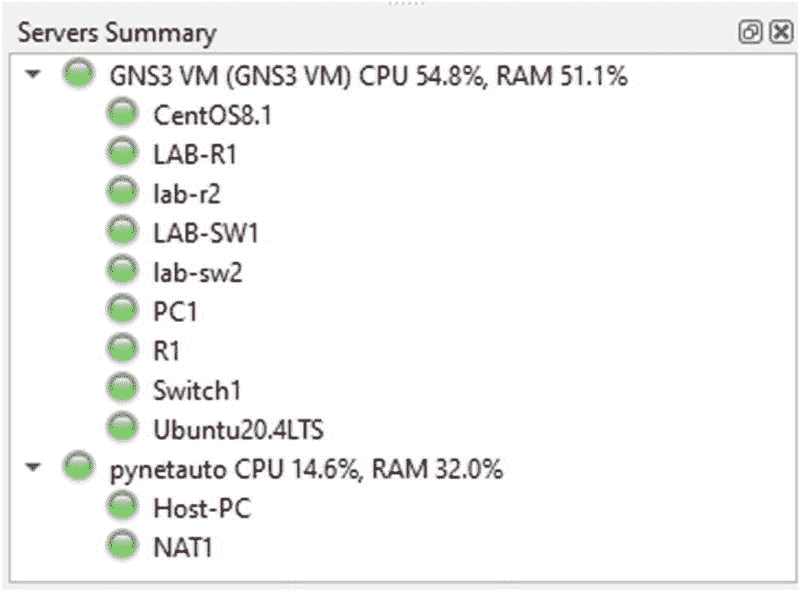图 12-39。服务器摘要窗口 |
| **10** | 现在，SSH 进入`ubutun20s1`或`centos8s1`服务器，向我们拓扑中的每个网络设备发送一些 ICMP 数据包。尝试使用`ping`命令发送一些 ICMP 消息。下面列出了用于 ping 和检查连通性的 IP 地址。如果您使用不同的子网，您的网络 IP 地址可能会不同。 |
|   | `lab-r2 Gi0/1`

<colgroup><col class="tcol1 align-left"><col class="tcol2 align-left"></colgroup>

 |
|   | `[pynetauto@centos8s1 ~]$` `ping 192.168.183.133 -c 2` |
|   | `PING 192.168.183.133 (192.168.183.133) 56(84) bytes of data.` |
|   | `64 bytes from 192.168.183.133: icmp_seq=1 ttl=255 time=7.76 ms` |
|   | `64 bytes from 192.168.183.133: icmp_seq=2 ttl=255 time=4.56 ms` |
|   | `--- 192.168.183.133 ping statistics ---` |
|   | `2 packets transmitted, 2 received, 0% packet loss, time 3ms` |
|   | `rtt min/avg/max/mdev = 4.556/6.158/7.761/1.604 ms` |
|   | `[pynetauto@centos8s1 ~]$` `ping 192.168.183.129 -c 2` |
|   | `PING 192.168.183.129 (192.168.183.129) 56(84) bytes of data.` |
|   | `64 bytes from 192.168.183.129: icmp_seq=1 ttl=255 time=31.8 ms` |
|   | `64 bytes from 192.168.183.129: icmp_seq=2 ttl=255 time=19.6 ms` |
|   | `--- 192.168.183.129 ping statistics ---` |
|   | `2 packets transmitted, 2 received, 0% packet loss, time 3ms` |
|   | `rtt min/avg/max/mdev = 19.562/25.669/31.776/6.107 ms` |
|   | `[pynetauto@centos8s1 ~]$` `ping 192.168.183.101 -c 2` |
|   | `PING 192.168.183.101 (192.168.183.101) 56(84) bytes of data.` |
|   | `64 bytes from 192.168.183.101: icmp_seq=1 ttl=255 time=25.0 ms` |
|   | `64 bytes from 192.168.183.101: icmp_seq=2 ttl=255 time=24.1 ms` |
|   | `--- 192.168.183.101 ping statistics ---` |
|   | `2 packets transmitted, 2 received, 0% packet loss, time 2ms` |
|   | `rtt min/avg/max/mdev = 24.056/24.547/25.038/0.491 ms` |
|   | `[pynetauto@centos8s1 ~]$` `ping 192.168.183.102 -c 2` |
|   | `PING 192.168.183.102 (192.168.183.102) 56(84) bytes of data.` |
|   | `64 bytes from 192.168.183.102: icmp_seq=1 ttl=255 time=35.5 ms` |
|   | `64 bytes from 192.168.183.102: icmp_seq=2 ttl=255 time=33.0 ms` |
|   | `64 bytes from 192.168.183.20: icmp_seq=1 ttl=255 time=184 ms` |
|   | `64 bytes from 192.168.183.20: icmp_seq=2 ttl=255 time=46.10 ms` |
|   | `--- 192.168.183.102 ping statistics ---` |
|   | `2 packets transmitted, 2 received, 0% packet loss, time 3ms` |
|   | `rtt min/avg/max/mdev = 33.049/34.295/35.542/1.260 ms` |
|   | `[pynetauto@centos8s1 ~]$` `ping 192.168.183.10 -c 2` |
|   | `PING 192.168.183.10 (192.168.183.10) 56(84) bytes of data.` |
|   | `64 bytes from 192.168.183.10: icmp_seq=1 ttl=255 time=37.8 ms` |
|   | `64 bytes from 192.168.183.10: icmp_seq=2 ttl=255 time=20.1 ms` |
|   | `--- 192.168.183.10 ping statistics ---` |
|   | `2 packets transmitted, 2 received, 0% packet loss, time 3ms` |
|   | `rtt min/avg/max/mdev = 20.081/28.936/37.792/8.857 ms` |
|   | `[pynetauto@centos8s1 ~]$` `ping 192.168.183.20 -c 2` |
|   | `PING 192.168.183.20 (192.168.183.20) 56(84) bytes of data.` |
|   | `64 bytes from 192.168.183.20: icmp_seq=1 ttl=255 time=184 ms` |
|   | `64 bytes from 192.168.183.20: icmp_seq=2 ttl=255 time=46.10 ms` |
|   | `--- 192.168.183.20 ping statistics ---` |
|   | `2 packets transmitted, 2 received, 0% packet loss, time 3ms` |
|   | `rtt min/avg/max/mdev = 46.992/115.296/183.601/68.305 ms` |

现在，您已经完成了 CML L3 路由器映像的集成以及 Python 服务器和拓扑中其他网络设备之间的通信测试。

## 摘要

本章向您介绍了 Cisco CML 与 GNS3 的集成。您下载了 CML L2 和 L3 映像并将其与 GNS3 集成；然后，您构建了一个基本的 CML 实验室拓扑，并对其进行了快速测试。然后，您确认了 Python automation server 与`cmllab-basic`拓扑中所有路由器和交换机之间的网络连接。您已经完成了 CML 实验准备，现在可以开始编写一些 Python 代码到 Telnet 或 SSH，并在 GNS3 上使用 Cisco 虚拟路由器和交换机。

在第十三章中，您将从 Python Telnet 库开始学习如何从 Python Linux 服务器控制网络设备。