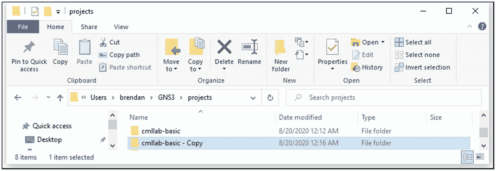
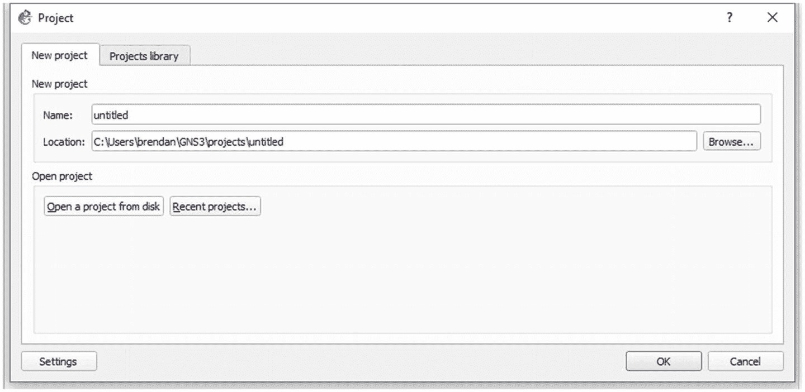
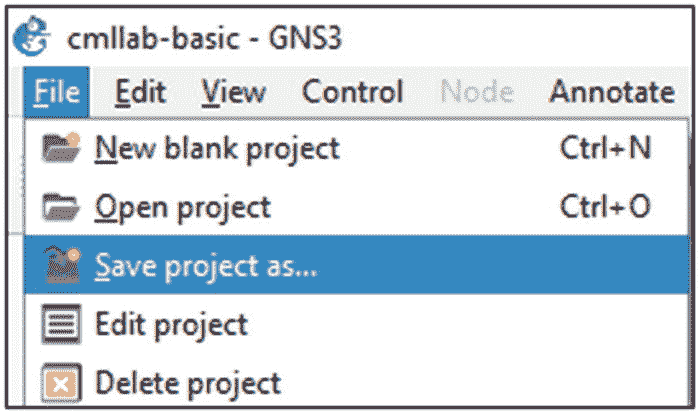
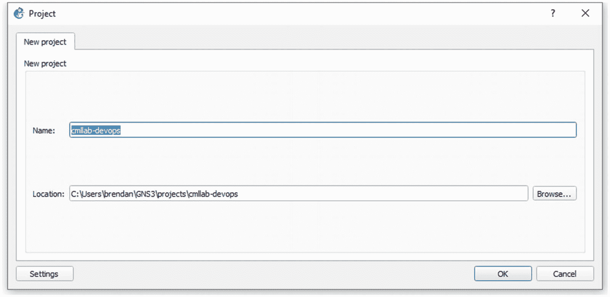
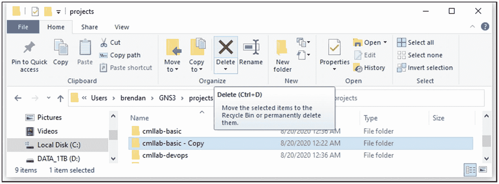
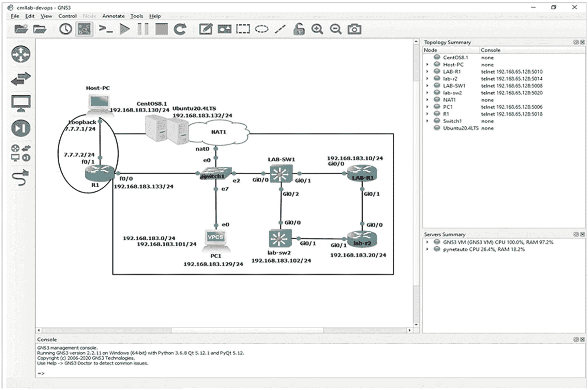
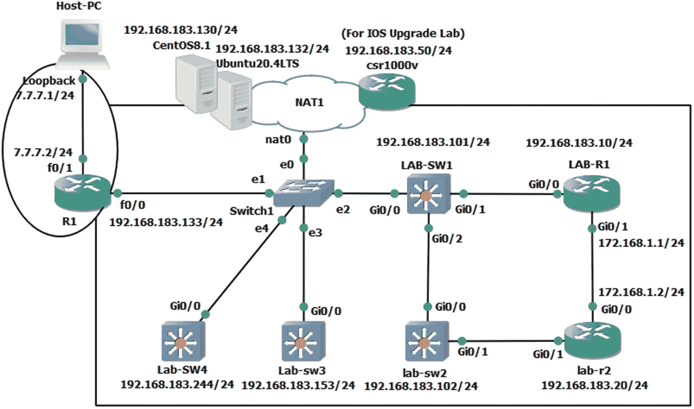
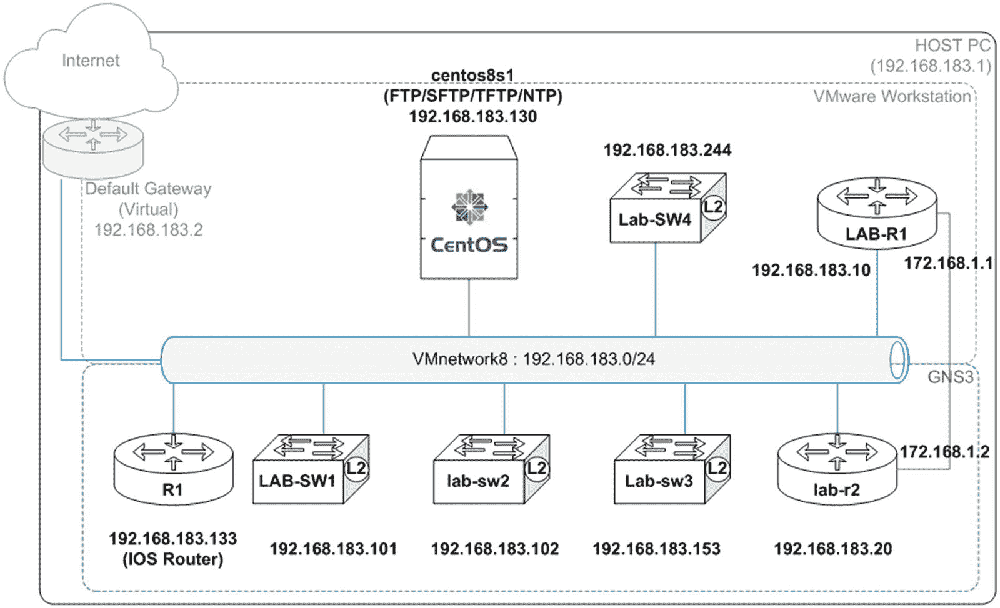
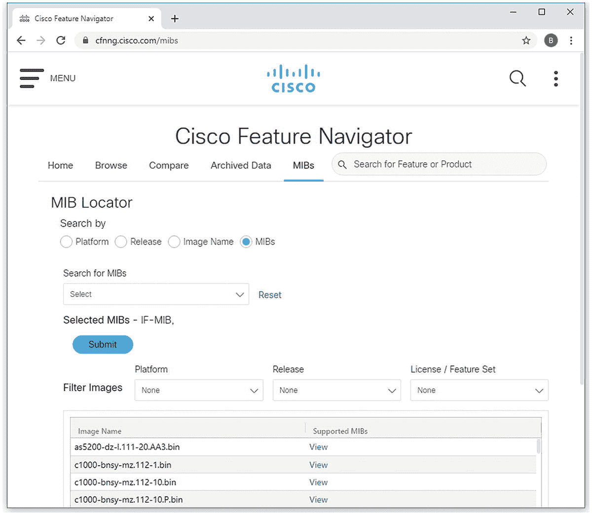

# 十五、Python 网络自动化实验室：`cron`和 SNMPv3

最终，您希望学习 Python，这样您就可以编写代码来自动化工作中的日常任务。在编写代码和开发脚本化应用之后，您可能希望在没有人在场的情况下运行脚本。在 Windows 系统上有 Windows 任务调度器，在 Linux 上，你需要`cron`来帮助你安排你的脚本在凌晨 2 点运行，或者定期运行，直到你告诉你的 Linux 系统停止。一旦熟悉 Python 和 Linux，您就可以编写脚本并安排脚本自动运行。您可能还想进一步了解 Python 如何与 SNMP 一起工作，以便您的公司可以考虑使用内部脚本进行 SNMP 监控；您可能想了解 Python 通常如何与 SNMP 交互。本章结束时，您将能够克隆 GNS3 项目，使用`cron`在 Linux 上调度任务，并使用 SNMPv3 与路由器和交换机交互。在这个过程中，我们将借用 Python 社区成员公开共享的代码，用 Python 探索 SNMPv3，了解它能为我们做什么。本章旨在让您更多地接触不同的场景，同时将 Python 实际应用于网络自动化场景。


## Cron 和 SNMPv3 实验室

你已经学完了这本书的前 14 章。您可以为特定的网络任务编写简单而实用的 Python 脚本。您将很快意识到，您需要找到一种方法，在没有实际用户交互或用户干预的情况下运行您的脚本化应用，可能需要使用任务调度程序。您可能意识到，您可能能够利用 Python 自动化的力量，并将其应用于更传统的网络概念，如 SNMP 监控；可能性是无限的。首先，在为下一章做准备时，您将学习如何制作 GNS3 项目的真实克隆。

## 为下一个实验克隆 GNS3 项目

为了准备我们的实验，你将从第十四章中复制一个 GNS3 项目。GNS3 项目导出克隆方法帮助我们制作了一个新项目，但它破坏了原始实验室的配置文件，因此从这个意义上说，它不是 GNS3 项目的真正克隆。有时，这可能不是您想要的实验室结果。您可能希望保持原始文件的完整性，并创建一个旧 GNS3 项目的真实克隆。使用克隆的项目导出方法，原始实验室变得不可用，因为 Dynamips 文件也会随着新项目的创建而导出。创建新项目而不影响原始项目的更好方法是制作原始项目文件夹的真实副本，然后用另一个名称重新导入它。您希望将`cmllab-basic`项目作为一个完整的工作项目，但同时，您不希望从头开始创建一个新的 GNS3 项目。让我们了解一下如何实现这一目标。

<colgroup><col class="tcol1 align-left"> <col class="tcol2 align-center"></colgroup> 
| 

#

 | 

工作

 |
| --- | --- |
| **1** | 如果您仍在使用`cmllab-basic`项目，首先使用`copy running-config startup-config`命令保存所有 Cisco 设备的运行配置。保存三台路由器和两台交换机的配置后，正常关闭所有设备的电源。 |
| **2** | Once all routers and switches are powered off, exit GNS3 so both GNS3 and GNS3 VM are closed completely. See Figure 15-1.图 15-1。CML lab-基本 GNS3 项目，退出 GNS3 和 GNS3 虚拟机 |
| **3** | Go to the `C:\Users\brendan\GNS3\projects` folder and make a copy of the `cmllab-basic` folder so it looks like Figure 15-2.图 15-2。GNS3 项目，制作现有项目文件夹的副本 |
| **4** | Go to the desktop of your Windows host PC and double-click the GNS3 icon on the desktop . Wait until both GNS3 and GNS3 VM become fully operational. See Figure 15-3.图 15-3。GNS3 开始桌面图标 |
| **5** | When the project window opens, select “Open a project from disk,” open the `C:\Users\brendan\GNS3\projects\cmllab-basic – Copy` folder, select the `cmllab-basic` GNS3 project file , and then click the Open button. See Figure 15-4.图 15-4。GNS3，选择“从磁盘打开项目” |
| **6** | Once the copy of the `cmllab-basic` project is fully launched, wait for the lab to open correctly and then select GNS3’s File ➤ Save project as . See Figure 15-5.图 15-5。GNS3，“项目另存为”菜单项 |
| **7** | Name your project and save the new project as `cmllab-devops` . See Figure 15-6.图 15-6。GNS3，另存为新项目 |
| **8** | Now, go back to the `C:\Users\brendan\GNS3\projects` folder, and you will find a new project folder called `cmllab-devops`. The temporary folder has served its purpose and has now become redundant; you can go ahead and delete the `cmllab-basic – Copy` folder permanently . See Figure 15-7.图 15-7。GNS3，删除冗余副本 |
| **9** | Open the `cmllab-devops` folder, and you will find your new GNS3 project file with the correct name. Now power up all devices and check their running configurations. You have successfully made a true clone of the last GNS3 project. See Figure 15-8.图 15-8。GNS3，完全克隆的 cmllab-devops 项目 |
| **10** | To prepare you for the next part of our exploration, you will now add two more switches , as shown in Figure 15-9. First, delete `PC1` (VPCS) and replace it with `Lab-sw3` with a random IP address of 192.168.183.153/24 and with `Lab-SW4` with a random IP address 192.168.183.244/24\. Power on new switches and let the CPU and memory settle down. Also shown is a Cisco CSR 1000v router to be installed on VMware for a later IOS upgrade lab; this icon is only a placeholder, so you do not have to worry about the `csr1000v` router until the next chapter.图 15-9。GNS3，添加两个新交换机 |
| **11** | 在配置新交换机时，从`LAB-R1`和`lab-r2` : `ping ip 192.168.183.153 repeat counter 10000" and "ping ip 192.168.183.244 repeat counter 10000`运行扩展 ping。让 ping 在后台连续运行。`LAB-R1#` `ping ip 192.168.183.153 repeat 10000``Type escape sequence to abort.``Sending 10000, 100-byte ICMP Echos to 192.168.183.153, timeout is 2 seconds:``.....................................................................................``lab-r2#` `ping ip 192.168.183.244 repeat 10000``Type escape sequence to abort.``Sending 10000, 100-byte ICMP Echos to 192.168.183.244, timeout is 2 seconds` `:``.........................................` |
| **12** | 交换机通电后，使用以下配置来配置两台交换机。确保在两台交换机上禁用 IP 路由，并配置最后一个网关。对于`LAB-sw3`，出站流量将通过`LAB-R1`，对于`Lab-SW4`，未知流量将首先通过`R1`。Lab-sw3 配置:`Switch>` `en``Switch#` `configure terminal``Switch(config)#` `hostname Lab-sw3``Lab- sw3 (config)#` `no ip routing``Lab-sw3(config)#``ip default-gateway 192.168.183.10`T2】`Lab- sw3 (config)#` `enable password cisco123``Lab-sw3(config)#` `username pynetauto privilege 15 secret cisco123``Lab-sw3(config)#` `line vty 0 15``Lab-sw3(config-line)#` `login local``Lab-sw3(config-line)#` `transport input all``Lab-sw3(config-line)#` `exit``Lab-sw3(config)#` `ip domain name pynetauto. local``Lab-sw3(config)#` `crypto key generate rsa !use 1024 bits``Lab-sw3(config)#` `interface vlan 1``Lab-sw3(config-if)#``description "Native interface"`T2】`Lab-sw3(config-if)#` `ip address 192.168.183.153 255.255.255.0``Lab-sw3(config-if)#` `no shut``Lab-sw3(config-if)#` `interface GigabitEthernet0/0``Lab-sw3(config-line)#``description`T2】`Lab-sw3(config-if)#` `end``Lab-sw3#` `copy running-config startup-config`Lab-SW4 配置:`Switch>` `en``Switch#` `configure terminal``Switch(config)#` `hostname Lab-SW4``Lab-SW4(config)#` `no ip routing``Lab-SW4(config)#``ip default-gateway 192.168.183.133`T2】`Lab-SW4(config)#` `enable password cisco123``Lab-SW4(config)#` `username pynetauto privilege 15 secret cisco123``Lab-SW4(config)#` `line vty 0 15``Lab-SW4(config-line)#` `login local``Lab-SW4(config-line)#` `transport input all``Lab-SW4(config-line)#` `exit``Lab-SW4(config)#` `ip domain name pynetauto. local``Lab-SW4(config)#``crypto key generate rsa`T2】`Lab-SW4(config)#` `interface vlan 1``Lab-SW4(config-if)#` `ip address 192.168.183.244 255.255.255.0``Lab-SW4(config-if)#` `no shut``Lab-SW4(config-if)#` `end``Lab-SW4#` `copy running-config startup-config` |
| **13** | 配置完成后，您将获得新交换机的 ping 响应。要停止并退出连续(扩展)ping(或 traceroute)请求，请使用 Ctrl+^或 Ctrl+Shift+6 键。`LAB-R1#` `ping ip 192.168.183.153 repeat 10000``Type escape sequence to abort.``Sending 10000, 100-byte ICMP Echos to 192.168.183.153, timeout is 2 seconds:``......................................................................``..........................................!!!!!!!!!!!!!!!!!!!!``Success rate is 85 percent (102/115), round-trip min/avg/max = 17/25/55 ms``lab-r1#` `ping ip 192.168.183.244 repeat 10000``Type escape sequence to abort` `.``Sending 10000, 100-byte ICMP Echos to 192.168.183.244, timeout is 2 seconds:``......................................................................``.... !!!!!!!!!!!!!!!!!!!!!!!!!!!!!!!!!!!!!!!``Success rate is 88 percent (102/115), round-trip min/avg/max = 12/21/44 ms` |
| 记住 Ctrl+Shift+6 键。如果您的路由器或交换机挂起或您想要中断操作，您可以使用此组合键退出操作。 |
| **14** | 为了确认来自新交换机的所有未知出站目的地分别通过`LAB-R1`和`R1`路由器路由，尝试在谷歌的公共 DNS、8.8.8.8 或 8.8.4.4 上使用`clear arp`和`traceroute`。 |
| 如果您在 ping Google DNS 时遇到问题，可能是您的互联网 DNS 有问题，或者您没有正确配置您的设备。另一种可能性是 Windows 的最新更新导致 GNS3 出现故障，并破坏了 GNS3 使用的环回接口。即使您无法 ping 通 DNS IP 地址，现在也不要管它，继续下一部分。 |
|   | `Lab-sw3#` `clear arp``Lab-sw3#` `traceroute 8.8.8.8``Type escape sequence to abort.``Tracing the route to 8.8.8.8``VRF info: (vrf in name/id, vrf out name/id)``1 192.168.183.10 36 msec 22 msec 16 msec``2 192.168.183.2 43 msec *  *``3  *  *  *``[omitted for brevity]``30  *  *  *``Lab-SW4#` `clear arp``Lab-SW4#` `traceroute 8.8.4.4``Type escape sequence to abort.``Tracing the route to 8.8.4.4``VRF info: (vrf in name/id, vrf out name/id)``1 192.168.183.133 1020 msec 41 msec 6 msec``2 192.168.183.2 38 msec *  *``3  *  *  *``[omitted for brevity]``30  *  *  *` |

如果您已经完成了前面的任务，那么您可以做更多的实验。上一任务结束时，您的拓扑中应该还有两台 IOSvL2 交换机。让我们登录您的 Linux 服务器，掌握如何使用 Linux 任务调度器，`cron`。

## 快速启动 Linux 调度程序 cron

在本书的前面，您已经了解了一些 Linux 基础知识，并且熟悉了如何构建一个 Linux 服务器来作为多个 IP 服务的服务器。随着您对 Linux 的了解，您将很快意识到，许多您在 Windows 操作系统上不能或不被允许做的事情突然在 Linux 系统上变得可能了。它允许您快速安装功能和服务，您的 IP 服务可以立即启动并运行。如果你是一个 Windows 的人，你会记得好老的 Windows 任务调度器；顾名思义，Windows 也有任务调度工具。

Linux 有等效的任务调度器，但是它被称为`cron`(没有 GUI)。`cron`相当于 Windows 的任务调度程序，但是它的操作更简单、更可靠、更灵活，因为它没有 GUI 的负担。Linux 的`cron`工具是 Linux 默认的任务调度工具。它可以执行 Linux 的本地命令，并设置 Python 脚本等应用以设定的时间间隔运行。熟练的 Linux 系统管理员在处理系统监控和备份任务时，会使用自动化的基于 shell 的脚本或其他编程语言做大量工作。为了帮助完成这项任务，Linux 中最常用的工具是`cron`工具，它的作用与 Windows 系统的 Windows 任务调度器相同。当你写完 Python 应用(脚本)后，你必须学会如何安排你的脚本在特定的时间和特定的周期运行重复的任务，所以掌握如何使用`cron`并正确运行安排好的任务是至关重要的。当然，如果你工作的公司有一个无底洞的 IT 预算，总有一个简单的方法，那就是购买一个开箱即用的任务调度程序，但是当他们已经雇佣了像你这样的聪明人，为什么你的公司要为这些免费和开源的工具付费呢？

在本节中，您将学习如何在 Ubuntu 和 CentOS 系统中使用`cron`安排任务。基本语法几乎相同，但是有足够的变化来区别对待它们。

### Ubuntu 20.04 LTS 任务调度:crontab

在 Ubuntu 20.04 服务器上，`cron`被称为`crontab`。您将编写一个问候 Python 应用，并使用它通过 Ubuntu 的`crontab`学习任务调度。你需要在你的 Ubuntu 虚拟服务器上完成这些任务。您在这里学到的安排简单脚本的方法也可以用于安排更复杂的脚本。在安排任务时，脚本的难度无关紧要；创建脚本计划相对简单。

<colgroup><col class="tcol1 align-left"> <col class="tcol2 align-left"></colgroup> 
| 

#

 | 

工作

 |
| --- | --- |
| **1** | 首先，创建一个新目录来放置您的脚本，编写用于`crontab`测试的三行 Python 代码，并将其保存为`print_hello_friend.py`。您可以在脚本中更改问候语。这里我们将从`datetime`库中导入`datatime`模块，并将`print (datetime.now())`语句放在打印`hello`之前。因为我来自澳大利亚，我最喜欢的问候是“G'day mate”`pynetauto@ubuntu20s1:~$` `mkdir my_cron``pynetauto@ubuntu20s1:~$` `cd my_cron``pynetauto@ubuntu20s1:~/my_cron$` `nano print_hello_friend.py``pynetauto@ubuntu20s1:~/my_cron$` `cat print_hello_friend.py``from datetime import datetime``print(datetime.now())``print("G'day Mate!")` |
| **2** | 接下来，运行一次代码，检查它是否打印出了时间和您的“hello”语句。`pynetauto@ubuntu20s1:~/my_cron$` `python3 print_hello_friend.py``2021-01-13 14:01:40.770547``G'day Mate!` |
| **3** | 现在您将使用`crontab`来调度这个 Python 代码的运行。在创建时间表之前，您将学习如何快速使用`crontab`。首先，您必须选择是以标准用户还是根用户的身份运行脚本。其次，决定是以不可执行文件模式运行 Python 代码，还是将其更改为可执行文件模式，然后运行它。您已经学习了如何在 Linux 服务器上将一个不可执行的文件转换成可执行文件。如果您已经决定以非根 Linux 用户的身份运行`crontab`，那么您必须执行带有前导`sudo`命令的`crontab -e`命令，这样您就可以输入`sudo crontab –e`。另一方面，如果您已经决定作为根用户运行`crontab`，您不需要附加`sudo`命令。a.非根用户 crontab 调度程序执行`pynetauto@ubuntu20s1:~/my_cron$` `sudo crontab -e`b.root 用户 crontab 调度程序执行`pynetauto@ubuntu20s1:~/my_cron$` `crontab -e` |
| **4** | 为了让`cron`正确执行您的脚本，您需要检查 Python 可执行文件的位置，并运行`which python3`或`which python3.8`命令来确认目录。此外，运行`pwd`命令来检查 Python 脚本的工作目录。`pynetauto@ubuntu20s1:~/my_cron$` `which python3.8``/usr/bin/python3.8``pynetauto@ubuntu20s1:~/my_cron$` `pwd``/home/pynetauto/my_cron` |
| **5** | 接下来，使用`crontab -e`命令运行`crontab`来打开 crontab 调度程序。`pynetauto`用户是一个`sudoer`，在没有`sudo`命令的情况下运行命令。当您第一次使用`crontab -e`命令时，会弹出一条消息来选择您所选择的文本编辑器。选择最简单的或者推荐的，是 nano 文本编辑器，1。`pynetauto@ubuntu20s1:~/my_cron$` `crontab -e``no crontab for pynetauto - using an empty one``Select an editor. To change later, run 'select-editor'.``1\. /bin/nano        <---- easiest``2\. /usr/bin/vim.basic``3\. /usr/bin/vim.tiny``4\. /bin/ed``Choose 1-4 [1]:` `1` |
| **6** | 选择 nano 作为`crontab`调度程序的文本编辑器后，按 Enter 键打开`crontab`调度程序文件，如下所示。快速浏览信息，并将光标移动到文件的最后一行。准确输入此处显示的内容并保存文件。稍后你会学到更多关于`cron`时间格式的知识，所以你不知道每行或每个字符是什么意思。就目前而言，你必须先用自己的双手去尝试。`[…omitted for brevity]``# For more information see the manual pages of crontab(5) and cron(8)``#``# m h dom mon dow command``* * * * * /usr/bin/python3.8 /home/pynetauto/my_cron/print_hello_friend.py >> /home/pynetauto/my_cron/cron.log` |
| **7** | 接下来，等待一到两分钟。您应该看到在您的`/home/pynetauto/my_cron`目录下自动创建了一个名为`cron.log`的日志文件。`pynetauto@ubuntu20s1:~/my_cron$` `ls -lh``total 8.0K``-rw-rw-r-- 1 pynetauto pynetauto 39 Jan 13 14:09 cron.log``-rw-rw-r-- 1 pynetauto pynetauto 73 Aug 27 22:48 print_hello_friend.py`用`cat`命令检查`cron.log`文件，检查`crontab`是否正常运行。您将看到`cron`作业每分钟都在运行，并且问候记录在`cron.log`文件中。所以，现在你知道了`crontab –e`中的五星(`* * * * *`)代表每一分钟。`pynetauto@ubuntu20s1:~/my_cron$` `cat cron.log``2021-01-13 14:09:01.393031``G'day Mate!``2021-01-13 14:10:01.423129``G'day Mate!` |
| **8** | 要检查您的`cron`作业，请使用`crontab –l`命令。如果您已经以用户身份登录，则可以选择指定用户。根用户下没有`cron`作业，所以用它来检查另一个用户的`cron`日程。`pynetauto@ubuntu20s1:~/my_cron$` `crontab -l``* * * * * /usr/bin/python3.8 /home/pynetauto/my_cron/print_hello_friend.py >> /home/pynetauto/my_cron/cron.log` |
|   | `pynetauto@ubuntu20s1:~/my_cron$` `sudo crontab -u root -l``[sudo] password for pynetauto:**********``no crontab for root` |
| **9** | 要管理另一个用户的`cron`作业，您可以运行`sudo crontab –u user_name –l`。要修改时间间隔或取消另一个用户的`cron`工作，使用`sudo crontab –u user_name –e`并进行所需的时间更改。如果用户没有任何`cron`工作，它将返回`no crontab for user_name`消息。`pynetauto@ubuntu20s1:~$` `sudo crontab -u pythonadmin -e``pynetauto@ubuntu20s1:~$` `sudo crontab -u pythonadmin -l``no crontab for pythonadmin` |
| **10** | 最后，要取消(停用)当前运行的`crontab`调度，用`crontab -e`打开调度文件，在特定的`cron`任务行前添加`#`，删除该行，保存文件。控制`crontab`的`cron`任务的另一种方法是使用`service cron stop` **、** `service cron start`和`service cron restart`命令停止/启动/重启`crontab`服务。`#` `* * * * * /usr/bin/python3.8 /home/pynetauto/my_cron/print_hello_friend.py >> /home/pynetauto/my_cron/cron.log` |

在步骤 6 中，每次`cron`作业运行并执行脚本时，活动都被记录到`cron.log`文件中。但是，两个右箭头或更大的符号(`>>`)在这里是什么意思呢？如果只用一支箭呢？让我们检查一下不同之处。

`* * * * * /usr/bin/python3.8 /home/pynetauto/my_cron/print_hello_friend.py >> /home/pynetauto/my_cron/cron.log`

使用两个右箭头将日志追加到下一行。因此，以前的内容不会被覆盖。

`pynetauto@ubuntu20s1:~/my_cron$` **猫 cron.log**

`...`

`2021-01-13 14:39:01.318529`

`G'day Mate!`

`2021-01-13 14:40:01.348718`

`G'day Mate!`

`...`

如果这里只使用了一个右箭头，那么前面的内容将被完全覆盖，只有最后执行的内容会被记录到文件中。你自己试试，亲眼看看。

`* * * * * /usr/bin/python3.8 /home/pynetauto/my_cron/print_hello_friend.py > /home/pynetauto/my_cron/cron.log`

`pynetauto@ubuntu20s1:~/my_cron$` `cat cron.log`

`2021-01-13 14:44:01.467980`

`G'day Mate!`

### CentOS8.1 任务调度器:crond

CentOS 和 Ubuntu `cron`版本之间有一些细微的差别。您必须熟悉生产中的 Red Hat 和 Debian 衍生的 Linux OS，因为它们是企业 IT 生态系统中最常见的 Linux OS。类似于 Ubuntu 的`crontab`，CentOS 提供了一个叫做`crond`的`cron`。按照 CentOS 8.1 服务器上的说明，学习如何使用`crond`。要完成以下任务，请通过 SSH 连接登录`centos8s1`。您需要在实验拓扑中运行部分或全部路由器和交换机。见图 15-10 。

<colgroup><col class="tcol1 align-left"> <col class="tcol2 align-left"></colgroup> 
| 

#

 | 

工作

 |
| --- | --- |
| **1** | 在前面的章节中，我们介绍了如何探测一个特定的端口(端口 22)；在这里，您将学习如何使用 Python 脚本从您的 Linux 服务器 ping 一个 IP 地址。让我们创建一个简单的 ICMP ping 脚本，让它 ping 我们网络中的所有 IP 地址，并将其记录到`cron.log`文件中。这一次，我们将创建一个名为`ip_addresses.txt`的外部文本文件来读取每个设备的 IP 地址，然后 ping 三次，并将活动记录到`cron.log`文件中。首先，按照以下说明创建两个文件`ip_addresses.txt`和`ping_sweep1.py`:`[pynetauto@centos8s1 ~]$` `mkdir icmp_sweeper``[pynetauto@centos8s1 ~]$` `cd icmp_ sweeper``[pynetauto@centos8s1 icmp_ sweeper]$` `touch ip_addresses.txt``[pynetauto@centos8s1 icmp_ sweeper]$` `nano ip_addresses.txt``ip_addresses.txt``192.168.183.10``192.168.183.20``192.168.183.101``192.168.183.102``192.168.183.133``192.168.183.153``192.168.183.244`创建一个`ping_ip_add.py`文件并开始编写代码。重要的是，您要自己键入这些代码，以获得足够的练习。`[pynetauto@centos8s1 icmp_ sweeper]$` `nano ping_sweep1.py``ping_sweep1.py``#!/usr/bin/python3 # shebang line to tell Linux to run this file as Python3 application``import os` `# import os module``import datetime` `# import datetime module``with open("/home/pynetauto/icmp_sweeper/ip_addresses.txt", "r") as ip_addresses:` `#with open closes file automatically, read the file from specified directory``print("-"*80)` `# Divider``print(datetime.datetime.now())` `# Print current time``for ip_add in ip_addresses:` `# Use a simple for loop through each line in a file to get ip``ip = ip_add.strip()` `# Remove any white spaces``rep = os.system('ping -c 3 ' + ip)` `# Use Linux OS to send 3 ping (ICMP) messages``if rep == 0:` `# response 0 means up``print(f"{ip} is reachable.")` `# Informational``else:` `# response is not 0, then there maybe network connectivity issue``print(f"{ip} is either offline or icmp is filtered.")` `# Informational``print("-"*80)` `# Divider``print("All tasks completed.")`前面的脚本将打印当前时间，然后 ping 每个 IP 地址三次。然后，如果它在网络上，它将打印“IP 是可达的。”否则，它将显示“IP 离线或 icmp 被过滤” |
| **2** | 这一次，让 Python 脚本成为可执行文件，以便在`crond`中调度时简化代码。首先，检查用户对脚本的权限。使用`chmod +x`命令使文件可执行，并再次检查权限。运行`chmod`命令并将`x`添加到文件属性后，文件的颜色应该变成绿色。`[pynetauto@centos8s1 icmp_sweeper]$` `ls -l``total 8``-rw-rw-r--. 1 pynetauto pynetauto 110 Jan 13 15:03 ip_addresses.txt``-rw-rw-r--. 1 pynetauto pynetauto 954 Jan 13 15:02 ping_sweep1.py``[pynetauto@centos8s1 icmp_sweeper]$` `chmod +x ping_sweep1.py``[pynetauto@centos8s1 icmp_sweeper]$` `ls -l``total 8``-rw-rw-r--. 1 pynetauto pynetauto 110 Jan 13 15:03 ip_addresses.txt``-rwxrwxr-x. 1 pynetauto pynetauto 954 Jan 13 15:02 ping_sweep1.py` |
| **3。** | CentOS 的`crond`与 Ubuntu 的`crontab`有两个明显的不同。第一个明显的区别是名字，同样，当你必须在 CentOS 上重新安装`cron`时，你必须使用名字`sudo yum install cronie`来安装`crond`。您可以使用`rpm -q cronie`命令在 CentOS 上检查`crond`版本。`[pynetauto@centos8s1 icmp_pinger]$ rpm -q cronie``cronie-1.5.2-4.el8.x86_64`第二个区别是`cron`任务被安排在哪里。与 Ubuntu 不同，CentOS 的`crond`直接在`/etc/crontab`文件中调度任务，如下图所示:`[pynetauto@centos8s1 icmp_sweeper]$` `cat /etc/crontab``HELL=/bin/bash``PATH=/sbin:/bin:/usr/sbin:/usr/bin``MAILTO=root``# For details see man 4 crontabs``# Example of job definition:``# .---------------- minute (0 - 59)``# &#124;  .------------- hour (0 - 23)``# &#124;  &#124;  .---------- day of month (1 - 31)``# &#124;  &#124;  &#124;  .------- month (1 - 12) OR jan,feb,mar,apr ...``# &#124;  &#124;  &#124;  &#124;  .---- day of week (0 - 6) (Sunday=0 or 7) OR sun,mon,tue,wed,thu,fri,sat``# &#124;  &#124;  &#124;  &#124;  &#124;``# *  *  *  *  * user-name  command to be executed` |
| **4** | 接下来，使用`systemctl status crond`命令检查`crond`服务是否可操作。`[pynetauto@centos8s1 icmp_sweeper]$` `systemctl status crond`●t0]`Loaded: loaded (/usr/lib/systemd/system/crond.service; enabled; vendor prese>``Active: active (running) since Wed 2021-01-13 14:55:14 AEDT; 19min ago``Main PID: 1405 (crond)``Tasks: 6 (limit: 11166)``Memory: 4.4M``CGroup: /system.slice/crond.service`■t0]`[...omitted for brevity]` |
| **5** | 当调度 shell 命令或 Python 脚本在 CentOS `crond`上运行时，您可以配置和调度不同格式的`cron`命令。例如，就像前面的 Ubuntu 示例一样，您可以使用完整路径方法来调度一个`cron`作业。在 CentOS 8.1 中，同样的方法也适用，如下所示:`[pynetauto@centos8s1 icmp_sweeper]$` `which python3.6``/usr/bin/python3.6``[pynetauto@centos8s1 icmp_ sweeper]$` `pwd``/home/pynetauto/icmp_pinger``[pynetauto@centos8s1 icmp_ sweeper]$` `sudo nano /etc/crontab``[... omitted for brevity]``*/5 * * * * root /usr/bin/python3.6 /home/pynetauto/icmp_sweeper/ping_sweep1.py >> /home/pynetauto/icmp_sweeper/cron.log 2>&1`在这里，我们将 Python 脚本制作成一个可执行文件，并在不指定应用位置的情况下运行它。您的 Python 脚本必须包含第一个 shebang 行(`#!/usr/bin/python3`)。另外，请注意，您必须指定一个用户来运行脚本；因为`/etc/crontab`是根用户文件，所以作为根用户运行脚本是最容易的，所以当您调度任务时，确保为`cron`任务成功运行指定了`root`用户。现在，打开`etc/crontab`，安排你的 ICMP 脚本每五分钟向你实验室中的所有路由器和交换机发送 pings。`*/5 * * * *`表示每隔五分钟。脚本将在第 0、5、10、15、20、25、30、35、40、45、50、55 分钟运行，并在第 0 或 60 <sup>分钟</sup>运行，直到您暂停或删除`cron`作业。`[pynetauto@centos8s1 icmp_pinger]$` `sudo nano /etc/crontab``[... omitted for brevity]``*/5 * * * * root /home/pynetauto/icmp_sweeper/ping_sweep1.py >> /home/pynetauto/icmp_sweeper/cron.log 2>&1` |
| **6** | 最后，打开当前工作目录下的`cron.log`文件，检查通信检查任务是否每五分钟进行一次。您可能需要等待五分钟，让`cron.log`文件出现在您的工作目录中，当您查看该文件时，它将类似于以下内容:`[pynetauto@centos8s1 icmp_sweeper]$` `ls -lh``total 12K``-rw-r--r--. 1 root      root      3.2K Jan 13 15:35 cron.log``-rw-rw-r--. 1 pynetauto pynetauto  110 Jan 13 15:03 ip_addresses.txt``-rwxrwxr-x. 1 pynetauto pynetauto  886 Jan 13 15:35 ping_sweep1.py``[pynetauto@centos8s1 icmp_pinger]$` `cat cron.log``PING 192.168.183.10 (192.168.183.10) 56(84) bytes of data.``64 bytes from 192.168.183.10: icmp_seq=1 ttl=255 time=15.8 ms``64 bytes from 192.168.183.10: icmp_seq=2 ttl=255 time=15.8 ms``64 bytes from 192.168.183.10: icmp_seq=3 ttl=255 time=21.9 ms``--- 192.168.183.10 ping statistics ---``3 packets transmitted, 3 received, 0% packet loss, time 6ms``rtt min/avg/max/mdev = 15.768/17.798/21.850/2.865 ms``[... omitted for brevity]``PING 192.168.183.244 (192.168.183.244) 56(84) bytes of data.``64 bytes from 192.168.183.244: icmp_seq=2 ttl=255 time=8.33 ms``64 bytes from 192.168.183.244: icmp_seq=3 ttl=255 time=7.81 ms``--- 192.168.183.244 ping statistics ---``3 packets transmitted, 2 received, 33.3333% packet loss, time 7ms``rtt min/avg/max/mdev = 7.808/8.070/8.333/0.277 ms``--------------------------------------------------------------------------------``2021-01-13 15:35:01.973235``192.168.183.10 is reachable.``192.168.183.20 is reachable.``192.168.183.101 is reachable.``192.168.183.102 is reachable` `.``192.168.183.133 is reachable.``192.168.183.153 is reachable.``192.168.183.244 is reachable.``--------------------------------------------------------------------------------``All tasks are completed.` |
| **7** | 在本实验结束时，请确保您返回到`/etc/crontab`文件，并将`#`添加到每一行的开头以禁用它。您可以选择删除该行，然后保存更改。 |



图 15-10。

centos8s1，crond 实验室所需设备

开箱即用，`crontab`比 crond 好用多了。此外，它还可以灵活地在不同的用户账户下安排`cron`任务，因此许多用户会发现`crontab`使用起来更加直观。如果你和我一样，可以选择使用以下 Linux 命令在 CentOS8.1 服务器上安装`crontab`。但是请注意，在生产环境中，一些旧的 Linux 服务器没有连接到互联网，您可能必须使用`crond`来调度任务，因此了解不同 Linux 操作系统上不同`cron`工具之间的差异总是有好处的。无论如何，要在 CentOS8 虚拟机上安装`crontab`，请遵循以下命令:

`[pynetauto@centos8s1 ~]$` `sudo dnf update`

`[pynetauto@centos8s1 ~]$` `sudo dnf install crontabs`

`[pynetauto@centos8s1 ~]$` `sudo systemctl enable crond.service`

`[pynetauto@centos8s1 ~]$` `sudo systemctl start crond.service`

Note

dnf(也称为基于 RPM 发行版的下一代包管理工具)将取代 Fedora、CentOS 和 Red Hat 发行版中的旧 YUM 包管理工具。

接下来，让我们回顾一下`cron`工作定义或五个星号。

### 通过示例了解 cron 作业定义

为了有效地使用 Linux `cron`，您必须理解每个`cron`作业行开头的五星(星号)的含义。如果你是一个现有的`cron`用户，并且了解五个星号代表什么以及它们是如何使用的，那就太好了；然后你就可以进入下一部分了。如果您是第一次接触`cron`，请阅读本部分的其余内容，以理解五个星号的含义。以下片段直接来自 CentOS 的`/etc/crontab`文件；这是您了解如何在`cron`调度命令、脚本或任务所需要知道的全部内容:

```py
# Example of job definition:

# .---------------- minute (0 - 59)

# |  .------------- hour (0 - 23)

# |  |  .---------- day of month (1 - 31)

# |  |  |  .------- month (1 - 12) OR jan,feb,mar,apr ...

# |  |  |  |  .---- day of week (0 - 6) (Sunday=0 or 7) OR sun,mon,tue,wed,thu,fri,sat

# |  |  |  |  |

# *  *  *  *  * user-name  command to be executed

```

为了便于解释，所有练习将基于`crontab`而不是`crond`，所以在 LTS Ubuntu 20 中打开你的`crond`。

通常，默认的`cron`作业以五星(星号)开始。这五颗星与任务运行的频率相关，或者换句话说，与某个任务的时间和日期间隔相关。五个值之后是运行特定任务所需的命令(CMD)。这里有一个例子:

<colgroup><col class="tcol1 align-left"> <col class="tcol2 align-left"> <col class="tcol3 align-left"> <col class="tcol4 align-left"> <col class="tcol5 align-left"> <col class="tcol6 align-left"></colgroup> 
| 

分钟

 | 

小时

 | 

一月中的某一天

 | 

月

 | 

星期几

 | 

煤矿管理局

 |
| --- | --- | --- | --- | --- | --- |
| Zero | one | Thirty-one | Twelve | * | `/home/pynetauto/ny_eve.py >> ~/cron_time.log` |

表 15-1 是之前显示的作业定义示例的列表版本。

表 15-1。

Linux crontab:时间单位

<colgroup><col class="tcol1 align-left"> <col class="tcol2 align-left"> <col class="tcol3 align-left"></colgroup> 
| 

单位

 | 

可用值

 | 

转换

 |
| --- | --- | --- |
| 一小时的最小值 | 0–59 分钟 | 1 小时= 60 分钟 |
| 一天中的某个小时 | 0–23 小时 | 1 天= 24 小时 |
| 一月中的某一天 | 1–31 天 | 1 个月= 28–31 天 |
| 月 | 1-12 日或 1 月、2 月、3 月、4 月…12 月 | 一月、二月、三月、四月… |
| 星期几 | 0–6 | 1 周= 7 天 |
| 煤矿管理局 | 运行的命令 | 不适用的 |

根据您的 Linux 操作系统类型，每个命令也略有不同，但它们在大多数情况下几乎是相同的。如果这些值使用另一种格式，您应该参考操作系统发行商的文档，了解不同的时间单位变化。让我们研究更多的例子来理解`cron`计划的任务定义。以下示例涵盖了最常见的职务定义。如果您有不同的需求，您可以对以下示例进行修改，并在您的`cron`作业调度中使用它们。

<colgroup><col class="tcol1 align-left"> <col class="tcol2 align-left"> <col class="tcol3 align-left"></colgroup> 
| 

#

 | 

例子

(括号中的备选方案)

 | 

说明

 |
| --- | --- | --- |
| one | `* * * * *` | 五个星号是默认值，它告诉 Linux 系统每分钟执行一个任务。您已经使用了五个星号来运行 Python 脚本。 |
| Two | `15 03 25 03 *` | 3 月 25 日 3 点 15 分。 |
| three | `15 1,13 * * *` | 在凌晨 1 点 15 分和下午 1 点 15 分 |
| four | `00 07-11 * * *` | 每天上午 7 点到 11 点之间的整点 |
| five | `00 07-11 * * 1-5` | 与示例 4 相同，但仅在工作日运行(1 =周一至 5 = Fri) |
| six | `0 2 * * 6,0` | 仅在周六和周日凌晨 2 点 |
| seven | `00 23 * * 1``(00 23 * * Mon)` | 周一晚上 11 点 |
| eight | `0/5 * * * *` | 每隔 5 分钟，每隔 5 分钟 |
| nine | `0/15 * * * *` | 每隔 15 <sup>分钟</sup>分钟，每隔一刻钟 |
| Ten | `0/30 * * * *` | 每 30 <sup>分钟</sup>一次，每半小时一次 |
| Eleven | `0 0 * 1/1 *` | 在每月第一天的午夜 |
| Twelve | `0/10 * * * 0  (0,10,20,30,40,50 * * * 0)` | 每隔 10 <sup>分钟</sup>;在更新的`cron`版本上受支持每隔 10 <sup>分钟</sup>;旧版本`cron`支持 |
| Thirteen | `@reboot` | 重启后 |
| Fourteen | `@hourly``(0 * * * *)` | 在分钟 |
| Fifteen | `@daily``(@midnight)``(0 0 * * *)` | 在 00:00(午夜) |
| Sixteen | `@weekly``(0 0 * * 0)` | 每周日午夜 |
| Seventeen | `@monthly``(0 0 1 * *)` | 在每月第一天的午夜 |
| Eighteen | `@yearly``(@annually)``(0 0 1 1 *)` | 每年 1 月 1 日<sup>1</sup>的午夜 |

关于`cron`更详细的描述还可以在维基百科上找到。你可以通过访问下面的维基百科网站了解更多关于`cron`和如何使用`cron`的信息。

URL: [`https://en.wikipedia.org/wiki/Cron`](https://en.wikipedia.org/wiki/Cron)

此外，您可以通过使用下面列出的`cron` maker 网站，了解更多关于如何实际使用`cron`的信息:

URL: [`http://www.cronmaker.com/`](http://www.cronmaker.com/)

URL: [`https://crontab.guru/`](https://crontab.guru/)

URL: [`http://corntab.com/`](http://corntab.com/)

在本节中，您使用 Linux `cron`配置并完成了简单 Python 脚本的调度，然后您使用示例了解了五星背后的含义。现在，你不必用心理解`cron`的定义；你可以随时回到这个页面作为参考。接下来，您将重温 SNMP 基础知识，为 Python 与网络设备上的 SNMPv3 的交互做好准备，并讨论如何通过 SNMPv3 将 Python 用于系统监控。

## 使用 Python 运行 SNMPv3 查询

尽管 SNMP 在企业网络监控中无处不在，但它是一项未被充分重视的技术，它一直在检查我们的网络。没有多少网络工程师关注 SNMP 是如何深入工作的，或者它是做什么的，因为它无缝地工作。我们真的不能责怪工程师对 SNMP 一无所知，因为网络监控被认为是入门级的工程师工作。当你往上爬时，你会把更多的精力放在客户服务上，把它放在第一位，然后是网络管理的设计、实施和咨询部分。但是，您应该知道 Python 是如何与 SNMP 交互的吗？答案是肯定的！

在本节中，您将快速回顾 SNMP 概念，以便快速掌握，然后借用一些 Python SNMPv2c 代码来重写代码，以便使用 SNMPv3 与网络设备进行交互。使用 SNMP 开发一个完整的 Python 工具可能需要几周或几个月的时间，所以在这里您将简单地尝试学习 Python 如何使用 SNMP 与网络设备交互。

### SNMP 快速入门指南

为了帮助您更新 SNMP 知识，我们将介绍一些基本的 SNMP 事实。如果你每天都在使用 SNMP 技术，你可以跳过这一部分，直接进入 SNMP 实验室。如果您不熟悉 SNMP，这将是 SNMP 的快速入门指南，以了解 Python 如何与 SNMP 交互。

#### 快速 SNMP 历史记录

为了更全面地了解某项技术，了解一项技术的历史总是有好处的。SNMP 最初是作为 ICMP 出现的，并不断发展，直到成为首选的监控工具。

*   *1981* :互联网工程任务组(IETF)定义了互联网控制管理协议(ICMP)，这是一种用于探查网络上设备的网络通信状态的协议。

*   1987 年 : ICMP 被重新定义为简单网关监控协议(SGMP)，作为 RFC 1028 的一部分。

*   *1989 年到 1990 年* : SGMP 被重新定义为简单网络监控协议(SNMP)，它是作为 RFC 1155、1156 和 1157 的一部分引入的。

*   *1990 年至今*:大多数 IT 和网络供应商接受 SNMP 作为监控 IP 设备的标准协议。

资料来源:(RFC:777，1028，1155，1156，1157)

#### SNMP 标准操作

与许多服务器和客户机模型一样，SNMP 也使用服务器和客户机模型。SNMP 服务器被称为*管理器*，它与客户端(节点)一起工作，被称为*代理*。即使你已经完成了 CCNA 的研究，你可能也不熟悉标准 SNMP 操作的细节。如果这是您第一次使用 SNMP，请不要跳过这一部分。

*   SNMP 充当服务器(管理器)和客户端(代理)。

*   通常，SNMP 代理作为代理安装在受监控的设备上。

*   SNMP 遵循预设的规则来监控网络设备，并收集和存储监控设备的信息。

*   代理可以使用轮询或事件报告方法将其状态发送给管理器。

*   管理信息库(MIB)是代理用来收集数据的信息标准。

*   对象标识(OID)是 MIB 管理对象的主键。

#### SNMP 轮询与陷阱(事件报告)方法

为了收集数据，SNMP 管理器向代理发送 Get 请求消息，然后代理发回一条带有其状态的响应消息。SNMP 服务器请求特定的信息，然后 SNMP 客户端做出响应。在 SNMP 服务器可以更改 SNMP 客户端状态的环境中，服务器可以使用 SNMP Set 请求来更改 SNMP 客户端的状态。换句话说，你可以使用 SNMP 来控制客户端，但通常情况下，SNMP 的功能仅限于监控网络。轮询方法在网络上是健谈的，因此它比陷阱方法产生更多的流量。在陷阱方法中，只有在其系统中有任何被监视的信息时，SNMP 客户端才向 SNMP 服务器的陷阱接收器发送信息。这是当今业界最常见的网络监控。此外，在稳定的网络中，它产生的网络流量相对较少。

#### SNMP 版本

表 15-2 显示了运行中的所有 SNMP 版本。很多遗留系统并不支持更安全的 SNMPv3，所以在大多数网络中，使用最多的是俗称 SNMPv2 的 SNMPv2c，但由于安全问题，越来越多的企业正在向 SNMPv3 迁移。随着旧设备的更新，越来越多的设备可以支持 SNMPv3，并且随着旧设备的退役，SNMP v3 正在慢慢得到部署。远离 SNMPv2 的另一个重要催化剂是虚拟化和基于云的基础架构的引入，这些基础架构现在是企业网络和服务器网络的标准。在虚拟化云世界中，除了实际的服务器群和物理连接，几乎所有东西都以文件或软件的形式存在，这意味着技术不会受到硬件限制的束缚。查看表 15-2 以检查每个版本的特性。

表 15-2。

SNMP 版本

<colgroup><col class="tcol1 align-left"> <col class="tcol2 align-left"></colgroup> 
| 

版本

 | 

特征

 |
| --- | --- |
| SNMPv1 | 使用社区字符串(密钥)；没有内置的安全性；仅支持 32 位系统 |
| SNMPv2c | 最常用；支持 32/64 位系统；提高了 64 位系统的性能；与 v1 几乎相同的功能；安全性低；跨平台支持 |
| SNMPv3 | 经理和代理系统已更改为对象；增加了 64 位系统安全性；保证认证和隐私；将每个 SNMP 实体检测为唯一的引擎 ID 名称 |

#### 了解 TCP/IP 协议栈中的 SNMP 协议

SNMP 是 TCP/IP 协议栈中的应用协议，位于 OSI 模型的传输层；它使用 UDP 在服务器和客户端之间进行通信。以下是 SNMP 通信端口信息以及管理器和代理如何通信的快速摘要:

*   SNMP Get 消息通过 UDP 端口 161 进行通信。

*   SNMP Set 消息也通过 UDP 端口 161 进行通信。

*   使用 SNMP 陷阱时，SNMP 陷阱通过 UDP 端口 162 进行通信，发送消息的代理不必检查陷阱是否发送正确。

*   当使用 SNMP Inform 时，除了它确认已经通过 UDP 端口 162 正确接收到 Inform 消息之外，它的行为是相同的。

#### 关于 SNMP 消息类型

SNMP 管理器和 SNMP 代理之间发送和接收的消息有六种类型；表 15-3 总结了这些信息类型。

表 15-3。

SNMP 消息类型

<colgroup><col class="tcol1 align-left"> <col class="tcol2 align-left"> <col class="tcol3 align-left"></colgroup> 
| 

消息类型

 | 

PDU 类型

 | 

说明

 |
| --- | --- | --- |
| `get-request` | Zero | 获取代理管理 MIB 中指定的对象的值。 |
| `get-next-request` | one | 获取代理管理 MIB 中指定的对象的下一个对象值。当 MIB 项目有一个表时使用它。 |
| `get-bulk-request` | one | 它的工作方式类似于`get-next-request`,并按照指定的次数获取代理管理 MIB 中指定的对象值。 |
| `set-request` | Two | 设置(更改)代理管理 MIB 中指定的对象的值。 |
| `get-response` | three | 返回经理请求的结果。 |
| `traps` | four | 当代理管理 MIB 中发生特定事件时，此消息会发送给管理器以通知管理器。 |

**PDU 类型值的范围仅在 0 和 4 之间。*

#### 了解 SNMP 的 SMI、MIB 和 OID

接下来，在简要解释了 SNMP 的 SMI、MIB 和 OID 的定义之后，您将了解安全方法、访问策略、陷阱的同步和异步。让我们快速了解一下 SNMP 术语以及它们在 SNMP 监控网络中的用途。

*   *结构化管理信息(SMI)* : SMI 是一个定义和配置 MIB 以及创建和管理 MIB 标准的工具。

*   *管理信息库(MIB)*:MIB 是从 SNMP 服务器的角度管理的一组对象。MIB 是管理员可以查看或设置的对象数据库。每个对象都有一个树状结构，您可以使用特定的 MIB 值检查代理的状态或更改其值。ASN.1 (Abstract Notation One)是一种描述对象的脚本语言，包括 SNMP 对象。

*   *对象标识符(OID)* :必须分配 OID 来生成 MIB。oid 被表示为一系列唯一的特定数字，使用类似于 IP 地址的符号。OID 是一个标识符(主键),它指定了 MIB 的管理对象。您可以运行 OID 查找工具来详细了解 OID。

#### SNMP 访问策略

为了确保 SNMP 安全性，在管理器和代理通信之间使用 SNMP 社区字符串。manager 需要适当的团体字符串来访问网络中的关键设备信息。大多数网络厂商在网络设备出厂时将默认的公共社区字符串配置为 public；许多网络管理员更改社区字符串，以防止入侵者获取有关网络设置的信息。SNMP 可以根据不同的社区字符串提供不同的信息访问级别。有只读、读写和陷阱社区字符串。

*   *SNMP 只读社区字符串*:代理的信息可以从其他 SNMP 管理器中读取。`InterMapper`使用只读信息映射设备。

*   *SNMP 读写社区字符串*:使用请求进行通信，可以读取和更改其他设备的状态或设置。注意`InterMapper`是只读的，所以它不使用读写字符串模式。

*   *SNMP 陷阱社区字符串*:这是代理用来向`InterMapper`发送 SNMP 陷阱的社区字符串，无论使用哪个 SNMP 陷阱社区字符串，它都会接收并存储信息。

#### 使用 SNMP 陷阱时的同步与异步通信

以下是 SNMP 使用的两种 SNMP 陷阱方法的简要说明。通常，如果使用 SNMP 在 SNMP 管理器(服务器)和代理(客户端)之间传递陷阱消息，SNMP 必须使用同步或异步模式。这两种模式的区别如下:

*   *同步模式*:使用同步模式时，发送端和接收端使用一个独立于数据的参考时钟。管理器和代理必须根据同步信号一起工作。为了执行连续数据传输，这是一种必须在发送侧和接收侧之间完成一次数据传输/接收才能传输下一次数据的模式。

*   *异步模式*:在使用异步模式的情况下，时差由接收信号时钟识别，并一次发送一个字符，与发送方的时钟无关。起始位和停止位被添加到要发送的数据包的前面。换句话说，在 SNMP 代理以异步模式运行的情况下，当与 Get 请求通信时，各种数据被交换，并且不规则传输可能是可能的，而不管时间和顺序。

使用 SNMP 陷阱时，生成的消息是一般陷阱或通知陷阱消息。陷阱使用异步通信方法。SNMP 代理单方面发送不需要接收方(SNMP 管理器)确认的信息。相反，SNMP 代理在同步模式下工作，因为发送的信息必须得到接收方(即 SNMP 管理器)的确认。

#### SNMP 相关的 Python 库

为了让 Python 使用 SNMP 与其他网络设备通信，您必须首先安装正确的 SNMP 库来帮助您实现目标。在本书中，将安装`pysnmp`模块，使用 Python 与路由器和交换机进行交互。但是，根据您希望使用 Python 和 SNMP 实现的目标，您可以利用几个 SNMP Python 模块。表 15-4 描述了 Python SNMP 相关模块，供您将来参考。

表 15-4。

Python SNMP 库

<colgroup><col class="tcol1 align-left"> <col class="tcol2 align-left"></colgroup> 
| 

SNMP 包名称

 | 

功能和下载链接

 |
| --- | --- |
| `pysnmp` | 基于 Python 的 SNMP 模块程序执行速度慢[T2`https://pypi.org/project/pysnmp/`](https://pypi.org/project/pysnmp/) |
| `python-netsnmp` | 对`net-snmp`使用默认 Python 绑定支持非 Pythonic 接口[T2`http://net-snmp.sourceforge.net/wiki/index.php/Python_Bindings`](http://net-snmp.sourceforge.net/wiki/index.php/Python_Bindings) |
| `snimpy` | 为 SNMP 查询开发的 Python 工具基于 PySNMP 开发程序执行速度慢[T2`https://snimpy.readthedocs.io/en/latest/`](https://snimpy.readthedocs.io/en/latest/) |
| `easy-snmp` | 基于`net-snmp`开发的库 Python 风格的界面支持和操作程序执行速度很快[T2`https://easysnmp.readthedocs.io/en/latest/`](https://easysnmp.readthedocs.io/en/latest/) |
| `fastsnmpy` | 使用基于`net-snmp`的异步包装器为 SNMPwalk 开发[T2`https://github.com/ajaysdesk/fastsnmpy`](https://github.com/ajaysdesk/fastsnmpy) |

#### 了解 MIB 和 oid 并直接浏览 oid

SNMP 代理与 SNMP 管理器共享大量信息。让我们熟悉一下 MIB 和 oid。如前所述，OID 是在 MIB 中指定管理对象的标识符。这意味着 OID 是 MIB 的一部分，它使用唯一的 ID 来表示每个 MIB。OID 的例子是 1 . 3 . 6 . 1 . 2 . 1 . 1 . 3 . 0；这个 OID 是一个包含系统启动后正常运行时间信息的标识符。每个 SNMP 的这些唯一编号可以通过 MIB 库找到，设备制造商通过他们的官方网站共享这些信息。如果设备连接到网络，系统和网络设备都可以使用 MIB 和唯一的 oid 通过 SNMP 交流其系统状态。在这里，您将在我们的 GNS3 实验室中使用交互式 Linux 会话在 Cisco CML 路由器和交换机上执行`snmpwalk`。稍后，您将从互联网上找到可用的 SNMPv2c Python 代码，并将其更改为支持 SNMPv3，并在我们的实验室拓扑中探测设备信息。

### 学习在 Linux 服务器上使用 SNMPwalk

首先，您需要安装 SNMP 软件，使您的 Linux 服务器成为 SNMP 管理器。然后，根据哪些代理使用 SNMP 版本，设置密码以向管理器进行身份验证。通常，SNMP 管理器作为独立的服务器安装在 Linux 或 Windows 服务器上，并且安装和使用支持 SNMP API 的程序。最常用的 SNMP 服务器程序是网络安全管理软件产品网络性能监视器、佩斯勒 PRTG 网络监视器和 SysAid 监视器。该软件的大部分都提供了测试用的免费发布版本。有关这些计划的更多详细信息，请参考每个供应商的网站和资源。

这里，我们将在 Linux 服务器上安装 SNMP 服务器软件，在所有网络设备上配置 SNMPv3，然后在命令行执行虚拟网络设备的 MIB 的 OID。首先，在 Linux 服务器上安装 SNMP 管理器软件，如下节所述。如果要从另一台 SNMP 服务器进行监控，可以选择安装 SNMP 代理(客户端)软件。所用的 Linux 服务器是 CentOS 8.1 服务器，因此您必须登录到`centos8s1`服务器才能逐步执行任务。实验室拓扑与之前相同；您需要一台 CentOS 服务器，并且所有路由器和交换机都处于开机状态。

#### 在 CentOS8 上安装和配置 SNMP 服务器

按照以下步骤在 CentOS 8 服务器上安装 SNMP 服务，并配置用户和用户的身份验证和授权设置。你必须在你的`centos8s1`服务器中键入用粗体标记的命令。

<colgroup><col class="tcol1 align-left"> <col class="tcol2 align-left"></colgroup> 
| 

#

 | 

工作

 |
| --- | --- |
| **1** | 首先，使用这里显示的命令在 CentOS 服务器上安装`net-snmp-utils`和`net-snmp-devel`包。`net-snmp-utils`是用于`snmpwalk`的工具。`[pynetauto@centos8s1 ~]$` `sudo yum install -y net-snmp net-snmp-utils net-snmp-devel` |
| **2** | 配置 SNMPv3 用户和验证密码。此处配置的信息将用于配置 SNMP 代理，在本例中为网络设备。首先，在 CentOS 服务器上启用并启动`snmpd`；然后检查运行状态。之后，在配置新的 SNMP 用户和密码之前停止该服务。`[pynetauto@centos8s1 ~]$` `sudo systemctl enable snmpd``[pynetauto@centos8s1 ~]$` `sudo systemctl start snmpd``[pynetauto@centos8s1 ~]$` `sudo  systemctl status snmpd``[pynetauto@centos8s1 ~]$` `sudo systemctl stop snmpd`在 Linux 系统上，有三种方法可以为 SNMPv3 用户配置密码，这里将讨论这三种方法。如果在用户配置步骤中未指定认证和加密方法，将自动使用 MD5 和 AES，并且访问级别将设置为只读(`-ro`)。使用其中一种方法添加 SNMP 用户和密码。A.*命令行方式*:如果您通过命令设置用户，您可以在一个命令行中同时设置用户名、认证密码和仅加密密钥。典型的命令选项如下所示:`net-snmp-config --create-snmpv3-user [-ro] [-A authpass] [-X privpass] [-a MD5&#124;SHA] [-x DES&#124;AES] [username]`示例 1:使用默认 MD5 和 DES 创建 SNMP 用户，但不指定私有密码:`[pynetauto@centos8s1 ~]$` `sudo net-snmp-config --create-snmpv3-user -A AUTHPass1 SNMPUser2``adding the following line to /var/lib/net-snmp/snmpd.conf:``createUser SNMPUser1 MD5 "AUTHPass1" DES ""``adding the following line to /etc/snmp/snmpd.conf:``rwuser SNMPUser1`示例 2:指定身份验证和加密以及私有密码方法的 SNMP 用户创建。以下示例使用 DES 加密配置 MD5 身份验证:`[pynetauto@centos8s1 ~]$` `sudo net-snmp-config --create-snmpv3-user -ro -A AUTHPass1 -X PRIVPass1 -a MD5 -x DES SNMPUser3``adding the following line to /var/lib/net-snmp/snmpd.conf:``createUser SNMPUser2 MD5 "AUTHPass1" DES "PRIVPass1"``adding the following line to /etc/snmp/snmpd.conf:``rouser SNMPUser2`示例 3:这是使用 SHA 身份验证和 AES 加密的 SNMP 用户创建:`[pynetauto@centos8s1 ~]$` `sudo net-snmp-config --create-snmpv3-user -ro -A AUTHPass1 -X PRIVPass1 -a SHA -x AES SNMPUser1``adding the following line to /var/lib/net-snmp/snmpd.conf:``createUser SNMPUser3 SHA "AUTHPass1" AES "PRIVPass1"``adding the following line to /etc/snmp/snmpd.conf:``rouser SNMPUser3`B.*手动配置*:您也可以自己打开 SNMP 配置文件，在文件末尾追加新的用户信息来设置 SNMP 用户。只需打开这两个文件并添加用户信息。例 4:这是一个使用 MD5 的名为`SNMPUser1`的用户账号，创建了 DES。添加最后一行和用户名，如下所示:`[pynetauto@centos8s1 ~]$` `sudo nano /var/lib/net-snmp/snmpd.conf``[...omitted for brevity]``##############################################################``#``# snmpNotifyFilterTable persistent data``#``##############################################################``engineBoots 18``oldEngineID 0x80001f8880acfa8434b71f4a5f00000000``createUser SNMPUser4 MD5 "AUTHPass1" DES "PRIVPass1"` `<<< Add this to the last line``[pynetauto@centos8s1 ~]$ sudo nano /etc/snmp/snmpd.conf``[...omitted for brevity]``###############################################################################``#` `Further Information``#``#` `See the snmpd.conf manual page, and the output of "snmpd -H".``rwuser SNMPUser2``rouser SNMPUser3``rouser SNMPUser1``rwuser SNMPUser4 <<< Add this to the last line`*交互模式*:这个交互命令在使用 MD5 和 DES 创建 SNMP 用户时很有用。`[pynetauto@centos8s1 ~]$` `sudo net-snmp-create-v3-user``[sudo] password for pynetauto:``Enter a SNMPv3 user name to create:``SNMPUser5``Enter authentication pass-phrase:``AUTHPass1``Enter encryption pass-phrase:``[press return to reuse the authentication pass-phrase]``PRIVPass1``adding the following line to /var/lib/net-snmp/snmpd.conf:``createUser SNMPUser MD5 "AUTHPass1" DES "PRIVPass1"``adding the following line to /etc/snmp/snmpd.conf:``rwuser SNMPUser5` |
| **3** | 输入以下命令再次启动 SNMP 服务，并检查 snmpd 服务的状态。状态必须为“活动:活动(正在运行)”`[pynetauto@centos8s1 ~]$` `sudo systemctl start snmpd``[pynetauto@centos8s1 ~]$` `sudo systemctl status snmpd`●t0]`Loaded: loaded (/usr/lib/systemd/system/snmpd.service; enabled; vendor preset: disabled)``Active: active (running) since Wed 2021-01-13 16:23:03 AEDT; 5s ago``Main PID: 43244 (snmpd)``Tasks: 1 (limit: 11166)``Memory: 4.9M``CGroup: /system.slice/snmpd.service`ε〔t0〕 |
| **4** | 使用`SNMPwalk`命令检查 SNMP 是否在本地服务器上正常工作。使用方法 c 中创建的`SNMPUser`运行 CentOS 服务器的`snmpwalk`。`[pynetauto@centos8s1 icmp_sweeper]$` `snmpwalk -v3 -u SNMPUser5 -l authPriv -a MD5 -A AUTHPass1 -X PRIVPass1 localhost``SNMPv2-MIB::sysDescr.0 = STRING: Linux centos8s1 4.18.0-193.14.2.el8_2.x86_64 #1 SMP Sun Jul 26 03:54:29 UTC 2020 x86_64``SNMPv2-MIB::sysObjectID.0 = OID: NET-SNMP-MIB::netSnmpAgentOIDs.10``DISMAN-EVENT-MIB::sysUpTimeInstance = Timeticks: (15885) 0:02:38.85``SNMPv2-MIB::sysContact.0 = STRING: Root <root@localhost> (configure /etc/snmp/snmp.local.conf)``SNMPv2-MIB::sysName.0 = STRING: centos8s1``SNMPv2-MIB::sysLocation.0 = STRING: Unknown (edit /etc/snmp/snmpd.conf)``SNMPv2-MIB::sysORLastChange.0 = Timeticks: (0) 0:00:00.00``SNMPv2-MIB::sysORID.1 = OID: SNMP-FRAMEWORK-MIB::snmpFrameworkMIBCompliance``SNMPv2-MIB::sysORID.2 = OID: SNMP-MPD-MIB::snmpMPDCompliance``SNMPv2-MIB::sysORID.3 = OID: SNMP-USER-BASED-SM-MIB::usmMIBCompliance``SNMPv2-MIB::sysORID.4 = OID: SNMPv2-MIB::snmpMIB``SNMPv2-MIB::sysORID.5 = OID: SNMP-VIEW-BASED-ACM-MIB::vacmBasicGroup``SNMPv2-MIB::sysORID.6 = OID: TCP-MIB::tcpMIB``SNMPv2-MIB::sysORID.7 = OID: IP-MIB::ip``SNMPv2-MIB::sysORID.8 = OID: UDP-MIB::udpMIB``[... omitted for brevity]` |

以下是 Linux `snmpwalk`命令中使用的选项句柄的简要描述:

snmpwalk -v3 -u SNMPUser2 -l authPriv -a MD5 -A AUTHPass1 -X PRIVPass1 127.0.0.1

-v3(版本)

-u (SNMP 用户名)

-l(安全级别)

-a(身份验证方法)

-A(通行短语)

#### 使用 Python 脚本配置 Cisco 路由器和交换机以支持 SNMPv3

以下是 Cisco 设备的 SNMP 相关设置。要实现 SNMPv3 而不是 SNMPv2c，你得比 SNMPv2c 更懂 SNMP 认证。由于 SNMPv3 遗留的兼容性问题，SNMP v2c 仍然是目前使用的最流行的 SNMP 版本。旧设备没有支持 SNMP 版本 3 的软件代码，所以除非您的网络由旧设备组成，否则 SNMPv2c 将是您的选择。未来，几乎所有设备都将支持更安全的 SNMPv3。在本书中，您将改用 SNMPv3。您将编写一个快速 Python 脚本，在所有 Cisco 设备上添加 SNMP 配置。

<colgroup><col class="tcol1 align-left"> <col class="tcol2 align-left"></colgroup> 
| 

#

 | 

工作

 |
| --- | --- |
| **1** | 所有 SNMP 代理分别管理自己的(系统)信息，这些信息可以在 SNMPv3 消息中使用。对于 SNMP 代理设备，如 Cisco 路由器和交换机，Cisco 建议在配置和使用 SNMPv3 之前设置唯一的 SNMP 引擎 id。如果在配置期间没有指定 SNMP 引擎 ID，那么企业号和默认 MAC 地址的组合将生成唯一的引擎 ID。要正确地向 Cisco 设备添加 SNMPv3 配置，您必须使用这里建议的三个`snmp-server`命令。A.引擎 ID 配置命令示例如下所示:`LAB-R1(config)#` `snmp-server engineID local 19216818310`B.SNMP 组名配置命令如下所示。在这种情况下,`GROUP1`是 SNMP 组名。该命令将创建一个名为`GROUP1`的 SNMPv3 组，并带有私有密码。`LAB-R1(config)#` `snmp-server group GROUP1 v3 priv`C.使用与管理端 SNMP 用户证书相同的信息，您可以使用以下命令在 Cisco 设备上配置 SNMP 用户:`LAB-R1(config)#` `snmp-server user SNMPUser1 GROUP1 v3 auth sha AUTHPass1 priv aes 128 PRIVPass1`您可以使用`show snmp user`来检查 Cisco 设备上的 SNMP 用户信息。在下一步中，根据前面的命令，让我们编写一个 Python 脚本，将此配置一次添加到所有设备。`LAB-R1#` `show snmp user``*Jan 13 05:22:55.217: %SYS-5-CONFIG_I: Configured from console by console``User name: SNMPUser1``Engine ID: 192168183100``storage-type: nonvolatile        active``Authentication Protocol: SHA``Privacy Protocol: AES128``Group-name: GROUP1` |
| **2** | 为了让本实验更有趣，我们将复制我们之前创建的 ICMP sweeper 工具，并在登录设备和配置 SNMP 之前，在我们的脚本中将它用作预通信检查工具。因此，使用这些命令复制文件，然后将`ping_sweep1.py`脚本重命名为`precheck_tool.py`:`[pynetauto@centos8s1 ~]$` `pwd``/home/pynetauto``[pynetauto@centos8s1 ~]$` `mkdir snmp_test``[pynetauto@centos8s1 ~]$` `ls icmp_sweeper``cron.log  ip_addresses.txt  ping_sweep1.py``[pynetauto@centos8s1 ~]$` `mkdir snmp_test``[pynetauto@centos8s1 ~]$` `cp ./icmp_sweeper/ping_sweep1.py ./snmp_test/precheck_tool.py``[pynetauto@centos8s1 ~]$` `cp ./icmp_sweeper/ip_addresses.txt ./snmp_test/ip_addresses.txt``[pynetauto@centos8s1 ~]$` `cd snmp_test``[pynetauto@centos8s1 snmp_test]$` `ls``ip_addresses.txt  precheck_tool.py`在这个任务结束时，您应该在`/home/pynetauto/snmp_test`目录下有两个文件。`ip_addresses.txt`文件应该已经包含了我们拓扑中所有路由器和交换机的 IP 地址。 |
| **3** | 您将在 nano 文本编辑器中打开并修改`precheck_tool.py`，以便脚本的主要部分成为一个函数。这样，我们可以从另一个 Python 脚本中调用这个函数作为一个模块。按如下方式修改文件:`[pynetauto@centos8s1 snmp_test]$` `nano precheck_tool.py``GNU nano 4.8` `/home/pynetauto/snmp_test/precheck_tool.py``#!/usr/bin/python3``import os``def icmp_pinger(ip):``rep = os.system('ping -c 3 ' + ip)``if rep == 0:``print(f"{ip} is reachable.") # Print ip is reachable if the device is on the network``else:``print(f"{ip} is either offline or icmp is filtered. Exiting.")``exit() # Exit application if any ip address is unreachable.``print("-"*80)``^G Get Help  ^O Write Out   ^W Where Is   ^K Cut Text    ^J Justify    ^C Cur Pos``^X Exit      ^R Read File   ^\ Replace    ^U Paste Text  ^T To Spell  ^_ Go To Line`当满足`else`条件时，例如 192.168.183.10 不可达，将退出程序，如下图所示:`[pynetauto@centos8s1 snmp_test]$` `python3 snmp_config.py``PING 192.168.183.10 (192.168.183.10) 56(84) bytes of data.``--- 192.168.183.10 ping statistics ---``3 packets transmitted, 0 received, 100% packet loss, time 62ms``192.168.183.10 is either offline or icmp is filtered. Exiting` `.` |
| **4** | 现在，是时候创建配置脚本`snmp_config.py`了。作为最佳实践，我们将使用每个设备的 IP 地址来指定 SNMP 引擎 ID。IP 地址中的点将被删除，整个数字将被重新用作设备的 SNMP 引擎 ID。`[pynetauto@centos8s1 snmp_test]$ nano snmp_config.py``GNU nano 4.8` `/home/pynetauto/snmp_test/snmp_config.py``#!/usr/bin/python3``import time``import paramiko``from getpass import getpass``# Custom tools``from precheck_tool import icmp_pinger``with open("/home/pynetauto/snmp_test/ip_addresses.txt", "r") as ip_addresses:``for ip in ip_addresses:``ip = ip.strip()``icmp_pinger(ip)``username = input("Enter username : ") # Ask for username``password = getpass("Enter password : " ) # Ask for password``with open("/home/pynetauto/snmp_test/ip_addresses.txt", "r") as ip_addresses:``for ip in ip_addresses:``ip = ip.strip()``eng_id = ip.replace(".", "") # Remove dot in ip address and use it as SNMP Engine ID``print ("Now logging into " + (ip))``ssh_client = paramiko.SSHClient()``ssh_client.set_missing_host_key_policy(paramiko.AutoAddPolicy())``ssh_client.connect(hostname=ip,username=username,password=password)``print (f"Successful connection to {ip}\n")``print ("Now completing following tasks : " + "\n")``remote_connection = ssh_client.invoke_shell()``print (f"Adding SNMP configuration to {ip}")``remote_connection.send("show clock\n")``remote_connection.send("configure terminal\n") # Add SNMP configurations``remote_connection.send(f"snmp-server engineID local {eng_id}\n")``remote_connection.send("snmp-server group GROUP1 v3 priv\n")``remote_connection.send("snmp-server user SNMPUser1 GROUP1 v3 auth sha AUTHPass1 priv aes 128 PRIVPass1\n")``remote_connection.send("do wri\n")``remote_connection.send("exit\n")``time.sleep(2)``print ()``time.sleep(2)``output = remote_connection.recv(65535)``print((output).decode('ascii'))``print(f"Successfully configured {ip} & Disconnecting.")``print("-"*80)``ssh_client.close``time.sleep(2)``print("All tasks were completed successfully. Bye!")``^G Get Help  ^O Write Out   ^W Where Is   ^K Cut Text    ^J Justify   ^C Cur Pos``^X Exit      ^R Read File   ^\ Replace    ^U Paste Text  ^T To Spell  ^_ Go To Line` |
| **5** | 在运行脚本之前，您需要通过运行下面的`pip3`命令来安装`paramiko`库。在`centos8s1`服务器上安装`paramiko`。`[pynetauto@centos8s1 snmp_test]$` `sudo pip3 install paramiko` |
| **6** | 您应该看到最后一行代码是一个成功的配置脚本，它在主脚本的`for`循环之外。运行`snmp_config.py`并在所有设备上配置 SNMP 组设置。该脚本最初将使用 ICMP 检查网络连接。如果任何设备不可达，应用将退出。如果所有设备都在网络上，脚本将运行并完成所有设备上的 SNMP 配置。`[pynetauto@centos8s1 snmp_test]$` `python3 snmp_config.py``PING 192.168.183.10 (192.168.183.10) 56(84) bytes of data.``64 bytes from 192.168.183.10: icmp_seq=1 ttl=255 time=14.7 ms``64 bytes from 192.168.183.10: icmp_seq=2 ttl=255 time=11.5 ms``64 bytes from 192.168.183.10: icmp_seq=3 ttl=255 time=6.22 ms` |
|   | `--- 192.168.183.10 ping statistics ---``3 packets transmitted, 3 received, 0% packet loss, time 6ms``rtt min/avg/max/mdev = 6.215/10.819/14.749/3.516 ms``192.168.183.10 is reachable` `.``--------------------------------------------------------------------------------``PING 192.168.183.20 (192.168.183.20) 56(84) bytes of data.``64 bytes from 192.168.183.20: icmp_seq=1 ttl=255 time=22.4 ms``64 bytes from 192.168.183.20: icmp_seq=2 ttl=255 time=25.0 ms``64 bytes from 192.168.183.20: icmp_seq=3 ttl=255 time=22.5 ms``[...omitted for brevity]``Successfully configured 192.168.183.153 & Disconnecting.``--------------------------------------------------------------------------------``Now logging into 192.168.183.244``Successful connection to 192.168.183.244``Now completing following tasks :``Adding SNMP configuration to 192.168.183.244``**************************************************************************``* IOSv is strictly limited to use for evaluation, demonstration and IOS  *``* education. IOSv is provided as-is and is not supported by Cisco's      *``* Technical Advisory Center. Any use or disclosure, in whole or in part, *``* of the IOSv Software or Documentation to any third party for any       *``* purposes is expressly prohibited except as otherwise authorized by     *``* Cisco in writing.                                                      *``**************************************************************************``Lab-SW4#show clock``*12:33:19.576 UTC Wed Jan 13 2021``Lab-SW4#configure terminal``Enter configuration commands, one per line.  End with CNTL/Z.``Lab-SW4(config)#snmp-server engineID local 192168183244``Lab-SW4(config)#snmp-server group GROUP1 v3 priv``Lab-SW4(config)#$User1 GROUP1 v3 auth sha AUTHPass1 priv aes 128 PRIVPass1``Lab-SW4(config)#do wri``Building configuration...``Successfully configured 192.168.183.244 & Disconnecting.``--------------------------------------------------------------------------------``All tasks were completed successfully. Bye!` |
| **7** | 成功运行 SNMP 配置后，登录每台设备，确认每台设备上与 SNMP 相关的配置。图中显示了一个`Lab-SW4`配置的示例，但是所有其他设备都应该具有 SNMP 用户和组配置。 |
|   | `Lab-SW4#show snmp user``User name:` `SNMPUser1``Engine ID: 192168183244``storage-type: nonvolatile        active``Authentication Protocol: SHA``Privacy Protocol: AES128``Group-name: GROUP1``Lab-SW4#show run &#124; in snmp``snmp-server engineID local 192168183244``snmp-server group GROUP1 v3 priv` |

您的 Cisco 设备现在已准备好与您的 SNMP 服务器进行 SNMP 通信。

#### 从 Linux 服务器进行 SNMPwalk

从您的`centos8s1`服务器，让我们继续使用 SNMPv3 命令执行`snmpwalk`;这里有很多东西要学。

<colgroup><col class="tcol1 align-left"> <col class="tcol2 align-left"></colgroup> 
| 

#

 | 

工作

 |
| --- | --- |
| **1** | CentOS 8.1 服务器使用以下`snmpwalk`命令通过 SNMP 检索`LAB-R1`的 vIOS MIB 使用的 OID 信息。如果使用此命令，将加载所有 OID 信息，如下所示:`[pynetauto@centos8s1 snmp_test]$` `snmpwalk -v3  -l authPriv -u SNMPUser1 -a SHA -A "AUTHPass1"  -x AES -X "PRIVPass1" 192.168.183.10``SNMPv2-MIB::sysDescr.0 = STRING: Cisco IOS Software, IOSv Software (VIOS-ADVENTERPRISEK9-M), Version 15.6(2)T, RELEASE SOFTWARE (fc2)``Technical Support:` `http://www.cisco.com/techsupport``Copyright (c) 1986-2016 by Cisco Systems, Inc.``Compiled Tue 22-Mar-16 16:19 by prod_rel_team``SNMPv2-MIB::sysObjectID.0 = OID: SNMPv2-SMI::enterprises.9.1.1041``DISMAN-EVENT-MIB::sysUpTimeInstance = Timeticks: (157667) 0:26:16.67``SNMPv2-MIB::sysContact.0 = STRING:``SNMPv2-MIB::sysName.0 = STRING: LAB-R1.pynetauto.local``SNMPv2-MIB::sysLocation.0 = STRING:``SNMPv2-MIB::sysServices.0 = INTEGER: 78``SNMPv2-MIB::sysORLastChange.0 = Timeticks: (0) 0:00:00.00``SNMPv2-MIB::sysORID.1 = OID: SNMPv2-SMI::enterprises.9.7.129``SNMPv2-MIB::sysORID.2 = OID: SNMPv2-SMI::enterprises.9.7.115``SNMPv2-MIB::sysORID.3 = OID: SNMPv2-SMI::enterprises.9.7.265``SNMPv2-MIB::sysORID.4 = OID: SNMPv2-SMI::enterprises.9.7.112``SNMPv2-MIB::sysORID.5 = OID: SNMPv2-SMI::enterprises.9.7.106``SNMPv2-MIB::sysORID.6 = OID: SNMPv2-SMI::enterprises.9.7.47``SNMPv2-MIB::sysORID.7 = OID: SNMPv2-SMI::enterprises.9.7.122``[... omitted for brevity]` |
| **2** | 如果您在其他设备上运行相同的命令，您还应该看到每个设备的所有 MIB 信息。`[pynetauto@centos8s1 snmp_test]$` `snmpwalk -v3  -l authPriv -u SNMPUser1 -a SHA -A "AUTHPass1"  -x AES -X "PRIVPass1" 192.168.183.20``[pynetauto@centos8s1 snmp_test]$` `snmpwalk -v3  -l authPriv -u SNMPUser1 -a SHA -A "AUTHPass1"  -x AES -X "PRIVPass1" 192.168.183.101``[pynetauto@centos8s1 snmp_test]$` `snmpwalk -v3  -l authPriv -u SNMPUser1 -a SHA -A "AUTHPass1"  -x AES -X "PRIVPass1" 192.168.183.102``[pynetauto@centos8s1 snmp_test]$` `snmpwalk -v3  -l authPriv -u SNMPUser1 -a SHA -A "AUTHPass1"  -x AES -X "PRIVPass1" 192.168.183.133``[pynetauto@centos8s1 snmp_test]$` `snmpwalk -v3  -l authPriv -u SNMPUser1 -a SHA -A "AUTHPass1"  -x AES -X "PRIVPass1" 192.168.183.153``[pynetauto@centos8s1 snmp_test]$` `snmpwalk -v3  -l authPriv -u SNMPUser1 -a SHA -A "AUTHPass1"  -x AES -X "PRIVPass1" 192.168.183.244` |
| **3** | 使用`snmpwalk`或`snmpget`命令练习检索`LAB-SW1`的系统信息。1.3.6.1.2.1.1.3.0 ( `sysUpTime.0`)是表示系统启动时间的 OID。您可以使用`snmpget`命令来检索和检查从 SNMP 管理器到 SNMP 代理的信息。`[pynetauto@centos8s1 snmp_test]$` `snmpwalk -v3  -l authPriv -u SNMPUser1 -a SHA -A "AUTHPass1"  -x AES -X "PRIVPass1" 192.168.183.10 sysUpTime.0``DISMAN-EVENT-MIB::sysUpTimeInstance = Timeticks: (1606783) 4:27:47.83`SNMP 代理`LAB-SW1`告诉我们系统重启后的正常运行时间是 4 小时 27 分 47 秒。 |
| **4** | 使用 1.3.6.1.2.1.1.5.0 ( `sysName.0`或`sysName`)检查路由器或交换机的名称。`[pynetauto@centos8s1 snmp_test]$` `snmpwalk -v3  -l authPriv -u SNMPUser1 -a SHA -A "AUTHPass1"  -x AES -X "PRIVPass1" 192.168.183.10 sysName.0``SNMPv2-MIB::sysName.0 = STRING: LAB-R1.pynetauto.local``[pynetauto@centos8s1 snmp_test` `]$ snmpwalk -v3  -l authPriv -u SNMPUser1 -a SHA -A "AUTHPass1"  -x AES -X "PRIVPass1" 192.168.183.10 sysName``SNMPv2-MIB::sysName.0 = STRING: LAB-R1.pynetauto.local``[pynetauto@centos8s1 snmp_test]$` `snmpwalk -v3  -l authPriv -u SNMPUser1 -a SHA -A "AUTHPass1"  -x AES -X "PRIVPass1" 192.168.183.10 1.3.6.1.2.1.1.5.0``SNMPv2-MIB::sysName.0 = STRING: LAB-R1.pynetauto.local` |
| **5** | 如果使用 1.3.6.1.2.1.2.2.1.7( `ifAdminStatus.1`)，可以查看界面的设置状态。该信息确认管理员已经激活了该界面。`[pynetauto@centos8s1 snmp_test]$` `snmpwalk -v3  -l authPriv -u SNMPUser1 -a SHA -A "AUTHPass1"  -x AES -X "PRIVPass1" 192.168.183.10 ifAdminStatus``IF-MIB::ifAdminStatus.1 = INTEGER: up(1)``IF-MIB::ifAdminStatus.2 = INTEGER: up(1)``IF-MIB::ifAdminStatus.3 = INTEGER: down(2)``IF-MIB::ifAdminStatus.4 = INTEGER: down(2)``IF-MIB::ifAdminStatus.5 = INTEGER: up(1)``IF-MIB::ifAdminStatus.6 = INTEGER: up(1)``IF-MIB::ifAdminStatus.7 = INTEGER: up(1)``[pynetauto@centos8s1 snmp_test]$` `snmpwalk -v3  -l authPriv -u SNMPUser1 -a SHA -A "AUTHPass1"  -x AES -X "PRIVPass1" 192.168.183.10 1.3.6.1.2.1.2.2.1.7``IF-MIB::ifAdminStatus.1 = INTEGER: up(1)``IF-MIB::ifAdminStatus.2 = INTEGER: up(1)``IF-MIB::ifAdminStatus.3 = INTEGER: down(2)``IF-MIB::ifAdminStatus.4 = INTEGER: down(2)``IF-MIB::ifAdminStatus.5 = INTEGER: up(1)``IF-MIB::ifAdminStatus.6 = INTEGER: up(1)``IF-MIB::ifAdminStatus.7 = INTEGER: up(1)` |
| **6** | 您可能已经注意到，第一个接口的 OID 是在 1.3.6.1.2.1.2.2.1.7 后面附加了. 1 的 ID。如果添加并执行. 1，如下所示，GigabitEthernet0/0 端口的状态显示为 up(1)。`[pynetauto@centos8s1 snmp_test]$` `snmpwalk -v3  -l authPriv -u SNMPUser1 -a SHA -A "AUTHPass1"  -x AES -X "PRIVPass1" 192.168.183.10 1.3.6.1.2.1.2.2.1.7.1``IF-MIB::ifAdminStatus.1 = INTEGER: up(1)` |
| **7** | 同样，在末尾添加. 3 意味着千兆以太网 0/1。此端口当前被禁用，因此显示为 down(2)。`[pynetauto@centos8s1 snmp_test]$` `snmpwalk -v3  -l authPriv -u SNMPUser1 -a SHA -A "AUTHPass1"  -x AES -X "PRIVPass1" 192.168.183.10 1.3.6.1.2.1.2.2.1.7.3``IF-MIB::ifAdminStatus.3 = INTEGER: down(2)` |
| **8** | 如果使用 OID 1.3.6.1.2.1.2.2.1.8 ( `ifOperStatus`)，可以查询所有接口的运行状态。从您的服务器快速运行一个`snmpwalk`命令进行确认。`[pynetauto@centos8s1 snmp_test]$` `snmpwalk -v3  -l authPriv -u SNMPUser1 -a SHA -A "AUTHPass1"  -x AES -X "PRIVPass1" 192.168.183.10 ifOperStatus``IF-MIB::ifOperStatus.1 = INTEGER: up(1)``IF-MIB::ifOperStatus.2 = INTEGER: up(1)``IF-MIB::ifOperStatus.3 = INTEGER: down(2)``IF-MIB::ifOperStatus.4 = INTEGER: down(2)``IF-MIB::ifOperStatus.5 = INTEGER: up(1)``IF-MIB::ifOperStatus.6 = INTEGER: up(1)``IF-MIB::ifOperStatus.7 = INTEGER: up(1)` |
| **9** | 使用`snmpget`命令查询有关接口的信息，在本例中是 GigabitEthernet0/0。`IfDescr.1`查询接口描述，`ifOperStatus.1`查询接口运行状态。可以用 2 代替数字 1 来查询下一个千兆以太网 2 接口。`[pynetauto@centos8s1 snmp_test]$` `snmpget -v3  -l authPriv -u SNMPUser1 -a SHA -A "AUTHPass1"  -x AES -X "PRIVPass1" 192.168.183.10 ifDescr.1  ifOperStatus.1``IF-MIB::ifDescr.1 = STRING: GigabitEthernet0/0``IF-MIB::ifOperStatus.1 = INTEGER: up(1)` |
| **10** | 下面的`snmpget`命令查询 GigabitEthernet0/3 的接口状态；由于没有使用，所以标记为`down(2)`。`[pynetauto@centos8s1 snmp_test]$` `snmpget -v3  -l authPriv -u SNMPUser1 -a SHA -A "AUTHPass1"  -x AES -X "PRIVPass1" 192.168.183.10 ifDescr.4  ifOperStatus.4``IF-MIB::ifDescr.4 = STRING: GigabitEthernet0/3``IF-MIB::ifOperStatus.4 = INTEGER: down(2)` |
| **11** | 许多 oid 可以揭示每个组件和配置的当前状态。另一个值得注意的事实是 RMON OID；它可以泄露软件版本号和引导信息。该示例显示了路由器 RMON OID。`[pynetauto@centos8s1 snmp_test]$` `snmpwalk -v3  -l authPriv -u SNMPUser1 -a SHA -A "AUTHPass1"  -x AES -X "PRIVPass1" 192.168.183.10 rmon``RMON-MIB::rmon.19.1.0 = Hex-STRING: FF C0 00 40``RMON-MIB::rmon.19.2.0 = STRING: "15.6(2)T"``RMON-MIB::rmon.19.3.0 = ""``RMON-MIB::rmon.19.4.0 = Hex-STRING: 07 E4 08 1E 02 15 16 07``RMON-MIB::rmon.19.5.0 = INTEGER: 1``RMON-MIB::rmon.19.6.0 = STRING: "flash0:/vios-adventerprisek9-m"``RMON-MIB::rmon.19.7.0 = IpAddress: 0.0.0.0``RMON-MIB::rmon.19.8.0 = INTEGER: 1``RMON-MIB::rmon.19.9.0 = INTEGER: 1``RMON-MIB::rmon.19.12.0 = IpAddress: 0.0.0.0``RMON-MIB::rmon.19.15.0 = Hex-STRING: 00``RMON-MIB::rmon.19.16.0 = Hex-STRING: 7E 00` |

vIOS 中使用的 OID 信息几乎与真实的 IOS 设备相同。您可以从本实验中学到很多东西，并从前面的示例中获得有用的信息。同样，您必须自己在键盘上键入命令，并学习前面的概念。参见图 15-11 。

对于思科网络设备，您可以使用思科功能导航器找到所需的 OID 信息。

URL: [`https://cfnng.cisco.com/mibs`](https://cfnng.cisco.com/mibs)

有关思科 MIB 的一些问答，请参考以下内容:

URL: [`https://www.cisco.com/c/en/us/support/docs/ip/simple-network-management-protocol-snmp/9226-mibs-9226.html`](https://www.cisco.com/c/en/us/support/docs/ip/simple-network-management-protocol-snmp/9226-mibs-9226.html)

以下是对思科设备最有用的 MIB，供您参考:

IF-MIB:接口计数器

URL: [`https://www.cisco.com/c/en/us/td/docs/ios-xml/ios/interface/configuration/15-s/ir-15-s-book/ir-if-mibs.html`](https://www.cisco.com/c/en/us/td/docs/ios-xml/ios/interface/configuration/15-s/ir-15-s-book/ir-if-mibs.html)

IP-MIB:包含 IP 地址

IP-FORWARD-MIB:包含一个路由表

实体-MIB:包含库存信息

LLDP-MIB:包含邻居信息



图 15-11。

思科功能导航器

### 借用一些 Python SNMP 代码的例子

正如本书所讨论的那样，学习一门编程语言，比如 Python、JavaScript 或 Perl，并不能让你成为一名可以立即开发应用的网络工程师。基于您强大的基础网络知识，您必须尽力拓宽您支持的技术。你的旅程可能会变得漫长，也许对某些人来说太慢了。幸运的是，你经常可以在网上找到合适的代码供你使用并借用。何必多此一举呢？如果你不是第一个遇到特定问题的人，那么别人已经在你之前解决了这个问题。你只需要知道如何以及在哪里寻找你要找的特定信息。(当然，我相信有些知识更靠谱，以其他形式传递更好。)

在网上，我正在寻找一些使用 SNMP 的 Python 用例，看到了一篇很好的文章，就把这个站点加入了书签，以备将来参考。当写这本书的时候，我被要求将 SNMP 和 Python 作为这本书的一部分。但是我不想花几个星期的时间去写新的代码；我想找到一个现有的 SNMP Python 脚本来展示 Python 如何在 SNMP 中使用的例子。本节将介绍的 SNMP Python 代码来自 Alessandro Maggio 的主页。感谢亚历山德罗，在他的同意下，我已经把这个剧本作为这本书的一部分。要获得代码的完整解释，请访问 Alex 的博客。

在这里找到 Alessandro Maggio 的博客和代码教程:

URL: [`https://www.ictshore.com/`](https://www.ictshore.com/)

URL: [`https://www.ictshore.com/sdn/python-snmp-tutorial/`](https://www.ictshore.com/sdn/python-snmp-tutorial/)

#### SNMP 实验室源代码

以下代码是 SNMPv2c 的 Python 代码。SNMPv2c 使用只读社区字符串，简化了服务器端和代理端的 SNMP 配置。尽管如此，我们都知道，SNMPv2c 不如 SNMPv3 安全，所以您将快速检查代码，并进行微小的修改，以将其转换为 SNMPv3 代码。稍后，基于一个场景，我们将编写一个简单的 Python 集成脚本来与这个脚本协调工作。首先，让我们仔细看看原始的 SNMP Python 代码。解释总是以`#`或`""" """`开头。

```py
[pynetauto@centos8s1 snmp_test]$ nano quicksnmp.py

GNU nano 4.8                                       /home/pynetauto/snmp_test/quicksnmp.py

# This code uses the High-Level API module included in the pysnmp library.
from pysnmp import hlapi

"""
The first function or get () function defines pre-requisite information to initiate and make device information requests. Generally, for such a function to work, you specifically have to provide the target IP (or DNS name), Object ID(OID), Credentials, SNMP port number (161), EngineID, or SNMP context.  There is no strict requirement to parse the EngineID and SNMP context in simpler Python code, so in this example, the EngineID or SNMP context is not parsed to communicate with the Agent. All this information forms a handler, which this script enables the Server to communicate with the Agent so that the Agent can send the requested information about itself.
"""

def get(target, oids, credentials, port=161, engine=hlapi.SnmpEngine(), context=hlapi.ContextData()):
    handler = hlapi.getCmd(

        engine,

        credentials,

        hlapi.UdpTransportTarget((target, port)),

        context,

        *construct_object_types(oids)

    )

    return fetch(handler, 1)[0]

# Second function needs a single argument list_of_oids, a blank list is used to collect and return object types
# information.
def construct_object_types(list_of_oids):

    object_types = []

    for oid in list_of_oids:

        object_types.append(hlapi.ObjectType(hlapi.ObjectIdentity(oid)))

    return object_types

# Third function requires two arguments and uses the result list to handle any errors in the script

.
def fetch(handler, count):

    result = []

    for i in range(count):

        try:

            error_indication, error_status, error_index, var_binds = next(handler)

            if not error_indication and not error_status:

                items = {}

                for var_bind in var_binds:

                    items[str(var_bind[0])] = cast(var_bind[1])

                result.append(items)

            else:

                raise RuntimeError('Got SNMP error: {0}'.format(error_indication))

        except StopIteration:

            break

    return result

# The fourth function, cast() uses the information received from PySNMP to pass the values, this function
# plays the role of changing the value into int or float or string type.
def cast(value):

    try:

        return int(value)

    except (ValueError, TypeError):

        try:

            return float(value)

        except (ValueError, TypeError):

            try:

                return str(value)

            except (ValueError, TypeError):

                pass

    return value

# This code is written for SNMPv2c and uses a community string named 'ICTSHORE'.
hlapi.CommunityData('ICTSHORE')

# If SNMPv3 is used, a user ID and two authentication keys should be used. The script (or the Server) uses
# this information to communicate with the desired SNMP Agent to get device information.
hlapi.UsmUserData('testuser', authKey='authenticationkey', privKey='encryptionkey',

authProtocol=hlapi.usmHMACSHAAuthProtocol, privProtocol=hlapi.usmAesCfb128Protocol)

# Specifies the specific OID to obtain specified information from the SNMP Agent. '1.3.6.1.2.1.1.5.0' denotes the dot IOD for a hostname

.
print(get('192.168.47.10', ['1.3.6.1.2.1.1.5.0'], hlapi.CommunityData('ICTSHORE')))

^G Get Help  ^O Write Out    ^W Where Is   ^K Cut Text    ^J Justify   ^C Cur Pos
^X Exit      ^R Read File    ^\ Replace    ^U Paste Text  ^T To Spell  ^_ Go To Line

```

源代码:[`www . ictshore . com/sdn/python-SNMP-tutorial/`](https://www.ictshore.com/sdn/python-snmp-tutorial/)

#### SNMPv3 Python 代码，用于查询思科设备信息

现在你要重申之前的 SNMPv2c Python 代码来支持 SNMPv3。通过研究其他人的代码，并在实验室环境中测试脚本，您可以更深入地了解 Python 如何与不同的应用交互和行为。这也是观察和学习 SNMPv2c 和 SNMPv3 实际区别的绝佳机会。

<colgroup><col class="tcol1 align-left"> <col class="tcol2 align-left"></colgroup> 
| 

#

 | 

工作

 |
| --- | --- |
| **1** | 为了让服务器(`centos8s1`)通过 SNMP 与网络设备通信，您将首先安装服务器的`pysnmp`库。使用`sudo pip3 install pysnmp`命令完成安装。`[pynetauto@centos8s1 ~]$` `sudo pip3 install pysnmp` |
| **2** | 创建一个名为`quicksnmp_v3.py`的 SNMP Python 代码后，用 nano 编辑器打开文件，将`quicksnmp.py`中的所有代码行复制粘贴到`quicksnmp_v3.py`中。`[pynetauto@centos8s1 ~]$cd snmp_test``[pynetauto@centos8s1 snmp_test]$ nano quicksnmp_v3.py` |
| **3** | 要将`quicksnmp.py`转换成 SNMP 版本 3 脚本，需要进行以下修改。首先，当你阅读关于 [pysnmplabs 的文档时。com](http://pysnmplabs.com) ，你会看到需要导入并使用`from pysnmp.hlapi import UsmUserData`。[T2`http://snmplabs.com/pysnmp/docs/api-reference.html#pysnmp.hlapi.UsmUserData`](http://snmplabs.com/pysnmp/docs/api-reference.html%2523pysnmp.hlapi.UsmUserData)A.在代码的顶部添加`from pysnmp.hlapi import UsmUserData`，如下所示:`GNU nano 4.8` `/home/pynetauto/snmp_test/quicksnmp_v3.py``from pysnmp import hlapi``from pysnmp.hlapi import UsmUserData``def get(target, oids, credentials, port=161, engine=hlapi.SnmpEngine(), context=hlapi.ContextData()):``handler = hlapi.getCmd(``engine,``credentials,``hlapi.UdpTransportTarget((target, port)),``context,``*construct_object_types(oids)``)``return fetch(handler, 1)[0]``def construct_object_types(list_of_oids):``object_types = []``for oid in list_of_oids:``object_types.append(hlapi.ObjectType(hlapi.ObjectIdentity(oid)))``return object_types``def fetch(handler, count):``result = []``for i in range(count):``try:``error_indication, error_status, error_index, var_binds = next(handler)``if not error_indication and not error_status:``items = {}``for var_bind in var_binds:``items[str(var_bind[0])] = cast(var_bind[1])``result.append(items)``else:``raise RuntimeError('Got SNMP error: {0}'.format(error_indication))``except StopIteration:``break``return result``def cast(value):``try:``return int(value)``except (ValueError, TypeError):``try:``return float(value)``except (ValueError, TypeError):``try:``return str(value)``except (ValueError, TypeError):``pass``return value``^G Get Help  ^O Write Out   ^W Where Is  ^K Cut Text    ^J Justify   ^C Cur Pos``^X Exit      ^R Read File   ^\ Replace   ^U Paste Text  ^T To Spell  ^_ Go To Line`B.接下来，您需要输入您的用户信息、身份验证密钥和私钥。如前面的 SNMP 用户配置所示，SNMPv3 用户`SNMPUser1`配置了 SHA 身份验证密钥和 AES128 私钥。因此，添加如下所示的代码行:`hlapi.UsmUserData('SNMPUser1', authKey="AUTHPass1", privKey="PRIVPass1", authProtocol=hlapi.usmHMACSHAAuthProtocol, privProtocol=hlapi.usmAesCfb128Protocol)`C.输入`print`语句，以便`get()`函数可以传递正确的代理 IP 信息和其他凭证变量，从而在屏幕上打印信息。`print(get('192.168.183.10', ['1.3.6.1.2.1.1.5.0'], hlapi.UsmUserData('SNMPUser1', authKey="AUTHPass1", privKey="PRIVPass1", authProtocol=hlapi.usmHMACSHAAuthProtocol, privProtocol=hlapi.usmAesCfb128Protocol)))` |
| **4** | 在最后一行代码中使用`dot OID '1.3.6.1.2.1.1.5.0'`并执行前面的 Python 代码来检索和打印设备名 192.168.183.10。`[pynetauto@centos8s1 snmp_test]$` `python3 quicksnmp_v3.py``{'1.3.6.1.2.1.1.5.0': 'LAB-R1.pynetauto.local'}` |
| **5** | 如果您想检索 GigabitEthernet0/0 的运行状态，您可以在最后一行添加另一条 OID 值为`'1.3.6.1.2.1.2.2.1.7.1'`的点 OID 线。当您运行更改后的脚本时，接口状态将以数字形式返回:1 表示打开，2 表示关闭。D.在`quicksnmp_v3.py`的末尾添加以下一行:`print(get('192.168.183.10', ['1.3.6.1.2.1.2.2.1.7.1'], hlapi.UsmUserData('SNMPUser1', authKey="AUTHPass1", privKey='PRIVP$``52``[pynetauto@centos8s1 snmp_test]$` `python3 quicksnmp_v3.py``{'1.3.6.1.2.1.1.5.0': 'LAB-R1.pynetauto.local'}``{'1.3.6.1.2.1.2.2.1.7.1': 1}` |
| **6** | 当您增加最后一位数字并运行 GigabitEthernet 0/3 接口状态脚本时，它会返回 2。它和任何东西都没有联系。4 是接口参考号，2 表示关闭状态。`[pynetauto@centos8s1 snmp_test]$` `python3 quicksnmp_v3.py``{'1.3.6.1.2.1.1.5.0': 'LAB-R1.pynetauto.local'}``{'1.3.6.1.2.1.2.2.1.7.4': 2}` |

#### 使用 Python SNMP 代码运行接口描述查询

这个实验是上一个实验的延续，您首先必须复制一个`quicksnmp_v3.py`脚本，并创建另一个脚本来完成它。以下脚本将允许您使用 SNMPv3 Python 代码对接口及其描述运行 SNMP 查询。由于这本书是一本介绍性的书，试图介绍尽可能多的 Python 和网络自动化，所以我们不会对 SNMP 深入了解，把这个任务留给 Cisco 文档。这里重要的是学习 Python 如何使用基本的 SNMP MIB 和 OID 信息与 Cisco 设备交互。

<colgroup><col class="tcol1 align-left"> <col class="tcol2 align-left"></colgroup> 
| 

#

 | 

工作

 |
| --- | --- |
| **1** | 现在，使用 Linux 的`cp`命令，复制`quicksnmp_v3.py`并创建另一个名为`quicksnmp_v3_get_bulk_auto.py`的文件。`[pynetauto@centos8s1 snmp_test]$` `cp quicksnmp_v3.py quicksnmp_v3_get_bulk_auto.py``[pynetauto@centos8s1 snmp_test]$` `nano quicksnmp_v3_get_bulk_auto.py` |
| **2** | 在行尾，添加下面的代码，并运行它。您将在底部追加下一行代码。另外，请确保您使用的是 SW3 IP 地址 192.168.183.153。这段代码将对接口的名称和描述运行 SNMP 查询。`GNU nano 4.8` `/home/pynetauto/snmp_test/quicksnmp_v3_get_bulk_auto.py``[... omitted for brevity]``def cast(value):``try:``return int(value)``except (ValueError, TypeError):``try` `:``return float(value)``except (ValueError, TypeError):``try:``return str(value)``except (ValueError, TypeError):``pass``return value # existing quicksnmp_v3.py``#Append the following to the end of the code``def get_bulk(target, oids, credentials, count, start_from=0, port=161, engine=hlapi.SnmpEngine(), context=hlapi.ContextData()):``handler = hlapi.bulkCmd(``engine,``credentials,``hlapi.UdpTransportTarget((target, port)),``context,``start_from, count,``*construct_object_types(oids)``)``return fetch(handler, count)``def get_bulk_auto(target, oids, credentials, count_oid, start_from=0, port=161, engine=hlapi.SnmpEngine(), context=hlapi.ContextData()):``count = get(target, [count_oid], credentials, port, engine, context)[count_oid]``return get_bulk(target, oids, credentials, count, start_from, port, engine, context)``its = get_bulk_auto('192.168.183.153', ['1.3.6.1.2.1.2.2.1.2 ', '1.3.6.1.2.1.31.1.1.1.18'], hlapi.UsmUserData('SNMPUser1', authKey="AUTHPass1", privKey="PRIVPass1", authProtocol=hlapi.usmHMACSHAAuthProtocol, privProtocol=hlapi.usmAesCfb128Protocol), '1.3.6.1.2.1.2.1.0')``for it in its:``for k, v in it.items():``print("{0}={1}".format(k, v))``print('')``^G Get Help  ^O Write Out   ^W Where Is   ^K Cut Text    ^J Justify   ^C Cur Pos``^X Exit      ^R Read File   ^\ Replace    ^U Paste Text  ^T To Spell  ^_ Go To Line` |
| **3** | 最后，运行`quicksnmp_v3_get_bulk_auto.py`代码，应该会得到接口名称及其描述；由于我们只为`Gi0/0`和`vlan1`配置了描述，您将会看到这些接口的名称。`[pynetauto@centos8s1 snmp_test]$` `python3 quicksnmp_v3_get_bulk_auto.py``{'1.3.6.1.2.1.1.5.0': 'Lab-sw3.pynetauto.com'}``1.3.6.1.2.1.2.2.1.2.1=GigabitEthernet0/0``1.3.6.1.2.1.31.1.1.1.18.1="1GB Main Connection"``1.3.6.1.2.1.2.2.1.2.2=GigabitEthernet0/1``1.3.6.1.2.1.31.1.1.1.18.2=``[... omitted for brevity]``1.3.6.1.2.1.2.2.1.2.16=GigabitEthernet3/3``1.3.6.1.2.1.31.1.1.1.18.16=``1.3.6.1.2.1.2.2.1.2.17=Null0``1.3.6.1.2.1.31.1.1.1.18.17=``1.3.6.1.2.1.2.2.1.2.18=Vlan1``1.3.6.1.2.1.31.1.1.1.18.18="Native interface"` |

您可以查询和了解数百个 SNMP OID 对象。如果你有一点点的空闲时间，你可以探索更多关于思科设备 MIB 的信息，尤其是与 MIB 信息相关的 CPU 和进程。这里有一个 Cisco 链接，向您展示如何使用 SNMP 查询 CPU:

网址: [` www。思科。com/c/en/us/support/docs/IP/simple-network-management-protocol-SNMP/15215-collect-CPU-util-SNMPhtml`](https://www.cisco.com/c/en/us/support/docs/ip/simple-network-management-protocol-snmp/15215-collect-cpu-util-snmp.html)

## 摘要

在本章中，您学习了如何在 Ubuntu 和 CentOS 上使用 Linux 调度程序`cron`。现在，您可以安排 Python 应用在指定时间或指定间隔运行。一旦你完成了一个应用的开发，你就可以使用`cron`来运行任务，即使是在一天中的奇数时间，你也不会失去任何一个美好的睡眠。工具`cron`是一个强大的、免费的、开源的任务调度器，只要我们可以，我们就应该依赖开源工具。您还学习了 SNMP 基础，并使用`pysnmp`模块查看了`SNMPwalk`示例；在这个过程中，我们借用了另一个开发人员的工作，这样我们就不必重新发明轮子。这可以节省你很多时间。

有了 SNMP 和 Python，我们可以做很多事情，但那将是另外一整本书。在第十六章中，你将探索更多的网络自动化场景。此外，您还将学习使用用于 Python 测试的虚拟环境`virtualenv`，以及 Ansible、pyATS 和 Docker、sendmail 和 Twilio SMS Python 网络自动化应用开发。