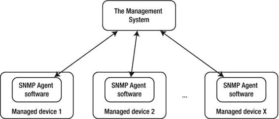
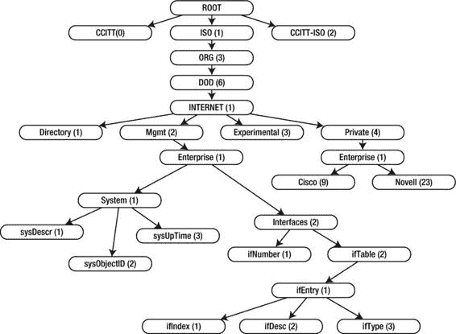
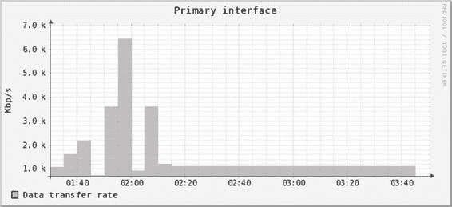
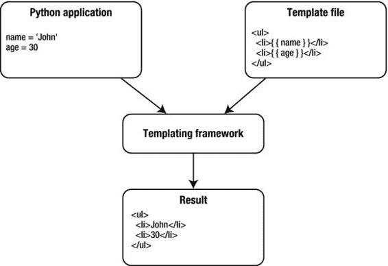
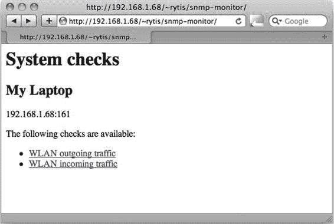
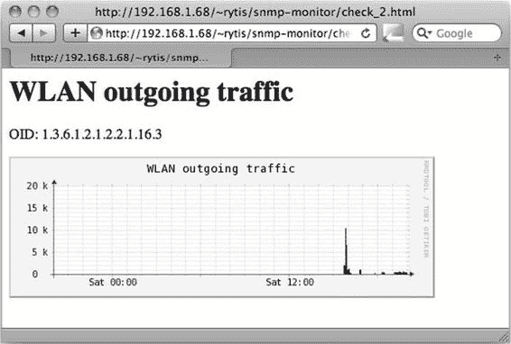

# 一、使用 SNMP 读取和收集性能数据

大多数连接到网络的设备使用 SNMP(简单网络管理协议)报告它们的状态。该协议主要是为管理和监控网络连接的硬件设备而设计的，但是一些应用也使用该协议来公开它们的统计数据。在本章中，我们将探讨如何从 Python 应用中访问这些信息。我们将使用 RRDTool 将获得的数据存储在 RRD(循环数据库)中，RRDTool 是一个广为人知的流行应用和库，用于存储和绘制性能数据。最后，我们将研究 Jinja2 模板系统，我们将使用它为我们的应用生成简单的 web 页面。

应用需求和设计

系统监控的主题非常广泛，通常包含许多不同的领域。一个完整的监控系统相当复杂，通常由多个部件协同工作组成。我们不打算在这里开发一个完整的、自给自足的系统，但是我们将研究典型监控系统的两个重要方面:信息收集和表示。在本章中，我们将实现一个系统，该系统使用 SNMP 协议查询设备，然后使用 RRDTool 库存储数据，该库也用于生成可视化数据表示的图形。所有这些都使用 Jinja2 模板库绑定到简单的 web 页面中。在本章中，我们将更详细地了解这些组件。

详细说明要求

在开始设计我们的应用之前，我们需要对我们的系统提出一些要求。首先，我们需要理解我们期望我们的系统提供的功能。这将帮助我们创建一个有效的(我们希望易于实现的)系统设计。在本章中，我们将创建一个使用 SNMP 协议监控网络连接设备(如网络交换机和路由器)的系统。因此，第一个要求是系统能够使用 SNMP 查询任何设备。

需要存储从设备收集的信息，以供将来参考和分析。让我们对这些信息的使用做一些假设。首先，我们不需要无限期地存储它。(我将在第 9-11 章中详细讨论永久信息存储。)这意味着信息只存储预定义的一段时间，一旦过时就会被擦除。这提出了我们的第二个需求:信息在“过期”后需要被删除

第二，需要存储信息，以便生成图表。我们不会将它用于任何其他用途，因此数据存储应该针对数据表示任务进行优化。

最后，我们需要生成图表，并在易于访问的网页上显示这些信息。该信息只需要由设备名称构成。例如，如果我们正在监控几个设备的 CPU 和网络接口利用率，那么这些信息需要显示在一个页面上。我们不需要在多个时间尺度上呈现这些信息；默认情况下，图表应该显示过去 24 小时的性能指标。

高级设计规范

现在我们已经对系统的功能有了一些想法，让我们创建一个简单的设计，我们将使用它作为开发阶段的指南。基本的方法是，我们之前指定的每个需求都应该被一个或多个设计决策所覆盖。

第一个要求是我们需要监控网络连接设备，我们需要使用 SNMP 来实现。这意味着我们必须使用适当的 Python 库来处理 SNMP 对象。SNMP 模块不包含在默认的 Python 安装中，所以我们必须使用一个外部模块。我推荐使用 PySNMP 库(可以在[http://pysnmp.sourceforge.net/](http://pysnmp.sourceforge.net/)获得)，它可以在大多数流行的 Linux 发行版上获得。

数据存储引擎的完美候选是 RRDTool (在[http://oss.oetiker.ch/rrdtool/](http://oss.oetiker.ch/rrdtool/)有售)。循环数据库意味着数据库的结构是这样的，每个“表”都有一个有限的长度，一旦达到限制，最旧的条目就会被丢弃。事实上，它们没有被丢弃；新的只是被写入它们的位置。

RRDTool 库提供了两种不同的功能:数据库服务和图形生成工具包。Python 中没有对 RRD 数据库的本地支持，但是有一个外部库提供了到 RRDTool 库的接口。

最后，为了生成网页，我们将使用 Jinja2 模板库(可在[http://jinja.pocoo.org](http://jinja.pocoo.org)或 GitHub:[https://github.com/mitsuhiko/jinja2](https://github.com/mitsuhiko/jinja2)获得)，它让我们可以创建复杂的模板，并分离设计和开发任务。

我们将使用一个简单的 Windows INI 风格的配置文件来存储我们将监控的设备的信息。此信息将包括设备地址、SNMP 对象引用和访问控制详细信息等详细信息。

该应用将分为两部分:第一部分是信息收集工具，它查询所有已配置的设备并将数据存储在 RRDTool 数据库中；第二部分是报告生成器，它生成网站结构以及所有需要的图像。这两个组件都将从标准的 UNIX 调度程序应用 cron 实例化。这两个脚本将分别被命名为 snmp-manager.py 和 snmp-pages.py。

SNMP 简介

SNMP(简单网络管理协议)是一种基于 UDP 的协议，主要用于管理网络连接设备，如路由器、交换机、计算机、打印机、摄像机等。一些应用还允许通过 SNMP 协议访问内部计数器。

SNMP 不仅允许您从设备中读取性能统计数据，它还可以发送控制消息来指示设备执行某些操作，例如，您可以使用 SNMP 命令远程重启路由器。

由简单网络管理协议(SNMP)管理的系统中有三个主要组件:

*   负责管理所有设备的管理系统
*   被管理设备，即由管理系统管理的所有设备
*   SNMP 代理是运行在每个被管理设备上并与管理系统交互的应用

这种关系在[图 1-1](#Fig1) 中说明。



[图 1-1](#_Fig1) 。SNMP 网络组件

这种方法相当普通。该协议定义了七个基本命令，其中我们最感兴趣的是 get、get bulk 和 response。你可能已经猜到了，前两个是管理系统向代理发出的命令，后一个是代理软件的响应。

管理系统如何知道要寻找什么？该协议没有定义交换该信息的方式，因此管理系统无法询问代理以获得可用变量的列表。

该问题通过使用管理信息库(或 MIB)来解决。每个设备通常都有一个相关的 MIB，它描述了该系统上管理数据的结构。这种 MIB 将按层次顺序列出在被管理设备上可用的所有对象标识符(oid)。OID 有效地表示了对象树中的一个节点。它包含从树顶部的节点开始通向当前 OID 的所有节点的数字标识符。节点 id 由 IANA(互联网号码分配机构)分配和管理。一个组织可以申请一个 OID 节点，当它被分配后，它负责管理分配节点下的 OID 结构。

[图 1-2](#Fig2) 展示了 OID 树的一部分。



[图 1-2](#_Fig2) 。SNMP OID 树

让我们看一些 oid 的例子。分配给思科组织的 OID 树节点的值为 1.3.6.1.4.1.9，这意味着所有与思科制造的设备相关联的专有 oid 将以这些数字开头。同样，Novell 设备的 oid 将从 1.3.6.1.4.1.23 开始。

我特意强调了专有 oid，因为有些属性预计会出现在所有设备上(如果有的话)。这些在 RFC1213 定义的 1.3.6.1.2.1.1(系统 SNMP 变量)节点下。欲了解更多关于 OID 树及其元素的细节，请访问 http://www.alvestrand.no/objectid/top.html。这个网站允许你浏览 OID 树，它包含了相当大的各种 oid 的集合。

系统 SNMP 变量节点

在大多数情况下，关于设备的基本信息可以在系统 SNMP 变量 OID 节点下的子树中找到。因此，让我们仔细看看你能在那里找到什么。

这个 OID 节点包含几个额外的 OID 节点。表 1-1 提供了大多数子节点的描述。

[表 1-1](#_Tab1) 。系统 SNMP OIDs

| 

OID 字符串

 | 

目录名称

 | 

描述

 |
| --- | --- | --- |
| 1.3.6.1.2.1.1.1 | 系统描述 | 包含系统或设备简短描述的字符串。通常包含硬件类型和操作系统的详细信息。 |
| 1.3.6.1.2.1.1.2 | sysObjectID | 包含特定于供应商的设备 OID 节点的字符串。例如，如果为组织分配了 OID 节点 1.3.6.1.4.1.8888，并且在组织的空间下为该特定设备分配了. 1.1 OID 空间，则该字段将包含值 1.3.6.1.4.1.8888.1.1。 |
| 1.3.6.1.2.1.1.3 | 工作时间 | 一个数字，表示从系统初始化开始以百秒为单位的时间。 |
| 1.3.6.1.2.1.1.4 | 联系方式 | 包含负责此系统的联系人信息的任意字符串。 |
| 1.3.6.1.2.1.1.5 | 系统 | 分配给系统的名称。通常这个字段包含一个完全合格的域名。 |
| 1.3.6.1.2.1.1.6 | 系统地址 | 描述系统物理位置的字符串。 |
| 1.3.6.1.2.1.1.7 | 系统服务 | 表示该系统提供哪些服务的数字。该编号是所有 OSI 协议的位图表示，最低位代表第一个 OSI 层。例如，一个交换设备(运行在第 2 层)会将这个数字设置为 2 <sup class="calibre15">2</sup> = 4。这个字段现在已经很少使用了。 |
| 1.3.6.1.2.1.1.8 | sysLastChange | 一个数字，包含任何系统 SNMP 对象发生更改时的 sysUpTime 值。 |
| 1.3.6.1.2.1.1.9 | 表 | 包含多个 sysEntry 元素的节点。每个元素代表一个独特的功能和相应的 OID 节点值。 |

接口 SNMP 变量节点

类似地，基本的接口统计数据可以从接口 SNMP 变量 OID 节点子树中获得。接口变量的 OID 是 1.3.6.1.2.1.2，包含两个子节点:

*   包含网络接口总数的 OID。此条目的 OID 值为 1 . 3 . 6 . 1 . 2 . 1 . 2 . 1；它通常被称为 ifNumber。此 OID 下没有可用的子节点。
*   包含所有接口条目的 OID 节点。它的 OID 是 1.3.6.1.2.1.2.2，通常被称为 ifTable。此节点包含一个或多个入口节点。入口节点(1.3.6.1.2.1.2.2.1，也称为 ifEntry)包含关于该特定接口的详细信息。列表中条目的数量由 ifNumber 节点值定义。

您可以在[表 1-2](#Tab2) 中找到所有 ifEntry 子节点的详细信息。

[表 1-2](#_Tab2) 。接口条目 SNMP OIDs

| 

OID 字符串

 | 

目录名称

 | 

描述

 |
| --- | --- | --- |
| 1.3.6.1.2.1.2.2.1.1 | 如果索引 | 分配给接口的唯一序列号。 |
| 1.3.6.1.2.1.2.2.1.2 | ifDescr | 包含接口名称和其他可用信息的字符串，如硬件制造商的名称。 |
| 1.3.6.1.2.1.2.2.1.3 | ifType | 代表接口类型的数字，取决于接口的物理链路和协议。 |
| 1.3.6.1.2.1.2.2.1.4 | ifMtu | 这个接口可以传输的最大网络数据报。 |
| 1.3.6.1.2.1.2.2.1.5 | 芯倍速 | 接口的估计当前带宽。如果无法计算当前带宽，该数字应包含接口的最大可能带宽。 |
| 1.3.6.1.2.1.2.2.1.6 | ifPhysAddress | 接口的物理地址，通常是以太网接口上的 MAC 地址。 |
| 1.3.6.1.2.1.2.2.1.7 | ifAdminStatus | 该 OID 允许设置接口的新状态。通常限于以下值:1(向上)，2(向下)，3(测试)。 |
| 1.3.6.1.2.1.2.2.1.8 | 异态 | 接口的当前状态。通常限于以下值:1(向上)，2(向下)，3(测试)。 |
| 1.3.6.1.2.1.2.2.1.9 | iflastschange | 当接口进入当前状态时，包含系统运行时间(sysUpTime)读数的值。如果接口在最后一次系统重新初始化之前进入此状态，可以设置为零。 |
| 1.3.6.1.2.1.2.2.1.10 | 菲诺特人 | 接口上接收的字节(八位字节)总数。 |
| 1.3.6.1.2.1.2.2.1.11 | ifInUcastPkts | 转发到设备网络堆栈的单播数据包数量。 |
| 1.3.6.1.2.1.2.2.1.12 | ifInNUcastPkts | 传送到设备网络堆栈的非单播数据包的数量。非单播数据包通常是广播或组播数据包。 |
| 1.3.6.1.2.1.2.2.1.13 | ifInDiscards | 丢弃的数据包数量。这并不表示有数据包错误，但可能表示接收缓冲区太小，无法接受数据包。 |
| 1.3.6.1.2.1.2.2.1.14 | ifInErrors | 收到的无效数据包的数量。 |
| 1.3.6.1.2.1.2.2.1.15 | ifinunnknownprotos | 由于设备接口不支持该协议而丢弃的数据包数量。 |
| 1.3.6.1.2.1.2.2.1.16 | ifOutOctets | 从接口传输出去的字节数(八位字节)。 |
| 1.3.6.1.2.1.2.2.1.17 | ifOutUcastPkts | 从设备网络堆栈接收的单播数据包的数量。这个数字还包括被丢弃或未发送的数据包。 |
| 1.3.6.1.2.1.2.2.1.18 | ifNUcastPkts | 从设备网络堆栈接收的非单播数据包的数量。这个数字还包括被丢弃或未发送的数据包。 |
| 1.3.6.1.2.1.2.2.1.19 | 如果丢弃 | 被丢弃的有效数据包的数量。这不是一个错误，但它可能表明发送缓冲区太小，无法接受所有数据包。 |
| 1.3.6.1.2.1.2.2.1.20 | ifOutErrors | 由于错误而无法传输的传出数据包数。 |
| 1.3.6.1.2.1.2.2.1.21 | ifOutQLen | 出站数据包队列的长度。 |
| 1.3.6.1.2.1.2.2.1.22 | 如果具体 | 通常包含对描述该接口的特定于供应商的 OID 的引用。如果这样的信息不可用，则该值被设置为 OID 0.0，这在语法上是有效的，但不指向任何内容。 |

SNMP 中的身份验证

早期 SNMP 实现中的认证有些原始，容易受到攻击。SNMP 代理定义了两个社区字符串:一个用于只读访问，另一个用于读/写访问。当管理系统连接到代理时，它必须使用这两个字符串之一进行身份验证。代理仅接受来自已使用有效社区字符串进行身份验证的管理系统的命令。

从命令行查询 SNMP

在开始编写我们的应用之前，让我们快速看一下如何从命令行查询 SNMP。如果您想检查 SNMP 代理返回的信息是否被您的应用正确接受，这是非常有用的。

命令行工具由 Net-SNMP-Utils 包提供，该包可用于大多数 Linux 发行版。这个包包括查询和设置 SNMP 对象的工具。关于安装这个软件包的详细信息，请参考您的 Linux 发行版文档。例如，在基于 RedHat 的系统上，您可以使用以下命令安装这些工具:

```py
$ sudo yum install net-snmp-utils
```

在基于 Debian 的系统上，软件包可以这样安装:

```py
$ sudo apt-get install snmp
```

这个包中最有用的命令是 snmpwalk ，它将一个 OID 节点作为参数，并试图发现所有子节点 oid。这个命令使用 SNMP 操作 getnext ，它返回树中的下一个节点，并有效地允许您从指定的节点开始遍历整个子树。如果没有指定 OID，snmpwalk 将使用默认的 SNMP 系统 OID (1.3.6.1.2.1)作为起点。[清单 1-1](#list1) 演示了针对运行 Fedora Linux 的笔记本电脑发出的 snmpwalk 命令。

[***清单 1-1***](#_list1) 。snmpwalk 命令的示例

```py
$ snmpwalk –v2c -c public -On 192.168.1.68
.1.3.6.1.2.1.1.1.0 = STRING: Linux fedolin.example.com 2.6.32.11-99.fc12.i686 #1 SMP Mon Apr 5 16:32:08 EDT 2010 i686
.1.3.6.1.2.1.1.2.0 = OID: .1.3.6.1.4.1.8072.3.2.10
.1.3.6.1.2.1.1.3.0 = Timeticks: (110723) 0:18:27.23
.1.3.6.1.2.1.1.4.0 = STRING: Administrator (admin@example.com)
.1.3.6.1.2.1.1.5.0 = STRING: fedolin.example.com
.1.3.6.1.2.1.1.6.0 = STRING: MyLocation, MyOrganization, MyStreet, MyCity, MyCountry
.1.3.6.1.2.1.1.8.0 = Timeticks: (3) 0:00:00.03
.1.3.6.1.2.1.1.9.1.2.1 = OID: .1.3.6.1.6.3.10.3.1.1
.1.3.6.1.2.1.1.9.1.2.2 = OID: .1.3.6.1.6.3.11.3.1.1
.1.3.6.1.2.1.1.9.1.2.3 = OID: .1.3.6.1.6.3.15.2.1.1
.1.3.6.1.2.1.1.9.1.2.4 = OID: .1.3.6.1.6.3.1
.1.3.6.1.2.1.1.9.1.2.5 = OID: .1.3.6.1.2.1.49
.1.3.6.1.2.1.1.9.1.2.6 = OID: .1.3.6.1.2.1.4
.1.3.6.1.2.1.1.9.1.2.7 = OID: .1.3.6.1.2.1.50
.1.3.6.1.2.1.1.9.1.2.8 = OID: .1.3.6.1.6.3.16.2.2.1
.1.3.6.1.2.1.1.9.1.3.1 = STRING: The SNMP Management Architecture MIB.
.1.3.6.1.2.1.1.9.1.3.2 = STRING: The MIB for Message Processing and Dispatching.
.1.3.6.1.2.1.1.9.1.3.3 = STRING: The management information definitions for the SNMP User-based Security Model.
.1.3.6.1.2.1.1.9.1.3.4 = STRING: The MIB module for SNMPv2 entities
.1.3.6.1.2.1.1.9.1.3.5 = STRING: The MIB module for managing TCP implementations
.1.3.6.1.2.1.1.9.1.3.6 = STRING: The MIB module for managing IP and ICMP implementations
.1.3.6.1.2.1.1.9.1.3.7 = STRING: The MIB module for managing UDP implementations
.1.3.6.1.2.1.1.9.1.3.8 = STRING: View-based Access Control Model for SNMP.
.1.3.6.1.2.1.1.9.1.4.1 = Timeticks: (3) 0:00:00.03
.1.3.6.1.2.1.1.9.1.4.2 = Timeticks: (3) 0:00:00.03
.1.3.6.1.2.1.1.9.1.4.3 = Timeticks: (3) 0:00:00.03
.1.3.6.1.2.1.1.9.1.4.4 = Timeticks: (3) 0:00:00.03
.1.3.6.1.2.1.1.9.1.4.5 = Timeticks: (3) 0:00:00.03
.1.3.6.1.2.1.1.9.1.4.6 = Timeticks: (3) 0:00:00.03
.1.3.6.1.2.1.1.9.1.4.7 = Timeticks: (3) 0:00:00.03
.1.3.6.1.2.1.1.9.1.4.8 = Timeticks: (3) 0:00:00.03
.1.3.6.1.2.1.2.1.0 = INTEGER: 5
.1.3.6.1.2.1.2.2.1.1.1 = INTEGER: 1
.1.3.6.1.2.1.2.2.1.1.2 = INTEGER: 2
.1.3.6.1.2.1.2.2.1.1.3 = INTEGER: 3
.1.3.6.1.2.1.2.2.1.1.4 = INTEGER: 4
.1.3.6.1.2.1.2.2.1.1.5 = INTEGER: 5
.1.3.6.1.2.1.2.2.1.2.1 = STRING: lo
.1.3.6.1.2.1.2.2.1.2.2 = STRING: eth0
.1.3.6.1.2.1.2.2.1.2.3 = STRING: wlan1
.1.3.6.1.2.1.2.2.1.2.4 = STRING: pan0
.1.3.6.1.2.1.2.2.1.2.5 = STRING: virbr0
.1.3.6.1.2.1.2.2.1.3.1 = INTEGER: softwareLoopback(24)
.1.3.6.1.2.1.2.2.1.3.2 = INTEGER: ethernetCsmacd(6)
.1.3.6.1.2.1.2.2.1.3.3 = INTEGER: ethernetCsmacd(6)
.1.3.6.1.2.1.2.2.1.3.4 = INTEGER: ethernetCsmacd(6)
.1.3.6.1.2.1.2.2.1.3.5 = INTEGER: ethernetCsmacd(6)
.1.3.6.1.2.1.2.2.1.4.1 = INTEGER: 16436
.1.3.6.1.2.1.2.2.1.4.2 = INTEGER: 1500
.1.3.6.1.2.1.2.2.1.4.3 = INTEGER: 1500
.1.3.6.1.2.1.2.2.1.4.4 = INTEGER: 1500
.1.3.6.1.2.1.2.2.1.4.5 = INTEGER: 1500
.1.3.6.1.2.1.2.2.1.5.1 = Gauge32: 10000000
.1.3.6.1.2.1.2.2.1.5.2 = Gauge32: 0
.1.3.6.1.2.1.2.2.1.5.3 = Gauge32: 10000000
.1.3.6.1.2.1.2.2.1.5.4 = Gauge32: 10000000
.1.3.6.1.2.1.2.2.1.5.5 = Gauge32: 10000000
.1.3.6.1.2.1.2.2.1.6.1 = STRING:
.1.3.6.1.2.1.2.2.1.6.2 = STRING: 0:d:56:7d:68:b0
.1.3.6.1.2.1.2.2.1.6.3 = STRING: 0:90:4b:64:7b:4d
.1.3.6.1.2.1.2.2.1.6.4 = STRING: 4e:e:b8:9:81:3b
.1.3.6.1.2.1.2.2.1.6.5 = STRING: d6:f9:7c:2c:17:28
.1.3.6.1.2.1.2.2.1.7.1 = INTEGER: up(1)
.1.3.6.1.2.1.2.2.1.7.2 = INTEGER: up(1)
.1.3.6.1.2.1.2.2.1.7.3 = INTEGER: up(1)
.1.3.6.1.2.1.2.2.1.7.4 = INTEGER: down(2)
.1.3.6.1.2.1.2.2.1.7.5 = INTEGER: up(1)
.1.3.6.1.2.1.2.2.1.8.1 = INTEGER: up(1)
.1.3.6.1.2.1.2.2.1.8.2 = INTEGER: down(2)
.1.3.6.1.2.1.2.2.1.8.3 = INTEGER: up(1)
.1.3.6.1.2.1.2.2.1.8.4 = INTEGER: down(2)
.1.3.6.1.2.1.2.2.1.8.5 = INTEGER: up(1)
.1.3.6.1.2.1.2.2.1.9.1 = Timeticks: (0) 0:00:00.00
.1.3.6.1.2.1.2.2.1.9.2 = Timeticks: (0) 0:00:00.00
.1.3.6.1.2.1.2.2.1.9.3 = Timeticks: (0) 0:00:00.00
.1.3.6.1.2.1.2.2.1.9.4 = Timeticks: (0) 0:00:00.00
.1.3.6.1.2.1.2.2.1.9.5 = Timeticks: (0) 0:00:00.00
.1.3.6.1.2.1.2.2.1.10.1 = Counter32: 89275
.1.3.6.1.2.1.2.2.1.10.2 = Counter32: 0
.1.3.6.1.2.1.2.2.1.10.3 = Counter32: 11649462
.1.3.6.1.2.1.2.2.1.10.4 = Counter32: 0
.1.3.6.1.2.1.2.2.1.10.5 = Counter32: 0
.1.3.6.1.2.1.2.2.1.11.1 = Counter32: 1092
.1.3.6.1.2.1.2.2.1.11.2 = Counter32: 0
.1.3.6.1.2.1.2.2.1.11.3 = Counter32: 49636
.1.3.6.1.2.1.2.2.1.11.4 = Counter32: 0
.1.3.6.1.2.1.2.2.1.11.5 = Counter32: 0
.1.3.6.1.2.1.2.2.1.12.1 = Counter32: 0
.1.3.6.1.2.1.2.2.1.12.2 = Counter32: 0
.1.3.6.1.2.1.2.2.1.12.3 = Counter32: 0
.1.3.6.1.2.1.2.2.1.12.4 = Counter32: 0
.1.3.6.1.2.1.2.2.1.12.5 = Counter32: 0
.1.3.6.1.2.1.2.2.1.13.1 = Counter32: 0
.1.3.6.1.2.1.2.2.1.13.2 = Counter32: 0
.1.3.6.1.2.1.2.2.1.13.3 = Counter32: 0
.1.3.6.1.2.1.2.2.1.13.4 = Counter32: 0
.1.3.6.1.2.1.2.2.1.13.5 = Counter32: 0
.1.3.6.1.2.1.2.2.1.14.1 = Counter32: 0
.1.3.6.1.2.1.2.2.1.14.2 = Counter32: 0
.1.3.6.1.2.1.2.2.1.14.3 = Counter32: 0
.1.3.6.1.2.1.2.2.1.14.4 = Counter32: 0
.1.3.6.1.2.1.2.2.1.14.5 = Counter32: 0
.1.3.6.1.2.1.2.2.1.15.1 = Counter32: 0
.1.3.6.1.2.1.2.2.1.15.2 = Counter32: 0
.1.3.6.1.2.1.2.2.1.15.3 = Counter32: 0
.1.3.6.1.2.1.2.2.1.15.4 = Counter32: 0
.1.3.6.1.2.1.2.2.1.15.5 = Counter32: 0
.1.3.6.1.2.1.2.2.1.16.1 = Counter32: 89275
.1.3.6.1.2.1.2.2.1.16.2 = Counter32: 0
.1.3.6.1.2.1.2.2.1.16.3 = Counter32: 922277
.1.3.6.1.2.1.2.2.1.16.4 = Counter32: 0
.1.3.6.1.2.1.2.2.1.16.5 = Counter32: 3648
.1.3.6.1.2.1.2.2.1.17.1 = Counter32: 1092
.1.3.6.1.2.1.2.2.1.17.2 = Counter32: 0
.1.3.6.1.2.1.2.2.1.17.3 = Counter32: 7540
.1.3.6.1.2.1.2.2.1.17.4 = Counter32: 0
.1.3.6.1.2.1.2.2.1.17.5 = Counter32: 17
.1.3.6.1.2.1.2.2.1.18.1 = Counter32: 0
.1.3.6.1.2.1.2.2.1.18.2 = Counter32: 0
.1.3.6.1.2.1.2.2.1.18.3 = Counter32: 0
.1.3.6.1.2.1.2.2.1.18.4 = Counter32: 0
.1.3.6.1.2.1.2.2.1.18.5 = Counter32: 0
.1.3.6.1.2.1.2.2.1.19.1 = Counter32: 0
.1.3.6.1.2.1.2.2.1.19.2 = Counter32: 0
.1.3.6.1.2.1.2.2.1.19.3 = Counter32: 0
.1.3.6.1.2.1.2.2.1.19.4 = Counter32: 0
.1.3.6.1.2.1.2.2.1.19.5 = Counter32: 0
.1.3.6.1.2.1.2.2.1.20.1 = Counter32: 0
.1.3.6.1.2.1.2.2.1.20.2 = Counter32: 0
.1.3.6.1.2.1.2.2.1.20.3 = Counter32: 0
.1.3.6.1.2.1.2.2.1.20.4 = Counter32: 0
.1.3.6.1.2.1.2.2.1.20.5 = Counter32: 0
.1.3.6.1.2.1.2.2.1.21.1 = Gauge32: 0
.1.3.6.1.2.1.2.2.1.21.2 = Gauge32: 0
.1.3.6.1.2.1.2.2.1.21.3 = Gauge32: 0
.1.3.6.1.2.1.2.2.1.21.4 = Gauge32: 0
.1.3.6.1.2.1.2.2.1.21.5 = Gauge32: 0
.1.3.6.1.2.1.2.2.1.22.1 = OID: .0.0
.1.3.6.1.2.1.2.2.1.22.2 = OID: .0.0
.1.3.6.1.2.1.2.2.1.22.3 = OID: .0.0
.1.3.6.1.2.1.2.2.1.22.4 = OID: .0.0
.1.3.6.1.2.1.2.2.1.22.5 = OID: .0.0
.1.3.6.1.2.1.25.1.1.0 = Timeticks: (8232423) 22:52:04.23
.1.3.6.1.2.1.25.1.1.0 = No more variables left in this MIB View (It is past the end of the MIB tree)
```

作为练习，尝试使用[表 1-1](#Tab1) 和 [1-2](#Tab2) 识别一些列出的 oid，并找出它们的含义。

从 Python 查询 SNMP 设备

现在，我们已经对 SNMP 有了足够的了解，可以开始在我们自己的管理系统上工作了，该系统将定期查询已配置的系统。首先，让我们指定我们将在应用中使用的配置。

配置应用

正如我们已经知道的，我们需要每次检查可用的以下信息:

*   运行 SNMP 代理软件的系统的 IP 地址或可解析域名
*   将用于通过代理软件进行身份验证的只读社区字符串
*   OID 节点的数值表示

因为简单，我们将使用 Windows INI 风格的配置文件。Python 默认包含一个配置解析模块，所以使用起来也很方便。([第九章](09.html)非常详细的讨论了 ConfigParser 模块；有关模块的更多信息，请参考该章。)

让我们回到应用的配置文件。没有必要为我们将要查询的每个 SNMP 对象重复系统信息，所以我们可以在单独的部分定义每个系统参数一次，然后在每个检查部分引用系统 ID。check 部分定义了 OID 节点标识符字符串和简短描述，如清单 1-2 所示。使用下面列表中的内容创建一个名为 snmp-manage.cfg 的配置文件；不要忘记相应地修改 IP 和安全细节。

[***清单 1-2***](#_list2) 。M 管理系统配置文件

```py
[system_1]
description=My Laptop
address=192.168.1.68
port=161
communityro=public

[check_1]
description=WLAN incoming traffic
oid=1.3.6.1.2.1.2.2.1.10.3
system=system_1

[check_2]
description=WLAN incoming traffic
oid=1.3.6.1.2.1.2.2.1.16.3
system=system_1
```

确保系统和检查部分 id 是唯一的，否则可能会得到不可预知的结果。

我们将用两个方法创建一个 SnmpManager 类，一个用于添加系统，另一个用于添加检查。由于支票包含系统 ID 字符串，它将自动分配给该特定系统。在[清单 1-3](#list3) 中，你可以看到类定义和初始化部分，它读入配置，遍历各个部分，并相应地更新类对象。创建一个名为 snmp-manage.py 的文件，其内容如下所示。我们将继续在脚本中添加新的特性。

[***清单 1-3***](#_list3) 。读取和存储配置

```py
import sys
from ConfigParser import SafeConfigParser

class SnmpManager:
    def __init__(self):
        self.systems = {}

    def add_system(self, id, descr, addr, port, comm_ro):
        self.systems[id] = {'description' : descr,
                            'address'     : addr,
                            'port'        : int(port),
                            'communityro' : comm_ro,
                            'checks'      : {}
                           }

    def add_check(self, id, oid, descr, system):
        oid_tuple = tuple([int(i) for i in oid.split('.')])
        self.systems[system]['checks'][id] = {'description': descr,
                                              'oid'        : oid_tuple,
                                             }

def main(conf_file=""):
    if not conf_file:
        sys.exit(-1)
    config = SafeConfigParser()
    config.read(conf_file)
    snmp_manager = SnmpManager()
    for system in [s for s in config.sections() if s.startswith('system')]:
        snmp_manager.add_system(system,
                                config.get(system, 'description'),
                                config.get(system, 'address'),
                                config.get(system, 'port'),
                                config.get(system, 'communityro'))
    for check in [c for c in config.sections() if c.startswith('check')]:
        snmp_manager.add_check(check,
                               config.get(check, 'oid'),
                               config.get(check, 'description'),
                               config.get(check, 'system'))

if __name__ == '__main__':
    main(conf_file='snmp-manager.cfg')
```

正如您在示例中看到的，在继续检查部分之前，我们首先必须遍历系统部分并更新对象。

 **注意**这个顺序很重要，因为如果我们试图为一个还没有插入的系统添加检查，我们会得到一个字典索引错误。

还要注意，我们将 OID 字符串转换为整数元组。在本节的后面，您将会看到为什么我们必须这样做。配置文件已加载，我们准备好对已配置的设备运行 SNMP 查询。

使用 PySNMP 库

在这个项目中，我们将使用 PySNMP 库，它是用纯 Python 实现的，不依赖于任何预编译的库。pysnmp 包适用于大多数 Linux 发行版，可以使用标准发行版包管理器安装。除了 pysnmp，您还需要 ASN.1 库，它由 pysnmp 使用，也可以作为 Linux 发行包的一部分获得。例如，在 Fedora 系统上，您可以使用以下命令安装 pysnmp 模块:

```py
$ sudo yum install pysnmp
$ sudo yum install python-pyasn1
```

或者，您可以使用 Python 包管理器(PiP) 来安装这个库:

```py
$ sudo pip install pysnmp
$ sudo pip install pyasn1
```

如果你没有可用的 pip 命令，你可以从[http://pypi.python.org/pypi/pip](http://pypi.python.org/pypi/pip)下载并安装这个工具。我们也会在后面的章节中用到它。

PySNMP 库将 SNMP 处理的所有复杂性隐藏在具有简单 API 的单个类后面。您所要做的就是创建一个 CommandGenerator 类的实例。该类可从 py snmp . entity . RFC 3413 . oneliner . cmdgen 模块中获得，并实现大多数标准 SNMP 协议命令:getCmd()、setCmd()和 nextCmd()。让我们更详细地看一下每一项。

SNMP GET 命令

我们将要讨论的所有命令都遵循相同的调用模式:导入模块，创建 CommandGenerator 类的实例，创建三个必需的参数(身份验证对象、传输目标对象和参数列表)，最后调用适当的方法。该方法返回一个包含错误指示符(如果有错误)和结果对象的元组。

在[清单 1-4](#list4) 中，我们使用标准 SNMP OID(1 . 3 . 6 . 1 . 2 . 1 . 1 . 0)查询一台远程 Linux 机器。

[***清单 1-4***](#_list4) 。SNMP GET 命令的一个例子

```py
>>> from pysnmp.entity.rfc3413.oneliner import cmdgen
>>> cg = cmdgen.CommandGenerator()
>>> comm_data = cmdgen.CommunityData('my-manager', 'public')
>>> transport = cmdgen.UdpTransportTarget(('192.168.1.68', 161))
>>> variables = (1, 3, 6, 1, 2, 1, 1, 1, 0)
>>> errIndication, errStatus, errIndex, result = cg.getCmd(comm_data, transport, variables)
>>> print errIndication
None
>>> print errStatus
0
>>> print errIndex
0
>>> print result
[(ObjectName('1.3.6.1.2.1.1.1.0'), OctetString('Linux fedolin.example.com
 2.6.32.11-99.fc12.i686 #1 SMP Mon Apr 5 16:32:08 EDT 2010 i686'))]
>>>
```

让我们更仔细地看一些步骤。当我们启动社区数据对象时，我们提供了两个字符串——社区字符串(第二个参数)和代理或管理器安全名称字符串；在大多数情况下，这可以是任何字符串。可选参数指定要使用的 SNMP 版本(默认为 SNMP v2c)。如果您必须查询版本 1 设备，请使用以下命令:

```py
>>> comm_data = cmdgen.CommunityData('my-manager', 'public', mpModel=0)
```

传输对象由包含完全限定的域名或 IP 地址字符串和整数端口号的元组初始化。

最后一个参数是 OID，表示为所有节点 ID 的元组，这些节点 ID 组成了我们正在查询的 OID。因此，当我们读取配置项时，我们必须将点分隔的字符串转换为元组。

最后，我们调用 API 命令 getCmd()，它实现了 SNMP GET 命令，并传递这三个对象作为它的参数。该命令返回一个元组，元组的每个元素在[表 1-3](#Tab3) 中描述。

[表 1-3](#_Tab3) 。CommandGenerator 返回对象

| 

元组元素

 | 

描述

 |
| --- | --- |
| 根除 | 如果该字符串不为空，则表明 SNMP 引擎出错。 |
| 错误状态 | 如果此元素评估为真，则表明 SNMP 通信中有错误；产生错误的对象由 errIndex 元素指示。 |
| ehrindex | 如果 errStatus 指示发生了错误，则该字段可用于查找导致错误的 SNMP 对象。结果数组中的对象位置是 errIndex-1。 |
| 结果 | 此元素包含所有返回的 SNMP 对象元素的列表。每个元素都是一个包含对象名和对象值的元组。 |

SNMP SET 命令

SNMP SET 命令在 PySNMP 中被映射到 setCmd()方法调用。所有参数都相同；唯一的区别是 variables 部分现在包含一个元组:OID 和新值。让我们试着用这个命令来改变一个只读对象；清单 1-5 显示了命令行序列。

[***清单 1-5***](#_list5) 。SNMP SET 命令的示例

```py
>>> from pysnmp.entity.rfc3413.oneliner import cmdgen
>>> from pysnmp.proto import rfc1902
>>> cg = cmdgen.CommandGenerator()
>>> comm_data = cmdgen.CommunityData('my-manager', 'public')
>>> transport = cmdgen.UdpTransportTarget(('192.168.1.68', 161))
>>> variables = ((1, 3, 6, 1, 2, 1, 1, 1, 0), rfc1902.OctetString('new system description'))
>>> errIndication, errStatus, errIndex, result = cg.setCmd(comm_data, transport,
variables)
>>> print errIndication
None
>>> print errStatus
6
>>> print errIndex
1
>>> print errStatus.prettyPrint()
noAccess(6)
>>> print result
[(ObjectName('1.3.6.1.2.1.1.1.0'), OctetString('new system description'))]
>>>
```

这里发生的情况是，我们试图写入一个只读对象，这导致了一个错误。这个例子中有趣的是我们如何格式化参数。你必须把字符串转换成 SNMP 对象类型；否则；它们不能作为有效的论点。因此，字符串必须封装在 OctetString 类的实例中。如果需要转换为其他 SNMP 类型，可以使用 rfc1902 模块的其他方法；这些方法包括 Bits()、Counter32()、Counter64()、Gauge32()、Integer()、Integer32()、IpAddress()、OctetString()、Opaque()、TimeTicks()和 Unsigned32()。如果需要将字符串转换为特定类型的对象，可以使用这些类名。

SNMP GETNEXT 命令

SNMP GETNEXT 命令 实现为 nextCmd()方法。语法和用法与 getCmd()相同；唯一的区别是结果是一个对象列表，这些对象是指定 OID 节点的直接子节点。

让我们使用这个命令来查询 SNMP 系统 OID (1.3.6.1.2.1.1)的所有直接子节点对象；[清单 1-6](#list6) 展示了运行中的 nextCmd()方法。

[***清单 1-6***](#_list6) 。SNMP GETNEXT 命令的示例

```py
>>> from pysnmp.entity.rfc3413.oneliner import cmdgen
>>> cg = cmdgen.CommandGenerator()
>>> comm_data = cmdgen.CommunityData('my-manager', 'public')
>>> transport = cmdgen.UdpTransportTarget(('192.168.1.68', 161))
>>> variables = (1, 3, 6, 1, 2, 1, 1)
>>> errIndication, errStatus, errIndex, result = cg.nextCmd(comm_data, transport, variables)
>>> print errIndication
requestTimedOut
>>> errIndication, errStatus, errIndex, result = cg.nextCmd(comm_data, transport, variables)
>>> print errIndication
None
>>> print errStatus
0
>>> print errIndex
0
>>> for object in result:
...  print object
...
[(ObjectName('1.3.6.1.2.1.1.1.0'), OctetString('Linux fedolin.example.com
 2.6.32.11-99.fc12.i686 #1 SMP Mon Apr 5 16:32:08 EDT 2010 i686'))]
[(ObjectName('1.3.6.1.2.1.1.2.0'), ObjectIdentifier('1.3.6.1.4.1.8072.3.2.10'))]
[(ObjectName('1.3.6.1.2.1.1.3.0'), TimeTicks('340496'))]
[(ObjectName('1.3.6.1.2.1.1.4.0'), OctetString('Administrator (admin@example.com)'))]
[(ObjectName('1.3.6.1.2.1.1.5.0'), OctetString('fedolin.example.com'))]
[(ObjectName('1.3.6.1.2.1.1.6.0'), OctetString('MyLocation, MyOrganization, MyStreet, MyCity, MyCountry'))]
[(ObjectName('1.3.6.1.2.1.1.8.0'), TimeTicks('3'))]
[(ObjectName('1.3.6.1.2.1.1.9.1.2.1'), ObjectIdentifier('1.3.6.1.6.3.10.3.1.1'))]
[(ObjectName('1.3.6.1.2.1.1.9.1.2.2'), ObjectIdentifier('1.3.6.1.6.3.11.3.1.1'))]
[(ObjectName('1.3.6.1.2.1.1.9.1.2.3'), ObjectIdentifier('1.3.6.1.6.3.15.2.1.1'))]
[(ObjectName('1.3.6.1.2.1.1.9.1.2.4'), ObjectIdentifier('1.3.6.1.6.3.1'))]
[(ObjectName('1.3.6.1.2.1.1.9.1.2.5'), ObjectIdentifier('1.3.6.1.2.1.49'))]
[(ObjectName('1.3.6.1.2.1.1.9.1.2.6'), ObjectIdentifier('1.3.6.1.2.1.4'))]
[(ObjectName('1.3.6.1.2.1.1.9.1.2.7'), ObjectIdentifier('1.3.6.1.2.1.50'))]
[(ObjectName('1.3.6.1.2.1.1.9.1.2.8'), ObjectIdentifier('1.3.6.1.6.3.16.2.2.1'))]
[(ObjectName('1.3.6.1.2.1.1.9.1.3.1'), OctetString('The SNMP Management Architecture MIB.'))]
[(ObjectName('1.3.6.1.2.1.1.9.1.3.2'), OctetString('The MIB for Message Processing and Dispatching.'))]
[(ObjectName('1.3.6.1.2.1.1.9.1.3.3'), OctetString('The management information
 definitions for the SNMP User-based Security Model.'))]
[(ObjectName('1.3.6.1.2.1.1.9.1.3.4'), OctetString('The MIB module for SNMPv2 entities'))]
[(ObjectName('1.3.6.1.2.1.1.9.1.3.5'), OctetString('The MIB module for managing TCP
 implementations'))]
[(ObjectName('1.3.6.1.2.1.1.9.1.3.6'), OctetString('The MIB module for managing IP
 and ICMP implementations'))]
[(ObjectName('1.3.6.1.2.1.1.9.1.3.7'), OctetString('The MIB module for managing UDP
 implementations'))]
[(ObjectName('1.3.6.1.2.1.1.9.1.3.8'), OctetString('View-based Access Control Model for SNMP.'))]
[(ObjectName('1.3.6.1.2.1.1.9.1.4.1'), TimeTicks('3'))]
[(ObjectName('1.3.6.1.2.1.1.9.1.4.2'), TimeTicks('3'))]
[(ObjectName('1.3.6.1.2.1.1.9.1.4.3'), TimeTicks('3'))]
[(ObjectName('1.3.6.1.2.1.1.9.1.4.4'), TimeTicks('3'))]
[(ObjectName('1.3.6.1.2.1.1.9.1.4.5'), TimeTicks('3'))]
[(ObjectName('1.3.6.1.2.1.1.9.1.4.6'), TimeTicks('3'))]
[(ObjectName('1.3.6.1.2.1.1.9.1.4.7'), TimeTicks('3'))]
[(ObjectName('1.3.6.1.2.1.1.9.1.4.8'), TimeTicks('3'))]
>>>
```

如您所见，结果与命令行工具 snmpwalk 产生的结果相同，它使用相同的技术来检索 SNMP OID 子树。

实现 SNMP 读取功能

让我们在应用中实现读取功能。工作流程如下:我们需要遍历列表中的所有系统，对于每个系统，我们遍历所有已定义的检查。对于每个检查，我们将执行 SNMP GET 命令，并将结果存储在相同的数据结构中。

出于调试和测试的目的，我们将添加一些打印语句来验证应用是否按预期工作。稍后，我们将用 RRDTool 数据库存储命令替换这些打印语句。我准备把这个方法叫做 query_all_systems() 。[清单 1-7](#list7) 显示了您想要添加到之前创建的 snmp-manager.py 文件中的代码。

[***清单 1-7***](#_list7) 。查询所有已定义的 SNMP 对象

```py
def query_all_systems(self):
    cg = cmdgen.CommandGenerator()
    for system in self.systems.values():
        comm_data = cmdgen.CommunityData('my-manager', system['communityro'])
        transport = cmdgen.UdpTransportTarget((system['address'], system['port']))
        for check in system['checks'].values():
            oid = check['oid']
            errInd, errStatus, errIdx, result = cg.getCmd(comm_data, transport, oid)
            if not errInd and not errStatus:
                print "%s/%s -> %s" % (system['description'],
                                       check['description'],
                                       str(result[0][1]))
```

如果您运行该工具，您将得到类似于以下的结果(假设您正确地将您的配置指向响应 SNMP 查询的工作设备):

```py
$ ./snmp-manager.py
My Laptop/WLAN outgoing traffic -> 1060698
My Laptop/WLAN incoming traffic -> 14305766
```

现在，我们准备将所有这些数据写入 RRDTool 数据库。

使用 RRDTool 存储数据

RRDTool 是由 Tobias Oetiker 开发的应用，它已经成为图形化监控数据的事实上的标准。RRDTool 生成的图形用于许多不同的监控工具，比如 Nagios、Cacti 等等。在这一节中，我们将看看 RRTool 数据库的结构和应用本身。我们将讨论循环数据库的细节，如何向其添加新数据，以及稍后如何检索它。我们还将了解数据绘制命令和技术。最后，我们将把 RRDTool 数据库与我们的应用集成起来。

RRDTool 简介

正如我所提到的，RRDTool 提供了三个不同的功能。首先，它作为一个数据库管理系统，允许您以自己的数据库格式存储和检索数据。它还执行复杂的数据操作任务，如数据重采样和速率计算。最后，它允许您创建包含来自各种源数据库的数据的复杂图表。

让我们先来看看循环数据库结构。很抱歉，在本节中您会遇到大量的缩写词，但是在这里提到它们是很重要的，因为它们都在 RRDTool 的配置中使用，所以熟悉它们是至关重要的。

RRD 不同于传统数据库的第一个特性是数据库的大小有限。这意味着数据库大小在初始化时是已知的，并且大小永远不会改变。新记录会覆盖旧数据，这个过程会一遍又一遍地重复。[图 1-3](#Fig3) 显示了 RRD 的简化版本，以帮助您可视化其结构。


[图 1-3](#_Fig3) 。RRD 的结构

假设我们已经初始化了一个能够容纳 12 条记录的数据库，每条记录都在自己的单元格中。当数据库为空时，我们从向 1 号单元格写入数据开始。我们还用上次写入数据的单元格的 ID 来更新指针。[图 1-3](#Fig3) 显示 6 条记录已经写入数据库(如阴影框所示)。指针在单元 6 上，因此当接收到下一个写指令时，数据库将把它写到下一个单元(单元 7)并相应地更新指针。到达最后一个单元格(单元格 12)后，该过程将从 1 号单元格重新开始。

RRD 数据存储的唯一目的是存储性能数据，因此它不需要维护不同数据表之间的复杂关系。事实上，RRD 中没有表，只有单独的数据源(DSs) 。

RRD 的最后一个重要属性是数据库引擎被设计用来存储时间序列数据，因此每条记录都需要标记时间戳。此外，当您创建一个新的数据库时，您需要指定采样率，即条目被写入数据库的速率。默认值为 300 秒或 5 分钟，但如果需要，可以覆盖该值。

存储在 RDD 中的数据称为循环档案(RRA) 。RRA 是 RRD 如此有用的原因。它允许您通过应用可用的合并功能(CF) 来合并从 DS 收集的数据。您可以指定四个 CFs(平均值、最小值、最大值和最后值)中的一个，应用于许多实际数据记录。结果存储在循环“表”中您可以在数据库中以不同的粒度存储多个 rra。例如，一个 RRA 存储最后 10 条记录的平均值，另一个存储最后 100 条记录的平均值。

当我们在接下来的部分中查看使用场景时，这些都会一起出现。

在 Python 程序中使用 RRDTool

在我们开始创建 RRDTool 数据库之前，让我们看看为 RRDTool 提供 API 的 Python 模块。我们在这一章将要使用的模块叫做 Python RRDTool，可以在[http://sourceforge.net/projects/py-rrdtool/](http://sourceforge.net/projects/py-rrdtool/)下载。

然而，大多数 Linux 发行版都预先打包了这个包，并且可以使用标准的包管理工具进行安装。例如，在 Fedora 系统上，您可以运行以下命令来安装 Python RRDTool 模块:

```py
$ sudo yum install rrdtool-python
```

在基于 Debian 的系统上，安装命令是:

```py
$ sudo apt-get install python-rrd
```

安装软件包后，您可以验证安装是否成功:

```py
$ python
Python 2.6.2 (r262:71600, Jan 25 2010, 18:46:45)
[GCC 4.4.2 20091222 (Red Hat 4.4.2-20)] on linux2
Type "help", "copyright", "credits" or "license" for more information.
>>> import rrdtool
>>> rrdtool.__version__
'$Revision: 1.14 $'
>>>
```

创建循环数据库

让我们从创建一个简单的数据库开始。我们将要创建的数据库将有一个数据源，这是一个简单的递增计数器:计数器值随着时间的推移而增加。这种计数器的典型例子是通过接口传输的字节。读数每 5 分钟进行一次。

我们还将定义两个 rra。一种是对单个读数求平均值，这有效地指示 RRDTool 存储实际值，另一种是对六次测量求平均值。以下是创建此数据库的命令行工具语法示例:

```py
$ rrdtool create interface.rrd \
> DS:packets:COUNTER:600:U:U \
> RRA:AVERAGE:0.5:1:288 \
> RRA:AVERAGE:0.5:6:336
```

类似地，您可以使用 Python 模块来创建相同的数据库:

```py
>>> import rrdtool
>>> rrdtool.create('interface.rrd',
...                'DS:packets:COUNTER:600:U:U',
...                'RRA:AVERAGE:0.5:1:288',
...                'RRA:AVERAGE:0.5:6:336')
>>>
```

DS(数据源)的结构定义行是:

```py
DS:*<name>*:*<DS type>*:*<heartbeat>*:*<lower limit>*:*<upper limit>*
```

*名称*字段是您命名这个特定数据源的名称。由于 RRD 允许您存储来自多个数据源的数据，因此您必须为每个数据源提供一个唯一的名称，以便以后访问。如果您需要定义多个数据源，只需添加另一个 DS 行。

DS type(或 data source type)字段指示将向该数据源提供什么类型的数据。有四种类型可用:计数器、仪表、衍生和绝对:

*   计数器类型表示测量值随时间增加。为了计算速率，RRDTool 从当前测量值中减去最后一个值，然后除以测量步长(或采样速率)以获得速率数值。如果结果是负数，它需要补偿计数器翻转。典型用途是监控不断增加的计数器，例如通过接口传输的总字节数。
*   派生类型类似于 COUNTER，但是它也允许负速率。您可以使用此类型来检查对您的站点的传入 HTTP 请求的速率。如果图表在零线以上，这意味着你收到越来越多的请求。如果它低于零线，这意味着你的网站变得不那么受欢迎。
*   绝对类型表示每次读取测量值时计数器都会复位。而对于计数器和派生类型，RRDTool 在除以时间段之前从当前测量值中减去上一次测量值，ABSOLUTE 告诉它不要执行减法运算。您可以在计数器上使用它，计数器的重置速率与您进行测量的速率相同。例如，您可以每 15 分钟测量一次系统平均负载(过去 15 分钟内)读数。这将代表平均系统负载的变化率。
*   仪表类型表示测量的是速率值，不需要进行计算。例如，当前 CPU 使用率和温度传感器读数是仪表类型的良好候选。

*心跳*值表示在将其重置为未知状态之前，允许读数进入的时间。RRDTool 允许数据丢失，但它不做任何假设，如果没有收到数据，它使用特殊值 unknown。在我们的示例中，我们将心跳设置为 600，这意味着数据库在声明下一个测量未知之前，要等待两次读取(记住，步长是 300)。

最后两个字段指示可以从数据源接收的最小值和最大值。如果您指定了这些，超出该范围的任何内容都将被自动标记为未知。

RRA 定义结构是:

```py
RRA:*<consolidation function>*:*<XFiles factor>*:*<dataset>*:*<samples>*
```

*合并函数*定义了将对*数据集*的值应用什么数学函数。*数据集*参数是从数据源接收的最后一个数据集测量值。在我们的示例中，我们有两个 rra，一个在数据集中只有一个读数，另一个在数据集中有六个测量值。可用的合并函数有平均值、最小值、最大值和最后值:

*   AVERAGE 指示 RRDTool 计算数据集的平均值并存储它。
*   最小值和最大值从数据集中选择最小值或最大值并存储。
*   最后一个指示使用数据集中的最后一个条目。

*XFiles 因子*值 s 如何确定数据集的多少百分比可以有未知值，合并函数计算仍将执行。例如，如果设置为 0.5 (50%)，则六次测量中有三次可能是未知的，仍将计算数据集的平均值。如果错过四个读数，则不执行计算，未知值存储在 RRA 中。将此值设置为 0 (0%的遗漏余量)，只有当数据集中的所有数据点都可用时，才会执行计算。将该设置保持在 0.5 似乎是一种常见的做法。

正如已经讨论过的，*数据集*参数指示有多少记录将参与合并函数计算。

最后， *samples* 告诉 RRDTool 应该保留多少 CF 结果。所以，回到我们的例子，数字 288 告诉 RRDTool 保存 288 条记录。因为我们每 5 分钟测量一次，所以这是 24 小时的数据(288/(60/5))。同样，数字 336 意味着我们以 30 分钟的采样率存储 7 天的数据(336/(60/30)/24)。如您所见，第二个 RRA 中的数据被重新采样；我们通过整合每六个(5 分钟)样本的数据，将采样率从 5 分钟更改为 30 分钟。

从循环数据库写入和读取数据

将数据写入 RRD 数据文件非常简单。您只需调用 update 命令，并假设您已经定义了多个数据源，按照您在创建数据库文件时指定的顺序为它提供一个数据源读数列表。每个条目之前必须有当前(或期望的)时间戳，从纪元(1970-01-01)开始以秒表示。或者，您可以使用字符 *N* 来表示当前时间，而不是使用实际的数字来表示时间戳。可以在一个命令中提供多个读数:

```py
$ date +"%s"
1273008486
$ rrdtool update interface.rrd 1273008486:10
$ rrdtool update interface.rrd 1273008786:15
$ rrdtool update interface.rrd 1273009086:25
$ rrdtool update interface.rrd 1273009386:40 1273009686:60 1273009986:66
$ rrdtool update interface.rrd 1273010286:100 1273010586:160 1273010886:166
```

Python 替代看起来非常相似。在下面的代码中，我们将插入另外 20 条记录，指定定期间隔(300 秒)并提供生成的测量值:

```py
>>> import rrdtool
>>> for i in range(20):
...  rrdtool.update('interface.rrd',
...                 '%d:%d' % (1273010886 + (1+i)*300, i*10+200))
...
>>>
```

现在让我们从 RRDTool 数据库取回数据:

```py
$ rrdtool fetch interface.rrd AVERAGE
                        packets

1272983100: -nan
[...]
1273008600: -nan
1273008900: 2.3000000000e-02
1273009200: 3.9666666667e-02
1273009500: 5.6333333333e-02
1273009800: 4.8933333333e-02
1273010100: 5.5466666667e-02
1273010400: 1.4626666667e-01
1273010700: 1.3160000000e-01
1273011000: 5.5466666667e-02
1273011300: 8.2933333333e-02
1273011600: 3.3333333333e-02
1273011900: 3.3333333333e-02
1273012200: 3.3333333333e-02
1273012500: 3.3333333333e-02
1273012800: 3.3333333333e-02
1273013100: 3.3333333333e-02
1273013400: 3.3333333333e-02
1273013700: 3.3333333333e-02
1273014000: 3.3333333333e-02
1273014300: 3.3333333333e-02
1273014600: 3.3333333333e-02
1273014900: 3.3333333333e-02
1273015200: 3.3333333333e-02
1273015500: 3.3333333333e-02
1273015800: 3.3333333333e-02
1273016100: 3.3333333333e-02
1273016400: 3.3333333333e-02
1273016700: 3.3333333333e-02
1273017000: -nan
[...]
1273069500: -nan
```

如果您计算条目的数量，您将看到它与我们在数据库上执行的更新数量相匹配。这意味着我们看到的是最高分辨率的结果——在我们的例子中，是每条记录一个样本。以最大分辨率显示结果是默认行为，但是您可以通过指定分辨率标志来选择另一种分辨率(前提是它具有匹配的 RRA)。请记住，在 RRA 定义中，分辨率必须用秒数来表示，而不是用样本数来表示。因此，在我们的示例中，下一个可用分辨率是 6(样本)* 300(秒/样本)= 1800(秒):

```py
$ rrdtool fetch interface.rrd AVERAGE -r 1800
                        packets

[...]
1273010400: 6.1611111111e-02
1273012200: 6.1666666667e-02
1273014000: 3.3333333333e-02
1273015800: 3.3333333333e-02
1273017600: 3.3333333333e-02
[...]
```

现在，您可能已经注意到，我们的 Python 应用插入的记录会产生存储在数据库中的相同数字。为什么会这样？计数器肯定在增加吗？记住，RRDTool 总是存储*速率*而不是实际值。因此，您在结果数据集中看到的数字显示了值*变化*的速度。因为 Python 应用以稳定的速率生成新的测量值(值之间的差异总是相同的)，所以速率数字总是相同的。

这个数字到底是什么意思？我们知道，每插入一条新记录，生成的值就增加 10，但是 fetch 命令输出的值是 3.333333333 e-02。(对于许多人来说，这可能看起来有点混乱，但这只是值 0.0333(3)的另一种表示法。)那是哪里来的？在讨论不同的数据源类型时，我提到过 RRDTool 获取两个数据点值之间的差值，并将其除以采样间隔的秒数。默认的采样间隔是 300 秒，因此计算出的速率是 10/300 = 0.0333(3)，这是写入 RRDTool 数据库的值。换句话说，这意味着我们的计数器平均每秒增加 0.0333(3)。请记住，所有速率测量值都存储为每秒的变化。在本节的后面，我们将把这个值转换成可读性更强的形式。

下面是使用 Python 模块方法调用检索数据的方法:

```py
>>> for i in rrdtool.fetch('interface.rrd', 'AVERAGE'): print i
...
(1272984300, 1273071000, 300)
('packets',)
[(None,), [...], (None,), (0.023,), (0.03966666666666667,), (0.056333333333333339,),
 (0.048933333333333336,), (0.055466666666666671,), (0.14626666666666666,),
 (0.13160000000000002,),  (0.055466666666666671,), (0.082933333333333331,),
 (0.033333333333333333,), (0.033333333333333333,), (0.033333333333333333,),
 (0.033333333333333333,), (0.033333333333333333,), (0.033333333333333333,),
 (0.033333333333333333,), (0.033333333333333333,), (0.033333333333333333,),
 (0.033333333333333333,), (0.033333333333333333,), (0.033333333333333333,),
 (0.033333333333333333,), (0.033333333333333333,), (0.033333333333333333,),
 (0.033333333333333333,), (0.033333333333333333,), (0.033333333333333333,),
 (None,), [...] (None,)]
>>>
```

结果是一个三元组:*数据集信息*、*数据源列表*和*结果数组*:

*   *数据集信息*是另一个元组，它有三个值:开始和结束时间戳以及采样率。
*   *数据源列表*简单地列出了存储在 RRDTool 数据库中并由您的查询返回的所有变量。
*   *结果数组*包含存储在 RRD 中的实际值。每个条目都是一个元组，包含被查询的每个变量的值。在我们的示例数据库中，我们只有一个变量；因此，元组只包含一个元素。如果无法计算该值(未知)，则返回 Python 的 None 对象。

如果需要，您还可以更改采样率:

```py
>>> rrdtool.fetch('interface.rrd', 'AVERAGE', '-r', '1800')
((1272983400, 1273071600, 1800), ('packets',), [(None,), [...] (None,),
 (0.06161111111111111,), (0.061666666666666668,), (0.033333333333333333,),
 (0.033333333333333333,), (0.033333333333333333,), (None,), [...] (None,)])
```

 **注意**到目前为止，您应该知道命令行工具语法是如何映射到 Python 模块调用的，您总是调用模块方法，它总是以 RRDTool 函数名命名，例如 fetch、update 等等。该函数的参数是一个任意的值列表。在这种情况下，值是命令行上用空格分隔的任何字符串。基本上，你可以把命令行作为参数列表复制到函数中。显然，您需要用引号将每个单独的字符串括起来，并用逗号分隔它们。为了节省空间和避免混乱，在接下来的例子中，我将只提供命令行语法，您应该能够很容易地将它映射到 Python 语法。

用 RRDTool 绘制图形

用 RRDTool 绘制图表真的很容易，而且绘图是这个工具如此受欢迎的原因之一。最简单的形式是，图形生成命令非常类似于数据获取命令:

```py
$ rrdtool graph packets.png --start 1273008600 --end 1273016400 --step 300\
> DEF:packetrate=interface.rrd:packets:AVERAGE \
> LINE2:packetrate#c0c0c0
```

即使没有任何额外的修改，结果也是一个非常专业的性能图，正如你在[图 1-4](#Fig4) 中看到的。


[图 1-4](#_Fig4) 。RRDTool 生成的简单图形

首先，我们来看看命令参数。所有绘图命令都以结果图像的文件名和可选的时间比例值开始。您还可以提供分辨率设置，如果没有指定，将默认为最详细的分辨率。这类似于 fetch 命令中的-r 选项。分辨率用秒表示。

下一行(尽管您可以在一行中键入整个 graph 命令)是选择器行，它从 RRDTool 数据库中选择数据集。选择器语句的格式为:

```py
DEF:<*selector name*>=<*rrd file*>:<*data source*>:<*consolidation function*>
```

*选择器名称*参数是一个任意字符串，用于命名结果数据集。可以把它看作一个数组变量，它存储来自 RRDTool 数据库的结果。您可以根据需要使用任意多的选择器语句，但是您至少需要一个来产生输出。

*rrd 文件*、*数据源*和*合并函数*变量的组合准确定义了需要选择的数据。如您所见，这种语法完全解耦了数据存储和数据表示功能。您可以将来自不同 RRDTool 数据库的结果包含在同一个图表中，并以您喜欢的任何方式组合它们。图形数据可以在不同的监控服务器上收集，也可以在单个图像上组合和呈现。

这个选择器语句可以用可选参数扩展，这些参数指定每个数据源的开始、停止和解析值。格式如下，该字符串应该附加在选择器语句的末尾。每个元素都是可选的，您可以使用它们的任意组合。

```py
:step=<*step value*>:start=<*start time value*>:end=<*end time value*>
```

因此，我们可以将前面的绘图命令重写为:

```py
$ rrdtool graph packets.png \
> DEF:packetrate=interface.rrd:packets:AVERAGE:step=300:
start=1273008600:end=1273016400 \
> LINE2:packetrate#c0c0c0
```

命令行的最后一个元素是告诉 RRDTool 如何绘制数据的语句。数据绘图命令的基本语法是:

```py
*<PLOT TYPE>*:*<selector name><#color>*:*<legend>*
```

最广泛使用的绘图类型是线和面积。LINE 关键字后面可以跟一个浮点数来表示线条的宽度。AREA 关键字指示 RRDTool 绘制直线，并填充 x 轴和图形线之间的区域。

两个命令后面都跟有*选择器名称*，为绘图功能提供数据。*颜色*值被写成 HTML 颜色格式字符串。您还可以指定一个可选参数*图例*，它告诉 RRDTool 需要在图形的底部显示一个匹配颜色的小矩形，后跟图例字符串。

就像使用数据选择器语句一样，您可以根据需要使用任意多的绘图语句，但是您至少需要定义一个来生成图形。

让我们再看一下我们制作的图表。RRDTool 很方便地将时间戳打印在 x 轴上，但是 y 轴上显示的是什么呢？这看起来像是以米为单位的测量值，但事实上*米*代表“毫”，或者是数值的千分之一。因此，打印出来的值与存储在 RRDTool 数据库中的值完全相同。然而，这并不直观。我们看不到数据包的大小，数据传输速率可能很低，也可能很高，具体取决于传输的数据包大小。让我们假设我们正在处理 4KB 的数据包。在这种情况下，合理的解决方案是将信息表示为每秒位数。要将每秒的数据包转换为每秒的位数，我们需要做什么？因为速率间隔不变(在这两种情况下，我们测量的是每秒的数量)，所以只需要乘以数据包值，首先乘以 4096(数据包中的字节数)，然后乘以 8(一个字节中的位数)。

RRDTool graph 命令允许定义将应用于任何*数据选择器*变量的数据转换函数。在我们的示例中，我们将使用以下语句将每秒的数据包转换为每秒的字节数:

```py
$ rrdtool graph kbps.png --step 300 --start 1273105800 --end 1273114200 \
DEF:packetrate=interface.rrd:packets:AVERAGE \
CDEF:kbps=packetrate,4096,\*,8,\* \
LINE2:kbps#c0c0c0
```

如果你看这个命令产生的图像，你会看到它的形状与图 1-4 中的[相同，但是 y 轴标签已经改变。它们不再显示“毫”值——所有的数字都标记为 *k* 。这更有意义，因为大多数人更愿意看到 3kbps，而不是每秒 100 毫包。](#Fig4)

 **注意**你可能想知道为什么计算字符串看起来很奇怪。首先，我必须对*字符进行转义，以便将它们传递给 rrdtool 应用，而不被 shell 处理。公式本身必须用逆波兰符号来写，在这里你指定第一个参数，然后第二个参数，然后是你想要执行的函数。然后可以将结果用作第一个参数。在我的例子中，我有效地告诉应用“取 *packetrate* 和 4096 并相乘，取结果和 8 并相乘。”这需要一些时间来调整，但是一旦你掌握了它，用 RPN 表达公式就真的很容易了。

最后，我们需要为 y 轴添加一个标签，为我们正在绘制的值添加一个图例，并为图表本身添加标题，从而使图表更加直观。此示例还演示了如何更改生成图像的大小:

```py
$ rrdtool graph packets.png --step 300 --start 1273105800 --end 1273114200 \
--width 500 --height 200 \
--title "Primary Interface" --vertical-label "Kbp/s" \
DEF:packetrate=interface.rrd:packets:AVERAGE \
CDEF:kbps=packetrate,4096,\*,8,\* \
AREA:kbps#c0c0c0:"Data transfer rate"
```

结果如[图 1-5](#Fig5) 所示。



[图 1-5](#_Fig5) 。格式化 RRDTool 生成的图形

对 RRDTool 的介绍只涵盖了它的基本用途。然而，该应用附带了一个非常广泛的 API，允许您更改图形的几乎每个方面。我推荐阅读 RRDTool 文档，可以在[http://oss.oetiker.ch/rrdtool/doc/](http://oss.oetiker.ch/rrdtool/doc/)获得。

将 RRDTool 与监控解决方案集成

我们现在准备将 RRDTool 调用集成到我们的监控应用中，这样我们从支持 SNMP 的设备中收集的信息就会被记录下来，并可随时用于报告。虽然可以在一个 RRDTool 数据库中维护多个数据源，但建议只对密切相关的测量进行维护。例如，如果您正在监视一个多处理器系统，并且想要存储每个 CPU 的中断计数，那么将它们全部存储在一个数据文件中是非常合理的。相比之下，将内存利用率和温度传感器读数混合在一起可能不是一个好主意，因为您可能决定需要一个更高的采样速率来进行一次测量，并且您不能在不影响其他数据源的情况下轻易改变这一点。

在我们的系统中，SNMP OIDs 是在配置文件中提供的，应用完全不知道它们是否相关。因此，我们将每个读数存储在一个单独的数据文件中。每个数据文件将获得与检查部分名称相同的名称(例如，check_1.rrd)，因此要确保它们是唯一的。

我们还必须扩展配置文件，以便每次检查都定义所需的采样率。最后，每次调用应用时，它都会检查数据存储文件是否存在，并创建任何缺失的文件。这减轻了应用用户为每个新支票手动创建文件的负担。您可以在[清单 1-8](#list8) 中看到更新后的脚本。

[***清单 1-8***](#_list8) 。用 SNMP 数据更新 RRD

```py
#!/usr/bin/env python

import sys, os.path, time
from ConfigParser import SafeConfigParser
from pysnmp.entity.rfc3413.oneliner import cmdgen
import rrdtool

class SnmpManager:
    def __init__(self):
        self.systems = {}
        self.databases_initialised = False

    def add_system(self, id, descr, addr, port, comm_ro):
        self.systems[id] = {'description' : descr,
                            'address'     : addr,
                            'port'        : int(port),
                            'communityro' : comm_ro,
                            'checks'      : {}
                           }

    def add_check(self, id, oid, descr, system, sampling_rate):
        oid_tuple = tuple([int(i) for i in oid.split('.')])
        self.systems[system]['checks'][id] = {'description': descr,
                                              'oid'        : oid_tuple,
                                              'result'     : None,
                                              'sampling_rate' : sampling_rate
                                             }

    def query_all_systems(self):
        if not self.databases_initialised:
            self.initialise_databases()
            self.databases_initialised = True
        cg = cmdgen.CommandGenerator()
        for system in self.systems.values():
            comm_data = cmdgen.CommunityData('my-manager', system['communityro'])
            transport = cmdgen.UdpTransportTarget((system['address'],
            system['port']))
            for key, check in system['checks'].iteritems():
                oid = check['oid']
                errInd, errStatus, errIdx, result = cg.getCmd(comm_data, transport,
                oid)

                if not errInd and not errStatus:
                    file_name = "%s.rrd" % key
                    rrdtool.update(file_name,
                                   "%d:%d" % (int(time.time(),),
                                              float(result[0][1]),)
                                  )

    def initialise_databases(self):
        for system in self.systems.values():
            for check in system['checks']:
                data_file = "%s.rrd" % check
                if not os.path.isfile(data_file):
                    print data_file, 'does not exist'
                    rrdtool.create(data_file,
                                   "DS:%s:COUNTER:%s:U:U" % (check,
                                    system['checks'][check]['sampling_rate']),
                                   "RRA:AVERAGE:0.5:1:288",)

def main(conf_file=""):
    if not conf_file:
        sys.exit(-1)
    config = SafeConfigParser()
    config.read(conf_file)
    snmp_manager = SnmpManager()
    for system in [s for s in config.sections() if s.startswith('system')]:
        snmp_manager.add_system(system,
                                config.get(system, 'description'),
                                config.get(system, 'address'),
                                config.get(system, 'port'),
                                config.get(system, 'communityro'))
    for check in [c for c in config.sections() if c.startswith('check')]:
        snmp_manager.add_check(check,
                               config.get(check, 'oid'),
                               config.get(check, 'description'),
                               config.get(check, 'system'),
                               config.get(check, 'sampling_rate'))
    snmp_manager.query_all_systems()

if __name__ == '__main__':
    main(conf_file='snmp-manager.cfg')
```

脚本现在可以进行监控了。您可以将它添加到 Linux cron 调度程序中，并让它每 5 分钟执行一次。如果你配置了一些采样率大于 5 分钟的检查，也不用担心；RRDTool 足够聪明，能够以创建数据库时指定的采样率存储测量值。下面是我用来生成示例结果的一个示例 cronjob 条目，我们将在下一节中使用它:

```py
$ crontab -l
*/5 * * * * (cd /home/rytis/snmp-monitor/; ./snmp-manager.py > log.txt)
```

用 Jinja2 模板系统创建网页

在本章的最后一节，我们将创建另一个脚本，这个脚本生成一个包含图表的简单网页结构。主入口页面列出了按系统分组的所有可用检查，并链接到“检查详细信息”页面。当用户导航到该页面时，她将看到由 RRDTool 生成的图形以及支票本身的一些细节(比如支票描述和 OID)。现在，这看起来相对容易实现，大多数人会简单地开始编写 Python 脚本，使用 print 语句来生成 HTML 页面。尽管这种方法看似可行，但在大多数情况下，它很快就会变得难以控制。功能代码通常与内容生成代码混合在一起，添加新功能通常会破坏一切，这反过来又会导致花费数小时来调试应用。

这个问题的解决方案是使用一个模板框架，它允许将应用逻辑从表示中分离出来。模板系统的基本原理很简单:您编写代码来执行计算和其他与内容无关的任务，例如从数据库或其他来源检索数据。然后将这些信息以及使用这些信息的模板的名称传递给模板框架。在模板代码中，您将所有 HTML 格式文本与动态数据(之前生成的)放在一起。然后，框架解析模板中的简单处理语句(比如迭代循环和逻辑测试语句)并生成结果。你可以在[图 1-6](#Fig6) 中看到该加工的基本流程。



[图 1-6](#_Fig6) 。模板框架中的数据流

这样，您的应用代码就没有任何内容生成语句，并且更易于维护。该模板可以访问提供给它的所有变量，但它看起来更像一个 HTML 页面，将其加载到 web 浏览器中通常会产生可接受的结果。因此，你甚至可以请一个专门的 web 开发人员为你创建模板，因为没有必要知道任何 Python 来修改它们。

我将使用一个名为 *Jinja* 的模板框架，它的语法与 Django web 框架使用的语法非常相似。我们还将在本书中讨论 Django 框架，因此使用类似的模板语言是有意义的。Jinja 框架也被广泛使用，大多数 Linux 发行版都包含 Jinja 包。在 Fedora 系统上，您可以使用以下命令安装它:

```py
$ sudo yum install python-jinja2
```

或者，您可以使用 PiP 应用来安装它:

```py
$ sudo pip install Jinja2
```

你也可以从官网获得 Jinja2 框架的最新开发版本:[http://jinja.pocoo.org/](http://jinja.pocoo.org/)。

 **提示**确保安装的是 Jinja2 而不是更早的版本——Jinja。Jinja2 提供了一种扩展的模板语言，并被积极开发和支持。

用 Jinja2 加载模板文件

Jinja2 被设计用于 web 框架，因此具有非常广泛的 API。它的大部分功能在只生成几页的简单应用中没有使用，所以我将跳过这些功能，因为它们可以成为自己的一本书的主题。在这一节中，我将向您展示如何加载一个模板，向它传递一些变量，并保存结果。这三个函数是您在应用中大多数时间会用到的。有关 Jinja2 API 的更多文档，请参考[http://jinja.pocoo.org/docs/api/](http://jinja.pocoo.org/docs/api/)。

Jinja2 框架使用所谓的*加载器*类来加载模板文件。这些可以从各种来源加载，但最有可能的是它们存储在一个文件系统中。负责加载存储在文件系统上的模板的 loader 类称为 jinja2。FileSystemLoader 。它接受一个字符串或字符串列表，这些字符串是可以找到模板文件的文件系统上的路径名:

```py
from jinja2 import FileSystemLoader

loader1 = FileSystemLoader('/path/to/your/templates')
loader2 = FileSystemLoader(['/templates1/', '/teamplates2/']
```

一旦初始化了 loader 类，就可以创建 jinja2 的实例了。环境等级。这个类是框架的核心部分，用于存储配置变量，访问模板(通过加载器实例)，并将变量传递给模板对象。初始化环境时，如果要访问外部存储的模板，必须传递 loader 对象:

```py
from jinja2 import Environment, FileSystemLoader

loader = FileSystemLoader('/path/to/your/templates')
env = Environment(loader=loader)
```

创建环境后，您可以加载模板并呈现输出。首先调用 get_template 方法，它返回一个与模板文件相关联的模板对象。接下来调用模板对象的方法 render，该方法处理模板内容(由之前初始化的 loader 类加载)。结果是经过处理的模板代码，可以写入文件。您必须将所有变量作为字典传递给模板。字典键是模板中可用变量的名称。字典值可以是您想要传递给模板的任何 Python 对象。

```py
from jinja2 import Environment, FileSystemLoader

loader = FileSystemLoader('/path/to/your/templates')
env = Environment(loader=loader)
template = env.get_template('template.tpl')
r_file = open('index.html', 'w')
name = 'John'
age = 30
result = template.render({'name': name, 'age': age})
r_file.write(result)
r_file.close()
```

Jinja2 模板语言

Jinja2 模板语言非常广泛且功能丰富。然而，基本概念非常简单，语言非常类似于 Python。要获得完整的语言描述，请在[http://jinja.pocoo.org/2/documentation/templates](http://jinja.pocoo.org/2/documentation/templates)查看官方的 Jinja2 模板语言定义。

模板语句必须转义；任何未被转义的内容都不会被处理，并将在呈现过程后被逐字返回。

有两种类型的语言分隔符:

*   变量访问分隔符，表示对变量的引用:{{...}}
*   语句执行分隔符，它告诉框架分隔符内的语句是函数指令:

访问变量

正如您已经知道的，模板通过作为字典键给出的名称来识别变量。假设传递给呈现函数的字典是这样的:

```py
{'name': name, 'age': age}
```

模板中的以下语句可以访问这些变量，如下所示:

```py
{{ name }} / {{ age }}
```

传递给模板的对象可以是任何 Python 对象，模板可以使用相同的 Python 语法访问它。例如，您可以访问字典或数组元素。假设以下呈现调用:

```py
person = {'name': 'John', 'age': 30}
r = t.render({'person': person})
```

然后，您可以使用以下语法来访问模板中的字典元素:

```py
{{ person.name }} / {{ person.age }}
```

流量控制语句

流控制语句允许您对变量进行检查，并选择模板的不同部分进行相应的渲染。在生成表格或列表等结构时，也可以使用这些语句来重复模板的一部分。

森林...in loop 语句可以遍历这些 *iterable* Python 对象，一次返回一个元素:

```py
Available products</h1>
<ul>

  <li>{{ item }}</li>

</ul>
```

一旦进入循环，将定义以下特殊变量。您可以使用它们来检查您在循环中的确切位置。

 。循环属性变量

| 

可变的

 | 

描述

 |
| --- | --- |
| 循环索引 | 循环的当前迭代。索引从 1 开始；使用 loop.index0 进行从 0 开始的计数。 |
| walk.revindex | 类似于 loop.index，但从循环结束时开始计算迭代次数。 |
| 循环优先 | 如果第一次迭代。 |
| loop.last | 如果最后一次迭代。 |
| 循环长度 | 序列中元素的总数。 |

逻辑测试函数 if 用作布尔检查，类似于 Python if 语句的使用:

```py

  <ul>
  
    
      <li>{{ item.description }}</li>
    
  
  </ul>

  There are no items

```

Jinja2 框架还允许模板继承。也就是说，您可以定义一个基本模板并从它继承。然后，每个子模板用适当的内容重新定义主模板文件中的块。例如，父模板(parent.tpl)可能如下所示:

```py
<head>
  <title> MyCompany – Default title</title>
</head>
<html>

There is no content

</html>
```

然后，子模板从基础模板继承，并使用自己的内容扩展块:

```py

My Title

My content %}

```

生成网站页面

生成页面和图像的脚本使用与检查脚本相同的配置文件。它遍历所有系统和检查部分，并构建一个字典树。整个树被传递给索引生成函数，该函数又将其传递给索引模板。

每项检查的详细信息由一个单独的函数生成。同一个函数还调用 rrdtool 方法来绘制图形。所有文件都保存在网站的根目录中，根目录在全局变量中定义，但可以在函数调用中被否决。你可以在[清单 1-9](#list9) 中看到完整的脚本。

[***清单 1-9***](#_list9) 。生成网站页面

```py
#!/usr/bin/env python

from jinja2 import Environment, FileSystemLoader
from ConfigParser import SafeConfigParser
import rrdtool
import sys

WEBSITE_ROOT = '/home/rytis/public_html/snmp-monitor/'

def generate_index(systems, env, website_root):
    template = env.get_template('index.tpl')
    f = open("%s/index.html" % website_root, 'w')
    f.write(template.render({'systems': systems}))
    f.close()

def generate_details(system, env, website_root):
    template = env.get_template('details.tpl')
    for check_name, check_obj in system['checks'].iteritems():
        rrdtool.graph ("%s/%s.png" % (website_root, check_name),
                      '--title', "%s" % check_obj['description'],
                      "DEF:data=%(name)s.rrd:%(name)s:AVERAGE" % {'name':
                                                                   check_name},
                      'AREA:data#0c0c0c')
        f = open("%s/%s.html" % (website_root, str(check_name)), 'w')
        f.write(template.render({'check': check_obj, 'name': check_name}))
        f.close()

def generate_website(conf_file="", website_root=WEBSITE_ROOT):
    if not conf_file:
        sys.exit(-1)
    config = SafeConfigParser()
    config.read(conf_file)
    loader = FileSystemLoader('.')
    env = Environment(loader=loader)
    systems = {}
    for system in [s for s in config.sections() if s.startswith('system')]:
        systems[system] = {'description': config.get(system, 'description'),
                           'address'    : config.get(system, 'address'),
                           'port'       : config.get(system, 'port'),
                           'checks'     : {}
                          }
    for check in [c for c in config.sections() if c.startswith('check')]:
        systems[config.get(check, 'system')]['checks'][check] = {
                                        'oid'        : config.get(check, 'oid'),
                                        'description': config.get(check,
                                                                 'description'),
                                                                }

    generate_index(systems, env, website_root)
    for system in systems.values():
        generate_details(system, env, website_root)

if __name__ == '__main__':
    generate_website(conf_file='snmp-manager.cfg')
```

大部分表示逻辑都在模板中实现，比如检查变量是否被定义以及遍历列表项。在清单 1-10 中，我们首先定义了索引模板，它负责生成 index.html 页面的内容。如您所知，在这一页中，我们将列出所有已定义的系统，以及每个系统可用的检查的完整列表。

[***清单 1-10***](#_list10) 。索引模板

```py
System checks</h1>

  
    <h2>{{ systems[system].description }}</h2>
    <p>{{ systems[system].address }}:{{ systems[system].port }}</p>
    
      The following checks are available:
      <ul>
        
          <li><a href="{{ check }}.html">
              {{ systems[system].checks[check].description }}</a></li>
        
      </ul>
    
      There are no checks defined for this system
    
  

  No system configuration available

```

该模板生成的网页呈现如图[图 1-7](#Fig7) 所示。



[图 1-7](#_Fig7) 。浏览器窗口中的索引网页

每个列表项的链接指向一个单独的支票详细信息网页。每个这样的网页都有一个检查部分名称，如 check_1.html。这些页面是从 details.tpl 模板生成的:

```py
{{ check.description }}</h1>
<p>OID: {{ check.oid }}</p>

```

该模板链接到由 RRDTool graph 方法生成的图形图像。[图 1-8](#Fig8) 显示了结果页面。



[图 1-8](#_Fig8) 。带有图形的 SNMP 详细信息

摘要

在这一章中，我们建立了一个简单的设备监控系统。在此过程中，您了解了 SNMP，以及用于 Python 的数据收集和绘图库——RRD tool 和 Jinja2 模板系统。需要记住的要点:

*   大多数网络连接设备使用 SNMP 公开其内部计数器。
*   每个这样的计数器都有一个分配给它的专用对象 ID。
*   对象 id 被组织成树状结构，其中树状分支被分配给不同的组织。
*   RRDTool 是一个库，允许您存储、检索和绘制网络统计数据。
*   RRD 数据库是一个循环数据库，这意味着它有一个固定的大小，新记录在插入时会将旧记录推出。
*   如果您生成 web 页面，请使用 Jinja2 模板系统，它允许您将功能代码从表示中分离出来。