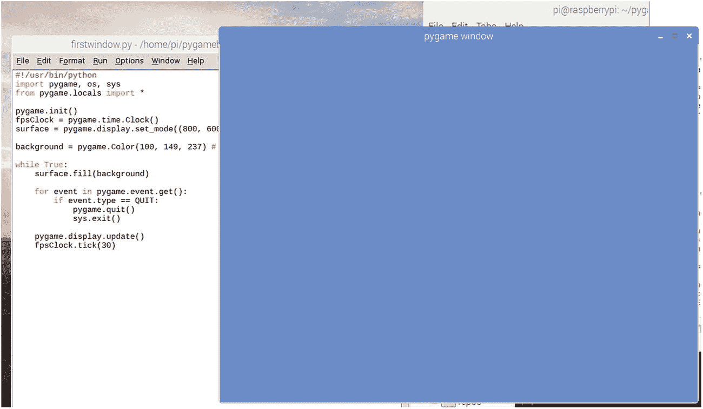
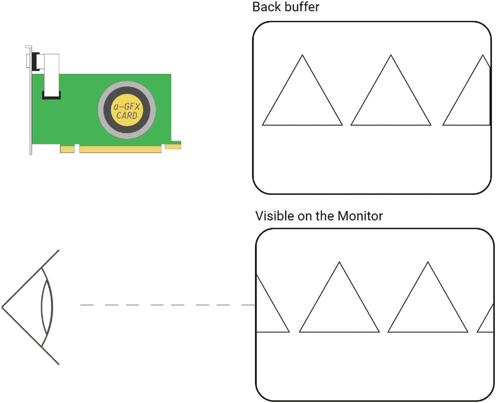
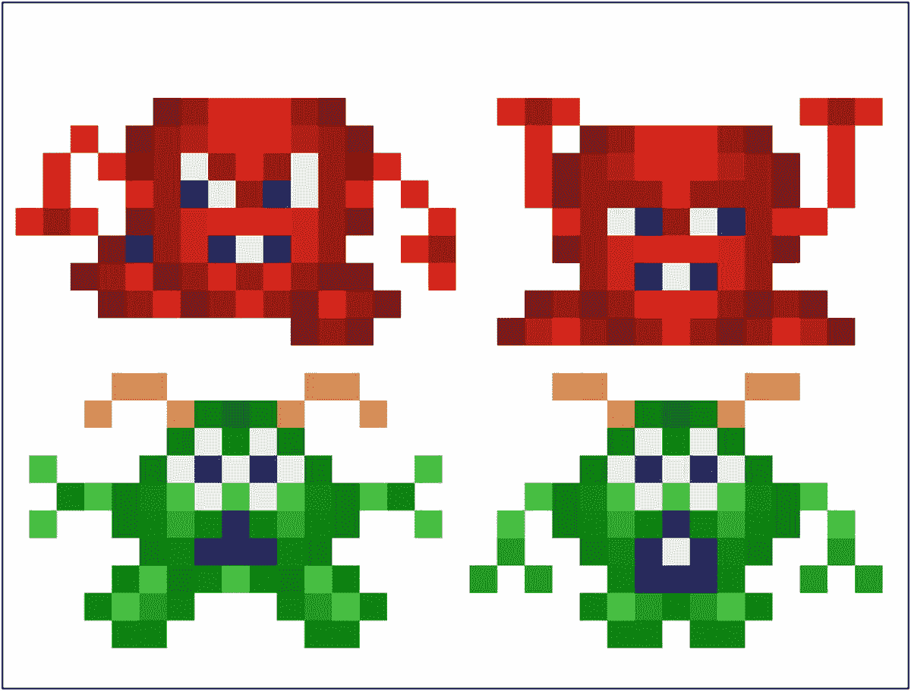

# 9.PyGame 基础介绍

PyGame 是一个免费的 Python 框架，它提供了用于编写视频游戏的模块。它建立在简单的 DirectMedia 层库(SDL)之上，该层库提供了对声音和视觉元素的简单访问。

在这一节中，我们将看到如何设置 PyGame，以及在我们未来的程序中会用到的一些元素。Python 语言不包含 PyGame，因此在使用之前必须导入框架。

## 导入 PyGame 框架

在 Python 中，通过“import”关键字导入模块。要导入 PyGame，您需要在脚本的顶部添加下面一行，在 hash-bang 之后:

```py
import pygame, os, sys
from pygame.locals import *

```

第一行导入 PyGame 模块及其对象，以及 OS 和系统模块。import 关键字不直接在当前符号表中输入 pygame、os 和 sys 中定义的对象的名称。它只输入模块名。要访问每个模块的元素，我们必须使用模块名，这就是为什么我们必须编写 pygame.locals。第二行说明我们将从 pygame 框架导入常量，就好像它们是在本地定义的一样。在这种情况下，我们不需要给每个常量加上前缀“pygame”“from”关键字是 import 关键字的变体，它允许我们导入模块元素，就好像它们是在我们的(本地)代码库中定义的一样。

## 正在初始化 PyGame

在使用框架中的任何对象之前，您必须首先初始化它。我们还希望将更新限制在每秒 30 帧，因此我们添加了一个 fpsClock 变量，并将其初始化为每秒 30 帧。

```py
pygame.init()
fpsClock = pygame.time.Clock()
surface = pygame.display.set_mode((800, 600))

```

第一行初始化 PyGame。第二行创建一个对象的实例，并将该值存储在“fpsClock”中。对象是一个类的实例。我们将在面向对象部分详细讨论这一点。Python 中的一切都是对象，这也是这门语言的魅力所在；但是现在，我们只能说你可以创建你自己的数据类型。这些用户定义的数据类型称为“类”

第三行创建了一个表面，我们可以在上面绘制图像(背景和精灵)。set_mode()方法采用两个参数，以像素为单位指定表面的宽度和高度。在本例中，我们创建了一个 800 × 600 像素的表面。

在我们在屏幕上画画之前清理屏幕是一个好习惯。因此，我们将创建一个包含背景的红色、绿色和蓝色成分的元组，而不是凭空提取数字。屏幕上的像素由红色、绿色和蓝色组合而成。这些比率决定了显示什么颜色。例如,( 0，0，0)是黑色,( 255，255，255)是白色。元组按顺序表示组成颜色的红色、绿色和蓝色组合。所以，(255，0，0)是红色的，(0，0，255)是蓝色的。

```py
background = pygame.Color(100, 149, 237) # cornflower blue

```

在这个例子中，我选择了矢车菊蓝，因为它不是你经常看到的颜色，所以当窗口出现时，你就知道程序已经工作了。

## 主循环

一些程序，特别是那些从命令行运行的程序，倾向于执行一系列任务并退出。对于大多数窗口环境程序和游戏来说，这是不正确的。这些程序保持活动状态，直到用户明确退出。在执行过程中，它们执行所谓的主循环。这包含一系列重复执行直到程序结束的语句。主循环是

```py
while True:

```

这将程序保留在内存中，因为它在条件为“真”时执行循环。因为条件实际上为“真”，所以循环将总是执行。

```py
    surface.fill(background)

```

在屏幕上画任何东西之前，我们首先清理表面。这将删除之前的内容，让我们重新开始。

```py
    for event in pygame.event.get():
        if event.type == QUIT:
            pygame.quit()
            sys.exit()

```

PyGame 为我们提供了来自窗口管理器的事件:按键、按钮点击和窗口关闭请求。当我们收到窗口关闭请求(“退出”)时，我们将停止 PyGame 并退出应用程序。在循环过程中会发生许多事件，这些事件保存在一个我们可以迭代的列表中。因此，我们必须检查每个事件，看看它是什么类型，然后采取行动。在我们的基本框架中，我们只检查“退出”事件。

```py
    pygame.display.update()
    fpsClock.tick(30)

```

pygame.display.update()方法重绘屏幕。当你在屏幕上放置对象时，它会被拉到一个叫做后台缓冲区的内存区域。当调用 update 时，这个后台缓冲区变得可见，并且当前显示数据的缓冲区(前台缓冲区)成为后台缓冲区。这允许平滑移动并减少闪烁。

在“pygamebook”文件夹中创建一个名为“ch9”的文件夹。将本章中已经介绍过的代码保存到一个名为“firstwindow.py”的新文件中。当运行程序时，你应该会看到一个矢车菊蓝色的窗口出现(图 [9-1](#Fig1) )。



图 9-1。

显示矢车菊蓝色背景的 PyGame 窗口

单击右上角的“X”按钮关闭窗口。

大多数现代视频卡有两个内存区域；两者都用于向用户显示图像，但是一次只显示一个。这种技术被称为双缓冲，如图 [9-2](#Fig2) 所示。


图 9-2。

现代图形适配器中的双缓冲

从用户的角度来看，他们看到监视器上可见的项目。但是在幕后，程序正在绘制到后台缓冲区。随着电子手指的轻弹，用户看到了后台缓冲区中的图像。图 [9-3](#Fig3) 显示了发生的情况。



图 9-3。

前台和后台缓冲区的内容

剧院已经使用这种技术来隐藏场景的变化。当演员们在舞台上时，幕布后面一个新的场景正在上演。当演员的场景结束时，幕布打开，新的场景展现出来。

最后，我们希望将更新限制在每秒 30 帧。为此，我们调用 fpsClock.tick(30)。这确保了我们在游戏中获得一致的时间。这是时钟可以运行的最大值，但不是最小值。您可能会在游戏中执行复杂的计算，这可能会降低帧速率。当你开始编写比本文中介绍的更复杂的游戏时，你需要意识到这一点。

## 图像和表面

PyGame 使用表面将图像绘制到屏幕上。它使用图像模块从磁盘加载图像文件。然后将它们转换为内部格式并存储在曲面对象中，以备后用。您将为主屏幕创建至少一个曲面对象。这将是你要在其上绘制精灵和其他图像的对象。

我们执行主绘图的表面是后台缓冲区。然后，我们通过调用 update()方法将这个后台缓冲区呈现给屏幕。

## 创建图像

在大多数情况下，您会希望在第三方产品中创建图像，例如位于 [`www.gimp.org`](http://www.gimp.org) 的开源 GIMP (GNU 图像处理程序)。GIMP 是与 Photoshop 齐名的专业级图形程序。如果你像我一样，在职业生涯的大部分时间里都在使用 Photoshop，你可能会发现一开始使用 GIMP 有点令人沮丧——这不是应用程序的错！只要放松，你就能像在 Photoshop 中一样创建图像！任何允许您生成 BMP、PNG 和 JPG 图像的图像创建程序都可以。附录中有一个清单。如果你被图片困扰，这本书的网站( [`http://sloankelly.net`](http://sloankelly.net) )上有一些(糟糕的)图片可以帮助你。有些图片是通过 GPL (GNU 公共许可证)成为 SpriteLib 的一部分；这意味着这些图像可以免费用于商业和非商业用途。

## 加载图像

Python 使用表面在屏幕上绘制图像。当你把一幅图像装入内存时，它被放在一个特殊的表面上。例如，加载一个名为“car.png”的图像:

```py
image = pygame.image.load('car.png')

```

这将把图像加载到内存中，并在“图像”中放置一个对新加载对象的引用

## 绘制图像

图像绘制在 PyGame 表面上。记得在我们的骨骼游戏中，我们创建了一个用于在屏幕上绘制图像的表面。要绘制图像:

```py
surface.blit(image, (0, 0))

```

其中“surface”是表面实例，“image”是您要在屏幕上绘制的图像。第二个参数是您希望在屏幕上绘制图像的位置。

## 屏幕坐标和分辨率

屏幕或监视器是计算机系统的主要输出设备。有两种不同类型的屏幕:阴极射线管(CRT)和液晶显示器(LCD)。后者越来越便宜，因此更受欢迎，还是因为它受欢迎而更便宜？计算机以给定的分辨率向监视器输出图像。分辨率意味着“多少像素？往下多少像素？”物理屏幕分辨率以像素为单位。像素这个词是像素的简称。您的电脑有多种分辨率可供选择，从 320×240 像素到 2560×1600 像素甚至更高。

计算机内部的图形卡与 CPU 一起在显示器上产生图像。对于较新的图形卡，图形处理器单元(GPU)放置在卡上，以提高系统的 3D 功能-通过提供更高的分辨率、特殊效果和更好的帧速率，使游戏更加逼真。

分辨率定义了图像在屏幕上的显示细节。列数(水平轴)和行数(垂直轴)定义了应用程序可用的像素数。在下面的例子中，显示了 1920×1080 分辨率的屏幕地图。不管你的显示器运行的分辨率是多少，原点在左上角，它的坐标总是(0，0)。参见图 [9-4](#Fig4) 。


图 9-4。

1920×1080 显示器的屏幕坐标

## 精灵表

Sprite sheets 通常用于将角色动画的所有帧保存在一个图像上。这个名字来自于一个精灵，用计算机术语来说，是一个在游戏中用作化身的小图像。图 [9-5](#Fig5) 显示了一个子画面示例。



图 9-5。

四图像子画面

这个 sprite 表包含四个图像:两个空间入侵者角色的两帧动画。当我们想要在屏幕上绘制字符时，我们选择使用 sprite 工作表的哪个单元格。单元格由精灵的高度和宽度决定。在这种情况下，我们有 32×32 像素的精灵，这意味着我们的精灵表是 64×64 像素，因为我们有 2×2 个精灵。

PyGame 允许我们显示我们想要显示的图像的一部分。因此，举例来说，如果我们只想显示第一个入侵者的第二帧(图像的右上角),我们可以使用这样的行:

```py
surface.blit(image, (0, 0), (32, 0, 32, 32))

```

第三个参数，即包含四个值的元组，是我们希望在(0，0)处显示的图像区域。元组表示要显示的图像的(x，y，width，height)。

## 完整列表

本章中程序的完整列表如下所示:

```py
import pygame, os, sys
from pygame.locals import *

pygame.init()
fpsClock = pygame.time.Clock()
surface = pygame.display.set_mode((800, 600))

background = pygame.Color(100, 149, 237) # cornflower blue

while True:
    surface.fill(background)

    for event in pygame.event.get():
        if event.type == QUIT:
            pygame.quit()
            sys.exit()

    pygame.display.update()
    fpsClock.tick(30)

```

## 结论

本章介绍了我们将在每个游戏中使用的基本循环，以及如何初始化 PyGame。调用 pygame.display 对象上的 set_mode()并返回一个将被用作后台缓冲区的表面，我们的所有图像都将显示在该表面上。

使用 image.load()方法将图像加载到内存中，并使用其 blit()方法在图面上绘制图像。图像可以包含多个形状，这些形状被称为 sprite sheets。通过指定要绘制的框架的矩形，可以绘制 sprite 工作表的单个框架。