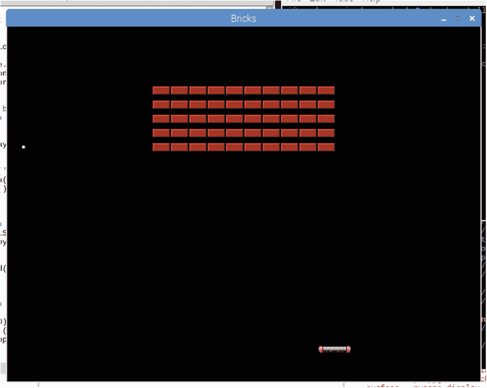
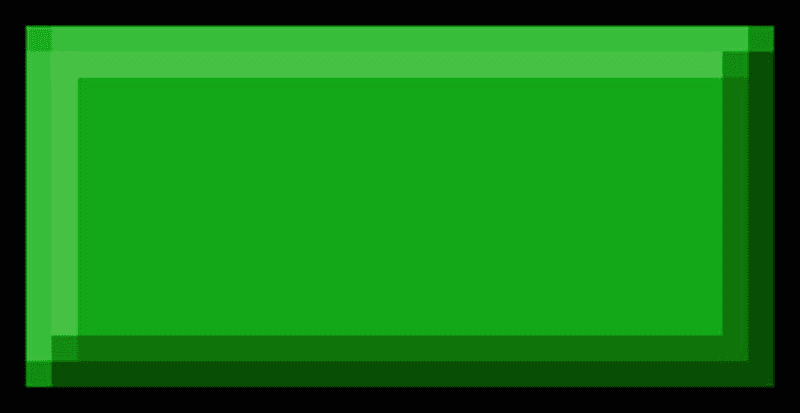
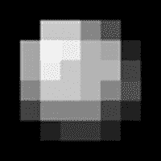
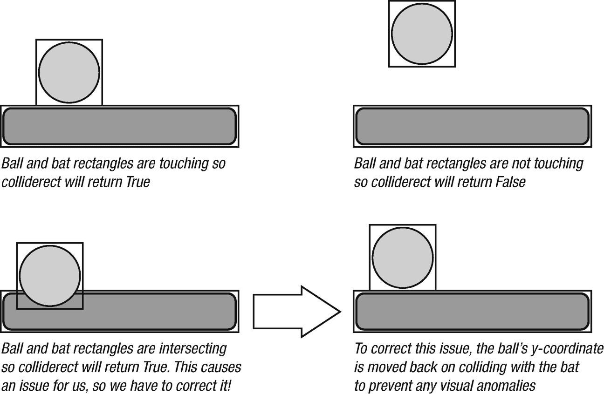

# 十一、游戏项目：打砖块

在这一章我们将回顾砖块，我们的第一个游戏项目。对于没玩过这个游戏的人来说，你在屏幕下方控制一个球棒(图 [11-1](#Fig1) )。你的上方有一堆砖块，你必须用球击碎所有的砖块。

听起来很简单，但是在这个项目中，我们将学习



图 11-1。

主砖块播放屏幕

*   球员运动

*   自动(非玩家)移动

*   冲突检出

*   显示图像

## 主要框架

我们将在这一节打下主要框架，让你对整个游戏的结构有一个大致的了解。为了让我们的第一个游戏简单，不会有任何中间画面，比如闪屏、菜单、暂停屏等等。

框架中将有占位符注释，指示在整个项目过程中将添加新行的点。

```py
#!/usr/bin/python
import pygame, os, sys
from pygame.locals import *

pygame.init()
fpsClock = pygame.time.Clock()
mainSurface = pygame.display.set_mode((800, 600))
pygame.display.set_caption('Bricks')

black = pygame.Color(0, 0, 0)

# bat init
# ball init
# brick init

while True:
    mainSurface.fill(black)
    # brick draw
    # bat and ball draw
    # events
    for event in pygame.event.get():

        if event.type == QUIT:
            pygame.quit()
            sys.exit()

    # main game logic
    # collision detection

    pygame.display.update()
    fpsClock.tick(30)

```

在“pygamebook”文件夹中创建一个名为“bricks”的新文件夹。将文件保存在那里，并将其命名为“bricks.py”。

## 形象

游戏中使用了三幅图像，都可以从该书网站的参考资料部分下载( [`http://sloankelly.net`](http://sloankelly.net) )。如果您不想使用这些图像，您可以创建自己的图像。然而，该游戏为每个图像假定了以下尺寸。参见图 [11-2](#Fig2) 至 [11-4](#Fig4) 。



图 11-4。

Brick.png 31×16 像素


图 11-3。

Bat.png 55×11 像素



图 11-2。

Ball.png 8×8 像素

## 移动球棒

用户使用他们的鼠标控制球棒。我们通过忽略鼠标上 y 轴的变化，将移动限制在 x 轴上。球棒也被限制只能在屏幕范围内移动。在比赛过程中，球棒必须留在比赛场地(屏幕)内。

### Bat 初始化

在框架中找到以下代码行:

```py
# bat init

```

在那一行下面，添加几个空行给你一些空间。键入以下内容:

```py
bat = pygame.image.load('bat.png')

```

我们的 bat 作为一个名为‘bat’的曲面加载到内存中。不需要叫这个，但是把你的变量叫做有意义的东西是有意义的。例如，你也可以称它为“batImage”或“batSprite”。

```py
playerY = 540

```

我们的玩家的移动被限制在 x 轴上，所以他们在屏幕上总是在 540 像素的高度。这相当接近底部；请记住，随着 y 轴值的增加，您会在屏幕上移动得更远。

```py
batRect = bat.get_rect()

```

蝙蝠的矩形将在我们以后的碰撞检测计算中使用。

```py
mousex, mousey = (0, playerY)

```

我们给鼠标坐标一个默认值。注意我们在这里使用了一个元组。我们也可以这样写这一行:

```py
mousex = 0
mousey = playerY

```

这占了两行，并没有暗示我们的价值观是什么；它们在屏幕上代表蝙蝠在 2D 空间的坐标。

### 画蝙蝠

每次执行主循环时，我们在一行中清除主表面，它已经包含在主循环中:

```py
mainSurface.fill(black)

```

这用黑色填充了主表面，这样我们就可以在上面画其他的东西了！向下滚动到这一行:

```py
# bat and ball draw

```

并在其后添加下面一行:

```py
mainSurface.blit(bat, batRect)

```

保存并运行游戏。你看到了什么？球棒应该在屏幕的左上方。但是为什么会这样呢？答案就在“batRect”再看一下“batRect”的初始化:

```py
batRect = bat.get_rect()

```

这将包含球棒的尺寸:

*(0，0，55，11)*

这意味着图像将在(0，0)处绘制。是时候移动球棒了。

### 移动球棒

移动球棒分两步完成:

*   捕获鼠标输入

*   在新位置绘制蝙蝠图像

向下滚动到标有

```py
# events

```

将下面的代码改为:

```py
for event in pygame.event.get():
    if event.type == QUIT:
        pygame.quit()
        sys.exit()
    elif event.type == MOUSEMOTION:
        mousex, mousey = event.pos
        if (mousex < 800 - 55):
             batRect.topleft = (mousex, playerY)
        else:
             batRect.topleft = (800 - 55, playerY)

```

那是许多标签！注意制表符的位置，否则你的代码将不起作用。

#### 事件

事件是由 Windows 管理器生成的，无论是在 Microsoft Windows、Mac OS 下，还是在 Linux 操作系统下的 X-Windows 管理器，比如在 Raspberry Pi 上运行的那个。应用于当前活动窗口的事件由系统传递给它进行处理。您只需要检查想要对其执行操作的事件。在这个游戏中，我们只对检查这个感兴趣:

*   用户关闭窗口

*   移动鼠标的用户

*   用户点击鼠标按钮(稍后)

#### 退出事件

根据需要，每个事件都作为带有附加参数的事件类型传递。对于 QUIT 事件，没有附加参数。QUIT 只是给应用一个关闭的信号，我们通过退出 PyGame 和程序本身来完成。

#### 鼠标移动事件

当用户移动鼠标时，信息从硬件(鼠标、物理接口、一些控制器芯片)通过一些低级操作系统驱动程序传递到当前活动的应用。在这种情况下，我们的游戏。随之而来的是鼠标的位置以及任何被按下的按钮。与所有事件一样，只有当事件发生时(在这种情况下，鼠标被移动)，才会传递此消息。

鼠标移动的事件类型是“MOUSEMOTION ”,有一个名为“pos”的参数，其中包含鼠标的位置。“pos”是一个包含鼠标位置的 x 和 y 坐标的元组。

新的 x 坐标被限制在屏幕的范围内，然后赋给“batRect”变量的“topleft”属性。

保存并运行程序。蝙蝠现在会随着鼠标的移动而移动。如果没有，或者出现错误，请检查您的代码。这可能是一个迷路或丢失的标签。

## 移动球

移动球完全是用代码完成的，不需要用户输入，除了第一次点击鼠标按钮让事情滚动，如果你原谅这个双关语的话。

### 球初始化

球的初始化看起来非常类似于球棒的初始化。在代码中找到这一行:

```py
# ball init

```

在下面添加以下几行:

```py
ball = pygame.image.load('ball.png')
ballRect = ball.get_rect()
ballStartY = 200
ballSpeed = 3
ballServed = False
bx, by = (24, ballStartY)
sx, sy = (ballSpeed, ballSpeed)
ballRect.topleft = (bx, by)

```

前两行加载图像并捕获它的矩形。接下来的两行设置了起始 y 坐标和速度的默认值。在后面的代码中，变量“ballServed”用于确定球是否被发球。剩下的几行设置了球的初始位置和速度。

向下滚动代码到

```py
# bat and ball draw

```

添加以下行在屏幕上绘制球:

```py
mainSurface.blit(ball, ballRect)

```

保存并运行游戏。现在你会在屏幕的左上角看到球。如果您不知道，请对照上面写的代码行检查您的代码。打字错误或错别字是很常见的，即使是经验丰富的程序员也不例外！

### 球运动

球的移动是通过将球的速度加到当前位置来实现的。这是物理方程式:

*速度=距离/时间*

我们如何用代码做到这一点？向下滚动到这样一行

```py
# main game logic

```

计算距离的公式是

*距离=速度×时间*

因为我们的速率固定为每秒 30 帧，所以我们将每 1/30 秒向当前位置添加一次速度。这意味着 1 秒钟后，我们的球将会运行

*30 × 3 = 90 像素*

所以，球的实际速度是每秒 90 像素。

就在“主游戏逻辑”注释行之后，添加以下代码并运行游戏:

```py
bx += sx
by += sy
ballRect.topleft = (bx, by)

```

这里引入了一个新的符号。+=运算符用于将运算符左侧的值与右侧的值相加，并将总和放入运算符左侧的变量中。是 bx = bx + sx 的简称。还有其他简短形式的操作符，如–=(减)、×=(乘)和/=(除)，它们遵循我们为+=概述的规则。球现在将缓慢地从屏幕的左上角沿对角线移动到右下角。如果它击中了球棒会怎么样？当它到达屏幕的末端时会发生什么？没什么；球正好穿过球棒，掠过屏幕边缘。

让我们补救这种情况。首先，我们将把球夹在屏幕区域的范围内。我们的屏幕尺寸是 800×600 像素。我们的球的大小是 8×8 像素。我们将使用一些布尔逻辑来确定，从球的位置，如果它击中了边缘。如果是这样，我们将逆转速度。这意味着在下一个循环中，球将向相反的方向移动，如图 [11-5](#Fig5) 所示。


图 11-5。

球击中侧壁，显示沿 x 轴方向反转

图 [11-5](#Fig5) 显示了碰撞的两个阶段:检测和响应。检测——两个物体相撞了吗？反应——我们该怎么办？在这种情况下，我们检测球是否接触到屏幕的外部边缘，我们的反应是将球反射回它来的方向。

> *检测确定两个物体是否接触过*

> *反应是两个物体碰撞时执行的动作*

在焊球位置更新代码后添加一到两行空行，并添加以下内容:

```py
if (by <= 0):
    by = 0
    sy *= -1

```

球的 y 坐标与 0 进行比较，0 是显示屏上最上面的一行像素。记住屏幕左上方是(0，0)，最下方是最大尺寸；在我们的例子中，就是(800，600)。这段代码将确保屏幕最顶端的边界反射球。球只在 y 轴上反射，因为我们碰到了屏幕的垂直边界，在这种情况下是顶部边缘。

对屏幕底部做同样的操作。在这种情况下，我们必须从最底部的数字中减去球的大小。我们的球是 8×8 像素，所以这意味着我们必须减去 8。请记住，当我们在屏幕上绘制图像时，我们是从图像的左上角开始绘制的:

```py
if (by >= 600 - 8):
    by = 600 - 8
    sy *= -1

```

屏幕的侧面将反映在 x 轴上，而不是 y 轴上:

```py
if (bx <= 0):
    bx = 0
    sx *= -1

```

这将在左侧边缘反射球(当 x 为 0 时)。最后，当我们在右边时(当 x 是 800–8 或 792 时)，我们将进行反思:

```py
if (bx >=800 - 8):
    bx = 800 - 8
    sx *= -1

```

保存并运行游戏。现在你会看到球在屏幕上反弹。但它仍然会穿过蝙蝠。我们需要在游戏中添加更多的代码，让它与球棒发生碰撞，这样它就会在屏幕上弹起。

### 球棒和球的碰撞

球棒和球碰撞的工作方式类似于检查屏幕底部的碰撞。我们将使用 rect 类的 colliderect 方法来确定是否发生了冲突。

在您键入的最后一个代码后添加几个空行，并添加

```py
if ballRect.colliderect(batRect):
    by = playerY - 8
    sy *= -1

```

colliderect 接受单个参数，该参数表示我们要对其进行碰撞检查的矩形。colliderect 方法根据矩形是否相交返回布尔值“真”或“假”。见图 [11-6](#Fig6) 。



图 11-6。

显示接触、不接触和相交的碰撞矩形

左上角的图像显示，当两个矩形接触时，colliderect 将返回“True”。右上方的图像显示，当两个矩形不接触时，colliderect 将返回“False”。

下面两张图片显示了球棒和球相交时发生的情况。Colliderect 将返回“True ”,因为两个矩形接触，但在代码中，我们必须向上移动球的位置，使它们不接触。这阻止了任何异常现象的发生；如果你从侧面击球，球会进入球棒内部！通过替换球来接触球棒的顶部，我们绕过了这个问题，这条线:

```py
by = playerY - 8

```

是解决问题的方法。保存并运行代码，你就可以用球棒把球击回屏幕。

### 发球

到目前为止，我们只是在比赛开始时发球。我们希望将发球限制在用户点击鼠标左键的时候。首先，如果球没有被发球，我们将停止球的运动。找到线:

```py
# main game logic

```

您应该会看到下面的这几行:

```py
bx += sx
by += sy
ballRect.topleft = (bx, by)

```

将这几行改为

```py
if ballServed:
    bx += sx
    by += sy
    ballRect.topleft = (bx, by)

```

保存并运行游戏将显示球停留在左上角。

要让它动起来，我们必须将“ballServed”改为“True”为了做到这一点，我们必须响应玩家点击鼠标左键。这在代码的事件部分。向上滚动到事件部分，在最后一个“elif”块后添加以下行:

```py
elif event.type == MOUSEBUTTONUP and not ballServed:
    ballServed = True

```

MOUSEBUTTONUP 测试鼠标上的任何按钮是否被“按下”。所以，真的，右键也可以。我们还测试了 ballServed 已经为“真”的情况。如果球已经发了，我们不需要再发一次。

## 砖墙

我们快到了！这个谜题的最后一块是玩家必须摧毁的砖墙。如本节开头的屏幕截图所示，我们将在屏幕中央排列砖块。

找到代码中的以下行:

```py
# brick init

```

添加以下行，列与上一行的井号(#)对齐:

```py
brick = pygame.image.load('brick.png')
bricks = []

```

再一次，我们加载一个图像，我们将使用它作为砖块。然后，我们创建一个空列表，在其中存储每块砖的位置。

```py
for y in range(5):
    brickY = (y * 24) + 100
    for x in range(10):
        brickX = (x * 31) + 245
        width = brick.get_width()
        height = brick.get_height()
        rect = Rect(brickX, brickY, width, height)
        bricks.append(rect)

```

我们的砖块排成五排，每排十块。我们将砖块位置存储在“砖块”列表中。我们的砖块位置存储为 Rect 实例，因为这将使以后的碰撞检测更容易。

向下滚动找到这行代码:

```py
# brick draw

```

在后面添加以下几行:

```py
for b in bricks:
    mainSurface.blit(brick, b)

```

保存并运行游戏。你现在会看到砖墙。再一次，你会注意到碰撞不起作用，所以球只是穿过墙壁。我们将在最后一节中解决这个问题。

### 砖块和球碰撞

我们的球棒和球在移动，我们的砖墙在展示。我们在这个项目中的倒数第二个任务是在球击中砖块时摧毁它们。这类似于球击中球棒，除了我们将移走被击中的砖块。幸运的是，PyGame 在 Rect 类上提供了一个名为 collidelist()的方法。

向下滚动源代码并找到

```py
# collision detection

```

你会记得我们的砖块只是一列长方形。collidelist()方法获取矩形列表，并返回命中的两个矩形的索引。我们将使用球的矩形作为测试的左侧，并将砖块变量作为函数的参数:

```py
brickHitIndex = ballRect.collidelist(bricks)
if brickHitIndex >= 0:
    hb = bricks[brickHitIndex]

```

捕获与 ballRect 矩形相交的砖块中包含的砖块矩形的索引。通俗地说，就是找出球碰到了哪块砖。如果没有击中砖块，该方法返回–1。所以，我们只对大于或等于零的值感兴趣。请记住，在 Python 中，列表从元素零(0)开始，而不是从元素 1 开始。

```py
    mx = bx + 4
    my = by + 4
    if mx > hb.x + hb.width or mx < hb.x:
        sx *= -1
    else:
        sy *= -1

```

然后我们计算球的矩形的中点，因为球是一个 8×8 的图像，所以它向内 4 个像素，向下 4 个像素。然后我们用被撞砖块的宽度来测试。如果球在宽度之外，那么球是从侧面被击中的。否则，球会击中砖块的顶部或底部。我们通过改变球的速度来相应地偏转球。

```py
    del (bricks[brickHitIndex])

```

因为我们击中了砖块，所以我们将它从列表中移除。

保存并运行游戏。当球击中砖块时，砖块将被移除，球将因击中而反弹。那么，点击屏幕底部呢？

### 出界

当球击中屏幕底部时，它应该被标记为出界。目前，我们还没有做到这一点，球只是从底部反弹。

向下滚动源代码，找到这样一行

```py
# main game logic

```

您将看到这段代码:

```py
if (by >= 600 - 8):
    by = 600 - 8
    sy *= -1

```

替换为

```py
if (by >= 600 - 8):
    ballServed = False
    bx, by = (24, ballStartY)
    ballSpeed = 3
    sx, sy = (ballSpeed, ballSpeed)
    ballRect.topleft = (bx, by)

```

当球击中屏幕底部时,“发球”标志被重置为“假”,表示球没有被发球。因为球还没发，就不更新了。该代码还将球的位置和速度重置为初始值。

保存并运行完整的游戏，点击任何鼠标按钮发球，并使用鼠标移动。

## 结论

你已经写了你的第一个游戏！这个游戏真正展示了 Python 和 PyGame 的威力，因为像这样的游戏包含以下内容:

*   鼠标移动

*   自动球运动

*   冲突

*   砖块毁坏

*   边界检查

这都可以在大约 120 行代码中实现。

现在我们已经有了第一个游戏，我们将花一些时间来学习更多关于 Python 语言的知识。