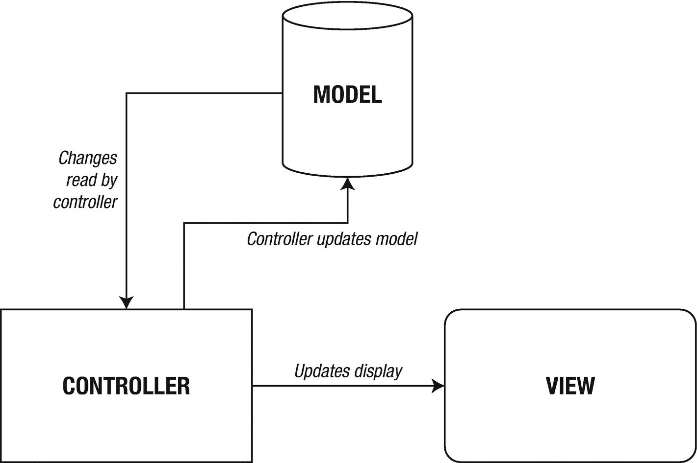
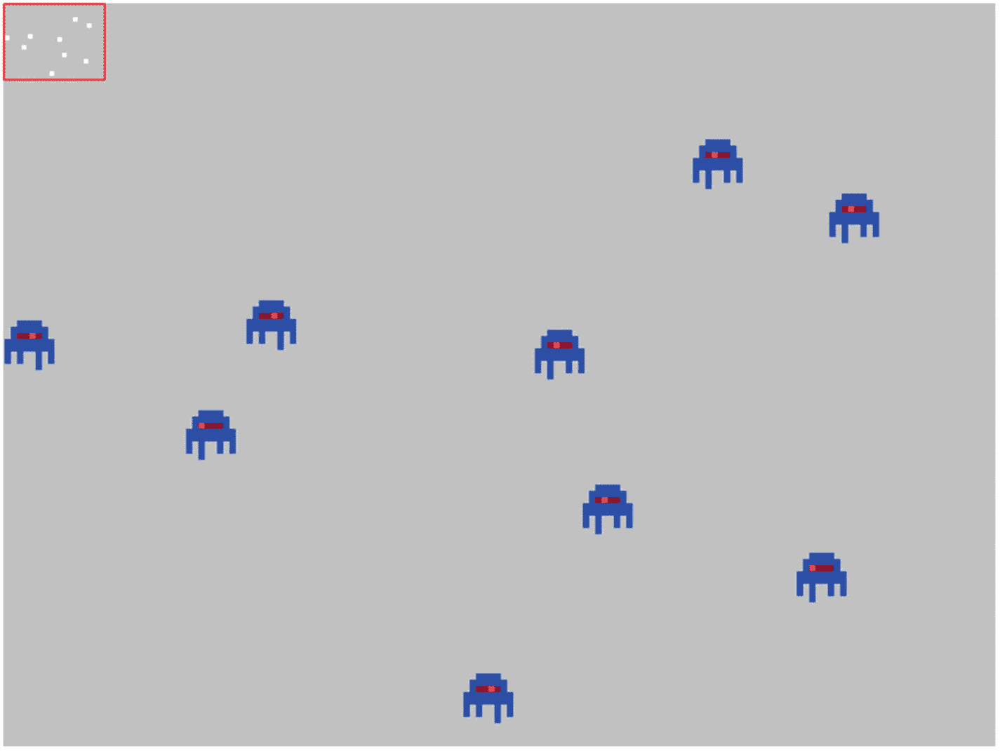

# 17.模型视图控制器

在“设计你的游戏”一节中提到过模型视图控制器，它描述了不同对象之间的交互如何被用来简化问题:将一个大问题分解成更小的更容易管理的块。见图 [17-1](#Fig1) 。



图 17-1

模型视图控制器设计模式

## 模型

模型表示与对象相关联的数据或属性。例如，一个玩家在空间中有一个位置，生命，护盾强度和得分。该模型通常只有很少的方法，可能与将数据保存或序列化到磁盘驱动器等廉价存储有关。这将用于保存游戏数据。然而，更有可能的是，您将拥有一个保存控制器，它将从模型中读取数据并存储它们。

## 视角

视图是游戏中每个模型的可视化表示。有些模型在游戏中没有直接的视觉表现。例如，与 RPG(角色扮演游戏)中的 NPC(非玩家角色)相关联的数据

## 控制器

控制器是连接模型和视图的粘合剂。玩家与视图交互(点击按钮，移动玩家)，这调用控制器上的一个方法。接着，控制器更新模型以表示新的状态。

在计算术语中，状态是对象或值的当前值。例如，在一种状态下，玩家可能在跳跃，而在另一种状态下，他们可能在奔跑。在每个状态中，内部变量(对象的字段)被设置为特定的值。

## 为什么要用 MVC？

MVC 允许你，程序员，把对象的功能从它的视觉表现和数据中分离出来。由于每个职责由不同的类处理，所以很容易更换不同的控制器和视图。

作为 MVC 的一个说明性例子，让我们创建一个小游戏，用光标键在屏幕上移动机器人。我们将添加第二个视图，它包含雷达视图中的一个小光点。我们首先将这些类分离到不同的文件中，然后使用另一个文件作为“粘合代码”将它们合并到一个游戏中，这是游戏的主要循环。见图 [17-2](#Fig2) 。



图 17-2

机器人“游戏”显示机器人在中间。雷达在左上方

### 上层社会

我们将要创建的类是

*   雷达视图

*   机器人控制器

*   机器人发电机

*   机器人模型

*   机器人视图

您不需要为您创建的每个类添加“模型”、“视图”和“控制器”，但是在这个例子中它清楚地向我们展示了什么类执行什么目的。

#### 雷达视图

雷达视图在窗口左上角的一个小屏幕上显示一个代表机器人的小光点。

#### 机器人控制器

机器人控制器根据玩家的输入改变模型的状态。

#### 机器人发电机

机器人生成器在指定的时间段后在屏幕上的随机位置生成一个机器人。也可以设置机器人的最大数量。

#### 机器人模型

机器人模型保存机器人的状态。它根本没有方法，只有数据。

#### 机器人视图

机器人视图在屏幕上显示机器人。它不改变机器人模型；它只是从模型中读取数据，并根据模型的状态决定显示什么。

### 文件夹

在“pygamebook”文件夹中创建一个名为“ch17”的新目录我们将在这个目录中创建所有文件。

### 机器人模型

名为 RobotModel 的模型类只包含机器人的数据。这个类的每个实例的更新将使用 RobotController 来完成，这个类将在后面定义。

创建一个名为“robotmodel.py”的新文件，并键入以下代码:

```py
class RobotModel(object):

```

类是用一个名字定义的。在我们的例子中，我们将根据预期的目的对每个类进行后置处理。您可能不想这样做，或者这样做可能没有意义。对自己的类名进行判断。

```py
    def __init__(self, x, y, frame, speed):

```

__init__ 方法(类定义中的函数称为方法)是一种特殊的方法，称为构造函数。它有四个参数，分别是机器人的起始位置、当前动画帧及其更新速度。第一个参数“self”是 Python 所必需的，指的是正在创建的对象。

```py
        self.x = x
        self.y = y
        self.frame = frame
        self.speed = speed
        self.timer = 0

```

我们将使用“定时器”成员字段来控制机器人的当前帧；它有一个“行走”动画。RobotModel 类的其余部分是访问和更改模型数据的方法:

```py
    def setPosition(self, newPosition):
        self.x, self.y = newPosition

    def getPosition(self):
        return (self.x, self.y)

    def getFrame(self):
        return self.frame

    def nextFrame(self):
        self.timer = 0
        self.frame += 1
        self.frame %= 4

```

RobotController 调用 nextFrame()方法将机器人移动到下一帧。它将帧计数加 1，然后使用模运算符(%)将 self.frame 字段箝位在 0 和 3 之间。

```py
    def getTimer(self):
        return self.timer

    def getSpeed(self):
        return self.speed

    def setSpeed(self, speed):
        self.speed = speed

```

这些 getter 和 setter 方法将由 RobotGenerator 和 RobotController 类使用。

> Getters 和 Setters 之所以被称为 Getters 和 Setters，是因为它们以“get”或“set”开头，用于访问包含在类实例中的数据

### 机器人视角

RobotView 类在机器人模型中的位置显示机器人的大图形。机器人使用的图形包含四帧，每帧为 32×32 像素。见图 [17-3](#Fig3) 。


图 17-3

机器人，一个 128×32 像素的图像，有四个 32×32 帧

当前帧是在 RobotController 类中计算的，我们一会儿就会看到。同时，创建一个名为 robotview.py 的新文件，并输入以下文本:

```py
import pygame
from pygame.locals import *

```

我们需要 Rect 类的这个导入。

```py
from robotmodel import RobotModel

```

我们的 RobotView 类使用 RobotModel，所以我们需要导入那个文件。

```py
class RobotView(object):
    def __init__(self, imgPath):
        self.img = pygame.image.load(imgPath)

    def draw(self, surface, models):
        for model in models:
            rect = Rect(model.getFrame() * 32, 0, 32, 32)
            surface.blit(self.img, model.getPosition(), rect)

```

draw()方法接受要在其上绘制机器人的表面以及模型列表。for 循环遍历“模型”中的每个机器人实例，并在表面上绘制它们。

因为我们只想显示一小部分 32×32 的图像。使用模型的框架计算要复制到屏幕的源区域。该模型有四个帧:0、1、2 和 3。如果这个值乘以 32，可能的矩形是(0，0，32，32)，(32，0，32，32)，(64，0，32，32)，(96，0，32，32)，如图 [17-4](#Fig4) 所示。


图 17-4

机器人动画的每一帧的开始坐标

### 雷达图

雷达视图在雷达屏幕上显示一个微小的光点(3×3 像素，白色)。雷达屏幕是一个 66×50 像素的图像，具有 1 像素的边框。见图 [17-5](#Fig5) 。


图 17-5

66×50 雷达图像

雷达的面积为 64×48 像素，但图形略大，以适应外部周围 1 像素的边框。雷达的比例尺是主播放区的 1:10，主播放区为 640×480 像素。这也是为什么光点是 3×3 像素，因为它非常接近机器人的 32×32 像素的实际大小。

创建名为 radarview.py 的新文件，并输入以下文本:

```py
import pygame
from robotmodel import RobotModel

class RadarView(object):

    def __init__(self, blipImagePath, borderImagePath):
        self.blipImage = pygame.image.load(blipImagePath)
        self.borderImage = pygame.image.load(borderImagePath)

```

构造函数有两个参数:一个是光标图像路径，另一个是边框图像路径。图像被加载并放置到字段中，供 draw()方法稍后使用。

```py
    def draw(self, surface, robots):
        for robot in robots:

```

draw 方法接受机器人将被绘制到的表面和机器人列表。

```py
            x, y = robot.getPosition()
            x /= 10
            y /= 10

            x += 1
            y += 1

            surface.blit(self.blipImage, (x, y))

```

代表机器人的‘信号’需要我们做一些数学计算。我们需要将坐标转换成介于 0..x 轴上的 639 和 0..479 设置为介于 0..雷达 x 轴上的 63 和 0..雷达的 y 轴是 47 度。这意味着我们必须将机器人的位置除以 10，再加上 1，因为记住我们的 1 像素雷达边界不算数。

```py
        surface.blit(self.borderImage, (0, 0))

```

最后，绘制边界，完成雷达视图。

### 机器人控制器

机器人控制器是将模型和视图结合在一起的粘合剂；它使用时钟来更新当前帧，并轮询键盘来读取玩家的输入。它使用这个输入根据机器人的速度(每秒像素)更新玩家的位置。

创建名为 robotcontroller.py 的新文件，并键入以下代码:

```py
from robotmodel import RobotModel

```

机器人的模型 RobotModel 是从 robotmodel.py 文件导入的，因为控制器类读取和写入机器人模型的值。

这意味着控制器改变游戏中每个机器人的状态。

```py
class RobotController(object):
    def __init__(self, robots):
        self.robots = robots

```

RobotController 的构造函数接受一个机器人列表，它将每帧更新一次。不是在每个对象上调用一个更新，而是调用一个更新方法 RobotController 的 update()方法一次，它更新每个模型。这是处理大量类似项目的一种非常有效的方式。

```py
    def update(self, deltaTime):
        for robot in self.robots:
            robot.timer += deltaTime
            if robot.getTimer() >= 0.125:
                robot.nextFrame()

```

每个机器人在一个循环中被处理。使用为每个机器人存储的数据，代码确定是更新下一帧还是通过改变其位置来移动对象(参见下文)。

与上次调用此方法的时间差，此时间被添加到模型的“timer”字段中。如果“计时器”大于或等于 0.125 秒，我们告诉模型移动到下一帧。

```py
            speed = self.multiply(robot.getSpeed(), deltaTime)
            pos = robot.getPosition()

            x, y = self.add(pos, speed)

            sx, sy = robot.getSpeed()

```

模型的位置会以每秒像素数乘以上次调用该方法的时间差的方式递增。这详细解释如下:

```py
            if x < 0:
                x = 0
                sx *= -1
            elif x > 607:
                x = 607
                sx *= -1

            if y < 0:
                y = 0
                sy *= -1
            elif y > 447:
                y = 447
                sy *= -1

            robot.setPosition((x, y))
            robot.setSpeed((sx, sy))

```

在这一系列 if 语句中，x 轴和 y 轴上的值被固定在屏幕上。然后在当前机器人模型上设置新的位置和速度。

```py
    def multiply(self, speed, deltaTime):
        x = speed[0] * deltaTime
        y = speed[1] * deltaTime

        return (x, y)

    def add(self, position, speed):
        x = position[0] + speed[0]
        y = position[1] + speed[1]

        return (x, y)

```

两个帮助函数使元组的工作变得更容易。元组是不可变的，这意味着我们不能改变任何元素的值。我们可以创造新的元组，但不能改变现有的元组。这两个辅助方法使得元组的乘法和加法变得稍微容易一些。

### 机器人发电机

最后一个类不是 MVC 模式的一部分，但是我需要一种方法来以随机的位置和速度生成机器人。为此，我创建了 RobotGenerator 类。创建一个名为“robotgenerator.py”的新文件，并输入以下代码:

```py
import random
from robotmodel import RobotModel

class RobotGenerator(object):
    def __init__(self, generationTime = 1, maxRobots = 10):
        self.robots = []
        self.generationTime = generationTime
        self.maxRobots = maxRobots
        self.counter = 0

```

RobotGenerator 的构造函数允许调用者(创建类实例的代码部分)指定创建机器人和机器人最大数量之间的秒数。“self.counter”字段以秒为单位存储当前时间。如果“self.counter”大于或等于“self.generationTime”，则创建一个机器人(参见以下更新)。

```py
    def getRobots(self):
        return self.robots

```

获取机器人列表。该方法有两种访问方式；它作为参数传递给 RobotController 构造函数，并作为参数传递给 RadarView 和 RobotView draw()方法。

```py
    def update(self, deltaTime):
        self.counter += deltaTime

```

计时器增加增量时间，增量时间本身是一秒的几分之一。

```py
        if self.counter >= self.generationTime and len(self.robots) < self.maxRobots:
            self.counter = 0
            x = random.randint(36, 600)
            y = random.randint(36, 440)
            frame = random.randint(0, 3)
            sx = -50 + random.random() * 100
            sy = -50 + random.random() * 100

            newRobot = RobotModel(x, y, frame, (sx, sy))
            self.robots.append(newRobot)

```

如果计数器达到某个时间(generationTime)并且机器人的数量小于机器人的最大数量，我们就在场景中添加一个新的机器人。生成的机器人的位置和速度是随机的。

## 确保恒定速度

我们希望确保物体运动时速度恒定。有时其他例程需要更长的时间来运行，我们无法确保这一点。例如，如果我们决定我们的机器人应该以每秒 200 像素的速度移动。如果我们假设我们的例程每秒调用 30 帧，那么我们应该每帧增加 6.25 帧。正确不对！

我们的机器人的位置应该每秒改变 200 个像素。如果玩家按住右光标键，机器人应该在 1 秒后向右移动 200 像素。如果 update 方法每秒只被调用 15 次会发生什么？这意味着我们的机器人在 1 秒钟内只会移动 15 × 6.25 = 93.75 个像素。

还记得在“Snake”中，当我们想要更新代码时，我们使用时钟的毫秒刻度来更新部分代码。我们可以使用这个时间增量来计算我们在游戏的单个“滴答”中需要行进的距离。游戏每循环一次，就是一个滴答。

这意味着即使有可变的帧速率，你仍然会有一个恒定的速度，因为增量时间将确保你的速度保持不变。

使用 delta time，您每秒 15 次的更新仍然会在按住右光标键 1 秒后产生 200 像素的位移。为什么呢？因为每一次更新，我们都要将期望的速度乘以上次呼叫后的几分之一秒。十五分之一秒，也就是 66 毫秒。

*0.066 × 200 =每次更新 13.2 像素*

*13.2 像素× 15 次更新=每秒 198 像素*

这大概是我们想要的速度。如果我们的帧速率增加到每秒 60 帧:

*每秒 60 帧是 16.67 毫秒*

*0.01667 × 200 =每次更新 3.333 像素*

*3.333 像素× 60 次更新=每秒 200.00 像素*

你可以看到每秒 60 帧，我们得到的速度比每秒 15 帧要精确得多。不过，对于我们的目的来说，每秒 30 帧已经足够满足我们的需求了。

## 主机器人程序

主机器人程序将所有这些单独的类组合成一个“游戏”例子。创建一个名为 robot.py 的新文件。在这个新文件中，添加以下代码:

```py
import pygame, sys
from pygame.locals import *

```

我们非常熟悉的导入来访问 PyGame 的例程和类库，以及 Python 提供的操作系统和系统库。

```py
from robotview import RobotView
from robotcontroller import RobotController
from robotgenerator import RobotGenerator
from radarview import RadarView

```

这些从各自的文件中导入机器人模型、机器人视图、雷达视图、机器人生成器和机器人控制器。我们使用“from”关键字来最小化所需的输入量。有了“from”，我们只需要输入类名，而不是“robotview”。机器人视图。

```py
pygame.init()
fpsClock = pygame.time.Clock()
surface = pygame.display.set_mode((640, 480))

```

接下来，我们初始化 PyGame 并设置一个时钟，这样我们可以将帧速率限制在每秒 30 帧。我们的测试游戏将是 640×480 像素大小。

```py
lastMillis = 0

```

“lastMillis”保持帧之间的最后毫秒数。该值由“fpsClock.tick()”返回。

```py
generator = RobotGenerator()
view = RobotView('robot.png')
radar = RadarView('blip.png', 'radarview.png')
controller = RobotController(generator.getRobots())

```

这是我们创建类的实例的地方。构造函数参数被传递。在这个例子中，我们只是使用硬编码的值，但是如果您愿意，您可以很容易地从文本文件中读取这些数据。

```py
while True:
    for event in pygame.event.get():
        if event.type == QUIT:
            pygame.quit()
            sys.exit()

```

我们的主循环有我们以前见过的越狱；当用户关闭窗口时，我们退出 PyGame，并向操作系统发出信号，表示我们正在退出应用程序。

```py
    deltaTime = lastMillis / 1000

    generator.update(deltaTime)
    controller.update(deltaTime)

```

通常，您希望在绘制它们的可视化表示之前更新您的类。生成器和控制器都需要更新调用，以便生成新的机器人，并更新已生成的机器人。记住，所有的控制器代码都在一个类中，如果我们改变了那个控制器类中的任何东西，我们所有的机器人都会受到影响。这个真的很厉害！

```py
    surface.fill((0, 0, 0))

    view.draw(surface, generator.getRobots())
    radar.draw(surface, generator.getRobots())

```

接下来，用黑色清除屏幕，fill()方法的元组用于颜色的红色、绿色和蓝色分量，黑色表示没有所有颜色，因此所有值都为零。首先绘制主视图，因此这将使用当前动画帧在其位置绘制所有机器人。接下来雷达被画在上面。

这就是所谓的抽签顺序。首先被绘制到屏幕上的图像被绘制在稍后绘制的图像之后。把它想象成放在桌子上的照片。放在最前面的会被放在最上面的遮住。

```py
    pygame.display.update()
    lastMillis = fpsClock.tick(30)

```

我们在主游戏循环中的最后动作是将前端缓冲区翻转到后端，反之亦然，并将帧速率固定在每秒 30 帧。“lastMillis”被存储，这将为我们提供生成最后一帧所花费的大致时间。这将用于确定每个机器人的位置和动画帧。

保存并运行游戏。大约一秒钟后，一个机器人会出现，然后一个接着一个，直到屏幕上出现十个。请注意,“雷达”视图会随着每个机器人的相对位置而更新。

## 结论

模型视图控制器设计模式可用于从功能上将一个对象分成三个独立的类。这使程序员能够决定以后如何组合这些类。例如，如果您只想在开发之初提供键盘支持，那么可以在稍后阶段轻松添加一个支持游戏杆的新控制器。这个新增加的内容不会影响视图或模型类。

如果你同时有很多 NPC 在屏幕上，MVC 是理想的。您可以使用一个类来存储它们的位置/帧数据(模型)，一个类来执行更新(控制器)，另一个类来显示它们(视图)。事实上，根据 NPC 的类型，你可以有不同的视图，例如，BlacksmithView 只画铁匠，ChefView 只画厨师。这减少了内存中的数据量，因为只有一个类(BlacksmithView)有铁匠图像的实例，只有一个类(ChefView)有厨师图像的实例。在一个更传统的 OOP 环境中，你可能会将位置和形状数据放在一起，这意味着你可能会在内存中存储成千上万的图像。