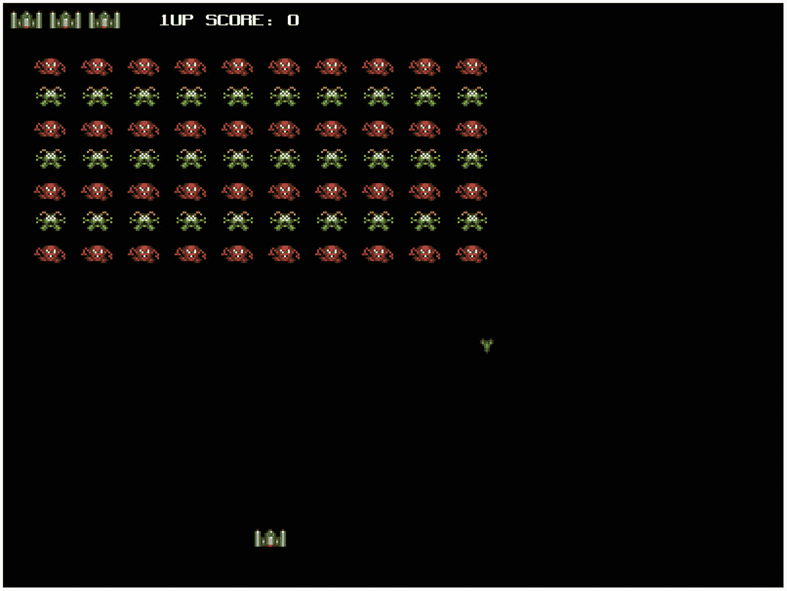
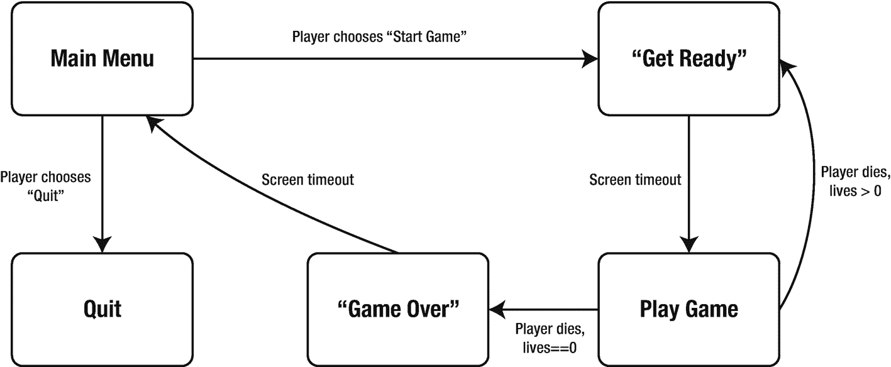
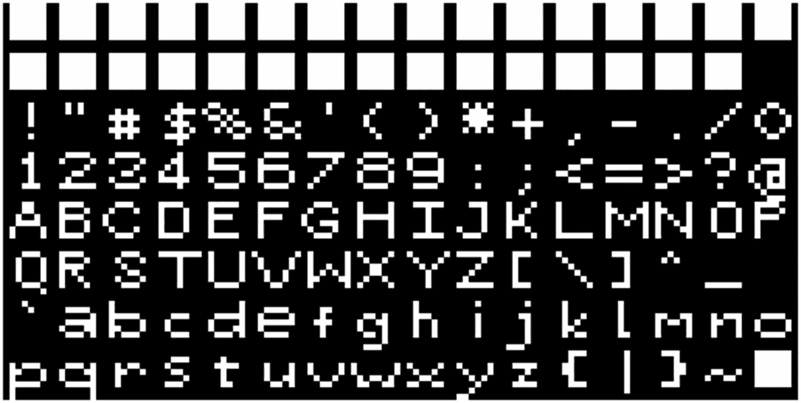
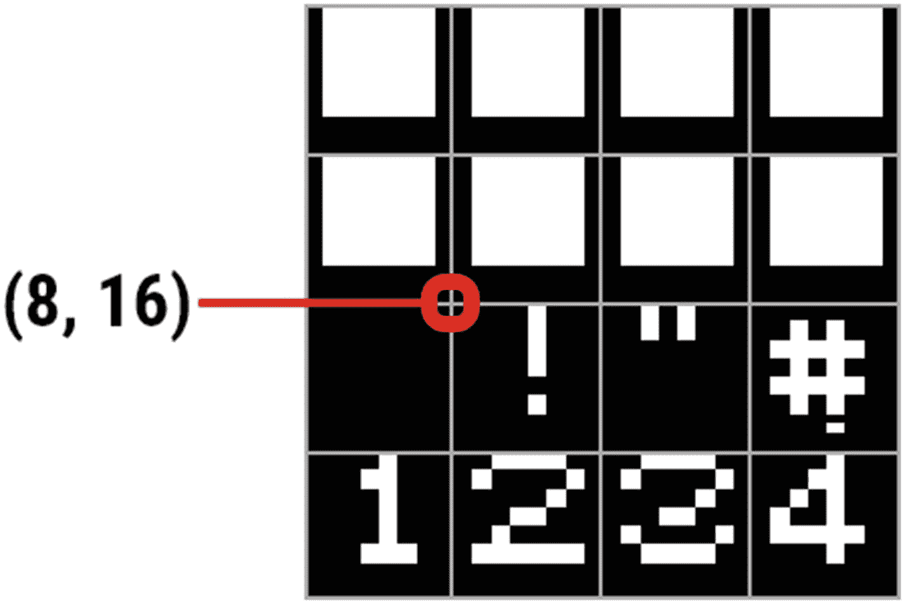
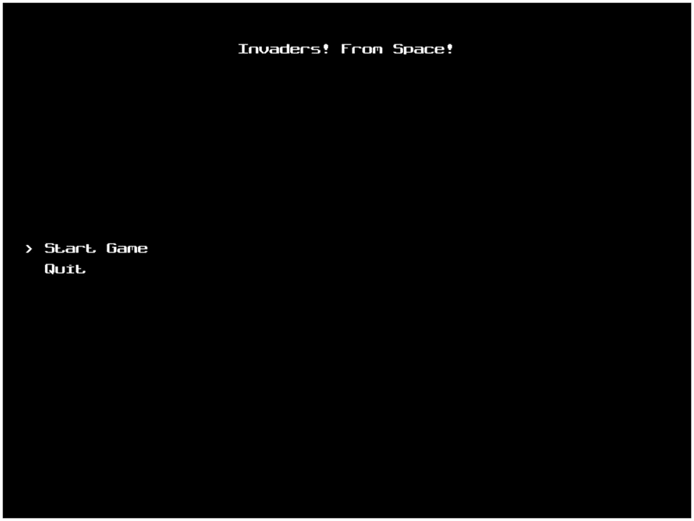

# 20.游戏项目:入侵者

我们最后一个街机风格的游戏项目是《入侵者》,它汇集了我们到目前为止所做的一切。我们将声音、动画、MVC 和 FSM 都打包在一个游戏中。见图 [20-1](#Fig1) 。



图 20-1。

入侵者行动游戏

在我们开始之前，在“pygamebook”中创建一个名为“projects”的新文件夹，如果还没有的话。在“项目”中，创建另一个名为“入侵者”的文件夹这是我们为这个项目创建的所有文件的存储位置。我们将在这个项目中使用几个文件，它们是

*   bitmapfont . py–包含位图字体的 sprite 表

*   Bullet . py–项目符号类

*   Collision . py–碰撞类别

*   Interstitial . py–间隙屏幕，即“准备就绪”和“游戏结束”屏幕

*   invaders . py——真正可运行的游戏；这是“主”程序，它创建框架并实例化所有对象

*   invaders game . py–实际的“玩游戏”状态类

*   menu . py“类”菜单

*   Player . py–播放器类

*   raspi game . py——你可以用来为你自己的游戏扩展的基类

*   swarm . py–外来虫群类

我们的音效有三个 WAV 文件:

*   爱丽丝梦游仙境

*   播放器. wav

*   playershoot.wav

我们还有几个 PNG 文件，包含所有入侵者的动画帧、播放器、显示字体(我们使用位图字体)和项目符号:

*   alienbullet.png 档案

*   bullet.png 格式

*   爆炸. png

*   fast tracker 2-style _ 12x 12 . png

*   invaders.png

*   船.png

整个源代码和所有资源(图像和声音文件)都可以从 [sloankelly 下载。net](http://sloankelly.net) 在参考资料部分。

## 上层社会

以下类别将被定义为该项目的一部分:

*   BitmapFont–允许在 PyGame 表面绘制位图字体。

*   BulletController、BulletModel、bullet view——项目符号实体的 MVC 类。子弹可以被一群外星人或玩家“拥有”。

*   collision controller–处理游戏的碰撞检测。这包括玩家/子弹和外星人/子弹以及玩家/外星人碰撞检测。

*   爆炸控制器、爆炸模型、爆炸模型列表、爆炸视图–爆炸实体的 MVC 类。当一个外来入侵者或玩家死亡时，会在他们的位置显示一个爆炸。

*   GameState–所有游戏状态的基类。

*   间隙状态——间隙屏幕在视频游戏中用来显示“游戏结束”或“准备好”的信息。这是程序的“存在状态”;因此，InterstitialState 是从名为“GameState”的 State 基类派生的。

*   入侵者模型，蜂群控制器，入侵者视图——外来入侵者蜂群的 MVC 类。每个外星人没有单独的控制者；取而代之的是“蜂群控制器”更新每个外星人的位置，并决定哪一个向玩家开火。

*   玩游戏状态-玩游戏状态。

*   主菜单状态–主菜单状态。

*   PlayerController、PlayerLivesView、PlayerModel、player view——“播放器”实体的 MVC 类。

*   RaspberryPiGame–包含我们在之前的程序中看到的主要更新循环。这实际上是有限状态管理器。

## 有限状态机

使用有限状态机(FSM)来控制游戏。图 [20-2](#Fig2) 中的图表显示了不同的状态以及游戏如何在它们之间转换。



图 20-2。

“入侵者”游戏有限状态机

游戏以主菜单状态开始，以“退出”游戏状态结束。正如你将会看到的,“退出”游戏状态并不是真正的状态；这实际上是国家的缺失。我们将游戏的当前状态设置为‘None ’,代码通过干净利落地退出程序来处理这个问题。在我们的实现中，每个状态的基类被定义为“GameState”

## MVC 和“入侵者”

每个实体(玩家、外星人群、外星人)都有相应的模型、视图和控制器类。对于外星入侵者，控制者处理不止一个外星实体。

## 框架

基本状态类和状态机管理器在一个名为“raspigame.py”的文件中定义。创建此文件并键入以下代码:

```py
import pygame, os, sys
from pygame.locals import *

class GameState(object):

```

游戏状态类定义了一个由 RaspberryPiGame 类使用的接口。每个状态管理游戏的特定功能。例如:主菜单，实际游戏，和间隙屏幕。GameState 类使用新的类定义格式。每个使用新格式的类都必须从对象扩展。在 Python 中，扩展类意味着将基类的名称放在类名后面的括号中。

```py
    def __init__(self, game):
        self.game = game

```

初始化游戏状态类。每个子类型都必须调用此方法。拿一个参数来说，就是游戏实例。

```py
    def onEnter(self, previousState):
        pass

```

基类“GameState”不包含 onEnter()的任何代码。扩展“GameState”的类应该提供自己的定义。这个方法是游戏在第一次进入状态时调用的。

```py
    def onExit(self):
        pass

```

基类“GameState”不包含 onExit()的任何代码。扩展“GameState”的类应该提供自己的定义。这个方法在离开状态时被游戏调用。

```py
    def update(self, gameTime):
        pass

```

基类“GameState”不包含任何用于 update()的代码。扩展“GameState”的类应该提供自己的定义。这个方法由游戏调用，允许状态自我更新。游戏时间(以毫秒为单位)是自上次调用该方法以来的时间。

```py
    def draw(self, surface):
        pass

```

基类“GameState”不包含 draw()的任何代码。扩展“GameState”的类应该提供自己的定义。这个方法被游戏调用，允许状态自己画。传递的图面是当前的绘图图面。

```py
class RaspberryPiGame(object):

```

基本的游戏面向对象的框架为树莓 Pi。用户创建“状态”,在任何特定时间改变屏幕上显示/更新的内容。这实际上只是一个美化了的国家经理。

```py
    def __init__(self, gameName, width, height):
        pygame.init()
        pygame.display.set_caption(gameName);

        self.fpsClock = pygame.time.Clock()
        self.mainwindow = pygame.display.set_mode((width, height))
        self.background = pygame.Color(0, 0, 0)
        self.currentState = None

```

类构造函数接受游戏的名字，这个名字将被用来改变窗口的标题栏。构造函数创建游戏的主窗口、FPS 时钟和默认背景色。当前状态最初设置为“无”

```py
    def changeState(self, newState):
        if self.currentState != None:
            self.currentState.onExit()

        if newState == None:
            pygame.quit()
            sys.exit()

        oldState = self.currentState
        self.currentState = newState
        newState.onEnter(oldState)

```

此方法从一种状态转换到另一种状态。如果有一个已存在的状态，则调用该状态的 onExit()方法。这将清除当前状态，并在退出时执行该状态需要执行的任何任务。除非 new state 为' None '，否则调用新状态的 onEnter 方法。如果新状态是“无”，那么游戏将终止。

```py
    def run(self, initialState):
        self.changeState( initialState )

        while True:
            for event in pygame.event.get():
                if event.type == QUIT:
                    pygame.quit()
                    sys.exit()

            gameTime = self.fpsClock.get_time()

            if ( self.currentState != None ):
                self.currentState.update( gameTime )

            self.mainwindow.fill(self.background)
            if ( self.currentState != None ):
                self.currentState.draw ( self.mainwindow )

            pygame.display.update()
            self.fpsClock.tick(30)

```

我们的主游戏循环，我们之前已经见过几次了，已经被移到 run()方法中。这处理所有的事件管理、状态更新和显示。

保存文件。

### 位图字体

在我们测试玩家的坦克和子弹之前，我们必须首先定义位图字体类。普通字体包含每个字符的数学表示。位图字体提供了一个 sprite 表，其中包含组成字体的所有单个字符。然后，我们使用 PyGame 的内置功能将 sprite sheet“切割”成单独的角色。见图 [20-3](#Fig3) 。



图 20-3。

摘自 [`https://opengameart.org/content/8x8-ascii-bitmap-font-with-c-source`](https://opengameart.org/content/8x8-ascii-bitmap-font-with-c-source) 的位图字体示例

感谢 OpenGameArt 上的用户‘dark rose’(一个很棒的资源！)作为本例中使用的样本位图字体。从上图中可以看出，字母表中的每个字母和符号都显示在一个网格中。它们按照在 ASCII(美国信息交换标准代码)字符集中出现的顺序排列。第一个可打印的字符是 space，讽刺的是它打印的是一个空格。空格是 ASCII 字符集中的第 33 个字符，因为我们从零开始编号，所以空格是 ASCII 32。

#### 切割图像

为了访问空格旁边的感叹号，ASCII 33，我们使用一些模和除法技巧来计算字符的行和列。

行的计算方法是:取字符的 ASCII 值(在本例中为 33)并除以列数:

```py
33 / 16 = 2

```

通过获取字符的 ASCII 值并用列数对其进行修改来计算列数:

```py
33 mod 16 = 1

```

所以，我们的性格(！)位于第 2 行第 1 列。然后，我们将这些值乘以每个单元中的像素数。我们的字符是从一个 8×8 的网格中生成的，所以我们将每个值乘以 8:

```py
2 * 8 = 16

1 * 8 = 8

```

组成感叹号的 8×8 网格起点的 x 坐标和 y 坐标为(8，16)，如图 [20-4](#Fig4) 所示。



图 20-4。

位图字体的特写，显示感叹号字符的 8×8 网格的像素起始位置

在“入侵者”游戏中，位图字体显示由 bitmap font 类处理。我们现在来定义这个类。创建一个新文件，并将其命名为“bitmapfont.py”。输入下面的代码并保存文件。

不过，这里有一个小小的转折。“入侵者”项目包含的字体没有第一个不可打印的 32 个字符。它以空格字符开始。这不是一个真正的问题，但它增加了一个额外的步骤，将字符下移 32 个位置。请注意 toIndex()方法。

```py
import pygame, os, sys
from pygame.locals import *

class BitmapFont(object):
    def __init__(self, fontFile, width, height):
        self.image = pygame.image.load(fontFile)
        self.cellWidth = width
        self.cellHeight = height
        width = self.image.get_rect().width
        height = self.image.get_rect().height
        self.cols = width / self.cellWidth
        self.rows = height / self.cellHeight

```

构造函数加载文件，并根据每个字符的宽度和高度，计算字符表的列数和行数。

```py
    def draw(self, surface, msg, x, y):
        for c in msg:
            ch = self.toIndex(c)
            ox = ( ch % self.cols ) * self.cellWidth
            oy = ( ch / self.cols ) * self.cellHeight

```

这是计算消息中当前字符在位图中的 x 和 y 偏移量的代码部分。

```py
            cw = self.cellWidth
            ch = self.cellHeight
            sourceRect = (ox, oy, cw, ch)
            surface.blit(self.image, (x, y, cw, ch), sourceRect)
            x += self.cellWidth

```

最后，将部分图像用位图传送到表面。

```py
    def centre(self, surface, msg, y):
        width = len(msg) * self.cellWidth
        halfWidth = surface.get_rect().width
        x = (halfWidth - width) / 2
        self.draw(surface, msg, x, y)

```

centre()方法计算消息的总宽度，并使其居中。

```py
    def toIndex(self, char):
        return ord(char) - ord(' ')

```

我们用于“入侵者”的位图字体从空格开始(ASCII 32)。我们使用 Python 提供的 order()函数来获取字符的 ASCII 值。减去空间的 ASCII 值得到位图字体的索引值。

### 间隙筛

间隙屏幕是显示在不同级别之间的图像(“准备好！”)当显示暂停屏幕或玩家死亡时，即出现“游戏结束”屏幕。创建一个名为“interstitial.py”的新文件，并键入以下代码:

```py
import pygame, os, sys
from pygame.locals import *
from bitmapfont import *
from raspigame import *
class InterstitialState(GameState):

```

我们的 InterstitialState 类扩展了 GameState。记住:如果我们从一个类扩展，我们把父类(或基类)的名字放在类名后面的括号里。

```py
    def __init__(self, game, msg, waitTimeMs, nextState):
          super(InterstitialState, self).__init__(game)

```

必须调用基类的构造函数。在 Python 下，子类名称和子类实例‘self’必须传递给 super()方法。Python 3.0 通过“语法糖”的方式“解决”了这个问题，只允许你调用 super()。但与 Raspberry Pi 一起发布的 Python 版本并非如此。

我们还必须直接调用构造函数；这就是为什么调用 __init__()方法的原因。基类的构造函数需要 RaspiGame 的一个实例，因此它被适时地传递给基类的构造函数。

```py
          self.nextState = nextState
          self.font = BitmapFont('fasttracker2-style_12x12.png', 12, 12)
          self.message = msg
          self.waitTimer = waitTimeMs

```

间隙状态的字段被初始化。

```py
    def update(self, gameTime):
          self.waitTimer -= gameTime
          if ( self.waitTimer < 0 ):
              self.game.changeState(self.nextState)

```

更新方法会一直等到计时器停止计时。当计时器到达零时，游戏被告知进入下一个状态。

```py
    def draw(self, surface):
          self.font.centre(surface, self.message, surface.get_rect().height / 2)

```

保存文件。

### 主菜单

主菜单包含两个项目:

*   开始游戏

*   放弃

和间隙屏幕一样，主菜单也是 GameState 的子类。创建一个名为“menu.py”的新文件，并输入以下代码:

```py
import pygame, os, sys
from pygame.locals import *
from raspigame import *
from bitmapfont import *

```

我们的主菜单状态使用 bitmap 字体类在屏幕上绘制文本，并且导入 raspigame 文件，因为 main menu state 是 GameState 的子类。GameState 在 raspigame.py 文件中定义。

```py
class MainMenuState(GameState):
    def __init__(self, game):
        super(MainMenuState, self).__init__(game)
        self.playGameState = None
        self.font = BitmapFont('fasttracker2-style_12x12.png', 12, 12)
        self.index = 0
        self.inputTick = 0
        self.menuItems = ['Start Game', 'Quit']

```

当前选定的项目存储在“索引”中，菜单项包含在“菜单项”列表中。

```py
    def setPlayState(self, state):
        self.playGameState = state

```

当前播放状态设置为“状态”

```py
    def update(self, gameTime):
        keys = pygame.key.get_pressed()
        if ( (keys[K_UP] or keys[K_DOWN]) and self.inputTick == 0):
            self.inputTick = 250
            if ( keys[K_UP] ):
                self.index -= 1
                if (self.index < 0):
                    self.index = len(self.menuItems) -1
            elif ( keys[K_DOWN] ):
                self.index += 1
                if (self.index == len(self.menuItems)):
                    self.index = 0

```

用户按向上和向下箭头键来选择菜单项。为了防止菜单选择失控，更新被限制在每秒四次(250 毫秒)。

```py
        elif ( self.inputTick >0 ):
            self.inputTick -= gameTime
        if ( self.inputTick < 0 ):
            self.inputTick = 0

```

通过更新 inputTick 控制变量来防止选择旋转。一旦达到零，就允许再次输入。

```py
        if ( keys[K_SPACE] ):
            if (self.index == 1):
                self.game.changeState(None) # exit the game
            elif (self.index == 0):
                self.game.changeState(self.playGameState)

```

当用户按空格键时，将测试当前选定的索引。如果用户选择了第零个元素，游戏将变为 playGameState。如果用户选择第一个元素，游戏退出。

```py
    def draw(self, surface):
        self.font.centre(surface, "Invaders! From Space!", 48)

        count = 0
        y = surface.get_rect().height - len(self.menuItems) * 160
        for item in self.menuItems:
            itemText = "  "

            if ( count == self.index ):
                itemText = "> "

            itemText += item
            self.font.draw(surface, itemText, 25, y)
            y += 24
            count += 1

```

每个菜单项都绘制在屏幕上。选定的菜单项以“>”字符为前缀，以向玩家指示该项已被选定。

保存文件。

## 玩家和子弹

bullet 类处理已经发射的子弹的位置和集合。像这个游戏中的所有实体一样，项目符号被分成单独的模型、视图和控制器类。MVC 在这场比赛中起了很大的作用！

### 子弹类

在入侵者文件夹中创建一个新的 Python 文件，并将其命名为‘bullet . py’。输入以下文本:

```py
import pygame, os, sys
from pygame.locals import *
class BulletModel(object):

```

我们的子弹模型超级简单。这是一个包含 x 和 y 坐标的类，表示子弹在 2D 空间中的位置。它有一个方法，并且只有一个名为 update()的方法，该方法采用单个增量值。这将添加到项目符号位置的 y 坐标中。

```py
    def __init__(self, x, y):
        self.x = x
        self.y = y

```

将项目符号的位置设定为屏幕上的(x，y)。

```py
    def update(self, delta):
        self.y = self.y + delta

```

更新项目符号的 y 坐标。

```py
class BulletController(object):

```

项目符号控制器包含一个项目符号列表。每次调用 update()方法时，都会更新每个项目符号。

```py
    def __init__(self, speed):
        self.countdown = 0
        self.bullets = []
        self.speed = speed

```

该构造函数创建一个空的子弹对象数组，并将每个子弹的速度设置为“speed”。倒计时变量被用作玩家的冷却时间。他们每 1000 毫秒只能发射一颗子弹。

```py
    def clear(self):
        self.bullets[:] = []

```

清除项目列表。

```py
    def canFire(self):
        return self.countdown == 0 and len(self.bullets) < 3

```

玩家只能在倒计时结束且子弹少于三发的情况下开火。

```py
    def addBullet(self, x, y):
        self.bullets.append(BulletModel(x, y))
        self.countdown = 1000

```

系统中会添加一个项目符号，倒计时会重置为 1 秒(1000 毫秒)。当倒计时到零时，玩家可以再次开火。倒计时字段在 update()方法中更新。

```py
    def removeBullet(self, bullet):
        self.bullets.remove(bullet)

```

当子弹杀死一个外星人或者从屏幕上方弹出时，它们会从列表中移除。

```py
    def update(self, gameTime):
        killList = []

```

killList 包含将在本次更新中删除的项目符号。从屏幕顶部弹出的项目符号将从列表中移除。

```py
        if (self.countdown > 0):
            self.countdown = self.countdown - gameTime
        else:
            self.countdown = 0

```

游戏时间(以毫秒为单位)从倒计时字段中减去。

当倒计时场达到零时，玩家可以再次开火。

```py
        for b in self.bullets:
            b.update( self.speed * ( gameTime / 1000.0 ) )
            if (b.y < 0):
                killList.append(b)

```

每个项目符号都会更新。如果他们的 y 坐标小于零(子弹从屏幕顶部弹出)，那么它被标记为删除。

```py
        for b in killList:
            self.removeBullet(b)

```

我们最后的子弹类是视图。这将从项目符号控制器获取所有数据，并在屏幕上显示每个项目符号。

```py
class BulletView(object):
    def __init__(self, bulletController, imgpath):
        self.BulletController = bulletController
        self.image = pygame.image.load(imgpath)

```

用项目符号控制器和项目符号图像的路径初始化项目符号视图。

```py
    def render(self, surface):
        for b in self.BulletController.bullets:
            surface.blit(self.image, (b.x, b.y, 8, 8))

```

保存文件。

### 玩家等级

创建一个名为“player.py”的新文件，并输入以下代码。玩家实体的 MVC 组件包含在这个文件中。

```py
import pygame, os, sys
from pygame.locals import *
from bullet import *
from bitmapfont import *

class PlayerModel(object):
    def __init__(self, x, y):
        self.x = x
        self.y = y
        self.lives = 3
        self.score = 0
        self.speed = 100 # pixels per second

```

玩家模型包含玩家实体的所有数据:它在屏幕上的位置(以 x 和 y 坐标的形式)、生命的数量、玩家的分数以及他们的移动速度(以像素/秒为单位)。请记住:通过使用每秒像素，我们可以确保无论机器的速度如何，我们都可以获得一致的移动速度。

```py
class PlayerController(object):
    def __init__(self, x, y):
        self.model = PlayerModel(x, y)
        self.isPaused = False
        self.bullets = BulletController(-200) # pixels per sec
        self.shootSound = pygame.mixer.Sound('playershoot.wav')

```

构造函数创建一个玩家模型和一个 BulletController 的实例。项目符号控制器接受一个参数，该参数以每秒像素为单位表示移动速度。这是一个负值，因为我们在屏幕上向上移动，屏幕趋向于零。为什么呢？请记住，在计算中，屏幕的左上角是位置(0，0)，右下角是 x 轴和 y 轴上的最大值。

```py
    def pause(self, isPaused):
        self.isPaused = isPaused

```

阻止玩家移动坦克。

```py
    def update(self, gameTime):
        self.bullets.update(gameTime)

        if ( self.isPaused ):
            return

        keys = pygame.key.get_pressed()

        if (keys[K_RIGHT] and self.model.x < 800 - 32):
                self.model.x += ( gameTime/1000.0 ) * self.model.speed
        elif (keys[K_LEFT] and self.model.x > 0):
                self.model.x -= ( gameTime/1000.0 ) * self.model.speed

```

玩家可以使用键盘上的光标(箭头)键左右移动。位置根据游戏时间按移动速度的百分比更新。无论 CPU 的速度或帧速率如何，这都可以让我们流畅地移动。

```py
        if (keys[K_SPACE] and self.bullets.canFire()):
            x = self.model.x + 9 # bullet is 8 pixels
            y = self.model.y - 16
            self.bullets.addBullet(x, y)
            self.shootSound.play()

```

当玩家点击空格键时，一颗子弹被添加到当前的子弹列表中，我们播放子弹射击的声音。激发受到“BulletController”类的 canFire()方法的限制。

```py
    def hit(self, x, y, width, height):
        return (x >= self.model.x and y >= self.model.y and x + width <= self.model.x + 32 and y + height <= self.model.y + 32)

```

这种方法让我们可以测试与任何其他物体的碰撞，方法是将物体浓缩到最纯粹的形式:它在空间中的位置、宽度和高度。

玩家有两个视图类:PlayerView 在屏幕底部显示玩家的坦克，PlayerLivesView 显示玩家剩余的生命数。

```py
class PlayerView(object):
    def __init__(self, player, imgpath):
        self.player = player
        self.image = pygame.image.load(imgpath)

    def render(self, surface):
        surface.blit(self.image, (self.player.model.x, self.player.model.y, 32, 32))

```

PlayerView 类有一个名为“render”的主要方法。这会在玩家的位置显示坦克。玩家模型被传递到视图中。

```py
class PlayerLivesView(object):
    def __init__(self, player, imgpath):
        self.player = player
        self.image = pygame.image.load(imgpath)
        self.font = BitmapFont('fasttracker2-style_12x12.png', 12, 12)

```

该构造函数接受两个参数:播放器模型和一个表示位图字体的图像路径的字符串。

```py
    def render(self, surface):
        x = 8

        for life in range(0, self.player.model.lives):
            surface.blit(self.image, (x, 8, 32, 32))
            x += 40

        self.font.draw(surface, '1UP SCORE: ' + str(self.player.model.score), 160, 12)

```

render 方法绘制船只图像“生命”的次数，然后将玩家的分数显示为“1UP SCORE: 00000”

### 测试播放器

我们可以通过向 player.py 文件添加以下代码来测试播放器类。这一部分是可选的，但是它给出了一个清晰的例子，可以在独立于主程序的情况下测试类。如果您不想添加此内容，您可以保存文件并转到下一部分。

```py
if ( __name__ == '__main__'):

```

每个 Python 文件在运行时都有一个名字。如果这是主文件，也就是说，这是正在运行的文件，它被赋予一个特殊的名称“main”如果是这种情况，我们将初始化 PyGame 并创建代码来测试我们的类。

```py
    pygame.init()
    fpsClock = pygame.time.Clock()

    surface = pygame.display.set_mode((800, 600))
    pygame.display.set_caption('Player Test')
    black = pygame.Color(0, 0, 0)

    player = PlayerController(0, 400)
    playerView = PlayerView(player, 'ship.png')
    playerLivesView = PlayerLivesView(player, 'ship.png')

```

为我们的玩家分别创建一个控制器、视图和生命视图。

```py
    while True:

        for event in pygame.event.get():
            if event.type == QUIT:
                pygame.quit()
                sys.exit()

        player.update(fpsClock.get_time())

        surface.fill(black)
        playerView.render(surface)
        playerLivesView.render(surface)

        pygame.display.update()
        fpsClock.tick(30)

```

我们的主循环检查用户是否选择了“QUIT ”(即，他们关闭了窗口),如果没有，则调用 update()方法并呈现每个显示。保存“player.py”文件。

## 外星虫群类

创建一个名为“swarm.py”的新 Python 文件。我们将在该文件中实现以下类:

*   入侵者模型

*   群集控制器

*   入侵者 w

```py
import pygame, os, sys
from pygame.locals import *
from bullet import *

```

需要引用 PyGame 库来进行图像操作。alien swarm 也使用子弹，所以我们也需要导入‘bullet . py’文件。我们的入侵者模型包含最少的代码；在 AlienView 中，大部分只是用来描述外星人的数据。

每种异形都有两帧动画，也有两种异形。

```py
class InvaderModel(object):
      def __init__(self, x, y, alientype):
            self.x = x
            self.y = y
            self.alientype = alientype
            self.animframe = 0

```

构造函数有三个参数，不包括“self”前两个是异形的起始坐标，最后一个是异形类型。有两种外星人类型:一种红色，一种绿色。他们击中时得分不同，这就是为什么我们需要存储这个模型代表什么类型的外星人。

```py
      def flipframe(self):
            if self.animframe == 0:
                  self.animframe = 1
            else:
                  self.animframe = 0

```

flipframe()方法将动画的当前帧从 0 切换到 1，然后再回到 0。外星人只有两帧动画。

```py
      def hit(self, x, y, width, height):
            return (x >= self.x and y >= self.y and x + width <= self.x + 32 and y + height <= self.y + 32)

```

hit()方法中的最后一行都在一行上。碰撞类使用 hit()方法来确定是否发生了碰撞。

SwarmController 类实际上是多个外星人的控制器。它使用合成，因为每个单独的外星人都是由虫群类创造和毁灭的。

```py
class SwarmController(object):
      def __init__(self, scrwidth, offsety, initialframeticks):
            self.currentframecount = initialframeticks
            self.framecount = initialframeticks

```

当前动画帧从这里控制。这确保了每个外星人与其他外星人在时间上同步行进。

```py
            self.invaders = []
            self.sx = -8
            self.movedown = False
            self.alienslanded = False

```

当前外来方向设置为负(左)方向。当外星人撞到一边时，必须在屏幕上向下移动，这时会设置“向下移动”标志。最后一个标志“alienslanded”意味着当这个标志为真时，玩家的游戏结束。

```py
            self.bullets = BulletController(200) # pixels per sec

```

BulletController 类也是 SwarmController 的一部分。子弹速度的每秒像素值是正的，因为我们在屏幕上往下走。请记住，对于玩家来说，它是负的，因为玩家的子弹在屏幕上。

```py
            self.alienShooter = 3 # each 3rd alien (to start with) fires
            self.bulletDropTime = 2500
            self.shootTimer = self.bulletDropTime # each bullet is fired in this ms interval
            self.currentShooter = 0 # current shooting alien

            for y in range(7):
                  for x in range(10):
                        invader = InvaderModel(160 + (x * 48) + 8, (y * 32) + offsety, y % 2)
                        self.invaders.append(invader)

```

嵌套的 for 循环用于生成异类群体。每个 swarm 成员都是 InvaderModel 类的一个实例。

```py
      def reset(self, offsety, ticks):
            self.currentframecount = ticks
            self.framecount = ticks

            for y in range(7):
                  for x in range(10):
                        invader = InvaderModel(160 + (x * 48) + 8, (y * 32) + offsety, y % 2)
                        self.invaders.append(invader)

```

“重置”方法是用来重置下次攻击的外星生物群，加速他们的下降。

```py
      def update(self, gameTime):
            self.bullets.update(gameTime)
            self.framecount -= gameTime
            movesideways = True

```

“framecount”成员字段用作计时器。游戏时间从“帧计数”中的当前时间中减去，当它达到零时，我们“滴答”蜂群。这就是我们如何控制对象的更新速度。我们可以指定不同的“滴答”时间。“帧计数”越小，更新就越快，因为我们必须减去更少的时间。

```py
            if self.framecount < 0:
                  if self.movedown:
                        self.movedown = False
                        movesideways = False
                        self.sx *= -1
                        self.bulletDropTime -= 250
                        if ( self.bulletDropTime < 1000 ):
                              self.bulletDropTime = 1000
                        self.currentframecount -= 100
                        if self.currentframecount < 200: #clamp the speed of the aliens to 200ms
                              self.currentframecount = 200

                        for i in self.invaders:
                              i.y += 32

```

如果我们必须向下移动，在“if self.movedown”下的代码部分提供了将外星人群体向下移动到屏幕上所需的步骤。当群体向屏幕下方移动时,“当前帧计数”会更新。这是因为外星人每次向玩家下落的时候都会加速。

```py
                  self.framecount = self.currentframecount + self.framecount
                  for i in self.invaders:
                        i.flipframe()

                  if movesideways:
                        for i in self.invaders:
                              i.x += self.sx

                  x, y, width, height = self.getarea()

                  if ( x <= 0 and self.sx < 0) or ( x + width >= 800 and self.sx > 0 ):
                        self.movedown = True

```

getarea()方法决定了游戏场上所有外星人使用的区域。然后，我们使用此信息来确定该区域是否“击中”了侧面。如果这个区域碰到了边上，我们标记蜂群在下一个滴答向下移动。

```py
            self.shootTimer -= gameTime
            if ( self.shootTimer <= 0):
                        self.shootTimer += self.bulletDropTime # reset the timer
                        self.currentShooter += self.alienShooter

                        self.currentShooter = self.currentShooter % len(self.invaders)

                        shooter = self.invaders[self.currentShooter]
                        x = shooter.x + 9 # bullet is 8 pixels
                        y = shooter.y + 16
                        self.bullets.addBullet(x, y)

```

拍摄计时器的工作时间与帧更新时间不同。当定时器到零时，当前射手递增‘alien shooter’；因此它不是主要虫群蜱的一部分。

“当前射手”字段被固定在我们剩下的外星人数量上。这确保了我们不会试图访问我们列表之外的外星人。然后引用当前的射手，我们在射手的位置添加一颗子弹。我选择 3(三)作为增量手，因为它给了射击一种伪随机的感觉。

```py
      def getarea(self):
            leftmost = 2000
            rightmost = -2000
            topmost = -2000
            bottommost = 2000

```

设置最大和最小边界。

```py
            for i in self.invaders:
                  if i.x < leftmost:
                        leftmost = i.x

                  if i.x > rightmost:
                        rightmost = i.x

                  if i.y < bottommost:
                        bottommost = i.y

                  if i.y > topmost:
                        topmost = i.y

```

使用一些简单的范围检查，我们计算所有外星人最左边、最右边、最上面和最下面的点。

```py
            width = ( rightmost - leftmost ) + 32
            height = ( topmost - bottommost ) + 32

            return (leftmost, bottommost, width, height)

```

我们最后的入侵者类是视图类。它使用聚合，因为它引用了 SwarmController 类。

```py
class InvaderView:
      def __init__(self, swarm, imgpath):
            self.image = pygame.image.load(imgpath)
            self.swarm = swarm

```

构造函数接受两个参数。第一个是 SwarmController 实例，第二个是代表我们的外星精灵的图像文件的路径。

```py
      def render(self, surface):
            for i in self.swarm.invaders:
                  surface.blit(self.image, (i.x, i.y, 32, 32), (i.animframe * 32, 32 * i.alientype, 32, 32))

```

“render”方法循环遍历 SwarmController 的“swarm”域中的所有入侵者，并将其显示在屏幕上。入侵者模型的“animframe”字段用于控制精灵片的切片向左移动多远。“alientype”字段是切片向上的距离。

保存文件。我们需要这个文件和其他文件来进行碰撞检测。

## 冲突检出

我们的碰撞检测类存储在“collision.py”文件中。创建一个新的空白文件，并将其命名为“collision.py”。这将包含以下类:

*   爆炸模型

*   爆炸模型列表

*   分解视图

*   爆炸控制器

*   碰撞控制器

我们将按照它们在文件中出现的顺序来检查它们。

### 爆炸

动作游戏需要巨大的噪音和爆炸。我们的游戏没有什么不同！四个爆炸类——explosion model、ExplosionModelList、ExplosionView 和 explosion controller——由 CollisionController 用来创建和更新游戏中发生的各种爆炸。每个爆炸都是使用由一系列动画帧组成的 sprite sheet 在屏幕上绘制的。

我们的文件以熟悉的方式从一系列导入开始:

```py
import pygame, os, sys
from pygame.locals import *
from player import *
from bullet import *
from swarm import *
from interstitial import *

```

我们自己的球员，子弹，蜂群和间质类是必需的。

```py
class ExplosionModel(object):
    def __init__(self, x, y, maxFrames, speed, nextState = None):
        self.x = x
        self.y = y
        self.maxFrames = maxFrames
        self.speed = speed
        self.initialSpeed = speed
        self.frame = 0
        self.nextState = nextState

```

“ExplosionModel”类不包含任何方法，就像我们所有的其他模型一样。它只包含描述爆炸的字段；它的位置，帧数，更新速度，当前帧，下一个状态。

```py
class ExplosionModelList(object):
    def __init__(self, game):
        self.explosions = []
        self.game = game

    def add(self, explosion, nextState = None):
        x, y, frames, speed = explosion
        exp = ExplosionModel(x, y, frames, speed, nextState)
        self.explosions.append(exp)

    def cleanUp(self):

        killList = []

        for e in self.explosions:
            if ( e.frame == e.maxFrames ):
                killList.append(e)

        nextState = None

        for e in killList:
            if (nextState == None and e.nextState != None):
                nextState = e.nextState

            self.explosions.remove(e)

        if (nextState != None):
            self.game.changeState(nextState)

```

cleanUp()方法需要一点解释。有了这个机制，我们可以在我们的爆炸中编码将游戏移动到另一个状态的能力。例如，当玩家死了，他们没有更多的生命，我们可以改变游戏的状态为“游戏结束”

```py
class ExplosionView(object):
    def __init__(self, explosions, explosionImg, width, height):
        self.image = pygame.image.load(explosionImg)
        self.image.set_colorkey((255, 0, 255))
        self.explosions = explosions
        self.width = width
        self.height = height

    def render(self, surface):
        for e in self.explosions:
            surface.blit(self.image, ( e.x, e.y, self.width, self.height ), (e.frame * self.width, 0, self.width, self.height) )

```

“爆炸视图”循环显示所有爆炸，并依次显示每个爆炸。

```py
class ExplosionController(object):
    def __init__(self, game):
        self.list = ExplosionModelList(game)

    def update(self, gameTime):
        for e in self.list.explosions:
            e.speed -= gameTime
            if ( e.speed < 0 ):
                e.speed += e.initialSpeed
                e.frame += 1
        self.list.cleanUp()

```

“爆炸控制器”是我们遇到的最简单的控制器。它有一个初始化方法和一个 update()方法，前者创建一个“ExplosionModelList”(一个组合的例子)。update()方法只需要增加帧计数。当计数达到最大帧数时，它会在“ExplosionModelList”类的 cleanUp()方法中自动移除。

### 碰撞控制器

“CollisionController”类不需要相应的模型或视图，因为它既不需要也不需要。它确实使用其他控制器和模型来确定是否发生了碰撞。如果有东西被击中，会发出适当的声音，并采取行动。

```py
class CollisionController(object):
    def __init__(self, game, swarm, player, explosionController, playState):
        self.swarm = swarm
        self.player = player
        self.game = game
        self.BulletController = player.bullets
        self.EnemyBullets = swarm.bullets
        self.expCtrl = explosionController
        self.playGameState = playState
        self.alienDeadSound = pygame.mixer.Sound('aliendie.wav')
        self.playerDie = pygame.mixer.Sound('playerdie.wav')

```

“CollisionController”的构造函数接受游戏、群体控制器、玩家控制器、爆炸控制器实例和游戏状态。我们还加载了几个声音，当玩家撞到一个外星人时(“aliendie.wav”)，或者如果一个外星人不幸撞到了玩家(“playerdie.wav”)。

```py
    def update(self, gameTime):

        aliens = []
        bullets = []

        for b in self.BulletController.bullets:

            if (bullets.count(b)>0):
                continue

            for inv in self.swarm.invaders:
                if (inv.hit(b.x+3, b.y+3, 8, 12)):
                    aliens.append(inv)
                    bullets.append(b)
                    break

```

收集所有玩家的子弹和击中入侵者的外星人。

```py
        for b in bullets:
            self.BulletController.removeBullet(b)

```

移除所有击中外星人的子弹

```py
        for inv in aliens:
            self.swarm.invaders.remove(inv)
            self.player.model.score += (10 * (inv.alientype + 1))
            self.expCtrl.list.add((inv.x, inv.y, 6, 50))
            self.alienDeadSound.play()

```

移除所有被玩家子弹击中的外星人。这部分还会递增玩家的分数，播放外星人死亡音。

```py
        playerHit = False

        for b in self.EnemyBullets.bullets:
            if ( self.player.hit (b.x+3, b.y+3, 8, 12 ) ):
                self.player.model.lives -= 1
                playerHit = True
                break

```

现在我们检查敌人的子弹。如果他们中的任何一个击中了玩家，我们将“玩家击中”标志设置为“真”并“中断”for 循环。如果我们已经击中了玩家，就没有必要继续在子弹中搜索了。

```py
        if ( playerHit ):
            self.EnemyBullets.clear()
            self.player.bullets.clear()

            if ( self.player.model.lives > 0 ):
                self.player.pause(True)
                getReadyState = InterstitialState( self.game, 'Get Ready!', 2000, self.playGameState )
                self.expCtrl.list.add((self.player.model.x, self.player.model.y, 6, 50), getReadyState)

            self.playerDie.play()

```

如果玩家被击中，我们清除游戏中的所有子弹。如果玩家还有生命，我们暂停玩家，将游戏状态改为“准备好”屏幕，并添加一个爆炸来显示玩家的坦克被摧毁。记住:我们可以改变爆炸后的状态(参见“爆炸控制器”类),这就是我们在这里设置的。

我们快完成了！还有两个文件。这些是主程序和主游戏状态。

## 主程序

主程序是一个名为“invaders.py”的文件。创建一个名为“invaders.py”的新文件，并输入以下代码。我们之前创建的“RaspberryPiGame”类需要一个初始状态。我们的主程序的功能是创建有限状态机(FSM)使用的状态，并设置初始状态。

```py
import pygame, os, sys
from pygame.locals import *
# Our imports
from raspigame import *
from interstitial import *
from menu import MainMenuState
from invadersgame import PlayGameState

```

我们通常为 OS 和 PyGame 模块加上我们自己的本地模块导入。我们正在安装“raspigame.py”和“interstitial.py”中的所有内容，但只有“menu.py”中的 MainMenuState 和“invadersgame.py”中的 PlayGameState。

```py
invadersGame = RaspberryPiGame("Invaders", 800, 600)
mainMenuState = MainMenuState( invadersGame )
gameOverState = InterstitialState( invadersGame, 'G A M E  O V E R !', 5000, mainMenuState )
playGameState = PlayGameState( invadersGame, gameOverState )
getReadyState = InterstitialState( invadersGame, 'Get Ready!', 2000, playGameState )
mainMenuState.setPlayState( getReadyState )

```

创建游戏中使用的状态实例:主菜单、游戏结束、玩游戏和准备就绪状态。

```py
invadersGame.run( mainMenuState )

```

将游戏的初始状态设置为主菜单。就这样——这是主程序。它的唯一目的是创建游戏状态之间的链接，并设置初始状态，这都是在六行代码中实现的。

保存此文件。剩下要做的最后一个类是主游戏状态。

## 主游戏状态

创建一个名为“invadersgame.py”的新文件。输入以下代码:

```py
import pygame, os, sys
from pygame.locals import *
from raspigame import *
from swarm import *
from player import *
from collision import *

```

模块导入。

```py
class PlayGameState(GameState):
    def __init__(self, game, gameOverState):
        super(PlayGameState, self).__init__(game)
        self.controllers = None
        self.renderers = None
        self.player_controller = None
        self.swarm_controller = None
        self.swarmSpeed = 500
        self.gameOverState = gameOverState
        self.initialise()

```

我们的“PlayGameState”类派生自“GameState ”,因此构造函数必须调用基类“constructor”。控制器和“游戏结束”状态的字段被初始化。为了尽量减少这个方法，调用了 initialise()方法。

```py
    def onEnter(self, previousState):
        self.player_controller.pause(False)

```

onEnter()方法是 GameState 类的一部分。我们唯一需要做的就是告诉玩家控制器它是未暂停的。

```py
    def initialise(self):
        self.swarm_controller = SwarmController(800, 48, self.swarmSpeed)
        swarm_renderer = InvaderView(self.swarm_controller, 'invaders.png')

        self.player_controller = PlayerController(0, 540)
        player_renderer = PlayerView(self.player_controller, 'ship.png')
        lives_renderer = PlayerLivesView(self.player_controller, 'ship.png')
        bullet_renderer = BulletView(self.player_controller.bullets, 'bullet.png')
        alienbullet_renderer = BulletView(self.swarm_controller.bullets, 'alienbullet.png')

        explosion_controller = ExplosionController(self.game)
        collision_controller = CollisionController(self.game, self.swarm_controller, self.player_controller, explosion_controller, self)

        explosion_view = ExplosionView(explosion_controller.list.explosions, 'explosion.png', 32, 32)

        self.renderers = [ alienbullet_renderer, swarm_renderer, bullet_renderer, player_renderer, lives_renderer, explosion_view ]
        self.controllers = [ self.swarm_controller, self.player_controller, collision_controller, explosion_controller ]

```

initialise()方法包含创建每个控制器和渲染器的实例的代码。这些然后被添加到“渲染器”和“控制器”字段。这些字段中的每一个都是一个列表，我们可以在 update()和 draw()方法中遍历它。

```py
    def update(self, gameTime):
        for ctrl in self.controllers:
            ctrl.update(gameTime)

```

遍历所有控制器，并在每个控制器上调用 update()方法。因为我们已经将控制器存储在一个列表中，所以更新每个控制器是一段相当简单的代码

```py
        if ( self.player_controller.model.lives == 0 ):
            self.game.changeState( self.gameOverState )

```

如果玩家没有更多的生命了，我们将游戏状态改为“游戏结束”状态。按照现在的情况，后面是什么行并不重要，但是您可能希望在这里添加一个“return”来退出该方法。

```py
        if ( len(self.swarm_controller.invaders) == 0 ):
            self.swarmSpeed -= 50
            if ( self.swarmSpeed < 100 ):
                self.swarmSpeed = 100

```

如果屏幕上没有外星人了，我们就开始新的一关。外星人的速度降低了；这意味着更新之间的增量时间减少了。这也意味着我们得到了更快的外星人。

```py
            self.swarm_controller.reset(48, self.swarmSpeed)
            levelUpMessage = InterstitialState( invadersGame, 'Congratulations! Level Up!', 2000, self )
            self.game.changeState ( levelUpMessage )

```

现在我们开始一个新的游戏(外星人群)，我们告诉群控制器重置到新的速度，并改变游戏的状态以显示“升级”的消息。

```py
    def draw(self, surface):
        for view in self.renderers:
            view.render(surface)

```

最后一个方法在屏幕上绘制所有对象。

保存文件。我们完了！你现在有一个完整的“入侵者”游戏。

## 运行游戏

要运行游戏，请在“invaders.py”的代码编辑器中按 F5，或者在命令提示符下从“pygamebook/projects/invaders”文件夹中键入以下内容:

```py
$ python ./invaders.py

```

使用箭头键选择菜单选项，按空格键选择，如图 [20-5](#Fig5) 所示。玩得开心，这是你应得的！



图 20-5。

入侵者主菜单

## 结论

我们已经使用 Raspberry Pi、Python 和 PyGame 构建了复杂的街机风格的游戏。使用 MVC(模型视图控制器)这样的模式，我们的程序类可以保持相对较短，并专注于做一件事，无论是渲染精灵、控制角色还是作为数据模型。

在本书的最后几章中，我们将结合我们在 Python 和 PyGame 中学到的知识，使用 Raspberry Pi 的通用输入/输出(GPIO)引脚来控制 led 并接收按钮输入，从而创建与我们环境的其他交互。