# 21.带 GPIO 引脚的简单电子器件

到目前为止，我们已经看到 Raspberry Pi 作为输入设备与键盘和鼠标通信，作为输出设备与显示器通信。Raspberry Pi 可以与各种各样的外围设备(这是一个可以添加的花哨名称)以及发光二极管(led)或开关等电子组件进行通信。这是通过树莓派顶部的销钉连接设备来实现的。这些引脚被称为通用输入/输出引脚，简称 GPIOs。

如图 [21-1](#Fig1) 所示，树莓 Pi 型号 B+上有 40 个引脚。

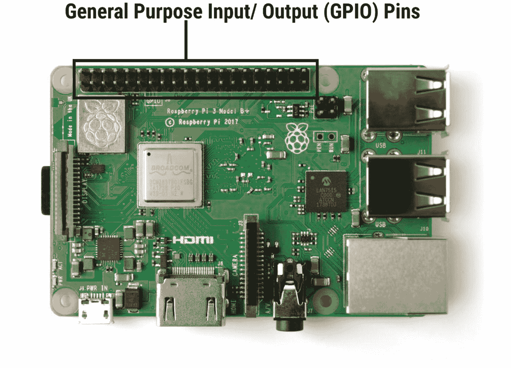

图 21-1

Raspberry Pi 板上通用输入/输出(GPIO)引脚的位置

在连接和拆卸外围设备时，您应该始终小心，并且在这样做时应该关闭电源。保持电源接通并连接设备可能会损坏电脑。

> *将设备插入树莓派时要小心！在这样做之前，请务必关闭机器！*

## 电压、电流和电阻

在我们将元件连接到 Raspberry Pi 之前，我们应该后退一步，讨论一些电子基础知识。当产生一条允许自由电子沿其移动的路径时，电子电路就形成了。这些电子的连续运动是一种*电流*，思河。导致这些电子流动的力被称为*电压*，是电路中两点之间势能的度量。

最后，还有阻力。不管你的电路设计得多好，你总会遇到一些阻力。这可能是由电线的缺陷、热损耗造成的能量损失等引起的。你甚至可以通过添加称为*电阻器*的装置来降低电流，从而增加不完美性。在图 [21-2](#Fig2) 中，我们看到一个包含一个发光二极管(一盏灯)、一个开关和一个电阻的电路。它们都与电池相连。电路是完整的，因为电池的两端——ve 和 ve 端——通过电阻、开关和 LED 连接。电路将*完成*，也就是说，当开关接通时，电子将自由地从电池的+ve 端流向–ve 端。这种流动称为*常规电流*。

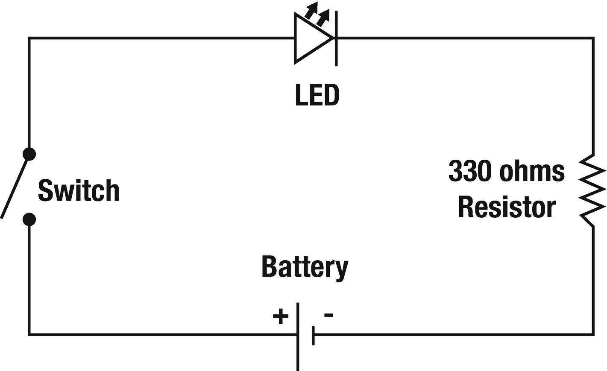

图 21-2

当左边的开关被按下时，一个简单的电路将点亮灯

当按下开关时，该电路将点亮 LED。在本章的后半部分，我们将使用下列元件构建此电路。

## 你需要什么

对于本书中的其余项目，在开始使用 Raspberry Pi 创建电路之前，您需要一些东西。至少你需要

*   面包板

*   分线板

*   跳线

*   发光二极管

*   电阻器(330ω即可)

*   开关

树莓派可以提供 3.3V 电源以及接地。再次，小心连接和断开电线。如果您不注意连接的引脚，可能会损坏您的 Raspberry Pi。

### 试验板

试验板用于制作电子电路的原型。它允许轻松放置和移除 led、电线和开关等组件，而无需焊接或脱焊这些组件。如图 [21-2](#Fig2) 所示，试验板由塑料外壳保护的微小连接器覆盖。微小的连接器以非常特殊的方式排列。

在顶部和底部有两条线，标记为+(正)和-(负)。这些是电源线(3.3 伏)和地线(0 伏)。如果您将 Raspberry PI 的 3.3V 输出连接到+轨，*该轨上的所有连接器*接收 3.3V 电压。这使得将元件连接到+ve(正极)和–ve(负极)供电轨变得非常容易。

中间部分从中间分开，将每一行分成两半。每个行部分的列是相连的。同样，这使得将多个输出连接到一个引脚变得更加容易。每一行不与另一行相连。试验板上通常有一个编号系统，以便于创建电路。在下面的例子中，列标记为“a”到“j ”,行以 5: 1、5、10、15 等间隔编号。

### 分线板

分线板是一种简单的设备，可以轻松地将 Raspberry Pi 连接到原型制作试验板上。如图 [21-3](#Fig3) 所示，将器件放置在试验板上。每行的其余列允许跳线或电阻连接到该行的相关引脚。


图 21-3

用于制作电子电路原型的试验板

然后，可以使用随附的带状电缆连接 Raspberry Pi 和试验板。请阅读如何连接带状电缆的说明，因为它因供应商和型号而异。

大多数分线板如图 [21-3](#Fig3) 所示，但有些是 T 形的，以使连接更加容易。

请注意，分线板的侧面标有树莓 Pi 引脚。这使得在放置跳线时更容易识别管脚。Adafruit 为各种树莓 Pi 型号提供了一个名为“补鞋匠”的分线板。详见 [`www.adafruit.com/`](http://www.adafruit.com/) 。

### 跳线

跳线有各种长度和形状，如图 [21-4](#Fig4) 和 [21-5](#Fig5) 所示。有些是盒子里的预包装，有些是塑料袋里的随机分类。无论哪种方式，它们通常是一根坚固的电线，允许您连接发光二极管、开关等。，到树莓派别针。

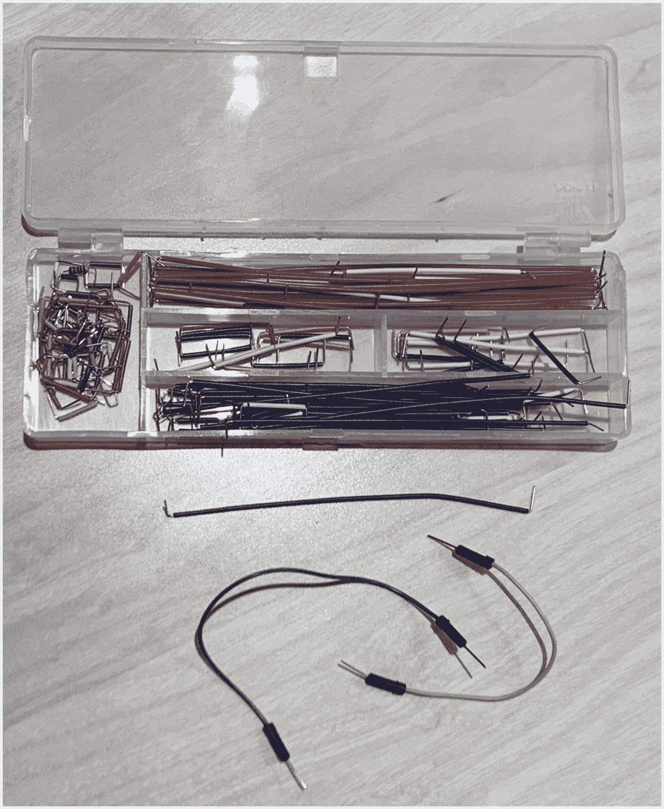

图 21-5。

实芯焊丝的选择


图 21-4

试验板上的分线板(图片中间),跳线和电阻连接到引脚

### 发光二极管

发光二极管(led)允许电流沿一个方向流动(这是二极管部分)，同时发光。它用于提供廉价的低成本照明，有多种包装。对于大多数电子设备，使用熟悉的彩色圆顶版本，如图 [21-6](#Fig6) 所示。

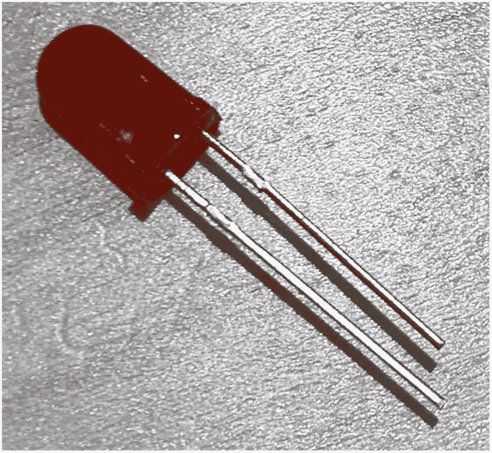

图 21-6。

一个 LED。注意，一条腿比另一条腿长。较长的引脚是阳极，总是连接到正电源轨。

你可能已经注意到一条腿比另一条腿长。这称为阳极，总是连接到+ve (3.3V)供电轨。较短的一脚称为阴极，连接到地或 0V 线。如果你把它接反了，灯就不亮了。你不会弄坏灯，它就是不亮。

当使用发光二极管时，你还需要在电路上连接一个电阻，因为它们会从树莓皮中吸取更多的能量，从而损坏电脑。

### 电阻

电阻器限制通过电路的电流量。电阻的测量单位称为欧姆(ω),电阻值越大，对电流的限制就越大。计算电路中电压、电流(以安培为单位)和电阻(欧姆)的公式为

```py
V = IR

```

其中 V 是电压，I 是电流，R 是电阻。如果要计算在 3.3V 电压下流经 330ω电阻的电流，则为

```py
V = IR

```

这意味着 I = V / R:

```py
I = 3.3 / 330

I = 0.01 amps

```

如果我们将该电阻增加到 470ω，它会将电流从 0.01 安培降至 0.006 安培，几乎是初始值的一半，这意味着通过电阻另一端的电流会减少。

一条电阻如图 [21-7](#Fig7) 所示。电阻值已经写在纸条上，以便更容易识别其值:330ω。电阻器周围的带表示其值。有三到六个色带，但是我用了五个，如表 [21-1](#Tab1) 所示:

表 21-1

电阻器色带位置和含义

<colgroup><col class="tcol1 align-left"> <col class="tcol2 align-left"> <col class="tcol3 align-left"> <col class="tcol4 align-left"> <col class="tcol5 align-left"> <col class="tcol6 align-left"></colgroup> 
| 

颜色

 | 

第一乐队

 | 

第二波段

 | 

第三波段

 | 

乘数

 | 

容忍

 |
| --- | --- | --- | --- | --- | --- |
| **黑色** | Zero | Zero | Zero | 1 小时 |   |
| **棕色** | one | one | one | 20+ | ± 1% |
| **红色** | Two | Two | Two | 1 号机 | ± 2% |
| **橙色** | three | three | three | 10 号 |   |
| **黄色** | four | four | four | 一百 |   |
| **绿色** | five | five | five | 1MΩ | ± 0.5% |
| **蓝色** | six | six | six | 10MΩ | ± 0.25% |
| 紫色 | seven | seven | seven | 1 兆焦耳 | ± 0.1% |
| **灰色** | eight | eight | eight | 0.1Ω | ± 0.05% |
| **白色** | nine | nine | nine | 0.01Ω |   |
| **黄金** |   |   |   |   | ± 5% |
| **白银** |   |   |   |   | ± 10% |


图 21-7

供应商提供的一条电阻器，其值标在纸带上

我拥有的电阻颜色如表 [21-2](#Tab2) 所示。

表 21-2

转换色带以确定电阻值

<colgroup><col class="tcol1 align-left"> <col class="tcol2 align-left"></colgroup> 
| 

颜色

 | 

价值

 |
| --- | --- |
| **橙色** | three |
| **橙色** | three |
| **黑色** | Zero |
| **黑色** | 1 哦 |
| **黄金** | ± 5% |

这是 330×1ω或 330ω，容差为 5%。

在电路中放置 LED 时，使用电阻非常重要。LED 将试图吸收尽可能多的电流，而电阻是限制这种吸收的一个很好的方法。电阻没有方向性，不像 led，所以你可以把它们放在你喜欢的任何地方，为了清晰起见，我建议让它们都面向同一方向。

### 开关

图 [21-8](#Fig8) 显示了一个简单的按钮轻触开关。它包含成两对排列的四个引脚。每一对都与另一对断开。当开关被按下时，封装内的触点完成线对之间的连接。


图 21-8

一个简单的按钮轻触开关

## 建造一个电路

既然我们已经学习了电子电路的基础知识，让我们构建一个不需要编程的非常简单的电路。我们将根据图 [21-1](#Fig1) 重建电路。为此，我们需要

*   一块试验板

*   分线板

*   三根跳线

*   S7-1200 可编程控制器

*   轻触开关

*   发光二极管

### 将分线板连接到树莓派

点击 Raspberry Pi 菜单并选择“关闭…”关闭 Raspberry Pi，如图 [21-9](#Fig9) 所示。


图 21-9

Raspberry Pi 系统菜单上的关闭菜单项

等到机器完全关闭。不要切断电源！我们需要能量来建造电路。

将分线板的带状电缆连接到 Raspberry Pi 的 GPIO 引脚。注意不要用力，因为如果电缆没有正确固定，这样可能会弯曲针脚。

带状电缆上通常有一根白线。这表示第一个引脚，用于将 Raspberry Pi 与分线板对齐。如图 [21-10](#Fig10) 所示，确保白色电线最靠近电路板顶部，即远离 USB 和网络端口。

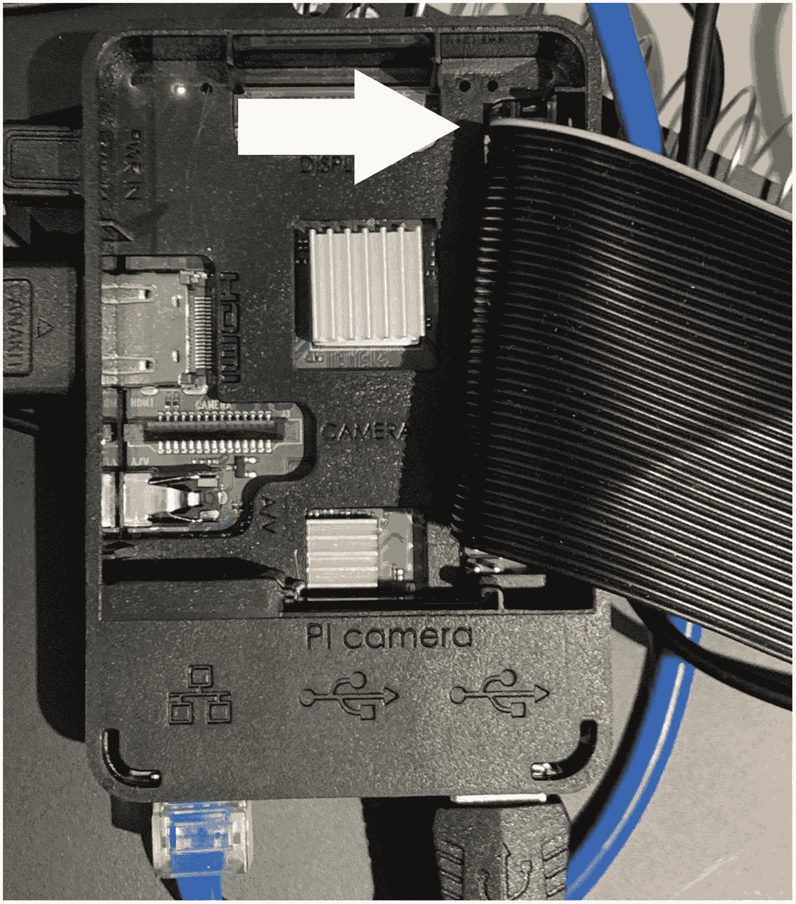

图 21-10

箭头指示电缆上白线的位置。请注意主板相对于 USB、网络和 HDMI 端口的方向

将分线板插入试验板上。分线板应跨在试验板的中间槽上，如图 [21-4](#Fig4) 所示。同样，注意不要弯曲任何引脚。

接下来，将带状电缆的另一端连接到分线板。在分线板的侧面有一个凹口，在带状连接器上有一个凸起部分，这就更容易做到了。它只能朝一个方向走，但可以肯定的是，电缆上的白线应该在电路板的顶部。

现在，您应该已经将覆盆子 Pi 连接到试验板了。即使树莓派是关闭的，电源仍然连接着它。我们可以用这个给我们的电路供电。

### 提供电源和接地

我们将添加的前两条跳线连接到 Raspberry Pi 的 3.3V 和接地引脚。这些位于分线板顶部附近，如图 [21-11](#Fig11) 所示。


图 21-11

3V3 引脚和接地引脚线

如图 [21-11](#Fig11) 所示，将电线的一端插入 3V3 (3.3 伏)引脚排。将另一端放在试验板的+ve 导轨上。这是我们的 3.3V 线。连接到那条线上的任何东西(在试验板上显示为红色)都将连接到 3.3V。

接下来拿另一根线，把它连接到标有 GND 或地的一排线上。这将是我们的地线。我们还没有地方放它，所以暂时让它漂浮着吧。

### 添加 LED

将 LED 放在主板上，阳极(较长的一条)放在一排，阴极(较短的一条)放在另一排。不要把针放在同一排，否则它不会工作！在图 [21-12](#Fig12) 中，我展示了如何放置 LED。只要你记得是哪个方向，哪个方向并不重要——箭头表示阳极。

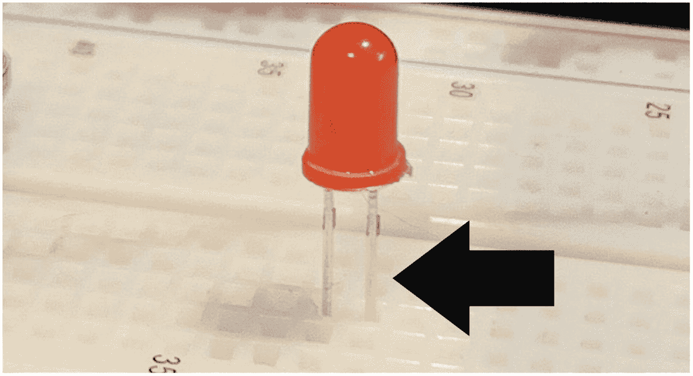

图 21-12

LED 引脚放置在不同的行上。箭头指向阳极引脚。

为了将 LED 连接到 3.3V 线路，我们将使用 330ω电阻。

> *记住！务必使用带 LED 的电阻器！*

如图 [21-13](#Fig13) 所示，将电阻的一端连接到与阳极相同的行，另一端连接到+ve 轨。

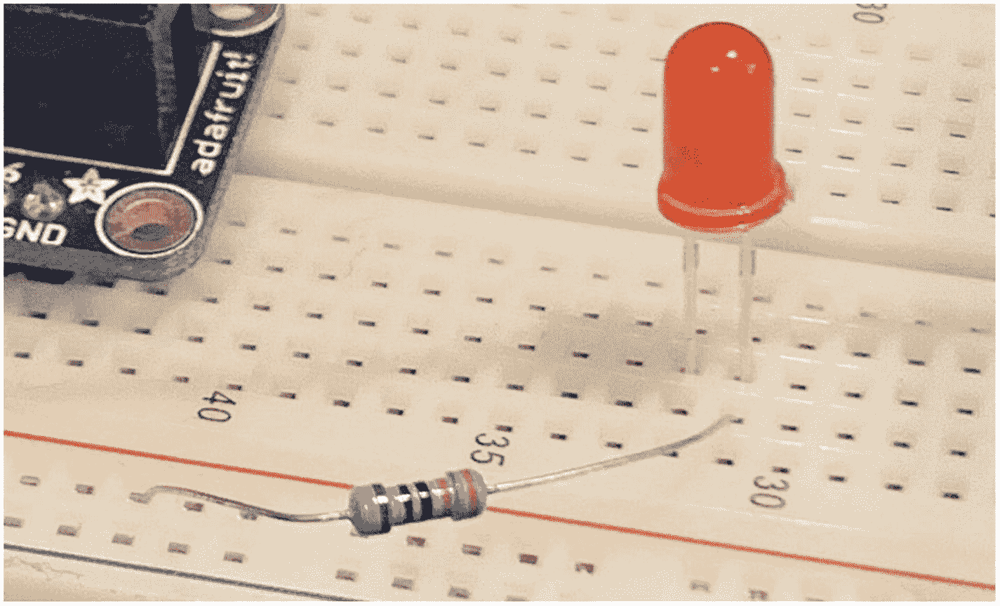

图 21-13

使用 330ω电阻将 LED 连接到 3.3V 线路

### 完成电路

我们现在将通过添加轻触开关和跳线来完成电路。如图 [21-14](#Fig14) 所示，在试验板上放置一个开关。

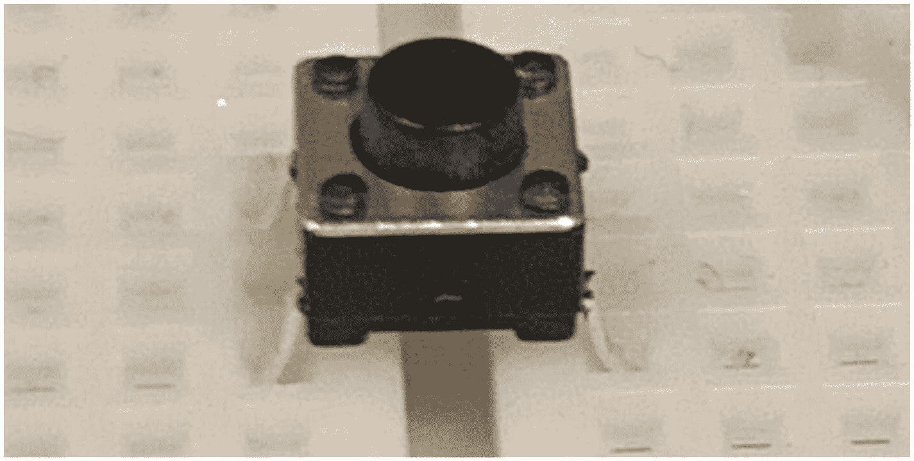

图 21-14

一个轻触开关跨在试验板中间的槽上

我喜欢把它放在板中间的槽上，但是你可以把它放在任何你想放的地方。请记住，开关有两对，每对的引脚相互连接。这意味着，如图 [21-14](#Fig14) 所示，我们需要将电线连接到顶部和底部引脚，以便当轻触开关被按下时，电路接通。如果我们连接两个顶部引脚或两个底部引脚，电路将完成。

将之前悬空的 0V(接地)线插入与开关顶部引脚同一行的连接器中。取另一根跨接导线，将其连接到与开关底部引脚相同的行，并连接到 LED 的阴极(短引脚)。

你现在应该有一个类似于图 [21-15](#Fig15) 所示的电路。

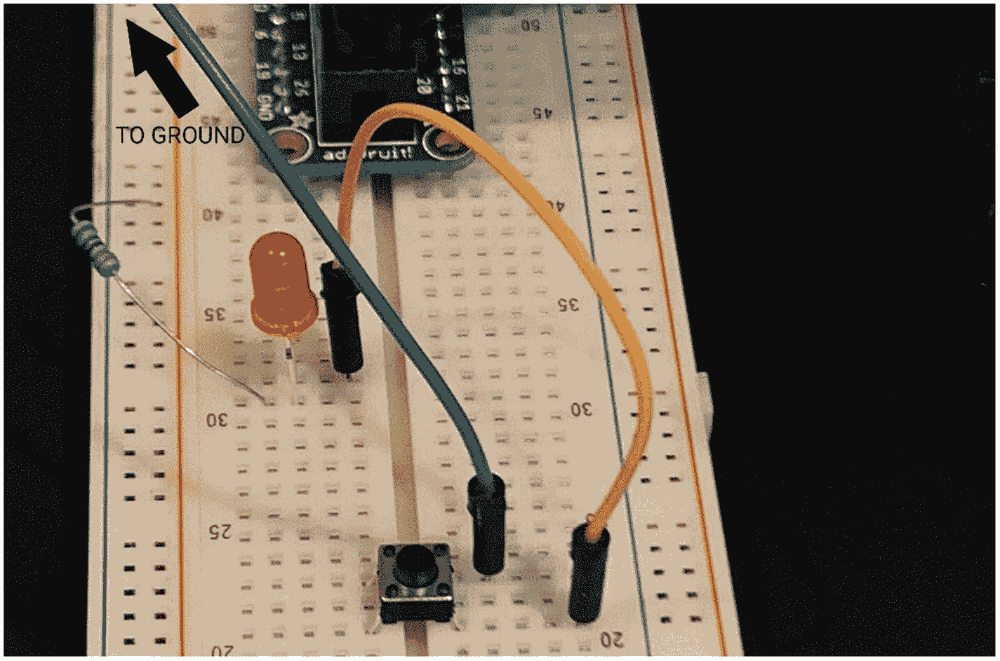

图 21-15。

完整的电路。分线板在图片顶部部分可见。

### 测试电路

完整电路如图 [21-16](#Fig16) 所示。您应该对照刚才制作的物理电路检查该电路中的连接。在按下轻触开关之前，确保所有连接都与图中的连接相匹配。


图 21-16。

显示 Raspberry Pi 和试验板之间连接的电路图。在按下轻触开关之前，使用此图确保您的电路构建正确。

如果一切正常，按下轻触开关，电路应该亮了！如果没有，检查你的线路。如果您断开了 Raspberry Pi 的电源——记住，我们需要这个电路的电源——您应该重新连接电源。这将打开你的树莓皮，但这很好。对于这个练习，我们只需要来自引脚的功率。

## Pin 含义

每个引脚都有特定的用途，Raspberry Pi 允许您使用 SPI(串行外设接口)、I2C(内部集成电路)或 GPIO 引脚直接连接到外设。在本书的剩余部分，我们将专注于 GPIO 引脚本身。我们将在后面看到，我们必须告诉 Raspberry Pi 我们将如何使用 GPIO 引脚，也就是什么操作模式。图 [21-17](#Fig17) 显示了物理引脚的映射。


图 21-17

每个 GPIO、电压和接地引脚的位置

你会注意到的第一件事是编号的针没有按顺序排列。这些是 GPIO 引脚，可以通过 Python 直接访问。您可以连接开关、发光二极管等。，并让 Python 读取它们的值或向它们写入值以打开灯。

3v3 引脚输出 3.3 伏，5V 引脚输出 5 伏。建议您坚持使用 3.3V 线路，除非您尝试连接的外设需要 5v 电压。接地引脚是不可知的；不管你用的是 5 伏还是 3.3 伏，你的电路都使用相同的接地引脚。接地引脚在图 [21-17](#Fig17) 中标记为‘G’。

最后两个引脚是 GPIO 的引脚 0 和 1，不可访问。不应将设备连接到这两个引脚。在图中，那些针标有'-'。

让我们重建电路，用 Python 开灯。

## gpiozero 库

为了与试验板上的电子元件“对话”，我们将使用 gpiozero 库。这是一组实用程序，可以轻松地与连接到 GPIO 引脚的组件通信并从中读取数据。

这本书将只涵盖这个库所涵盖的功能的很小一部分。如果您想连接运动传感器、温度计、电位计等。，那么我推荐在 [`https://gpiozero.readthedocs.io`](https://gpiozero.readthedocs.io) 通读文档。

我们将使用这个库创建的第一个程序是一个打开 LED 一秒钟然后关闭的程序。

### 该电路

图 [21-18](#Fig18) 所示的电路通过 GPIO 引脚 4 将 LED 的阳极(两个引脚中较长的一个)连接到 Raspberry Pi。电阻连接到 LED 的阴极(两个引脚中较短的一个)，然后连接到 Raspberry Pi 的一个接地引脚。构建如图 [21-18](#Fig18) 所示的电路。

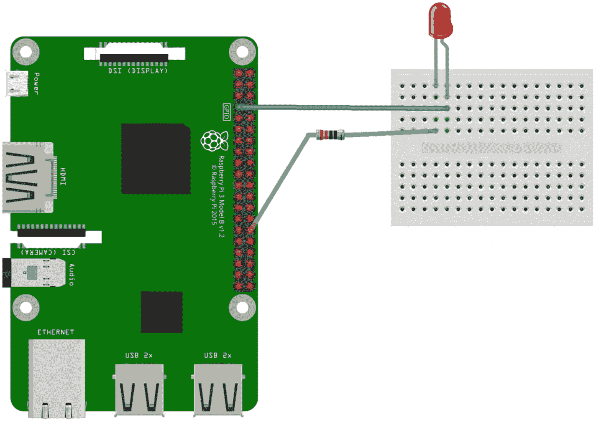

图 21-18

Python 控制的 led 电路

此时，LED 不应亮起。我们将用代码来实现。

### Python 程序

打开空闲的 IDE，创建一个名为“ch21-1.py”的新文件，并将其放在“pygamebook”文件夹内名为“ch21”的新文件夹中。在该文件中，键入以下内容:

```py
from gpiozero import LED
from time import sleep

```

导入 gpiozero 库来访问 LED 类。这个包装类使得打开和关闭 led 变得更加容易。第二个导入是 sleep()函数。Sleep 有一个参数，即计算机在执行下一条语句之前应该等待的秒数

```py
led = LED(4)

```

创建一个连接到物理 LED 的 LED 对象，该物理 LED 连接到 GPIO 引脚 4。

```py
led.on()
sleep(1)

```

打开 LED 并等待一秒钟。

```py
led.off()
sleep(1)

```

关闭 LED 并等待一秒钟。

保存并运行程序。观察试验板上发生的情况 LED 亮起一秒钟，然后熄灭！

#### 其他功能

on()和 off()函数非常适合于关闭和打开 LED，但是您也可以切换 LED 的状态，因此如果灯亮了，调用 toggle()将关闭它，反之亦然。最后，blink()会做到这一点，它会使 LED 闪烁。您可以指定灯打开的持续时间和灯关闭的持续时间。

### 获取按钮输入

除了将值输出到 GPIO 引脚，Raspberry Pi 还可以读取值。在本节中，我们将在电路中添加一个按钮，并控制 LED 的闪烁。修改后的电路如图 [21-19](#Fig19) 所示。

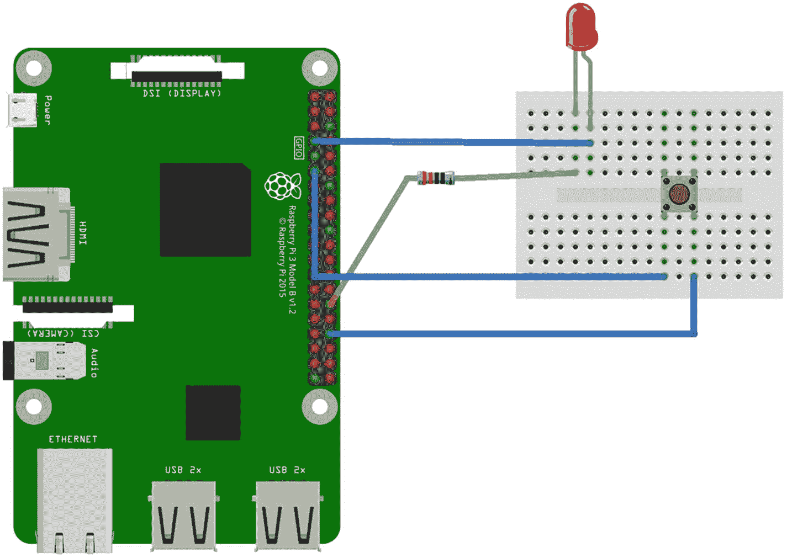

图 21-19

轻触开关控制的发光二极管电路

LED 仍然连接到 GPIO 引脚 4，就像在以前的电路中一样。该开关一端连接到 GPIO 17，另一端连接到 Raspberry Pi 上的接地引脚。Button 对象可用于使读取按钮的状态(按下、释放)变得容易。

### 在 Python 中读取按钮输入

在与上一个程序相同的文件夹中创建一个名为“ch21-2.py”的新文件。准确输入所写的代码:

```py
from gpiozero import LED, Button

```

从 gpiozero 库中导入 LED 和 Button 类。

```py
led = LED(4)
button = Button(17)

```

创建一个 LED 对象，其中物理 LED 连接到 GPIO 引脚 4。创建一个按钮对象，其中物理轻触开关连接到 GPIO 引脚 17。

```py
ledOn = False
wasPressed = False

```

用于记录 LED 状态的标志–LED on。当程序启动时，它是关闭的，所以' ledOn '被设置为假。用于记住按钮最后状态的标志。这将防止按钮被持续按下和 LED 快速闪烁。

```py
while True:

```

保持程序运行。要退出程序，请按 Ctrl+C。

```py
    if not button.is_pressed and wasPressed:
        ledOn = not ledOn

```

如果按钮已被释放，即如果按钮*已被*按下且未被*未被*按下，则切换“ledOn”变量的状态。

```py
        if ledOn:
            led.blink()
        else:
            led.off()
    wasPressed = button.is_pressed

```

如果 LED 应该亮起，将其设置为闪烁。否则，应该将其关闭。“状态”变量被设置为按钮被按下的当前状态。

保存并运行程序。

短暂按下试验板上的轻触开关。LED 将开始闪烁。再次按下按钮将停止 LED 闪烁。按键盘上的 Ctrl+C 退出程序。您可以向电路板添加另一个按钮，并查询该按钮以确定程序是否应该停止。听起来像一个有趣的练习！你会怎么做？

## 结论

通用输入/输出(GPIO)引脚允许 Raspberry Pi 与 led、开关、运动传感器、温度计等电子组件进行对话。它具有额外的模式，允许您连接到支持 SPI 或 I2C 标准的外设。

使用 GPIO，我们可以通过闪烁 led 或从轻触开关获取输入来扩展我们的程序。在接下来的几章中，我们将看到如何使用 GPIO 进行游戏输入和输出。