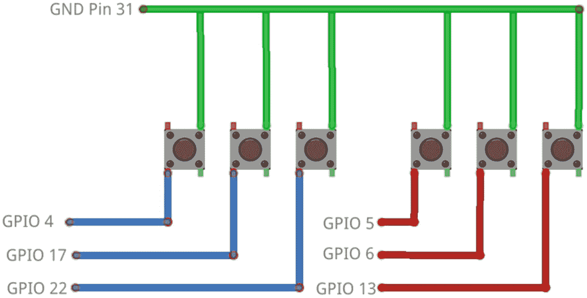
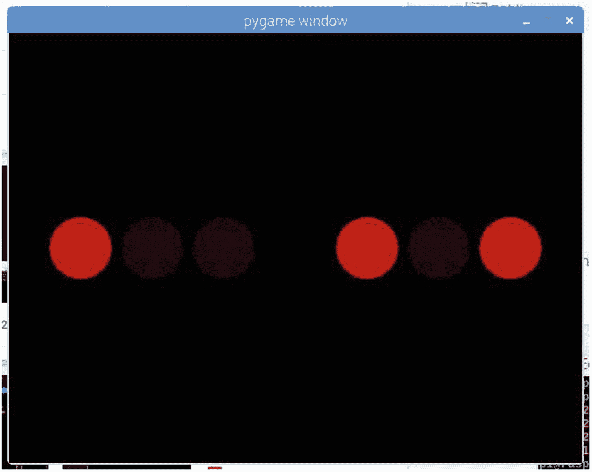
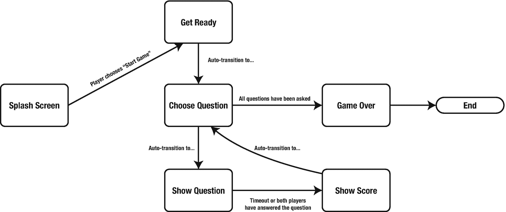

# 23.游戏项目:测验

这本书的最后一个项目是一个双人沙发问答游戏。玩家会遇到一系列选择题，他们必须选择正确的答案。游戏混合使用 PyGame 和电子设备；问题显示在监视器上，所有输入来自两对三个轻触开关。部分游戏画面如图 [23-1](#Fig1) 所示。


图 23-1

问答游戏的屏幕:飞溅，准备好，问题，和分数屏幕

在“pygamebook”“projects”文件夹中创建一个名为“quiz”的新文件夹这是我们将为这个项目编写的所有脚本的位置。

## 电子产品

对于这个游戏的电路，你需要以下:

*   一块试验板

*   六个轻触开关

*   不同长度的电线

图 [23-2](#Fig2) 显示了该项目的电路图。它由两对三个轻触开关组成。每个轻触开关通过 Raspberry Pi 上的引脚 31 接地。玩家 1 的按钮连接到 GPIO 引脚 4、17 和 22，玩家 2 的按钮连接到 GPIO 引脚 5、6 和 13。



图 23-2

显示两组轻触开关的问答游戏电路图

一旦电路在试验板上建立并连接到 Raspberry Pi，我们将使用一个简短的程序来测试按钮。为此，我们的程序将使用 PyGame 点亮屏幕显示。

### 测试按钮

测试程序如图 [23-3](#Fig3) 所示，显示两组三个圆。当轻触开关被按下时，圆圈“亮起来”，也就是说，红点以更亮的颜色出现。



图 23-3

测试程序运行显示三个轻触开关已被按下

在“测验”文件夹中创建一个名为“buttontest.py”的新脚本，并输入以下内容:

```py
#!/usr/bin/python3
import pygame, os, sys
from pygame.locals import *
from gpiozero import Button

```

PyGame 和 gpiozero 库的标准导入。

```py
def drawButtonState(surface, button, pos):
    color = 32
    if button.is_pressed:
        color = 192
    pygame.draw.circle(surface, (color, 0, 0), pos, 35)

```

绘制按钮的状态。如果按下按钮，会显示一个明亮的圆圈。

```py
def drawPlayerState(surface, buttons, startx):
    x = startx
    for b in buttons:
        drawButtonState(surface, b, (x, 240))
        x = x + 80

    return x

```

循环浏览给定的按钮，并检测每个按钮是否被按下。调用 drawButtonState。

```py
pygame.init()
fpsClock = pygame.time.Clock()
surface = pygame.display.set_mode((640, 480))

```

初始化 PyGame 并创建一个屏幕和时钟。

```py
player1 = [ Button(4), Button(17), Button(22) ]
player2 = [ Button(5), Button(6), Button(13) ]

```

创建两个按钮列表。每个按钮都连接到指定 GPIO 引脚上的轻触开关。

```py
background = (0, 0, 0) # Black

while True:
    surface.fill(background)

    for event in pygame.event.get():
        if event.type == QUIT:
            pygame.quit()
            sys.exit()

    x = 80
    x = drawPlayerState(surface, player1, x)
    x = x + 80
    drawPlayerState(surface, player2, x)

    pygame.display.update()
    fpsClock.tick(30)

```

保存并运行程序。按住每个轻触开关。当按下开关时，屏幕上的彩色圆圈应该“亮起”。如果不是这样，请检查电路并再次尝试该程序。

如果电路工作正常，我们可以进入项目的视觉部分。这将需要我们创建一个状态机。

## 有限状态机

游戏中共有五种状态，它们的转换如图 [23-4](#Fig4) 所示。这五种状态是



图 23-4

问答游戏的有限状态机(FSM)

*   闪屏–显示欢迎信息

*   准备好–显示“准备好”信息

*   选择问题–从列表中选择新问题

*   显示问题–显示问题、三个选项和倒计时

*   显示分数–显示双方玩家的当前分数

*   游戏结束–这与“显示分数”状态相同，但包含一个显示谁赢得了整个游戏的指示器

因为“显示分数”和“游戏结束”非常相似，我们只需要为这两种状态创建一个类，以及“准备好”和“闪屏”状态。表 [23-1](#Tab1) 显示了状态之间的移动规则，也称为状态转换。

表 23-1。

游戏状态、转换规则和职业

<colgroup><col class="tcol1 align-left"> <col class="tcol2 align-left"> <col class="tcol3 align-left"> <col class="tcol4 align-left"></colgroup> 
| 

状态

 | 

次状态

 | 

班级

 | 

转换条件

 |
| --- | --- | --- | --- |
| **启动画面** | 准备好 | 标题文本屏幕 | 其中一个玩家按下了触动开关 |
| **准备好** | 选择问题 | 标题文本屏幕 | 在一定的持续时间后自动移动到下一个状态 |
| **选择问题** | 显示问题或游戏结束 | 选择一个问题 | 自动移动到下一个状态。如果没有更多的问题，下一个状态是“游戏结束” |
| **显示问题** | 显示分数 | 显示问题 | 在时间限制(倒计时)达到零时，或者双方玩家都选择了答案后，自动进入下一个状态 |
| **显示分数** | 选择问题 | ShowScore | 在一定的持续时间后自动移动到下一个状态 |
| **游戏结束** | 无-游戏结束 | ShowScore | 没有条件。游戏结束 |

## 制作游戏

除了前面提到的状态之外，还有一些额外的类需要构建。这些是

*   问题反序列化

*   基本状态类

*   游戏赛跑者

*   UI 助手类

我们将依次了解每一项。

### 这些问题

测验的问题来自于 Pub 测验问题 HQ ( [`https://pubquizquestionshq.com/`](https://pubquizquestionshq.com/) )，这是一个免费开放的问题资源。这些问题被格式化在一个网页上，所以我花了一些时间将它们组织成一个 JSON 文件。生成的数据文件应作为“questions.json”保存到“测验”文件夹中:

```py
{
      "questions":
      [
            {
                  "question": "New York City Hall is in which Borough?",
                  "answer": "Manhattan",
                  "answers": [
                        "Queens",
                        "Brooklyn"
                  ]
            },
            {
                  "question": "Which was the first baseball team                                in Texas to make it to the World                                Series?",
                  "answer": "Houston Astros",
                  "answers": [
                        "Houston Oilers",
                        "Texas Rangers"
                  ]
            },
            {
                  "question": "Dwight D. Eisenhower was President from 1953 to 1961, but who was his Vice President?",

                  "answer": "Richard Nixon",
                  "answers": [
                        "John Kennedy",
                        "Lyndon Johnson"
                  ]
            },
            {
                  "question": "Which was the most successful NFL team of the decade beginning in Jan 2000 with 4 Super Bowl wins?",
                  "answer": "New England Patriots",
                  "answers": [
                        "Buffalo Bills",
                        "San Diego Chargers"
                  ]
            },
            {
                  "question": "Why was there no World Series played in 1994?",
                  "answer": "Player's strike",
                  "answers": [
                        "No one bought tickets",
                        "Ban on baseballs"
                  ]
            },
            {
                  "question": "Lansing is the state capital of which northern state in America?",

                  "answer": "Michigan",
                  "answers": [
                        "Ilinois",
                        "Wisconsin"
                  ]
            },
            {
                  "question": "As of 2013 the most widely circulated newspaper in the USA was The Wall Street Journal. Which company owns it?",
                  "answer": "News Corporation

                  "answers": [
                        "Chicago Tribune",
                        "Conde Nast"
                  ]
            },
            {
                  "question": "Out of which city were Aerosmith formed?",
                  "answer": "Boston",
                  "answers": [
                        "New York",
                        "Los Angeles"
                  ]
            },
            {
                  "question": "Which future president gained national fame through his role in the War of 1812, most famously where he won a decisive victory at the Battle of New Orleans?",
                  "answer": "Andrew Jackson",
                  "answers": [
                        "George Washington",
                        "Abraham Lincoln"
                  ]

            },
            {
                  "question": "Born in Massachusetts, which painter's most famous work is 'Arrangement in Grey and Black No.1'?",
                  "answer": "James Abbott McNeill Whistler",
                  "answers": [
                        "Andy Warhol",
                        "Phillipe Stark"
                  ]
            }
      ]
}

```

JSON 文件被格式化为一个带有名为“questions”的列表属性的对象。数组中的每个对象都具有以下属性:

*   问题–问题的文本

*   答案–问题的正确答案

*   答案–不正确答案的列表

我选择使用一个函数来创建一系列问题。该函数从“questions.json”文件中加载问题，并填充“Question”对象列表。

创建一个名为“questions.py”的新文件，并输入以下内容:

```py
#!/usr/bin/python3
import json
import random

```

JSON 序列化/反序列化的导入。随机导入将用于随机化问题和答案的顺序

```py
class Question(object):
    def __init__(self, jsonQuestion):
        self.question = jsonQuestion['question']
        self.answers = jsonQuestion['answers']
        self.answer = jsonQuestion['answer']
        self.answers.append(jsonQuestion['answer'])
        random.shuffle(self.answers)
        index = 0
        for a in self.answers:
            if a == jsonQuestion['answer']:
                self.answerIndex = index
            index = index + 1

```

“问题”类用于存储问题文本、正确答案和其他建议。正确答案的索引也被存储。这将使确定玩家是否选择了正确答案变得更容易一些；第一个按钮映射到第一个选择，依此类推。为了让游戏更有趣，每次玩这个游戏时，答案都会用“random.shuffle()”方法进行洗牌。这个简便的方法打乱了列表的元素。我们将在下面的“loadQuestions()”函数中看到它的使用。

```py
def loadQuestions(filename):
    f = open(filename)
    questionFile = json.load(f)
    f.close()

```

将问题文件的全部内容载入内存。

```py
    questions = []
    for q in questionFile['questions']:
        questions.append(Question(q))

```

对于文件中的每个问题，创建一个“问题”类的新实例，并将其附加到“问题”列表中。

```py
    random.shuffle(questions)
    return questions

```

一旦所有的问题都被添加到列表中，再次使用“random.shuffle()”方法对问题进行重新排序，这样就不会有两个游戏是相同的。

```py
if __name__ == '__main__':
    questions = loadQuestions("questions.json")
    for q in questions:
        print(q.question)
        print("Answer index %d" % q.answerIndex)
        for a in q.answers:
            if a == q.answer:
                print("\t* %s" % a)
            else:
                print("\t%s" % a)

```

为了测试代码是否运行，我在文件的底部添加了一个测试存根。它加载到“questions.json”文件中，并显示问题和答案。正确答案标有星号(*)。

保存文件并运行它。在运行它之前，您必须添加执行位:

```py
$ chmod +x questions.py
$ ./questions.py

```

您应该会看到屏幕上显示的问题列表。如果没有，请检查代码。

### UI 助手类

UI 助手类包含在一个文件中。这些类别是

*   文本-基本文本组件

*   问题–显示问题和答案

*   倒计时–显示一个从 30 秒倒计时到 0 的进度条

创建一个名为“ui.py”的新文件，并输入以下文本:

```py
import pygame
from pygame.locals import *

```

导入 PyGame 模块。

```py
class Text(object):
    def __init__(self, size, colour):
        self.size = size
        self.colour = colour
        self.font = pygame.font.Font(None, size)

    def draw(self, surface, msg, pos, centred = False):
        x, y = pos
        tempSurface = self.font.render(msg, True, self.colour)
        if centred:
            x = x - tempSurface.get_width() / 2
            y = y + tempSurface.get_height() / 4
            pos = (x, y)
        surface.blit(tempSurface, pos)

```

Text 类是现有 PyGame 字体类的包装。它使文本在屏幕上的定位更容易，并提供了一种方便的方式来绘制以特定点为中心的文本。

```py
class QuestionText(object):
    def __init__(self):
        self.questionText = Text(32, (255, 255, 0))
        self.answerText = Text(32, (255, 255, 255))
        self.disabledText = Text(32, (56, 56, 56))

```

QuestionText 类的构造函数。这将创建三个单独的文本实例:一个用于问题文本，一个用于答案文本，一个用于禁用状态。当这一轮结束时，正确答案会突出显示。禁用文本用于得出两个不正确的答案。

```py
    def draw(self, surface, question, answer, answers, showAnswer = False):
        y = 64
        maxWidth = 60
        lineHeight = 32
        if len(question) > maxWidth:
            question.split(" ")
            temp = ""
            for word in question:
                temp = temp + word
                if len(temp) > maxWidth:
                    pos = (400, y)
                    self.questionText.draw(surface, temp, pos, True)
                    temp = ""
                    y = y + lineHeight
            self.questionText.draw(surface, temp, (400, y), True)
        else:
            self.questionText.draw(surface, question, (400, y), True)

```

如果问题文本长于屏幕宽度，它将被拆分成单独的单词。每个单词都被添加到列表中，直到达到最大宽度。然后，该文本被绘制到屏幕上。然后处理剩余的文本，直到显示出整个问题。如果问题文本小于屏幕宽度，则正常显示。

```py
        y = y + lineHeight * 2
        label = "A"
        for a in answers:
            font = self.answerText
            if showAnswer and a != answer:
                font = self.disabledText

            font.draw(surface, "%s. %s" % (label, a), (100, y), False)
            labelChar = ord(label)
            labelChar = labelChar + 1
            label = chr(labelChar)
            y = y + 40

```

每个答案前面都会显示 A、B 或 C。为了达到这种“效果”，我们必须首先将当前标签转换成一个数字——这就是“ord()”函数的作用。它查找 ASCII(美国信息交换标准代码)表，并根据字符返回一个数字。第一次运行循环时，label = 'A '和 so ord()将返回 65，因为' A '位于 ASCII 表的第 65 位。该值递增到下一个字符，因此 65 将变成 66，并使用“chr()”函数将其转换为一个字符。ASCII 码中的 66 是 b。

```py
class Countdown(object)

:
    def __init__(self, seconds, pos, width, height, innerColour, borderColour, text):
        self.maxSeconds = seconds
        self.seconds = seconds
        self.pos = pos
        self.width = width
        self.height = height
        self.finished = False
        self.text = text
        self.innerColour = innerColour
        self.borderColour = borderColour
        self.fullRect = Rect(pos, (width, height))
        self.rect = Rect(pos, (width, height))

```

这是一个相当长的构造函数！这些参数将被用来绘制一个进度条形状的倒计时器，它在屏幕上停留的时间越长越短。

```py
    def draw(self, surface):
        pygame.draw.rect(surface, self.innerColour, self.rect)
        pygame.draw.rect(surface, self.borderColour, self.fullRect, 2)

```

要绘制进度条，我们将使用 PyGame 提供的' draw.rect()'方法。它可以用两种方法之一绘制:填充或带边框。进度条的“内部”将被绘制成一个填充的矩形，进度条的“外部”将被绘制成一个边框。

倒计时的当前大小从“self.rect”中提取，完整的矩形“self.fullRect”被绘制在顶部，如图 [23-5](#Fig5) 所示。


图 23-5

问答游戏的进度条

```py
        x, y = self.pos
        x = x + self.width / 2
        pos = (x, y)
        self.text.draw(surface, "%02d" % self.seconds, pos, True)

```

剩余的秒数绘制在进度条的顶部。

```py
    def reset(self):
        self.finished = False
        self.seconds = self.maxSeconds

```

每次显示问题时重置倒计时。

```py
    def update(self, deltaTime):
        if self.seconds == 0:
            return

        self.seconds = self.seconds - deltaTime
        if self.seconds < 0:
            self.seconds = 0
            self.finished = True
        progressWidth = self.width * (self.seconds / self.maxSeconds)
        self.rect = Rect(self.pos, (progressWidth, self.height))

```

通过减少“self.seconds”中的当前秒数来更新倒计时。如果秒数达到 0，那么我们不更新。如果定时器到达零，则‘self . finished’被设置为真。最后，为“draw()”方法计算并存储进度条内部的当前宽度。

保存文件。

### 游戏运行程序和基本状态类

游戏运行者是一个非常基本的框架类，它允许游戏在不同的状态之间转换。要创建编程接口，需要创建一个基本状态类。这也将用作所有其他状态类的基础。

“NullState”类将为游戏的 FSM 中的其他状态提供基础。“游戏玩家”类将

*   初始化 PyGame

*   更新当前状态

*   绘制当前状态

游戏更新方法也将在各种状态之间转换。稍后我们将为程序编写一个主入口点，它将创建一个“GameRunner”类的实例。

创建一个名为“gamerunner.py”的新文件，并输入以下内容:

```py
import pygame
from pygame.locals import *

```

PyGame 的进口。

```py
class NullState(object):
    def update(self, deltaTime):
        return None

    def draw(self, surface):

        pass

    def onEnter(self):
        pass

    def onExit(self):
        pass

```

' NullState '类是游戏中其他状态的基础。它包含四种方法，用于

*   更新

*   画

*   通知状态正在进入

*   通知该州它正在被转移出去

```py
class GameRunner(object):
    def __init__(self, dimensions, title, backColour, initialState):
        self.state = initialState
        self.clock = pygame.time.Clock()
        self.backColour = backColour
        self.surface = pygame.display.set_mode(dimensions)
        pygame.display.set_caption(title)

```

初始化 PyGame 并创建一个时钟。这将创建显示并设置窗口的标题。

```py
    def update(self):
        deltaTime = self.clock.tick(30) / 1000.0
        if self.state != None:
            self.state = self.state.update(deltaTime)

        return self.state

```

计算从上次运行该方法到现在的时间，并存储在“deltaTime”中时间是以毫秒为单位的，所以为了把它变成秒，我们要除以 1000。调用当前状态的“update()”方法。状态的“update()”方法返回要转换到的下一个状态。当前状态被返回给调用者。调用者将是我们后面要写的主程序。

```py
    def draw(self):
        self.surface.fill(self.backColour)
        if self.state != None:
            self.state.draw(self.surface)

        pygame.display.update()

```

这将清除主表面，并获取当前状态以在顶部绘制自己，然后更新显示。

保存文件。

### 玩家输入

如果没有玩家的参与，我们将会制作电影！对于这个游戏，玩家的输入是使用“PlayerController”类捕获的。这个类也包含玩家当前的分数。创建一个名为“playercontroller.py”的新文件，并输入以下文本:

```py
from gpiozero import Button

```

gpiozero 库的导入。

```py
class PlayerController(object):
    def __init__(self, pins):
        self.buttons = []
        self.score = 0
        for pin in pins:
            self.buttons.append(Button(pin))

```

“PlayerController”类的构造函数。请注意，它从传递给它的“pin”列表中创建了一个按钮列表。

```py
    def anyButton(self):
        for button in self.buttons:
            if button.is_pressed:
                return True

        return False

```

方法来确定是否按下了任何按钮。

```py
    def playerChoice(self):
        index = 0
        for button in self.buttons:
            if button.is_pressed:
                return index
            index = index + 1

        return -1

```

方法来确定玩家的答案选择。如果玩家没有选择，这个方法返回–1，或者玩家按下的按钮的“self.buttons”列表中的索引。

### 州级

将为游戏中的状态创建以下类:

*   选择一个问题

*   标题文本屏幕

*   显示问题

*   ShowScore

每个游戏状态都是*重入*。这意味着在程序执行期间，状态可以运行任意次。当通过调用“onEnter()”方法进入每个状态时，以及当通过调用“onExit()”方法不再是当前状态时，每个状态都会被告知。

当您创建自己的状态时，应该在“onEnter()”方法中执行状态的设置代码，并且应该在“onExit()”方法中执行拆卸(清理)操作。

#### 分离阶级和国家

有限状态机(FSM)的状态是*一个类*的实例。没有必要创建多个执行相同或相似操作的类，因为它们代表不同的状态。在这个游戏中有两种使用相同职业的方法:

*   header text Screen–由“准备就绪”和“闪屏”状态使用

*   Show Score–由“显示分数”和“游戏结束”状态使用

当我们创建主文件时，将再次讨论这个主题。

#### 维护游戏状态

游戏的当前状态分为两部分:当前正在执行的动作和动作正在处理的数据。数据存储在当前问题和每个玩家的控制器中。我们已经为玩家设置了单独的职业(“玩家控制器”)，但是我们需要为当前的问题设置一个职业。创建名为“currentquestion.py”的新文件。这个文件中有一个当前显示问题的类定义。该信息将由“选择问题”状态改变，并由“显示问题”状态显示。

应该注意的是，正如我们将在后面看到的，其他状态*不需要知道当前问题*，因此没有给出该数据。

在“currentquestion.py”中输入以下代码:

```py
class CurrentQuestion(object):
    def __init__(self):
        self.question = ""
        self.answer = ""
        self.answerIndex = -1
        self.answers = []

```

仅此而已；只是当前问题的信息。保存文件。

#### 选择问题类

“选择问题”状态选择创建一个名为“选择问题. py”的新文件。这个类将用于从问题列表中选择当前的问题。

```py
from gamerunner import NullState

```

“ChooseQuestion”类扩展了“NullState ”,因此我们必须将“NullState”导入到该文件中。

```py
class ChooseQuestion(NullState):
    def __init__(self, nextState, gameOverState, currentQuestion, questions):
        self.questions = questions
        self.nextState = nextState
        self.gameOverState = gameOverState
        self.current = -1
        self.currentQuestion = currentQuestion

```

构造函数接受四个参数。第一个是默认的游戏状态，如果有另一个问题要转换到这个状态。正如我们从表 [23-1](#Tab1) 中看到的，这通常是“展示问题”状态。但是，如果达到“游戏结束”条件，游戏将转换到“游戏结束”状态。

“当前问题”是在*维护游戏状态*中谈到的游戏状态的实例。最后一个参数是从包含问题的 JSON 文件中加载的“问题”实例列表。

```py
    def update(self, deltaTime):
        self.current = self.current + 1
        if self.current == len(self.questions):
            self.currentQuestion.question = "
            self.currentQuestion.answer = "
            self.currentQuestion.answerIndex = -1
            self.currentQuestion.answers = []
            return self.gameOverState
        else:
            question = self.questions[self.current]
            self.currentQuestion.question = question.question
            self.currentQuestion.answer = question.answer
            self.currentQuestion.answers = question.answers
            self.currentQuestion.answerIndex = question.answerIndex
        return self.nextState

```

索引“self.current”递增。如果该值等于“self.questions”的长度，则游戏结束。否则，设置当前问题的数据并返回“nextState”。

“ChooseQuestion”类没有“draw()”方法，因此我们不需要在这里为它添加重写方法；“NullState”已经提供了一个基本的“draw()”方法。保存文件。

#### HeaderTextScreen 类

“闪屏”和“准备就绪”状态都使用 HeaderTextScreen 向玩家显示信息文本。在闪屏的情况下，游戏的名称与“按任意按钮”一起显示以继续。使用“准备好”,显示文本“准备好”。这两种状态的区别在于闪屏需要玩家输入，而“准备好”实例在设定的持续时间后会自动转换到下一个状态。

创建一个名为“headertextscreen.py”的新文件，并输入以下文本:

```py
from ui import *
from playercontroller import *
from gamerunner import NullState

```

必需的进口。

```py
class HeaderTextScreen(NullState):
    def __init__(self, nextState, player1, player2, waitTime = 0):
        self.nextState = nextState
        self.player1 = player1
        self.player2 = player2
        self.big = Text(128, (255, 192, 0))
        self.small = Text(36, (255, 255, 255))
        self.waitTime = waitTime
        self.currentTime = 0
        self.header = ""
        self.subHeader = ""

```

构造函数接受四个参数:下一个状态、玩家控制器和等待时间。如果等待时间为零，则假设需要一些玩家交互，也就是说，其中一个玩家必须按下按钮才能移动到下一个状态。

```py
    def setHeader(self, header):
        self.header = header

```

设置标题文本。

```py
    def setSub(self, subHeader):
        self.subHeader = subHeader

```

设置副标题文本。

```py
    def setNextState(self, nextState):
        self.nextState = nextState

```

设置下一个状态。

```py
    def update(self, deltaTime):
        if self.waitTime > 0:
            self.currentTime = self.currentTime + deltaTime
            if self.currentTime >= self.waitTime:
                return self.nextState
        elif self.player1.anyButton() or self.player2.anyButton():
            return self.nextState
        return self

```

这将执行状态转换。如果“self.waitTime”大于零，则它是自动倒计时版本，否则它是用户控制的状态版本。

```py
    def draw(self, surface):
        self.big.draw(surface, self.header, (400, 200), True)
        self.small.draw(surface, self.subHeader, (400, 300), True)

```

保存文件。

#### ShowQuestion 类

“显示问题”状态显示当前问题、答案和倒计时。当倒计时到达 0(从 30 秒开始)或两个玩家都做出选择时，状态转换到下一个状态。国家利用“游戏者控制器”；每个玩家和“当前问题”实例各一个。

创建名为“showquestion.py”的新文件，并输入以下文本:

```py
from gamerunner import NullState
from ui import Text, QuestionText, Countdown

```

正在为“NullState”类导入“gamerunner”文件。该类使用“ui”中的“Text”、“Countdown”和“QuestionText”类

```py
class ShowQuestion(NullState):
    def __init__(self, nextState, currentQuestion, player1, player2):
        self.nextState = nextState
        self.player1 = player1
        self.player2 = player2
        self.player1Choice = -1
        self.player2Choice = -1
        self.currentQuestion = currentQuestion
        self.showAnswer = False
        self.endCount = 3
        self.questionText = QuestionText()

        text = Text(32, (255, 255, 255))
        self.countdown = Countdown(30, (80, 560), 640, 32, (128, 0, 0), (255, 0, 0), text)

```

ShowQuestion 的构造函数有四个参数:要转换到的下一个状态、当前的问题实例和两个从它们那里获取输入的播放器控制器。

```py
    def calcScore(self):
        if self.player1Choice == self.currentQuestion.answerIndex:
            self.player1.score = self.player1.score + 1
        if self.player2Choice == self.currentQuestion.answerIndex:
            self.player2.score = self.player2.score + 1

```

计算玩家分数的辅助函数。

```py
    def update(self, deltaTime):
        if self.player1Choice == -1:
            p1 = self.player1.playerChoice()
            if p1 >= 0:
                self.player1Choice = p1

        if self.player2Choice == -1:
            p2 = self.player2.playerChoice()
            if p2 >= 0:
                self.player2Choice = p2

        if self.player1Choice >= 0 and self.player2Choice >= 0:
            self.showAnswer = True

        if not self.showAnswer:
            self.countdown.update(deltaTime)
            if self.countdown.finished:
                self.showAnswer = True
        else:
            self.endCount = self.endCount - deltaTime
            if self.endCount <= 0:
                self.calcScore()
                return self.nextState

        return self

```

如果“self.showAnswer”为 False，则 update 方法会启动倒计时计时器。当倒数计时器到达零或者两个玩家都做出选择时,“self.showAnswer”被设置为真。一旦玩家选择了答案，他们就不能更改。

```py
    def draw(self, surface):
        self.questionText.draw(surface, self.currentQuestion.question, self.currentQuestion.answer, self.currentQuestion.answers, self.showAnswer)
        if not self.showAnswer:
            self.countdown.draw(surface)

```

绘制问题和答案，将“self.showAnswer”字段值传递给 questionText 的“Draw()”方法以突出显示正确的答案。如果倒计时激活，显示出来。

```py
    def onExit(self):
        self.endCount = 3
        self.showAnswer = False
        self.countdown.reset()

```

退出时清除当前状态。

```py
    def onEnter(self):
        self.player1Choice = -1
        self.player2Choice = -1

```

在进入状态时设置玩家数据。

保存文件。

#### ShowScore 类

“显示分数”和“游戏结束”状态都属于这个类。在每个问题之间，会显示玩家的分数。显示“游戏结束”屏幕时，会显示得分和“赢家”或“平局”。“赢家”标签显示在赢得游戏的玩家下方。

对于这个文件，我创建了一个简单的测试存根来验证屏幕上文本的位置。

创建一个名为“showscore.py”的新文件，并输入以下文本:

```py
#!/usr/bin/python3

import pygame
from pygame.locals import *
from gamerunner import NullState
from ui import Text

```

“ShowScore”类所需的导入。

```py
class ShowScore(NullState):

    def __init__(self, nextState, player1, player2, showWinner = False):
        self.nextState = nextState
        self.player1 = player1
        self.player2 = player2
        self.counter = 3
        self.showWinner = showWinner
        self.scoreText = Text(300, (255, 255, 0))
        self.playerText = Text(128, (255, 255, 255))

```

“ShowScore”构造函数有四个参数。第一个是要转换到的下一个状态，接下来是第一个和第二个玩家的控制器。这些是“PlayerController”类的“score”字段所必需的。最后,“showWinner”参数用于显示“赢家”或“平局”,这取决于当所有问题都被问完时游戏的结束状态。

```py
    def update(self, deltaTime):
        self.counter = self.counter - deltaTime
        if self.counter <= 0:
            return self.nextState

        return self

```

分数屏幕仅在特定时间内显示。一旦该时间到期，状态转换到下一个。

```py
    def draw(self, surface):
        self.playerText.draw(surface, "Player 1", (200, 85), True)
        self.playerText.draw(surface, "Player 2", (600, 85), True)

        self.scoreText.draw(surface, str(self.player1.score), (200, 150), True)
        self.scoreText.draw(surface, str(self.player2.score), (600, 150), True)

        if self.showWinner:
            winner = "WINNER!"
            pos = 200
            if self.player1.score == self.player2.score:
                winner = "TIE!"
                pos = 400
            elif self.player2.score > self.player1.score:
                pos = 600
            self.playerText.draw(surface, winner, (pos, 400), True)

```

画屏幕。

```py
    def onEnter(self):
        self.counter = 3

```

进入该状态时，将当前计数器设置为 3 秒。

```py
if __name__ == '__main__':
    import sys
    class P(object):
        def __init__(self, s):
            self.score = s

    pygame.init()
    fpsClock = pygame.time.Clock()
    surface = pygame.display.set_mode((800, 600))

    score = ShowScore(None, P(55), P(10), True)

    background = (0, 0, 0) # Black

    while True:
        surface.fill(background)
        for event in pygame.event.get():
            if event.type == QUIT:
                pygame.quit()
                sys.exit()

        deltaTime = fpsClock.tick(30) / 1000.0
        score.draw(surface)
        pygame.display.update()

```

测试存根。这将显示“游戏结束”状态。保存并运行文件以查看。如果您想看到“显示分数”屏幕，请更改以下行:

```py
    score = ShowScore(None, P(55), P(10), True)

```

到

```py
    score = ShowScore(None, P(55), P(10))

```

#### 主文件

主文件实际上只有几行代码，其中大部分是设置有限状态机。创建一个名为“quiz.py”的新文件，并输入以下文本:

```py
#!/usr/bin/python3

import pygame
from gamerunner import GameRunner
from questions import *
from headertextscreen import HeaderTextScreen
from choosequestion import ChooseQuestion
from playercontroller import PlayerController
from showquestion import ShowQuestion
from showscore import ShowScore
from currentquestion import CurrentQuestion

```

程序的所有导入。

```py
pygame.init()

player1 = PlayerController([4, 17, 22])
player2 = PlayerController([5, 6, 13])
currentQuestion = CurrentQuestion()

```

初始化 PyGame 并设置存储在“PlayerController”实例和“CurrentQuestion”实例中的游戏状态数据。

```py
questions = loadQuestions("questions.json")

```

从 JSON 文件中加载问题。

```py
showQuestion = ShowQuestion(None, currentQuestion, player1, player2)
gameOver = ShowScore(None, player1, player2, True)
chooseQuestion = ChooseQuestion(showQuestion, gameOver, currentQuestion, questions)
showScore = ShowScore(chooseQuestion, player1, player2)
showQuestion.nextState = showScore

```

“ShowQuestion”、“ShowScore”和“ChooseQuestion”类用于构建游戏中使用的一些状态。由于状态的创建，无法为“ShowQuestion”设置初始状态，而是手动设置了“showQuestion”实例的“nextState”，并且没有将任何状态传递给“ShowQuestion”的构造函数

```py
interstitial = HeaderTextScreen(chooseQuestion, player1, player2, 3)
interstitial.setHeader("Get Ready!")
interstitial.setSub("")
splashScreen = HeaderTextScreen(interstitial, player1, player2)
splashScreen.setHeader("QUIZ!")
splashScreen.setSub("Press any button to start")

```

“准备好！”的间隙(游戏间隙)屏幕还有闪屏。注意，我们没有为闪屏和“准备好！”创建单独的类，它只使用了两个独立的“HeaderTextScreen”实例

当我们从一种状态转换到另一种状态时，我们从一个类的一个*实例*转换到另一个。所以没有必要为每个状态编写完全独立的类。

```py
game = GameRunner((800, 600), "Quiz", (0, 0, 0), splashScreen)

```

game runner 的实例被设置为 800×600 大小的窗口，背景为黑色(0，0，0)，初始状态为闪屏实例“splash screen”

```py
lastState = None
while game.state != None:
    nextState = game.update()
    if nextState != lastState:
        if game.state != None:
            game.state.onExit()
        if nextState != None:
            nextState.onEnter()
        lastState = nextState
    game.draw()

pygame.quit()

```

主程序循环包括调用游戏的“update()”和“draw()”方法。可以认为这个循环应该放在“GameRunner”的“run()”方法中，我的意思是它在名字中。我将把它作为读者的一个练习；在运行循环的“GameRunner”上创建一个名为“run()”的方法。

保存文件。

## 玩游戏

玩这个游戏你需要一个对手；这毕竟是一个基于沙发的问答游戏。请坐在沙发上，运行“quiz.py”文件。您需要为文件设置执行位:

```py
$ chmod +x quiz.py

```

然后运行它:

```py
$ ./quiz.py

```

一旦游戏开始，你们中的一个人按下试验板上的按钮开始测验。试着回答每个出现的问题。如果你在 30 秒内没有回答，你将失去这一分。获胜者是比赛结束时得分最多的人。祝你好运！

## 结论

这是一个有趣的游戏，展示了如何构建基于 PyGame 的游戏，与电子组件进行交互。您可以重写早期项目(如 Brick、Snake 和 Invaders)的输入例程，使用轻触开关代替计算机按键进行输入。