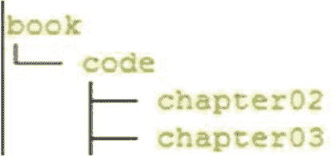

# 2.入门指南

在前一章中，您学习了如何在 Linux、macOS 和 Windows 计算机上设置 Python 3 环境。您还了解了一些流行的 Python ide。在这一章中，你将从测试自动化的概念开始。然后，您将探索一种学习 Python 3 中测试自动化框架的简单方法，称为`doctest`。

## 软件测试概念简介

教科书上对软件测试的定义是，它是执行一个程序或应用来发现任何错误的过程。通常，在软件测试的过程中有多个涉众。涉众包括测试人员、管理团队、顾问、业务、客户和最终用户。对于大中型项目，软件测试是为了确定软件在各种输入和条件下是否如预期的那样运行。

### 单元测试

单元测试是一种软件测试方法，在这种方法中，程序的单个组件，称为*单元，*使用所有需要的依赖项进行独立测试。单元测试大部分是由程序员完成的，他们为单元编写程序。在较小的项目中，这是非正式的。在大多数非常大规模的项目中，单元测试是正式开发过程的一部分，有适当的文档和适当的时间表/工作分配。

### 测试自动化

测试自动化是测试场景和案例结果的自动执行和报告。在大多数大型复杂的项目中，测试过程的许多阶段都是自动化的。有时候自动化测试的工作量是如此之大，以至于有一个独立的自动化项目，有一个独立的团队致力于此，包括一个独立的报告结构和独立的管理。有几个领域和阶段的测试可以自动化。像代码库和第三方 API 这样的各种工具被用于单元测试。有时候，单元测试的代码也是以自动化的方式生成的。单元测试是自动化的主要候选。

### 自动化单元测试的好处

自动化单元测试有很多原因。让我们逐一考虑。

*   时间和努力

随着代码库的增长，要进行单元测试的模块数量也在增长。手动测试非常耗时。为了减少手动测试的工作量，您可以自动化测试用例，然后可以简单快速地自动化测试用例。

*   准确

测试用例的执行是一个死记硬背和枯燥的活动。人类会犯错。然而，自动化测试套件每次都会运行并返回正确的结果。

*   早期错误报告

自动化单元测试用例给了你早期报告错误和错误的明显优势。当自动化测试套件由调度器运行时，一旦代码由于错误而冻结，代码中的所有逻辑错误都会被快速发现并报告，而不需要太多的人工干预。

*   对单元测试的内置支持

有许多编程语言通过专用于单元测试的库为编写单元测试提供内置支持。例子包括 Python、Java 和 PHP。

## 使用文档字符串

本章的重点是让你开始学习 Python 中的单元测试自动化。让我们从文档字符串的概念及其在 Python 中的实现开始。在学习`doctest`的时候，Docstrings 将会对你非常有用。

一个*文档字符串*是在模块的源代码中指定的字符串文字。它用于记录特定的代码段。代码注释也用于记录源代码。然而，文档字符串和注释之间有一个主要的区别。解析源代码时，注释不作为代码的一部分包含在解析树中，而文档字符串包含在解析的代码树中。

这样做的主要优点是文档字符串在运行时可用。使用特定于编程语言的功能，可以检索特定于模块的文档字符串。文档字符串总是在模块实例的整个运行时被保留。

### Python 中的文档字符串示例

让我们看看如何在 Python 中实现 docstring 的概念。Python docstring 是作为模块、函数、类或方法定义中的第一条语句出现的字符串文字。docstring 成为该对象的 doc 特殊属性。

让我们看一个 Python docstring 的代码示例。从这一章开始，你将会做很多编程工作。我建议您在您的计算机上创建一个目录，并在其中创建特定章节的子目录。如前所述，我使用的是 Linux 操作系统。(我最喜欢的电脑，树莓 Pi 3 型号 b)我已经创建了一个名为`book`的目录和一个名为`code`的目录。`code`目录有包含每章代码的特定章节目录。图 [2-1](#Fig1) 以树形图的形式展示了目录结构的图形表示。



图 2-1

建议的图书目录结构

在`code`目录下创建章节子目录，如图 [2-1](#Fig1) 树形图所示。我们在这一章使用目录`chapter02`，在下一章使用`chapter03`，依此类推。导航到`chapter02`目录并将下面的代码(参见清单 [2-1](#PC1) )作为`test_module01.py`保存在该目录中。

```py
"""
This is test_module01.
This is example of multiline docstring. """

class TestClass01:
     """This is TestClass01."""

   def test_case01(self):
     """This is test_case01()."""

def test_function01():
     """This is  test_function01()."""

Listing 2-1test_module01.py

```

在清单 [2-1](#PC1) 中，有一个测试文件叫做`test_module01.py`，包含`TestClass01`和`test_function01()`。`TestClass01`有一种方法叫做`test_ case01()`。这里所有的代码单元都有一个 docstring。第一个 docstring 是多行 docstring。其余的都是单行 docstrings 的例子。

让我们使用清单 [2-1](#PC1) 中的代码和一个交互式 Python 会话来看看 docstrings 是如何工作的。

导航到`chapter02`目录，键入`python3`以解释器模式调用 Python 3。

```py
pi@raspberrypi:~/book/code/chapter02 $ pwd
/home/pi/book/code/chapter02
pi@raspberrypi:~/book/code/chapter02 $
python3 Python 3.4.2 (default, Oct 19 2014, 13:31:11)
[GCC 4.9.1] on linux
Type "help", "copyright", "credits" or "license" for more information.
>>>

```

使用以下语句导入您刚刚创建的测试模块:

```py
>>> import test_module01

```

您可以使用`help()`函数查看模块及其成员的文档字符串，如下所示。

```py
>>> help(test_module01)

```

输出如下所示:

```py
Help on module test_module01:

NAME
    test_module01

DESCRIPTION
    This is test_module01.
    This is example of multiline docstring.

CLASSES
    builtins.object
      TestClass01

class TestClass01(builtins.object)
  |  This is TestClass01.
  |
  |  Methods defined here:
  |
  |  test_case01(self)
  |      This is test_case01().
  |
  |_________________________________________________

  | Data descriptors defined here:
  |
  |  __dict
  |       dictionary for instance variables (if defined)
  |
  |  __weakref
  |        list of weak references to the object (if defined)

FUNCTIONS
    test_function01()
        This is test_function01().

FILE
     /home/pi/book/code/chapter02/test_module01.py

```

您可以使用`help()`查看单个成员的 docstring。运行以下语句，亲自查看输出。

```py
>>> help(test_module01.TestClass01)
>>> help(test_module01.TestClass01.test_case01)
>>> help(test_module01.test_function01)

```

如前所述，docstring 成为该对象的`doc`特殊属性。您还可以使用`print()`函数来查看模块及其成员的 docstring。以下交互式 Python 会话演示了这一点。

```py
>>> import test_module01
>>> print(test_module01._doc_)

This is test_module01.
This is example of multiline docstring.

>>> print(test_module01.TestClass01._doc_)
This is TestClass01.
>>> print(test_module01.TestClass01.test_case01._doc_)
This is test_case01().
>>> print(test_module01.test_function01._doc_)
This is test_function01().
>>>

```

您可以在以下 PEP 页面上找到关于 Python docstring 的详细信息。

[T2`https://www.python.org/dev/peps/pep-0256`](https://www.python.org/dev/peps/pep-0256)

[T2`https://www.python.org/dev/peps/pep-0257`](https://www.python.org/dev/peps/pep-0257)

[T2`https://www.python.org/dev/peps/pep-0258`](https://www.python.org/dev/peps/pep-0258)

在下一节中，您将学习使用 docstrings 来编写简单的测试用例，并使用`doctest`来执行它们。

## doctest 简介

`doctest`是 Python 中的轻量级单元测试框架，它使用文档字符串来测试自动化。`doctest`与 Python 解释器打包在一起，因此您不必单独安装任何东西来使用它。它是 Python 标准库的一部分，遵循 Python 的“包含电池”哲学。

Note

如果你感兴趣，你可以在 PEP 206 页面上阅读 Python 的电池内含哲学(参见 [`https://www.python.org/dev/peps/pep-0206`](https://www.python.org/dev/peps/pep-0206) )。

清单 [2-2](#PC8) 中的代码是一个测试模块的简单例子，它有两个函数，每个函数有两个测试。

```py
"""
Sample doctest test module... test_module02
"""

def mul(a, b):
       """
>>> mul(2, 3)
       6
>>> mul('a', 2)
       'aa'
       """
       return a * b

def add(a, b):
       """
>>> add(2, 3)
       5
>>> add('a', 'b')
       'ab'
       """
       return a + b

Listing 2-2test_module02.py

```

在清单 [2-2](#PC8) 中，测试用例被称为模块的文档字符串，代码本身并没有特别调用`doctest`。当程序作为 Python 3 程序使用`python3 test`命令执行时，`_module02.py`不会在命令行产生任何输出。为了查看`doctest`的运行情况，您必须在命令提示符下使用以下命令运行它:

```py
python3 -m doctest -v test_module02.py

```

输出如下所示:

```py
Trying:
     add(2, 3)
Expecting:
     5
ok
Trying:
     add('a', 'b')
Expecting:
     'ab'
ok
Trying:
     mul(2, 3)
Expecting:
     6
ok
Trying:
     mul('a', 2)
Expecting:
     'aa'
ok
1\.  items had no tests:
    test_module02
2\.  items passed all tests:
   2 tests in test_module02.add
   2 tests in test_module02.mul
4 tests in 3 items.
4 passed and 0 failed.
Test passed.

```

我们来看看`doctest`是如何工作的。通过比较代码——特别是用于执行和输出的命令——您可以找出相当多的东西。`doctest`通过解析文档字符串来工作。每当`doctest`在一个模块的`doctest`文档中发现一个交互式 Python 提示，它就将其输出视为预期输出。然后，它通过引用文档字符串来运行模块及其成员。它将实际输出与文档字符串中指定的输出进行比较。然后，它标记测试通过或失败。你必须在执行模块时使用`-m doctest`来让解释器知道你需要使用`doctest`模块来执行代码。

命令行参数`-v`代表*冗长*模式。您必须使用它，因为没有它，测试将不会产生任何输出，除非它失败。不管测试是通过还是失败，使用 verbose 都会生成一个执行日志。

### 测试失败

在清单 [2-2](#PC8) 中，所有的测试都顺利通过。现在，让我们看看测试是如何失败的。在清单 [2-2](#PC8) 中，用`*`(星号)替换代码最后一行的`+`，并用相同的命令再次运行测试。您将获得以下输出:

```py
Trying:
     add(2, 3)
Expecting:
     5
***************************************************************
File "/home/pi/book/code/chapter02/test_module02.py", line 19, in test_module02.add
Failed example:
     add(2, 3)
Expected:
     5
Got:
     6
Trying:
     add('a', 'b')
Expecting:
     'ab'
***************************************************************
File "/home/pi/book/code/chapter02/test_module02.py", line 21, in test_module02.add
Failed example:
      add('a', 'b')
Exception raised:
     Traceback (most recent call last):
        File "/usr/lib/python3.4/doctest.py", line 1324, in_run
          compileflags, 1), test.globs)
       File "<doctest test_module02.add[1]>", line 1, in <module>
          add('a', 'b')
       File "/home/pi/book/code/chapter02/test_module02.py", line 24, in add
         return a * b
TypeError: can't multiply sequence by non-int of type 'str'
Trying:
     mul(2, 3)
Expecting:
      6
ok
Trying:
     mul('a', 2)
Expecting:
     'aa'

ok
1 items had no tests:
     test_module02
1 items passed all tests:
     2 tests in test_module02.mul
***************************************************************
1 items had failures:
     2 of   2 in test_module02.add
4 tests in 3 items.
2 passed and 2 failed.
***Test Failed*** 2 failures.

```

您可以在执行日志中清楚地看到两个失败。测试通常由于以下一个或多个原因而失败:

*   代码中的错误逻辑

*   错误的代码输入

*   错误的测试用例

在这种情况下，测试中有两个失败。第一个是由于错误的逻辑。第二个失败是由于代码中的错误逻辑和给被测试函数的错误输入类型。

通过将最后一行中的`*`替换为`+`来更正代码。然后将有`'aa'`的线路改为`aa`，再次运行测试。这将展示测试失败的第三个原因(一个错误的测试用例)。

#### 单独的测试文件

您也可以在单独的测试文件中编写测试，并与要测试的代码分开运行。这有助于将测试模块/代码与开发代码分开维护。在同一个目录中创建一个名为`test_module03.txt`的文件，并将清单 [2-3](#PC12) 中所示的代码添加到其中。

```py
>>> from test_module02 import *
>>> mul(2, 3)
6
>>> mul('a', 2)
'aa'
>>> add(2, 3)
5
>>> add('a', 'b')
'ab'

Listing 2-3test_module03.txt

```

您可以通过在命令提示符下运行以下命令，以常规方式运行该测试:

```py
python3 -m doctest -v test_module03.txt

```

输出如下所示:

```py
Trying:
     from test_module02 import *
Expecting nothing
ok
Trying:
     mul(2, 3)
Expecting:
     6
ok
Trying:
     mul('a', 2)
Expecting:
     'aa'
ok
Trying:
     add(2, 3)
Expecting:
     5
ok
Trying:
     add('a', 'b')
Expecting:
     'ab'
ok
1 items passed all tests:
5 tests in test_module03.txt
5 tests in 1 items.
5 passed and 0 failed. 
Test passed.

```

#### doctest 的优点和缺点

正如您所了解的，`doctest`是一个非常简单直观的框架，适用于 Python 新手级别的测试。它不需要任何安装，你可以快速上手，不需要了解任何 API。它主要用于以下目的:

*   验证代码文档是否是最新的，以及在对代码进行更改后，文档字符串中的交互式示例是否仍然有效。

*   执行基于模块的基本回归测试。

*   编写说明性的教程和文档，作为包和模块的测试用例。

然而，`doctest`有它自己的一套限制。它没有真正用于测试的 API。

测试本质上也是静态的，不能参数化。

建议您访问 [`https://docs.python.org/3/library/doctest.html`](https://docs.python.org/3/library/doctest.html) 的`doctest`文档页面，了解详细用法和更多示例。

#### Pydoc

就像`doctest`一样，还有另一个有用的工具来查看模块的文档。它是 Python 自带的。它被称为 Pydoc。在 Linux 上，运行以下命令:

```py
pydoc unittest

```

它将显示`unittest`库的文档。如果您已经使用 docstrings 为自己的定制模块创建了文档，则可以使用以下命令查看它:

```py
pydoc test_module01

```

该命令在终端上显示文档。您可以将所有这些信息保存在 HTML 文件中，如下所示:

```py
pydoc -w unittest
pydoc -w test_module01

```

这些命令将在命令运行的目录中创建`unittest.html`和`test_module01.html`文档。然后，您可以用自己选择的 web 浏览器打开这些文件。

在 Windows 上，这些命令可以按如下方式运行:

```py
python -m pydoc unittest
python -m pydoc -w unittest

```

## 结论

在这一章中，你学习了软件测试的基础知识。您探索了一个名为`doctest`的轻量级测试框架。对于 Python 新手来说，这是一个很好的简单项目模块。然而，由于缺乏 testrunner、test discovery 和 test fixtures 等高级特性，`doctest`并不用于大型项目。下一章讨论了 Python 内置的`xUnit`风格的测试自动化框架，称为`unittest`。