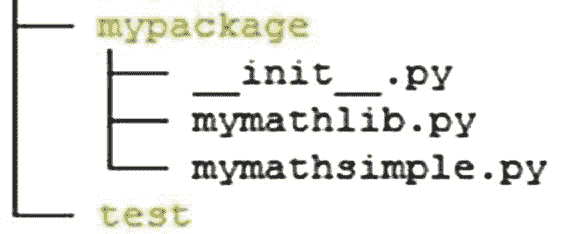
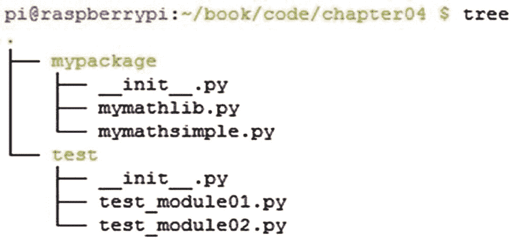
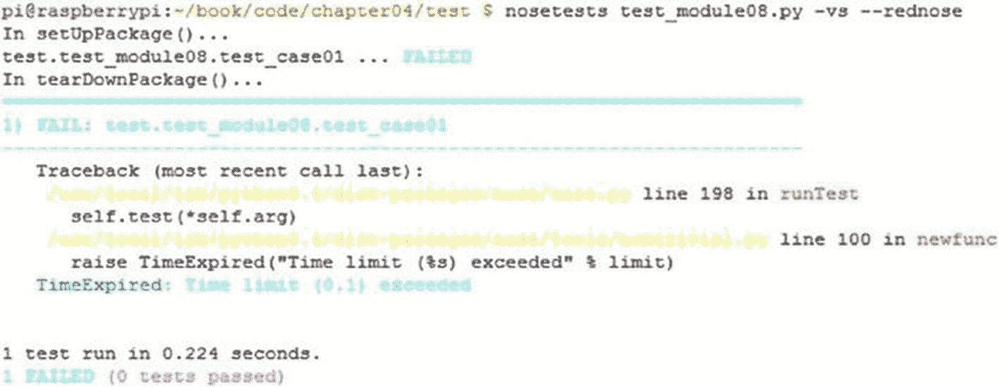

# 4.鼻子和鼻子 2

上一章介绍了`xUnit`和`unittest`。在这一章中，你将探索 Python 的另一个单元测试 API，叫做`nose`。它的口号是 *nose extends unittest 使测试更容易。*

您可以使用`nose`的 API 来编写和运行自动化测试。你也可以使用`nose`来运行在其他框架中编写的测试，比如`unittest`。本章还探讨了下一个积极开发和维护的`nose`、`nose2`的迭代。

## 鼻子入门

`nose`不是 Python 标准库的一部分。你必须安装它才能使用它。下一节将展示如何在 Python 3 上安装它。

### 在 Linux 发行版上安装 nose

在 Linux 计算机上安装`nose`最简单的方法是使用 Python 的包管理器`pip`来安装。`Pip`代表 *pip 安装包*。这是一个递归的缩写。如果您的 Linux 计算机上没有安装`pip`，您可以使用系统软件包管理器来安装它。在任何 Debian/Ubuntu 或衍生的计算机上，用下面的命令安装`pip`:

```py
sudo apt-get install python3-pip

```

在 Fedora/CentOS 及其衍生产品上，运行以下命令(假设您在操作系统上安装了 Python 3.5)来安装`pip`:

```py
sudo yum install python35-setuptools
sudo easy_install pip

```

一旦安装了`pip`,您可以使用以下命令安装`nose`:

```py
sudo pip3 install nose

```

### 在 macOS 和 Windows 上安装 nose

`pip`在 macOS 和 Windows 上预装 Python 3。用以下命令安装`nose`:

```py
pip3 install nose

```

### 验证安装

一旦安装了`nose`,运行以下命令来验证安装:

```py
nosetests -V

```

它将显示如下输出:

```py
nosetests version 1.3.7

```

在 Windows 上，此命令可能会返回错误，因此您也可以使用以下命令:

```py
python -m nose -V

```

### nose 入门

要从`nose`开始，请遵循与`unittest`相同的探索之路。在`code`目录下创建一个名为`chapter04`的目录，并将`mypackage`目录从`chapter03`目录复制到`code`。你以后会需要它的。创建一个名为`test`的目录。做完这些之后，`chapter04`目录结构应该如图 [4-1](#Fig1) 所示。



图 4-1

第 04 章目录结构

仅将所有代码示例保存到`test`目录。

### 一个简单的鼻子测试案例

清单 [4-1](#PC8) 展示了一个非常简单的`nose`测试用例。

```py
def test_case01():
    assert 'aaa'.upper() == 'AAA'

Listing 4-1test_module01.py

```

在清单 [4-1](#PC8) 中，`test_case01()`是测试函数。`assert`是 Python 的内置关键字，它的工作方式类似于`unittest`中的`assert`方法。如果您将这段代码与`unittest`框架中最简单的测试用例进行比较，您会注意到您不需要从任何父类扩展测试。这使得测试代码更加整洁，不那么混乱。

如果您尝试使用以下命令运行它，它将不会产生任何输出:

```py
python3 test_module01.py
python3 test_module01.py -v

```

这是因为您没有在代码中包含测试运行程序。

您可以使用 Python 的`-m`命令行选项来运行它，如下所示:

```py
python3 -m nose test_module01.py

```

输出如下所示:

```py
.
----------------------------------------------------------
Ran 1 test in 0.007s
OK

```

可以通过添加如下的`-v`命令行选项来调用详细模式:

```py
python3 -m nose -v test_module01.py

```

输出如下所示:

```py
test.test_module01.test_case01 ... ok
----------------------------------------------------------
Ran 1 test in 0.007s
OK

```

### 使用 nosetests 运行测试模块

您可以使用`nose`的`nosetests`命令运行测试模块，如下所示:

```py
nosetests test_module01.py

```

输出如下所示:

```py
.
----------------------------------------------------------
Ran 1 test in 0.006s
OK

```

可以按如下方式调用详细模式:

```py
nosetests test_module01.py -v

```

输出如下所示:

```py
test.test_module01.test_case01 ... ok
----------------------------------------------------------
Ran 1 test in 0.007s
OK

```

使用`nosetests`命令是运行测试模块最简单的方法。由于编码和调用风格的简单和方便，我们将使用`nosetests`来运行测试，直到我们介绍和解释`nose2`。如果命令在 Windows 中返回一个错误，您可以用 Python 解释器调用`nose`模块。

### 获得帮助

使用以下命令获取关于`nose`的帮助和文档:

```py
nosetests -h
python3 -m nose -h

```

### 组织测试代码

在前一章中，您学习了如何在不同的目录中组织项目的开发和测试代码。在这一章和下一章中，你也将遵循同样的标准。首先创建一个测试模块来测试`mypackage`中的开发代码。将清单 [4-2](#PC19) 所示的代码保存在`test`目录中。

```py
from mypackage.mymathlib import *

class TestClass01:
   def test_case01(self):
      print("In test_case01()")
      assert mymathlib().add(2, 5) == 7

Listing 4-2test_module02.py

```

清单 [4-2](#PC19) 创建了一个名为`TestClass01`的测试类。如前所述，您不必从父类扩展它。包含`assert`的行检查语句`mymathlib().add(2, 5) == 7`是否为`true`或`false`，以将测试方法标记为`PASS`或`FAIL`。

同样，创建一个`init.py`文件，将清单 [4-3](#PC20) 中的代码放在`test`目录中。

```py
all = ["test_module01", "test_module02"]

Listing 4-3init.py

```

在这之后，`chapter04`目录结构将类似于图 [4-2](#Fig2) 。



图 4-2

第 04 章目录结构

测试包现在准备好了。您可以从`chapter04`目录运行测试，如下所示:

```py
nosetests test.test_module02 -v

```

输出如下所示:

```py
test.test_module02.TestClass01.test_case01 ... ok
----------------------------------------------------------
Ran 1 test in 0.008s
OK

```

在`nose`中，运行特定测试类的惯例有点不同。下面是一个例子:

```py
nosetests test.test_module02:TestClass01 -v

```

您也可以按如下方式运行单独的测试方法:

```py
nosetests test.test_module02:TestClass01.test_case01 -v

```

### 测试发现

您在前面的章节中学习了测试发现。`nose`还支持测试发现过程。事实上，`nose`中的测试发现甚至比`unittest`中的更简单。您不必使用`discover`子命令进行测试发现。您只需要导航到项目目录(本例中是`chapter04`)并运行`nosetests`命令，如下所示:

```py
nosetests

```

您也可以在详细模式下调用此流程:

```py
nosetests -v

```

输出如下所示:

```py
test.test_module01.test_case01 ... ok test.test_module02.TestClass01.test_case01 ... ok
Ran 2 tests in 0.328s
OK

```

正如您在输出中看到的，`nosetests`自动发现测试包并运行它的所有测试模块。

## 类、模块和方法的夹具

`nose`提供了`xUnit`风格的夹具，其行为方式与`unittest`中的夹具相似。甚至灯具的名称也是一样的。考虑清单 [4-4](#PC28) 中的代码。

```py
from mypackage.mymathlib import *

math_obj = 0

def setUpModule():
    """called once, before anything else in this module"""
    print("In setUpModule()...")
    global math_obj
    math_obj = mymathlib()

def tearDownModule():
    """called once, after everything else in this module"""
    print("In tearDownModule()...")
    global math_obj del math_obj
class TestClass02:
    @classmethod
    def setUpClass(cls):
       """called once, before any test in the class"""
       print("In setUpClass()...")

    def setUp(self):
       """called before every test method"""
       print("\nIn setUp()...")

    def test_case01(self):
       print("In test_case01()")
       assert math_obj.add(2, 5) == 7

    def test_case02(self):
       print("In test_case02()")

    def tearDown(self):
      """called after every test method"""
      print("In tearDown()...")

    @classmethod
    def tearDownClass(cls):
       """called once, after all tests, if setUpClass() successful"""
       print ("\nIn tearDownClass()...")

Listing 4-4test_module03.py

```

如果用下面的命令运行清单 [4-4](#PC28) 中的代码:

```py
nosetests test_module03.py -v

```

输出如下所示:

```py
test.test_module03.TestClass02.test_case01 ... ok test.test_module03.TestClass02.test_case02 ... ok
----------------------------------------------------------
Ran 2 tests in 0.010s
OK

```

为了获得关于测试执行的更多细节，您需要在命令行中添加`-s`选项，这允许任何`stdout`输出立即在命令行中打印出来。

运行以下命令:

```py
nosetests test_module03.py -vs

```

输出如下所示:

```py
In setUpModule()...
Creating object : mymathlib
In setUpClass()...
test.test_module03.TestClass02.test_case01 ...
In setUp()...
In test_case01()
In tearDown()...
ok
test.test_module03.TestClass02.test_case02 ...
In setUp()...
In test_case02()
In tearDown()...
ok

In tearDownClass()...
In tearDownModule()...
Destroying object : mymathlib
----------------------------------------------------------
Ran 2 tests in 0.011s
OK

```

从现在开始，在执行测试时，示例将把`-s`选项添加到`nosetests`命令中。

### 功能装置

在开始学习函数的 fixtures 之前，您必须理解 Python 中函数和方法之间的区别。一个*函数*是一段执行操作的命名代码，一个*方法*是一个带有额外参数的函数，该参数是它运行的对象。函数不与类相关联。一个方法总是与一个类相关联。

查看清单 [4-5](#PC33) 中的代码作为例子。

```py
from nose.tools import with_setup

def setUpModule():
    """called once, before anything else in this module"""
    print("\nIn setUpModule()...")

def tearDownModule():
    """called once, after everything else in this module"""
    print("\nIn tearDownModule()...")

def setup_function():
    """setup_function(): use it with @with_setup() decorator"""
    print("\nsetup_function()...")

def teardown_function():
    """teardown_function(): use it with @with_setup() decorator"""
    print("\nteardown_function()...")

def test_case01():
    print("In test_case01()...")

def test_case02():
    print("In test_case02()...")

@with_setup(setup_function, teardown_function)
def test_case03():
    print("In test_case03()...")

Listing 4-5test_module04.py

```

在清单 [4-5](#PC33) 的代码中，`test_case01()`、`test_case02()`、`test_case03()`、`setup_ function()`、`teardown_function()`是函数。它们不与类相关联。你必须使用从`nose.tools`导入的`@with_setup()`装饰器，将`setup_function()`和`teardown_function()`指定为`test_case03()`的夹具。`nose`将`test_case01()`、`test_case02()`和`test_case03()`识别为测试函数，因为由于`@with_setup()`装饰器，以`test_. setup_function()`和`teardown_function()`开头的名称被识别为`test_case03()`的夹具。

`test_case01()`和`test_case02()`功能没有分配任何夹具。

让我们用下面的命令运行这段代码:

```py
nosetests test_module04.py -vs

```

输出如下所示:

```py
In setUpModule()...
test.test_module04.test_case01 ... In test_case01()...
ok
test.test_module04.test_case02 ... In test_case02()...
ok
test.test_module04.test_case03 ... setup_function()...
In test_case03()...

teardown_function()...
ok

In tearDownModule()...
----------------------------------------------------------
Ran 3 tests in 0.011s
OK

```

正如您在输出中看到的，`setup_function()`和`teardown_function()`分别在`test_case03()`之前和之后运行。`unittest`没有在测试功能级别提供夹具。实际上，`unittest`不支持独立测试函数的概念，因为所有的东西都必须从`TestCase`类扩展，而一个函数不能被扩展。

不一定要将函数级的 fixtures 命名为`setup_function()`和`teardown_function()`。您可以随意命名它们(当然，除了 Python 3 的保留关键字)。只要你在`@with_setup()`装饰器中使用它们，它们就会在测试函数之前和之后被执行。

#### 包装固定装置

`unittest`没有封装级夹具的规定。当测试包或测试包的一部分被调用时，包夹具被执行。将`test`目录中的`init.py`文件的内容更改为清单 [4-6](#PC36) 中所示的代码。

```py
all = ["test_module01", "test_module02", "test_module03", "test_module04"]

def setUpPackage():
    print("In setUpPackage()...")

def tearDownPackage():
    print("In tearDownPackage()...")

Listing 4-6init.py

```

如果您现在运行这个包中的一个模块，那么包级的 fixtures 将在开始任何测试之前以及包中的整个测试之后运行。运行以下命令:

```py
nosetests test_module03.py -vs

```

以下是输出:

```py
In setUpPackage()...
In setUpModule()...
Creating object : mymathlib
In setUpClass()...
test.test_module03.TestClass02.test_case01 ...
In setUp()...
In test_case01()
In tearDown()...
ok
test.test_module03.TestClass02.test_case02 ...
In setUp()...
In test_case02() In tearDown()...
ok

In tearDownClass()...
In tearDownModule()...
Destroying object : mymathlib
In tearDownPackage()...
----------------------------------------------------------
Ran 2 tests in 0.012s
OK

```

#### 鼻固定装置的别名

该表列出了`nose`夹具的别名。

<colgroup><col class="tcol1 align-left"> <col class="tcol2 align-left"></colgroup> 
| 

固定装置

 | 

替代名称

 |
| --- | --- |
| `setUpPackage` | `setup, setUp, or setup_package` |
| `tearDownPackage` | `teardown, tearDown, or teardown_package` |
| `setUpModule` | `setup, setUp, or setup_module` |
| `tearDownModule` | `teardown, tearDown, or teardown_module` |
| `setUpClass` | `setupClass, setup_class, setupAll, or setUpAll` |
| `tearDownClass` | `teardownClass, teardown_class, teardownAll, or tearDownAll` |
| `setUp (class method fixtures)` | `setup` |
| `tearDown (class method fixtures)` | `Teardown` |

#### assert_equals()

到目前为止，您一直使用 Python 的内置关键字`assert`来对照预期值检查实际结果。`nose`对此自有`assert_equals()`的方法。清单 [4-7](#PC39) 中的代码演示了`assert_equals()`和`assert`的用法。

```py
from nose.tools import assert_equals

def test_case01():
    print("In test_case01()...")
    assert 2+2 == 5

def test_case02():
    print("In test_case02()...")
    assert_equals(2+2, 5)

Listing 4-7test_module05.py

```

运行清单 [4-7](#PC39) 中的代码。以下是输出:

```py
In setUpPackage()...
test.test_module05.test_case01 ... In test_case01()...
FAIL
test.test_module05.test_case02 ... In test_case02()...
FAIL
In tearDownPackage()...

============================================================
FAIL: test.test_module05.test_case01
----------------------------------------------------------
Traceback (most recent call last):
   File "/usr/local/lib/python3.4/dist-packages/nose/case.py", line 198, in runTest
   self.test(*self.arg)
   File "/home/pi/book/code/chapter04/test/test_module05.py", line 6, in test_case01
   assert 2+2 == 5
AssertionError
===========================================================
FAIL: test.test_module05.test_case02
----------------------------------------------------------
Traceback (most recent call last):
   File "/usr/local/lib/python3.4/dist-packages/nose/case.py", line 198, in runTest
   self.test(*self.arg)
   File "/home/pi/book/code/chapter04/test/test_module05.py", line 11, in test_case02
   assert_equals(2+2, 5)
AssertionError: 4 != 5
----------------------------------------------------------
Ran 2 tests in 0.013s
FAILED (failures=2)

```

由于不正确的测试输入，两个测试案例都失败了。请注意这些测试方法打印的日志之间的差异。在`test_case02()`中，你会得到更多关于失败原因的信息，因为你使用的是`nose`的`assert_equals()`方法。

## 测试工具

有一些方法和装饰器在你自动化测试时会非常方便。这一节将介绍其中的一些测试工具。

### ok_ 和 eq_

`ok_`和`eq_`分别是`assert`和`assert_equals()`的简称。当测试用例失败时，它们还带有一个错误消息的参数。清单 [4-8](#PC41) 中的代码演示了这一点。

```py
from nose.tools import ok_, eq_

def test_case01():
    ok_(2+2 == 4, msg="Test Case Failure...")

def test_case02():
    eq_(2+2, 4, msg="Test Case Failure...")

def test_case03():
    ok_(2+2 == 5, msg="Test Case Failure...")

def test_case04():
    eq_(2+2, 5, msg="Test Case Failure...")

Listing 4-8test_module06.py

```

下面显示了清单 [4-8](#PC41) 中代码的输出。

```py
In setUpPackage()... test.test_module06.test_case01 ... ok test.test_module06.test_case02 ... ok test.test_module06.test_case03 ... FAIL test.test_module06.test_case04 ... FAIL
In tearDownPackage()...

===========================================================
FAIL: test.test_module06.test_case03
----------------------------------------------------------
Traceback (most recent call last):
   File "/usr/local/lib/python3.4/dist-packages/nose/case.py", line 198, in runTest
   self.test(*self.arg)
   File "/home/pi/book/code/chapter04/test/test_module06.py", line 13, in test_case03
   ok_(2+2 == 5, msg="Test Case Failure...")
AssertionError: Test Case Failure...

============================================================
FAIL: test.test_module06.test_case04
----------------------------------------------------------
Traceback (most recent call last):
   File "/usr/local/lib/python3.4/dist-packages/nose/case.py", line 198, in runTest
   self.test(*self.arg)
   File "/home/pi/book/code/chapter04/test/test_module06.py", line 17, in test_case04
   eq_(2+2, 5, msg="Test Case Failure...")
AssertionError: Test Case Failure...
----------------------------------------------------------
Ran 4 tests in 0.015s
FAILED (failures=2)

```

### @raises()装饰器

当您在测试之前使用`raises`装饰器时，它必须引发与`@raises()`装饰器相关的异常列表中提到的一个异常。清单 [4-9](#PC43) 展示了这个想法。

```py
from nose.tools import raises

@raises(TypeError, ValueError)
def test_case01():
    raise TypeError("This test passes")

@raises(Exception)
def test_case02():
    pass

Listing 4-9test_module07.py

```

输出如下所示:

```py
In setUpPackage()...
test.test_module07.test_case01 ... ok test.test_module07.test_case02 ... FAIL
In tearDownPackage()...

===========================================================
FAIL: test.test_module07.test_case02
----------------------------------------------------------
Traceback (most recent call last):
   File "/usr/local/lib/python3.4/dist-packages/nose/case.py", line 198, in runTest
   self.test(*self.arg)
   File "/usr/local/lib/python3.4/dist-packages/nose/tools/nontrivial.py", line 67, in newfunc
   raise AssertionError(message)
AssertionError: test_case02() did not raise Exception
----------------------------------------------------------
Ran 2 tests in 0.012s
FAILED (failures=1)

```

如您所见，`test_case02()`失败了，因为它没有在应该引发异常时引发异常。你可以巧妙地利用这一点来编写负面的测试用例。

### @timed()装饰器

如果您在测试中使用一个定时装饰器，测试必须在`@timed()`装饰器中提到的时间内完成才能通过。清单 [4-10](#PC45) 中的代码演示了这个想法。

```py
from nose.tools import timed
import time

@timed(.1)
def test_case01():
    time.sleep(.2)

Listing 4-10test_module10.py

```

这个测试失败了，因为它花费了比`@timed()`装饰器中分配的更多的时间来完成测试。执行的输出如下:

```py
In setUpPackage()...
test.test_module08.test_case01 ... FAIL
In tearDownPackage()...

=========================================================
FAIL: test.test_module08.test_case01
----------------------------------------------------------
Traceback (most recent call last):
   File "/usr/local/lib/python3.4/dist-packages/nose/case.py", line 198, in runTest
   self.test(*self.arg)
   File "/usr/local/lib/python3.4/dist-packages/nose/tools/nontrivial.py", line 100, in newfunc
   raise TimeExpired("Time limit (%s) exceeded" % limit) nose.tools.nontrivial.TimeExpired: Time limit (0.1) exceeded
----------------------------------------------------------
Ran 1 test in 0.211s
FAILED (failures=1)

```

它是可以一起执行或计划一起执行的相关测试的集合或组。

## 报表生成

让我们看看使用`nose`生成可理解的报告的各种方法。

### 创建 XML 报告

`nose`有一个生成 XML 报告的内置特性。这些是`xUnit`风格的格式化报告。你必须使用`--with-xunit`来生成报告。报告在当前工作目录中生成。

在`test`目录中运行以下命令:

```py
nosetests test_module01.py -vs --with-xunit

```

输出如下所示:

```py
In setUpPackage()...
test.test_module01.test_case01 ... ok
In tearDownPackage()...
----------------------------------------------------------
XML: /home/pi/book/code/chapter04/test/nosetests.xml
----------------------------------------------------------
Ran 1 test in 0.009s
OK

```

生成的 XML 文件如清单 [4-11](#PC49) 所示。

```py
<?xml version="1.0" encoding="UTF-8"?>
<testsuite name="nosetests" tests="1" errors="0" failures="0" skip="0">
<testcase classname="test.test_module01" name="test_case01" time="0.002">
</testcase>
</testsuite>

Listing 4-11nosetests.xml

```

### 创建 HTML 报告

`nose`没有内置的 HTML 报告功能。你必须为此安装一个插件。运行以下命令安装 HTML 输出插件:

```py
sudo pip3 install nose-htmloutput

```

安装插件后，您可以运行以下命令来执行测试:

```py
nosetests test_module01.py -vs --with-html

```

以下是输出:

```py
In setUpPackage()...
test.test_module01.test_case01 ... ok
In tearDownPackage()...
----------------------------------------------------------
HTML: nosetests.html
----------------------------------------------------------
Ran 1 test in 0.009s
OK

```

该插件将输出保存在名为`nosetests.html`的文件中的当前位置。

图 [4-3](#Fig3) 显示了在网络浏览器中打开的`nosetests.html`文件的快照。


图 4-3

nosetests.html 档案

### 在控制台中创建彩色输出

到目前为止，您已经看到了生成格式化输出文件的方法。运行`nosetest`时，您一定已经观察到控制台输出是单色的(黑色背景上的白色文本，反之亦然)。名为`rednose`的插件用于创建彩色的控制台输出。您可以使用以下命令安装该插件:

```py
sudo pip3 install rednose

```

安装插件后，运行以下命令:

```py
nosetests test_module08.py -vs --rednose

```

图 [4-4](#Fig4) 显示了输出的屏幕截图，尽管由于已出版书籍的灰度特性，您在这里看不到彩色的。



图 4-4

红鼻子示范

## 从 nose 运行 unittest 测试

在本章的开始，你读到了你可以用`nose`运行`unittest`测试。让我们现在试试。导航到`chapter03`目录。运行以下命令，自动发现并执行所有的`unittest`测试:

```py
nosetests -v

```

这是输出:

```py
test_case01 (test.test_module01.TestClass01) ... ok
test_case02 (test.test_module01.TestClass01) ... ok
test_case01 (test.test_module02.TestClass02) ... ok
test_case02 (test.test_module02.TestClass02) ... ok
test_case01 (test.test_module03.TestClass03) ... ok
test_case02 (test.test_module03.TestClass03) ... ok
test_case03 (test.test_module03.TestClass03) ... FAIL test_case04 (test.test_module03.TestClass03) ... FAIL test_case01 (test.test_module04.TestClass04) ... ok

```

我截断了输出，否则它会填满许多页面。自己运行命令来查看整个输出。

## 从 nose 运行 doctest 测试

您可以从`nose`运行`doctest`测试，如下所示。首先导航到保存`doctest`测试的目录:

```py
cd ~/book/code/chapter02

```

然后按如下方式运行测试:

```py
nosetests -v

```

输出如下所示:

```py
This is test_case01(). ... ok
This is test_function01(). ... ok

----------------------------------------------------------
Ran 2 tests in 0.007s

OK

```

## nose 优于 unittest 的优势

下面总结一下`nose`相对于`unittest`的优势:

*   与`unittest`不同，`nose`不需要你从父类中扩展测试用例。这导致更少的代码。

*   使用`nose`，可以编写测试函数。这在`unittest`中是不可能的。

*   `nose`比`unittest`拥有更多的夹具。除了常规的`unittest`夹具，`nose`还有包级和功能级夹具。

*   `nose`有夹具的替代名称。

*   为自动化测试用例提供了许多特性。

*   测试发现在`nose`中比在`unittest`中更简单，因为`nose`不需要带有`discover`子命令的 Python 解释器。

*   `nose`可以轻松识别和运行`unittest`测试。

## 鼻子的缺点

`nose`唯一也是最大的缺点是，它没有处于积极的开发中，过去几年一直处于维护模式。如果没有新的人或团队来接管维护工作，它很可能会停止。如果你计划开始一个项目，并且正在为 Python 3 寻找一个合适的自动化框架，你应该使用`pytest`、`nose2`或者普通的`unittest`。

你可能会奇怪，如果它没有被积极地开发，我为什么还要花时间去讨论`nose`。原因是学习像`nose`这样更高级的框架有助于你理解`unittest`的局限性。此外，如果您正在使用一个使用`nose`作为测试自动化和/或单元测试框架的老项目，它将帮助您理解您的测试。

## 使用 nose2

`nose2`是 Python 的下一代测试。它基于`unittest2`的插件分支。

`nose2`旨在从以下方面对`nose`进行改进:

*   它提供了一个更好的插件 API。

*   用户更容易配置。

*   它简化了内部接口和流程。

*   它支持来自相同代码库的 Python 2 和 3。

*   它鼓励社区更多地参与其发展。

*   与`nose`不同，它正在积极开发中。

`nose2`可以使用以下命令方便地安装:

```py
sudo pip3 install nose2

```

安装后，可以通过在命令提示符下运行`nose2`来调用`nose2`。

它可用于自动发现和运行`unittest`和`nose`测试模块。在命令提示符下运行`nose2 -h`命令，获得各种`nose2`命令行选项的帮助。

以下是`nose`和`nose2`的重要区别:

*   Python 版本

`nose`支持 Python 及以上版本。`nose2`支持 pypy，2.6，2.7，3.2，3.3，3.4，3.5。`nose2`不支持所有版本，因为不可能在一个代码库中支持所有 Python 版本。

*   测试负载

`nose`逐个加载并执行测试模块，称为*懒加载*。相反，`nose2`首先加载所有模块，然后一次执行所有模块。

*   测试发现

由于测试加载技术的不同，`nose2`并不支持所有的项目布局。图 [4-5](#Fig5) 所示的布局由`nose`支撑。但是，`nose2`不会正确加载。`nose`可以区分`./dir1/test.py`和`./dir1/dir2/test.py`。


图 4-5

nose2 不支持的测试布局

您可以使用`nose2`运行测试，如下所示:

```py
nose2 -v

```

您还可以参数化测试，如清单 [4-12](#PC62) 所示。

```py
from nose2.tools import params

@params("Test1234", "1234Test", "Dino Candy")
def test_starts_with(value):
    assert value.startswith('Test')

Listing 4-12test_module09.py

```

您可以按如下方式运行测试:

```py
nose2 -v

```

或者

```py
python -m nose2 test_module09

```

输出如下所示:

```py
.FF
=============================================================
FAIL: test_module09.test_starts_with:2
'1234Test'
-------------------------------------------------------------
Traceback (most recent call last):
  File "C:\Users\Ashwin\Google Drive\Python Unit Test Automation - Second Edition\Code\chapter04\test\test_module09.py", line 5, in test_starts_with
    assert value.startswith('Test')
AssertionError

==============================================================
FAIL: test_module09.test_starts_with:3
'Dino Candy'
--------------------------------------------------------------
Traceback (most recent call last):
  File "C:\Users\Ashwin\Google Drive\Python Unit Test Automation - Second Edition\Code\chapter04\test\test_module09.py", line 5, in test_starts_with
    assert value.startswith('Test')
AssertionError

----------------------------------------------------------
Ran 3 tests in 0.002s

FAILED (failures=2)

```

您可以通过修改代码直接从任何 IDE 启动测试脚本，而无需指定`nose2`模块，如清单 [4-13](#PC66) 所示。

```py
from nose2.tools import params

@params("Test1234", "1234Test", "Dino Candy")
def test_starts_with(value):
    assert value.startswith('Test')

if __name__ == '__main__':
    import nose2
    nose2.main()

Listing 4-13test_module20.py

```

您可以直接从任何 IDE(如 IDLE)启动它，它会产生相同的结果。

Exercise 4-1

检查您组织中的代码库是否在使用`unittest`、`nose`或`nose2`。咨询代码库的所有者，计划从这些框架到更好、更灵活的单元测试框架的迁移。

## 结论

在本章中，你学习了高级单元测试框架`nose`。不幸的是，它没有被积极开发，所以你需要使用`nose2`作为`nose`测试的测试员。在下一章中，您将了解并探索一个叫做`py.test`的高级测试自动化框架。