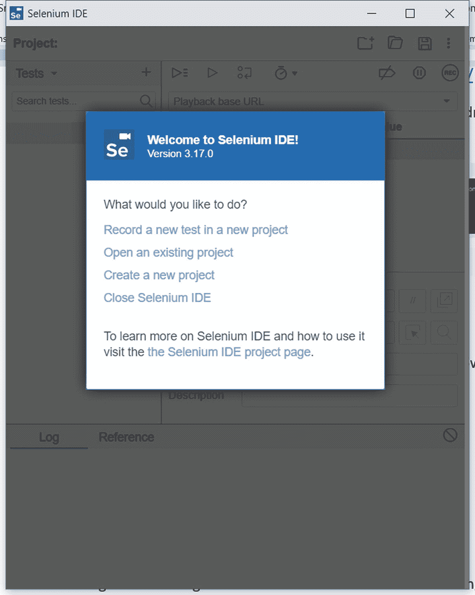
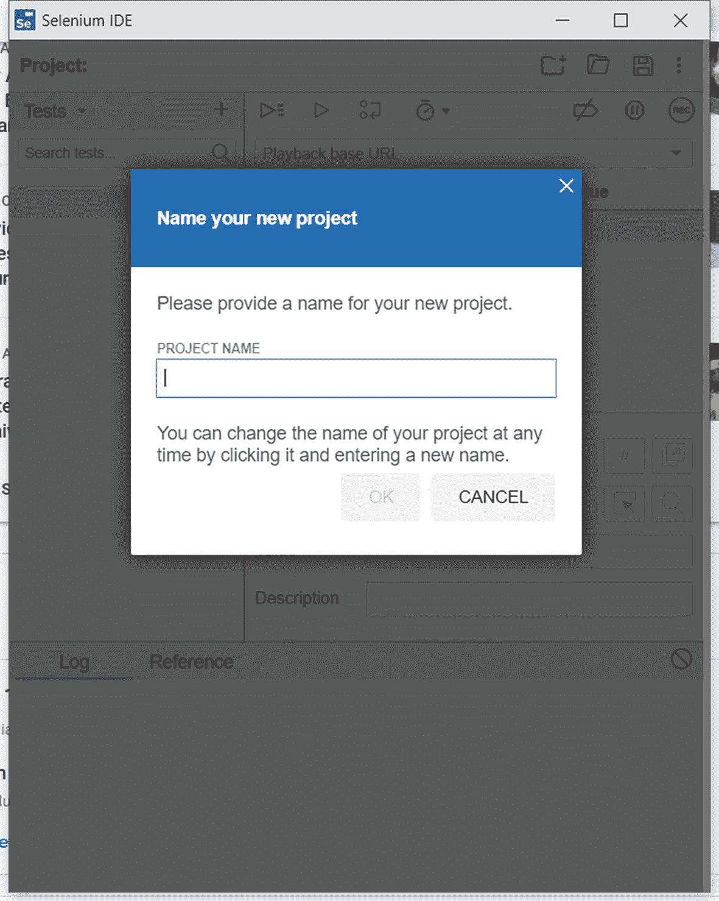
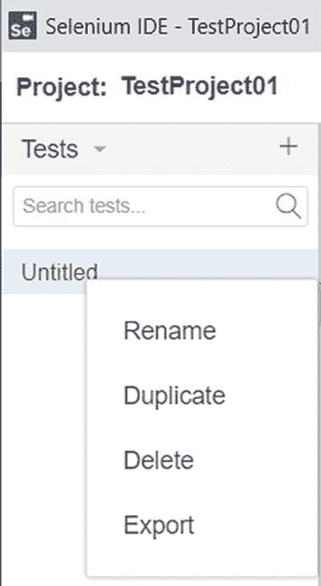
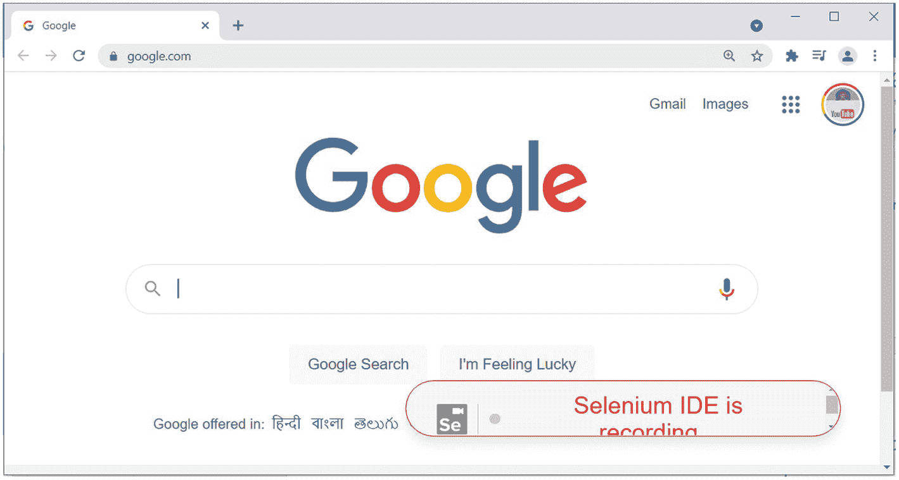

# 六、Selenium 测试

在上一章中，您已经熟悉了一个单元测试框架，`pytest`。现在，您应该对使用`pytest`框架编写单元测试有些熟悉了。在这一章中，你将学习名为 Selenium 的 webdriver 框架。

## Selenium 简介

Selenium 是一个 webdriver 框架。它用于浏览器自动化。这意味着您可以通过编程方式打开浏览器程序(或浏览器应用)。您手动执行的所有浏览器操作都可以通过 webdriver 框架以编程方式执行。Selenium 是用于浏览器自动化的最流行的 webdriver 框架。

Jason Huggins 于 2004 年在 ThoughtWorks 开发了 Selenium 作为工具。它旨在供组织内部使用。该工具流行起来后，许多人加入了它的开发，并被开源。此后，它作为开放源代码继续发展。哈金斯于 2007 年加入谷歌，并继续开发该工具。

名称 *Selenium* 是 Mercury Interactive 上开的一个玩笑，它也创造了测试自动化的专有工具。笑话是汞中毒可以用 Selenium 治愈，所以新的开源框架被命名为 Selenium。Selenium 和汞都是元素周期表中的元素。

ThoughtWorks 的 Simon Stewart 开发了一个叫做 WebDriver 的浏览器自动化工具。ThoughtWorks 和 Google 的开发人员在 2009 年的 Google 测试自动化会议上相遇，并决定合并 Selenium 和 Webdriver 项目。这个新框架被命名为 Selenium Webdriver 或 Selenium 2.0。

Selenium 有三个主要成分:

*   Selenium IDE

*   Selenium Webdriver

*   Selenium 栅

在本章中，你将会读到 Selenium IDE 和 Selenium Webdriver。

## Selenium IDE

Selenium IDE 是一个用于记录浏览器动作的浏览器插件。录制后，您可以回放整个动作序列。您还可以将脚本操作导出为各种编程语言的代码文件。让我们从在 Chrome 和 Firefox 浏览器上安装插件开始。

使用以下 URL 将扩展添加到 Chrome web 浏览器:

[T2`https://chrome.google.com/webstore/detail/selenium-ide/mooikfkahbdckldjjndioackbalphokd`](https://chrome.google.com/webstore/detail/selenium-ide/mooikfkahbdckldjjndioackbalphokd)

一旦它被添加，你可以从地址栏旁边的菜单中访问它，如图 6-1 所示。


图 6-1。

铬的 Selenium IDE

您可以从以下 URL 访问 Firefox 浏览器的附加组件:

[T2`https://addons.mozilla.org/en-GB/firefox/addon/selenium-ide/`](https://addons.mozilla.org/en-GB/firefox/addon/selenium-ide/)

添加后，可以从地址栏旁边的菜单中访问，如图 6-2 右上角所示。


图 6-2。

铬的 Selenium IDE

在各自的浏览器中点击这些选项会打开一个窗口，如图 6-3 所示。



图 6-3。

Selenium IDE 窗口

Selenium IDE 的 GUI 对于所有浏览器都是一样的。点击新建项目，打开新窗口，如图 6-4 所示。



图 6-4。

Selenium 新项目

输入您选择的名称。这将启用确定按钮。点击确定按钮，显示图 6-5 中的窗口。


图 6-5。

Selenium IDE 窗口

如您所见，该窗口分为多个部分。在左上方，您可以看到项目的名称。在右上角，有三个图标。单击第一个图标会创建一个新项目。第二个图标用于打开现有项目。第三个图标保存当前项目。保存的文件有一个`*.side`扩展名(Selenium IDE)。

让我们重命名现有的测试。检查左侧选项卡。可以看到一个未命名的测试，如图 6-6 所示。



图 6-6。

重命名未命名的测试

当您保存项目时，它会尝试将其保存为一个新文件。您必须通过覆盖先前的文件来用现有的名称保存它。现在，单击录制按钮。快捷键是 Ctrl+U，它会打开一个新的对话框，要求您输入项目的基本 URL 见图 6-7 。


图 6-7

项目基本 URL

你必须输入要测试的网页的网址。URL 还应该包含文本`http://`或`https://`，否则不会将其视为 URL。在 [`http://www.google.com`](http://www.google.com) 输入框中输入。然后，它将启用开始录制按钮。录制按钮是红色的，位于窗口的右上角。点击按钮，它将启动一个新的窗口与指定的网址。看起来像图 6-8 。



图 6-8。

Selenium IDE 记录

在搜索栏中输入 **Python** ，然后点击谷歌搜索。它会向您显示搜索结果。单击第一个结果，然后在加载页面后，关闭浏览器窗口。然后单击菜单中的按钮停止录制。你会在 IDE 中看到记录的步骤，如图 6-9 所示。


图 6-9。

记录后的 Selenium IDE

您可以自动重新运行所有步骤。您可以在录制按钮的同一栏中看到一组四个图标。第一个图标用于运行所有测试，第二个图标用于运行当前测试。当前项目只有一个测试，因此它将运行套件中唯一的测试。单击任一按钮，自动重复这一系列操作。

这样你就可以记录和执行一系列的动作。一旦记录的测试成功执行，底部将显示日志，如图 6-10 所示。


图 6-10。

Selenium IDE 日志

您可以通过单击菜单中的+图标向项目中添加新的测试。一个项目通常会有多个测试。现在，您将学习如何导出项目。你可以右击测试打开菜单，如图 6-6 所示。单击导出选项。它打开一个新窗口，如图 6-11 所示。


图 6-11。

将项目导出为代码

选中顶部的两个选项，然后单击导出按钮。它将打开一个名为另存为的窗口。提供详细信息，它会将项目保存为 Python 文件，扩展名为`*.py`,保存在指定的目录中。生成的代码如清单 6-1 所示。

```py
# Generated by Selenium IDE
import pytest
import time
import json
from selenium import webdriver
from selenium.webdriver.common.by import By
from selenium.webdriver.common.action_chains import ActionChains
from selenium.webdriver.support import expected_conditions
from selenium.webdriver.support.wait import WebDriverWait
from selenium.webdriver.common.keys import Keys
from selenium.webdriver.common.desired_capabilities import DesiredCapabilities

class TestTest01():
  def setup_method(self, method):
    self.driver = webdriver.Chrome()
    self.vars = {}

  def teardown_method(self, method):
    self.driver.quit()

  def test_test01(self):
    # Test name: Test01
    # Step # | name | target | value
    # 1 | open | / |
    self.driver.get("https://www.google.com/")
    # 2 | setWindowSize | 1042x554 |
    self.driver.set_window_size(1042, 554)
    # 3 | type | name=q | python
    self.driver.find_element(By.NAME, "q").send_keys("python")
    # 4 | click | css=form > div:nth-child(1) |
    self.driver.find_element(By.CSS_SELECTOR, "form > div:nth-child(1)").click()
    # 5 | click | css=center:nth-child(1) > .gNO89b |
    self.driver.find_element(By.CSS_SELECTOR, "center:nth-child(1) > .gNO89b").click()
    # 6 | click | css=.eKjLze .LC20lb |
    self.driver.find_element(By.CSS_SELECTOR, ".eKjLze .LC20lb").click()
    # 7 | close |  |
    self.driver.close()

Listing 6-1test_test01.py

```

这就是如何将自动化测试导出到 Python 的方法。您可以使用`unittest`框架运行这个文件，以便稍后重现测试。暂时不要执行代码，因为您还没有为 Python 安装 Selenium 框架。在下一节中，您将分析并学习编写自己的代码。

## Selenium Webdriver

Selenium IDE 是一个插件。它只是一个记录和回放工具，带有一点定制测试用例的条款。如果你想完全控制你的测试，你应该能够从头开始写。Selenium Webdriver 允许您这样做。

上一节中导出的代码使用 webdriver 实现浏览器自动化。在这里，您将看到如何从头开始编写自己的代码。您可以使用以下命令安装 Selenium Webdriver:

```py
pip3 install selenium

```

现在，您可以运行上一节中保存的代码。

让我们看看如何从头开始编写代码。查看清单 6-2 中的代码。

```py
from selenium import webdriver
driver_path=r'D:\\drivers\\geckodriver.exe'
driver = webdriver.Firefox(executable_path=driver_path)
driver.close()

Listing 6-2prog00.py

```

请逐行考虑这段代码。第一行将库导入到程序中。第二行定义了一个字符串。该字符串包含您要自动化的浏览器的驱动程序可执行文件的路径。您可以从以下 URL 下载各种浏览器的驱动程序:

[T2`https://sites.google.com/chromium.org/driver/`](https://sites.google.com/chromium.org/driver/)

[T2`https://developer.microsoft.com/en-us/microsoft-edge/tools/webdriver/`](https://developer.microsoft.com/en-us/microsoft-edge/tools/webdriver/)

[T2`https://github.com/mozilla/geckodriver/releases`](https://github.com/mozilla/geckodriver/releases)

访问这些网页并下载适合您的操作系统(Windows/Linux/macOS)和体系结构(32/64 位)组合的驱动程序。我将它们下载并保存在 Windows 64 位操作系统上由`D:\drivers`标识的位置。

第三行创建一个驱动对象，第四行关闭它。从空闲或命令行启动程序。它将立即打开和关闭浏览器。如果你使用 IDLE，它也会单独打开`geckodriver.exe`文件，你必须手动关闭它。您将很快看到如何以编程方式终止它。现在，手动关闭它。查看列表 6-3 。

```py
from selenium import webdriver
driver_path=r'D:\\drivers\\chromedriver.exe'
driver = webdriver.Chrome(executable_path=driver_path)
driver.close()
driver.quit()

Listing 6-3prog01.py

```

这里，你正在使用 Chrome 驱动程序，并在最后一行关闭驱动程序可执行文件。运行这个程序来查看代码的运行情况。接下来，让我们试验一下 edge 浏览器，并在代码中添加一些等待时间。查看清单 6-4 。

```py
from selenium import webdriver
import time
driver_path=r'D:\\drivers\\msedgedriver.exe'
driver = webdriver.Edge(executable_path=driver_path)
time.sleep(10)
driver.close()
time.sleep(5)
driver.quit()

Listing 6-4prog02.py

```

运行代码以查看它的运行情况。

你也可以为 Safari 浏览器编写代码。Safari webdriver 预装在 macOS 中。可以在`/usr/bin/safaridriver`找到。您可以使用以下 shell 命令来启用它:

```py
safaridriver –enable

```

您可以使用 Python 中的以下代码行创建驱动程序对象:

```py
driver = webdriver.Safari()

```

## Selenium 与单位测试

可以用 Selenium 框架搭配`unittest`。这样，您可以为不同的情况创建不同的测试。您可以通过这种方式跟踪测试的进展。参见清单 6-5 。

```py
import unittest
from selenium import webdriver

class TestClass01(unittest.TestCase):

    def setUp(self):
        driver_path=r'D:\\drivers\\geckodriver.exe'
        driver = webdriver.Firefox(executable_path=driver_path)
        self.driver = driver
        print ("\nIn setUp()...")

    def tearDown(self):
        print ("\nIn tearDown")
        self.driver.close()
        self.driver.quit()

    def test_case01(self):
        print("\nIn test_case01()...")
        self.driver.get("http://www.python.org")
        assert self.driver.title == "Welcome to Python.org"

if __name__ == "__main__":
    unittest.main()

Listing 6-5test_test02.py

```

这个脚本创建 webdriver 对象，打开一个网页并检查其标题，完成后，它关闭浏览器窗口和 webdriver。运行脚本来看看它的运行情况。

## 结论

在本章中，您学习了使用 Selenium 实现 web 浏览器自动化的基础知识。您还了解了 Selenium IDE 以及如何将`unittest`与 Selenium 结合起来。

下一章专门讨论 Python 中的日志机制。