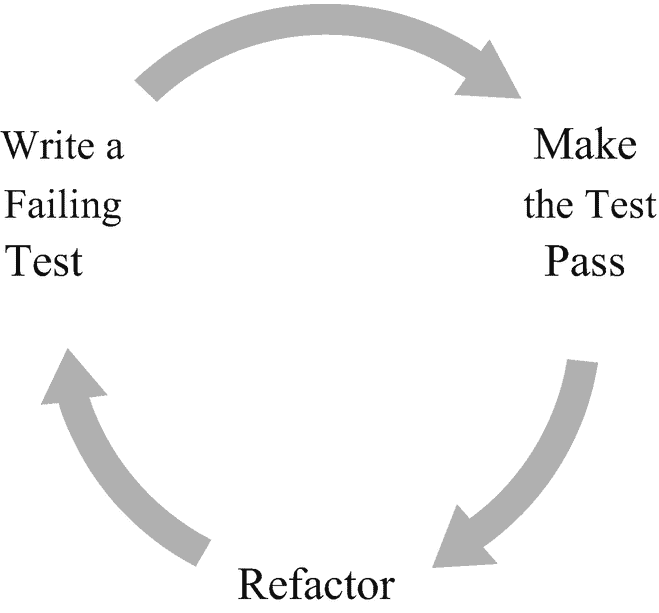

# 八、提示和技巧

在本书的第一章，你大概了解了 Python 的历史和哲学。后续章节探讨了 Python 中各种测试自动化框架的特性。你探索的框架有`doctest`、`unittest`、`nose`、`nose2`、`pytest`。后来，您详细了解了 Selenium 和日志记录。本章着眼于编码约定，这些编码约定将使得跨这些框架的测试发现更加容易。然后，您将看到*测试驱动开发*的概念，并了解如何在`pytest`的帮助下在 Python 3 项目中实现它。

## 便于测试发现的编码和文件命名约定

您已经看到所有的`xUnit`风格的框架都包括测试发现，也就是测试的自动检测、执行和报告生成。这是一个非常重要的特性，因为它让代码测试人员的生活更加轻松。您甚至可以使用 OS 调度程序(例如，基于 Linux 的操作系统中的`cron`和 Windows 中的 Windows Scheduler)来调度测试发现过程，它们将在调度的时间自动运行测试。

为了确保测试发现系统成功地检测到所有测试，我通常遵循以下代码和文件名约定:

*   所有测试模块(测试文件)的名称应该以`test_`开头

*   所有测试函数的名称都应以`test_`开头

*   所有测试类的名称都应该以`Test`开头

*   所有测试方法的名称都应以`test_`开头

*   将所有测试分组到测试类和包中

*   所有包含测试代码的包都应该有一个`init.py`文件

遵循 PEP 8 的代码惯例总是一个好主意。可见于 [`https://www.python.org/dev/peps/pep-0008/`](https://www.python.org/dev/peps/pep-0008/) 。

如果您对您的代码和文件名使用这些约定，所有测试自动化框架的测试发现特性——包括`unittest`、`nose`、`nose2`和`pytest`——将毫无问题地检测测试。所以，下一次你写测试的时候，遵循这些惯例来获得最好的结果。

Note

你可以在 [`https://www.martinfowler.com/bliki/Xunit.html`](https://www.martinfowler.com/bliki/Xunit.html) 和 [`http://xunitpatterns.com/`](http://xunitpatterns.com/) 了解更多关于`xUnit`

## 使用 pytest 进行测试驱动的开发

测试驱动开发(TDD)是一种范式，通过这种范式，您首先编写测试，观察它们失败，然后编写代码使失败的测试通过，从而实现新的特性或需求。一旦以这种方式实现了基本框架，您就可以在此基础上通过修改测试和更改开发代码来适应添加的功能。您可以根据需要多次重复这个过程，以适应所有新的需求。

本质上，TDD 是一个循环，在这个循环中，您首先编写测试，看着它们失败，实现所需的特性，并重复这个过程，直到新的特性被添加到现有的代码中。

通过在开发代码之前编写自动化测试，它迫使你首先考虑手头的问题。当您开始构建您的测试时，您必须考虑您编写开发代码的方式，这些代码必须通过已经编写好的自动化测试才能被接受。

图 [8-1](#Fig1) 总结了 TDD 方法。



图 8-1

TDD 流程

要查看 TDD 是如何用`pytest`在 Python 中实现的，在`code`目录中为这个 TDD 创建一个名为`chapter08`的目录。您将在 TDD 练习中使用这个目录。

在`chapter08`目录中创建清单 [8-1](#PC1) 所示的测试模块。

```py
class TestClass01:

   def test_case01(self):
      calc = Calculator()
      result = calc.add(2, 2)
       assert 4 == result

Listing 8-1test_module01.py

```

使用以下命令运行清单 [8-1](#PC1) 中的代码:

```py
py.test -vs test_module01.py

```

输出如下所示:

```py
===================== test session starts =====================
platform linux -- Python 3.4.2, pytest-3.0.4, py-1.4.31, pluggy-0.4.0 -- / usr/bin/python3
cachedir: .cache
rootdir: /home/pi/book/code/chapter08,
inifile:
collected 1 items

test_module01.py::TestClass01::test_case01 FAILED
=========================== FAILURES ==========================
____________________ TestClass01.test_case01___________________

self = <test_module01.TestClass01 object at 0x763c03b0>

   def test_case01(self):
>      calc = Calculator()
E      NameError: name 'Calculator' is not defined

test_module01.py:4: NameError
==================== 1 failed in 0.29 seconds =================

```

从这个输出可以看出问题在于`Calculator`没有被导入。那是因为你还没有创建`Calculator`模块！所以让我们在同一个目录下的一个名为`calculator.py`的文件中定义`Calculator`模块，如清单 [8-2](#PC4) 所示。

```py
class Calculator:

   def add(self, x, y):
       pass

Listing 8-2calculator.py

```

每次修改模块时，通过运行以下命令，确保`calculator.py`中没有错误:

```py
python3 calculator.py

```

现在在测试模块中导入`Calculator`，如清单 [8-3](#PC6) 所示。

```py
from calculator import Calculator class TestClass01:
def test_case01(self):
calc = Calculator() result = calc.add(2, 2) assert 4 == result

Listing 8-3test_module01.py

```

再次运行`test_module01.py`。输出如下所示:

```py
===================== test session starts =====================
platform linux -- Python 3.4.2, pytest-3.0.4, py-1.4.31, pluggy-0.4.0 --
/usr/bin/python3
cachedir: .cache
rootdir: /home/pi/book/code/chapter08,
inifile:
collected 1 items

test_module01.py::TestClass01::test_case01 FAILED
========================= FAILURES ============================
___________________ TestClass01.test_case01____________________

self = <test_module01.TestClass01 object at 0x762c24b0>

   def test_case01(self):
      calc = Calculator()
      result = calc.add(2, 2)
>     assert 4 == result
E     assert 4 == None

test_module01.py:9: AssertionError
=================== 1 failed in 0.32 seconds ==================

```

`add()`方法返回错误的值(即 pass ),因为此时它不做任何事情。幸运的是，`pytest`在测试运行中返回带有错误的那一行，这样您就可以决定需要修改什么。让我们在`calculator.py`中修复`add()`方法中的代码，如清单 [8-4](#PC8) 所示。

```py
class Calculator:

   def add(self, x, y):
      return x+y

Listing 8-4calculator.py

```

您可以再次运行测试模块。以下是输出:

```py
===================== test session starts ====================
platform linux -- Python 3.4.2, pytest-3.0.4, py-1.4.31, pluggy-0.4.0 --
/usr/bin/python3
cachedir: .cache
rootdir: /home/pi/book/code/chapter08,
inifile:
collected 1 items

test_module01.py::TestClass01::test_case01 PASSED
================== 1 passed in 0.08 seconds ===================

```

现在您可以向测试模块添加更多的测试用例(如清单 [8-5](#PC10) 所示)来检查更多的特性。

```py
from calculator import Calculator
import pytest

   class TestClass01:

      def test_case01(self):
         calc = Calculator()
         result = calc.add(2, 2)
          assert 4 == result

      def test_case02(self):
         with pytest.raises(ValueError):
             result = Calculator().add(2, 'two')

Listing 8-5test_module01.py

```

清单 [8-5](#PC10) 中显示的修改后的代码试图添加一个整数和一个字符串，这会引发一个`ValueError`异常。

如果运行修改后的测试模块，您会得到以下结果:

```py
===================== test session starts ====================
platform linux -- Python 3.4.2, pytest-3.0.4, py-1.4.31, pluggy-0.4.0 -- / usr/bin/python3
cachedir: .cache
rootdir: /home/pi/book/code/chapter08,
inifile:
collected 2 items

test_module01.py::TestClass01::test_case01 PASSED test_module01.py::TestClass01::test_case02 FAILED

========================= FAILURES ============================
__________________ TestClass01.test_case02_____________________

self = <test_module01.TestClass01 object at 0x7636f050>

   def test_case02(self):
      with pytest.raises(ValueError):
>     result = Calculator().add(2, 'two')

test_module01.py:14:
_ _ _ _ _ _ _ _ _ _ _ _ _ _ _ __ _ _ _ _ _ _ _ _ _ _ _ _ _ _ _
self = <calculator.Calculator object at 0x7636faf0>, x = 2, y = 'two'
   def add(self, x, y):
>      return x+y
E      TypeError: unsupported operand type(s) for +: 'int' and 'str'

calculator.py:4: TypeError
============= 1 failed, 1 passed in 0.33 seconds ==============

```

正如您在输出中看到的，第二个测试失败了，因为它没有检测到一个`ValueError`异常。因此，让我们添加检查两个参数是否都是数字的规定，否则抛出一个`ValueError`异常—参见清单 [8-6](#PC12) 。

```py
class Calculator:

   def add(self, x, y):
      number_types = (int, float, complex)

         if isinstance(x, number_types) and isinstance(y, number_types):
            return x + y
        else:
           raise ValueError

Listing 8-6calculator.py

```

最后，清单 [8-7](#PC13) 展示了如何向测试模块添加两个以上的测试用例，以检查`add()`是否如预期的那样运行。

```py
from calculator import Calculator
import pytest

class TestClass01:

   def test_case01(self):
      calc = Calculator()
      result = calc.add(2, 2)
       assert 4 == result

   def test_case02(self):
      with pytest.raises(ValueError):
         result = Calculator().add(2, 'two')

   def test_case03(self):
      with pytest.raises(ValueError):
         result = Calculator().add('two', 2)

   def test_case04(self):
       with pytest.raises(ValueError):
         result = Calculator().add('two', 'two')

Listing 8-7test_module01.py

```

当您运行清单 [8-7](#PC13) 中的测试模块时，您会得到以下输出:

```py
===================== test session starts =====================
platform linux -- Python 3.4.2, pytest-3.0.4, py-1.4.31, pluggy-0.4.0 -- / usr/bin/python3
cachedir: .cache
rootdir: /home/pi/book/code/chapter08,
inifile:
collected 4 items

test_module01.py::TestClass01::test_case01 PASSED test_module01.py::TestClass01::test_case02 PASSED test_module01.py::TestClass01::test_case03 PASSED test_module01.py::TestClass01::test_case04 PASSED

============== 4 passed in 0.14 seconds ================

```

这就是 TDD 在现实项目中的实现方式。您首先编写一个失败的测试，重构开发代码，继续相同的过程，直到测试通过。当您想要添加一个新特性时，您可以重复这个过程来实现它。

## 结论

在这一章中，你学习了容易的测试发现的编码和文件名约定；这些约定可以在所有自动化框架中实现。您还阅读了对 TDD 的简要介绍。

这本书首先介绍了 Python，包括如何在各种操作系统上安装 Python，以及 Python 版本 2 和版本 3 之间的区别。后续章节探讨了 Python 最常用的测试自动化框架。

第 [2 章](2.html)探讨了文档串并解释了它们在写作中的用处

您了解到`doctest`不是一个非常强大的测试框架，因为它缺少真正测试框架的许多要素。

在第 [3](3.html) 章中，向您介绍了 Python 的包含电池的测试自动化框架`unittest`。您学习了如何用`unittest`为 Python 编写`xUnit`风格的测试用例。

在第 [4](4.html) 章中，你探索了一个更高级的，但是已经废弃的，叫做`nose`的测试自动化框架。您了解了由`nose`提供的高级特性和插件。因为`nose`还没有开发出来，所以这个章节使用`nose2`作为运行`nose`和`unittest`测试的测试程序。

在第 5 章中，你学习并探索了 Python 最好的单元测试自动化框架之一，`pytest`。你学会了如何以及为什么它比`unittest`和`nose`更好。您还探索了它的插件和模块化夹具。

在第 [6](6.html) 章中，您学习并探索了 Selenium 浏览器自动化框架，它对于使用 web 浏览器的各种 web 相关编程的自动化测试用例非常有用。

第 [7 章](7.html)探索了用测井仪和`loguru`进行测井。日志对于开发人员和测试人员来说是一个非常有用的特性。

您已经在整本书中练习了大量的例子，其目的是向您灌输 Python 测试自动化的信心。您还学习了使用代码库，在那里他们已经用`unittest`、`doctest`或`nose`实现了测试自动化，并计划迁移到`pytest`。现在，您可以编写自己的例程，并使用日志记录来记录错误。您还可以自动化与 web 相关的测试用例。此外，如果您是职业 Python 开发人员或自动化专家，您可以在项目中遵循 TDD 方法。我希望你喜欢读这本书，就像我喜欢写它一样。祝 Pythoning 和测试愉快！！