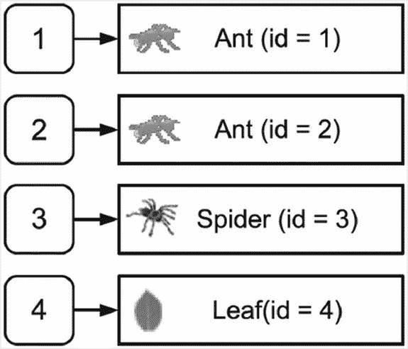
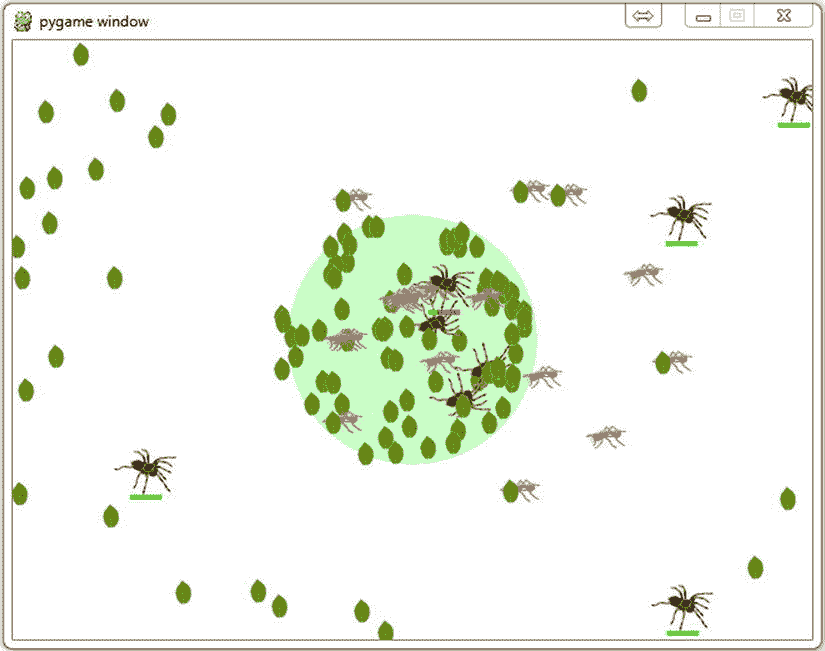

# 七、带我去见你们的领导

将玩家角色放置在一个令人信服的世界中只是创建游戏的一部分。为了让游戏变得有趣，你需要给玩家一些挑战。这些可能以陷阱和障碍的形式出现，但要真正娱乐你的玩家，你需要让他们与非玩家角色(NPC)互动——这些角色在游戏中似乎有一定程度的智能或意识。创造这些 NPC 的过程被称为人工智能(AI) 。在这一章中，我们将探索一些简单的技巧，你可以用它们来赋予你的游戏角色自己的生活。

为游戏创造人工智能

你可能已经在 Pygame 文档中找到了一个`pygame.ai`模块。没有一个，因为每个游戏在创建 NPC 时都有非常不同的要求。向水管工扔桶的猿的代码不需要太多工作——所有猿需要确定的是它应该向左还是向右扔桶，这一点你可以用一行 Python 代码来模拟！在未来派第一人称射击游戏中创造一个令人信服的敌方战斗人员可能需要更多的努力。人工智能玩家必须计划从地图的一部分到另一部分的路线，同时瞄准武器和躲避敌人的火力。它可能还要根据弹药供应和装甲库存来做决定。这一切做得越好，人工智能玩家就越优秀，对玩家的挑战也越大。

虽然游戏中的大部分人工智能是用来创造令人信服的对手来对抗，但将人工智能技术用于更和平的目的正变得越来越流行。NPC 不需要总是敌人，必须一看到就派出去；他们也可能是游戏世界中的角色，以增加游戏的深度。一些 NPC 甚至可能是玩家的朋友，应该保护他们免受伤害，因为他们在任务中积极协助。其他游戏，如大获成功的模拟人生，根本不需要玩家角色，完全由 NPC 组成。

人工智能也有助于通过添加不直接参与游戏的背景人物(相当于电影临时演员的游戏)来使游戏世界更有说服力。我们可以应用一些人工智能技术，让鸟类聚集在一起，或者在赛车游戏中，成群的人从失控的汽车中逃离。正是这种对细节的关注真正将玩家与游戏世界联系起来。诀窍是让玩家相信，即使他们现在不玩游戏，游戏世界也会存在。

人工智能有着难以相处的名声，但这并不是它应得的。你为 AI 创建的许多代码可以在各种组合中重用，以创建各种不同类型的 NPC。事实上，大多数游戏对游戏中的每个角色都使用相同的代码，你只需要调整几个值来改变行为。

这一章不会涵盖大量的人工智能理论(这很容易就能占据一整本书)。相反，它会给你一些技巧，你可以应用到游戏中的许多情况。

什么是智能？

智能是一个很难定义的东西，即使对于 AI 程序员来说也是如此。我相信我很聪明，也有自知之明，但是我只能假设其他人也很聪明，因为他们在很多方面都和我一样。其他人像我一样说话、移动、检查电子邮件、倒垃圾——所以我*认为*他们很聪明。类似地，在游戏中，如果一个角色的行为方式和智能事物一样，那么玩家会认为它是智能的。程序员可能知道一个角色的动作仅仅是几页计算机代码的结果，但是玩家会忘记这个事实。就玩家而言，如果它像僵尸一样走路，像僵尸一样呻吟，像僵尸一样吃人，那么它就是僵尸！

所以游戏中的智力是一种假象(现实生活中也可能是)。产生这种错觉的代码与前几章中的代码没有太大区别。您将使用 Python 字符串、列表、字典等相同的基本工具来构建类，这些类实际上是 NPC 的*大脑*。事实上，Python 可能是编写 AI 的最佳语言之一，因为它的内置对象范围很大。

探索人工智能

人工智能对于创造一个有趣的游戏来说并不是必不可少的。我以前喜欢玩经典的平台游戏，游戏中的主人公必须从一个平台跳到另一个平台，然后厚颜无耻地跳到怪物的头上。

虽然这些游戏中的怪物都是 NPC，但它们的行动有点初级，不能被认为是 AI。让我们看看一个典型的平台游戏怪物的脑袋内部(见[清单 7-1](#list1) )。这个清单是*伪代码* ，它是用来演示一项技术的代码，但实际上并不运行。

[***清单 7-1***](#_list1) 。平台怪物的伪代码

```py
self.move_forward()
if self.hit_wall():
    self.change_direction()
```

清单 7-1 中的这个怪物除了能够检测到它是否撞到了墙壁之外，对周围的环境没有任何意识，而且它肯定不会对即将用头着地的玩家角色做出任何反应。一般来说，对人工智能的一个要求是 NPC 必须知道游戏中的其他实体，尤其是玩家角色。让我们考虑另一种类型的游戏怪物:来自冥界的投掷火球的小鬼。小恶魔在生活中有一个简单的任务:找到玩家并朝他的方向扔出一个火球。[清单 7-2](#list2) 是小鬼大脑的伪代码。

[***清单 7-2***](#_list2) 。Imp AI 的伪代码

```py
if self.state == "exploring":
    self.random_heading()
    if self.can_see(player):
        self.state = "seeking"

elif self.state == "seeking":
    self.head_towards("player")
    if self.in_range_of(player):
        self.fire_at(player)
    if not self.can_see(player):
        self.state = "exploring"
```

小鬼可以处于两种状态之一:*探索*或者*寻找*。imp 的当前状态存储在`self.state`的值中，并指示哪个代码块当前控制 imp 的动作。当小鬼在探索时(即`self.state == "exploring"`)，它会通过选择一个随机的航向，在地图上漫无目的地走来走去。但是如果它看到玩家，它会切换到第二种状态`"seeking"`。一个处于搜寻模式的小鬼会朝玩家走去，一旦进入射程就会开火。只要玩家能被看到，它就会一直这样做，但是如果胆怯的玩家撤退，小鬼就会切换回探索状态。

我们的小鬼当然不是深度思考者，但它确实知道周围的环境(例如，玩家在哪里)并采取相应的行动。即使有两种状态，小鬼也足够聪明，可以成为第一人称射击游戏中的敌人。如果我们再添加几个状态，并定义在它们之间切换的条件，我们可能会创造出一个更强大的敌人。这是游戏 AI 中常见的技术，被称为*状态* *机器* 。

 **注意**这个小鬼并不是最聪明的黑社会居民。如果玩家再也看不见了，小鬼就会停止寻找，即使玩家刚刚躲在一棵树后面！幸运的是，我们可以在状态机的基础上创建一个更智能的 imp 类。

实现状态机

小鬼大脑的两种状态形成了一个非常简单的状态机。一个国家通常定义两件事:

*   NPC 此刻正在做什么
*   此时它应该切换到另一个状态

从*探索*状态到*寻找*状态的条件是`self.can_see(player)`——换句话说，“我(小鬼)能见玩家吗？”相反的条件(`not self.can_see(player)`)用于从*寻找*返回到*探索*。 [图 7-1](#Fig1) 是 imp 状态机的示意图，它实际上是它的大脑。箭头定义了状态和切换状态必须满足的条件之间的联系。状态机中的链接总是单向的，但可能有另一个链接返回到原始状态。在回到初始状态之前，还可能有几个中间状态，这取决于 NPC 行为的复杂性。


[图 7-1](#_Fig1) 。Imp 状态机

除了当前行为和条件，状态还可以包含 *进入动作*和*退出动作*。进入动作是在进入新状态之前完成的事情，通常用于执行状态运行所需的一次性动作。对于小鬼状态机中的`seeking`状态，一个进入动作可能会计算出一个朝向玩家的方向，并发出一个声音来表明它已经看到了玩家——或者是小鬼准备战斗所需的任何东西。退出动作与进入动作相反，在离开一个状态时执行。

让我们创建一个稍微有趣一点的状态机，这样我们就可以将它付诸实践。我们将创建一个模拟蚂蚁的巢穴。在用人工智能做实验时，经常使用昆虫，因为它们的行为非常简单，很容易建模。在我们的模拟宇宙中，我们将有三个实体:树叶、蜘蛛和蚂蚁本身。树叶会在屏幕上随机生长，然后被蚂蚁收获并送回蚁巢。蜘蛛在屏幕上游荡，只要它们不靠近蚁巢，蚂蚁就会容忍它们。如果一只蜘蛛进入巢穴，它会被追逐和撕咬，直到它死去或者设法逃得足够远。

 **注意**即使我们在这个模拟中使用了昆虫主题，我们将要编写的人工智能代码也适用于许多场景。如果我们用巨型“机甲”机器人、坦克和空投燃料来代替蚂蚁、蜘蛛和树叶，那么模拟仍然是有意义的。

游戏实体

虽然我们有三种不同类型的实体，但为游戏实体设计一个包含通用属性和动作的*基类*是个好主意。这样，我们就不需要为每个实体复制代码，并且我们可以轻松地添加其他实体，而不需要太多额外的工作。

一个实体将需要存储它的名字(`"ant"`、`"leaf"`或`"spider"`)，以及它的当前位置、目的地、速度和用来在屏幕上表示它的图像。你可能会觉得奇怪的是`"leaf"`实体会有目的地和速度。我们不会有神奇的会走路的树叶；我们只需将它们的速度设为零，这样它们就不会移动。这样，我们仍然可以像对待其他实体一样对待树叶。除了这些信息之外，我们还需要为游戏实体定义一些常见的功能。我们需要一个函数将实体呈现到屏幕上，另一个函数处理实体(例如，更新它在屏幕上的位置)。清单 7-3 显示了创建一个`GameEntity`类的代码，这个类将被用作每个实体的基础。

[***清单 7-3***](#_list3) 。游戏实体的基类

```py
class GameEntity(object):

    def __init__(self, world, name, image):

        self.world = world
        self.name = name
        self.image = image
        self.location = Vector2(0, 0)
        self.destination = Vector2(0, 0)
        self.speed = 0.

        self.brain = StateMachine()

        self.id = 0

    def render(self, surface):

        x, y = self.location
        w, h = self.image.get_size()
        surface.blit(self.image, (x-w/2, y-h/2))

    def process(self, time_passed):

        self.brain.think()

        if self.speed > 0 and self.location != self.destination:

           vec_to_destination = self.destination - self.location
           distance:to_destination = vec_to_destination.get_length()
           heading = vec_to_destination.get_normalized()
           travel_distance = min(distance:to_destination, time_passed * self.speed)
           self.location += travel_distance * heading
```

`GameEntity`类还保存了一个对`world`的引用，这是一个我们将用来存储所有实体位置的对象。这个`World`对象很重要，因为它是实体在模拟中了解其他实体的方式。实体还需要一个 ID 来在世界上标识它，并为它的大脑提供一个`StateMachine`对象(我们将在后面定义)。

`GameEntity`的`render`函数只是将实体的图像传送到屏幕上，但首先调整坐标，使当前位置位于图像的中心下方，而不是左上角。我们这样做是因为实体将被视为具有一个点和一个半径的圆，这将在我们需要检测与其他实体的交互时简化数学。

`GameEntity`对象的`process`函数首先调用`self.brain.think`，它将运行状态机来控制实体(通常通过改变其目的地)。在这个模拟中只有蚂蚁会使用状态机，但是我们*可以*给任何实体添加 AI。如果我们还没有为实体建立状态机，这个调用将简单地返回而不做任何事情。`process`函数的其余部分将实体向其目的地移动，如果它还不在那里的话。

建造世界

现在我们已经创建了一个`GameEntity`类，我们需要创建一个*世界*供实体居住。对于这个模拟来说，世界上没有太多东西——只有一个巢，由屏幕中心的一个圆圈表示，以及许多不同类型的游戏实体。`World`类(见[清单 7-4](#list4) )绘制嵌套并管理其实体。

[***清单 7-4***](#_list4) 。世界级

```py
class World(object):

    def __init__(self):

        self.entities = {} # Store all the entities
        self.entity_id = 0 # Last entity id assigned
        # Draw the nest (a circle) on the background
        self.background = pygame.surface.Surface(SCREEN_SIZE).convert()
        self.background.fill((255, 255, 255))
        pygame.draw.circle(self.background, (200, 255, 200), NEST_POSITION, int(NEST_SIZE))

    def add_entity(self, entity):

        # Stores the entity then advances the current id
        self.entities[self.entity_id] = entity
        entity.id = self.entity_id
        self.entity_id += 1

    def remove_entity(self, entity):

        del self.entities[entity.id]

    def get(self, entity_id):

        # Find the entity, given its id (or None if it is not found)
        if entity_id in self.entities:
          return self.entities[entity_id]
        else:
          return None

    def process(self, time_passed):

        # Process every entity in the world
        time_passed_seconds = time_passed / 1000.0
        for entity in self.entities.itervalues():
          entity.process(time_passed_seconds)

    def render(self, surface):

        # Draw the background and all the entities
        surface.blit(self.background, (0, 0))
        for entity in self.entities.values():
          entity.render(surface)

    def get_close_entity(self, name, location, e_range=100):

        # Find an entity within range of a location
        location = Vector2(*location)

        for entity in self.entities.values():
          if entity.name == name:
             distance = location.get_distance:to(entity.location)
             if distance < e_range:
                 return entity
        return None
```

因为我们有许多`GameEntity`对象，所以使用 Python list 对象来存储它们是非常自然的。虽然这可行，但我们会遇到问题；当一个实体需要从这个世界上删除时(例如，它已经死了)，我们必须搜索这个列表来找到它的索引，然后调用`del`来删除它。在列表中搜索可能会很慢，而且随着列表的增长会变得更慢。存储实体的一个更好的方法是使用 Python 字典，即使有很多实体，它也能有效地找到一个实体。

为了在字典中存储实体，我们需要一个值作为键，它可以是字符串、数字或其他值。为每只蚂蚁起一个名字会很困难，所以我们简单地按顺序给蚂蚁编号:第一只蚂蚁是#0，第二只蚂蚁是#1，依此类推。这个数字就是实体的`id`，并存储在每个`GameEntity`对象中，这样我们就可以在字典中找到该对象(见[图 7-2](#Fig2) )。



[图 7-2](#_Fig2) 。实体词典

 **注意**一个把增量数字映射到它的值的字典类似于一个列表，但是如果一个值被删除，这些键不会向下移动。所以蚂蚁 5 号仍然是蚂蚁 5 号，即使蚂蚁 4 号被移除。

`World`类中的大多数函数负责以某种方式管理实体。有一个`add_entity`函数将一个实体添加到世界中，一个`remove_entity`函数将它从世界中移除，还有一个`get`函数查找给定了`id`的实体。如果`get`在`entities`字典中找不到`id`，则返回`None`。这很有用，因为它会告诉我们一个实体已经被删除了(`id`值永远不会被重用)。考虑这样一种情况，一群蚂蚁正在紧追一只入侵蚁巢的蜘蛛。每个 ant 对象存储它正在追踪的蜘蛛的`id`，并且将查找它(用`get`)以检索蜘蛛的位置。然而，在某个时候，这只不幸的蜘蛛将会被送走，从这个世界上消失。当这种情况发生时，用蜘蛛的`id`对`get`函数的任何调用都将返回`None`，因此蚂蚁将知道它们可以停止追逐并返回到其他任务。

同样在`World`类中，我们有一个`process`和一个`render`函数。`World`对象的`process`函数调用每个实体的`process`函数，给它一个更新位置*的机会。*`render`功能类似；除了绘制背景，它还调用每个实体对应的`render`函数，在其所在位置绘制合适的图形。

最后，在`World`类中有一个名为`get_close_entity`的函数，它查找世界上某个位置特定距离内的实体。这用于模拟中的几个地方。

 **注意**在实现 NPC 时，你通常应该限制它可用的信息，因为像真人一样，NPC 不一定知道世界上正在发生的一切。我们用蚂蚁来模拟这种情况，只让它们*看到有限距离内的*物体。

Ant 实体类

在我们为蚂蚁的大脑建模之前，让我们看看`Ant`类(见[清单 7-5](#list5) )。它源自`GameEntity`，因此它将拥有`GameEntity`的所有功能，以及我们添加到它上面的任何附加功能。

[***清单 7-5***](#_list5) 。Ant 实体类

```py
class Ant(GameEntity):

    def __init__(self, world, image):

        # Call the base class constructor
        GameEntity.__init__(self, world, "ant", image)

        # Create instances of each of the states
        exploring_state = AntStateExploring(self)
        seeking_state = AntStateSeeking(self)
        delivering_state = AntStateDelivering(self)
        hunting_state = AntStateHunting(self)

        # Add the states to the state machine (self.brain)
        self.brain.add_state(exploring_state)
        self.brain.add_state(seeking_state)
        self.brain.add_state(delivering_state)
        self.brain.add_state(hunting_state)

        self.carry_image = None

  def carry(self, image):

        self.carry_image = image

  def drop(self, surface):

  # Blit the 'carry' image to the background and reset it
  if self.carry_image:
      x, y = self.location
      w, h = self.carry_image.get_size()
      surface.blit(self.carry_image, (x-w, y-h/2))
      self.carry_image = None

  def render(self, surface):

      # Call the render function of the base class
      GameEntity.render(self, surface)

# Extra code to render the 'carry' image
if self.carry_image:
    x, y = self.location
    w, h = self.carry_image.get_size()
    surface.blit(self.carry_image, (x-w, y-h/2))
```

我们的`Ant`类(`init`)的构造函数首先用行`GameEntity. init (self, world, "ant", image)`调用基类的构造函数。我们必须这样调用它，因为如果我们要调用`self. init`，Python 将调用`Ant`中的构造函数——并以无限循环结束！ant 构造函数中的剩余代码创建状态机(在下一节中介绍)，并将名为`carry_image`的成员变量设置为`None`。该变量由`carry`函数设置，用于存储蚂蚁携带的物体的图像；它可能是一片树叶或一只死蜘蛛。如果调用`drop`函数，会将`carry_image`置回`None`，不再绘制。

因为*能够携带*其他图像，所以在渲染精灵时，蚂蚁有一个额外的要求。除了自己的图像之外，我们还想绘制蚂蚁携带的图像，所以蚂蚁有一个`render`的*专用*版本，它调用基类中的`render`函数，然后渲染`carry_image`，如果它没有设置为`None`。

构建大脑

每只蚂蚁在其状态机中都有四种状态，这足以模拟蚂蚁的行为。定义状态机的第一步是计算出每个状态应该做什么，即该状态的*动作*(见[表 7-1](#Tab1) )。

[表 7-1](#_Tab1) 。Ant 状态的操作

| 

状态

 | 

行动

 |
| --- | --- |
| 探索 | 走向世界上的任意一点。 |
| 寻找 | 向一片树叶走去。 |
| 发表 | 给巢穴送东西。 |
| 打猎 | 追逐一只蜘蛛。 |

我们还需要定义连接状态的链接。它们采用条件的形式，以及满足条件时要切换到的状态的名称。例如，探索状态有两个这样的链接(见[表 7-2](#Tab2) )。

[表 7-2](#_Tab2) 。来自浏览状态的链接

| 

情况

 | 

目的地国家

 |
| --- | --- |
| 看见一片树叶了吗？ | 寻找 |
| 蜘蛛攻击基地？ | 打猎 |

一旦我们定义了状态之间的联系，我们就有了一个可以作为实体大脑的状态机。图 7-3 显示了我们将为 ant 构建的完整状态机。像这样在纸上画一个状态机是一种很好的可视化方式，当你需要把它转换成代码时会有帮助。


[图 7-3](#_Fig3) 。蚂蚁状态机

让我们将此付诸实践，并为状态机创建代码。我们将从定义一个单独状态的基类开始(见清单 7-6 )。稍后，我们将为状态机创建另一个类，作为一个整体来管理它包含的状态。

基类`State`除了在构造函数中存储状态名之外，实际上不做任何事情。`State`中的其余函数什么都不做——`pass`关键字只是告诉 Python 你有意将函数留空。我们需要这些空函数，因为不是所有我们将要构建的状态都会实现基类中的所有函数。例如，探索状态没有退出操作。当我们开始实现`AntStateExploring`类时，我们可以省略`exit_actions`函数，因为它将安全地退回到基类(`State`)中不做任何事情的函数版本。

[***清单 7-6***](#_list6) 。州的基类

```py
class State(object):

  def __init__(self, name):
      self.name = name

  def do_actions(self):
      pass

  def check_conditions(self):
      pass

  def entry_actions(self):
      pass

  def exit_actions(self):
      pass
```

在构建状态之前，我们需要构建一个管理它们的类。`StateMachine`类(见[清单 7-7](#list7) )将每个状态的一个实例存储在一个字典中，并管理当前活动的状态。`think`函数每帧运行一次，并在活动状态下调用`do_actions`——做该状态被设计要做的任何事情；探索状态将选择随机的地方行走，*寻找*状态将向叶子移动，等等。`think`函数也调用状态的`check_conditions`函数来检查所有的链路状况。如果`check_conditions`返回一个字符串，将选择一个新的活动状态，任何退出和进入动作将运行。

[***清单 7-7***](#_list7) 。状态机类

```py
class StateMachine(object):

  def __init__(self):

      self.states = {}  # Stores the states
      self.active_state = None  # The currently active state

  def add_state(self, state):

      # Add a state to the internal dictionary
      self.states[state.name] = state

  def think(self):

 # Only continue if there is an active state
     if self.active_state is None:
         return

     # Perform the actions of the active state, and check conditions
     self.active_state.do_actions()

     new_state_name = self.active_state.check_conditions()
     if new_state_name is not None:
         self.set_state(new_state_name)

  def set_state(self, new_state_name):

      # Change states and perform any exit / entry actions
      if self.active_state is not None:
          self.active_state.exit_actions()

      self.active_state = self.states[new_state_name]
      self.active_state.entry_actions()
```

既然我们已经有了一个正常工作的状态机类，我们可以通过从`State`类派生并实现它的一些功能来开始实现每个单独的状态。我们将实现的第一个状态是探索状态，我们称之为`AntStateExploring`(见[清单 7-8](#list8) )。这个状态的输入动作给蚂蚁一个随机的速度，并把它的目的地设置为屏幕上的一个随机点。主要动作，在`do_actions`功能中，如果表达式`randint(1, 20) == 1`为真，则选择另一个随机目的地，这将在每 20 次调用中发生一次，因为`randint`(在`random`模块中)选择一个大于或等于第一个参数且小于或等于第二个参数的随机数。这给了我们想要的蚂蚁般的随机搜索行为。

探索状态的两个输出链接在`check_conditions`函数中实现。第一个条件寻找距离蚂蚁位置 100 像素以内的叶子实体(因为这是我们的蚂蚁能看到的距离)。如果附近有叶子，那么`check_conditions`记录它的`id`并返回字符串`seeking`，这将指示状态机切换到寻找状态。如果蚁巢*和*内有任何蜘蛛在蚂蚁位置的 100 个像素内，剩下的条件将切换到`hunting`。

 **小心**随机数是让你的游戏更有趣的好方法，因为可预测的游戏过一会儿就会变得无趣。但是要小心随机数——如果出了问题，可能很难重现问题！

[***清单 7-8***](#_list8) 。蚂蚁的探索状态(AntStateExploring)

```py
class AntStateExploring(State):

    def __init__(self, ant):

        # Call the base class constructor to initialize the State
        State.__init__(self, "exploring")
        # Set the ant that this State will manipulate
        self.ant = ant

    def random_destination(self):

        # Select a point in the screen
        w, h = SCREEN_SIZE
        self.ant.destination = Vector2(randint(0, w), randint(0, h))

    def do_actions(self):

        # Change direction, 1 in 20 calls
        if randint(1, 20) == 1:
             self.random_destination()

    def check_conditions(self):

        # If there is a nearby leaf, switch to seeking state
        leaf = self.ant.world.get_close_entity("leaf", self.ant.location)
        if leaf is not None:
                self.ant.leaf_id = leaf.id
                return "seeking"
        # If there is a nearby spider, switch to hunting state
        spider = self.ant.world.get_close_entity("spider", NEST_POSITION, NEST_SIZE)
        if spider is not None:
             if self.ant.location.get_distance:to(spider.location) < 100.:
                 self.ant.spider_id = spider.id
                 return "hunting"

        return None

    def entry_actions(self):

        # Start with random speed and heading
        self.ant.speed = 120\. + randint(-30, 30)
        self.random_destination()
```

正如你从清单 7-8 中看到的，单个州的代码不需要非常复杂，因为各州一起工作产生的东西比其各部分的总和还要多。其他状态与`AntStateExploring`相似，它们基于该状态的目标选择目的地，如果它们已经实现了该目标，或者该目标不再相关，则切换到另一个状态。

在游戏的主循环中没有太多事情可做。一旦创建了`World`对象，我们只需每帧调用一次`process`和`render`来更新和绘制模拟中的所有内容。主循环中还有几行代码，用于在世界上的随机位置创建叶实体，并偶尔创建从屏幕左侧进入的蜘蛛实体。

清单 7-9 显示了整个模拟过程。运行时会看到类似[图 7-4](#Fig4) 的东西；蚂蚁在屏幕上四处游荡，收集树叶，杀死蜘蛛，并将它们堆积在巢穴中。你可以看到蚂蚁满足人工智能的标准，因为它们知道自己的环境——在有限的意义上——并采取相应的行动。

您将需要使用我们的 gameobjects 库源代码中的 vector2.py 版本，或者您可以自己在这里编写一些新方法。这些方法可以得到到给定点的距离或者向量的长度。我鼓励您尝试自己构建它们，如果您发现自己陷入困境，可以查看提供的源代码！

虽然在这个模拟中没有*玩家*角色，但这是我们最接近真实游戏的一次。我们有一个世界，一个实体框架，还有人工智能。它可以通过增加一个玩家角色变成一个游戏。你可以为玩家定义一个全新的实体，也许是一只不得不吃蚂蚁的螳螂，或者给蜘蛛实体添加键盘控制，让它从巢中收集蛋。或者，这种模拟是策略游戏的一个很好的起点，在这种游戏中，成群的蚂蚁可以被派去收集树叶或袭击邻近的巢穴。游戏开发者要尽可能有想象力！



[图 7-4](#_Fig4) 。蚂蚁模拟

[***清单 7-9***](#_list9) 。完整的人工智能模拟(antstatemachine.py)

```py
import pygame
from pygame.locals import *

from random import randint, choice
from gameobjects.vector2 import Vector2

SCREEN_SIZE = (640, 480)
NEST_POSITION = (320, 240)
ANT_COUNT = 20
NEST_SIZE = 100

class State(object):

    def __init__(self, name):
        self.name = name

    def do_actions(self):
        pass

    def check_conditions(self):
        pass

    def entry_actions(self):
        pass

    def exit_actions(self):
        pass

class StateMachine(object):

    def __init__(self):

        self.states = {}
        self.active_state = None

    def add_state(self, state):

        self.states[state.name] = state

    def think(self):

        if self.active_state is None:
            return

        self.active_state.do_actions()

        new_state_name = self.active_state.check_conditions()
        if new_state_name is not None:
            self.set_state(new_state_name)

    def set_state(self, new_state_name):

        if self.active_state is not None:
            self.active_state.exit_actions()

        self.active_state = self.states[new_state_name]
        self.active_state.entry_actions()

class World(object):

    def __init__(self):

        self.entities = {}
        self.entity_id = 0
        self.background = pygame.surface.Surface(SCREEN_SIZE).convert()
        self.background.fill((255, 255, 255))
        pygame.draw.circle(self.background, (200, 255, 200), NEST_POSITION, int(NEST_SIZE))

    def add_entity(self, entity):

        self.entities[self.entity_id] = entity
        entity.id = self.entity_id
        self.entity_id += 1

    def remove_entity(self, entity):

        del self.entities[entity.id]

    def get(self, entity_id):

        if entity_id in self.entities:
            return self.entities[entity_id]
        else:
            return None

    def process(self, time_passed):

        time_passed_seconds = time_passed / 1000.0
        for entity in list(self.entities.values()):
            entity.process(time_passed_seconds)

    def render(self, surface):

        surface.blit(self.background, (0, 0))
        for entity in self.entities.values():
            entity.render(surface)

    def get_close_entity(self, name, location, e_range=100):

        location = Vector2(*location)

        for entity in self.entities.values():

            if entity.name == name:
                distance = location.get_distance:to(entity.location)
                if distance < e_range:
                    return entity
        return None

class GameEntity(object):

    def __init__(self, world, name, image):

        self.world = world
        self.name = name
        self.image = image
        self.location = Vector2(0, 0)
        self.destination = Vector2(0, 0)
        self.speed = 0.

        self.brain = StateMachine()

        self.id = 0

    def render(self, surface):

        x, y = self.location
        w, h = self.image.get_size()
        surface.blit(self.image, (x-w/2, y-h/2))

    def process(self, time_passed):

        self.brain.think()

        if self.speed > 0 and self.location != self.destination:

            vec_to_destination = self.destination - self.location
            distance:to_destination = vec_to_destination.get_length()
            heading = vec_to_destination.get_normalized()
            travel_distance = min(distance:to_destination, time_passed * self.speed)
            self.location += travel_distance * heading

class Leaf(GameEntity):

    def __init__(self, world, image):
        GameEntity.__init__(self, world, "leaf", image)

class Spider(GameEntity):

    def __init__(self, world, image):
        GameEntity.__init__(self, world, "spider", image)
        self.dead_image = pygame.transform.flip(image, 0, 1)
        self.health = 25
        self.speed = 50 + randint(-20, 20)

    def bitten(self):

        self.health -= 1
        if self.health <= 0:
            self.speed = 0
            self.image = self.dead_image
        self.speed = 140

    def render(self, surface):

        GameEntity.render(self, surface)

        x, y = self.location
        w, h = self.image.get_size()
        bar_x = x - 12
        bar_y = y + h/2
        surface.fill( (255, 0, 0), (bar_x, bar_y, 25, 4))
        surface.fill( (0, 255, 0), (bar_x, bar_y, self.health, 4))

    def process(self, time_passed):

        x, y = self.location
        if x > SCREEN_SIZE[0] + 2:
            self.world.remove_entity(self)
            return

        GameEntity.process(self, time_passed)

class Ant(GameEntity):

    def __init__(self, world, image):

        GameEntity.__init__(self, world, "ant", image)

        exploring_state = AntStateExploring(self)
        seeking_state = AntStateSeeking(self)
        delivering_state = AntStateDelivering(self)
        hunting_state = AntStateHunting(self)

        self.brain.add_state(exploring_state)
        self.brain.add_state(seeking_state)
        self.brain.add_state(delivering_state)
        self.brain.add_state(hunting_state)

        self.carry_image = None

    def carry(self, image):

        self.carry_image = image

    def drop(self, surface):

        if self.carry_image:
            x, y = self.location
            w, h = self.carry_image.get_size()
            surface.blit(self.carry_image, (x-w, y-h/2))
            self.carry_image = None

    def render(self, surface):

        GameEntity.render(self, surface)

        if self.carry_image:
            x, y = self.location
            w, h = self.carry_image.get_size()
            surface.blit(self.carry_image, (x-w, y-h/2))

class AntStateExploring(State):

    def __init__(self, ant):

        State.__init__(self, "exploring")
        self.ant = ant

    def random_destination(self):

        w, h = SCREEN_SIZE
        self.ant.destination = Vector2(randint(0, w), randint(0, h))

    def do_actions(self):

        if randint(1, 20) == 1:
            self.random_destination()

    def check_conditions(self):

        leaf = self.ant.world.get_close_entity("leaf", self.ant.location)
        if leaf is not None:
            self.ant.leaf_id = leaf.id
            return "seeking"

        spider = self.ant.world.get_close_entity("spider", NEST_POSITION, NEST_SIZE)
        if spider is not None:
            if self.ant.location.get_distance:to(spider.location) < 100:
                self.ant.spider_id = spider.id
                return "hunting"

        return None

    def entry_actions(self):

        self.ant.speed = 120\. + randint(-30, 30)
        self.random_destination()

class AntStateSeeking(State):

    def __init__(self, ant):

        State.__init__(self, "seeking")
        self.ant = ant
        self.leaf_id = None

    def check_conditions(self):

        leaf = self.ant.world.get(self.ant.leaf_id)
        if leaf is None:
            return "exploring"

        if self.ant.location.get_distance:to(leaf.location) < 5:

            self.ant.carry(leaf.image)
            self.ant.world.remove_entity(leaf)
            return "delivering"

        return None

    def entry_actions(self):

        leaf = self.ant.world.get(self.ant.leaf_id)
        if leaf is not None:
            self.ant.destination = leaf.location
            self.ant.speed = 160 + randint(-20, 20)

class AntStateDelivering(State):

    def __init__(self, ant):

        State.__init__(self, "delivering")
        self.ant = ant

    def check_conditions(self):

        if Vector2(*NEST_POSITION).get_distance:to(self.ant.location) < NEST_SIZE:
            if (randint(1, 10) == 1):
                self.ant.drop(self.ant.world.background)
                return "exploring"

        return None

    def entry_actions(self):

        self.ant.speed = 60.
        random_offset = Vector2(randint(-20, 20), randint(-20, 20))
        self.ant.destination = Vector2(*NEST_POSITION) + random_offset

class AntStateHunting(State):

    def __init__(self, ant):

        State.__init__(self, "hunting")
        self.ant = ant
        self.got_kill = False

    def do_actions(self):

        spider = self.ant.world.get(self.ant.spider_id)

        if spider is None:
            return

        self.ant.destination = spider.location

        if self.ant.location.get_distance:to(spider.location) < 15:

            if randint(1, 5) == 1:
                spider.bitten()

                if spider.health <= 0:
                    self.ant.carry(spider.image)
                    self.ant.world.remove_entity(spider)
                    self.got_kill = True

    def check_conditions(self):

        if self.got_kill:
            return "delivering"

        spider = self.ant.world.get(self.ant.spider_id)

        if spider is None:
            return "exploring"

        if spider.location.get_distance:to(NEST_POSITION) > NEST_SIZE * 3:
            return "exploring"

        return None

    def entry_actions(self):

        self.speed = 160 + randint(0, 50)

    def exit_actions(self):

        self.got_kill = False

def run():

    pygame.init()
    screen = pygame.display.set_mode(SCREEN_SIZE, 0, 32)

    world = World()

    w, h = SCREEN_SIZE

    clock = pygame.time.Clock()

    ant_image = pygame.image.load("ant.png").convert_alpha()
    leaf_image = pygame.image.load("leaf.png").convert_alpha()
    spider_image = pygame.image.load("spider.png").convert_alpha()

    for ant_no in range(ANT_COUNT):

        ant = Ant(world, ant_image)
        ant.location = Vector2(randint(0, w), randint(0, h))
        ant.brain.set_state("exploring")
        world.add_entity(ant)

    while True:

        for event in pygame.event.get():
            if event.type == QUIT:
                pygame.quit()
                quit()

        time_passed = clock.tick(30)

        if randint(1, 10) == 1:
            leaf = Leaf(world, leaf_image)
            leaf.location = Vector2(randint(0, w), randint(0, h))
            world.add_entity(leaf)

        if randint(1, 100) == 1:
            spider = Spider(world, spider_image)
            spider.location = Vector2(-50, randint(0, h))
            spider.destination = Vector2(w+50, randint(0, h))
            world.add_entity(spider)

        world.process(time_passed)
        world.render(screen)

        pygame.display.update()

if __name__ == "__main__":
    run()

```

摘要

游戏中人工智能的目标是让非玩家角色以真实的方式行为。好的人工智能给游戏增加了一个额外的维度，因为玩家会觉得他们是在一个真实的世界，而不是一个计算机程序。糟糕的人工智能可以像图形中的小故障或不真实的声音一样容易地破坏现实主义的幻觉——甚至可能更容易。玩家可能会相信一个粗略绘制的简笔画是一个真实的人，但前提是它不要撞到墙上！

NPC 表面上的智能并不总是与用来模拟它的代码量有关。玩家倾向于将智力归因于并不存在的 NPC。在我们为本章创建的蚂蚁模拟中，蚂蚁在追逐蜘蛛时会形成一个有序的队列。我的一个朋友看到了这一点，并评论说它们在狩猎中合作——但当然蚂蚁是完全独立行动的。有时候，要让玩家相信某样东西是聪明的，需要做的工作少得惊人。

状态机是实现游戏 AI 的一种实用而简单的方式，因为它们将复杂的系统(即大脑)分解成易于实现的较小块。它们不难设计，因为我们习惯于想象其他人或动物在做事时在想什么。把每一个想法都变成计算机代码可能不太实际，但你只需要在游戏中近似行为来模拟它。

我们在本章中创建的简单状态机框架可以在你自己的游戏中使用，以构建令人信服的 AI。与 ant 模拟一样，首先要定义 NPC 的动作，然后弄清楚如何在这些动作之间切换。一旦你把这些写在纸上(如图 7-3 )你就可以开始用代码构建各个州了。

下一章是用 Pygame 渲染三维图形的温和介绍。