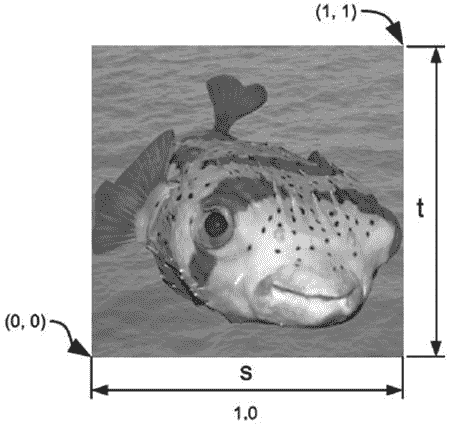
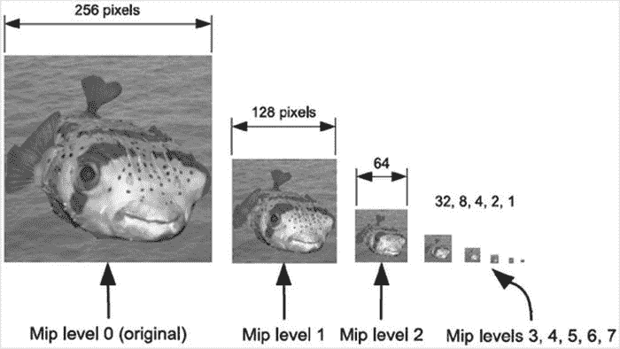
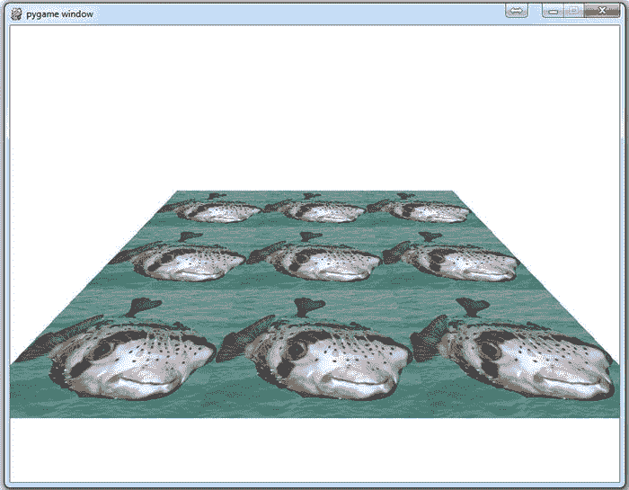
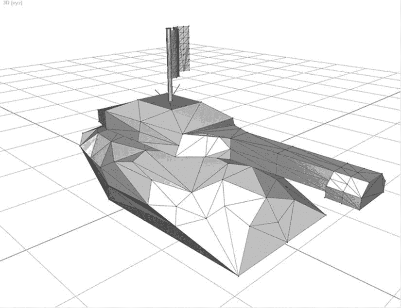

第十一章


灯光，摄像机，开拍！

在[第 8 章](08.html)和[第 9 章](09.html)中，你学习了如何操作 3D 信息和使用 OpenGL 显示简单的模型。在这一章中，我们将介绍如何使用图像来创建更具视觉吸引力的场景。我们还将讨论如何从文件中读取 3D 模型，这是创建完美游戏的重要一步。

使用纹理

在第 9 章中，你学习了如何从阴影多边形创建一个 3D 模型，但是为了让一个物体看起来更有说服力，你需要使用*纹理*，这是被拉伸成多边形的图像。顶点和多边形创建模型的形状，但是纹理定义任何 3D 对象的最终外观。你可以把一个未来士兵的模型变成一个僵尸，甚至是一个雕像，只要简单地改变它的纹理所使用的图像。

OpenGL 对纹理有极好的支持，可以用来在游戏中创建高度细节化的模型和场景。

用 OpenGL 上传纹理

在你可以使用图像作为 OpenGL 的纹理之前，你首先必须*上传*它。这将获取原始图像信息，并将其发送到图形卡的高速*视频内存*。用作纹理的图像大小必须至少为 64 x 64 像素，宽度和高度必须是 2 的幂(64、128、256 等。).如果你的图像不是 2 的幂，你应该调整它以适应下一个 2 的幂。[清单 11-1](#list1) 是一个给定一个维度，可以计算 2 的下一次幂的函数。

[***清单 11-1***](#_list1) 。计算 2 的下一次幂

```py
from math import log, ceil
def next_power_of_2(size):
    return 2 ** ceil(log(size, 2))
```

 **注意**一些显卡确实能够使用不是 2 的幂的纹理，但是为了最大的兼容性，最好坚持 2 的幂。

纹理大小的上限因显卡而异。可以通过调用`glGetIntegerv(GL_MAX_TEXTURE_SIZE)`向 OpenGL 询问支持的最大纹理大小。在我的电脑上，它返回了`16384`，这的确是一个非常大的纹理！

以下列表概述了在 OpenGL 中上传图像数据和创建纹理所需的步骤:

*   用`pygame.image.load`加载图像。
*   使用`pygame.image.tostring`功能检索包含原始图像数据的字符串。
*   用`glGenTextures`生成一个`id`，可以用来识别纹理。
*   设置渲染多边形时影响纹理使用方式的任何参数。
*   使用`glTexImage2D`功能上传原始图像数据。

加载图像的方式与在 2D 游戏中加载图像的方式相同——只需用图像文件名调用`pygame.image.load`。例如，以下代码行加载一个名为`sushitex.png`的图像并返回一个表面:

```py
texture_surface = pygame.image.load("sushitex.png")
```

一旦您有了包含您的图像的 Pygame 表面，调用`pygame.image.tostring`来检索包含原始图像数据的字符串。`pygame.image.tostring`的第一个参数是表面；第二个应该是`RGB`对于不透明的图像，或者`RGBA`如果图像有一个 alpha 通道。最后一个参数应该设置为`True`，它告诉 py game*翻转*返回数据中的行(否则，纹理会颠倒)。以下代码行检索我们之前加载的表面的原始图像数据:

```py
texture_data = pygame.image.tostring(texture_surface, 'RGB', True)
```

OpenGL 中的每个纹理都必须用`glGenTextures`函数分配一个`id`值(一个数字)。这些`id`用于选择绘制 OpenGL 图元时使用的纹理。`glGenTextures`函数获取您想要生成的`id`的数量，并返回一个 ID 值列表，或者如果您只需要一个值，则返回一个值。纹理`id` s 一般是顺序分配的(所以前三个纹理很可能会被命名为 1，2，3)，但情况可能并不总是这样。

 **注意**纹理`id` s 是整数值，而不是物体。删除纹理`id`，或者让它超出范围，都不会清理纹理。你应该手动删除你不想再使用的纹理(稍后见“删除纹理”一节)。

一旦你指定了一个纹理`id`，调用`glBindTexture`来告诉 OpenGL 所有后续的纹理相关函数都应该使用这个纹理。`glBindTexture`函数有两个参数；第一个参数应该是标准 2D 纹理的`GL_TEXTURE_2D`，第二个参数是你想要绑定的`id`。下面两行为`sushitex.png`纹理创建了一个单独的`id`，并且*绑定*以供使用:

```py
texture_id = glGenTextures(1)
glBindTexture(GL_TEXTURE_2D, texture_id)
```

在上传图像数据之前，我们需要设置几个*纹理参数*，它们是影响 OpenGL 在渲染时如何使用纹理的值。要设置纹理参数，请调用`glTexParameteri`获取整数参数，或`glTexParameterf`获取浮点参数。两个函数都采用相同的三个参数；纹理类型(`GL_TEXTURE_2D`用于标准 2D 纹理)，后跟要设置的参数名称和要设置的值。大多数参数是可选的，如果您不更改它们，它们将使用默认值。

我们需要为所有纹理设置的两个参数是`GL_TEXTURE_MIN_FILTER`和 `GL_TEXTURE_MAX_FILTER`，，它们告诉 OpenGL 应该使用什么方法来放大或缩小纹理。当纹理像素(通常称为*纹理像素*)小于屏幕像素时，使用`GL_TEXTURE_MIN_FILTER`参数。当纹理元素变得比像素大时，使用参数。下面两行将两个参数都设置为`GL_LINEAR`，这使得缩放后的纹理看起来平滑，不那么像素化。稍后我们将讨论其他可能的值。

```py
glTexParameteri(GL_TEXTURE_2D, GL_TEXTURE_MAG_FILTER, GL_LINEAR)
glTexParameteri(GL_TEXTURE_2D, GL_TEXTURE_MIN_FILTER, GL_LINEAR)
```

接下来我们需要调用`glPixelStorei(GL_UNPACK_ALIGNMENT, 1)`，它告诉 OpenGL 原始图像数据中的行是如何被打包在一起的，然后调用`glTexImage2D`上传图像数据。下面几行上传了我们之前检索到的`texture_data`。一旦这一步完成，纹理就可以用来绘制三角形、四边形和任何其他 OpenGL 图元。

```py
glPixelStorei(GL_UNPACK_ALIGNMENT, 1)
width, height = texture_surface.get_rect().size
glTexImage2D( GL_TEXTURE_2D,
              0,        # First mip-level
              3,        # Bytes per pixel
              width,
              height,
              0,        # Texture border
              GL_RGB,
              GL_UNSIGNED_BYTE,
              texture_data)
```

`glTexImage2D`有很多参数，因为 OpenGL 被设计成在它支持的图像格式中非常灵活。幸运的是，当从 Pygame 表面上传纹理数据时，我们通常可以坚持使用我们之前描述的参数，尽管对于带有 alpha 通道的表面，你应该将`3`改为`4`，将`GL_RGB`改为`GL_RGBA`。关于`glTexImage2D`参数的更详细说明，参见[表 11-1](#Tab1) 。

[表 11-1](#_Tab1) 。glTexImage2D 的参数(按函数调用顺序)

| 

参数

 | 

说明

 |
| --- | --- |
| `target` | 通常将`be GL_TEXTURE_2D`用于图像纹理。OpenGL 支持一维和三维纹理，但这些在游戏中不太常用。 |
| `level` | mip 映射级别，其中 0 是第一个(最大)级别，1 是下一个级别。我一会儿将解释 mip 地图。 |
| `internalFormat` | 指示数据如何存储在视频存储器中。一般来说，这是不透明图像的`3`和带有 alpha 通道的图像的`4`，但它也接受其他格式的常量。 |
| `width` | 图像的宽度，以像素为单位。 |
| `height` | 图像的高度，以像素为单位。 |
| `border` | 设置纹理的边框。可以是用于边框的`0`，也可以是用于单像素边框的`1`。 |
| `format` | 要上传的图像数据的格式。这通常是不透明图像的`GL_RGB`，或者带有 alpha 通道的图像的`GL_RGBA`。 |
| `type` | 指定图像组件的存储方式；通常这是`GL_UNSIGNED_BYTE`，用于从 Pygame 表面检索的图像数据。 |
| `data` | 包含原始图像数据的字符串。 |

一旦上传了纹理，就不再需要原始的 Pygame 表面对象，因为 OpenGL 有它的副本。您可以让它超出范围，让 Python 为您清理，或者调用`del`删除引用。显式总是比隐式好，所以这里应该用 del，但是两种方式都可以。

纹理坐标

当在 OpenGL 中启用纹理时，可以为每个顶点分配一个*纹理坐标*，该坐标定义了纹理中的一个位置。当一个有纹理的多边形被渲染到屏幕上时，纹理将在这些坐标之间被*拉伸*。

OpenGL 使用*归一化的*纹理坐标，这意味着无论纹理图像中有多少个像素，纹理的宽度和高度始终为 1.0(见[图 11-1](#Fig1) )。所以纹理坐标(0.5，0.5)总是在纹理的中心。纹理的左下方是坐标(0，0)，右上方是坐标(1，1)。使用标准化坐标的优点是，如果改变图像的尺寸，它们将保持不变。



[图 11-1](#_Fig1) 。纹理坐标

纹理坐标的存储方式与二维向量的存储方式相同:要么是元组，要么是`Vector2`对象。在 OpenGL 中，纹理坐标的组成部分被称为 s 和 t，但为了方便起见，您仍然可以使用一个`Vector2`对象，并将这些组成部分称为 x 和 y。不过，一般来说，除了存储它们并根据需要将它们发送到 OpenGL 之外，您很少需要对纹理坐标做任何事情，因此元组通常是最佳选择。

 **注意**一些 3D APIs、工具、书籍将纹理坐标称为 u 和 v，而不是 s 和 t

渲染纹理

要在渲染多边形或任何其他 OpenGL 图元时使用纹理，您必须使用`glTexCoord2f`函数为每个顶点提供纹理坐标，该函数将 s 和 t 组件作为参数。图元将使用用`glBindTexture`函数绑定的最后一个纹理来绘制。

下面的代码绘制了一个与 x 和 y 轴对齐的四边形。它对四个角使用纹理坐标，这样整个图像将在四边形中绘制。

```py
# Draw a quad (4 vertices, 4 texture coords)
glBegin(GL_QUADS)

# Top left corner
glTexCoord2f(0, 1)
glVertex3f(-100, 100, 0)

# Top right corner
glTexCoord2f(1, 1)
glVertex3f(100, 100, 0)

# Bottom right corner
glTexCoord2f(1, 0)
glVertex3f(100, -100, 0)

# Bottom left corner
glTexCoord2f(0, 0)
glVertex3f(-100, -100, 0)

glEnd()
```

删除纹理

每个纹理都会耗尽视频内存，这是一种有限的资源。当你完成一个纹理(切换等级，退出游戏，等等。)，您应该通过调用`glDeleteTextures`来删除它，以释放它的视频内存。这个函数取你想要删除的`id`，或者一个`id`的列表，一旦纹理被删除了，再去绑定它就是一个错误，所以你要丢弃`id`的值。

下面一行删除了一个名为`texture_id`的纹理 ID:

```py
glDeleteTextures(texture_id)
```

查看纹理运行情况

让我们写一个脚本来演示上传一个纹理并在渲染一个 OpenGL 图元时使用它。我们将绘制一个纹理四边形，为了表明它不仅仅是一个精灵，我们将围绕 x 轴旋转它。

在[清单 11-2 的`init`函数中](#list2)是对`glEnable(GL_TEXTURE_2D)`的调用，它启用 OpenGL 纹理。如果你在让纹理在 OpenGL 中工作时遇到问题，检查一下你是否已经调用了这个函数。

[***清单 11-2***](#_list2) 。运行中的纹理(opengltex.py)

```py
from math import radians

from OpenGL.GL import *
from OpenGL.GLU import *

import pygame
from pygame.locals import *

SCREEN_SIZE = (800, 600)

def resize(width, height):

    glViewport(0, 0, width, height)
    glMatrixMode(GL_PROJECTION)
    glLoadIdentity()
    gluPerspective(60.0, float(width)/height, .1, 1000.)
    glMatrixMode(GL_MODELVIEW)
    glLoadIdentity()

def init():

    glEnable(GL_TEXTURE_2D)
    glClearColor(1.0, 1.0, 1.0, 0.0)

def run():

    pygame.init()
    screen = pygame.display.set_mode(SCREEN_SIZE, HWSURFACE|OPENGL|DOUBLEBUF)

    resize(*SCREEN_SIZE)
    init()

    # Load the textures
    texture_surface = pygame.image.load("sushitex.png")
    # Retrieve the texture data
    texture_data = pygame.image.tostring(texture_surface, 'RGB', True)

    # Generate a texture id
    texture_id = glGenTextures(1)
    # Tell OpenGL we will be using this texture id for texture operations
    glBindTexture(GL_TEXTURE_2D, texture_id)

    # Tell OpenGL how to scale images
    glTexParameteri( GL_TEXTURE_2D, GL_TEXTURE_MAG_FILTER, GL_LINEAR )
    glTexParameteri( GL_TEXTURE_2D, GL_TEXTURE_MIN_FILTER, GL_LINEAR )

    # Tell OpenGL that data is aligned to byte boundries
    glPixelStorei(GL_UNPACK_ALIGNMENT, 1)

    # Get the dimensions of the image
    width, height = texture_surface.get_rect().size

    # Upload the image to OpenGL
    glTexImage2D( GL_TEXTURE_2D,
                  0,
                  3,
                  width,
                  height,
                  0,
                  GL_RGB,
                  GL_UNSIGNED_BYTE,
                  texture_data)

    clock = pygame.time.Clock()

    tex_rotation = 0.0

    while True:

        for event in pygame.event.get():
            if event.type == QUIT:
                pygame.quit()
                quit()

        time_passed = clock.tick()
        time_passed_seconds = time_passed / 1000.
        tex_rotation += time_passed_seconds * 360.0 / 8.0

        # Clear the screen (similar to fill)
        glClear(GL_COLOR_BUFFER_BIT)

        # Clear the model-view matrix
        glLoadIdentity()

        # Set the modelview matrix
        glTranslatef(0.0, 0.0, -600.0)
        glRotate(tex_rotation, 1, 0, 0)

        # Draw a quad (4 vertices, 4 texture coords)
        glBegin(GL_QUADS)

        glTexCoord2f(0, 1)
        glVertex3f(-300, 300, 0)

        glTexCoord2f(1, 1)
        glVertex3f(300, 300, 0)

        glTexCoord2f(1, 0)
        glVertex3f(300, -300, 0)

        glTexCoord2f(0, 0)
        glVertex3f(-300, -300, 0)

        glEnd()

        pygame.display.flip()

    glDeleteTextures(texture_id)

if __name__ == "__main__":
    run()
```

`run`函数执行读入`sushitex.png`图像并将图像数据上传到 OpenGL 所需的五个步骤。然后，它通过向 OpenGL 发送四个纹理坐标和四个顶点来绘制一个纹理四边形。纹理坐标通过`glTexcoord2f`函数发送，该函数将`s`和`t`组件作为参数。`glTexcoord2f`的替代方法是`glTexCoord2fv`函数，它采用一个序列(tuple、`Vector2`等)。)而不是个人价值观。

旋转是通过`glRotate`函数完成的，该函数创建一个绕轴的旋转矩阵，并将其乘以当前的模型-视图矩阵。它有四个参数:第一个参数是要旋转的角度(以度为单位)，后面是轴的 x、y 和 z 分量。例如，调用`glRotate(45, 1, 0, 0)`将围绕 x 轴旋转 45 度，调用`glRotate(-30, 0, 1, 0)`将围绕 y 轴旋转*负* 30 度(即，30 度*顺时针*)。您还可以使用此功能绕任何轴旋转，而不仅仅是三个基本轴。

当你运行[清单 11-2](#list2) 时，你会看到类似[图 11-2](#Fig2) 的东西，有一个大的纹理四边形绕着 x 轴旋转。尝试使用纹理坐标值来查看它们对四边形的影响。


图 11-2 。opengltex.py

Mip 映射

当一个多边形中的像素比绘制它的纹理中的像素少时，OpenGL 必须*跳过*纹理中的一些像素，以使它适合。这会导致渲染的多边形产生扭曲效果，这种效果随着纹理的缩小而恶化。这种失真会分散 3D 动画场景的注意力，降低视觉效果的整体质量。

*Mip 映射* 就是一种将这种影响降到最低的技术。它的工作原理是预先计算逐渐变小的纹理版本，每个版本的尺寸都是前一个纹理的一半(见[图 11-3](#Fig3) )。例如，一个 256 x 256 像素的纹理也将有一个 128 x128 像素的版本，然后是一个 64 x64 像素的版本，以及更小的纹理版本，其中每个版本的大小是其前面纹理的一半，一直到最终纹理(它是原始纹理中所有像素的平均单个像素)。当 OpenGL 使用 mip 映射纹理渲染多边形时，它将使用最接近屏幕上多边形大小的 *mip 级别*，这减少了跳过的像素数量并提高了视觉质量。



[图 11-3](#_Fig3) 。Mip 地图

 **注** Mip 是 parvo 中 *multum 的首字母缩略词，拉丁语意为“小空间中的多”*

您可以通过将第二个参数设置为`glTexImage2D`来上传每个 *mip 级别*的图像数据。原始的——也是最大的——纹理是 mip 级别的`0`。第一个 mip 等级是`1`，应该是原来的一半尺寸，第二个 mip 等级是`2`，应该是原来的四分之一尺寸。

因为计算 mip 级别是一项常见任务，所以我们可以使用 OpenGL 实用程序库(`OpenGL.GLU`)中的一个函数在一次调用中创建并上传所有 mip 级别。除了`level`和`border`(不需要)之外，`gluBuild2DMipmaps`函数可以代替对`glTexImage2D`的调用，并采用相同的参数。例如，下面的调用可以替换对[清单 11-2](#list2) 中`glTexImage2D`的调用(完整示例参见源代码文档中的 11-2.1.py):

```py
gluBuild2DMipmaps( GL_TEXTURE_2D,
                   3,
                   width,
                   height,
                   GL_RGB,
                   GL_UNSIGNED_BYTE,
                   texture_data )
```

使用 mip 贴图纹理的唯一缺点是它们比非 mip 贴图纹理多使用三分之一的视频内存，但是视觉质量的提高是值得的。我建议对 3D 场景中使用的所有纹理使用 mip 贴图。对于未缩放的纹理，例如字体或平视显示器，您不需要使用 mip 贴图。

纹理参数

OpenGL 在渲染 3D 场景的方式上非常灵活。可以设置许多纹理参数来创建视觉效果，并调整使用纹理渲染多边形的方式。本节涵盖了一些常用的纹理参数——完整的列表超出了本书的范围，但是你可以在线阅读 OpenGL 文档(`https://www.opengl.org/sdk/docs/HYPERLINK``http://www.opengl.org/sdk/docs/man/)”``)`了解所有细节)。

最小和最大过滤器

在[清单 11-2](#list2) 中，我们设置了两个纹理参数`GL_TEXTURE_MIN_FILTER`和`GL_TEXTURE_MAX_FILTER`，它们定义了用于纹理缩放的*最小化*和*最大化*过滤器。这两个值都被设置为`GL_LINEAR`，这在大多数情况下都可以得到很好的结果，但是也可以使用其他值来微调缩放比例。

当 OpenGL 将纹理多边形渲染到屏幕上时，它会定期对纹理进行采样，以计算多边形中像素的颜色。如果纹理是 mip 映射的(见我们前面的讨论)，OpenGL 也必须决定它应该采样的 mip 级别。它用来采样纹理和选择 mip 级别的方法由最小化或最大化过滤器参数定义。

您可以为最大化过滤器(`GL_TEXTURE_MAX_FILTER`)设置的唯一值是`GL_NEAREST`和`GL_LINEAR`。通常最好坚持使用`GL_LINEAR`，这使得 OpenGL 在缩放时使用*双线性过滤* 来平滑纹理，但纹理在高比例下会显得模糊。另一种选择是`GL_NEAREST`，它看起来更锐利，但却是块状的。这些值也受最小化过滤器(`GL_TEXTURE_MIN_FILTER`)支持，此外还有其他四个常量告诉 OpenGL 如何在颜色计算中包括 mip 级别(见[表 11-2](#Tab2) )。最小化过滤器的最高质量设置是`GL_LINEAR_MIPMAP_LINEAR`，它像`GL_LINEAR`一样柔化纹理，但也在两个最接近的 mip 级别之间混合(称为*三线性过滤* )。下面几行将最小化和最大化过滤器方法设置为最高质量的设置(本示例的完整代码在源代码文档的 11-2.2.py 中):

```py
glTexParameteri(GL_TEXTURE_2D,  GL_TEXTURE_MAG_FILTER, GL_LINEAR)
glTexParameteri(GL_TEXTURE_2D,  GL_TEXTURE_MIN_FILTER, GL_LINEAR_MIPMAP_LINEAR)
```

[表 11-2](#_Tab2) 。最小和最大过滤器参数的潜在值

| 

参数常数

 | 

样本效应

 |
| --- | --- |
| `GL_NEAREST` | 选择离采样点最近的纹理元素。这使纹理看起来清晰，但可能会出现低质量。 |
| `GL_LINEAR` | 选择最接近采样点的四个纹理元素，并在它们之间混合。这会平滑渲染的纹理，并使其在缩放时看起来不那么锯齿状。 |
| `GL_NEAREST_MIPMAP_NEAREST` | 选择最接近采样点的纹理元素，以及最接近正在渲染的像素大小的 mip 级别。`Minimizing filter only`。 |
| `GL_LINEAR_MIPMAP_NEAREST` | 混合最接近采样点的四个纹理元素，并选择最接近正在渲染的像素大小的 mip 级别。`Minimizing filter only`。 |
| `GL_NEAREST_MIPMAP_LINEAR` | 选择最接近采样点的纹理元素，并在最接近渲染像素大小的两个 mip 级别之间混合。`Minimizing filter only`。 |
| `GL_LINEAR_MIPMAP_LINEAR` | 在最接近采样点的四个纹理元素之间混合，并在最接近渲染像素大小的两个 mip 级别之间混合。`Minimizing filter only`。 |

纹理包装

组件在 0 到 1 范围内的纹理坐标将引用纹理内部的点，但是组件在该范围之外的纹理坐标并不是错误，事实上，它非常有用。OpenGL 如何处理不在 0 到 1 范围内的坐标由`GL_TEXTURE_WRAP_S`和`GL_TEXTURE_WRAP_T`纹理参数定义。这些参数的默认值是`GL_REPEAT`，它使离开纹理一边的样本出现在另一边。这产生了纹理平铺的效果，因此它的多个副本被并排放置。您可以通过编辑清单 11-2 中对[的调用来看到这一点。尝试用以下代码替换对`glBegin`和`glEnd`的调用之间的代码行(参见源代码文档中的 11-2.3.py，了解整个脚本中包含的这段代码):](#list2)

```py
glTexCoord2f(0, 3)
glVertex3f(-300, 300, 0)

glTexCoord2f(3, 3)
glVertex3f(300, 300, 0)

glTexCoord2f(3, 0)
glVertex3f(300, -300, 0)

glTexCoord2f(0, 0)
glVertex3f(-300, -300, 0)
```

如果您运行编辑过的[清单 11-2](#list2) ，您应该会看到类似[图 11-4](#Fig4) 的内容。只画了一个四边形，但是纹理重复了 9 次，因为纹理成分的范围是从 0 到 3。像这样平铺纹理在游戏中很有用，因为你可以纹理化非常大的多边形，而不必把它们分成更小的块。例如，可以用一个拉长的四边形和一个平铺纹理创建一个长栅栏，这比每个栅栏都用小四边形更有效。



[图 11-4](#_Fig4) 。重复纹理坐标

重复纹理与使用下面的 Python 函数变换每个纹理坐标的组件具有相同的效果(尽管包装是由您的显卡而不是 Python 完成的)。`%`符号是模数运算符，它返回除法中的余数，因此`% 1.0`将返回一个数的小数部分。

```py
def wrap_repeat(component):
    return component %  1.0
```

 **提示**拼贴最适用于被设计为无缝的纹理——也就是说，如果你将它们并排放置，你就看不到其中一个结束，另一个开始。

包裹参数的另一个设置是`GL_MIRRORED_REPEAT`，它与`GL_REPEAT`相似，但是*在样本点越过纹理边缘时镜像*。要查看这一点，请在清单 11-2 的[函数中的`while True:`行之前插入以下两行，完整示例参见源代码文档中的 11-2.4:](#list2)

```py
glTexParameteri(GL_TEXTURE_2D, GL_TEXTURE_WRAP_S, GL_MIRRORED_REPEAT)
glTexParameteri(GL_TEXTURE_2D, GL_TEXTURE_WRAP_T, GL_MIRRORED_REPEAT)
```

现在当你运行清单 11-2 时，你应该会看到重复的图像在纹理的 s 和 t 轴周围被镜像。镜像重复设置是一种使纹理看起来无缝的好方法，即使它们不是设计出来的。对应于`GL_MIRRORED_REPEAT`的 Python 代码如下:

```py
def wrap_mirrored_repeat(component):
    if int(component) %  2:
        return 1.0 - (component %  1.0)
    else:
        return component %  1.0
```

我们要看的最后一个纹理包裹设置是`GL_CLAMP_TO_EDGE`，它*将纹理成分饱和*到 0 到 1 的范围。如果纹理组件超出该范围，它将被设置为 0 或 1，这取决于哪个最接近原始值。使纹理组件饱和的视觉效果是，当 OpenGL 在纹理边界之外采样时，纹理的外部边缘会无限重复。当您的纹理坐标非常接近纹理边缘，但您希望确保 OpenGL 不会对纹理边缘上的点进行采样时，此设置非常有用(如果您启用了`GL_LINEAR`过滤器设置，这种情况会发生)。要查看此设置的效果，将对`glTexParameteri`的调用更改如下(源代码文档中的完整代码示例见 11-2.5.py):

```py
glTexParameteri(GL_TEXTURE_2D, GL_TEXTURE_WRAP_S, GL_CLAMP_TO_EDGE)
glTexParameteri(GL_TEXTURE_2D, GL_TEXTURE_WRAP_T, GL_CLAMP_TO_EDGE)
```

以下函数是`GL_CAMP_TO_EDGE`的 Python 等价物:

```py
def wrap_clamp_to_edge(component):
    if component > 1.0:
        return 1.0
    elif component < 0.0:
        return 0.0
    return component
```

我们已经将`GL_TEXTURE_WRAP_S`和`GL_TEXTURE_WRAP_T`的值设置为相同的值，但是如果您需要，它们可以独立设置。例如，要创建一个栅栏四边形，我们可能希望纹理水平重复(在 s 组件上)，而不是垂直重复(在 t 组件上)。

尝试使用清单 11-2 中的[来看看组合纹理包裹参数的效果。](#list2)

使用模型

三维模型很少直接在代码中定义。一般来说，它们是从 3D Studio 或 Blender 等 3D 应用程序生成的文件中读入的。本节介绍 3D 模型如何存储在文件中，以及如何在游戏中读取和显示它们。

存储模型

与图像一样，有多种文件格式可用于存储 3D 模型，每种格式都由不同的制造商生产，具有不同的功能。与图像不同，在为游戏存储模型时，没有明确的赢家，有许多可供选择。

模型可以存储为二进制或文本。二进制格式非常有效地打包信息，并且倾向于生成较小的文件，而文本格式将信息存储为文本行，这样生成的文件较大但更容易处理。

用于存储 3D 信息的文件将至少包含一个顶点列表，还可能包含一个纹理坐标和法线列表。许多还包含关于纹理和照明的附加信息。您不必使用 3D 模型中的所有信息，但是您实现的格式功能越多，它就越接近艺术家创建的模型。

 **提示**很多游戏开发者都会发布他们游戏中使用的 3D 模型格式。你可以用商业游戏中的角色来测试你的游戏——但是要小心违反版权法！

三维模型的 OBJ 格式

为了处理 3D 模型，我们将使用波前 OBJ 格式(扩展`.obj`)，这是一种已经存在多年的简单文本格式。大多数处理 3D 模型的软件至少能够编写 OBJ 文件，也可能能够读取它们。它们是基于文本的，因此您可以在文本编辑器中打开它们，如 Windows 记事本，或其他平台上的等效工具。

OBJ 文件通常带有一个素材库文件(扩展名为`.mtl`)，其中包含各种定义模型中多边形应该如何渲染的设置，包括纹理的文件名。

解析 OBJ 文件

OBJ 文件中的每一行都定义了一条信息(顶点，纹理坐标等)。)并由一个或多个由空格分隔的*单词*组成。第一个词表示该行包含的内容，其余的词是信息本身。例如，下面一行在(–100，50，–20)处定义了一个顶点:

```py
v –100 50 –20
```

Python 非常擅长读取文本文件，并且具有一次读取一行的内置支持。如果迭代一个打开的文件对象，它将返回一个包含每一行的字符串。下面是我们如何开始编写 Python 代码来解析存储在 OBJ 文件中的 3D 模型:

```py
obj_file = file("tank.obj")
for line in obj_file:
    words = line.split() # Split line on spaces
    command = words[0]
    data = words[1:]
```

每次通过`for`循环都返回文件中的下一行。在循环中，我们将这一行拆分成单词。第一个单词被命名为`command`，其余的单词存储在一个名为`data`的列表中。一个完整的解析器将基于`command`的值选择一个动作，并使用包含在`data`列表中的任何信息。

[表 11-3](#Tab3) 包含了 OBJ 文件中一些常用的命令。还有更多可能的命令，但这些可以用来存储游戏中使用的 3D 模型。我们可以使用[表 11-3](#Tab3) 中的信息来读取和显示坦克的 3D 模型。

[表 11-3](#_Tab3) 。波前 OBJ 文件中的线

| 

线条

 | 

说明

 |
| --- | --- |
| `#` | 表示该行是注释，应被软件忽略。 |
| `f <vertex1> <vertex2> etc.` | 定义模型中的面。每个单词由三个用正斜杠分隔的值组成:顶点索引、纹理坐标索引和法线索引。面上的每个点都有三个一组的值(三角形为 3，四边形为 4，等等。). |
| `mtllib <filename>` | 指定 OBJ 文件的材质库。 |
| `usemtl <material name>` | 从材料库中选择材料。 |
| `v <x> <y> <z>` | 在 x，y，z 上定义一个顶点。 |
| `vt <s> <t>` | 定义纹理坐标。 |

材料库文件

波前 OBJ 文件通常与包含纹理和照明信息的材质库文件配合使用。当你在 OBJ 文件中遇到一个`mtlib`命令时，它会引入一个包含这些额外信息的素材库文件。在命令数据的第一个字中给出了素材库的文件名，并且应该附加扩展名`.mtl`。

素材库也是文本文件，可以用与父 OBJ 文件相同的方式进行解析。在素材库文件中，`newmtl`命令开始一个新的素材，它包含一些参数。其中一个参数是纹理文件名，它是用`map_Kd`命令引入的。例如，材质文件中的以下几行将定义一个名为`tankmaterial`的纹理，该纹理的文件名为`tanktexture.png`:

```py
newmtl tankmaterial
map_Kd tanktexture.png
```

观看模型运行

让我们写一个类来加载波前 OBJ 文件，并用 OpenGL 渲染它。我创建了一个未来主义坦克的模型(见[图 11-5](#Fig5) )，用 AC3D ( `www.inivis.com/`)建造，导出为`mytank.obj`和`mytank.mtl`。我的艺术技巧有限；请随意用你自己的 3D 物体替换我的模型。您可以使用任何能够导出 OBJ 文件的 3D modeler 软件。



[图 11-5](#_Fig5) 。AC3D 中的未来坦克物体

我们正在构建的类叫做`Model3D`，负责读取模型并存储其*几何*(顶点，纹理坐标，模型等。).它还可以将几何图形发送到 OpenGL 来渲染模型。`Model3D`需要存储的内容详见[表 11-4](#Tab4) 。

[表 11-4](#_Tab4) 。存储在 Model3D 类中的信息

| 

名字

 | 

目的

 |
| --- | --- |
| `self.vertices` | 顶点(3D 点)列表，存储为三个值的元组(x、y 和 z)。 |
| `self.tex_coords` | 纹理坐标列表，存储为两个值的元组(对于 s 和 t)。 |
| `self.normals` | 法线列表，存储为三个值的元组(x、y 和 z)。 |
| `self.materials` | 一个`Material`对象的字典，这样我们可以在给定材质名称的情况下查找纹理文件名。 |
| `self.face:groups` | 将存储每种材质的面的`FaceGroup`对象列表。 |
| `self.display_list_id` | 一个显示列表`id`，我们将使用它来加速 OpenGL 渲染。 |

除了`Model3D`类，我们需要定义一个类来存储材质和*面组*，它们是共享相同材质的多边形。[清单 11-3](#list3) 是`Model3D`类的开始。

[***清单 11-3***](#_list3) 。model3d.py 中的类定义

```py
# A few imports we will need later
from OpenGL.GL import *
from OpenGL.GLU import *

import pygame
import os.path

class Material(object):

  def   init (self):

        self.name = ""
        self.texture_fname = None
        self.texture_id = None

class FaceGroup(object):

  def   init (self):

        self.tri_indices = []
        self.material_name = ""

class Model3D(object):

  def   init (self):

        self.vertices = []
        self.tex_coords = []
        self.normals = []
        self.materials = {}
        self.face:groups = []
        # Display list id for quick rendering
        self.display_list_id = None
```

现在我们已经有了基本的类定义，我们可以给`Model3D`添加一个方法来打开一个 OBJ 文件并读取内容。在`read_obj`方法中(参见[清单 11-4](#list4) ，我们遍历文件的每一行，并将其解析成一个命令字符串和一个数据列表。许多`if`语句决定如何处理存储在`data`中的信息。

[***清单 11-4***](#_list4) 。解析 OBJ 文件的方法

```py
def read_obj(self, fname):
    current_face:group = None
    file_in = open(fname)

    for line in file_in:

        # Parse command and data from each line
        words = line.split()
        command = words[0]
        data = words[1:]

        if command == 'mtllib': # Material library

            model_path = os.path.split(fname)[0]
            mtllib_path = os.path.join( model_path, data[0] )
            self.read_mtllib(mtllib_path)

        elif command == 'v': # Vertex
            x, y, z = data
            vertex = (float(x), float(y), float(z))
            self.vertices.append(vertex)

        elif command == 'vt': # Texture coordinate

            s, t = data
            tex_coord = (float(s), float(t))
            self.tex_coords.append(tex_coord)

        elif command == 'vn': # Normal

            x, y, z = data
            normal = (float(x), float(y), float(z))
            self.normals.append(normal)

        elif command == 'usemtl' : # Use material

            current_face:group = FaceGroup()
            current_face:group.material_name = data[0]
            self.face:groups.append( current_face:group )

        elif command == 'f':

            assert len(data) ==  3, "Sorry, only triangles are supported"

            # Parse indices from triples
            for word in data:
                vi, ti, ni = word.split('/')
                indices = (int(vi) - 1, int(ti) - 1, int(ni) - 1)
                current_face:group.tri_indices.append(indices)

    for material in self.materials.values():

        model_path = os.path.split(fname)[0]
        texture_path = os.path.join(model_path, material.texture_fname)
        texture_surface = pygame.image.load(texture_path)
        texture_data = pygame.image.tostring(texture_surface, 'RGB', True)

        material.texture_id = glGenTextures(1)
        glBindTexture(GL_TEXTURE_2D, material.texture_id)

        glTexParameteri( GL_TEXTURE_2D,
                         GL_TEXTURE_MAG_FILTER,
                         GL_LINEAR)
        glTexParameteri( GL_TEXTURE_2D,
                         GL_TEXTURE_MIN_FILTER,
                         GL_LINEAR_MIPMAP_LINEAR)

        glPixelStorei(GL_UNPACK_ALIGNMENT,1)
        width, height = texture_surface.get_rect().size
        gluBuild2DMipmaps( GL_TEXTURE_2D,
                           3,
                           width,
                           height,
                           GL_RGB,
                           GL_UNSIGNED_BYTE,
                           texture_data)
```

OBJ 文件中的第一个命令通常是`mtllib`，它告诉我们素材库文件的名称。当遇到这个命令时，我们将素材库的文件名传递给`read_mtllib`方法(我们将在后面编写)。

如果命令由几何体(顶点、纹理坐标或法线)组成，它将被转换为浮点值元组，并存储在适当的列表中。例如，行`v 10 20 30`将被转换成元组`(10, 20, 30)`并附加到`self.vertices`。

每组面之前是一个`usemtl`命令，它告诉我们后续的面将使用哪种材质。当`read_obj`遇到这个命令时，它会创建一个新的`FaceGroup`对象来存储随后的材质名称和面信息。

面由`f`命令、定义，由面上每个顶点的一个词组成(3 代表三角形，4 代表四边形，等等)。).每个单词包含顶点、纹理坐标和法线列表的索引，由正斜杠字符(`/`)分隔。例如，下面的线定义了一个三角形，其中第一个点使用顶点 3、纹理坐标 8 和法线 10。这些索引的三元组存储在当前的面组中，当我们渲染它时，将用于重建模型形状。

按照代码解析 OBJ 文件中的每一行，我们进入一个循环，读取材质字典中的纹理并将它们上传到 OpenGL。我们将使用 mip 映射和高质量纹理缩放。

 **注意**为了简单起见，Model3D 类只处理包含三角形的 OBJ 文件。如果您的模型包含四边形或其他多边形，您将需要使用 3D 建模器将其转换为三角形。

读取材质的方法类似于`read_obj`方法，但是更简单，因为我们只对纹理名称感兴趣。材料中还存储了其他信息，但为了简单起见，我们现在忽略它。

在一个素材库文件中，`newmtl`命令开始一个新的材质定义，`map_Kd`命令设置纹理文件名。`read_mtllib`方法([清单 11-5](#list5) )提取这些信息并存储在`self.materials`字典中。

[***清单 11-5***](#_list5) 。解析素材库

```py
def read_mtllib(self, mtl_fname):

    file_mtllib = open(mtl_fname)
    for line in file_mtllib:

        words = line.split()
        command = words[0]
        data = words[1:]

        if command == 'newmtl':
            material = Material()
            material.name = data[0]
            self.materials[data[0]] = material

        elif command == 'map_Kd':
            material.texture_fname = data[0]
```

这两个函数(`read_obj`和`read_mtllib`)足以从 OBJ 文件中读取我们需要的所有信息，现在我们可以编写代码将几何图形发送到 OpenGL。`draw`方法(见[清单 11-6](#list6) )遍历每个面组，绑定一个纹理，并将几何列表中的数据发送给 OpenGL。

[***清单 11-6***](#_list6) 。将几何图形发送到 OpenGL

```py
def draw(self):

    vertices = self.vertices
    tex_coords = self.tex_coords
    normals = self.normals

    for face:group in self.face:groups:

        material = self.materials[face:group.material_name]
        glBindTexture(GL_TEXTURE_2D, material.texture_id)

        glBegin(GL_TRIANGLES)
        for vi, ti, ni in face:group.tri_indices:
            glTexCoord2fv( tex_coords[ti] )
            glNormal3fv( normals[ni] )
            glVertex3fv( vertices[vi] )
        glEnd()

def draw_quick(self):

    if self.display_list_id is None:
        self.display_list_id = glGenLists(1)
        glNewList(self.display_list_id, GL_COMPILE)
        self.draw()
        glEndList()

    glCallList(self.display_list_id)
```

一次发送一个顶点的几何图形可能会很慢，因此还有一个`draw_quick`方法来编译包含模型几何图形的显示列表，然后只需调用一次`glCallList`就可以呈现该列表。

`Model3D`类现在包含了我们加载和渲染 3D 模型所需的一切，但是在我们使用它之前，我们应该编写代码来清理我们使用过的 OpenGL 资源。[清单 11-7](#list7) 给`Model3D`添加了一个`free_resources`方法，删除显示列表和任何创建的纹理。当您不再需要模型时，可以调用这个方法，或者您可以让它被`__del__`方法自动调用，当不再有对对象的引用时，Python 就会调用这个方法。

[***清单 11-7***](#_list7) 。清理 OpenGL 资源

```py
def __del__(self):

    #Called when the model is cleaned up by Python
    self.free_resources()

def free_resources(self):

    # Delete the display list and textures
    if self.display_list_id is not None:
        glDeleteLists(self.display_list_id, 1)
        self.display_list_id = None

    # Delete any textures we used
    for material in self.materials.values():
        if material.texture_id is not None:
            glDeleteTextures(material.texture_id)

    # Clear all the materials
    self.materials.clear()

    # Clear the geometry lists
    del self.vertices[:]
    del self.tex_coords[:]
    del self.normals[:]
    del self.face:groups[:]
```

 **注意**手动调用`free_resources`函数是个好主意，因为如果 Python 在 PyOpenGL 退出后清理 Model3D 对象，可能会导致错误。

使用 Model3D 类

让我们编写一个脚本，使用我们的`Model3D`类来加载和呈现模型。[清单 11-8](#list8) 创建一个`Model3D`对象并用它来读取`mytank.obj`(和材料)。

[***清单 11-8***](#_list8) 。渲染坦克模型(tankdemo.py)

```py
from math import radians

from OpenGL.GL import *
from OpenGL.GLU import *

import pygame
from pygame.locals import *

# Import the Model3D class
import model3d

SCREEN_SIZE = (800, 600)

def resize(width, height):

    glViewport(0, 0, width, height)
    glMatrixMode(GL_PROJECTION)
    glLoadIdentity()
    gluPerspective(60.0, float(width)/height, .1, 1000.)
    glMatrixMode(GL_MODELVIEW)
    glLoadIdentity()

def init():

    # Enable the GL features we will be using
    glEnable(GL_DEPTH_TEST)
    glEnable(GL_LIGHTING)
    glEnable(GL_COLOR_MATERIAL)
    glEnable(GL_TEXTURE_2D)
    glEnable(GL_CULL_FACE)

    glShadeModel(GL_SMOOTH)
    glClearColor(1.0, 1.0, 1.0, 0.0) # white

    # Set the material
    glMaterial(GL_FRONT, GL_AMBIENT, (0.0, 0.0, 0.0, 1.0))
    glMaterial(GL_FRONT, GL_DIFFUSE, (0.2, 0.2, 0.2, 1.0))
    glMaterial(GL_FRONT, GL_SPECULAR, (1.0, 1.0, 1.0, 1.0))
    glMaterial(GL_FRONT, GL_SHININESS, 10.0)

    # Set light parameters
    glLight(GL_LIGHT0, GL_AMBIENT, (0.0, 0.0, 0.0, 1.0))
    glLight(GL_LIGHT0, GL_DIFFUSE, (0.4, 0.4, 0.4, 1.0))
    glLight(GL_LIGHT0, GL_SPECULAR, (1.0, 1.0, 1.0, 1.0))

    # Enable light 1 and set position
    glEnable(GL_LIGHT0)
    glLight(GL_LIGHT0, GL_POSITION,  (0, .5, 1, 0))

def run():

    pygame.init()
    screen = pygame.display.set_mode(SCREEN_SIZE, HWSURFACE|OPENGL|DOUBLEBUF)

    resize(*SCREEN_SIZE)
    init()

    clock = pygame.time.Clock()

    # Read the model
    tank_model = model3d.Model3D()
    tank_model.read_obj('mytank.obj')

    rotation = 0.0

    while True:

        for event in pygame.event.get():
            if event.type == QUIT:
                pygame.quit()
                quit()

        glClear(GL_COLOR_BUFFER_BIT | GL_DEPTH_BUFFER_BIT)

        time_passed = clock.tick()
        time_passed_seconds = time_passed / 1000.0

        glLoadIdentity()
        glRotatef(15, 1, 0, 0)
        glTranslatef(0.0, -1.5, -3.5)

        rotation += time_passed_seconds * 45.0
        glRotatef(rotation, 0, 1, 0)

        tank_model.draw_quick()

        pygame.display.flip()

if __name__ == "__main__":
    run()
```

清单 11-8 中的[函数启用了我们将使用的 OpenGL 特性。它还为材质和灯光设置参数，这将使坦克具有金属外观。我们将在下一章讨论材质和照明参数。](#list8)

在绘制坦克之前，设置模型矩阵，使相机略高于坦克并俯视它——这比沿 z 轴观察它提供了一个稍微有趣的视点。

对`glRotatef(15, 1, 0, 0)`的调用创建了一个绕 x 轴 15 度的旋转矩阵，相当于向下看了一点。这个旋转矩阵乘以一个平移矩阵，调用`glTranslatef(0.0, -1.5, -3.5)`，有效地将坦克下移 1.5 个单位，再移回 3.5 个单位。第二次调用`glRotatef`使坦克绕 y 轴旋转，这样我们可以看到它在运动。

当你运行清单 11-8 中的[时，你应该会看到一辆看起来令人生畏的坦克绕着 y 轴旋转(见](#list8)[图 11-6](#Fig6) )。如果你有一个更好的模型来代替坦克，那么用你的模型的文件名替换`mytank.obj`。


图 11-6 。加油示范 py

 **注意**并非所有的 3D modeler 应用程序都使用相同的比例。如果您发现您的模型非常大或非常小，您可能需要在导出之前对其进行缩放，或者更改代码以在不同的距离查看对象。

摘要

纹理是使 3D 场景看起来令人信服的主要方式，因为你可以将真实世界的图像应用到游戏中的对象。照片是创建纹理的好方法——数码相机是游戏开发的绝佳工具！或者您可以使用其他来源的图像；Pygame wiki ( `www.pygame.org/wiki/resources`)有一个很棒的免费纹理网站链接集。

因为 OpenGL 是独立于 Pygame 创建的，所以没有一个函数可以用来读取和上传一个图像作为纹理；将文件中的图像数据保存到高速视频存储器需要几个步骤。如果你使用本章概述的步骤，你应该没有问题处理纹理。请务必设置最小化和最大化纹理参数，以及包装功能。

您学习了如何从文件中读取 3D 模型并使用 OpenGL 渲染它。波前 OBJ 格式得到了很好的支持，你可能会发现`Model3D`类对于你写的任何游戏都足够了。或者您可能想要扩展`read_obj`方法来覆盖更多的特性(例如，四边形)。如果你想在游戏中支持其他格式，你可以在网上找到你需要的文档。编写解析器可能具有挑战性，但这是掌握 3D 模型创建细节的一个很好的方法。

在下一章中，你将学习如何使用 OpenGL 光照，并创建令人印象深刻的特效，为你的游戏增添光彩。