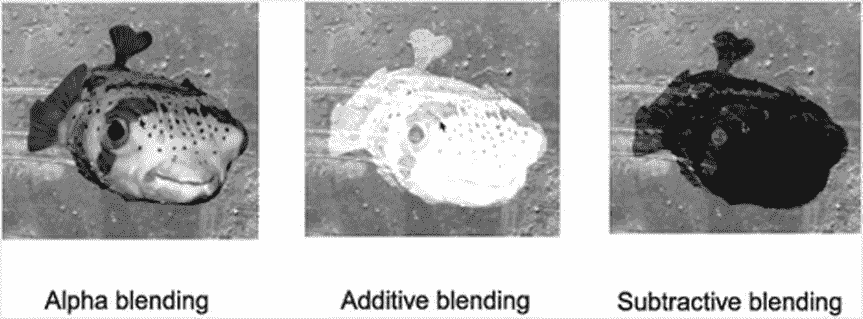
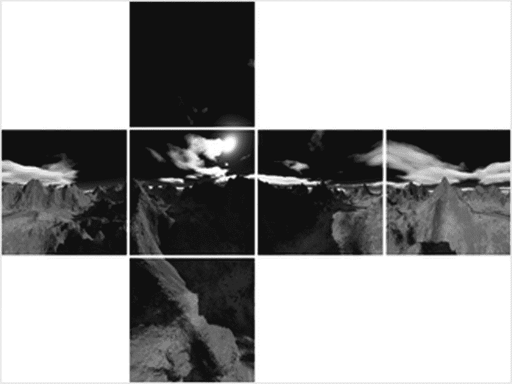

第十二章


用 OpenGL 设置场景

你已经对 OpenGL 有了很大的进步，已经学会了如何在 3D 场景中渲染和操作对象。在这一章中，我们将更详细地介绍照明，并向你介绍 OpenGL 的其他特性，这些特性将帮助你给你的游戏增添光彩。

了解照明

我在第 7 章中向你介绍了 OpenGL 的光照功能，但是忽略了一些细节。在这一部分，我们将探索如何使用灯光，并用它们来增加 3D 场景的真实感。

OpenGL 使用您分配给模型顶点或面的*法线*来计算玩家将看到的光线颜色。渲染场景中的多边形时会使用这些颜色，方法是为每个面指定一种颜色(平面着色)，或者在顶点之间混合颜色(如果启用了平滑着色)。模型越详细，光照就越有说服力，因为颜色只计算整个面或顶点，而不是多边形中的每个像素。

OpenGL 支持三种类型的灯光:

*   **平行光:** 平行光是光线相互平行的光源。太阳通常被视为平行光——尽管从技术上来说它是点光源——因为它太远了，当光线到达地球时，光线实际上是平行的。
*   **点光源(也叫位置光):** 点光源是从单个点发出的光源，用于表示场景中大多数邻近的光线。点光源的常见用途是灯泡、火焰和特殊效果。
*   **聚光灯:** 聚光灯类似于点光源，从一个点发出，但光线聚焦到一个圆形区域，以该点为尖端，形成一个圆锥形。这里不涉及 OpenGL 聚光灯，因为在游戏中不常用到，不过如果有兴趣可以在`www.opengl.org/sdk/` `docs/man/`在线查看 OpenGL 文档。聚光灯一样的效果可以通过其他方式来实现，通常是混合，我将在本章后面介绍。

启用照明

要在 OpenGL 中启用光照，只需调用`glEnable(GL_LIGHTING)`。如果你需要暂时禁用照明——比如渲染字体——调用`glDisable(GL_LIGHTING)`。你还需要启用你想在场景中使用的单个灯光，这也可以用`glEnable`通过传递一个灯光常量(`GL_LIGHT0`到`GL_LIGHT7`)来实现。

设置灯光参数

使用`glLight`功能可以设置许多灯光参数。这个函数为你想要设置的灯光取一个常量(`GL_LIGHT0`到`GL_LIGHT7`)，后面是你想要设置的参数的常量和你想要设置的值。灯光参数列表见[表 12-1](#Tab1) 。(此表不包括聚光灯使用的参数。完整列表见 OpenGL 文档。)

[表 12-1](#_Tab1) 。灯光参数

| 

参数名称

 | 

类型

 | 

说明

 |
| --- | --- | --- |
| `GL_POSITION` | 要点 | 设置灯光 GL_AMBIENT 的位置 |
| `GL_AMBIENT` | 颜色 | 设置灯光的环境强度 |
| `GL_DIFFUSE` | 颜色 | 设置灯光的漫射颜色 |
| `GL_SPECULAR` | 颜色 | 设置灯光将创建的镜面高光的颜色 |
| `GL_CONSTANT_ATTENUATION` | 数字 | 指定了常数衰减系数 |
| `GL_LINEAR_ATTENUATION` | 数字 | 指定线性衰减系数 |
| `GL_QUADRATIC_ATTENUATION` | 数字 | 指定二次衰减系数 |

`GL_POSITION`参数用于设置将要创建的光的位置和类型。它获取位置的 x、y 和 z 坐标以及一个名为`w`的附加参数。如果`w`设置为 0.0，灯光将为*方向*，如果`w`设置为 1.0，灯光将为*位置*(点光源)。以下两条线在(1.0，1.0，1.0)处创建平行光，在坐标(50.0，100.0，0.0)处创建位置光:

```py
glLight(GL_LIGHT0, GL_POSITION, (1.0, 1.0, 1.0, 0.0))
glLight(GL_LIGHT1, GL_POSITION, (50.0, 100.0, 0.0, 1.0))
```

平行光沿原点方向发出平行光线，因此(1.0，1.0，1.0)处的位置光将模拟位于当前视点右上方后方的无限远的光源。位置光从坐标(50.0，100.0，0.0)向所有方向发送光线。

还有三种颜色值可以为灯光设置:*环境光*、*漫反射*和*镜面反射*。环境颜色用于模拟从场景中其他对象反射的间接光的效果。在阳光明媚的日子里，周围的颜色会非常明亮，因为即使在阴凉处也有足够的光线可以看清。相反，在一个只有一盏油灯照明的洞穴里，周围的颜色会很暗，甚至可能是黑色，从而在没有照明的地方形成一片漆黑。

灯光的漫反射颜色是照亮周围场景的灯光的主要颜色，取决于您试图模拟的光源；阳光很可能是明亮的白色，但其他光源，如蜡烛、火球和魔法咒语，可能会有不同的颜色。

灯光的最终颜色值是高光颜色，它是由反射或抛光表面产生的高光颜色。如果你看一个闪亮的物体，你会看到亮点，光线直接反射到你的眼睛里。在 OpenGL 中，这些亮点的颜色是由高光颜色参数决定的。

以下三个对`glLight`的调用将创建一个很适合作为火球或火箭的光:

```py
glLight(GL_LIGHT1, GL_AMBIENT, (0.05, 0.05, 0.05))
glLight(GL_LIGHT1, GL_DIFFUSE, (1.0, 0.2, 0.2))
glLight(GL_LIGHT1, GL_SPECULAR, (1.0, 1.0, 1.0))
```

环境是深灰色的，因为我们希望效果是局部的，而不是在短距离之外贡献太多的光。漫反射是明亮的火焰红色，镜面反射是强烈的白色，以在附近的表面产生明亮的高光。

灯光也有三个*衰减*、T5，定义点光源的亮度如何随距离变化。OpenGL 使用三个因子*常数*、*线性、*和*二次、*来计算一个数字，该数字乘以由照明计算产生的颜色。OpenGL 使用的公式相当于[清单 12-1](#list1) 中的`get_attenuation`函数，它取一个点到光源的距离，后跟三个衰减因子。`get_attenuation`的返回值是一个数字，表示距离光源一定距离处的灯光亮度。

[***清单 12-1***](#_list1) 。计算衰减系数的函数

```py
def get_attenuation(distance, constant, linear, quadratic):
    return 1.0 / (constant + linear * distance + quadratic * (distance ** 2))
```

 **注意**OpenGL 可以使用的最大亮度级别是 1.0——大于 1.0 的值不会有任何额外的效果。

对于一个火球效果，我们可能希望在视觉效果周围的区域发出强烈的光，但是很快就消失了。以下对`glLight`的调用设置了三个衰减因子，使得光线在一个单位的半径内达到最大强度，但很快减弱，直到几个单位之外几乎没有任何光线:

```py
glLight(GL_LIGHT1, GL_CONSTANT_ATTENUATION, 0.5)
glLight(GL_LIGHT1, GL_LINEAR_ATTENUATION, 0.3)
glLight(GL_LIGHT1, GL_QUADRATIC_ATTENUATION, 0.2)
```

 **注意**衰减需要 OpenGL 为渲染的每个多边形做更多的工作，并且会对你的游戏产生性能影响——尽管除非你有一个旧的显卡，否则这可能不会被注意到。相对于现代游戏，我们的游戏只有很少的多边形，所以这绝对不是问题。

使用材料

OpenGL 中的*材质*是定义多边形应该如何与光源交互的参数集合。 这些参数是用`glMaterial`函数设置的，并与灯光参数结合生成渲染时使用的最终颜色。`glMaterial`的第一个参数通常是`GL_FRONT`，它设置面向相机的多边形的参数，但也可以是面向远离相机的多边形的`GL_BACK`——或者是面向两者的`GL_FRONT_AND_BACK`。对于完全封闭的模型——也就是说，你看不到它们的内部——你可以坚持使用`GL_FRONT`，因为只有正面是可见的(除非你在模型的内部*！).`glMaterial`的第二个参数是你要设置的材料参数的常数，最后一个参数是你要设置的值。[表 12-2](#Tab2) 列出了您可以使用的材料参数。*

[表 12-2](#_Tab2) 。材料参数

| 

参数名称

 | 

类型

 | 

说明

 |
| --- | --- | --- |
| `GL_AMBIENT` | 颜色 | 设置材质颜色的*环境*贡献。 |
| `GL_DIFFUSE` | 颜色 | 设置材质的*漫射*颜色。 |
| `GL_SPECULAR` | 颜色 | 设置材质上*高光*的颜色。 |
| `GL_SHININESS` | 数字 | 指定一个介于 0 和 128 之间的值，用于定义材质的光泽度。 |
| `GL_EMISSION` | 颜色 | 指定材料的发射颜色。 |

“环境光”、“漫反射”和“镜面反射颜色”参数的含义与它们对于灯光的含义相同，并且与相应的灯光参数组合在一起。`GL_SHININESS`参数定义了材质上镜面高光的大小。较高的值会产生小的高光，使材质看起来坚硬或光滑。值越低，创建的材质越粗糙。`GL_EMISSION`参数定义材料的发射颜色，即材料本身发出的光的颜色。材质在 OpenGL 中不能用作光源，但是设置发射色会使模型看起来有自己的内部照明。

调整参数

为材质和灯光选择参数更像是一门艺术而不是科学；实验通常是获得你想要的外观的最好方法。选择上一章中旋转槽的材料和灯光设置([清单 11-8](11.html#list8) )来使槽看起来像金属。尝试使用坦克的材质值来创建不同的外观。通过改变一些参数，你应该能够使它看起来像一个塑料玩具或木制模型。T3】

 **提示**灯光参数可以随时间变化，产生一些有趣的效果。

管理灯光

在渲染场景时，至少有八个 OpenGL 灯光供您使用，但是很容易想象需要更多的灯光。考虑一个以教堂为背景的场景；窗外有月光，几盏闪烁的灯，祭坛上有许多蜡烛。我们不能在一帧中激活所有这些光源，那么我们如何管理它们呢？ 第一步是把相近的光源组合成单一的光。祭坛上的蜡烛是一个完美的候选；虽然有许多光源，但如果将它们替换为从一组蜡烛中心的某个地方发出的单点光源，玩家可能不会注意到。减少所用灯光数量的下一步是优先选择明亮和/或关闭的灯光，而不是较远或不太明亮的灯光。如果我们对每一帧都执行这些步骤，我们可以在不影响场景视觉质量的情况下减少灯光数量。

场景中灯光的数量也会影响游戏的帧速率，因为 OpenGL 必须为每个额外的灯光做一系列的计算。为了提高性能，你可能希望将游戏中使用的最大灯光数量设置为比 OpenGL 所能处理的最大数量低*。*

理解混合

到目前为止，当我们渲染多边形时，纹理的颜色已经完全取代了它们下面的屏幕像素——这是我们在渲染实心物体时需要的，但不会帮助我们渲染半透明物体。为此，我们需要利用 OpenGL 的*混合*特性，将纹理的颜色和其下表面的颜色结合起来。T3】

混合对于创造许多玩家在今天的游戏中认为理所当然的效果也是必不可少的，因为它可以用来创造任何东西，从汽车挡风玻璃上的污点到壮观的爆炸。在这一部分，我们将探索如何在你的游戏中使用混合，并检查一些可以用它创建的效果。

使用混合

当 OpenGL 执行混合时，它从源和目标(即纹理和屏幕)采样一种颜色，然后用一个简单的等式将这两种颜色组合起来，以产生写入屏幕的最终颜色。OpenGL 对颜色进行数学运算，但是如果它是用 Python 编写的，它可能看起来像这样:

```py
src = texture.sample_color()
dst = screen.sample_color()
final_color = blend_equation(src * src_factor, dst * dst_factor)
screen.put_color(final_color)
```

`src`和`dst`值 是从纹理和屏幕上采样的两种颜色。这些颜色各自乘以一个*混合因子* ( `src_factor`和`dst_factor`)，并与一个`blend_equation`函数相结合，产生写入屏幕的最终颜色。组合不同的混合因子和混合方程式可以产生大量的视觉效果。

在 OpenGL 术语中，混合因子是用`glBlendFunc`函数设置的，该函数为源因子和目标因子取两个常数。例如，调用`glBlendFunc(GL_SRC_ALPHA, GL_ONE_MINUS_SRC_ALPHA)`会将源颜色乘以源的 alpha 分量，将目标颜色乘以 1 减去源的 alpha 分量。见[表 12-3](#Tab3) 中可能混合因子的完整列表。

[表 12-3](#_Tab3) 。混合因子常数

| 

混合因子常数

 | 

说明

 |
| --- | --- |
| `GL_ZERO` | 乘以零 |
| `GL_ONE` | 乘以一 |
| `GL_SRC_COLOR` | 乘以源 |
| `GL_ONE_MINUS_SRC_COLOR` | 乘以 1 减去源颜色 |
| `GL_DST_COLOR` | 乘以目的地 |
| `GL_ONE_MINUS_DST_COLOR` | 乘以 1 减去目标颜色 |
| `GL_SRC_ALPHA` | 乘以源 alpha 分量 |
| `GL_ONE_MINUS_SRC_ALPHA` | 乘以源 alpha 分量的倒数 |
| `GL_DST_ALPHA` | 乘以目标 alpha |
| `GL_ONE_MINUS_DST_ALPHA` | 乘以目标 alpha 的倒数 |
| `GL_CONSTANT_COLOR` | 乘以恒定颜色(用`glBlendColor`设置) |
| `GL_ONE_MINUS_CONSTANT_COLOR` | 乘以常数颜色的倒数 |
| `GL_CONSTANT_ALPHA` | 乘以常数α |
| `GL_ONE_MINUS_CONSTANT_ALPHA` | 乘以常数α的倒数 |
| `GL_SRC_ALPHA_SATURATE` | 指定源 alpha 和一减去源 alpha 的最小值 |

使用`glBlendEquation`函数设置混合方程，该函数采用多个潜在混合方程常数中的一个。默认值是`GL_ADD`，它只是将源颜色和目标颜色相加(乘以混合因子后)。混合方程常数的完整列表见[表 12-4](#Tab4) 。

[表 12-4](#_Tab4) 。混合方程常数

| 

混合方程常数

 | 

说明

 |
| --- | --- |
| `GL_FUNC_ADD` | 添加源颜色和目标颜色 |
| `GL_FUNC_SUBTRACT` | 从源颜色中减去目的颜色 |
| `GL_FUNC_REVERSE_SUBTRACT` | 从目标颜色中减去*源* |
| `GL_MIN` | 计算源颜色和目标颜色的最小值(最暗值) |
| `GL_MAX` | 计算源颜色和目标颜色的最大值(最亮值) |
| `GL_LOGIC_OP` | 用一个*逻辑运算*组合源和目标颜色(有关逻辑运算的信息，请参见 OpenGL 文档) |

混合中涉及的另一个 OpenGL 函数是`glBlendColor`，它设置一个在一些混合因子中使用的恒定颜色。该函数将红色、绿色、蓝色和 alpha 分量用作常量颜色。例如，`glBlendColor(1.0, 0.0, 0.0, 0.5)`将设置 50%半透明红色的恒定颜色。T3】

在游戏中启用混合的步骤如下:

*   通过调用`glEnable(GL_BLEND)`启用混合。
*   调用`glBlendFunc`功能设置混合因子。混合系数的完整列表见[表 12-3](#Tab3) 。
*   调用`glBlendEquation`函数设置混合方程式。混合方程的完整列表见[表 12-4](#Tab4) 。
*   如果您已经使用了一个引用恒定颜色的混合因子，您还需要调用`glBlendColor`函数，该函数将红色、绿色、蓝色和 alpha 颜色组件作为参数。

OpenGL 通过各种混合选项支持许多潜在的混合效果。以下部分涵盖了游戏中常用的一些效果以及创建这些效果所需的混合选项。

阿尔法混合

最常用的混合效果之一是 alpha 混合，它使用图像中的 alpha 通道来控制像素的不透明度。Alpha 混合可用于创建带有孔洞或不规则边缘的纹理，如撕破的旗帜。

我们可以使用以下函数调用来设置 alpha 混合:

```py
glBlendFunc(GL_SRC_ALPHA, GL_ONE_MINUS_SRC_ALPHA)
glBlendEquation(GL_FUNC_ADD)
```

这告诉 OpenGL 将源颜色乘以源 alpha，将目标颜色乘以 1.0 减去源 alpha。然后，它用`GL_FUNC_ADD`混合公式将这两种颜色结合起来——简单地将它们加在一起，产生写入屏幕的最终颜色。效果是*根据源颜色的 alpha 分量对颜色进行*插值，相当于[清单 12-2](#list2) 中的`alpha_blend`函数。

[***清单 12-2***](#_list2) 。Python Alpha 混合函数

```py
def alpha_blend(src, dst):
    return src * src.a + dst * (1.0—src.a)
```

这种 alpha 混合对于在需要许多小多边形的地方创建细节非常有用。例如，越野赛车游戏中的一簇杂草可以创建为具有半透明区域的单一纹理，而不是详细的模型。

混合也可以使用常量 alpha 组件来完成，而不是在纹理中使用 alpha 通道。这对于从整体上改变纹理的不透明度非常有用，而不是针对单个纹理元素。常量 alpha 混合可以用来渲染从窗口到力场的任何东西。下面的调用将使纹理 50%透明，或者 50%不透明，如果你喜欢的话。

```py
glBlendColor(1.0, 1.0, 1.0, 0.5)
glBlendFactor(GL_CONSTANT_ALPHA, GL_ONE_MINUS_CONSTANT_ALPHA)
glBlendEquation(GL_ADD)
```

添加剂混合

另一种有用的混合技术是*加色*混合，它类似于基本的 alpha 混合，只是源颜色被直接添加到目标颜色，从而使底层图像变亮。这就产生了一种发光的效果，这就是为什么加法混合经常被用来渲染火焰、电流或类似的取悦大众的特殊效果。下面的函数调用选择添加剂混合:

```py
glBlendFunc(GL_SRC_ALPHA,  GL_ONE)
glBlendEquation(GL_FUNC_ADD)
```

这与常规 alpha 混合的唯一区别是目标混合因子被设置为`GL_ONE`，它将颜色乘以 1.0——实际上，根本不改变它。添加剂混合相当于[清单 12-3](#list3) 中的`additive_blend`函数。

[***清单 12-3***](#_list3) 。Python 加法混合函数

```py
def additive_blend(src, dst):
    return src * src.a + dst
```

减法混合

加法混合的反向操作是*减法*混合，即从底层图像中减去源颜色，使其变得更暗。以下函数调用为减法混合设置混合选项:

```py
glBlendFunc(GL_SRC_ALPHA,  GL_ONE)
glBlendEquation(GL_FUNC_REVERSE_SUBTRACT)
```

混合方程式被设置为`GL_FUNC_REVERSE_SUBTRACT`而不是`GL_FUNC_SUBTRACT`，因为我们想要从目标减去源，而不是相反。

`GL_ADD`没有倒版是因为 A+B 永远和 B+A 一样(减法也不一样；A–B 并不总是与 B–A 相同。

减色混合非常适合渲染烟雾，因为几层会产生纯黑色。清单 12-4 中的[函数是 Python 中减法混合的等价物。](#list4)

[***清单 12-4***](#_list4) 。Python 减法混合函数

```py
def subtractive_blend(src, dst):
    return dst—src * src.a
```

看到融合在行动中

让我们写一些代码来帮助我们可视化一些常用的混合效果。当您执行[清单 12-5](#list5) 时，您会看到一个背景图像和另一个较小的图像——我们的朋友河豚——可以用鼠标移动。fugu 图像包含 alpha 信息，但是由于没有设置混合选项，您将看到图像中通常不可见的部分。如果你按下键盘上的 1 键，它将启用阿尔法混合，河豚图像的背景像素将变得不可见(参见[图 12-1](#Fig1) )。按 2 选择加性混合，使河豚发出鬼魅般的光芒，按 3 选择减性混合，使河豚产生暗影。

[***清单 12-5***](#_list5) 。演示混合效果(blenddemo.py)

```py
from OpenGL.GL import *
from OpenGL.GLU import *

import pygame
from pygame.locals import *

SCREEN_SIZE = (800, 600)

def resize(width, height):

    glViewport(0, 0, width, height)
    glMatrixMode(GL_PROJECTION)
    glLoadIdentity()
    gluPerspective(45.0, float(width)/height, .1, 1000.)
    glMatrixMode(GL_MODELVIEW)
    glLoadIdentity()

def init():

    glEnable(GL_TEXTURE_2D)
    glEnable(GL_BLEND)
    glClearColor(1.0, 1.0, 1.0, 0.0)

def upload_texture(filename, use_alpha=False):

    # Read an image file and upload a texture
    if use_alpha:
        format, gl_format, bits_per_pixel = 'RGBA', GL_RGBA, 4
    else:
        format, gl_format, bits_per_pixel = 'RGB', GL_RGB, 3

    img_surface = pygame.image.load(filename)

    #img_surface = premul_surface(img_surface)

    data = pygame.image.tostring(img_surface, format, True)

    texture_id = glGenTextures(1)

    glBindTexture(GL_TEXTURE_2D, texture_id)

    glTexParameteri( GL_TEXTURE_2D, GL_TEXTURE_MAG_FILTER, GL_LINEAR )
    glTexParameteri( GL_TEXTURE_2D, GL_TEXTURE_MIN_FILTER, GL_LINEAR )

    glPixelStorei(GL_UNPACK_ALIGNMENT, 1)

    width, height =  img_surface.get_rect().size

    glTexImage2D(   GL_TEXTURE_2D,
                    0,
                    bits_per_pixel,
                    width,
                    height,
                    0,
                    gl_format,
                    GL_UNSIGNED_BYTE,
                    data )

    # Return the texture id, so we can use glBindTexture
    return texture_id

def draw_quad(x, y, z, w, h):

    # Send four vertices to draw a quad
    glBegin(GL_QUADS)

    glTexCoord2f(0, 0)
    glVertex3f(x-w/2, y-h/2, z)

    glTexCoord2f(1, 0)
    glVertex3f(x+w/2, y-h/2, z)

    glTexCoord2f(1, 1)
    glVertex3f(x+w/2, y+h/2, z)

    glTexCoord2f(0, 1)
    glVertex3f(x-w/2, y+h/2, z)

    glEnd()

def run():

    pygame.init()
    screen = pygame.display.set_mode(SCREEN_SIZE, HWSURFACE|OPENGL|DOUBLEBUF)

    resize(*SCREEN_SIZE)
    init()

    # Upload the background and fugu texture
    background_tex = upload_texture('background.png')
    fugu_tex = upload_texture('fugu.png', True)

    while True:

        for event in pygame.event.get():
            if event.type == QUIT:
                pygame.quit()
                quit()
            if event.type == KEYDOWN:
                if event.key == K_1:
                    # Simple alpha blending
                    glBlendFunc(GL_SRC_ALPHA, GL_ONE_MINUS_SRC_ALPHA)
                    glBlendEquation(GL_FUNC_ADD)
                elif event.key == K_2:
                    # Additive alpha blending
                    glBlendFunc(GL_SRC_ALPHA, GL_ONE)
                    glBlendEquation(GL_FUNC_ADD)
                elif event.key == K_3:
                    # Subtractive blending
                    glBlendFunc(GL_SRC_ALPHA, GL_ONE)
                    glBlendEquation(GL_FUNC_REVERSE_SUBTRACT)

        glClear(GL_COLOR_BUFFER_BIT | GL_DEPTH_BUFFER_BIT)

        # Draw the background
        glBindTexture(GL_TEXTURE_2D, background_tex)

        glDisable(GL_BLEND)
        draw_quad(0, 0, -SCREEN_SIZE[1], 600, 600)
        glEnable(GL_BLEND)

        # Draw a texture at the mouse position
        glBindTexture(GL_TEXTURE_2D, fugu_tex)
        x, y = pygame.mouse.get_pos()
        x -= SCREEN_SIZE[0]/2
        y -= SCREEN_SIZE[1]/2
        draw_quad(x, -y, -SCREEN_SIZE[1], 256, 256)

        pygame.display.flip()

    # Free the textures we used
    glDeleteTextures(background_tex)
    glDeleteTextures(fugu_tex)

if __name__ == "__main__":
    run()
```



[图 12-1](#_Fig1) 。混合效果

试着改变`glBlendFunc`和`glBlendEquation`中的常量来产生一些更有趣的效果。如果你想实现这里没有提到的特殊效果，你可以在网上找到参数。

混合问题

如果在场景中大量使用混合，会有一些潜在的问题。渲染混合多边形时，它仍会将信息写入深度缓冲区，OpenGL 使用深度缓冲区来防止背景对象与前景对象重叠。这样做的问题是，一旦一个半透明的多边形被画出，它后面就不能再画多边形了。一个好的解决方法是画出所有不透明的多边形，然后从后向前画半透明的多边形，这样最远的多边形会先画出来。

混合多边形的渲染时间也往往比不透明多边形长，因此，如果您发现场景渲染缓慢，请尝试减少半透明多边形的数量。

理解雾

雾 是 OpenGL 的一个特性，可以用来模拟大气对渲染对象的影响。启用雾化功能时，OpenGL 会随着距离的增加将多边形混合为一种纯色，这样当对象从前景移动到背景时，它会逐渐呈现雾化颜色，直到变成一个纯色轮廓。在早期的游戏中，雾经常被用来隐藏物体不能被拉得很远的事实。它不是突然出现的风景，而是在几帧内与背景色融合在一起。现代游戏较少受到这个问题的困扰，因为它们可以将场景渲染到更远的距离，但当远处的物体进入相机的范围时，雾仍然经常被用来巧妙地融入其中。

雾本身也有助于创造视觉效果；最明显的用途是模拟真实的雾，但您也可以使用该功能通过雾化成黑色或模拟火星上的红色薄雾来增强昏暗的室内场景。

雾参数

调用`glEnable(GL_` `FOG)`到 让 OpenGL 应用雾到所有渲染的多边形上。您可以使用`glFog`系列函数设置许多雾参数，这些函数采用一个常量作为您想要设置的值，后跟该值本身。

雾的颜色可以通过用常量`GL_FOG_COLOR`调用`glFogfv`来设置，后面跟着你想要使用的颜色。例如，下面一行将雾的颜色设置为纯白色(也许是为了模拟暴风雪):

```py
glFogfv(GL_FOG_COLOR, (1.0, 1.0, 1.0))
```

OpenGL 有三种不同的雾模式，它们定义了雾如何随距离变化。这些雾化模式可以用`glFogi`功能设置。例如，下面一行将设置 fog 使用`GL_LINEAR`模式:

```py
glFogi(GL_FOG_MODE, GL_LINEAR)
```

`GL_LINEAR`雾模式最常用于掩盖远处景物进入视野的效果，因为起点和终点可以独立设置，雾会在它们之间淡入。例如，如果您有一个赛车游戏，可以将 1，000 个单位渲染到远处，并且您希望距离轨迹和树在最终单位上淡入，您可以设置以下雾参数:

```py
glFogi(GL_FOG_MODE, GL_LINEAR)
glFogf(GL_FOG_START, 999.0)
glFogf(GL_FOG_END, 1000.0)
```

`GL_FOG_START`和`GL_FOG_END`参数标记雾应该开始和结束的摄像机的距离。

`GL_FOG_MODE`参数的其他潜在值是`GL_EXP`和`GL_EXP2`。两者都能产生看起来更自然的雾，并且更适合模拟真实的雾或霾。`GL_EXP`模式为摄像机附近的物体快速混合雾，但为较远的物体混合较慢。`GL_EXP2`与此相似，但是开始时前景中的雾色较少。

`GL_EXP`和`GL_EXP2`都使用单一的*密度*值，而不是起点和终点的值。密度可以用`GL_FOG_DENSITY`参数设置，该值介于 0.0 和 1.0 之间，值越高，雾越浓。以下调用将创建一个令人信服的火星薄雾，红色`GL_EXP2`雾的密度为 0.2:

```py
glFogfv(GL_FOG_COLOR, (1.0, 0.7, 0.7))
glFogi(GL_FOG_MODE, GL_EXP2)
glFogf(GL_FOG_DENSITY, 0.2)
```

看到雾在行动

让我们修改前一章的旋转坦克，而不是写一个完整的脚本来测试雾(见清单 11-8)。我们将从添加几行到`init`函数开始，以启用雾化并设置雾化参数。下面的线条创建了一个简单的线性雾，逐渐变成白色:

```py
glEnable(GL_FOG)
glFogfv(GL_FOG_COLOR, (1.0, 1.0, 1.0))
glFogi(GL_FOG_MODE, GL_LINEAR)
glFogf(GL_FOG_START, 1.5)
glFogf(GL_FOG_END, 3.5)
```

如果您现在运行修改后的清单 11-8，您将会看到类似于图 12-2 的内容。雾开始于距离摄像机 1.5 个单位，结束于距离摄像机 3.5 个单位，这使得坦克的一部分被雾完全遮挡。这不是一个非常有用的雾，因为它会模糊任何不靠近相机的东西，但它确实很好地展示了效果。


[图 12-2](#_Fig2) 。浓雾弥漫的坦克

旋转坦克演示的另一个有用的修改是能够相对于摄像机移动坦克，这样我们就可以看到雾是如何随着距离变化的。用以下代码行替换对`run`函数中`glTranslate`的调用，用鼠标移动坦克:

```py
tank_distance = pygame.mouse.get_pos()[1] / 50.0
glTranslatef(0.0, -1.5, -tank_distance)
```

现在当你运行坦克演示时，你可以通过上下移动鼠标来控制坦克与摄像机的距离。试着用火星烟雾的设置替换我们添加到`init`函数中的对`glFogi`的调用，或者用你自己的值进行实验以产生新的效果。您可能还想将透明色更改为类似于雾色，以便一个浓雾弥漫的坦克完全消失在背景中。

渲染背景

一个坦克游戏可能会设定在一个户外环境，可能是一个荒凉的，后世界末日的荒地，远处有山。自然，我们希望尽可能详细地渲染背景场景，为游戏动作提供良好的背景，但即使我们可以模拟每座山，也仍然太慢，无法将 3D 视觉效果一直渲染到地平线。这是一个玩家可以潜在地看到地平线的任何游戏的常见问题(即使是室内游戏也会受到影响，如果他们有一个窗口)。

天空体

渲染远处风景的一个常见解决方案是*天空盒*，它只是一个每边都有风景的纹理立方体。 立方体的前、后、左、右四个面都呈现出朝向地平线的景象。立方体的顶部是天空的图像，立方体的底部是地面。当天空盒被画在摄像机周围时，玩家四周都是远处风景的图像，这就产生了一种身临其境的错觉。

创建天空盒

天空盒是一个立方体的模型，可以在你选择的建模软件中创建——我用过的所有 3D 应用程序都提供了创建立方体图元的选项。天空盒应该围绕原点创建，这样立方体的中心就在(0，0，0)处。立方体的每一面都应该从天空盒的六个场景纹理中选择一个。

 **注意**你可能需要*翻转*立方体表面的法线，使它们指向内而不是外。这样做的原因是，立方体将从内部而不是外部被查看，并且您希望多边形面向相机。

生成天空盒纹理可能需要更多的努力，因为每个纹理必须与它共享一条边的其他四个纹理无缝对齐。如果你有艺术倾向，你可以画出这些纹理，但是使用 3D 建模软件为天空盒的每个面渲染场景的六个视图可能更容易。渲染天空盒的一个很好的选择是 Terragen ( `www.planetside.co.uk/terragen/`)，它可以创建非常逼真的虚拟景观图像。我使用 Terragen 创建了图 12-3 中的天空立方体纹理，我们将在天空盒样本代码中使用。



[图 12-3](#_Fig3) 。天空盒的纹理

渲染天空盒

渲染天空盒应该是在一个新的帧中首先要做的事情，并且不需要清除颜色缓冲区(尽管你仍然需要清除深度缓冲区)。

因为天空盒只是立方体的一个模型，所以它可以存储为任何其他模型，但是在渲染之前需要一些额外的步骤:

*   将天空盒中所有纹理的包裹模式设置为`GL_CLAMP_TO_EDGE`。这对于避免立方体面相交的天空盒中的接缝是必要的。有关包装模式的更多信息，请参见上一章。这一步只需要做一次。
*   将天空盒的位置设置为与摄像机(即播放器)相同。这是因为天空盒代表了玩家永远无法到达的非常遥远的风景。
*   用`glDisable(GL_LIGHTING)`禁用照明。我们不需要使用 OpenGL 的光照特性，因为天空盒的纹理已经被有效地预光照了。禁用照明后，OpenGL 将使用原始亮度级别渲染纹理。
*   用`glDepthMask(False)`禁用深度缓冲器。通常，如果玩家在一个立方体里面，他将看不到立方体外面的任何东西，这显然不是我们想要的。用`glDepthMask(False)`将*深度蒙版*设置为`False`告诉 OpenGL 忽略天空盒中的深度信息，这样其他模型将在它上面渲染。

渲染天空盒后，请确保重新启用照明和深度遮罩，否则场景中的其他模型可能无法正确渲染。下面两行应该跟在调用之后以呈现天空盒:

```py
glEnable(GL_LIGHTING)
glDepthMask(True)
```

观看天空盒的运行

让我们编写代码来呈现天空盒。[清单 12-6](#list6) 使用前一章的`Model3D`类来加载天空盒模型及其相关纹理。当你运行它时，你会看到一个山脉的风景，如果你用鼠标调整视点，你将能够从任何方向看到风景。

[***清单 12-6***](#_list6) 。渲染天空盒(skybox.py)

```py
from math import radians
from OpenGL.GL import *
from OpenGL.GLU import *

import pygame
from pygame.locals import *

# Import the Model3D class
import model3d

SCREEN_SIZE = (800, 600)

def resize(width, height):

    glViewport(0, 0, width, height)
    glMatrixMode(GL_PROJECTION)
    glLoadIdentity()
    gluPerspective(60.0, float(width)/height, .1, 1000.)
    glMatrixMode(GL_MODELVIEW)
    glLoadIdentity()

def init():

    # Enable the GL features we will be using
    glEnable(GL_DEPTH_TEST)
    glEnable(GL_LIGHTING)
    glEnable(GL_TEXTURE_2D)
    glShadeModel(GL_SMOOTH)

    # Enable light 1 and set position
    glEnable(GL_LIGHTING)
    glEnable(GL_LIGHT0)
    glLight(GL_LIGHT0, GL_POSITION,  (0, .5, 1))

def run():

    pygame.init()
    screen = pygame.display.set_mode(SCREEN_SIZE, FULLSCREEN|HWSURFACE|OPENGL|DOUBLEBUF)

    resize(*SCREEN_SIZE)
    init()

    # Read the skybox model
    sky_box = model3d.Model3D()
    sky_box.read_obj('tanksky/skybox.obj')

    # Set the wraping mode of all textures in the sky-box to GL_CLAMP_TO_EDGE
    for material in sky_box.materials.values():

        glBindTexture(GL_TEXTURE_2D, material.texture_id)
        glTexParameteri(GL_TEXTURE_2D, GL_TEXTURE_WRAP_S, GL_CLAMP_TO_EDGE)
        glTexParameteri(GL_TEXTURE_2D, GL_TEXTURE_WRAP_T, GL_CLAMP_TO_EDGE)

    # Used to rotate the world
    mouse_x = 0.0
    mouse_y = 0.0

    #Don't display the mouse cursor
    pygame.mouse.set_visible(False)

    while True:

        for event in pygame.event.get():
            if event.type == QUIT:
                pygame.quit()
                quit()
            if event.type == KEYDOWN:
                pygame.quit()
                quit()

        # We don't need to clear the color buffer (GL_COLOR_BUFFER_BIT)
        # because the skybox covers the entire screen
        glClear(GL_DEPTH_BUFFER_BIT)

        glLoadIdentity()

        mouse_rel_x, mouse_rel_y = pygame.mouse.get_rel()
        mouse_x += float(mouse_rel_x) / 5.0
        mouse_y += float(mouse_rel_y) / 5.0

        # Rotate around the x and y axes to create a mouse-look camera
        glRotatef(mouse_y, 1, 0, 0)
        glRotatef(mouse_x, 0, 1, 0)

        # Disable lighting and depth test
        glDisable(GL_LIGHTING)
        glDepthMask(False)

        # Draw the skybox
        sky_box.draw_quick()

        # Re-enable lighting and depth test before we redraw the world
        glEnable(GL_LIGHTING)
        glDepthMask(True)

        # Here is where we would draw the rest of the world in a game

        pygame.display.flip()

if __name__ == "__main__":
    run()
```

Skybox 增强功能

虽然天空盒创造了一个令人信服的远景幻觉，但也有一些增强功能可以用来给背景添加更多的视觉光晕。天空盒技术的一个缺点是它不会随着时间的推移而改变，因为图像已经预先渲染过了。 为天空盒的部分制作动画，或者在其上添加大气效果，可以增加一点额外的真实感。例如，让太阳发出一点微光或渲染远处的闪电可以增强天空盒。也可以将半透明的天空盒分层并制作一个或多个动画。例如，可能有一个天空盒用于远山，另一个用于云。独立旋转云天空盒会产生逼真的天气效果。

天空盒并不是游戏中渲染背景的唯一方法；天空穹顶 是一种类似的技术，使用球体或半球来显示远处的风景。圆顶可能是比立方体更明显的选择，因为真实的天空本质上是球形的，但是球体不像立方体那样容易纹理化。如果玩家永远不会直接向上看，圆柱是另一种选择。

去哪里寻求帮助

游戏编程的乐趣之一是它提供了许多有趣的问题，当你最终解决它们时，会给你一种真正的成就感。每一次你想出如何让事情运转起来，或者改正你犯的错误，你的游戏就离你想象的更近了一点。所以面对问题和修复错误是开发游戏过程的一部分，而不是什么可怕的事情。通常情况下，只需要从编程中休息一会儿，再想一想，答案就会出现在你面前。不过，偶尔，即使是经验丰富的游戏开发者也会面临他们找不到解决方案的问题。这是你应该寻求帮助的地方。

很可能另一个程序员面临着同样的问题，并在 Web 上记录了它，这就是为什么互联网是程序员最好的调试工具。尝试使用谷歌或其他搜索引擎，搜索与你面临的问题相关的关键词。如果你没有找到答案，你可以在邮件列表或新闻组中发布一条关于你的问题的消息。对于 Python 相关的问题，请前往`http://www.reddit.com/r/learnpython/`并发表您的问题。编程社区非常乐于助人，并且愿意付出很多努力来帮助你，只要你也付出一些努力。也可以在`http://stackoverflow.com/`上发帖提问。

摘要

在这一章中，我们详细介绍了 OpenGL 的光照特性。OpenGL 光照非常强大，可以极大地增强游戏的真实感。灯光和材质参数的组合将帮助您创建您在游戏中寻找的那种情绪，无论是明亮欢快的卡通世界，还是每个角落都潜伏着无法形容的怪物的噩梦般的景观。

混合是创建大量特殊效果的关键，但也可以用来简单地渲染半透明的对象。我们只讨论了一些可以用 OpenGL 的混合特性创建的效果；结合混合因子和方程式可以创建更多。

雾是 OpenGL 的另一个功能，它可以通过模拟大气效果来增强你的游戏，或者当它进入相机的范围时，隐藏远处场景的效果。雾很容易添加到场景中，因为只需要几行代码来启用和设置参数，因此您可以在不更改渲染代码的情况下试验雾。

我们还讨论了天空盒，它是给游戏添加背景的好方法。天空盒可能是旧技术，但它们仍然在现代游戏中使用，包括尖端的主机游戏。

游戏开发是一个不断扩展的领域，这使得它成为一个令人着迷的爱好或职业。大多数开发人员——无论是新手还是行业老手——都对他们所做的事情充满热情，并乐于与他人分享知识和代码。一旦你做好了一个游戏，你应该考虑提交到 Pygame 网站`(` `http://www.pygame.org`)上，分享给 Pygame 社区。`www.pyweek.org`T3】

我们希望你喜欢读这本书。如果您对我们讨论的主题有任何疑问，我们很乐意回答。您可以在我们的网站上找到我们的联系方式:

原作者`—`威尔·麦古根:`http://www.willmcgugan.com`

更新作者`—`哈里森·金斯利:`http://pythonprogramming.net`