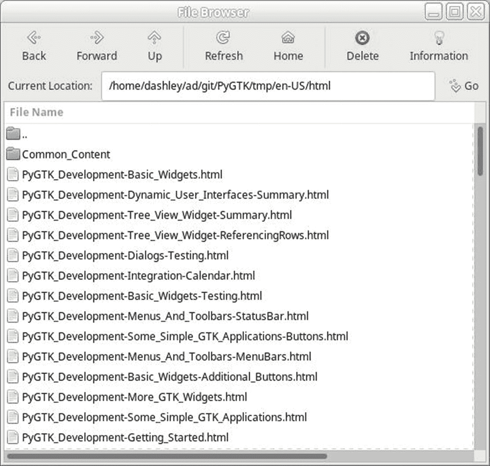
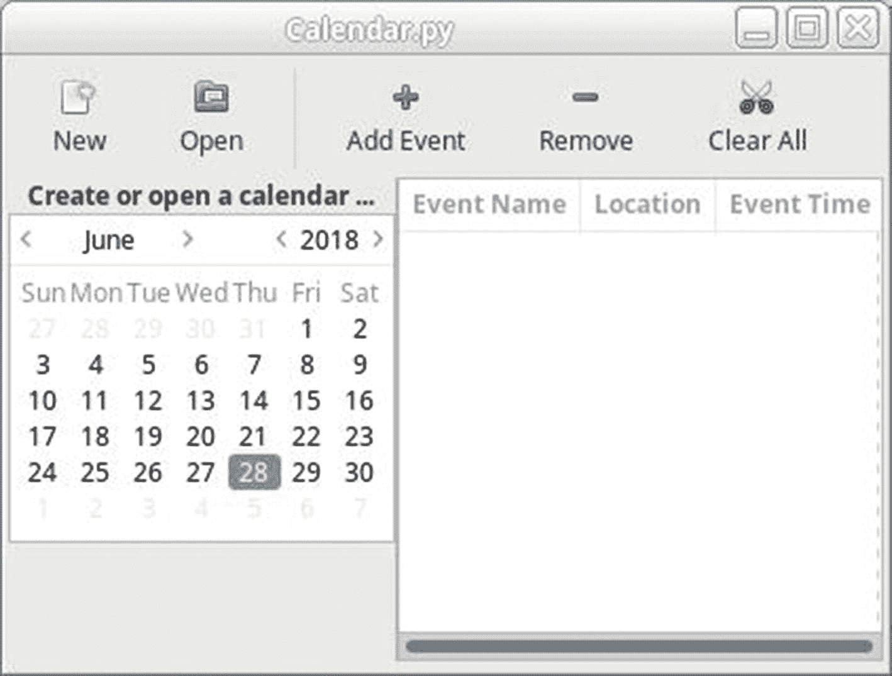

# 14.整合一切

到目前为止，您已经深入了解了使用 GTK+和相关技术可以做的一切。在本章中，我们将通过构建几个应用程序来运用这些知识。

本章介绍了五个完整的应用程序:在第 11 章中设计的文件浏览器、一个计算器、一个 ping 实用程序、一个 hangman 游戏和一个日历。然而，本章不包含示例的源代码。本章中每个应用程序的代码可以从 [`www.gtkbook.com`](http://www.gtkbook.com) 下载。

我将通过提供其他学习资源的链接来结束这本书的最后一章，这样你就可以继续扩展你的 GTK+知识。

## 文件浏览器

在第 11 章中，你在 Glade 中实现了一个文件浏览器应用程序的用户界面。用户界面动态加载，所有信号自动连接`Gtk.Builder`。

在第 [11](11.html) 章的结尾，你被告知回调方法将在这一章中实现，我们现在就要实现。图 [14-1](#Fig1) 显示了首次启动时的文件浏览器应用程序。它正在显示根文件夹。



图 14-1

使用 Gtk 的文件浏览器。TreeView

在这个应用程序中，文件浏览功能是特别重要的。它们与第 9 章[的“练习 1:文件浏览器”部分非常相似。在那个练习中，您使用一个可以浏览用户文件系统的`Gtk.TreeView`小部件创建了一个简单的应用程序。文件浏览器的当前位置存储在一个链表中，从这个链表中可以构建完整的路径。列表中的每个节点都是路径的一部分，目录分隔符放在每个字符串之间以构建完整的路径。还提供了一个`Gtk.Entry`小部件，允许用户用键盘编辑路径。](09.html)

可以使用几种不同的方法在文件系统中导航。可以在地址栏中输入位置，尽管必须在激活`Gtk.Entry`小部件时验证位置的有效性。除了这种方法之外，用户还可以使用后退、前进、向上或主工具栏按钮来分别浏览浏览历史、移动到父目录或转到主目录。最后，`Gtk.TreeView`的行激活信号允许用户移动到选定的目录或查看有关选定文件的信息。

窗口底部放置了一个`Gtk.StatusBar`小工具。它跟踪当前目录中的项目总数以及这些项目的总大小。这个例子的源代码，以及本章中的其他四个应用程序，可以从 [`www.gtkbook.com`](http://www.gtkbook.com) 下载。

## 计算器

计算器是一个简单的应用程序，在大多数 GUI 编程书籍中都有实现。这个例子旨在向您展示实现一个计算器是多么容易。图 [14-2](#Fig2) 是应用的截图。


图 14-2

一个简单的计算器应用

这个计算器应用程序是用 Glade 设计的，所以用户界面完全不用代码就可以完成。因为本例中的大多数小部件都是`Gtk.Button`小部件，所以只需要 clicked 和 destroy 信号。

该计算器允许用户输入带可选小数点的数字，执行四种基本运算(加、减、乘、除)，求数字的反，以及计算平方根和指数。为了减少所需回调方法的数量，所有的数字和小数位都被连接到一个名为`num_clicked()`的回调方法，四个基本操作和幂操作也相互连接。这允许您利用这些操作组需要大量相似代码才能工作的事实。

当单击一个数字或小数点按钮时，该字符将被追加到当前值的末尾，尽管数字的长度被限制为十位数。单击操作按钮时，执行操作，并存储新值。它还设置了一个名为`clear_flag`的标志，告诉计算器当用户按下一个数字或小数位时，应该开始一个新的数字。

## Ping 实用程序

在这个程序中，您将学习如何使用 GLib 库中的通道通过管道与应用程序进行通信。ping 实用程序显示在图 [14-3](#Fig3) 中；它允许用户 ping 一个地址特定的次数或不断，直到应用程序停止。


图 14-3

ping 实用程序应用程序

在这个应用程序中，GLib `spawn_async_with_pipes()`函数用于派生带有指定地址的 ping 应用程序实例。这个函数接收到的 shell 命令用`shell_parse_argv()`函数进行了解析，所以它的格式是正确的。Ping 按钮被禁用，这将阻止用户运行子进程的多个实例。

在生成子进程之后，输出管道用于创建一个新的通道对象，该对象监视管道读取数据。当数据准备好被读取时，它被解析，以便每个 ping 的统计数据可以显示在一个`Gtk.TreeView`小部件中。这将持续指定的次数，或者直到用户停止子对象。

当子进程正在运行时，会启用一个停止按钮，这允许用户在子进程完成之前终止它。这个函数简单地调用下面的`os.killpg()`函数的实例，强制子进程关闭。

当进程被杀死时，管道被破坏，这导致通道在 watch 函数中关闭。这确保了我们能够为下一个子流程重用同一个通道对象。

## 日历

本章的最后一个应用程序创建了一个为用户组织事件的日历。它使用`Gtk.Calendar`小部件允许用户浏览日期。`Gtk.TreeView`显示给定日期的事件。图 [14-4](#Fig4) 显示了该日历应用。



图 14-4

具有两个事件的日历应用程序

创建日历应用程序的大部分代码应该看起来非常熟悉，因为它使用了前面章节中介绍的功能。除了熟悉的功能之外，应用程序还使用 XML-SAX 提供的 XML 解析器来打开日历文件，这些文件存储为 XML 文件。清单 [14-1](#PC1) 显示了包含一个事件的示例日历文件。

```py
<calendar>
  <event>
    <name>Release of the Book</name>
    <location>Everywhere</location>
    <day>16</day>
    <month>3</month>
    <year>2007</year>
    <start>All Day</start>
    <end></end>
  </event>
</calendar>

Listing 14-1Calendar File

```

通过单击“新建”工具栏按钮创建一个新日历，该按钮要求输入日历文件名和位置。每次添加或删除事件时都会保存日历，因此不提供保存按钮。您也可以通过按下打开工具栏按钮来打开现有日历。

### 标记解析器函数

为了打开日历，这个应用程序使用 XML-SAX 的解析器来检索文件的内容。这个解析器非常容易使用，并且支持基本的 XML 文件。使用解析器需要做的第一件事是定义一个新的`xmlparser`对象。这个对象有很多属性，包括四个用户自定义函数，需要自己编码；我一次覆盖一个。这些功能中的任何一个都可以设置为`None`。

第一个方法是`StartElement()`，为每个打开的标签调用，比如<calendar>和<event>。该函数接收标记元素的名称以及属性名称和值的数组。这允许您区分起始元素，并在适当的时候检查属性。在日历应用程序中，此功能用于释放为前一个事件存储的所有临时数据，为下一个事件创建一个空白状态。</event></calendar>

```py
StartElement(name, attributes)

```

下一个方法`EndElement()`是为每个结束标记调用的，比如和。对于没有结束标签的标签也调用它，比如<tag>。与前面的方法类似，它接受标记名。在 calendar 应用程序中，如果已经到达标记，它用于将事件添加到全局树中。</tag>

```py
EndElement(name)

```

对于在`StartElement()`和`EndElement()`调用之间发现的数据，调用`CharacterData()`方法。它接受两个标记之间的文本以及文本的长度。在日历应用程序中调用这个函数来读取事件的内容。

```py
CharacterData(data)

```

### 注意

不仅包含字符串的标签会调用`CharacterData()`方法，调用其他标签的标签也会调用该方法；因此，这个函数可能有一个填充空格和换行符的文本参数！

### 解析 XML 文件

XML 文本的解析是用一个`xmlparser`对象完成的。您可以用`xml.sax.parse(filename, contenthandler)`创建一个新的解析器:

```py
xml.sax.parse(filename, contenthandler))

```

该函数创建并返回一个新的`xmlparser`对象。

XML-SAX 还可以为您处理 XML 名称空间。有关更多信息，请参见文档。

## 更多资源

恭喜你！您现在已经读完了这本书，并且您已经了解了足够的知识来开发和管理复杂的 GTK+应用程序。然而，你可能想知道你该何去何从。当您开始自己开发应用程序时，有许多库和资源将变得不可或缺。

第一个资源是该书的网站( [`www.gtkbook.com`](http://www.gtkbook.com) )。这个站点包含了 GTK +开发者在线资源的链接，以及本书不适合的主题的教程。您可以将它作为寻找 GTK+应用程序开发帮助的起点。

另一个很好的资源是 GTK+网站( [`www.gtk.org`](http://www.gtk.org) )。这个站点包括关于 GTK+的邮件列表、下载和错误跟踪的信息。您也可以在该网站上找到最新的文档。

GNOME 开发者的网站( [`http://developer.gnome.org`](http://developer.gnome.org) )也是了解更多信息的理想场所。除了 GTK+和它的支持库之外，还有许多其他的库用来为 GNOME 开发应用程序，您会不断地遇到这些库。下面的列表简要总结了其中的一些库。

*   PyGObject API Reference([`http://lazka.github.io/pgi-docs`](http://lazka.github.io/pgi-docs))是一个一站式网站，提供与 Python、GNOME、GTK+、ATK、GDK 和许多其他库相关的所有内容。

*   py cairo API Reference([`http://pycairo.readthedocs.io/en/latest/reference/index.html`](http://pycairo.readthedocs.io/en/latest/reference/index.html))中有针对 Cairo 的所有 Python APIs 的文档。

*   Python 网站( [`www.python.org`](http://www.python.org) )提供了 Python 2.x 和 3.x 所有版本的文档，其中包括参考资料、教程、操作指南、常见问题解答、PyPi 和有关 Python 软件基础的信息。

## 摘要

您已经熟悉了 GTK+的大部分内容及其支持库。这些知识可以用来为许多平台上的应用程序实现图形用户界面。

这本书旨在让您对 GTK+有一个透彻的了解，我希望在您开发应用程序时，它将继续成为一个有价值的资源。附录是 API 文档中未完全记录的主题不可或缺的参考资料；即使当你成为专家时，它们也可以被使用。最后一个附录提供了练习解决方案的简短描述和如何完成它们的提示。

既然你已经掌握了这些知识，实践和经验将帮助你成为一名优秀的图形应用程序开发人员。你已经拥有了继续独立生活所需的一切。我希望你读这本书的乐趣和我写这本书的乐趣一样多！