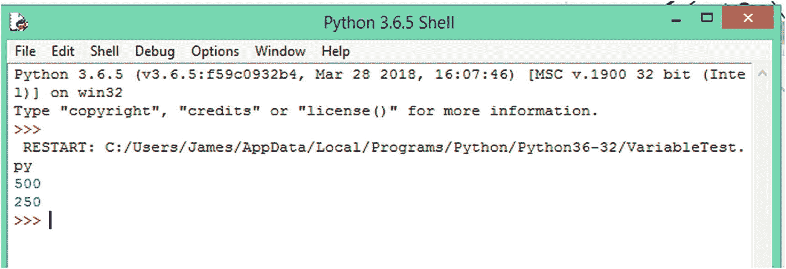
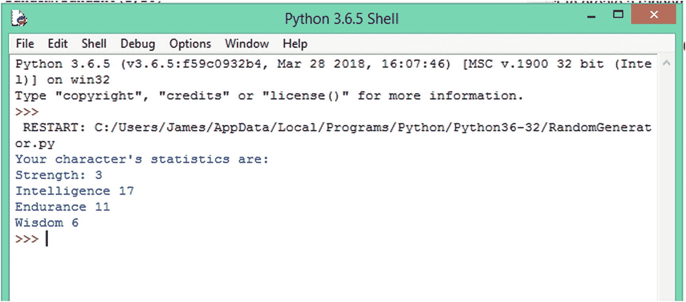

# 2.这一切都说明了

既然我们都穿上了隐喻的斗篷和超级英雄的装备(也就是说，我们已经安装了 Python 并学会了如何使用 IDLE)，是时候测试我们的新超能力了！我们的第一个恶棍？也许是有史以来最邪恶、最卑鄙、最轻蔑的野兽之一；一个学校系统的罪犯，横行无忌，威胁要摧毁——或厌烦——它所经过的每一个学生。反派的名字？

数学。

我知道，这不是最令人兴奋的话题。至少，乍一看不是。然而，事实是，数学，更重要的是，数学函数是编程世界的面包和黄油。没有数学，我们就无法做计算机和移动设备允许我们做的任何漂亮的事情。不会有电脑游戏，不会有太空飞船，不会有未来的机器人来帮助我们打扫肮脏的房间。

没有数学，我们将真正成为一个失落的文明。

因此，本章的目的将是如何使用 Python 的一些内置的*数学函数*来处理数学和创建简单或复杂的数学方程。

类似于我们在第 [1](01.html) 章中学到的 print()函数，我们将要讨论的数学函数将让我们对数据执行预先构建的操作，而不必编写应用程序的公共元素。所以，举个例子，而不是写一大堆代码向计算机解释什么是加法，如何实际相加数字(记住，计算机只能做我们告诉它的事情；它不能独立思考——至少现在不能！)，如果我们从头开始，这将需要数千行代码，我们所要做的就是键入一些简单的内容，例如:

```py
1+1

```

继续——将它输入 Python shell。当你这样做时，它应该忠实地返回答案:2。

就像你在学校学到的数学一样，Python 天生就能理解基本的数学函数。如果你看到这个:8/2，你的大脑*知道*这个等式涉及除法。如果看到+符号，很明显是加法，a -表示减法。Python 也理解这些符号，并将基于它们执行数学运算。尝试在 Python shell 中键入以下内容:

```py
2+2-1

```

在这个实例中，Python 将返回 3，表明它能够理解常见的*数学运算符*。Python 中的运算符包括:+、-和/-等等。

乘法怎么样？键入以下内容:

```py
2x2

```

那里发生了什么？程序没有像我们预期的那样返回 4。相反，它返回了一个*语法错误*:无效语法异常。SyntaxErrors 意味着您输入到 shell 或 Python 文件中的语法(即书面文本)有问题，导致程序无法正常运行。

换句话说，Python 不懂你。

这里，解决方案很简单:在 Python 中，乘法运算符不是“x”，而是一个星号(*)。要修复我们的语法错误，我们所要做的就是用正确的乘法运算符替换错误的乘法运算符，就像这样:

```py
2*2

```

现在，如果你输入，它将返回预期的响应——数字 4。

## 运算符优先级

邪恶的反派数学的超能力之一就是用看起来太难把握的概念来迷惑我们。不要害怕！凭借我们超级英雄的计算能力，即使是最复杂的数学谜语也难不倒我们。

不是说它不会尝试，请注意！

在 Python 中执行计算时，我们必须时刻注意一个叫做*操作符优先级*的东西。这只是对 Python 处理数学问题的顺序的一种想象。某些运算符的优先级比其他运算符高，这意味着它们排在第一位。可以想象，这可能会让程序员感到困惑，即使是最有经验的老手也会在输入计算时出错。

为了让您更清楚地了解运算符优先级是如何工作的，下面是 Python 中的一个运算符列表，按照优先级或等式中谁先开始排序。注意:其中一些操作符可能对您来说并不熟悉——现在不要太担心；我们将在本书中详细介绍它们。

*   **(取幂运算)

*   *、/(乘法和除法)

*   +，-(加法和减法)

*   在，不在，是，不是，，> =，！=，==(这些被称为比较，允许您将一个值与另一个值进行比较)

*   不是 x

*   单位

*   或者

*   语句

为了简单起见，让我们使用基本运算符:*、/、+和-(乘法、除法、加法和减法)。在您的 shell 中键入以下内容:

```py
10+10 * 20

```

在这个等式中，我们在问 10 *加上* 10 乘以 20 的值是多少。通常，我们认为答案应该是 400，因为第一个值 10 加 10 应该等于 20。然后，我们将答案(20)乘以 20，得到 400。然而，当我们在 shell 中输入代码时，我们得到了一个令人惊讶的结果，如图 [2-1](#Fig1) 所示。


图 2-1。

运算符优先级示例

你的第一个想法可能是:Python 数学不好吗？怎么得出的答案:210？出现这种情况是因为运算符优先级。请记住，在我们的运算符优先级列表中，乘法优先于加法。因此，Python *首先对乘法*的*求值*，然后进行数学运算。在这个例子中，Python 是这样看待我们的等式的:20 * 10 + 10。

我知道你在想什么:我头疼。

乍一看，这似乎令人困惑，但幸运的是，有一个简单的解决方案。我们可以通过使用括号来强制 Python 使用一个*求值顺序*——执行计算的顺序。这有两个效果:首先，它确保 Python 执行我们想要的计算，并且不会混淆我们的优先级。第二，它让其他程序员看一眼就知道你真正想要的是什么。

让我们试一试。在您的 shell 中键入以下内容:

```py
(10+10)  * 20

```

如图 [2-2](#Fig2) 所示，现在我们得到了想要的结果。通过将(10+10)放在括号内，我们告诉 Python——以及其他编码人员——我们打算首先执行等式的这一部分(见图 [2-2](#Fig2) )。


图 2-2。

使用括号强制排序的运算符优先级示例

让事情变得稍微复杂一点，我们还可以做一些被称为*嵌套*的事情。这意味着您将圆括号*放在其他圆括号的*内，以进一步指示应该执行什么顺序计算。在这种情况下，首先计算最里面的括号，然后是最外面的，然后是等式的其余部分。考虑一下这个:

```py
((10+5) * 10) / 2

```

如果您将该等式输入 Python，它将按照以下方式执行求值顺序:

*   十加五等于十五

*   15 * 10 等于 150

*   150 / 2 等于 75

然而，如果我们不使用括号，Python 会这样理解:

10 + 5 * 10 / 2

或者

*   10 / 2 等于 5

*   5 * 5 等于 25

*   25 + 10 等于 35

这也是因为在考虑运算符优先级时，Python 在加法和减法之前执行乘法和除法*。*

所以，为了避免任何混淆，除了简单的数学运算之外，在执行任何运算时都要使用括号。

## 数据类型:了解你的敌人

超级恶棍有各种形状和大小。你有你的邪恶科学家，一心想用死光和转基因大猩猩毁灭世界；有邪恶的绿色的，荡漾着肌肉和充满愤怒，因为...嗯，没有真正的好理由。还有一些人一直在笑，尽管没有人讲过一个笑话。

有成千上万种类型的恶棍，作为一个初出茅庐的超级英雄，你可以打赌很难让他们都井然有序。Mindblower 先生是一个超级聪明的人，还是一个被人误解的无法统一行动的恶棍？神秘的斯蒂芬·金刚(Stephen King Kong)——半大猩猩半恐怖的作家——他到底是什么？他是怎么用大猩猩的大指关节写出这么多书的？

这足以让你失去理智。

还是那个吹牛老爹又在工作了？

幸运的是，有一种方法可以让所有这些恶棍组织起来。这叫做原型。

在 Python 中，我们也有类似的问题。有各种各样的数据在流动。首先我们有数字和文字。更糟糕的是，我们有不同类型的数字。有常规数字，有带小数的数字，还有代表时间或金钱的数字。甚至有一些数字的行为方式与单词的行为方式相同。

幸运的是，在 Python 中有一种叫做数据类型的东西。这些是定义或分类你输入到程序中的数据类型的方法。虽然这似乎应该是常识——有时确实如此——但事实是，Python 只知道您告诉它知道的东西。所有的计算机语言都是如此。事实上，所有的计算机语言都有数据类型，就像 Python 一样，所以数据类型的概念是你在学习其他语言时可以随身携带的。

我们将在本书中讨论几种数据类型的形式，但在本章中，我们将集中讨论一个特定的集合:数字。

一般来说，Python 将数字识别为数字，但是，正如您所想象的，并不是所有的数字都是平等的。简单来说，现在，你看到的任何一个整数或者没有小数点的数字都叫做整数。整数包括 0、2、5、10、100、1000、1032 等数字。

尝试以下代码:

```py
print(122)

```

您的结果应该是这样的(参见图 [2-3](#Fig3) ):


图 2-3。

打印整数

正如我们前面看到的，整数不仅仅是打印到用户的屏幕上——我们还可以进行计算。让我们试试下面的方法:

```py
print(5/2)

```

这段代码运行时会发生一些有趣的事情，如图 [2-4](#Fig4) 所示:


图 2-4。

在 print()函数中执行数学运算

返回的数字不符合整数的标准，尽管我们对两个整数执行了数学运算。每当一个数字有小数时，它就不再被认为是整数数据类型；相反，它是一个浮点数。

正如我们可以在整数上执行等式一样，我们也可以在浮点数上执行等式。我们在图 [2-5](#Fig5) 中展示了一个例子:


图 2-5。

浮点数据类型

当一个 float 被添加到另一个 float 时，结果是另一个 float。即使这个数字看起来应该是一个整数，也是如此。比如我问 2.5 + 2.5 的结果，你大概会回答:5。让我们看看 Python 对此有什么看法:

从图 [2-6](#Fig6) 中可以看到，Python 做了一些我们可能没有预料到的事情:它返回了 5.0——一个浮点数。


图 2-6。

在两个浮点数上执行数学运算

虽然这是一个合适的结果，但我们可能会发现自己处于需要更改数字的数据类型的情况。例如，我们可能有一个程序，其中我们不想显示小数点或想四舍五入我们的数字。在这种情况下，一种选择是转换我们的数字。

然而，在我们了解这一点之前，让我们再尝试一件事。当我们对一个整数和一个浮点数执行数学运算时会发生什么？尝试以下操作(参见图 [2-7](#Fig7) ):


图 2-7。

从整数中减去浮点数的结果

```py
print(5 - 2.5)

```

你的结果应该是:

任何时候你对一个整数和一个浮点数执行数学运算，结果都是一个浮点数。

## 转换数字数据类型

我们要学习的第一件事是如何将一个整数转换成一个浮点数。在前面的例子中，我们使用了一个简单的方法将整数转换成浮点数:除法。我们可以实现相同效果的另一种方法是使用 Python 的内置函数之一，称为`float()`。

使用`float()`非常简单——你所要做的就是把你想要转换的整数放在括号()内。让我们试一试！

```py
float(12)

```

如果您在 Python Shell 中键入该内容，将会得到以下结果:


图 2-8。

将整数转换为浮点数

如图 [2-8](#Fig8) 所示，你的结果应该是 *12.0* (而不是仅仅常规的没有小数点的 12)。

要做相反的事情——将浮点数转换成整数——我们使用 Python 的另一个超级方便的内置函数。请看，`int()`！

功能`int()`的工作原理与`float()`相同。只需在括号中输入你想要转换的数字，Python 就会完成剩下的工作。尝试一下:

```py
int(12.0)

```

这将返回:


图 2-9。

将浮点数转换为整数

如图 [2-9](#Fig9) 所示，我们取了一个浮点数——12.0——并通过去掉小数点将其转换为整数 12。

如果我们有一个不以. 0 结尾的浮点数会怎么样？让我们通过一个简单的测试来了解一下。在您的 Python Shell 中键入以下内容:

```py
int(12.6)

```

当你按下回车键，你会得到结果:12。为什么不是 13？当您将浮点数转换为整数时，Python 会删除小数点后的所有内容并忽略它。如果你想向上取整(或向下取整)，你需要使用一个不同的函数，我们将在本书的后面介绍。

有许多数据类型可以转换成其他数据类型，我们将在本书中介绍其余的数据类型。然而现在，给自己一点掌声吧——你的武器库中又增加了两个新的超级能力:`int()`和`float()`函数！

## 什么是变量？

到目前为止，我们已经学习了一些基本的数学运算符和函数，可以用来将数据类型从一种转换为另一种。然而，为了让我们拥有真正的力量，我们需要了解一种被称为*变量*的秘密武器。

有几种简单的方法可以让变量变得更容易理解。一种方法是把它们想象成一个盒子，你可以在里面存放东西。在我们的例子中，我们存储的是数据。这些数据可以是数字，可以是文本，可以是货币价值，可以是你的狗的名字，可以是一段文字，也可以是你秘密巢穴的安全密码。

变量在 Python 和其他编程语言中有许多功能。变量的最大用途之一是存储信息，这样我们就不必一遍又一遍地不断输入信息。例如，您可能有一长串经常使用的数字。不用每次需要的时候都输入这个长长的列表，你可以把它存储在一个变量中，然后调用这个变量。

要使用一个变量，你只需要给它一个名字，然后定义它的值。例如:

```py
a = 8675309

```

这段代码创建变量名“a”，然后给它赋值，在本例中是 8675309。

当然，存储数据是一回事；使用这些数据是另一回事。让我们继续创建一个简单的程序，它将为两个变量提供一些数据，然后将其打印到用户的屏幕上。还记得如何从我们的第一个程序示例中创建新的 Python 文件吗？在 Python Shell 中，点击*文件*，然后*新建文件*。将弹出一个新窗口。在新窗口中输入以下代码:

```py
a = 500
b = 250
print(a)
print(b)

```

接下来，点击*文件*，然后*保存*。将文件命名为 *VariableTest.py* 。要查看运行中的代码，请单击*运行*，然后单击*运行模块。*

代码将在 Python Shell 中运行，如图 [2-10](#Fig10) 所示:



图 2-10。

打印两个变量的值

如你所见，我们给变量 a 赋值 500，然后给变量 b 赋值 250。然后，使用 print 函数，我们打印出两个变量的值。现在来点真正的乐趣吧！

公平地说，打印出变量的值相当无聊。然而，打印并不是我们可以对变量做的唯一事情。让我们修改 VariableTest.py 的代码。将以下代码添加到文件中，使其看起来像这样:

```py
a = 500
b = 250
print(a)
print(b)

print(a+b)

```

保存文件，然后再次运行以查看结果，结果应与图 [2-11](#Fig11) 相匹配:


图 2-11。

显示了添加和打印两个变量的结果

这里，我们创建了两个变量，并给它们赋值，就像之前一样。我们还把它们打印了出来。然而，这次我们也对它们进行了一些数学运算，并打印出了结果。行中的代码:print(a +b)告诉 Python 打印 print()函数的括号()内的任何内容——在本例中，我们说打印等式(a) + (b ),即 750。

请注意，这个*不会*改变变量“a”或“b”中的数据值——它只是使用它们执行数学运算。要更改变量内部的数据，我们有几个不同的选项。让我们创建一个新文件，并将其命名为 VariableChange.py。

```py
a=500
b=250

a=a+b

print(a)

```

运行代码查看结果(如图 [2-12](#Fig12) 所示):


图 2-12

将两个变量的结果赋给一个变量

这里发生了什么？首先，我们命名并定义了变量“a”和“b”的值。然后，我们将两个变量的值相加，并重新分配变量“a”的值，以匹配该方程的结果。然后，我们打印出变量“a”来显示新值，即 750。

当我们输入 a=时，我们告诉 Python 将“a”的值改为等号(=)后面的值。接下来，Python 将“a”和“b”相加，并将该值赋回“a”。等号(=)被称为*赋值运算符*。

如果我们不想改变变量“a”的值，我们也可以创建一个全新的变量。让我们修改 VariableChange.py 中的代码，使其符合以下内容:

```py
a=500
b=250

c=a+b

print(c)

```

这一次，我们没有改变“a”的值，而是简单地创建了一个新变量“c”，并赋予它“a”+“b”的值，然后打印出“c”的内容。

## 超级英雄发电机 3000

现在我们已经有了一些代码经验，让我们用它来构建我们将在本书结束时创建的程序的基础。该计划将是一个超级英雄生成器，让用户创建英雄(或恶棍)完成统计数据，随机名称，随机生成的权力和统计数据。

下面的一些代码将向我们的程序添加文本，我们将在第 [3](03.html) 章中详细介绍。现在，我们将只使用这些文本作为标签，所以你理解代码应该没有问题。

每个英雄都有一定的身体和精神属性。如果你以前玩过角色扮演游戏——或者 RPGs 那么你应该对这个概念很熟悉。如果没有，不用担心！看看你周围的人，观察他们。举例来说，你的体育教练可能有肌肉，而且身材很好。这意味着他比你的科学老师更有力量和耐力。

另一方面，你的科学老师可能比你的体育教练更聪明、更有智慧，这意味着他有更多的*智力*和*智慧*。让我们从这些属性开始，作为我们的前四个统计数据。我们可以在以后添加更多。

为了确定每个值，我们需要指定一个从低到高的范围。我们现在可以使用 0-20 的范围，0 代表低，20 代表高。所以，如果我们讨论的是力量，那么 0 代表非常弱，20 代表大力士。因此，平均值为 10。

同样，对于智力，我们可以说 0 是门把手(因此有“像门把手一样笨”的说法)，20 是阿尔伯特·爱因斯坦。任何在 10 分范围内的人都被认为智力一般。

现在，我们可以允许玩家设置他们自己的属性分数，但是，我们知道每个人都会把他们设置为 20，成为最强壮，最聪明的人。虽然这确实完美地定义了你和我，但其他凡人达不到这些高标准。

相反，我们想要做的是随机地给它们的属性赋值*。Python 能够使用一个名为`random()`的函数非常容易地创建随机数。*

 *使用`random()`和其他函数有点不同。要使用它，我们首先要把它`import`成 Python。我们用一行简单的代码做到了这一点:

```py
import random

```

`random()`函数像其他函数一样工作，因为您可以将参数赋给它的括号。创建名为 RandomGenerator.py 的新 Python 文件，并输入以下代码:

```py
import random

strength = random.randint(1,20)

print(strength)

```

在这段代码中，我们首先导入 random()模块，然后创建一个名为“strength”的变量。关于变量有一点需要注意。在编程界有一种叫做*命名约定*的东西。这意味着在给事物命名时，你应该遵循某些“规则”。对于一个变量，你总是想给它们起一个名字，让你或未来的程序员知道变量中保存的是什么类型的数据。例如，将一个变量命名为“a ”,并不能给我们提供多少信息。将其命名为“强度”告诉我们里面的数据到底是干什么用的。

如果您的变量名中有多个单词，请始终将它们作为一个单词，只需将第二个单词的第一个字母大写。例如，如果我们的变量是“英雄强度”，我们会将其命名为 Hero Strength。如果是“英雄力量统计”，我们会用 heroStrengthStats。

第二条经验法则是尽可能保持简洁。记住，变量是用来节省输入代码的时间的，所以长名字会使目的落空。

回到代码…

在创建了我们的变量“强度”之后，我们想给它赋值。代码的下一部分调用 random()模块，并使用一个名为`randint`的属性。Randint 是 random()的一部分，它告诉 Python 不仅要创建一个随机数，还要创建一个随机整数。我们放在括号中的值是随机数的范围。记住，我们希望我们的统计范围在 1 到 20 之间，因此，我们输入的值是(1，20)。

尝试多次运行 RandomGenerator.py 中的代码。每次都应该得到一个随机数:

现在我们已经有了我们的随机数生成器，并且了解了如何使用它，让我们添加一些更多的统计数据:

```py
import random

strength = random.randint(1,20)
intelligence = random.randint(1,20)
endurance = random.randint(1,20)
wisdom = random.randint(1,20)

```

接下来，我们需要将这些值打印到屏幕上进行测试。为此，我们将使用一些文本作为标签，然后在标签后打印每个变量的值。在变量后添加以下代码:

```py
print("Your character's statistics are:")
print("Strength:", strength)
print("Intelligence", intelligence)
print("Endurance", endurance)
print("Wisdom", wisdom)

```

这里我们遇到了 print()函数的不同用法。之前，我们使用 print()打印数字和变量。然而，现在我们使用一种新的数据类型，称为*字符串*。字符串就是文本。它可以包含任何字母、特殊字符(！、@、#、$、%、^、&、*、-、+、=等。)，以及任何数字。但是，要将其视为文本，它的*必须*放在引号" "之间。如果不是，Python 会把它解释成别的东西。现在不要太担心这个——我们会在第三章[中详细讨论。现在，让我们检查一行代码:](03.html)

```py
print("Your character's statistics are:")

```

这段代码实际上告诉计算机将“你的角色的统计数据是:”打印到屏幕上。

下一条指令略有不同:

```py
print("Strength:", strength)

```

这个 print()函数做两件事。首先，它说打印括号之间的文本:“强度:”。然后，我们添加一个逗号(，)，告诉 Python 对 print()函数有进一步的说明。接下来，我们包括我们想要打印其内容的变量的名称——在本例中，变量 *strength* 。请注意，变量不在引号中。如果是，它将只打印单词“strength ”,而不是名为 strength 的变量的内容。

现在，您的 RandomGenerator.py 文件应该如下所示:

```py
import random

strength = random.randint(1,20)
intelligence = random.randint(1,20)
endurance = random.randint(1,20)
wisdom = random.randint(1,20)

print("Your character's statistics are:")
print("Strength:", strength)
print("Intelligence", intelligence)
print("Endurance", endurance)
print("Wisdom", wisdom)

```

让我们运行几次代码。请记住，我们的程序创建随机生成的数字，因此每次执行代码时，结果都会有所不同。图 [2-13](#Fig13) 显示了它应该看起来的样子:



图 2-13。

生成随机统计数据

恭喜您，您刚刚创建了超级英雄生成器 3000 应用程序的开始部分！

## 在这一集里！

在这激动人心的一集里，我们涉及了很多内容。你开始只是一个年轻的助手，但是你的力量正在稳步增长！很快你就会从神奇小子变成…神奇侠？我不知道——我们会想出名字的。真正重要的是，你已经像超级英雄一样迈出了编码之路的第一步。

前方有什么危险？下一章，我们将看看如何处理文本，并继续构建我们的超级英雄生成器 3000 应用程序。我们也将开始记录和评论我们的工作，如果你希望成为其中一个伟大的人，这是一个强制性的编程练习！

在我们继续之前，让我们先看看在这一期中我们学到了什么:

*   数据类型:数据类型存在于所有编程语言中，有助于定义程序处理的数据种类。integer–或 int–是整数的数据类型，而 float 是浮点数或带小数的数字的数据类型。

*   运算符优先级:在执行等式时，某些运算符优先于其他运算符。

*   运算符:常见的运算符有+(加)、-(减)、*(乘)、和/(除)。

*   赋值操作符:等号(=)是一个赋值操作符，允许你给一个变量赋值。

*   运算顺序:数学运算的执行顺序称为运算顺序。我们可以通过在括号中封装部分来控制在一个等式中首先执行哪种数学运算。例如:(1+1) * 10 确保 1+1 在乘法之前执行，尽管事实上乘法的运算符优先级高于加法。

*   转换数据类型:int()和 float()分别允许我们将浮点数转换为整数，将整数转换为浮点数。

*   变量:变量是数据的存储单位。您也可以将它们视为指向数据位置的标签，但是将它们视为可以包含一条信息的盒子可能更容易。我们通过命名变量并用赋值操作符给它们赋值来创建变量。比如:a = 12。

*   命名约定:命名约定是一些松散的规则，有助于简化编码——对于你和任何将来阅读你的代码的程序员。请将它们视为“最佳实践”例如，在给一个变量命名时，第一个单词总是用小写字母，后面的任何单词都用大写字母。一定要把多个单词组合成一个单词。比如:socialSecurity 好。社会保障不好，会导致语法错误。此外，尽量用简短的名称命名变量，以描述变量中的数据的用途。

*   random()和 randint(): random()是一个可以生成随机数的模块。您必须使用代码 import random 将它导入到您的程序中。要随机生成具有给定数字范围的整数，请分别键入 random.randint(1，20)或 random.randint(5，100 )(如果要随机生成 1 到 20 或 5 到 100 的数字)。如果您想生成 0 到 20 之间的数字，您必须在代码中指定，例如:random.randint(0，20)。*